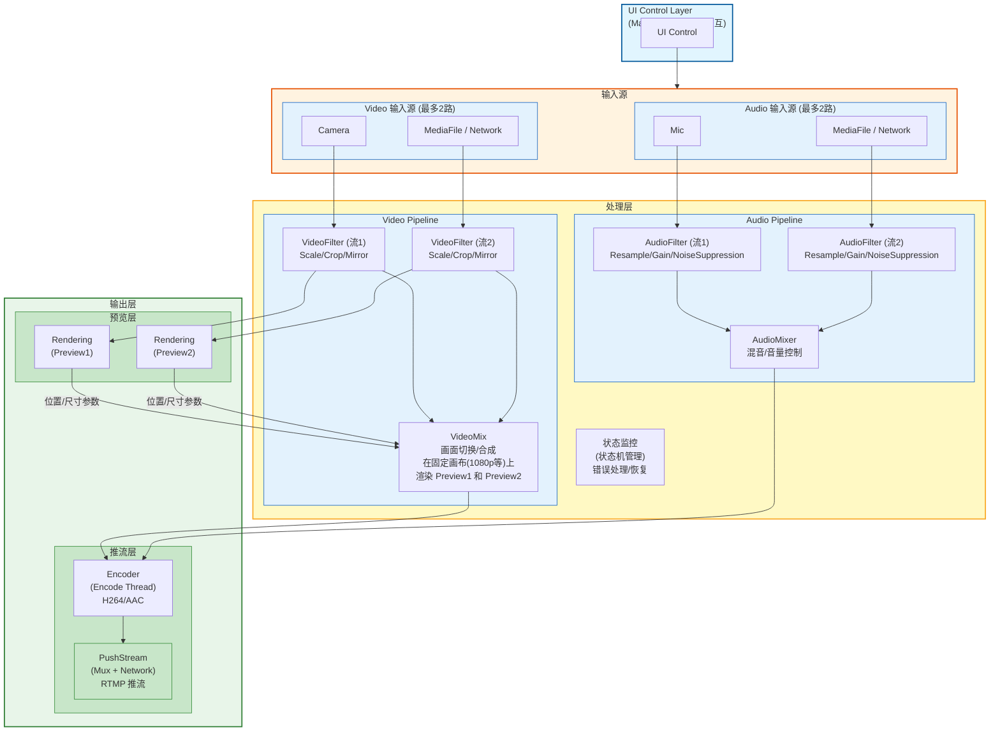
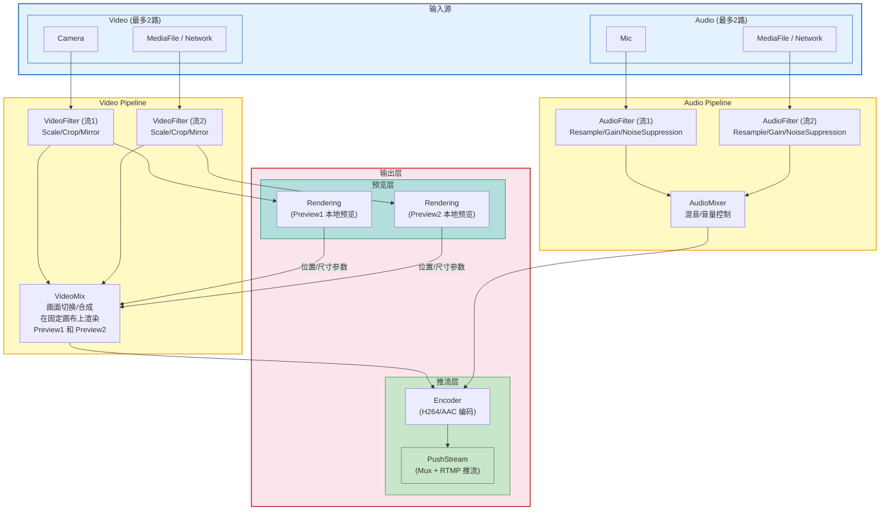
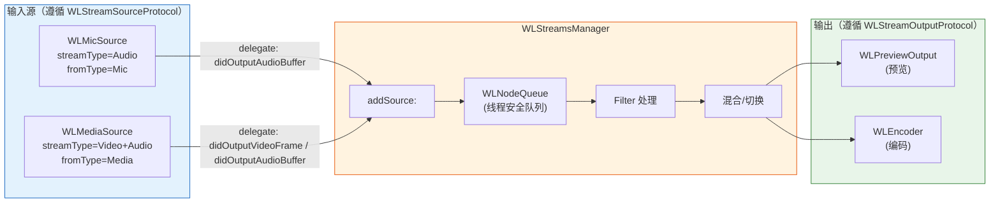

# WorkLabs 多路流推流系统 - 详细实施计划

## 1. 项目背景与目标

### 1.1 业务需求
开发类似 OBS 的多路流输入系统，支持将多路视频/音频流合并为一路流，推送到社交平台（抖音、快手、B站等）。

**核心限制**：
- **Video 输入**：最多同时支持 **2 路视频流**
- **Audio 输入**：最多同时支持 **2 路音频流**

> 说明：本系统设计为轻量级推流工具，不同于 OBS 支持无限多路源的场景。限制在 2 路以内可以简化混合逻辑、降低系统开销、保证实时性能。

### 1.2 输入源定义

#### Video 输入源（最多 2 路，其中一路必为 Camera）：
- **Camera 流**：实时摄像头采集（WLCameraSource）
- **本地视频流**：通过 FFmpeg 解码本地媒体文件（WLMediaSource）
- **网络拉取流**：从网络拉取的 RTMP/RTSP/HLS 流（WLNetWorkSource）
- **屏幕采集流**：系统屏幕采集（WLScreenCaptureSource，后续扩展）

#### Audio 输入源（最多 2 路，其中一路必为 Mic）：
- **本地麦克风**：实时音频采集
- **本地视频流中的音频**：媒体文件的音轨
- **网络拉取流的音频**：网络流的音频轨道

### 1.3 核心约束条件
- 若同时存在两路 Video 流，**其中一路必须为 Camera 流**
- 若同时存在两路 Audio 流，**其中一路必须为 Mic 流**

---

## 2. 系统架构设计

### 2.1 总体架构图



### 2.2 数据流向说明



### 2.3 Preview 渲染管线
下图展示了从输入源到最终推流的完整数据流架构，包含双路视频预览、画面合成、编码和推流的全链路：

```mermaid
flowchart LR
    subgraph Sources["输入源"]
        direction TB
        MediaSource["MediaSource<br/>(FFmpeg解码)"]
        CameraSource["CameraSource<br/>(实时采集)"]
    end

    subgraph Filters["Filter 预处理层"]
        direction TB
        Filter1["filter<br/>(缩放/裁剪/镜像)"]
        Filter2["filter<br/>(缩放/裁剪/镜像)"]
    end

    subgraph Controller["WLStreamViewController<br/>(流视觉控制器)"]
        direction TB
        DisplayArea["显示画面"]
        Preview1["Preview1<br/>(Stream 1)"]
        Preview2["Preview2<br/>(Stream 2)"]
        MainPreview["Main Preview<br/>(Main Stream)"]
    end

    subgraph MixProcess["画面合成"]
        MixFilter["filter<br/>(画面合并)"]
    end

    subgraph PostFilter["后处理 filter"]
        FinalFilter["filter<br/>(最终处理)"]
    end

    subgraph EncodePush["编码与推流"]
        Encoder["Encoder<br/>(H264/HEVC编码)"]
        PushStream["PushStream<br/>(RTMP推流)"]
    end

    MediaSource --> Filter1
    CameraSource --> Filter2
    
    Filter1 -- "Stream 1" --> MixProcess
    Filter2 -- "Stream 2" --> MixProcess
    
    Filter1 -. "Stream 1" .-> Controller
    Filter2 -. "Stream 2" .-> Controller
    
    MixFilter --> FinalFilter
    FinalFilter -. "Main Stream" .-> Controller
    FinalFilter --> Encoder
    Encoder --> PushStream
    
    Controller -. "位置/尺寸参数" .-> MixProcess

    style Sources fill:#4fc3f7,stroke:#0277bd,stroke-width:2px,color:#000
    style MediaSource fill:#4fc3f7,stroke:#0277bd,stroke-width:1px,color:#000
    style CameraSource fill:#4fc3f7,stroke:#0277bd,stroke-width:1px,color:#000
    style Filters fill:#ffa726,stroke:#e65100,stroke-width:2px,color:#000
    style Filter1 fill:#ffa726,stroke:#e65100,stroke-width:1px,color:#000
    style Filter2 fill:#ffa726,stroke:#e65100,stroke-width:1px,color:#000
    style Controller fill:#ffee58,stroke:#f9a825,stroke-width:2px,color:#000
    style DisplayArea fill:#fff59d,stroke:#f9a825,stroke-width:1px,color:#000
    style Preview1 fill:#fff59d,stroke:#f9a825,stroke-width:1px,color:#000
    style Preview2 fill:#fff59d,stroke:#f9a825,stroke-width:1px,color:#000
    style MixProcess fill:#ffa726,stroke:#e65100,stroke-width:2px,color:#000
    style MixFilter fill:#ffa726,stroke:#e65100,stroke-width:1px,color:#000
    style PostFilter fill:#ffa726,stroke:#e65100,stroke-width:2px,color:#000
    style FinalFilter fill:#ffa726,stroke:#e65100,stroke-width:1px,color:#000
    style EncodePush fill:#f06292,stroke:#c2185b,stroke-width:2px,color:#000
    style Encoder fill:#f06292,stroke:#c2185b,stroke-width:1px,color:#000
    style PushStream fill:#66bb6a,stroke:#2e7d32,stroke-width:2px,color:#000
```



**流程说明**：

| 阶段 | 组件 | 功能 | 数据格式 |
|------|------|------|----------|
| **输入源** | MediaSource / CameraSource | 提供原始视频帧 | `CVPixelBufferRef` |
| **预处理** | filter (×2) | 对每路流独立进行缩放、裁剪、镜像等处理，处理后的流同时输出到预览和合成 | `CVPixelBufferRef` |
| **预览显示** | WLStreamViewController | 接收 Filter 处理后的 Stream 1 和 Stream 2，实时显示给用户预览（Preview1 / Preview2），支持切换显示 Main Preview | `CMSampleBufferRef` |
| **画面合成** | filter (画面合并) | 接收两路 Filter 输出的 Stream 1 和 Stream 2，根据 WLStreamViewController 反馈的位置/尺寸参数进行合成（画中画/分屏等布局） | `CVPixelBufferRef` |
| **后处理** | filter (最终处理) | 对合成后的画面进行最终处理（如美颜、水印等），输出 Main Stream | `CVPixelBufferRef` |
| **编码** | Encoder | 将最终处理后的帧编码为 H264 视频 + AAC 音频 | 压缩码流 |
| **推流** | PushStream | 封装为 RTMP/flv 格式并推送到服务器 | 网络包 |

**关键设计点**：
- ✅ **双路并行处理**：MediaSource 和 CameraSource 各自经过独立的 Filter 预处理
- ✅ **分流输出**：Filter 处理后的 Stream 同时输出到两路——① WLStreamViewController 预览显示 ② filter(画面合并) 合成推流
- ✅ **三画面预览**：WLStreamViewController 提供 Preview1（Stream 1）、Preview2（Stream 2）、Main Preview（Main Stream），用户可自由切换
- ✅ **交互反馈**：用户在 WLStreamViewController 中拖动/缩放 Preview1/Preview2 时，位置/尺寸参数实时反馈给 filter(画面合并)，确保合成布局与预览一致
- ✅ **后处理链路**：合成后的画面经过最终 filter 处理（美颜、水印等），同时输出到 Main Preview 预览和 Encoder 编码
- ✅ **统一合成输出**：两路 Stream 在 `filter(画面合并)` 节点进行合成，确保推流内容的一致性
- ✅ **流水线架构**：清晰的数据流向，便于调试和性能优化

---

## 3. 详细模块设计

### 3.1 WLMediaSource（✅ 已适配新协议）

**职责**：FFmpeg 媒体文件解码器

**线程模型**：
- Parse Thread：读取 packets
- Video Decode Thread：解码视频帧
- Audio Decode Thread：解码音频帧
- Video Render Thread：通过 delegate 输出视频帧（CVPixelBufferRef + pts）
- Audio Render Thread：通过 delegate 输出音频帧（CMSampleBufferRef）

**接口**：
```objc
@interface WLMediaSource : NSObject <WLStreamSourceProtocol>
- (instancetype)initWithPath:(NSString *)path;
// streamType = WLNodeTypeVideo
// fromType = WLFromTypeMedia
@end
```

**数据流**：
```
parseThread → videoPacketQueue → videoDecodeThread → videoFrameQueue → videoRenderThread → delegate didOutputVideoFrame:
parseThread → audioPacketQueue → audioDecodeThread → audioFrameQueue → audioRenderThread → delegate didOutputAudioBuffer:
```

> WLMediaSource 已遵循 `WLStreamSourceProtocol`，可通过 delegate 独立输出帧数据，无需依赖 WLStreamsManager。

### 3.2 WLCameraSource（待实现）

**职责**：摄像头实时采集

**技术方案**：
- 使用 `AVCaptureSession` 封装（复用现有 WLVideoManager）
- 输出 `CMSampleBufferRef` 或转换为 `CVPixelBufferRef`

**关键点**：
- 支持前后摄像头切换
- 支持分辨率/帧率配置
- 处理摄像头被抢占的情况

**伪代码**：
```objc
@interface WLCameraSource : NSObject <WLStreamSourceProtocol>
@property (nonatomic, assign) CGSize captureResolution;
@property (nonatomic, assign) NSInteger frameRate;

- (void)startCapture;
- (void)stopCapture;
- (void)switchCamera;
@end
```

> WLCameraSource 遵循 `WLStreamSourceProtocol`，`streamType` 为 `WLNodeTypeVideo`，`fromType` 为 `WLFromTypeCamera`。通过 delegate 回调将采集的帧推送给 WLStreamsManager。

### 3.3 Audio 输入源详细实施方案

#### 现状

| 音频输入源 | 状态 | 优先级 |
|-----------|------|--------|
| 本地视频流音频 (WLMediaSource) | ✅ 已完成 | - |
| 本地麦克风 | ❌ 待实现 | 🔴 最高 |
| 网络拉流音频 (WLNetWorkSource) | ❌ 未开始 | 🟡 Phase 3 |

---

#### 🎤 **WLMicSource 实现**

**技术方案**：`AVCaptureSession` + `AVCaptureAudioDataOutput`

**伪代码**：
```objc
@interface WLMicSource : NSObject <WLStreamSourceProtocol, AVCaptureAudioDataOutputSampleBufferDelegate>
// streamType = WLNodeTypeAudio, fromType = WLFromTypeMic
@property (nonatomic, assign) float volume;
@property (nonatomic, assign) BOOL enableAutomaticGainControl;
- (instancetype)initWithDevice:(nullable AVCaptureDevice *)device;
@end

// start: 检查权限 → 配置 AVCaptureSession → startRunning
// stop: stopRunning → delegate sourceDidStop:
// captureOutput:didOutputSampleBuffer: → CFRetain → dispatch_async(main) → delegate didOutputAudioBuffer: → CFRelease
```

**关键点**：串行队列处理回调、CMSampleBufferRef retain/release、权限检查

---

#### 🔗 **Phase 3: 集成到 WLStreamsManager**

##### **数据流向图**



##### **集成伪代码**

```objc
// WLStreamsManager 核心流程
- (void)addSource:(id<WLStreamSourceProtocol>)source {
    source.delegate = self;
    [self.sources addObject:source];
}

// delegate 回调 → 包装为 WLNode → 入队
- (void)source:(id<WLStreamSourceProtocol>)source
    didOutputVideoFrame:(CVPixelBufferRef)pixelBuffer pts:(Float64)pts {
    WLNode *node = /* 包装 pixelBuffer, pts, source.fromType */;
    [self.videoQueue enQueue:node];
}

// 内部消费线程：出队 → Filter → Mix → Output
- (void)mixThread {
    WLNode *node = [self.videoQueue deQueue];
    CVPixelBufferRef processed = [self.videoFilter processVideoFrame:node.data pts:node.pts];
    for (id<WLVideoOutputProtocol> output in self.videoOutputs) {
        [output receiveVideoFrame:processed pts:node.pts];
    }
}
```

---

#### 注意事项

1. macOS 需要在 Info.plist 中添加 `NSMicrophoneUsageDescription`
2. AVCaptureSession 回调在后台串行队列，delegate 回调切主线程
3. WLMicSource（系统时间）和 WLMediaSource（FFmpeg pts）的 Mix 时间戳对齐

### 3.4 WLNetWorkSource（待实现）

**职责**：网络拉流（RTMP/RTSP/HLS）

**技术方案**：
- 基于 FFmpeg `avformat_open_input` 实现拉流
- 复用 WLMediaSource 的部分解码逻辑

**关键点**：
- 网络断线重连机制
- 缓冲区管理（平衡延迟与流畅度）
- 支持多种协议

**伪代码**：
```objc
@interface WLNetWorkSource : NSObject <WLStreamSourceProtocol>
- (void)connectWithURL:(NSString *)url;
- (void)disconnect;
@end
```

> WLNetWorkSource 遵循 `WLStreamSourceProtocol`，`streamType` 根据实际输出声明，`fromType` 为 `WLFromTypeNetwork`。通过 delegate 回调将拉流解码后的帧推送给 WLStreamsManager。

### 3.5 WLStreamsManager（核心模块）

**职责**：所有流的控制中心，接收音视频流、进行混合/选择、分发给输出

**核心功能**：
1. **输入管理**：注册/注销 Source
2. **混合策略**：
   - 视频切换（同一时间只输出一路）
   - 音频混音（多路音频混合）
3. **时间戳同步**：统一时钟域
4. **线程安全**：跨线程数据传递
5. **组件生命周期管理**：统一管理所有已注册组件的 start / stop（按 Source → Filter → Output 顺序启动，反序停止）

#### 3.5.1 数据流模式

采用 **Push + Queue** 模式：
- 源（Source）生产帧后**推入** Manager 的内部队列
- Manager 从队列**拉取**帧，经过 Filter 处理，再推给 Output

这样源保持简单（只需调 delegate），Manager 控制消费节奏。

```
Source → [delegate: didOutputVideoFrame / didOutputAudioBuffer]
    → Manager 内部 WLNodeQueue
    → [Filter per-stream 处理]
    → [Mix 混合/切换]
    → [Filter post-mix 处理]
    → Output.receiveVideoFrame / receiveAudioBuffer
```

#### 3.5.2 三个核心 Protocol

**接口设计**：
```objc
@interface WLStreamsManager : NSObject
+ (instancetype)sharedManager;

// 输入源管理
- (void)addSource:(id<WLStreamSourceProtocol>)source;
- (void)removeSource:(id<WLStreamSourceProtocol>)source;

// 输出管理
- (void)addOutput:(id<WLStreamOutputProtocol>)output;
- (void)removeOutput:(id<WLStreamOutputProtocol>)output;

// Filter 管理
- (void)addFilter:(id<WLStreamFilterProtocol>)filter;
- (void)removeFilter:(id<WLStreamFilterProtocol>)filter;

// 生命周期
- (void)start;
- (void)stop;
@end
```

---

##### **Protocol 1: WLStreamSourceProtocol（输入源）**

源告诉 Manager "我是什么"和"我推数据给你"。统一替代现有 `WLSource` + `WLVideoSource` + `WLAudioSource`。

使用 delegate 进行回调（替代 block），增加流类型和流来源类型。

```objc
// WLDefines.h — 补充 Network
typedef NS_ENUM(NSInteger, WLFromType) {
    WLFromTypeCamera,
    WLFromTypeMic,
    WLFromTypeMedia,
    WLFromTypeNetwork,  // 新增
};
```

```objc
// WLStreamSourceProtocol.h

#pragma mark - Source Delegate

@protocol WLStreamSourceDelegate <NSObject>
@required
- (void)source:(id<WLStreamSourceProtocol>)source
    didOutputVideoFrame:(CVPixelBufferRef)pixelBuffer
                    pts:(Float64)pts;

- (void)source:(id<WLStreamSourceProtocol>)source
    didOutputAudioBuffer:(CMSampleBufferRef)sampleBuffer;

@optional
- (void)source:(id<WLStreamSourceProtocol>)source didEncounterError:(NSError *)error;
- (void)sourceDidStart:(id<WLStreamSourceProtocol>)source;
- (void)sourceDidStop:(id<WLStreamSourceProtocol>)source;
@end

#pragma mark - Source Protocol

@protocol WLStreamSourceProtocol <NSObject>

// 流类型：Video / Audio（复用 WLNodeType）
@property (nonatomic, assign, readonly) WLNodeType streamType;

// 流来源：Camera / Mic / Media / Network（复用 WLFromType）
@property (nonatomic, assign, readonly) WLFromType fromType;

// 生命周期
@property (nonatomic, assign, readonly, getter=isRunning) BOOL running;
- (BOOL)start:(NSError **)error;
- (void)stop;

// delegate 回调
@property (nonatomic, weak, nullable) id<WLStreamSourceDelegate> delegate;

@end
```

**和现有 `WLSourceProtocol.h` 的关系**：
- `WLSource` 的 `fromType` / `running` / `start` / `stop` → 保留
- `WLVideoSource.frameOutput` / `WLAudioSource.sampleOutput` → 统一为 delegate 方法
- `WLStreamSourceProtocol` 统一替代 `WLSource` + `WLVideoSource` + `WLAudioSource`
- 新增 `streamType` 区分流类型，`fromType` 新增 `WLFromTypeNetwork`

---

##### **Protocol 2: WLStreamOutputProtocol（输出目标）**

Output 是数据的终点。Manager 把混合后的数据推给它。只需区分 video / audio。

```objc
@protocol WLStreamOutputProtocol <NSObject>

@property (nonatomic, assign, readonly) WLNodeType outputType; // WLNodeTypeVideo / WLNodeTypeAudio

@end

// 视频输出
@protocol WLVideoOutputProtocol <WLStreamOutputProtocol>
- (void)receiveVideoFrame:(CVPixelBufferRef)pixelBuffer pts:(Float64)pts;
@end

// 音频输出
@protocol WLAudioOutputProtocol <WLStreamOutputProtocol>
- (void)receiveAudioBuffer:(CMSampleBufferRef)sampleBuffer pts:(Float64)pts;
@end
```

**对应现有实现**：
- `WLPreviewOutput` 实现 `WLVideoOutputProtocol`
- `WLAudioOutput` 实现 `WLAudioOutputProtocol`
- 未来的 Encoder / PushStream 同时实现两个

---

##### **Protocol 3: WLStreamFilterProtocol（处理节点）**

Filter 是中间处理节点，接收帧、处理、输出帧。只需区分 video / audio。

```objc
@protocol WLStreamFilterProtocol <NSObject>

@property (nonatomic, assign, readonly) WLNodeType filterType; // WLNodeTypeVideo / WLNodeTypeAudio

@end

// 视频 Filter
@protocol WLVideoFilterProtocol <WLStreamFilterProtocol>
- (CVPixelBufferRef)processVideoFrame:(CVPixelBufferRef)pixelBuffer pts:(Float64)pts;
@end

// 音频 Filter
@protocol WLAudioFilterProtocol <WLStreamFilterProtocol>
- (CMSampleBufferRef)processAudioBuffer:(CMSampleBufferRef)sampleBuffer pts:(Float64)pts;
@end
```

**Manager 调用逻辑**：根据 `filterType` 判断，只调用对应类型的 process 方法。

**内部实现要点**：
- 使用 `WLNodeQueue` 进行线程安全的数据传递
- 维护一个统一的 `WLClock` 对象进行时间戳转换
- Mix Thread 中执行帧选择/混合逻辑

### 3.6 WLVideoFilter（图像处理）

**职责**：对视频帧进行处理（缩放、裁剪、滤镜等）

**技术方案选择**：

| 方案 | 适用场景 | 性能 | 推荐阶段 |
|------|----------|------|----------|
| **CoreImage** | macOS 原生滤镜、简单处理 | ⭐⭐⭐⭐ | Phase 1 |
| **Metal Performance Shaders** | 高性能 GPU 加速 | ⭐⭐⭐⭐⭐ | Phase 2 |
| **FFmpeg libavfilter** | 专业特效、转码 | ⭐⭐⭐ | Phase 3 |

**Phase 1 实现**（推荐）：
```objc
@interface WLVideoFilter : NSObject <WLVideoFilterProtocol>
@property (nonatomic, assign) CGSize outputResolution; // 输出分辨率
@property (nonatomic, assign) BOOL enableMirror;        // 镜像
@property (nonatomic, assign) CGRect cropRect;          // 裁剪区域

- (CVPixelBufferRef)processVideoFrame:(CVPixelBufferRef)pixelBuffer pts:(Float64)pts;
@end
```

### 3.7 WLAudioMixer（音频混合）

**职责**：多路音频混合或切换

**核心功能**：
1. **混音**：多路 PCM 数据加权混合
2. **重采样**：统一采样率/格式
3. **音量控制**：各路独立音量调节

**伪代码**：
```objc
@interface WLAudioMixer : NSObject <WLAudioFilterProtocol>
- (void)addSourceFromType:(WLFromType)fromType volume:(float)volume;
- (void)removeSourceFromType:(WLFromType)fromType;
- (void)setVolume:(float)volume forSourceFromType:(WLFromType)fromType;
- (CMSampleBufferRef)processAudioBuffer:(CMSampleBufferRef)sampleBuffer pts:(Float64)pts;
@end
```

### 3.8 WLEncoder（编码器）

**职责**：将原始音视频数据编码为 H264/AAC，遵循 `WLVideoOutputProtocol` + `WLAudioOutputProtocol`

**技术方案**：VideoToolbox (H264) + AudioToolbox (AAC)

### 3.9 WLPushStreamer（推流器）

**职责**：将编码后的数据推送到服务器，遵循 `WLVideoOutputProtocol` + `WLAudioOutputProtocol`

**支持的协议**：RTMP / RTSP / HLS

### 3.10 WLRendering（预览渲染）

**职责**：本地预览推流画面

**技术方案**：
- 使用 `AVSampleBufferDisplayLayer` 或 Metal 渲染
- 可复用现有 `WLViedoPreview` 组件

### 3.12 WLStreamViewController（主界面，✅ 已创建）

**职责**：推流主界面，包含预览区域、进度条、工具栏

**布局**：
```
┌─────────────────────────┐
│                         │
│      预览区域            │
│    (WLPreviewOutput)     │
│                         │
├─────────────────────────┤
│ ━━━━━━━━●━━━━━━━━━━━━━━ │ ← Slider（隐藏，本地视频时显示）
├─────────────────────────┤
│  🔴      ▶     ＋      ⚙️ │
└─────────────────────────┘
```

**文件**：`NewPlan/UI/WLStreamViewController.h/m`

**状态**：基础 UI 已创建，按钮 action 待接入逻辑

### 3.13 WLTestSourceController（测试，✅ 已创建）

**职责**：通用 Source 测试控制器，用于独立测试各 Source 模块

**功能**：
- 遵循 `WLStreamSourceDelegate`，接收视频/音频帧
- 视频通过 `WLPreviewOutput` 显示，音频通过 `WLAudioOutput` 播放
- 实时显示状态、FPS、帧计数

**文件**：`NewPlan/Test/WLTestSourceController.h/m`

**使用方式**：
```objc
WLTestSourceController *testVC = [[WLTestSourceController alloc] init];
WLMediaSource *mediaSource = [[WLMediaSource alloc] initWithPath:@"/path/to/video.mp4"];
[testVC testWithSource:mediaSource];
```

---

### 3.11 待讨论事项

| 事项 | 状态 | 说明 |
|------|------|------|
| **时钟同步（WLClock）** | 待讨论 | 多路流时间戳对齐（Camera 实时时间 vs MediaFile FFmpeg pts vs Network 延迟） |
| **背压/流控策略** | 待讨论 | 队列满时的丢帧策略、内存上限控制 |
| **组件配置** | 已确定 | 每个模块使用对应的 Config 对象配置参数 |

---

## 4. 时间戳与同步机制

### 4.1 时间戳重构方案

当前方案：
```c
Float64 base_time = CFAbsoluteTimeGetCurrent() * 1000;
Float64 newpts = node.pts * 1000 + base_time;
```

**问题分析**：
- Camera 是实时流，pts 可能不连续或有跳变
- MediaFile 有自己的时间基（time_base），需要转换
- Network 流可能有延迟和抖动

### 4.2 统一时钟方案（建议）

```objc
@interface WLClock : NSObject
@property (nonatomic, assign) Float64 baseTime;      // 起始时间戳 (ms)
@property (nonatomic, assign) Float64 drift;          // 时钟漂移补偿
@property (nonatomic, strong) NSDate *referenceDate;  // 参考系统时间

// 将各路流的时间戳转换为统一时间域
- (Float64)translateTimestamp:(Float64)pts 
                 fromTimeBase:(AVRational)timeBase 
                   ofSourceType:(WLSourceType)type;

// 获取当前播放位置
- (Float64)currentPosition;
@end
```

### 4.3 音视频同步策略

1. **以音频为准**：视频跟随音频时间戳
2. **缓冲区平滑**：使用 jitter buffer 吸收抖动
3. **丢帧策略**：视频可丢帧，音频不可丢帧
4. **唇同步容差**：< 50ms

---

## 5. 线程模型详解

### 5.1 线程分配

| 线程名称 | 职责 | 优先级 |
|---------|------|--------|
| **Main Thread** | UI 控制、用户交互 | Normal |
| **Camera Capture Thread** | AVCaptureSession 回调 | High |
| **Media Parse Thread** | FFmpeg av_read_frame | Normal |
| **Media Decode Threads** | 视频/音频解码 | High |
| **Mix Thread** | StreamManager 混合逻辑 | High |
| **Filter Thread** | 图像处理 (CoreImage/Metal) | Normal |
| **Encode Thread** | VideoToolbox/AudioToolbox | High |
| **Network Thread** | RTMP 推送 | Normal |

### 5.2 线程间通信

```objc
// 生产者-消费者模式（基于 WLNodeQueue + delegate 回调）
// Source Thread → [delegate: didOutputVideoFrame/didOutputAudioBuffer] → WLStreamsManager
// WLStreamsManager → [WLNodeQueue] → Filter Thread
// Filter Thread → [WLNodeQueue] → Mix Thread
// Mix Thread → [WLNodeQueue] → Output (Preview / Encoder / PushStream)
```

### 5.3 线程安全保证

- 所有跨线程数据传递通过 `WLNodeQueue`
- 公共状态使用 `dispatch_semaphore` 或 `@synchronized`
- UI 更新回到 Main Thread（通过 GCD main queue）

---

## 6. 状态机设计

### 6.1 整体状态机

```
Idle → Preparing → Streaming → Paused → Error
  ↑                              │
  └──────────────────────────────┘
                        (Recover)
```

### 6.2 状态定义

```objc
typedef NS_ENUM(NSInteger, WLStreamState) {
    WLStreamStateIdle,        // 空闲，未启动
    WLStreamStatePreparing,   // 准备中（连接服务器、初始化编码器）
    WLStreamStateStreaming,   // 推流中
    WLStreamStatePaused,      // 已暂停
    WLStreamStateError,       // 错误状态
    WLStreamStateRecovering   // 恢复中（自动重连）
};
```

### 6.3 错误处理与降级策略

#### 场景 1: Camera 断开
- **检测**: AVCaptureSessionRuntimeErrorNotification
- **处理**:
  - 自动尝试重新配置 Session
  - 如果失败，提示用户检查权限/设备
  - 可选：自动切换到备用视频源（如果有）

#### 场景 2: 网络波动
- **检测**: 推流超时/失败回调
- **处理**:
  - 自动重连（指数退避：1s, 2s, 4s, 8s... 最大 30s）
  - 降低码率（自适应码率）
  - 增大缓冲区

#### 场景 3: CPU/GPU 过载
- **检测**: 编码队列积压 > 阈值
- **处理**:
  - 跳帧（丢掉非关键帧）
  - 降低分辨率
  - 降低帧率

---

## 7. 实施计划与时间节点

> 详见 [TaskPlanAndCriteria.md](TaskPlanAndCriteria.md)

---

## 8. 资源需求

### 8.1 开发资源
- **开发人员**：1 名 iOS/macOS 开发工程师（熟悉 Objective-C、FFmpeg、音视频）
- **测试设备**：
  - Mac mini / MacBook Pro（Apple Silicon）
  - USB 摄像头（外接）
  - 测试用 RTMP 服务器（可用 nginx-rtmp 或 SRS）
- **第三方服务**：
  - 社交平台推流地址（抖音/B站/快手开发者账号）

### 8.2 技术依赖
- **已有的**：
  - ffmpeg-kit-local（FFmpeg 库）
  - ReactiveObjC（响应式编程）
  - Masonry（Auto Layout）
  
- **可能新增的**：
  - 无需额外依赖（主要使用系统框架）
  - 如需美颜滤镜：考虑集成 Face++ 或商汤 SDK

### 8.3 参考资料
- Apple Documentation: AVFoundation, VideoToolbox, AudioToolbox
- FFmpeg 文档: libavformat, libavcodec, libavfilter
- RTMP 规范: Adobe RTMP Specification
- OBS 源码（参考架构设计）

---

## 9. 疑问点与待确认事项

### 🔴 必须确认（阻塞开发）

1. **第一版 MVP 的具体范围**
   - ❓ 是否只支持 Camera + Mic 单路推流？
   - ❓ 还是一开始就要支持 MediaFile？
   - **影响**：决定 Phase 1 的工作量（1 天 vs 1 周差异）

2. **输出协议与目标平台**
   - ❓ 推送到哪个平台？（抖音？B站？快手？自建服务器？）
   - ❓ 是否只支持 RTMP？还是需要 RTSP/HLS？
   - **影响**：PushStreamer 的实现复杂度和测试环境搭建

3. **视频混合策略**
   - ❓ 第一版是"单路切换"还是"画中画"？
   - ❓ 是否需要 Scene/Layout 配置 UI？
   - **影响**：StreamManager 和 Filter 的设计复杂度

4. **音频混合策略**
   - ❓ 多路音频是混音还是切换？
   - ❓ 是否需要独立的音量控制 UI？
   - **影响**：是否需要实现 WLAudioMixer

### 🟡 建议确认（影响体验）

5. **延迟要求**
   - ❓ 端到端延迟要求是多少？（< 1s? < 3s? < 5s?）
   - **影响**：缓冲区大小、编码参数、是否需要低延迟优化

6. **画质要求**
   - ❓ 输出分辨率？（720p? 1080p?）
   - ❓ 码率范围？（2Mbps? 4Mbps? 自适应？）
   - **影响**：编码器配置、Filter 性能要求

7. **美颜/特效需求**
   - ❓ 是否需要美颜功能？（磨皮、瘦脸、大眼等）
   - ❓ 是否需要水印/贴纸？
   - **影响**：是否需要集成第三方 SDK，开发周期大幅增加

8. **录制功能**
   - ❓ 是否需要同时本地录制？
   - ❓ 录制格式？（MP4? FLV? MKV?）
   - **影响**：需要额外的 Muxer 和文件 I/O 模块

### 🟢 可以后续讨论

9. **UI 设计细节**
   - 控制面板布局
   - 设置页面
   - 错误提示样式

10. **监控与统计**
    - 是否需要实时查看推流状态（码率、帧率、丢帧率）
    - 是否需要日志上传功能

11. **多平台支持**
    - 未来是否需要移植到 iOS？

---

## 10. 潜在风险分析与应对

### 10.1 技术风险

| 风险项 | 概率 | 影响 | 应对措施 |
|--------|------|------|----------|
| **FFmpeg 解码性能不足** | 中 | 高 | 使用 VideoToolbox 硬解；限制并发路数 |
| **RTMP 推流不稳定** | 高 | 高 | 实现断线重连；增加缓冲区；考虑使用 LFLiveKit 等成熟库 |
| **音视频不同步** | 高 | 中 | 统一时钟域；音频优先策略；jitter buffer |
| **内存泄漏** | 中 | 高 | 使用 Instruments 定期检测；ARC 最佳实践 |
| **CPU/GPU 过载导致掉帧** | 中 | 中 | 自适应码率；动态调整分辨率/帧率 |

### 10.2 业务风险

| 风险项 | 概率 | 影响 | 应对措施 |
|--------|------|------|----------|
| **需求变更频繁** | 高 | 中 | MVP 思想，小步快跑；模块化设计便于扩展 |
| **第三方平台 API 变更** | 低 | 高 | 抽象推流层，支持多协议切换 |
| **审核合规问题** | 中 | 高 | 提前了解平台规则；避免敏感内容检测 |

### 10.3 进度风险

| 风险项 | 概率 | 影响 | 应对措施 |
|--------|------|------|----------|
| **预估时间不足** | 高 | 中 | 预留 20% buffer；每周 review 进度 |
| **技术难点卡壳** | 中 | 高 | 提前调研关键技术点；准备备选方案 |
| **测试环境问题** | 中 | 低 | 提前搭建测试环境；Docker 化部署 |

### 10.4 风险缓解策略

1. **技术预研**（Phase 0，建议花 1-2 天）
   - 验证 RTMP 推流可行性（找开源 Demo 跑通）
   - 测试 FFmpeg 在 macOS 上的性能表现
   - 确认 VideoToolbox 编码参数最佳实践

2. **原型验证**
   - 先做最小化原型（Camera → Encode → RTMP）
   - 验证核心链路后再扩展功能

3. **模块化开发**
   - 各模块独立开发、独立测试
   - 定义清晰的接口（Protocol）
   - 便于并行开发和替换实现

4. **持续集成**
   - 每日构建验证
   - 自动化单元测试（后续补充）
   - Code Review 机制

---

## 11. 成功标准与验收指标

> 详见 [TaskPlanAndCriteria.md](TaskPlanAndCriteria.md)

---

## 12. 附录

### 12.1 关键术语表

| 术语 | 说明 |
|------|------|
| **PTS** | Presentation Time Stamp，显示时间戳 |
| **DTS** | Decoding Time Stamp，解码时间戳 |
| **CVPixelBuffer** | Core Video 像素缓冲区 |
| **CMSampleBuffer** | Core Media 采样缓冲区 |
| **RTMP** | Real-Time Messaging Protocol，实时消息传输协议 |
| **FLV** | Flash Video，RTMP 使用的封装格式 |
| **H264/H265** | 视频编码标准 |
| **AAC** | Advanced Audio Coding，音频编码格式 |
| **Jitter Buffer** | 抖动缓冲区，用于消除网络抖动 |
| **Lip-sync** | 唇音同步，音视频同步的俗称 |

### 12.2 参考链接
- [Apple AVFoundation Programming Guide](https://developer.apple.com/documentation/avfoundation)
- [FFmpeg Official Documentation](https://ffmpeg.org/documentation.html)
- [Adobe RTMP Specification](https://www.adobe.com/devnet/rtmp.html)
- [OBS Studio GitHub](https://github.com/obsproject/obs-studio)

### 12.3 文档变更记录

| 版本 | 日期 | 作者 | 变更内容 |
|------|------|------|----------|
| v0.1 | 2026-05-19 | AI Assistant | 初稿，基于 TaskNewPlan.md 和架构图整理 |
| v0.2 | 2026-05-26 | AI Assistant | 实现 §2.3 Preview 渲染管线：Filter / Mix / 重写 StreamsManager / MainPreview 布局；Camera/Mic 兼容新协议；删除旧 Core/Streams + Core/Utils 死代码。`xcodebuild Debug` 通过。详见 [TaskPlanAndCriteria.md §3.X](TaskPlanAndCriteria.md#3x-已落地preview-管线2026-05-26) |

---

## 13. 下一步行动

### 📌 立即行动（今天）
1. **团队讨论**：确认 MVP 范围（问题 1-4）
2. **技术预研**：搭建 RTMP 测试环境，验证可行性
3. **环境准备**：申请推流测试账号

### 📅 本周内
1. 完成 Phase 1 所有任务
2. 跑通 Camera → RTMP 最小原型
3. 编写单元测试（如有时间）

### 📆 下周
1. 开始 Phase 2 开发
2. 集成 MediaSource
3. 添加预览功能

---

**文档维护说明**：
- 本文档将持续更新，反映最新的设计和决策
- 每个阶段结束后，更新进度和经验教训
- 如有重大变更，需团队成员 review 并达成一致

**最后更新时间**：2026-05-19

---

## 附录 B: 现有代码分析

### B.1 现状盘点

| 模块 | 状态 | 关键发现 |
|------|------|----------|
| **WLStreamsManager** | ✅ 已重写（Preview 管线版本） | 新接口：`addSource:previewOutput:` / `setFilter:forSource:` / `setLayoutFrame:forSource:`；实现 `WLStreamSourceDelegate` + `WLStreamRenderingDelegate`。Audio / Encoder 接入待续 |
| **WLStreamSourceProtocol** | ✅ 已定义 | 统一输入源协议（delegate 回调） |
| **WLStreamOutputProtocol** | ✅ 已定义 | `WLVideoOutputProtocol` / `WLAudioOutputProtocol` |
| **WLStreamFilterProtocol** | ✅ 已定义 | `WLVideoFilterProtocol` / `WLAudioFilterProtocol`，所有权遵循 Create Rule |
| **WLStreamRenderingProtocol** | ✅ 已定义 | Preview 拖拽/缩放时通过 `didUpdateFrame:` 反馈给 Mix |
| **WLCameraSource** | ✅ 兼容新协议 | 同时遵循 `WLStreamSourceProtocol`（delegate 优先）和旧 `WLVideoSource`（block 兜底） |
| **WLMicSource** | ✅ 兼容新协议 | 同上（音频路径） |
| **WLMediaSource** | ✅ 已适配新协议 | 遵循 `WLStreamSourceProtocol`，delegate 回调 |
| **WLVideoFilter** | ✅ 已实现 | CoreImage scale/crop/mirror，CVPixelBufferPool 复用 |
| **WLVideoMix** | ✅ 已实现 | 固定画布合成器，按 streamID 维护 layoutFrame，CoreImage |
| **WLStreamPreview** | ✅ 已实现 | AVSampleBufferDisplayLayer 渲染 + 拖拽/缩放交互 + `interactive` 开关 |
| **WLStreamViewController** | ✅ 已扩展 | `mainPreview`（铺满 canvas、底层、不拦截鼠标） + `addOverlayPreview:` 浮层叠加 |
| **WLTestSourceController** | ✅ 已创建 | 通用 Source 测试控制器 |
| **WLEncoder / WLPushStreamer** | ⏳ 空壳 | 待实现 |
| **WLAudioMixer** | ⏳ 待实现 | Preview 管线未接 Audio，回调中直接 release |
| **WLNode** | ✅ 已实现 | 已支持 CMSampleBufferRef |
| **旧 Core/Streams + Core/Utils** | ✅ 已删除 | `WLVideoModeStreams` / `WLAudioMixStreams` / `WLCoreUtils` 三个死代码模块清理 |
| **WLPipelineManager + 旧 WLSourceProtocol** | ⏳ 暂留 | 仍被 `WLSceneManager → WLMenuPanelViewController / WLSourcePanel` 使用；待旧 UI 迁移后再删 |
| **WLSceneManager** | ⏳ 将删除 | 所有职责统一由 WLStreamsManager 承担（待旧 UI 迁移） |

### B.2 待解决问题

1. **WLNode 不支持 CMSampleBufferRef** — 需新增 `CMSampleBufferRef sampleBuffer` 字段并扩展 flush 方法
2. **WLMediaSource 的 stop() 未实现** — 适配 `WLStreamSourceProtocol` 时一并修复
3. **编码器选型** — 优先 VideoToolbox（macOS 原生），备选 FFmpeg libx264

### B.3 风险项

| 风险项 | 概率 | 影响 | 应对措施 |
|--------|------|------|----------|
| Source 适配改动引入回归 | 中 | 高 | 先写集成测试验证现有功能不受影响 |
| WLNode 扩展影响所有 flush 路径 | 中 | 中 | 审计所有调用 flush 的地方，确保新字段被正确释放 |
| 编码器选型不确定 | 低 | 高 | 优先 VideoToolbox |

---

**最后更新时间**：2026-05-26（实现 §2.3 Preview 渲染管线：WLStreamFilterProtocol / WLVideoFilter / WLVideoMix；重写 WLStreamsManager；Camera/Mic 兼容新协议；MainPreview 布局；删除旧 Core/Streams + Core/Utils 死代码；Debug 构建通过）
