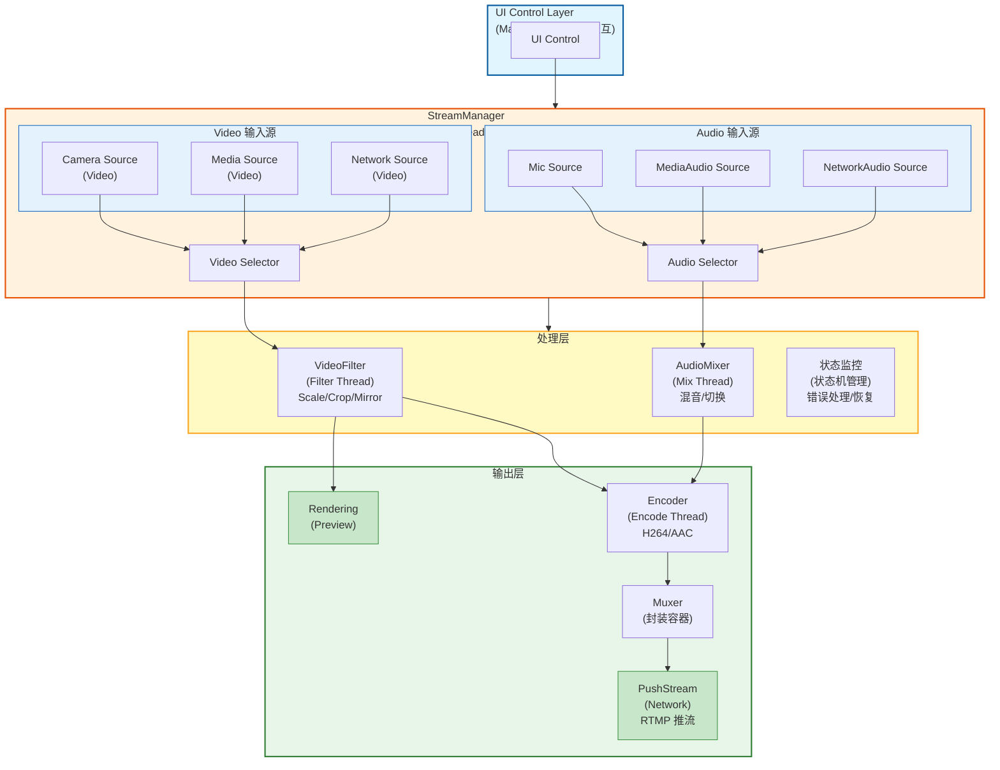
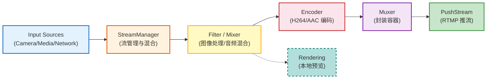
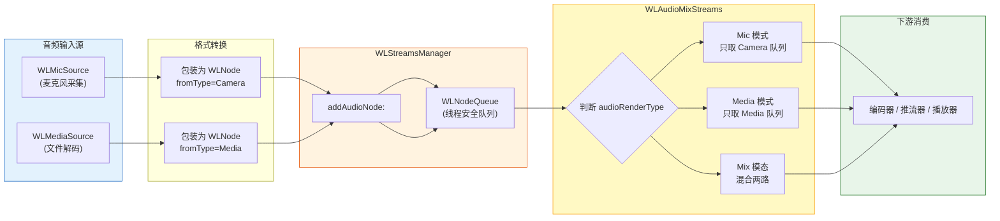

# WorkLabs 多路流推流系统 - 详细实施计划

## 1. 项目背景与目标

### 1.1 业务需求
开发类似 OBS 的多路流输入系统，支持将多路视频/音频流合并为一路流，推送到社交平台（抖音、快手、B站等）。

**核心限制**：
- **Video 输入**：最多同时支持 **2 路视频流**
- **Audio 输入**：最多同时支持 **2 路音频流**

> 说明：本系统设计为轻量级推流工具，不同于 OBS 支持无限多路源的场景。限制在 2 路以内可以简化混合逻辑、降低系统开销、保证实时性能。

### 1.2 输入源定义

#### Video 输入源（最多 2 路，其中一路必为 Camera）：
- **Camera 流**：实时摄像头采集
- **本地视频流**：通过 FFmpeg 解码本地媒体文件
- **网络拉取流**：从网络拉取的 RTMP/RTSP/HLS 流

#### Audio 输入源（最多 2 路，其中一路必为 Mic）：
- **本地麦克风**：实时音频采集
- **本地视频流中的音频**：媒体文件的音轨
- **网络拉取流的音频**：网络流的音频轨道

### 1.3 核心约束条件
- 若同时存在两路 Video 流，**其中一路必须为 Camera 流**
- 若同时存在两路 Audio 流，**其中一路必须为 Mic 流**

---

## 2. 系统架构设计

### 2.1 总体架构图



### 2.2 数据流向说明



---

## 3. 详细模块设计

### 3.1 WLMediaSource（已实现）

**职责**：FFmpeg 媒体文件解码器

**现有实现**：
- 从 `videoRenderThread` 输出 Video Node（WLDecodeNode）
- 从 `audioRenderThread` 输出 Audio Node（WLDecodeNode）

**线程模型**（已实现）：
- Parse Thread：读取 packets
- Video Decode Thread：解码视频帧
- Audio Decode Thread：解码音频帧
- Video Render Thread：输出视频帧
- Audio Render Thread：输出音频帧

**接口**：
```objc
@interface WLMediaSource : NSObject
- (void)openFile:(NSString *)filePath;
- (void)start;
- (void)stop; // 待完善
- (void)setVideoOutput:(id<WLMediaVideoOutput>)output;
- (void)setAudioOutput:(id<WLMediaAudioOutput>)output;
@end
```

### 3.2 WLCameraSource（待实现）

**职责**：摄像头实时采集

**技术方案**：
- 使用 `AVCaptureSession` 封装（复用现有 WLVideoManager）
- 输出 `CMSampleBufferRef` 或转换为 `CVPixelBufferRef`

**关键点**：
- 支持前后摄像头切换
- 支持分辨率/帧率配置
- 处理摄像头被抢占的情况

**伪代码**：
```objc
@protocol WLCameraSourceDelegate <NSObject>
- (void)cameraSource:(WLCameraSource *)source didOutputVideoFrame:(CVPixelBufferRef)pixelBuffer;
- (void)cameraSourceDidEncounterError:(WLCameraSource *)source error:(NSError *)error;
@end

@interface WLCameraSource : NSObject
@property (nonatomic, weak) id<WLCameraSourceDelegate> delegate;
@property (nonatomic, assign) CGSize captureResolution;
@property (nonatomic, assign) NSInteger frameRate;

- (void)startCapture;
- (void)stopCapture;
- (void)switchCamera;
@end
```

### 3.3 Audio 输入源详细实施方案

#### 📊 **现状分析**

| 音频输入源 | 实现状态 | 代码位置 | 优先级 |
|-----------|---------|----------|--------|
| **本地视频流音频** (WLMediaSource) | ✅ 已完成 | [WLMediaSource.m:320-354](../WorkLabs/Core/MediaSource/WLMediaSource.m#L320-L354) | - |
| **本地麦克风** (TVUAudioManager) | ❌ 空壳实现 | [TVUAudioManager.h/m](../WorkLabs/Core/Audio/TVUAudioManager.h) | 🔴 **最高** |
| **网络拉流音频** (WLNetWorkSource) | ❌ 未开始 | 待创建 | 🟡 Phase 3 |

**现有音频处理框架**：
- [WLAudioMixStreams](../WorkLabs/Core/Streams/WLAudioMixStreams.h)：音频混合管理器（部分实现）
- [WLAudioMixer](../WorkLabs/Core/Scene/WLAudioMixer.h)：场景化音频混合器（空壳）
- [WLResample](../WorkLabs/Core/Audio/WLResample.h)：重采样工具（已实现基础功能）

**核心阻塞点**：`TVUAudioManager` 是空的，需要实现麦克风采集功能才能跑通音频链路。

---

#### 📁 **文件结构规划**

所有新代码放置在 `WorkLabs/NewPlan/Audio/` 目录下：

```
WorkLabs/NewPlan/
├── Audio/
│   ├── WLAudioSourceProtocol.h      # 统一音频源协议（定义接口规范）
│   ├── WLMicSource.h                # 麦克风采集模块头文件
│   ├── WLMicSource.m                # 麦克风采集模块实现
│   ├── WLAudioTypes.h               # 音频相关类型定义和枚举
│   └── README.md                    # 模块说明文档
```

**需要改进的现有文件**：
- [WLAudioMixStreams.m](../WorkLabs/Core/Streams/WLAudioMixStreams.m)：完善 Mix 模式实现

---

#### 🎯 **Phase 1: 协议与接口定义（当前阶段）**

##### **1.1 WLAudioTypes.h - 类型定义**

```objc
#import <Foundation/Foundation.h>

NS_ASSUME_NONNULL_BEGIN

typedef NS_ENUM(NSInteger, WLAudioSourceType) {
    WLAudioSourceTypeMic = 0,        // 本地麦克风
    WLAudioSourceTypeMediaFile,      // 媒体文件音轨
    WLAudioSourceTypeNetwork         // 网络拉流音频
};

typedef NS_ENUM(NSInteger, WLAudioSourceState) {
    WLAudioSourceStateIdle = 0,      // 空闲
    WLAudioSourceStatePreparing,     // 准备中（请求权限、初始化设备）
    WLAudioSourceStateRunning,       // 运行中
    WLAudioSourceStatePaused,        // 已暂停
    WLAudioSourceStateError          // 错误状态
};

typedef struct {
    Float64 sampleRate;              // 采样率 (Hz)
    NSInteger channels;              // 声道数 (1=单声道, 2=立体声)
    NSInteger bitsPerChannel;        // 位深度 (16/32)
} WLAudioFormat;

NS_ASSUME_NONNULL_END
```

##### **1.2 WLAudioSourceProtocol.h - 统一音频源协议**

```objc
#import <Foundation/Foundation.h>
#import <AVFoundation/AVFoundation.h>
#import "WLAudioTypes.h"

NS_ASSUME_NONNULL_BEGIN

#pragma mark - 音频源代理协议

@protocol WLAudioSourceDelegate <NSObject>

@required

/// 音频数据回调（核心输出接口）
/// @param source 音频源实例
/// @param sampleBuffer 音频样本缓冲区（CMSampleBufferRef 格式）
- (void)audioSource:(id<WLAudioSource>)source 
didOutputSampleBuffer:(CMSampleBufferRef)sampleBuffer;

/// 错误回调
/// @param source 音频源实例
/// @param error 错误信息
- (void)audioSource:(id<WLAudioSource>)source 
didEncounterError:(NSError *)error;

@optional

/// 音频源启动成功回调
- (void)audioSourceDidStart:(id<WLAudioSource>)source;

/// 音频源停止回调
- (void)audioSourceDidStop:(id<WLAudioSource>)source;

/// 音频量级回调（用于 UI 显示音量条）
/// @param level 归一化的音量等级 (0.0 - 1.0)
- (void)audioSource:(id<WLAudioSource>)source didUpdateLevel:(float)level;

@end

#pragma mark - 音频源协议（统一接口）

@protocol WLAudioSource <NSObject>

#pragma mark 属性

/// 音频源类型（只读）
@property (nonatomic, assign, readonly) WLAudioSourceType sourceType;

/// 当前状态（只读）
@property (nonatomic, assign, readonly) WLAudioSourceState state;

/// 代理对象
@property (nonatomic, weak, nullable) id<WLAudioSourceDelegate> delegate;

/// 输出音频格式配置（可选，nil 则使用默认值）
@property (nonatomic, assign, nullable) WLAudioFormat outputFormat;

/// 是否正在运行
@property (nonatomic, assign, getter=isRunning) BOOL running;

#pragma mark 生命周期管理

/// 启动音频采集
/// @return 是否成功启动
- (BOOL)start;

/// 停止音频采集
- (void)stop;

/// 暂停采集（保留资源）
- (void)pause;

/// 恢复采集
- (void)resume;

#pragma mark 配置方法

/// 设置音量 (0.0 - 1.0)
/// @param volume 音量值
- (void)setVolume:(float)volume;

/// 获取当前音量
- (float)volume;

#pragma mark 设备管理（仅适用于 Mic 类型）

/// 获取可用设备列表（仅 Mic 类型有效）
- (NSArray<AVCaptureDevice *> *)availableDevices;

/// 切换设备（仅 Mic 类型有效）
/// @param device 目标设备
- (BOOL)switchToDevice:(AVCaptureDevice *)device;

@end

NS_ASSUME_NONNULL_END
```

**设计原则**：
1. **协议抽象**：所有音频源（Mic/Media/Network）都遵循同一接口
2. **CMSampleBufferRef 统一输出**：与现有 WLMediaSource 和 AVFoundation 兼容
3. **状态机管理**：明确的生命周期状态转换
4. **代理模式**：通过 delegate 回调输出数据，解耦生产者和消费者
5. **可扩展性**：预留了音量控制、设备切换等接口

---

#### 🎤 **Phase 2: WLMicSource 实现（下一步）**

##### **技术选型对比**

| 方案 | 优点 | 缺点 | 推荐度 |
|------|------|------|--------|
| **AVCaptureSession** | 与 WLVideoManager 架构统一；输出 CMSampleBufferRef；系统原生支持 | 相对底层 | ⭐⭐⭐⭐⭐ **推荐** |
| **AVAudioEngine** | 更现代 API；支持实时音频处理；灵活的音频图 | 输出 AVAudioPCMBuffer，需要转换格式 | ⭐⭐⭐⭐ |
| **AudioUnit** | 最低延迟；完全可控 | 过于复杂；代码量大 | ⭐⭐ |

**最终选择**：`AVCaptureSession` + `AVCaptureAudioDataOutput`
- ✅ 与现有架构完美兼容
- ✅ 直接输出 CMSampleBufferRef，无需转换
- ✅ 可以复用现有的 WLNode 包装逻辑
- ✅ macOS 原生支持，性能稳定

##### **WLMicSource.h 接口设计**

```objc
#import <Foundation/Foundation.h>
#import "WLAudioSourceProtocol.h"

NS_ASSUME_NONNULL_BEGIN

@interface WLMicSource : NSObject <WLAudioSource, AVCaptureAudioDataOutputSampleBufferDelegate>

#pragma mark 初始化方法

/// 使用默认麦克风设备初始化
- (instancetype)init;

/// 指定麦克风设备初始化
/// @param device 麦克风设备（nil 则使用系统默认设备）
- (instancetype)initWithDevice:(nullable AVCaptureDevice *)device;

#pragma mark 配置属性

/// 当前使用的麦克风设备（只读）
@property (nonatomic, strong, readonly, nullable) AVCaptureDevice *currentDevice;

/// 音量 (0.0 - 1.0，默认 1.0)
@property (nonatomic, assign) float volume;

/// 是否启用自动增益控制（默认 YES）
@property (nonatomic, assign) BOOL enableAutomaticGainControl;

/// 是否抑制回声（默认 NO）
@property (nonatomic, assign) BOOL enableEchoCancellation;

/// 是否降噪（默认 NO）
@property (nonatomic, assign) BOOL enableNoiseSuppression;

#pragma mark 设备查询

/// 获取所有可用的麦克风设备
+ (NSArray<AVCaptureDevice *> *)availableMicrophones;

/// 获取推荐的默认麦克风设备
+ (nullable AVCaptureDevice *)defaultMicrophone;

@end

NS_ASSUME_NONNULL_END
```

##### **WLMicSource.m 核心实现要点**

```objc
@implementation WLMicSource {
    AVCaptureSession *_session;
    AVCaptureDeviceInput *_micInput;
    AVCaptureAudioDataOutput *_audioOutput;
    dispatch_queue_t _audioQueue;
    Float64 _baseTime;
}

#pragma mark - 初始化

- (instancetype)initWithDevice:(nullable AVCaptureDevice *)device {
    self = [super init];
    if (self) {
        _sourceType = WLAudioSourceTypeMic;
        _state = WLAudioSourceStateIdle;
        _volume = 1.0f;
        _enableAutomaticGainControl = YES;
        
        if (device) {
            _currentDevice = device;
        } else {
            _currentDevice = [WLMicSource defaultMicrophone];
        }
        
        _audioQueue = dispatch_queue_create("com.wl-micsource.audio", DISPATCH_QUEUE_SERIAL);
    }
    return self;
}

#pragma mark - 生命周期

- (BOOL)start {
    if (_state == WLAudioSourceStateRunning) {
        return YES;
    }
    
    _state = WLAudioSourceStatePreparing;
    
    // 1. 检查权限
    AVAuthorizationStatus status = [AVCaptureDevice authorizationStatusForMediaType:AVMediaTypeAudio];
    if (status == AVAuthorizationStatusNotDetermined) {
        // TODO: 请求权限
    } else if (status == AVAuthorizationStatusDenied) {
        NSError *error = [NSError errorWithDomain:@"WLMicSource" 
                                             code:-1 
                                         userInfo:@{NSLocalizedDescriptionKey: @"麦克风权限被拒绝"}];
        [self.delegate audioSource:self didEncounterError:error];
        return NO;
    }
    
    // 2. 配置 AVCaptureSession
    [self configureCaptureSession];
    
    // 3. 启动 Session
    [_session startRunning];
    
    _state = WLAudioSourceStateRunning;
    _running = YES;
    _baseTime = CFAbsoluteTimeGetCurrent() * 1000; // 记录起始时间戳
    
    [self.delegate audioSourceDidStart:self];
    return YES;
}

- (void)stop {
    [_session stopRunning];
    _state = WLAudioSourceStateIdle;
    _running = NO;
    [self.delegate audioSourceDidStop:self];
}

#pragma mark - AVCaptureAudioDataOutputSampleBufferDelegate

- (void)captureOutput:(AVCaptureOutput *)output 
didOutputSampleBuffer:(CMSampleBufferRef)sampleBuffer 
       fromConnection:(AVCaptureConnection *)connection {
    
    if (_state != WLAudioSourceStateRunning) {
        return;
    }
    
    // 保留 sampleBuffer，防止被释放
    CFRetain(sampleBuffer);
    
    // 在主线程或指定队列通知代理
    dispatch_async(dispatch_get_main_queue(), ^{
        [self.delegate audioSource:self didOutputSampleBuffer:sampleBuffer];
        CFRelease(sampleBuffer);
    });
}

#pragma mark - 私有方法

- (void)configureCaptureSession {
    _session = [[AVCaptureSession alloc] init];
    _session.sessionPreset = AVCaptureSessionPresetHigh;
    
    // 配置麦克风输入
    NSError *error = nil;
    _micInput = [[AVCaptureDeviceInput alloc] initWithDevice:_currentDevice error:&error];
    if (error) {
        [self.delegate audioSource:self didEncounterError:error];
        return;
    }
    
    if ([_session canAddInput:_micInput]) {
        [_session addInput:_micInput];
    }
    
    // 配置音频输出
    _audioOutput = [[AVCaptureAudioDataOutput alloc] init];
    [_audioOutput setSampleBufferDelegate:self queue:_audioQueue];
    
    if ([_session canAddOutput:_audioOutput]) {
        [_session addOutput:_audioOutput];
    }
}

@end
```

**关键实现细节**：
1. **线程安全**：使用串行队列 `_audioQueue` 处理回调
2. **内存管理**：对 CMSampleBufferRef 进行 retain/release，防止过早释放
3. **时间戳记录**：在 start 时记录 `_baseTime`，用于后续时间戳同步
4. **错误处理**：权限检查、设备配置失败等场景都有处理
5. **代理通知**：在主线程通知代理，方便 UI 更新

---

#### 🔗 **Phase 3: 集成到 WLStreamsManager**

##### **数据流向图**



##### **集成代码示例**

**1. WLMediaSource 的 audioRenderThread（已有实现）**
```objc
// 位于 WLMediaSource.m 第 320-354 行
- (void)audioRenderThread {
    while (self.isAudioRendering) {
        // 从 FFmpeg 解码队列获取帧
        WLNode *node = [self.audioFrameQueue deQueueWithBlock:NO];
        if (!node) {
            usleep(10 * 1000); // 10ms
            continue;
        }
        
        // 时间戳处理
        Float64 abs_pts = node.pts * 1000 + self.baseTime;
        
        // 发送到 WLStreamsManager
        [[WLStreamsManager manager] addAudioNode:node];
    }
}
```

**2. WLMicSource 的回调处理（新增）**
```objc
// 在 Delegate 实现中
- (void)audioSource:(id<WLAudioSource>)source 
didOutputSampleBuffer:(CMSampleBufferRef)sampleBuffer {
    
    // 将 CMSampleBufferRef 包装为 WLNode
    WLNode *node = [[WLNode alloc] init];
    node.sampleBuffer = sampleBuffer; // 需要扩展 WLNode 支持 CMSampleBuffer
    node.fromType = WLFromTypeCamera; // 标记为麦克风来源
    node.type = WLNodeTypeAudio;
    node.pts = CMTimeGetSeconds(CMSampleBufferGetPresentationTimeStamp(sampleBuffer)) * 1000;
    
    // 发送到 WLStreamsManager
    [[WLStreamsManager manager] addAudioNode:node];
}
```

**3. WLAudioMixStreams 的 Mix 模式改进（待完善）**
```objc
// 位于 WLAudioMixStreams.m encoderThread 方法
case WLAudioRenderTypeMix:
{
    // 从 Mic 队列取帧
    WLNode *micNode = [self.queueDict[@(WLFromTypeCamera)] deQueueWithBlock:NO];
    
    // 从 Media 队列取帧
    WLNode *mediaNode = [self.queueDict[@(WLFromTypeMedia)] deQueueWithBlock:NO];
    
    if (micNode || mediaNode) {
        // TODO: 实现混音算法
        // 方案 A: 简单切换（根据优先级选择一路）
        // 方案 B: 加权混音（两路 PCM 数据叠加）
        
        WLNode *outputNode = nil;
        if (micNode && !mediaNode) {
            outputNode = micNode; // 只有麦克风
        } else if (!micNode && mediaNode) {
            outputNode = mediaNode; // 只有媒体文件
        } else {
            outputNode = [self mixAudioNode:micNode withNode:mediaNode]; // 混合
        }
        
        // 发送给下游（编码器/推流器）
        if (outputNode) {
            // TODO: 调用 WLPushStreamsManager 或 WLEncoder 的接口
            // [[WLPushStreamsManager shared] pushAudioFrame:outputNode.frame];
        }
        
        // 释放节点
        [micNode flush];
        [mediaNode flush];
    }
    
    break;
}
```

---

#### ✅ **验收标准**

完成 Audio 输入源实施后，应满足以下条件：

##### **功能完整性**
- [ ] WLMicSource 能够成功启动并采集麦克风音频
- [ ] WLMicSource 能够正确停止并释放资源
- [ ] 音频数据能够以 CMSampleBufferRef 格式输出
- [ ] WLStreamsManager 能够接收来自 Mic 和 Media 两路的音频数据
- [ ] WLAudioMixStreams 的三种模式都能正常工作：
  - [ ] `WLAudioRenderTypeMic`: 只输出麦克风音频
  - [ ] `WLAudioRenderTypeMeida`: 只输出媒体文件音频
  - [ ] `WLAudioRenderTypeMix`: 混合两路音频

##### **性能指标**
- **延迟**: 麦克风采集到输出的延迟 < 50ms
- **CPU 占用**: 音频采集和处理占用 < 5%
- **内存稳定**: 长时间运行无内存泄漏
- **线程安全**: 无竞态条件和死锁

##### **兼容性**
- [ ] 支持内置麦克风（MacBook Pro/Mac mini）
- [ ] 支持外接 USB 麦克风
- [ ] 支持多麦克风设备切换
- [ ] 正确处理权限请求和拒绝场景

---

#### 📋 **实施步骤总结**

| 步骤 | 任务 | 文件 | 依赖 | 状态 |
|------|------|------|------|------|
| **1** | 创建 `WLAudioTypes.h` | NewPlan/Audio/ | 无 | ⏳ 待开始 |
| **2** | 创建 `WLAudioSourceProtocol.h` | NewPlan/Audio/ | Step 1 | ⏳ 待开始 |
| **3** | 创建 `WLMicSource.h` | NewPlan/Audio/ | Step 2 | ⏳ 待开始 |
| **4** | 创建 `WLMicSource.m` | NewPlan/Audio/ | Step 3 | ⏳ 待开始 |
| **5** | 扩展 WLNode 支持 CMSampleBuffer | Core/ | Step 4 | ⏳ 待开始 |
| **6** | 改进 WLAudioMixStreams.m | Core/Streams/ | Step 5 | ⏳ 待开始 |
| **7** | 集成测试验证 | Test/ | All | ⏳ 待开始 |

---

#### ⚠️ **注意事项与风险提示**

1. **macOS 权限问题**
   - macOS 需要在 Info.plist 中添加 `NSMicrophoneUsageDescription`
   - 首次调用会弹出权限请求对话框
   - 用户拒绝后需要在系统设置中手动开启

2. **线程模型注意**
   - AVCaptureSession 的回调在 `_audioQueue`（后台线程）
   - delegate 通知切换到主线程（dispatch_get_main_queue）
   - WLStreamsManager.addAudioNode: 可能会被多线程调用，需确保线程安全

3. **时间戳同步**
   - WLMicSource 使用系统时间作为基准
   - WLMediaSource 使用 FFmpeg 的 pts
   - 两路音频在 Mix 时需要进行时间戳对齐（后续优化点）

4. **性能优化建议**
   - Phase 1 先保证功能正确性
   - 后续可考虑使用环形缓冲区减少内存分配
   - 可考虑直接使用 AVAudioPCMBuffer（避免 CMSampleBuffer 转换开销）

5. **向后兼容**
   - 新增的协议不影响现有 WLMediaSource 的正常工作
   - WLAudioMixStreams 保持原有接口不变，只是完善内部实现

### 3.4 WLNetWorkSource（待实现）

**职责**：网络拉流（RTMP/RTSP/HLS）

**技术方案**：
- 基于 FFmpeg `avformat_open_input` 实现拉流
- 复用 WLMediaSource 的部分解码逻辑

**关键点**：
- 网络断线重连机制
- 缓冲区管理（平衡延迟与流畅度）
- 支持多种协议

**伪代码**：
```objc
@protocol WLNetWorkSourceDelegate <NSObject>
- (void)networkSource:(WLNetWorkSource *)source didOutputVideoFrame:(CVPixelBufferRef)frame;
- (void)networkSource:(WLNetWorkSource *)source didOutputAudioBuffer:(AVAudioPCMBuffer *)buffer;
- (void)networkSourceDidDisconnect:(WLNetWorkSource *)source;
@end

@interface WLNetWorkSource : NSObject
@property (nonatomic, weak) id<WLNetWorkSourceDelegate> delegate;
- (void)connectWithURL:(NSString *)url;
- (void)disconnect;
@end
```

### 3.5 WLStreamsManager（核心模块）

**职责**：接收所有音视频流，进行混合/选择

**核心功能**：
1. **输入管理**：注册/注销 Video/Audio Source
2. **混合策略**：
   - 视频切换（同一时间只输出一路）
   - 音频混音（多路音频混合）
3. **时间戳同步**：统一时钟域
4. **线程安全**：跨线程数据传递

**接口设计**：
```objc
@protocol WLStreamsManagerVideoOutput <NSObject>
- (void)streamsManager:(WLStreamsManager *)manager didOutputVideoFrame:(CVPixelBufferRef)frame pts:(Float64)pts;
@end

@protocol WLStreamsManagerAudioOutput <NSObject>
- (void)streamsManager:(WLStreamsManager *)manager didOutputAudioBuffer:(AVAudioPCMBuffer *)buffer pts:(Float64)pts;
@end

@interface WLStreamsManager : NSObject
+ (instancetype)sharedManager;

// 输入源管理
- (void)addVideoSource:(id<WLVideoSource>)source;
- (void)addAudioSource:(id<WLAudioSource>)source;
- (void)removeVideoSource:(id<WLVideoSource>)source;
- (void)removeAudioSource:(id<WLAudioSource>)source;

// 输出设置
- (void)setVideoOutput:(id<WLStreamsManagerVideoOutput>)output;
- (void)setAudioOutput:(id<WLStreamsManagerAudioOutput>)output;

// 混合控制
- (void)selectVideoSource:(id<WLVideoSource>)source; // 切换主视频源
- (void)setAudioMixingConfig:(WLAudioMixConfig *)config; // 音频混合配置

// 生命周期
- (void)start;
- (void)stop;
@end
```

**内部实现要点**：
- 使用 `WLNodeQueue` 进行线程安全的数据传递
- 维护一个统一的 `WLClock` 对象进行时间戳转换
- Mix Thread 中执行帧选择/混合逻辑

### 3.6 WLVideoFilter（图像处理）

**职责**：对视频帧进行处理（缩放、裁剪、滤镜等）

**技术方案选择**：

| 方案 | 适用场景 | 性能 | 推荐阶段 |
|------|----------|------|----------|
| **CoreImage** | macOS 原生滤镜、简单处理 | ⭐⭐⭐⭐ | Phase 1 |
| **Metal Performance Shaders** | 高性能 GPU 加速 | ⭐⭐⭐⭐⭐ | Phase 2 |
| **FFmpeg libavfilter** | 专业特效、转码 | ⭐⭐⭐ | Phase 3 |

**Phase 1 实现**（推荐）：
```objc
@interface WLVideoFilter : NSObject
@property (nonatomic, assign) CGSize outputResolution; // 输出分辨率
@property (nonatomic, assign) BOOL enableMirror;        // 镜像
@property (nonatomic, assign) CGRect cropRect;          // 裁剪区域

- (CVPixelBufferRef)processFrame:(CVPixelBufferRef)inputFrame;
@end
```

### 3.7 WLAudioMixer（音频混合）

**职责**：多路音频混合或切换

**核心功能**：
1. **混音**：多路 PCM 数据加权混合
2. **重采样**：统一采样率/格式
3. **音量控制**：各路独立音量调节

**伪代码**：
```objc
@interface WLAudioMixer : NSObject
- (void)addAudioSource:(id<WLAudioSource>)source volume:(float)volume;
- (void)removeAudioSource:(id<WLAudioSource>)source;
- (void)setVolume:(float)volume forSource:(id<WLAudioSource>)source;
- (AVAudioPCMBuffer *)mixFrames:(NSArray<AVAudioPCMBuffer *> *)buffers;
@end
```

### 3.8 WLEncoder（编码器）

**职责**：将原始音视频数据编码为 H264/AAC

**技术方案**：
- **Video**: VideoToolbox (H264/H265 硬件编码)
- **Audio**: AudioToolbox (AAC 编码)

**关键参数**：
```objc
typedef struct {
    int bitrate;        // 码率 (bps)
    int keyframeInterval; // 关键帧间隔
    int frameRate;      // 帧率
    int profileLevel;   // 编码等级
} WLVideoEncoderConfig;

typedef struct {
    int bitrate;        // 音频码率
    int sampleRate;     // 采样率
    int channels;       // 声道数
} WLAudioEncoderConfig;
```

### 3.9 WLPushStreamer（推流器）

**职责**：将编码后的数据推送到服务器

**支持的协议**：
- RTMP（主流社交平台）
- RTSP（监控系统）
- HLS（直播 CDN）

**伪代码**：
```objc
@protocol WLPushStreamerDelegate <NSObject>
- (void)pushStreamerDidConnect:(WLPushStreamer *)streamer;
- (void)pushStreamerDidDisconnect:(WLPushStreamer *)streamer error:(NSError *)error;
- (void)pushStreamer:(WLPushStreamer *)streamer didUpdateStats:(WLStreamStats *)stats;
@end

@interface WLPushStreamer : NSObject
@property (nonatomic, weak) id<WLPushStreamerDelegate> delegate;
@property (nonatomic, assign) ConnectionState connectionState;

- (void)startWithURL:(NSString *)rtmpURL;
- (void)stop;
- (void)sendVideoData:(NSData *)data timestamp:(CMTime)timestamp;
- (void)sendAudioData:(NSData *)data timestamp:(CMTime)timestamp;
@end
```

### 3.10 WLRendering（预览渲染）

**职责**：本地预览推流画面

**技术方案**：
- 使用 `AVSampleBufferDisplayLayer` 或 Metal 渲染
- 可复用现有 `WLViedoPreview` 组件

---

## 4. 时间戳与同步机制

### 4.1 时间戳重构方案

当前方案：
```c
Float64 base_time = CFAbsoluteTimeGetCurrent() * 1000;
Float64 newpts = node.pts * 1000 + base_time;
```

**问题分析**：
- Camera 是实时流，pts 可能不连续或有跳变
- MediaFile 有自己的时间基（time_base），需要转换
- Network 流可能有延迟和抖动

### 4.2 统一时钟方案（建议）

```objc
@interface WLClock : NSObject
@property (nonatomic, assign) Float64 baseTime;      // 起始时间戳 (ms)
@property (nonatomic, assign) Float64 drift;          // 时钟漂移补偿
@property (nonatomic, strong) NSDate *referenceDate;  // 参考系统时间

// 将各路流的时间戳转换为统一时间域
- (Float64)translateTimestamp:(Float64)pts 
                 fromTimeBase:(AVRational)timeBase 
                   ofSourceType:(WLSourceType)type;

// 获取当前播放位置
- (Float64)currentPosition;
@end
```

### 4.3 音视频同步策略

1. **以音频为准**：视频跟随音频时间戳
2. **缓冲区平滑**：使用 jitter buffer 吸收抖动
3. **丢帧策略**：视频可丢帧，音频不可丢帧
4. **唇同步容差**：< 50ms

---

## 5. 线程模型详解

### 5.1 线程分配

| 线程名称 | 职责 | 优先级 |
|---------|------|--------|
| **Main Thread** | UI 控制、用户交互 | Normal |
| **Camera Capture Thread** | AVCaptureSession 回调 | High |
| **Media Parse Thread** | FFmpeg av_read_frame | Normal |
| **Media Decode Threads** | 视频/音频解码 | High |
| **Mix Thread** | StreamManager 混合逻辑 | High |
| **Filter Thread** | 图像处理 (CoreImage/Metal) | Normal |
| **Encode Thread** | VideoToolbox/AudioToolbox | High |
| **Network Thread** | RTMP 推送 | Normal |

### 5.2 线程间通信

```objc
// 生产者-消费者模式（基于 WLNodeQueue）
// Camera Thread → [WLNodeQueue] → Mix Thread
// Decode Thread → [WLNodeQueue] → Mix Thread
// Mix Thread → [WLNodeQueue] → Filter Thread
// Filter Thread → [WLNodeQueue] → Encode Thread
// Encode Thread → [WLNodeQueue] → Network Thread
```

### 5.3 线程安全保证

- 所有跨线程数据传递通过 `WLNodeQueue`
- 公共状态使用 `dispatch_semaphore` 或 `@synchronized`
- UI 更新回到 Main Thread（通过 GCD main queue）

---

## 6. 状态机设计

### 6.1 整体状态机

```
Idle → Preparing → Streaming → Paused → Error
  ↑                              │
  └──────────────────────────────┘
                        (Recover)
```

### 6.2 状态定义

```objc
typedef NS_ENUM(NSInteger, WLStreamState) {
    WLStreamStateIdle,        // 空闲，未启动
    WLStreamStatePreparing,   // 准备中（连接服务器、初始化编码器）
    WLStreamStateStreaming,   // 推流中
    WLStreamStatePaused,      // 已暂停
    WLStreamStateError,       // 错误状态
    WLStreamStateRecovering   // 恢复中（自动重连）
};
```

### 6.3 错误处理与降级策略

#### 场景 1: Camera 断开
- **检测**: AVCaptureSessionRuntimeErrorNotification
- **处理**:
  - 自动尝试重新配置 Session
  - 如果失败，提示用户检查权限/设备
  - 可选：自动切换到备用视频源（如果有）

#### 场景 2: 网络波动
- **检测**: 推流超时/失败回调
- **处理**:
  - 自动重连（指数退避：1s, 2s, 4s, 8s... 最大 30s）
  - 降低码率（自适应码率）
  - 增大缓冲区

#### 场景 3: CPU/GPU 过载
- **检测**: 编码队列积压 > 阈值
- **处理**:
  - 跳帧（丢掉非关键帧）
  - 降低分辨率
  - 降低帧率

---

## 7. 实施计划与时间节点

### Phase 1: 基础链路验证（预计 1 周）

**目标**：实现 Camera + Mic 单路推流到 RTMP

**任务清单**：
- [ ] **Day 1-2**: 实现 WLCameraSource
  - [ ] 封装 AVCaptureSession
  - [ ] 输出 CVPixelBufferRef
  - [ ] 处理摄像头权限请求
  
- [ ] **Day 2-3**: 实现 WLMicSource
  - [ ] 封装 AVAudioEngine
  - [ ] 输出 AVAudioPCMBuffer
  - [ ] 配置音频参数（44100Hz, stereo）

- [ ] **Day 3-4**: 实现 WLStreamsManager（基础版）
  - [ ] 接收单路 Video/Audio 输入
  - [ ] 时间戳转换（基础版）
  - [ ] 线程安全的数据传递

- [ ] **Day 4-5**: 实现 WLVideoFilter（基础版）
  - [ ] 固定分辨率缩放（如 720p）
  - [ ] CoreImage 实现

- [ ] **Day 5-6**: 实现 WLEncoder
  - [ ] VideoToolbox H264 编码
  - [ ] AudioToolbox AAC 编码
  - [ ] 配置编码参数

- [ ] **Day 6-7**: 实现 WLPushStreamer
  - [ ] RTMP 协议握手
  - [ ] FLV 封装
  - [ ] 发送音视频数据
  - [ ] 断线重连机制

**验收标准**：
- ✅ 能够打开摄像头并推流到 RTMP 服务器
- ✅ 音频正常传输
- ✅ 延迟 < 3 秒
- ✅ 能够停止推流

### Phase 2: 多源支持与预览（预计 1 周）

**目标**：集成 MediaSource，添加预览功能

**任务清单**：
- [ ] **Day 1-2**: 完善 WLMediaSource 输出接口
  - [ ] 适配 WLStreamsManager 的输入协议
  - [ ] 修复 stop() 方法
  - [ ] 优化解码性能

- [ ] **Day 2-3**: WLStreamsManager 升级
  - [ ] 支持多路 Video 输入
  - [ ] 实现视频源切换逻辑
  - [ ] 支持多路 Audio 输入

- [ ] **Day 3-4**: WLAudioMixer 实现
  - [ ] 多路音频混音算法
  - [ ] 音量独立控制
  - [ ] 重采样（libswresample）

- [ ] **Day 4-5**: WLRendering 预览
  - [ ] 集成 AVSampleBufferDisplayLayer
  - [ ] 实时预览 Filter 后的画面
  - [ ] 低延迟渲染优化

- [ ] **Day 5-7**: 测试与调优
  - [ ] Camera + MediaFile 切换测试
  - [ ] 长时间稳定性测试
  - [ ] 内存泄漏检测
  - [ ] 性能 profiling

**验收标准**：
- ✅ 支持 Camera 和 MediaFile 作为视频源
- ✅ 可以在运行时切换视频源
- ✅ 本地预览正常显示
- ✅ 音频混音无爆音/杂音

### Phase 3: 网络拉流与高级特性（预计 1-2 周）

**目标**：支持网络拉流，增加高级功能

**任务清单**：
- [ ] **Week 1**: WLNetWorkSource 实现
  - [ ] RTMP/RTSP/HLS 拉流
  - [ ] 解码与输出
  - [ ] 断线重连
  - [ ] 缓冲区管理

- [ ] **Week 1-2**: 高级 Filter 功能
  - [ ] 美颜滤镜（可选）
  - [ ] 水印叠加
  - [ ] 画中画（PIP）
  - [ ] 自定义布局

- [ ] **Week 2**: 完善错误处理
  - [ ] 全面的错误日志
  - [ ] 自动降级策略
  - [ ] 用户友好的错误提示
  - [ ] 监控统计（码率、帧率、丢帧率）

**验收标准**：
- ✅ 支持网络拉流作为输入源
- ✅ 三路视频源可以共存
- ✅ 具备基本的容错能力
- ✅ 有完整的日志和监控

---

## 8. 资源需求

### 8.1 开发资源
- **开发人员**：1 名 iOS/macOS 开发工程师（熟悉 Objective-C、FFmpeg、音视频）
- **测试设备**：
  - Mac mini / MacBook Pro（Apple Silicon）
  - USB 摄像头（外接）
  - 测试用 RTMP 服务器（可用 nginx-rtmp 或 SRS）
- **第三方服务**：
  - 社交平台推流地址（抖音/B站/快手开发者账号）

### 8.2 技术依赖
- **已有的**：
  - ffmpeg-kit-local（FFmpeg 库）
  - ReactiveObjC（响应式编程）
  - Masonry（Auto Layout）
  
- **可能新增的**：
  - 无需额外依赖（主要使用系统框架）
  - 如需美颜滤镜：考虑集成 Face++ 或商汤 SDK

### 8.3 参考资料
- Apple Documentation: AVFoundation, VideoToolbox, AudioToolbox
- FFmpeg 文档: libavformat, libavcodec, libavfilter
- RTMP 规范: Adobe RTMP Specification
- OBS 源码（参考架构设计）

---

## 9. 疑问点与待确认事项

### 🔴 必须确认（阻塞开发）

1. **第一版 MVP 的具体范围**
   - ❓ 是否只支持 Camera + Mic 单路推流？
   - ❓ 还是一开始就要支持 MediaFile？
   - **影响**：决定 Phase 1 的工作量（1 天 vs 1 周差异）

2. **输出协议与目标平台**
   - ❓ 推送到哪个平台？（抖音？B站？快手？自建服务器？）
   - ❓ 是否只支持 RTMP？还是需要 RTSP/HLS？
   - **影响**：PushStreamer 的实现复杂度和测试环境搭建

3. **视频混合策略**
   - ❓ 第一版是"单路切换"还是"画中画"？
   - ❓ 是否需要 Scene/Layout 配置 UI？
   - **影响**：StreamManager 和 Filter 的设计复杂度

4. **音频混合策略**
   - ❓ 多路音频是混音还是切换？
   - ❓ 是否需要独立的音量控制 UI？
   - **影响**：是否需要实现 WLAudioMixer

### 🟡 建议确认（影响体验）

5. **延迟要求**
   - ❓ 端到端延迟要求是多少？（< 1s? < 3s? < 5s?）
   - **影响**：缓冲区大小、编码参数、是否需要低延迟优化

6. **画质要求**
   - ❓ 输出分辨率？（720p? 1080p?）
   - ❓ 码率范围？（2Mbps? 4Mbps? 自适应？）
   - **影响**：编码器配置、Filter 性能要求

7. **美颜/特效需求**
   - ❓ 是否需要美颜功能？（磨皮、瘦脸、大眼等）
   - ❓ 是否需要水印/贴纸？
   - **影响**：是否需要集成第三方 SDK，开发周期大幅增加

8. **录制功能**
   - ❓ 是否需要同时本地录制？
   - ❓ 录制格式？（MP4? FLV? MKV?）
   - **影响**：需要额外的 Muxer 和文件 I/O 模块

### 🟢 可以后续讨论

9. **UI 设计细节**
   - 控制面板布局
   - 设置页面
   - 错误提示样式

10. **监控与统计**
    - 是否需要实时查看推流状态（码率、帧率、丢帧率）
    - 是否需要日志上传功能

11. **多平台支持**
    - 未来是否需要移植到 iOS？

---

## 10. 潜在风险分析与应对

### 10.1 技术风险

| 风险项 | 概率 | 影响 | 应对措施 |
|--------|------|------|----------|
| **FFmpeg 解码性能不足** | 中 | 高 | 使用 VideoToolbox 硬解；限制并发路数 |
| **RTMP 推流不稳定** | 高 | 高 | 实现断线重连；增加缓冲区；考虑使用 LFLiveKit 等成熟库 |
| **音视频不同步** | 高 | 中 | 统一时钟域；音频优先策略；jitter buffer |
| **内存泄漏** | 中 | 高 | 使用 Instruments 定期检测；ARC 最佳实践 |
| **CPU/GPU 过载导致掉帧** | 中 | 中 | 自适应码率；动态调整分辨率/帧率 |

### 10.2 业务风险

| 风险项 | 概率 | 影响 | 应对措施 |
|--------|------|------|----------|
| **需求变更频繁** | 高 | 中 | MVP 思想，小步快跑；模块化设计便于扩展 |
| **第三方平台 API 变更** | 低 | 高 | 抽象推流层，支持多协议切换 |
| **审核合规问题** | 中 | 高 | 提前了解平台规则；避免敏感内容检测 |

### 10.3 进度风险

| 风险项 | 概率 | 影响 | 应对措施 |
|--------|------|------|----------|
| **预估时间不足** | 高 | 中 | 预留 20% buffer；每周 review 进度 |
| **技术难点卡壳** | 中 | 高 | 提前调研关键技术点；准备备选方案 |
| **测试环境问题** | 中 | 低 | 提前搭建测试环境；Docker 化部署 |

### 10.4 风险缓解策略

1. **技术预研**（Phase 0，建议花 1-2 天）
   - 验证 RTMP 推流可行性（找开源 Demo 跑通）
   - 测试 FFmpeg 在 macOS 上的性能表现
   - 确认 VideoToolbox 编码参数最佳实践

2. **原型验证**
   - 先做最小化原型（Camera → Encode → RTMP）
   - 验证核心链路后再扩展功能

3. **模块化开发**
   - 各模块独立开发、独立测试
   - 定义清晰的接口（Protocol）
   - 便于并行开发和替换实现

4. **持续集成**
   - 每日构建验证
   - 自动化单元测试（后续补充）
   - Code Review 机制

---

## 11. 成功标准与验收指标

### 11.1 功能完整性
- [ ] 支持 Camera + Mic 推流（Phase 1）
- [ ] 支持 MediaFile 作为备选源（Phase 2）
- [ ] 支持网络拉流（Phase 3）
- [ ] 本地预览功能正常
- [ ] 运行时切换视频源
- [ ] 音视频同步（唇同步 < 100ms）

### 11.2 性能指标
- **CPU 占用** < 50% (Mac mini M1)
- **内存占用** < 500MB
- **端到端延迟** < 3 秒（可配置优化到 < 1s）
- **推流稳定性** 连续推流 2 小时不中断
- **帧率** ≥ 25 fps（720p）

### 11.3 代码质量
- [ ] 无明显内存泄漏（Instruments 验证）
- [ ] 无线程安全 bug
- [ ] 代码注释清晰（中文注释）
- [ ] 符合项目代码规范（参考 AGENTS.md）
- [ ] 关键流程有日志记录

### 11.4 用户体验
- [ ] 启动速度快 (< 3s)
- [ ] 操作响应及时
- [ ] 错误提示友好清晰
- [ ] 支持热插拔摄像头/麦克风

---

## 12. 附录

### 12.1 关键术语表

| 术语 | 说明 |
|------|------|
| **PTS** | Presentation Time Stamp，显示时间戳 |
| **DTS** | Decoding Time Stamp，解码时间戳 |
| **CVPixelBuffer** | Core Video 像素缓冲区 |
| **CMSampleBuffer** | Core Media 采样缓冲区 |
| **RTMP** | Real-Time Messaging Protocol，实时消息传输协议 |
| **FLV** | Flash Video，RTMP 使用的封装格式 |
| **H264/H265** | 视频编码标准 |
| **AAC** | Advanced Audio Coding，音频编码格式 |
| **Jitter Buffer** | 抖动缓冲区，用于消除网络抖动 |
| **Lip-sync** | 唇音同步，音视频同步的俗称 |

### 12.2 参考链接
- [Apple AVFoundation Programming Guide](https://developer.apple.com/documentation/avfoundation)
- [FFmpeg Official Documentation](https://ffmpeg.org/documentation.html)
- [Adobe RTMP Specification](https://www.adobe.com/devnet/rtmp.html)
- [OBS Studio GitHub](https://github.com/obsproject/obs-studio)

### 12.3 文档变更记录

| 版本 | 日期 | 作者 | 变更内容 |
|------|------|------|----------|
| v0.1 | 2026-05-19 | AI Assistant | 初稿，基于 TaskNewPlan.md 和架构图整理 |

---

## 13. 下一步行动

### 📌 立即行动（今天）
1. **团队讨论**：确认 MVP 范围（问题 1-4）
2. **技术预研**：搭建 RTMP 测试环境，验证可行性
3. **环境准备**：申请推流测试账号

### 📅 本周内
1. 完成 Phase 1 所有任务
2. 跑通 Camera → RTMP 最小原型
3. 编写单元测试（如有时间）

### 📆 下周
1. 开始 Phase 2 开发
2. 集成 MediaSource
3. 添加预览功能

---

**文档维护说明**：
- 本文档将持续更新，反映最新的设计和决策
- 每个阶段结束后，更新进度和经验教训
- 如有重大变更，需团队成员 review 并达成一致

**最后更新时间**：2026-05-19

---

## 附录 B: 现有代码分析与补充计划（2026-05-20）

> 基于对全部源码的实际阅读，补充计划与现有实现的差距分析。

### B.1 现状盘点

| 模块 | 代码位置 | 状态 | 关键发现 |
|------|----------|------|----------|
| **WLStreamsManager** (单例) | Core/Streams/ | 框架搭好 | 路由 addVideoNode:/addAudioNode: 到子模块，但没有 start/stop 生命周期方法（实际在 WLMediaSource 内部自行调用） |
| **WLVideoModeStreams** | Core/Streams/ | 框架搭好，混合逻辑空 | `encoderThread` 的 while 循环体为空，从未实际取帧处理 |
| **WLAudioMixStreams** | Core/Streams/ | 部分实现 | `WLAudioRenderTypeMeida` 模式有基础逻辑但只 flush 节点不输出；`Mix` 模式完全为空 |
| **WLCameraSource** | Core/CameraSource/ | **已实现** | 通过 AVCaptureSession 采集，输出 CVPixelBufferRef，同时走 `frameOutput` block 和直接 `addVideoNode:` 注入 WLStreamsManager |
| **WLMediaSource** | Core/MediaSource/ | **已实现（有 bug）** | 内部创建了自己的 `WLVideoModeStreams` 和 `WLAudioMixStreams` **私有实例**，没有走单例 WLStreamsManager。Camera 和 Media 的数据永远不会交汇 |
| **WLSceneManager** (Scene 层) | Core/Scene/ | 新架构框架 | 已有源管理（增删改查）、分辨率配置、事件通知。但 `WLSceneRenderer` 和 `WLAudioMixer` 都是空壳 |
| **WLMediaSourceItem** | Core/Scene/ | 已实现 | 统一的源包装层，支持 Camera/Video/Audio 三种类型，有 position/size/zOrder/rotation/volume 等布局属性 |
| **WLRenderingManager** | Core/Rendering/ | 部分实现 | 有 CVPixelBufferRef → CMSampleBufferRef → AVSampleBufferDisplayLayer 的预览链路 |
| **WLEncoder** (WLVideoEncode + WLAudioEncode) | Core/Encodes/ | **空壳** | 只有空的 @interface 声明，无任何实现 |
| **WLPushStreamsManager** | Core/PushStreams/ | **空壳** | 只有 pixelBuffer:pts: 方法声明，无实现 |
| **WLResample** | Core/Audio/ | **已实现** | 完整的 libswresample 封装，支持多种重采样策略和时间同步模式 |
| **WLNodeQueue** | Core/Queue/ | **已实现** | 基于 pthread 的线程安全队列，支持阻塞/非阻塞入队、超时出队、abort 机制 |
| **WLNode** | Core/Queue/ | **已实现（需扩展）** | 支持 AVPacket*/AVFrame*/CVPixelBufferRef，不支持 CMSampleBufferRef |

### B.2 核心问题

#### 问题 1：两套架构并存，数据流无法交汇

项目实际存在 **两套架构**：

- **架构 A（Streams 层）**：`WLStreamsManager` → `WLVideoModeStreams` + `WLAudioMixStreams`
  - Camera 走这套：`WLCameraSource` → `[WLStreamsManager manager] addVideoNode:`
  - Media 也走这套但用的是私有实例：`WLMediaSource` 内部 `self.streams = [[WLVideoModeStreams alloc] init]`

- **架构 B（Scene 层）**：`WLSceneManager` → `WLMediaSourceItem` → `WLSceneRenderer` + `WLAudioMixer`
  - 新设计的上层管理架构，但渲染和混音都是空壳

**核心矛盾**：WLMediaSource 创建了私有的 WLVideoModeStreams 实例，而非使用 WLStreamsManager 单例。导致 Camera 和 Media 的数据永远不会交汇，无法实现混合。

**决策点**：

| 方案 | 描述 | 优点 | 缺点 |
|------|------|------|------|
| **A：统一走 StreamsManager** | 废弃 Scene 层的渲染/混音，所有 Source 统一注入 WLStreamsManager | 改动最小，已有 Camera 和队列基础设施 | 缺少源的布局管理能力 |
| **B：统一走 SceneManager** | 废弃 StreamsManager，所有 Source 统一走 WLSceneManager | 有完整的源管理和布局系统 | 需要重写数据路由层 |
| **C：两层合并（推荐）** | WLSceneManager 管理源列表和 UI 布局，底层数据流走 WLStreamsManager | 兼顾管理能力和数据路由 | 需要明确两层的职责边界 |

#### 问题 2：WLNode 不支持 CMSampleBufferRef

当前 WLNode 只支持三种数据类型：

```objc
@property (nonatomic, assign) AVPacket *packet;    // FFmpeg 编码包
@property (nonatomic, assign) AVFrame *frame;      // FFmpeg 解码帧
@property (nonatomic, assign) CVPixelBufferRef data; // 视频像素缓冲区
```

麦克风采集输出的是 `CMSampleBufferRef`（包含音频 PCM 数据），WLNode 无法承载。需要新增字段并扩展 flush 方法。

#### 问题 3：Encoder + PushStream 完全缺失

从"采集/解码"到"推出去"之间，编码器和推流器都是空壳。这是实现 Phase 1（Camera + Mic → RTMP）的最大缺口。

### B.3 补充实施步骤

基于现有代码分析，将原始计划细化为以下执行顺序：

| 步骤 | 任务 | 依赖 | 影响文件 |
|------|------|------|----------|
| **Step 0** | 统一架构决策：修复 WLMediaSource 使用单例 WLStreamsManager | 决策确认 | WLMediaSource.m, 可能涉及 WLStreamsManager.m |
| **Step 1** | 扩展 WLNode 支持 CMSampleBufferRef | 无 | WLNode.h/m |
| **Step 2** | 实现 WLMicSource（麦克风采集） | Step 1 | 新建 NewPlan/Audio/ 目录 |
| **Step 3** | 补全 WLVideoModeStreams.encoderThread 混合逻辑 | Step 0 | WLVideoModeStreams.m |
| **Step 4** | 补全 WLAudioMixStreams.encoderThread 混音逻辑 | Step 1, Step 2 | WLAudioMixStreams.m |
| **Step 5** | 实现 WLEncoder（VideoToolbox H264 + AudioToolbox AAC） | Step 3/4 | Core/Encodes/ 下的空壳文件 |
| **Step 6** | 实现 WLPushStreamsManager（RTMP 推流） | Step 5 | Core/PushStreams/ 下的空壳文件 |
| **Step 7** | 链路串通测试：Camera → Mix → Encode → RTMP | 全部 | — |

**Step 0 是阻塞项**：不解决架构统一问题，后续步骤的数据无法正确流转。

### B.4 补充后的 Phase 1 详细任务

#### Phase 1.0：架构统一（0.5 天）

- 选定架构方案（推荐方案 C：两层合并）
- 修改 WLMediaSource.m，将内部的私有 `WLVideoModeStreams` 和 `WLAudioMixStreams` 替换为 `[WLStreamsManager manager]` 的引用
- 确认 Camera 和 Media 的数据能进入同一个处理管道

#### Phase 1.1：WLNode 扩展 + WLMicSource（1 天）

- WLNode 新增 `CMSampleBufferRef sampleBuffer` 属性
- flush 方法中增加 `CFRelease(_sampleBuffer)` 逻辑
- 实现 WLMicSource：AVCaptureSession + AVCaptureAudioDataOutput
- 通过 `[WLStreamsManager manager] addAudioNode:]` 注入音频数据

#### Phase 1.2：混合逻辑补全（1 天）

- WLVideoModeStreams.encoderThread：根据 videoRenderType 从队列取帧，做简单切换或合成
- WLAudioMixStreams.encoderThread：补全三种模式的实际输出逻辑
- 统一时间戳基准（建议使用 mach_absolute_time）

#### Phase 1.3：编码器实现（1-2 天）

- WLVideoEncode：VideoToolbox H264 硬件编码
  - 接收 CVPixelBufferRef
  - 输出 CMBlockBufferRef（编码后的 NALU）
- WLAudioEncode：AudioToolbox AAC 编码
  - 接收 PCM 数据
  - 输出 AAC 编码帧

#### Phase 1.4：推流器实现（1-2 天）

- WLPushStreamsManager：基于 FFmpeg avformat 实现 RTMP 推流
  - 或考虑使用 LFLiveKit 等成熟开源库降低风险
  - FLV 封装
  - 断线重连

#### Phase 1.5：串通测试（0.5-1 天）

- Camera + Mic → WLStreamsManager → Encoder → RTMP
- 验证延迟、音视频同步、稳定性

### B.5 关于 WLSceneManager 的定位建议

`WLSceneManager` 是一个设计良好的上层管理器，但它和 `WLStreamsManager` 的职责需要明确划分：

| 职责 | 建议归属 |
|------|----------|
| 源的增删改查、选择、排序 | `WLSceneManager` |
| UI 布局（position/size/zOrder/rotation） | `WLSceneManager` |
| 输出分辨率配置 | `WLSceneManager` |
| 数据路由、混合、编码 | `WLStreamsManager` |
| 预览渲染 | `WLRenderingManager` |
| RTMP 推流 | `WLPushStreamsManager` |

`WLSceneManager` 作为"场景管理器"负责管什么源、怎么排布；`WLStreamsManager` 作为"流管理器"负责数据怎么流。

### B.6 新增风险项

| 风险项 | 概率 | 影响 | 应对措施 |
|--------|------|------|----------|
| **架构统一改动引入回归** | 中 | 高 | 先写集成测试验证现有功能不受影响 |
| **WLMediaSource 的 stop() 未实现** | 已知 | 中 | 架构统一时一并修复 |
| **WLNode 扩展影响所有 flush 路径** | 中 | 中 | 审计所有调用 flush 的地方，确保新字段被正确释放 |
| **编码器选型不确定** | 低 | 高 | 优先 VideoToolbox（macOS 原生），备选 FFmpeg libx264 |

---

**最后更新时间**：2026-05-20（附录 B 补充）
