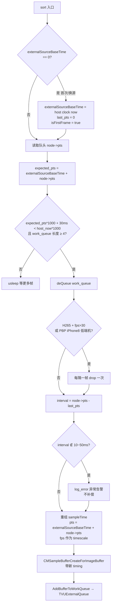
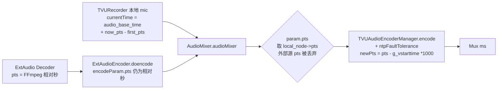
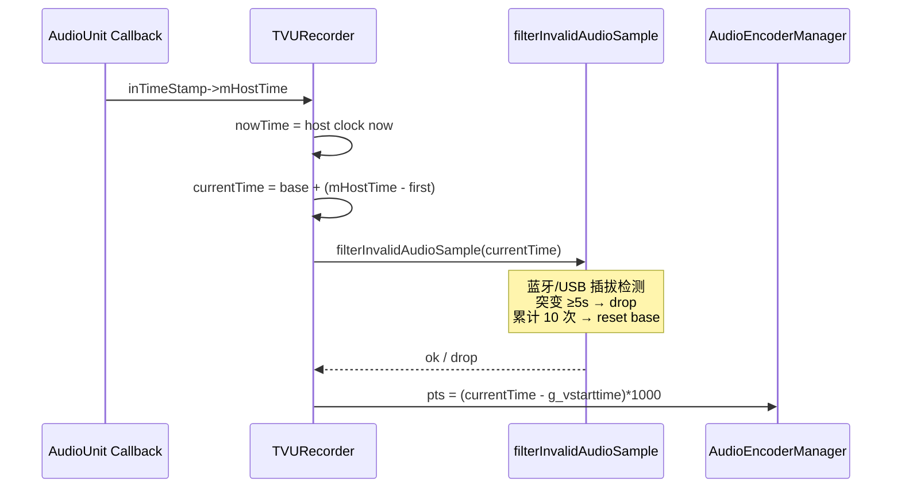
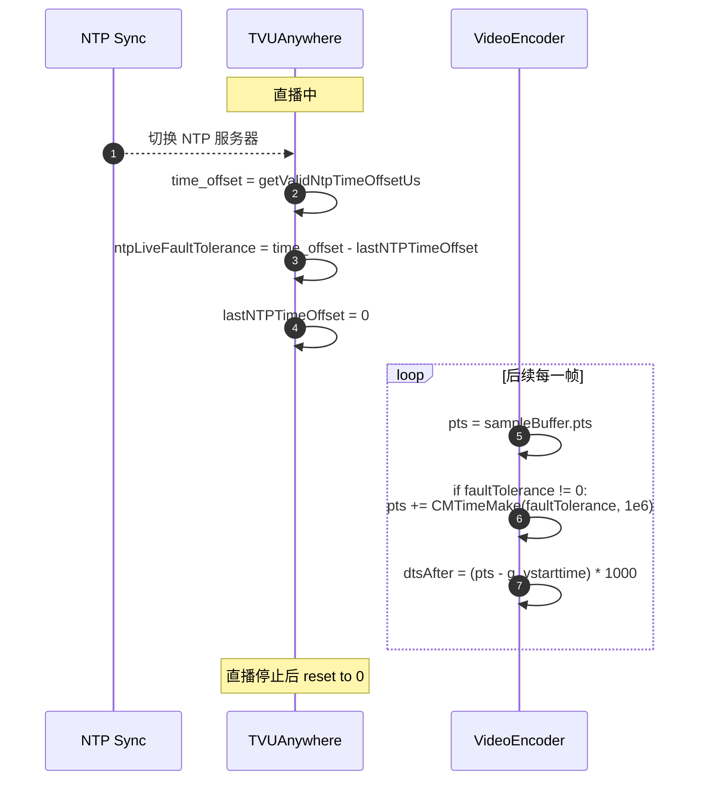
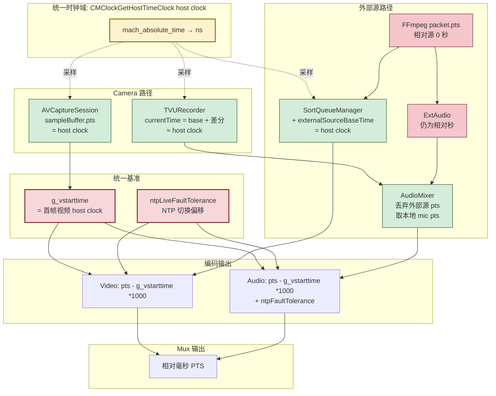

# TVU 时间戳与时钟漂移调研

> 基于 tvuanywhere_ios 仓库，沿 `TVUExternalSourceSortQueueManager::sort` 出发，追踪到 Encoder / Mux，并对比 Camera 路径，评估漂移处理机制。

---

## 一、SortQueueManager::sort 内时间戳的关键流程

文件：`products/TVUTransportIOS/TVUAnywherePro/Transmitter/TVUExternalSource/TVUExternalSourceQueue/TVUExternalSourceSortQueueManager.mm:152-288`



**关键变量（语义/时钟域）：**

| 变量 | 时钟域 | 含义 |
|---|---|---|
| `node->pts` | **相对源 0 的秒数** | FFmpeg `packet.pts * av_q2d(time_base) + max_duration*cycleTimes` |
| `externalSourceBaseTime` | **host clock 秒** | 首次 `sort()` 时 `CMClockGetHostTimeClock` 取的值，换源时重置 |
| 输出 `sampleTime.pts` | **host clock 秒** | `externalSourceBaseTime + node->pts`，把相对时间映射到 host clock 域 |
| `pts_offset = 30ms` | — | 允许 `expected_pts` 比 `host_now` 早 30ms 出队 |

**核心思想：** 外部源给的是「相对源 0」时间，sort 把它**叠加到本地 host clock 上**，与 Camera/Mic 共享同一时间域。

---

## 二、整条链路的 PTS 设计

### 2.1 视频路径

```mermaid
flowchart LR
    subgraph Parse["TVUExternalSourceParse"]
        PV[packet.pts × time_base<br/>+ max_duration × cycleTimes<br/>= 相对源 0 秒]
    end
    subgraph VDec["VideoDecoder didDecompress"]
        VD[sourceRef->pts<br/>透传 相对源秒]
    end
    subgraph Sort["SortQueueManager::sort"]
        SQ[final_pts = externalSourceBaseTime<br/>+ node->pts<br/>→ host clock 域]
    end
    subgraph AVSM["TVUAVStreamManager"]
        AV[checkSampleBufferPTSForEncode<br/>10ms / 1/fps 间距过滤<br/>不改 pts]
    end
    subgraph Enc["H264/H265 Encoder"]
        H1[首帧: g_vstarttime = pts<br/>非首帧: + ntpFaultTolerance]
        H3[单调性检查 currentPts<lastPts → drop]
        H2[dtsAfter = pts - g_vstarttime *1000<br/>送 mux 的相对毫秒]
    end
    subgraph Mux["TVULiveMediaCenter / AVFormatControl"]
        MX[最终封包 PTS = relative ms]
    end

    PV --> VD --> SQ --> AV --> H1 --> H3 --> H2 --> MX
```



### 2.2 音频路径（外部源 + 本地 mic 混音）



> **重要：** `AudioMixer::audioMixer` 用**本地 mic 的 host clock pts** 作为混音输出 pts (`TVUExternalSourceAudioMixerQueueManager.mm:243`)。这意味着「外部源音频在混音场景下完全跟随本地 mic 时钟」，外部源的 pts 仅用于排队、出队时丢弃。
>
> 在「纯外部源直播（无混音）」分支下，`encodeParam.pts` 仍是 FFmpeg 相对秒，减去 `g_vstarttime`（host clock 大值）后会得到大负数 —— **这是个值得关注的潜在 bug**。可能被「g_vstarttime=0 时短路」或「实际不走该分支」掩盖。

---

## 三、统一时钟基准 `g_vstarttime`

```c
// TVUVideoH264Encoder.mm:382-391  /  TVUVideoH265Encoder.mm:同等位置
if (isFirstFrame && g_tvustartcaptureTime == 0) {
    CMTime pts = CMSampleBufferGetPresentationTimeStamp(sampleBuffer);
    g_vstarttime = CMTimeGetSeconds(pts);   // 第一帧视频编码时锚定 host clock
    isFirstFrame = NO;
}
```

| 使用方 | 代码位置 | 含义 |
|---|---|---|
| H264/H265 Encoder | `dtsAfter = (pts - g_vstarttime) * 1000` | 视频 mux pts |
| AudioEncoderManager | `newPts = (param->pts - g_vstarttime) * 1000` | 音频 mux pts |
| TVURecorder | `pts = (currentTime - g_vstarttime) * 1000` | 录制/检测路径 |
| AVFormatHttp | `g_vstarttime + pack->pts/1000` | 反向算回 host clock 用于异常监控 |
| TVUHostTimer | `baseTimeMS + (systemPTSMS - g_vstarttime*1000)` | NTP 同步用 |

**核心结论：整个系统的「相对零点」就是第一帧视频被 VT 编码时的 host clock 时刻。**

---

## 四、Camera 路径的时钟设计

### 4.1 视频采集（TVUCameraManager）

文件：`products/TVUTransportIOS/TVUAnywherePro/TVUAnywhereSDK/TVUVideoCapture/TVUCameraManager.mm:1859-1878`

- `AVCaptureVideoDataOutput.captureOutput:didOutputSampleBuffer:` 收到的 sampleBuffer 自带 PTS
- AVCaptureSession **内部用 `CMClockGetHostTimeClock`** 打时间戳（Apple 默认行为）
- **没有任何手动改写**，直接 `AddBufferToWorkQueue` 入队

### 4.2 音频采集（TVURecorder）

文件：`products/TVUTransportIOS/TVUAnywherePro/TVUAnywhereSDK/TVUAudioCapture/TVURecorder.mm:392-407`

```c
CMClockRef hostClockRef = CMClockGetHostTimeClock();
Float64 nowTime = CMTimeGetSeconds(CMClockGetTime(hostClockRef));   // 当下 host clock
Float64 now_audio_pts = CMTimeGetSeconds(CMClockMakeHostTimeFromSystemUnits(inTimeStamp->mHostTime));
                                                                    // AudioUnit 给的 host time

static Float64 audio_base_time = nowTime;          // 首次 callback 时锚定
static Float64 first_audio_pts = now_audio_pts;

if (isResetAudioBaseTime) {                        // 设备切换时重置
    first_audio_pts = now_audio_pts;
    audio_base_time = nowTime;
}
Float64 currentTime = audio_base_time + (now_audio_pts - first_audio_pts);
```

**为什么不直接用 `nowTime`？**
- `inTimeStamp->mHostTime` 是 AudioUnit 给的「实际采集时刻」host time，比 `nowTime`（callback 触发时刻）更准确（少了系统调度抖动）
- 用 `audio_base_time + 差分` 既保留了精确的相对节奏，又把绝对值锚到 callback 当下，避免 AudioUnit clock 漂移累积



---

## 五、时钟漂移处理机制汇总

| # | 机制 | 文件:行 | 类型 | 强度 |
|---|---|---|---|---|
| 1 | **NTP fault tolerance** `ntpLiveFaultTolerance` | `TVUAnywhere.mm:4836` + 各 Encoder | 主动补偿 | 强 |
| 2 | **AudioUnit 差分基准** `audio_base_time + (pts - first_pts)` | `TVURecorder.mm:407` | 主动补偿 | 中 |
| 3 | **音频突变过滤** `filterInvalidAudioSample` | `TVURecorder.mm:872` | 异常检测+丢弃 | 强 |
| 4 | **音频基准重置** `isResetAudioBaseTime` 累计 10 次触发 | `TVURecorder.mm:891-905` | 主动重置 | 中 |
| 5 | **Video PTS 单调性** | `TVUVideoH264Encoder.mm:407-414` | drop 倒退帧 | 强 |
| 6 | **Audio PTS 单调性** | `TVUAudioEncoderManager.mm:156-162` | drop 倒退帧 | 强 |
| 7 | **过近 PTS 过滤** `checkSampleBufferPTSForEncode` | `TVUAVStreamManager.mm:1581` | drop（避免码率塌陷） | 强 |
| 8 | **Sort interval 异常告警** 10~50ms 外 log | `TVUExternalSourceSortQueueManager.mm:209-211` | **仅告警，不补偿** | 弱 |
| 9 | **循环播放叠加** `max_duration * cycleTimes` | `TVUExternalSourceParse.mm:349,407` | 公式补偿 | 中 |
| 10 | **HEVC B 帧重排序** SortQueueManager 按 pts 插排 | `TVUExternalSourceSortQueueManager.mm:322-348` | 重排不补偿 | 中 |
| 11 | **AudioMixer 单时钟主从** 外部源 pts 丢弃，跟随本地 mic | `TVUExternalSourceAudioMixerQueueManager.mm:243` | 主从对齐 | 强 |
| 12 | **`dtsAfter == 0` 兜底** `last_dts + 33ms` | `TVUVideoH264Encoder.mm:629-634` | 公式补偿 | 弱 |

### 5.1 NTP 漂移补偿（最关键的主动补偿）



**触发条件**：仅在 `isEnableFrameTransfer && state == Living && lastNTPTimeOffset != 0` 时生效。注释里写明 ASF 传输有自己的 mux 重置 base time，**只有帧传输需要这个补偿**。

### 5.2 漂移处理盲区

❌ **未处理 / 弱处理的漂移：**

- **RTSP/组播外部源服务器时钟 vs 本地 host clock 的漂移**：只锚定第一帧关键帧的 host clock，之后无追踪。长时间直播会缓慢漂移。
- **本地文件循环时音视频 duration 不一致**：用 `max_duration` 而非各自 duration，注释里有说明这是为了避免循环累积漂移（折中方案）。
- **SortQueueManager interval 异常**：仅告警，无补偿。代码里 `same pts 时 +0.030` 兜底**已被注释掉**（`SortQueueManager.mm:215`）。
- **Camera/外部源切换瞬间**：通过 `last_pts` 单调性丢帧 + I 帧重新插入，但没有平滑过渡。

---

## 六、整体时间域关系图



---

## 七、关键结论

1. **整体设计是「单时钟统一」**：所有源最终都转到 host clock 域（`CMClockGetHostTimeClock`），用 `g_vstarttime` 做相对零点。这是该架构最大的优点 —— 避免了复杂的多时钟同步算法。

2. **真正的主动漂移补偿只有两条**：
   - **NTP fault tolerance**（应对系统时间被 NTP 校准导致的跳变）
   - **TVURecorder audio_base_time 差分**（应对 AudioUnit 内部 clock 与 host clock 的差异）

3. **外部源音频混音是「主从锁定」**：以本地 mic 时钟为主，外部源 pts 被丢弃，自然规避了外部源 vs 本地的相对漂移问题。代价是**外部源音频的精确时序信息丢失**，但实战中这种「跟着本地走」简单可靠。

4. **SortQueueManager 内部不补偿漂移**，只做：
   - B 帧 PTS 排序
   - 节流出队（避免送编码器过快）
   - interval 异常告警（**不修正**）
   - HEVC/低端机帧率减半

5. **潜在问题**（值得后续关注）：
   - **纯外部源直播路径**（`streamType==TVUAVStreamExternalSource && !replaceBackground` 且不走 mixer）：`encodeParam.pts` 是 FFmpeg 相对秒（如 0.5s），减 `g_vstarttime`（host clock 大值）后是大负数。建议核实这分支实际是否启用，或加 host clock 修正。
   - **`dtsAfter == 0` 兜底逻辑**用 `last_dts + 33`（假定 30fps），不适配高帧率。
   - **同 PTS 时 +0.030 的兜底被注释掉**（`SortQueueManager.mm:215`），异常时只 log 不修复。
   - **长时间 RTSP 直播**：服务器时钟与本地 host clock 漂移会持续积累，无补偿。

---

## 附：调研涉及的核心文件清单

| 模块 | 文件 |
|---|---|
| 排序 | `Transmitter/TVUExternalSource/TVUExternalSourceQueue/TVUExternalSourceSortQueueManager.mm` |
| 解析 | `Transmitter/TVUExternalSource/TVUExternalSourceParse/TVUExternalSourceParse.mm` |
| 视频解码 | `Transmitter/TVUExternalSource/TVUExternalSourceDecoder/TVUExternalSourceVideoDecoder.mm` |
| 音频解码 | `Transmitter/TVUExternalSource/TVUExternalSourceDecoder/TVUExternalSourceAudioDecoder.mm` |
| 音频混音 | `Transmitter/TVUExternalSource/TVUExternalSourceQueue/TVUExternalSourceAudioMixerQueueManager.mm` |
| 外部音频编码 | `Transmitter/TVUExternalSource/TVUExternSourceTool/TVUExtAudioEncoder.mm` |
| 推流总控 | `TVUAnywhereSDK/TVUAVStream/TVUAVStreamManager.mm` |
| H264 编码 | `TVUAnywhereSDK/TVUEncoder/TVUVideoH264Encoder.mm` |
| H265 编码 | `TVUAnywhereSDK/TVUEncoder/TVUVideoH265Encoder.mm` |
| 音频编码 | `TVUAnywhereSDK/TVUEncoder/TVUAudioEncoderManager.mm` |
| 本地相机 | `TVUAnywhereSDK/TVUVideoCapture/TVUCameraManager.mm` |
| 本地麦克风 | `TVUAnywhereSDK/TVUAudioCapture/TVURecorder.mm` |
| NTP 容错 | `TVUAnywhereSDK/TVUAnywhere.mm` (line 4836) |
| 入口分发 | `TVUAnywhereSDK/TVUAnywhere.mm` (line 4160 - tvuCaptureOutput) |
