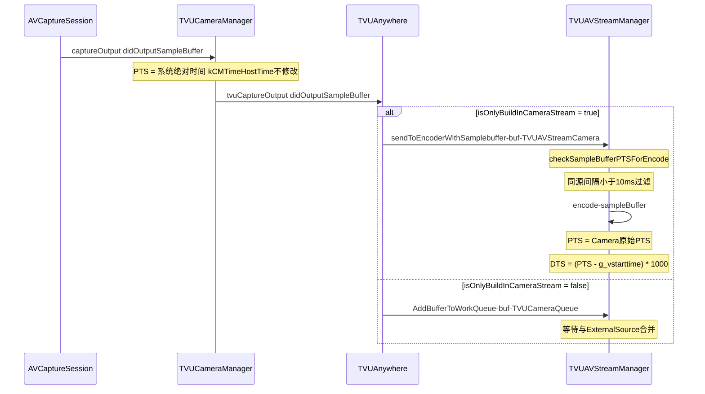
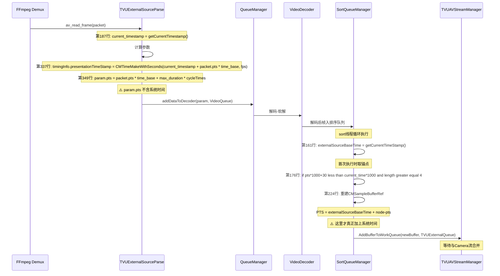
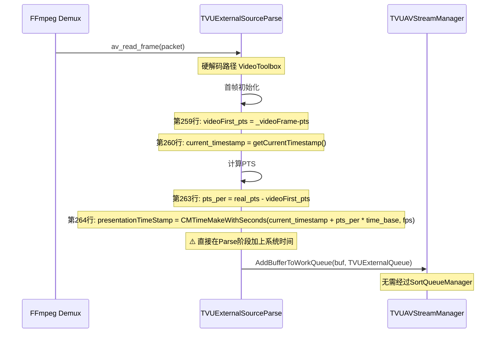
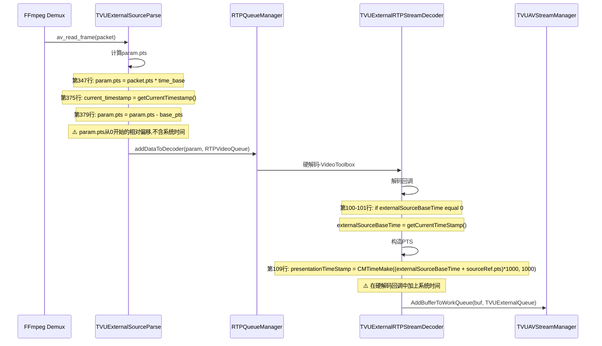
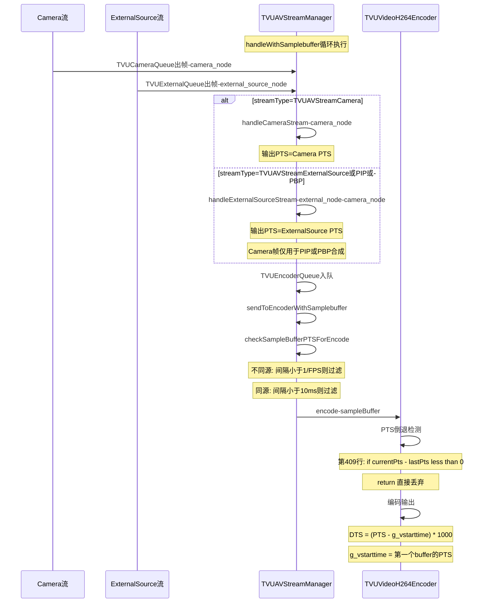
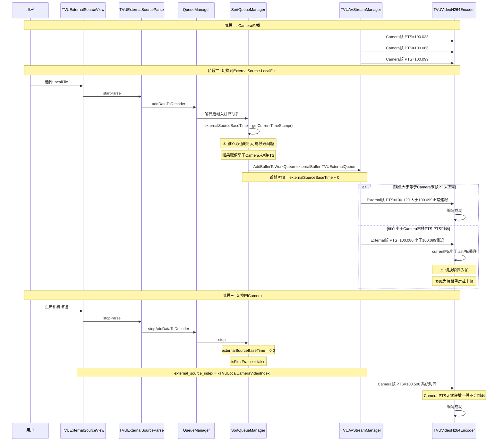
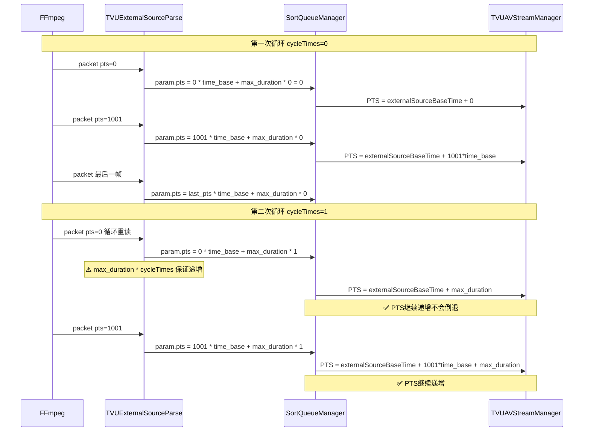
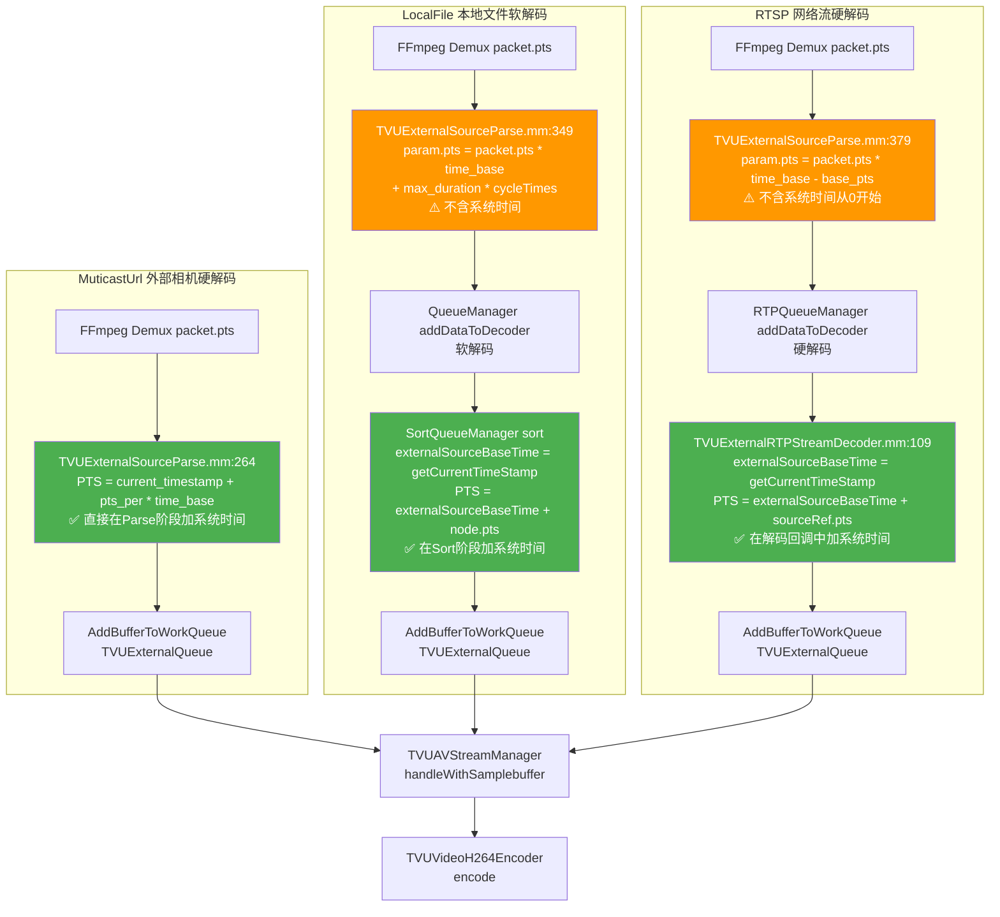

# TVUAnywhere iOS PTS 时间戳设计逻辑分析报告

## 一、核心问题

1. 当 Camera 流和 ExternalSource 流都存在时，PTS 的计算逻辑是什么，以哪个流的 PTS 为准？
2. 当只有一个流存在时，PTS 的计算逻辑是什么？

---

## 二、两路流 PTS 原始来源

### 2.1 Camera 流 PTS

| 项目 | 说明 |
|------|------|
| **来源** | `AVCaptureSession` 系统回调自动分配 |
| **时间基** | `kCMTimeHostTime`（mach_absolute_time 体系），系统绝对时间 |
| **是否修改** | **从未被修改**，从采集到编码全程透传 |
| **关键代码** | `TVUCameraManager.mm:1845` → `TVUAnywhere.mm:4168` → `TVUAVStreamManager.mm` |

Camera 的 PTS 本质是 iOS 系统的 Host Time（基于 mach_absolute_time），是一个单调递增的绝对时间戳。

### 2.2 ExternalSource 流 PTS（三种子类型）

三种外部源都遵循 **"锚点 + 相对偏移"** 的统一模式，将流内 PTS 映射到系统时间轴上。

#### (A) MuticastUrl（外部摄像头，硬解码路径）

```
PTS = CMClockGetHostTimeClock()首帧时刻 + (当前帧pts - 首帧pts) * time_base
```

| 项目 | 说明 |
|------|------|
| **锚点** | `current_timestamp`，第一帧硬解成功时的 `CMClockGetHostTimeClock()` |
| **偏移** | `(real_pts - videoFirst_pts) * time_base`，当前帧相对首帧的时间差 |
| **中间排序** | 无，直接入 `TVUExternalQueue` |
| **代码位置** | `TVUExternalSourceParse.mm:259-264` |

#### (B) LocalFile（本地文件，软解码 + 排序路径）

```
最终PTS = externalSourceBaseTime + packet.pts * time_base + max_duration * cycleTimes
```

| 项目 | 说明 |
|------|------|
| **锚点** | `externalSourceBaseTime`，SortQueueManager 排序线程首次执行时的 `CMClockGetHostTimeClock()` |
| **偏移** | `packet.pts * time_base + max_duration * cycleTimes`，帧在文件内的秒级位置 + 循环偏移 |
| **中间排序** | **SortQueueManager**，4帧缓冲 + B帧重排序 + 30ms提前量延迟出队 |
| **代码位置** | `TVUExternalSourceParse.mm:349` → `TVUExternalSourceSortQueueManager.mm:161-224` |

#### (C) RTSP（网络流，RTP解码路径）

```
最终PTS = externalSourceBaseTime(RTP解码器) + (packet.pts * time_base - base_pts)
```

| 项目 | 说明 |
|------|------|
| **锚点** | `externalSourceBaseTime`（RTP解码器属性），首帧解码回调时的 `CMClockGetHostTimeClock()` |
| **偏移** | `packet.pts * time_base - base_pts`，减去第一个有效I帧的PTS，归零后的相对时间 |
| **中间排序** | 无（RTPQueueManager 仅做解码调度，不做排序） |
| **代码位置** | `TVUExternalSourceParse.mm:347-379` → `TVUExternalRTPStreamDecoder.mm:100-114` |

---

## 三、两路流合并时的 PTS 策略（核心问题1）

### 3.1 流分发入口

Camera 流在 `TVUAnywhere.mm` 的 `sendToEncodeWithSampleBuffer:` 中根据 `isOnlyBuildInCameraStream` 决定路径：

```
isOnlyBuildInCameraStream = true  → 直接编码（不经过队列合并）
isOnlyBuildInCameraStream = false → 入 TVUCameraQueue（参与合并）
```

### 3.2 合并核心：`handleWithSamplebuffer()`

在 `TVUAVStreamManager.mm:397`，handleWithSamplebuffer() 从三个队列取帧：

```
camera_node         ← TVUCameraQueue
external_source_node ← TVUExternalQueue  
osmo_node           ← TVUOSMOQueue
mu_camera_node      ← TVUMutiCameraQueue
```

根据 `streamType` 决定合并方式：

| streamType | 处理函数 | PTS 来源 |
|------------|---------|----------|
| TVUAVStreamCamera | `handleCameraStream(camera_node)` | **Camera PTS** |
| TVUAVStreamCrop | `handleCropStream(camera_node)` | **Camera PTS** |
| TVUAVStreamExternalSource / PIP / PBP | `handleExternalSourceStream(external_source_node, camera_node)` | **ExternalSource PTS** |
| TVUAVStreamOSMO / OSMOPIP / OSMOPBP | `handleExternalSourceStream(osmo_node, camera_node)` | **OSMO PTS** |
| TVUAVStreamCameraPBP | `handleMutiCamStreamMux(camera_node, mu_camera_node)` | **Camera PTS** |

### 3.3 关键结论：外部源模式下，以 ExternalSource 的 PTS 为准

在 `handleExternalSourceStream()` 中（`TVUAVStreamManager.mm:797`）：

1. **外部源节点为空时**：调用 `addTransitionFrame()` 插入过渡帧，返回 NULL → 不编码
2. **外部源节点非空时**：合成后的 buffer 使用**外部源的 PTS**
   - 合成 buffer 重建时使用 `CMSampleBufferGetPresentationTimeStamp(external_source_sample_buffer)`（第818/849行）
   - 最终送入 `TVUEncoderQueue` 时保留外部源的 PTS

### 3.4 编码前的 PTS 校验

`checkSampleBufferPTSForEncode()`（`TVUAVStreamManager.mm:1581`）：

| 条件 | 过滤规则 |
|------|---------|
| 同源（externalSourceIndex 相同） | 前后帧 PTS 间隔 < 10ms → 丢弃 |
| 切源（externalSourceIndex 不同） | 前后帧 PTS 间隔 < 1/FPS → 丢弃 |

**设计意图**：防止前后两帧 PTS 过于接近导致编码器码率过低无法恢复。

### 3.5 全局基准时间 g_vstarttime

在 `AddBufferToWorkQueue()` 首次调用时设置（`TVUAVStreamManager.mm:2059-2062`）：

```cpp
CMTime pts = CMSampleBufferGetPresentationTimeStamp(sampleBuffer);
g_vstarttime = CMTimeGetSeconds(pts);  // 第一个buffer的PTS
```

**谁先到达谁就设定 g_vstarttime**。在实际运行中：
- Camera 模式：通常是 Camera 的第一帧
- ExternalSource 模式：可能是 Camera 或 ExternalSource 的第一帧（取决于谁先入队）

编码输出的 DTS 计算：`dtsAfter = (PTS - g_vstarttime) * 1000`（毫秒），即从0开始的相对时间戳。

---

## 四、单路流存在时的 PTS 逻辑（核心问题2）

### 4.1 仅 Camera 流存在

**路径**：`isOnlyBuildInCameraStream = true`

```
AVCaptureSession → TVUCameraManager → TVUAnywhere.sendToEncodeWithSampleBuffer
    → TVUAVStreamManager.sendToEncoderWithSamplebuffer(sampleBuffer, TVUAVStreamCamera, TVUAVStreamCamera)
    → checkSampleBufferPTSForEncode（同源PTS间隔<10ms过滤）
    → TVUVideoEncoderManager.encode
```

- **PTS 来源**：AVCaptureSession 的系统绝对时间
- **PTS 不变**：全程不修改
- **g_vstarttime**：Camera 第一帧的 PTS
- **编码 DTS**：`(Camera_PTS - g_vstarttime) * 1000`

### 4.2 仅 ExternalSource 流存在

**路径**：`isOnlyBuildInCameraStream = false`（即使没有相机帧，Camera 回调仍会触发）

Camera 回调仍会把 buffer 送入 `TVUCameraQueue`，但在 `handleWithSamplebuffer()` 中：

```
switch (streamType) {
    case TVUAVStreamExternalSource:
    case TVUAVStreamExternalSourcePIP:
    case TVUAVStreamExternalSourcePBP:
        // 外部源节点为空时直接return，不做任何处理
        if (external_source_node == NULL) {
            return;
        }
        break;
}
```

当外部源模式开启时：
- Camera 帧仅用于渲染/缩略图等辅助用途
- **编码使用的是外部源帧及其 PTS**
- Camera 帧在 `handleExternalSourceStream()` 中用于 PIP/PBP 合成，但**合成后的 buffer PTS 取自外部源**

### 4.3 特殊场景：外部源切换

在 `SortQueueManager::sort()` 中（第250-266行），当外部源第一帧排序成功后：

```cpp
if (isFirstFrame) {
    TVUAVStreamManager::getInstance()->external_source_index = node->external_source_index;
    [[TVUAudioEncoderManager manager] updateExternalSourceIndex:node->external_source_index];
    isFirstFrame = false;
}
// 过滤掉不同index的外部源buffer
if (TVUAVStreamManager::getInstance()->external_source_index != node->external_source_index) {
    resetNode(node);
    return;
}
```

这确保了外部源切换时，旧源的数据不会混入编码器。

---

## 五、完整 PTS 数据流图

```
┌─────────────────────────────────────────────────────────────────────┐
│                        Camera 流 PTS 路径                           │
│                                                                     │
│  AVCaptureSession                                                   │
│    │ (系统绝对时间 PTS，kCMTimeHostTime)                              │
│    ▼                                                                │
│  TVUCameraManager.captureOutput                                     │
│    │ (PTS 不变，直接透传)                                            │
│    ▼                                                                │
│  TVUAnywhere.tvuCaptureOutput                                       │
│    │                                                                │
│    ├─ isOnlyBuildInCameraStream=true ──→ sendToEncoderWithSamplebuffer │
│    │                                     (直接编码，PTS=Camera PTS)   │
│    │                                                                │
│    └─ isOnlyBuildInCameraStream=false ──→ AddBufferToWorkQueue       │
│                                           (TVUCameraQueue)          │
└─────────────────────────────────────────────────────────────────────┘

┌─────────────────────────────────────────────────────────────────────┐
│                      ExternalSource 流 PTS 路径                      │
│                                                                     │
│  FFmpeg Demux (packet.pts)                                          │
│    │                                                                │
│    ├─ MuticastUrl: current_timestamp + (real_pts - videoFirst_pts)  │
│    │               * time_base  → 硬解 → TVUExternalQueue           │
│    │                                                                │
│    ├─ LocalFile: param.pts = packet.pts * time_base                 │
│    │             + max_duration * cycleTimes                         │
│    │             → 软解 → SortQueueManager → 外部源基准时间+偏移     │
│    │             → TVUExternalQueue                                  │
│    │                                                                │
│    └─ RTSP: param.pts = packet.pts * time_base - base_pts           │
│             → RTP解码器 → 外部源基准时间+偏移 → TVUExternalQueue      │
└─────────────────────────────────────────────────────────────────────┘

┌─────────────────────────────────────────────────────────────────────┐
│                         合并与编码                                    │
│                                                                     │
│  TVUCameraQueue ──┐                                                 │
│                   ├→ handleWithSamplebuffer()                        │
│  TVUExternalQueue ┘    │                                            │
│                        │ 根据 streamType 选择处理函数                  │
│                        │                                            │
│           ┌────────────┼────────────────────┐                       │
│           ▼            ▼                    ▼                       │
│     Camera模式    ExternalSource模式     PIP/PBP模式                 │
│    (Camera PTS)  (External PTS)    (External PTS)                   │
│           │            │                    │                       │
│           └────────────┼────────────────────┘                       │
│                        ▼                                            │
│               TVUEncoderQueue                                       │
│                        │                                            │
│                        ▼                                            │
│          sendToEncoderWithSamplebuffer()                             │
│            │ checkSampleBufferPTSForEncode (PTS过滤)                 │
│            │ g_vstarttime 基准 (DTS = PTS - g_vstarttime)            │
│            ▼                                                        │
│     TVUVideoEncoderManager.encode                                   │
│            │                                                        │
│            ▼                                                        │
│     TVUVideoH264Encoder / TVUVideoH265Encoder                       │
│       - currentPts < lastPts 时丢弃（防回退）                        │
│       - ntpLiveFaultTolerance（默认0，NTP同步时微调）                 │
│       - DTS = (PTS - g_vstarttime) * 1000 (ms)                     │
└─────────────────────────────────────────────────────────────────────┘
```

---

## 六、回答核心问题

### Q1: 当两路流都存在时，PTS 的计算逻辑是什么，以哪个流的 PTS 为准？

**答案：以 ExternalSource 流的 PTS 为准。**

具体逻辑：
1. Camera 流和 ExternalSource 流分别入 `TVUCameraQueue` 和 `TVUExternalQueue`
2. `handleWithSamplebuffer()` 根据 `streamType` 决定合并策略
3. 在外部源模式（ExternalSource/PIP/PBP）下，调用 `handleExternalSourceStream(external_source_node, camera_node)`
4. **合成后的 buffer 使用 ExternalSource 的 PTS**，Camera 帧仅用于 PIP 小窗或 PBP 背景填充
5. 编码前通过 `checkSampleBufferPTSForEncode` 过滤 PTS 过近的帧

**设计原因**：外部源作为主画面，其 PTS 代表了用户选择的视频源的时间线；Camera 仅作为辅助画面（PIP小窗），不应主导时间线。

### Q2: 当只有一个流存在时，PTS 的计算逻辑是什么？

**仅 Camera 流**：
- PTS = AVCaptureSession 的系统绝对时间
- 全程不修改，直接编码
- g_vstarttime = Camera 第一帧的 PTS

**仅 ExternalSource 流**：
- PTS = 锚点时间 + 帧相对偏移（见2.2节三种公式）
- Camera 回调仍然触发，但仅用于辅助用途（渲染/缩略图），不参与编码时间线
- 编码使用 ExternalSource 的 PTS
- g_vstarttime 取决于谁先入队（通常是 Camera 第一帧，因为 Camera 先启动）

---

## 七、关键文件索引

| 文件 | 路径 | 关键行号 |
|------|------|---------|
| TVUExternalSourceParse.mm | `Transmitter/TVUExternalSource/TVUExternalSourceParse/` | 187,259-264,337-349,370-380 |
| TVUExternalSourceSortQueueManager.mm | `Transmitter/TVUExternalSource/TVUExternalSourceQueue/` | 152-288 |
| TVUExternalRTPStreamDecoder.mm | `Transmitter/TVUExternalSource/TVUExternalSourceDecoder/` | 87-122 |
| TVUCameraManager.mm | `TVUAnywhereSDK/TVUVideoCapture/` | 1845-1863 |
| TVUAnywhere.mm | `TVUAnywhereSDK/` | 4168-4208 |
| TVUAVStreamManager.mm | `TVUAnywhereSDK/TVUAVStream/` | 397-602,1581-1611,1749-1947,2037-2100 |
| TVUVideoH264Encoder.mm | `TVUAnywhereSDK/TVUEncoder/` | 382-431,623-638 |

---

## 八、追问一：ExternalSource 的 PTS 在哪里加上了系统时间？

核心问题：ExternalSource 流的 PTS 要和 Camera 时间戳对齐，就必须加上系统时间，具体是在哪个代码位置加的？

三种源类型加上系统时间的位置各不相同：

### 8.1 MuticastUrl（外部相机/硬解码）

**位置：`TVUExternalSourceParse.mm` 第 259-264 行**

```objc
videoFirst_pts = _videoFrame->pts;                              // 首帧流内PTS
current_timestamp = [weakSelf getCurrentTimestamp];             // ← 取CMClockGetHostTimeClock()系统时间作为锚点
int64_t real_pts = _videoFrame->pts;
int64_t pts_per  = real_pts - videoFirst_pts;                  // 当前帧相对首帧的偏移
presentationTimeStamp = CMTimeMakeWithSeconds(current_timestamp + pts_per * av_q2d(time_base), fps);
                                            ^^^^^^^^^^^^^^^^   ^^^^^^^^^^^^^^^^^^^^^^^^^^^^^^^
                                            系统时间锚点         + 流内相对偏移
```

**直接在 Parse 阶段**完成 `系统时间 + 相对偏移` 的计算，然后直接送入 `AddBufferToWorkQueue`。

### 8.2 LocalFile（本地文件/软解码）

**第一步：Parse 阶段** — `TVUExternalSourceParse.mm` 第 187、337、349 行

```objc
Float64 current_timestamp = [weakSelf getCurrentTimestamp];   // ← 取系统时间（第187行）

// 构造 timingInfo 时用 current_timestamp（第337行）
presentationTimeStamp = CMTimeMakeWithSeconds(current_timestamp + packet.pts * time_base, fps);

// 但 param.pts 不含系统时间（第349行），只是纯流内偏移
param.pts = packet.pts * time_base + max_duration * cycleTimes;
```

**关键点**：第 337 行的 `presentationTimeStamp` 包含了系统时间，但 `param.pts` 不含系统时间。`param.pts` 送入 `queueManager->addDataToDecoder`，后续在 SortQueueManager 中会**重新加上系统时间**。

**第二步：Sort 阶段** — `TVUExternalSourceSortQueueManager.mm` 第 161-162、224 行

```objc
if (externalSourceBaseTime == 0.0) {
    externalSourceBaseTime = getCurrentTimeStamp();   // ← 排序线程首次工作时取系统时间作为锚点
}

// 重建 CMSampleBuffer 时（第224行）
.presentationTimeStamp = CMTimeMakeWithSeconds(externalSourceBaseTime + node->pts, node->fps)
                                                        ^^^^^^^^^^^^^^^^^^^    ^^^^^^^^^
                                                        系统时间锚点            + param.pts(流内偏移)
```

**为什么要在 Sort 阶段重新加系统时间？** 因为 LocalFile 解码是乱序的（B/P帧重排），解码后帧的 PTS 顺序变了。SortQueueManager 需要重建 CMSampleBuffer，所以用**排序时刻**的系统时间重新作为锚点，而不是用 Parse 开始时的 `current_timestamp`。

### 8.3 RTSP（网络流/硬解码）

**第一步：Parse 阶段** — `TVUExternalSourceParse.mm` 第 374-380 行

```objc
base_pts = param.pts;                                // 第一个I帧的流内PTS
current_timestamp = [weakSelf getCurrentTimestamp];  // 取系统时间（但这里没有直接用于PTS！）
param.pts = param.pts - base_pts;                    // 只保留相对偏移（从0开始）
rtpQueueManager->addDataToDecoder(&param, ...);      // param.pts 不含系统时间
```

**第二步：解码回调** — `TVUExternalRTPStreamDecoder.mm` 第 100-109 行

```objc
if (decoder.externalSourceBaseTime == 0) {
    decoder.externalSourceBaseTime = getCurrentTimeStamp();   // ← 首帧解码完成时取系统时间
}

.presentationTimeStamp = CMTimeMake((decoder.externalSourceBaseTime + sourceRef->pts)*1000, 1000),
                             ^^^^^^^^^^^^^^^^^^^^^^^^^^^^^     ^^^^^^^^^^^^
                             系统时间锚点                       + 流内相对偏移
```

RTSP 的系统时间锚点是在**硬解码回调**中取的，因为解码输出时才真正确认帧有效。

### 8.4 三种源添加系统时间的位置对比

| 源类型 | 加系统时间的位置 | 锚点取值时机 | 最终公式 |
|--------|-----------------|-------------|----------|
| **MuticastUrl** | `TVUExternalSourceParse.mm:264` | 首帧硬解码成功时 | `current_timestamp + (frame_pts - videoFirst_pts) * time_base` |
| **LocalFile** | `TVUExternalSourceSortQueueManager.mm:224` | 排序线程首次工作时 | `externalSourceBaseTime + node->pts` |
| **RTSP** | `TVUExternalRTPStreamDecoder.mm:109` | 首帧解码回调时 | `externalSourceBaseTime + sourceRef->pts` |

三种源都遵循 **"锚点 + 相对偏移"** 模式，锚点都是 `CMClockGetHostTimeClock()`，与 Camera 的 PTS 处于同一时间基上。

---

## 九、追问二：Camera 与 LocalFile 相互切换时，是否会出现 PTS 相近或倒退？

### 9.1 编码器层面的 PTS 倒退防护

`TVUVideoH264Encoder.mm` 第 406-414 行：

```objc
// Switch DJI and local camera will show mosaic because timestamp not sync.
static int64_t lastPts = 0;
int64_t currentPts = (int64_t)(CMTimeGetSeconds(presentationTimeStamp) * 1000);
if (currentPts - lastPts < 0)
{
    log4cplus_error("TVUVideoH264Encoder","current timestamp < last timestamp, ...");
    pthread_mutex_unlock(&mutex_lock);
    return;   // ← 直接丢弃，不送编码器
}
lastPts = currentPts;
```

**注释已说明**：DJI 和本地相机切换时时间戳不同步会导致花屏。iOS 硬编码器 `VTCompressionSessionEncodeFrame` 对 PTS 倒退会产生错误帧或直接失败，所以这里做了拦截——PTS 倒退的帧直接丢掉。

### 9.2 `checkSampleBufferPTSForEncode` 的 PTS 过近防护

`TVUAVStreamManager.mm` 第 1581-1611 行：

```objc
static Float64 last_pts = 0;
static int last_externalSourceIndex = -2;

// 不同源之间切换时：
if (last_externalSourceIndex != externalSourceIndex) {
    // PTS 间隔 < 1/FPS → 过滤
    if (current_pts - last_pts < 1.f * 1000 / current_fps) {
        return NO;  // ← 丢弃
    }
}
// 同源时：
else {
    // PTS 间隔 < 10ms → 过滤
    if (current_pts - last_pts < 10) {
        return NO;  // ← 丢弃
    }
}
```

**注意**：此函数在 `encoderWithSamplebuffer`（第 1624 行）中已被**注释掉**，只在 `sendToEncoderWithSamplebuffer`（第 1776 行）中生效。

### 9.3 切换时的 PTS 问题场景分析

#### 场景 A：Camera → ExternalSource 切换

| 时间线 | Camera 帧 PTS | External 帧 PTS |
|--------|-------------|----------------|
| T1 | 1000.033 (系统时间) | - |
| T2 | 1000.066 (系统时间) | - |
| 切换发生 | - | - |
| T3 | - | `externalSourceBaseTime + 0.033` |

- `externalSourceBaseTime` 是 SortQueueManager/Decoder 首次工作时取的 `CMClockGetHostTimeClock()`
- ExternalSource 首帧 PTS = `externalSourceBaseTime + 0`，Camera 末帧 PTS ≈ 切换时刻的系统时间
- **两者大致在同一时间基上**（都是 `CMClockGetHostTimeClock()`）
- **但存在间隙或重叠**：`externalSourceBaseTime` 取值时机可能早于或晚于 Camera 最后一帧的 PTS

**风险**：
- 如果 `externalSourceBaseTime` < Camera 末帧 PTS → **PTS 倒退**
- 如果 `externalSourceBaseTime` ≈ Camera 末帧 PTS → **PTS 过近**（< 10ms）

#### 场景 B：ExternalSource → Camera 切换

- Camera PTS 天然就是实时系统时间，持续递增
- ExternalSource 末帧 PTS = `externalSourceBaseTime + node->pts`
- Camera 恢复后首帧 PTS = 当前系统时间

**风险**：Camera PTS 通常 > External 末帧 PTS（LocalFile 的 PTS 是"锚点+文件内偏移"），**一般不会倒退**。但可能有较大跳跃。

#### 场景 C：LocalFile 循环播放时的 PTS

- `cycleTimes++` 时 `param.pts = packet.pts * time_base + max_duration * cycleTimes`
- 循环一次后 PTS 继续递增，**不会倒退**

#### 场景 D：LocalFile 文件切换

- 新文件的 `externalSourceBaseTime` 重新取值（SortQueueManager 第 161-162 行）
- 新 `externalSourceBaseTime + 0` vs 旧 `externalSourceBaseTime + 大偏移`
- 新锚点是新的系统时间，通常远大于旧文件末尾 PTS，**不会倒退但有较大跳跃**

### 9.4 切换场景风险汇总

| 切换场景 | PTS倒退风险 | PTS过近风险 | 防护机制 |
|---------|-----------|-----------|---------|
| Camera → External | **有风险** | 有风险 | 编码器 `currentPts < lastPts` 拦截 + `checkSampleBufferPTSForEncode` |
| External → Camera | 低风险 | 低风险 | Camera PTS天然递增 |
| External 文件循环 | 无风险 | 无风险 | `max_duration * cycleTimes` 保证递增 |
| External 文件切换 | 无倒退但有跳跃 | 低风险 | `externalSourceBaseTime` 重新取值 |

### 9.5 核心问题

Camera → External 切换时，External 的首帧 `externalSourceBaseTime` 可能**早于** Camera 末帧的 PTS，导致 PTS 倒退。编码器层面有兜底（丢弃倒退帧），但这意味着**切换瞬间可能丢几帧**，表现为短暂黑屏或卡顿。

---

## 十、追问三：`externalSourceBaseTime` 何时被清零？`stopParse` 的完整调用链

### 10.1 `externalSourceBaseTime` 清零位置

`TVUExternalSourceSortQueueManager.mm` 第 73-81 行：

```cpp
void TVUExternalSourceSortQueueManager::stop()
{
    pthread_mutex_lock(&mutex);
    threadToSuspend = true;
    pthread_mutex_unlock(&mutex);
    resetAllWorkQueueNode();
    externalSourceBaseTime = 0.0;    // ← 清零
    isFirstFrame = false;
}
```

### 10.2 完整调用链

```
用户操作（点击停止/切换回相机）
    ↓
TVUExternalSourceView::stopParse / TVUInputSourceParseModule::stopParse / TVUClipOperationResult::handleStreamStopForType
    ↓
TVUExternalSourceParse::stopParse  (TVUExternalSourceParse.mm:523)
    │  _isStop = YES;
    │  self.queueManager->stopAddDataToDecoder();
    ↓
TVUExternalSourceQueueManager::stopAddDataToDecoder  (TVUExternalSourceQueueManager.mm:111)
    │  threadToSuspend = true;
    │  resetAllWorkQueueNode(...);
    │  [videoDecoder stopDecode];
    │  [audioDecoder stopDecode];
    │  videoDecoder.sortQueueManager->stop();    ← 关键调用
    │  TVUAVStreamManager::getInstance()->ResetAllFreeQueue();
    ↓
TVUExternalSourceSortQueueManager::stop  (TVUExternalSourceSortQueueManager.mm:73)
    │  threadToSuspend = true;
    │  resetAllWorkQueueNode();
    │  externalSourceBaseTime = 0.0;   ← 清零
    │  isFirstFrame = false;
```

### 10.3 `stopParse` 被调用的三种主要场景

#### (1) 用户主动切回相机

`TVUExternalSourceView::stopParse`（第 639 行）

```
点击相机按钮 → stopParse → 遍历所有 parse 调用 [parse stopParse]
同时设置：external_source_index = kTVULocalCameraVideoIndex
```

#### (2) ExternalSource 子模式切换（PIP/PBP → 纯外部源等）

`TVUClipOperationResult::handleStreamStopForType`（第 80 行）

```
从 ExternalSourcePIP/PBP 切到其他模式 → [self.parseModule stopParse]
```

#### (3) LocalFile 单次播放结束（循环一次后停止）

`TVUInputSourceParseModule` 第 118-123 行

```
circulationType == TVUExternalSourceCirculationOnce → [self stopParse]
```

此外还有：RTSP 连接错误、外部 USB 相机断开等异常场景。

### 10.4 `stopParse` 时序问题分析

**关键发现**：`stopParse` → `stopAddDataToDecoder` → `sortQueueManager->stop()` 是**同步调用链**，执行时：

1. `sortQueueManager->stop()` 将 `externalSourceBaseTime = 0.0`
2. 但此时 SortQueueManager 的 `sort()` 线程中可能**还有已经出队但尚未送入 `AddBufferToWorkQueue` 的帧**
3. 这些帧的 PTS 是用**旧的** `externalSourceBaseTime` 计算的，已经固化在 `CMSampleBufferRef` 的 `presentationTimeStamp` 中

所以 `externalSourceBaseTime = 0.0` 的清零操作**只影响下次重新启动时**的锚点取值。已在管道中流动的 buffer 不会被影响。

### 10.5 切换时序导致 PTS 倒退的根因

下次启动时 `externalSourceBaseTime` 会重新取 `getCurrentTimeStamp()`，与上次的值无关。如果切换时序如下：

**正常情况**：
```
T1: Camera 最后一帧 PTS = 100.500 (系统时间)
T2: stopParse 被调用，sortQueueManager->stop()，externalSourceBaseTime = 0.0
T3: 用户再次选择 LocalFile，startParse
T4: SortQueueManager::sort() 首次执行，externalSourceBaseTime = 100.520 (新取的系统时间)
T5: External 首帧 PTS = 100.520 + 0 = 100.520  ← 略大于 Camera 末帧 100.500，正常
```

**异常情况**（锚点取值早于 Camera 末帧）：
```
T1:   Camera 最后一帧 PTS = 100.500
T1.5: SortQueueManager 已在另一线程中启动，取到 externalSourceBaseTime = 100.480
T5:   External 首帧 PTS = 100.480 + 0 = 100.480  ← 小于 Camera 末帧，PTS倒退！
```

**这就是 `TVUVideoH264Encoder.mm:406` 注述的问题根源**：
```
// Switch DJI and local camera will show mosaic because timestamp not sync.
```

---

## 十一、OBS Studio 的多源时间戳同步方案对比

### 11.1 OBS 的核心思路：`timing_adjust` 偏移映射

OBS 处理多路异步视频源时间戳同步的方式与 TVUAnywhere **思路一致但实现更统一**。

#### 核心公式

```c
// 首帧时计算偏移量
timing_adjust = os_gettime_ns() - frame->timestamp;

// 后续帧映射到系统时间轴
mapped_timestamp = frame->timestamp + timing_adjust;
```

**数学等价性**：这与 TVUAnywhere 的 `锚点 + 相对偏移` 模式是等价的：
```
OBS:       mapped_ts = frame_ts + (os_time - first_frame_ts) = os_time + (frame_ts - first_frame_ts)
TVU:       PTS       = externalSourceBaseTime + node->pts        = 锚点     + 相对偏移
```

### 11.2 OBS 的关键设计细节

#### (1) 每个源独立维护 `timing_adjust`

OBS 中每个 `obs_source_t` 都有自己的 `timing_adjust`，切换源时新源的 `timing_adjust` 在首帧自动重新计算，**不需要显式清零**：

```c
// obs_source_update_async_video() 中
if (!source->timing_set) {
    source->timing_adjust = obs->video.video_time - frame->timestamp;
    source->timing_set = true;
}
```

对比 TVUAnywhere 需要 `stopParse` → `sortQueueManager->stop()` → `externalSourceBaseTime = 0.0` 显式清零。

#### (2) 直接时间戳检测

OBS 会检测源的时间戳是否已经是系统时间：

```c
// source_output_audio_data() 中
uint64_t os_time = os_gettime_ns();
if (uint64_diff(in.timestamp, os_time) < MAX_TS_VAR) {
    source->timing_adjust = 0;       // 已经是系统时间，无需调整
    source->timing_set = true;
    using_direct_ts = true;
}
```

如果源的时间戳本身就是系统时间（如摄像头），`timing_adjust = 0`，无需任何调整。

#### (3) 帧选择：`get_closest_frame(sys_time)`

```c
// async_tick() 中
uint64_t sys_time = obs->video.video_time;
source->cur_async_frame = get_closest_frame(source, sys_time);
```

OBS 按**当前系统时间**从缓存队列中选最近的帧，而不是按帧的 PTS 顺序出队。这意味着即使帧的时间戳乱序到达，也能正确选择。

对比 TVUAnywhere 的 SortQueueManager 按 PTS 顺序出队 + 30ms 提前量延迟。

#### (4) 时间戳平滑与跳变处理

OBS 有完善的时间戳修正机制：

```c
#define TS_SMOOTHING_THRESHOLD 70000000ULL  // 70ms

if (diff > MAX_TS_VAR && !using_direct_ts)
    // 大跳变：重置时间基准
    handle_ts_jump(source, ...);
else if (diff < TS_SMOOTHING_THRESHOLD)
    // 小偏差：用预期时间戳替代（平滑修正）
    in.timestamp = source->next_audio_ts_min;
```

- **70ms 以内**：平滑修正，用预期值替代实际值
- **超过容忍度（约2秒）**：视为跳变，重置时间基准

对比 TVUAnywhere 只有硬过滤（< 10ms 丢弃），没有平滑修正。

#### (5) `sync_offset` 机制

OBS 提供了用户可调节的 `sync_offset`，直接加到时间戳上实现音视频同步：

```c
sync_offset = source->sync_offset;
in.timestamp += sync_offset;
```

TVUAnywhere 没有类似的用户可调偏移机制。

#### (6) 交错队列保证单调输出

```c
// 编码后的视频包和音频包送入交错队列（interleave queue）
// 确保编码包按单调时间戳顺序发送
```

这是 OBS 音视频同步的核心保障。TVUAnywhere 没有类似的排序机制，依赖入队顺序。

### 11.3 完整的时间戳映射流程对比

#### OBS 流程

```
源时间戳 (frame->timestamp)
     │
     ▼
┌─────────────────────────────────┐
│  + timing_adjust                │  ← 首帧: os_time - timestamp；直接时间戳: 0
│  (映射到系统时间轴)              │
├─────────────────────────────────┤
│  平滑/跳变处理                   │  ← TS_SMOOTHING_THRESHOLD = 70ms
├─────────────────────────────────┤
│  + sync_offset                  │  ← 用户可调音视频同步偏移
├─────────────────────────────────┤
│  - resample_offset              │  ← 重采样补偿
├─────────────────────────────────┤
│  get_closest_frame(sys_time)    │  ← 按系统时间选帧
├─────────────────────────────────┤
│  交错队列（单调时间戳排序）       │  ← 最终输出保证
└─────────────────────────────────┘
```

#### TVUAnywhere 流程

```
源时间戳 (packet.pts * time_base)
     │
     ▼
┌─────────────────────────────────┐
│  + externalSourceBaseTime       │  ← 排序线程/解码回调首帧时取 CMClockGetHostTimeClock()
│  (映射到系统时间轴)              │    需要显式 stop() 清零后重新取值
├─────────────────────────────────┤
│  SortQueueManager 排序+30ms延迟 │  ← B/P帧重排序，PTS到期才出队
├─────────────────────────────────┤
│  无平滑/跳变处理                 │  ← 只有硬过滤（<10ms丢弃，倒退丢弃）
├─────────────────────────────────┤
│  handleWithSamplebuffer 合并    │  ← 按streamType选择PTS来源
├─────────────────────────────────┤
│  checkSampleBufferPTSForEncode  │  ← 部分路径已注释掉
├─────────────────────────────────┤
│  编码器 lastPts 倒退拦截        │  ← 兜底防护
└─────────────────────────────────┘
```

### 11.4 关键差异总结

| 维度 | OBS | TVUAnywhere |
|------|-----|-------------|
| **时间戳映射方式** | `timing_adjust = 系统时间 - 源首帧时间戳`，后续帧 `+timing_adjust` | `锚点 + 相对偏移`（数学上等价） |
| **映射位置** | `obs_source_output_video` 统一入口 | 三种源各自在不同位置加系统时间 |
| **锚点重置** | `timing_adjust` 在首帧时自然重新计算，无需显式清零 | `externalSourceBaseTime` 需 `stop()` 显式清零后重新取值 |
| **帧选择** | `get_closest_frame(sys_time)` 按系统时间选最近帧 | SortQueueManager 按 PTS 到期顺序出队 |
| **PTS 倒退风险** | **无**：新源 `timing_adjust` 重新计算后映射时间 ≈ 当前系统时间，天然大于旧源末帧 | **有**：`externalSourceBaseTime` 取值时机可能早于旧源末帧 PTS |
| **PTS 过近/过近防护** | 平滑阈值修正（70ms内用预期值替代） | 硬过滤（< 10ms 丢弃，部分路径已注释掉） |
| **跳变处理** | `handle_ts_jump` 重置时间基准 | 无专门处理 |
| **最终同步** | 交错队列按单调时间戳排序 | 无，依赖入队顺序 |
| **用户可调偏移** | `sync_offset` 支持音视频同步微调 | 无 |

### 11.5 OBS 做法的关键优势

**1. 不会出现 PTS 倒退**

OBS 的 `timing_adjust` 映射方式天然保证映射后的时间戳单调递增：
- 源内部 PTS 递增 → `PTS + timing_adjust` 仍然递增
- 切换源时 `timing_adjust` 重新计算，新源首帧映射后的 PTS ≈ 当前系统时间
- 即使两源切换，新源映射后的 PTS 也**不会早于**旧源末帧（因为新锚点是"当前"系统时间）

TVUAnywhere 的 `externalSourceBaseTime` 取值时机可能导致它**早于**旧源末帧 PTS（第十章 10.5 节分析的根因）。

**2. 实现更统一**

OBS 所有异步源都经过同一个 `obs_source_output_video` → `timing_adjust` 映射路径；TVUAnywhere 三种源在三个不同位置加系统时间，逻辑分散，更容易出错。

**3. 保留原始时间戳**

OBS 只加偏移量，不重建帧数据结构；TVUAnywhere 在 SortQueueManager 中**完全重建** `CMSampleBufferRef`（第 220-236 行），包括重新创建 `CMVideoFormatDescriptionRef` 和 `CMSampleBufferRef`，代价更大。

---

## 十二、Mermaid 时序图

### 12.1 Camera 流 PTS 时序图



---

### 12.2 ExternalSource (LocalFile) 流 PTS 时序图



---

### 12.3 ExternalSource (MuticastUrl) 流 PTS 时序图



---

### 12.4 ExternalSource (RTSP) 流 PTS 时序图



---

### 12.5 两路流合并编码时序图



---

### 12.6 Camera与ExternalSource切换时序图



---

### 12.7 LocalFile 循环播放 PTS 时序图



---

### 12.8 三种 ExternalSource 添加系统时间的位置汇总图



---

## 十三、`g_vstarttime` 的作用详解

### 13.1 定义与赋值

- **定义**：`TVURecorder.mm:88` → `Float64 g_vstarttime = 0.0;`
- **赋值**：有两个赋值点，都在"首帧"时设置

**赋值点 A**：`TVUAVStreamManager::AddBufferToWorkQueue` 第 2059-2062 行

```cpp
if (isFirstFrame && g_tvustartcaptureTime == 0) {
    CMTime pts = CMSampleBufferGetPresentationTimeStamp(sampleBuffer);
    g_vstarttime = CMTimeGetSeconds(pts);  // 第一个buffer的PTS（系统绝对时间，秒）
}
```

**赋值点 B**：`TVUVideoH264Encoder::encode` 第 382-391 行

```cpp
if (isFirstFrame && g_tvustartcaptureTime == 0) {
    CMTime pts = CMSampleBufferGetPresentationTimeStamp(sampleBuffer);
    g_vstarttime = CMTimeGetSeconds(pts);  // 同样取第一个buffer的PTS
}
```

两者取的是**同一个值**——第一个进入系统的 buffer 的 PTS（系统绝对时间，单位秒）。谁先到达谁就设定。

### 13.2 三大用途

#### 用途一：编码输出 DTS 计算（最核心）

`TVUVideoH264Encoder.mm` 第 626 行：

```cpp
int64_t dtsAfter = (int64_t)((CMTimeGetSeconds(pts) - g_vstarttime) * 1000);
```

**推流协议要求 DTS 从 0 开始**，而 Camera 和 ExternalSource 的 PTS 都是系统绝对时间（如 `1000.033` 秒）。减去 `g_vstarttime` 后得到从 0 开始的相对时间（毫秒），这才是真正送入传输层（ASF/RTMP/SRT）的 DTS。

```
PTS = 1000.033 (系统绝对时间)
g_vstarttime = 1000.000 (首帧PTS)
DTS = (1000.033 - 1000.000) * 1000 = 33ms  ← 从0开始的相对时间戳
```

此外还有 DTS 兜底逻辑（第 629-634 行）：

```cpp
static int64_t last_dts = 0;
if (dtsAfter == 0) {
    dtsAfter = last_dts + 33;       // DTS为0时兜底：上一帧+33ms
} else if (dtsAfter == last_dts) {
    dtsAfter = dtsAfter + 1;        // DTS重复时兜底：+1ms避免重复
}
```

#### 用途二：渲染侧 UTC 时间计算

`TVUAVStreamManager::renderWithSamplebuffer` 第 1389-1392 行：

```cpp
Float64 relative_time = (CMTimeGetSeconds(preset_time) - g_vstarttime) * 1000;
Float64 ab_time = (g_tvustartcaptureTime + ntp_time_offset) / 1000 + relative_time;
NSDate *date = [NSDate dateWithTimeIntervalSince1970:ab_time / 1000.0];
```

逻辑：
1. `relative_time` = 帧相对于直播开始的偏移（毫秒）
2. `g_tvustartcaptureTime` = 直播开始时的系统 wall clock（微秒）
3. `ntp_time_offset` = NTP 校时偏移
4. `ab_time` = 直播开始时刻的 UTC + 帧偏移 = 帧对应的 UTC 时间

**用途**：将帧的时间戳转换为真实的 UTC 时间，用于 UI 显示（如录制时间戳、日志时间标记等）。

#### 用途三：异常检测与音视频同步校验

`TVUCheckAbnormalTool.mm` 第 266-279 行：

```cpp
// A: PTS偏移量 = pts + curr_sys_timeOffset - g_vstarttime * 1000
// B: 系统偏移量 = current_sys_time - g_tvustartcaptureTime / 1000
// C: 误差 = B - A
Float64 pts_dur = pts + curr_sys_timeOffset - g_vstarttime * 1000;
Float64 error_offset = sys_dur - pts_dur;
if (error_offset >= 60) {  // 误差超过60秒
    curr_sys_timeOffset += 10.0;  // 自动补偿
}
```

以及音频侧 `TVURecorder.mm` 第 872 行：

```cpp
int64_t pts = (int64_t)((currentTime - g_vstarttime) * 1000);
```

**用途**：检测 PTS 与系统时钟的漂移，如果 PTS 走得比系统时间慢太多（超过 60 秒），会自动补偿偏移量，防止长时间直播后音视频不同步。

### 13.3 与 `g_tvustartcaptureTime` 的关系

这两个变量**始终成对出现**，记录的是同一时刻的两种时间表示：

| 变量 | 时间源 | 单位 | 含义 |
|------|--------|------|------|
| `g_vstarttime` | `CMSampleBufferGetPresentationTimeStamp` | 秒（Float64） | 首帧的 **Host Time**（mach_absolute_time 体系） |
| `g_tvustartcaptureTime` | `gettimeofday()` | 微秒（int64_t） | 首帧的 **Wall Clock**（Unix 时间戳） |

两者之间的关系：`g_vstarttime` 是媒体时钟零点，`g_tvustartcaptureTime` 是对应的真实世界时间零点。通过这对锚点，可以将任何媒体 PTS 转换为 UTC 时间：

```
UTC时间 = g_tvustartcaptureTime / 1000000 + (PTS - g_vstarttime)
```

### 13.4 总结图

```
g_vstarttime 的作用：

                    PTS (系统绝对时间，如 1000.033s)
                     │
                     ▼
            ┌────────────────────┐
            │  - g_vstarttime    │ ← 首帧PTS (如 1000.000s)
            │  = 相对DTS (33ms)  │
            └────────────────────┘
                     │
          ┌──────────┼──────────┐
          ▼          ▼          ▼
     推流DTS     UTC时间计算  异常检测
    (从0开始)  (加g_tvustart  (PTS漂移
               captureTime)    校验)
```

### 13.5 注意事项

1. **只设置一次**：`isFirstFrame && g_tvustartcaptureTime == 0` 保证只在首帧时设置，整个直播过程中不会改变
2. **谁先到谁设定**：在 ExternalSource 模式下，Camera 和 ExternalSource 的第一帧谁先到达 `AddBufferToWorkQueue`，谁就设定 `g_vstarttime`。通常是 Camera 先到
3. **影响全局 DTS**：如果 `g_vstarttime` 被设为一个较大的值（如 External 首帧 PTS 早于 Camera），后续所有帧的相对 DTS 都会偏小；反之则偏大
4. **编码器内的重复赋值**：`TVUVideoH264Encoder::encode` 中也有一个 `isFirstFrame` 的赋值点，与 `AddBufferToWorkQueue` 中的赋值取的是同一个首帧 PTS，属于冗余保护

---

## 十四、NTP 校时偏移与异常检测修正

### 14.1 NTP 校时偏移 (`ntp_time_offset`) 的来源

NTP 偏移通过 `libtvu_ntp` 模块获取，流程如下：

```
libtvu_ntp_start()
    ↓
创建 ntp_worker 线程
    ↓
循环连接 20 个 NTP 服务器（pool.ntp.org 等），每 15 秒同步一次
    ↓
ntp_client() 计算本地时间与 NTP 时间的差值
    ↓
写入全局变量 ntp_time_offset（单位：微秒）
    ↓
SynchTime 线程每 5 秒读取 ntp_time_offset
    ↓
SetDiff(ntp_time_offset / 1000) → 设置到 TVUTime 的 m_diff_time
```

**`ntp_time_offset` 的含义**：本地系统时间与 NTP 标准时间的差值，单位微秒。正值表示本地时间快于 NTP 时间。

### 14.2 NTP 偏移的使用场景

#### 场景一：渲染侧 UTC 时间计算

`TVUAVStreamManager.mm` 第 1390 / 1500 行：

```cpp
// 未使用 TVUHostTimer 的路径
Float64 ab_time = (g_tvustartcaptureTime + ntp_time_offset) / 1000 + relative_time;

// 使用 TVUHostTimer 的路径
Float64 ab_time = (g_tvustartcaptureTime + [TVUHostTimer getValidNtpTimeOffsetUs]) / 1000 + relative_time;
```

公式：`UTC时间 = 直播开始的WallClock + NTP偏移 + (PTS - g_vstarttime)`

NTP 偏移将设备本地时间校正为标准 UTC 时间。

#### 场景二：ASF 传输层时间基准

`AVFormatHttp.mm` 第 138-139 行：

```cpp
void updateAsfTimeOffset(){
    asf_time_offset = g_tvustartcaptureTime + [TVUHostTimer getValidNtpTimeOffsetUs] + tvu_cmtime_offset;
}
```

ASF 包的时间戳基准 = 直播开始 WallClock + NTP偏移 + CMTime偏移（锁屏修正）。

#### 场景三：编码器 PTS 微调

`TVUVideoH264Encoder.mm` 第 401-405 行：

```cpp
NSInteger faultTolerance = [TVUAnywhere manager].ntpLiveFaultTolerance;
if (faultTolerance) {
    CMTime rhs = CMTimeMake(faultTolerance, TVU_NTP_TIME_SCALE);
    presentationTimeStamp = CMTimeAdd(presentationTimeStamp, rhs);
}
```

直播过程中 NTP 同步后，如果检测到时间跳变，`ntpLiveFaultTolerance` 会被设置为非零值，直接加到编码器的 PTS 上进行微调。**默认为 0**，仅在 NTP 同步导致时间跳变时才生效。

#### 场景四：只允许 NTP 同步后发送 ASF 数据

`AVFormatHttp.mm` 第 312 行：

```cpp
if (g_livestate && [TVUHostTimer ntpSynced]) {
    // 只有 NTP 同步后才发送 ASF 头和数据
}
```

确保传输层的时间基准是准确的。

### 14.3 `TVUHostTimer` 的封装

`TVUHostTimer`（2025-04-25 由 alfredfu@tvunetworks.com 添加）封装了 NTP 相关操作：

| 方法 | 返回值 | 说明 |
|------|--------|------|
| `getValidNtpTimeOffset` | ms | 有效的 NTP 偏移（0 或 1 视为无效，返回0） |
| `getValidNtpTimeOffsetUs` | us | 同上，微秒精度 |
| `getNtpTimeOffsetNow` | ms | 当前 NTP 客户端获取的实时值（debug用） |
| `ntpSynced` | BOOL | NTP 是否已同步（偏移非0即视为已同步） |
| `resetNtpTimeOffset` | void | 重置 NTP 偏移为0 |
| `convertToUTCTimestampWithSystemPTS:` | ms | 将系统PTS转为UTC时间戳 |

`convertToUTCTimestampWithSystemPTS:` 的计算方式（见 `TVUHostTimer.h` 注释）：

```
UTC时间 = (系统PTS - 首帧PTS) + (采集首帧UTC时间 + NTP偏移量)
```

### 14.4 60 秒修正阈值的分析

`TVUCheckAbnormalTool.mm` 第 272-286 行：

```cpp
- (void)getOffsetWithPtsAndSysTime:(Float64 *)time_offset andPts:(Float64)pts
{
    Float64 current_sys_time = [self getCurrentTimestamp];
    Float64 sys_dur = current_sys_time - Float64(g_tvustartcaptureTime) / 1000.0;
    Float64 pts_dur = pts + curr_sys_timeOffset - g_vstarttime * 1000;
    Float64 error_offset = sys_dur - pts_dur;

    if (error_offset >= 60) {
        curr_sys_timeOffset += 10.0;
    }
    *time_offset = curr_sys_timeOffset;
}
```

#### 误差计算逻辑

- `sys_dur`：系统 Wall Clock 经历的时间（当前时间 - 直播开始时间）
- `pts_dur`：PTS 时间轴经历的时间（当前PTS + 累积偏移 - 首帧PTS）
- `error_offset`：系统时间 - PTS时间 = 两者漂移量

**`error_offset >= 60` 表示系统时钟比 PTS 时钟快了 60 秒以上。**

#### 为什么是 60 秒才修正？

1. **PTS 时钟的来源**：Camera 的 PTS 基于 `kCMTimeHostTime`（mach_absolute_time），这本身就是一个高精度时钟，正常情况下与 `gettimeofday()` 的 Wall Clock 是同步的，误差在毫秒级

2. **60 秒的误差只可能由极端场景产生**：
   - **iOS 系统休眠/锁屏后恢复**：iOS 在后台或锁屏时会暂停某些时钟，恢复后 `mach_absolute_time` 和 `gettimeofday()` 可能产生巨大偏差
   - **NTP 跳变**：NTP 同步后 Wall Clock 可能跳变数十秒
   - **长时间直播（数小时以上）的累积漂移**：虽然单次漂移极小，但长时间直播可能累积

3. **为什么不在更小的阈值（如1秒）就修正**：
   - PTS 和 Wall Clock 之间的**正常抖动**就可能有几十到几百毫秒
   - 如果阈值设太小，正常抖动就会频繁触发修正，导致 PTS 不稳定
   - 编码器和传输层对 PTS 的稳定性有要求，频繁修正会导致输出帧的 PTS 不规则
   - 60 秒远超正常抖动范围，只有真正的系统级时间异常才会触发

4. **每次修正只加 10ms 的原因**：
   ```cpp
   curr_sys_timeOffset += 10.0;  // 每次只加10ms
   ```
   逐步修正而非一步到位，避免 PTS 突然大幅跳变导致编码器异常。如果误差是 60 秒，需要 6000 次修正才能完全补偿，这是一种**渐进式修正**策略。

5. **`curr_sys_timeOffset` 的上限**：

   ```cpp
   + (uint32_t)getCurrentSysOffset {
       uint32_t currentoffset = curr_sys_timeOffset >= 200 ? 200 : (uint32_t)curr_sys_timeOffset;
       return currentoffset;
   }
   ```
   
   `curr_sys_timeOffset` 最大只允许到 **200ms**。这意味着即使误差超过 200ms，修正量也不会继续增加，**系统的最大 PTS 补偿量被限制在 200ms**。

### 14.5 `tvu_cmtime_offset` — 锁屏修正

`TVUCheckAbnormalTool.mm` 第 335-358 行：

```cpp
///Fix the long-time lock screen, causing the system time to have a large cmtime error
int64_t tvu_cmtime_offset = 0;

- (void)calculateCMTimeOffsetWithPts:(Float64)pts
{
    int64_t relative_media_time = (pts - g_vstarttime) * 1000000; // us
    struct timeval tv;
    gettimeofday(&tv, NULL);
    int64_t current_time = (int64_t)tv.tv_sec * 1000000 + tv.tv_usec;
    int64_t relative_sys_time = current_time - g_tvustartcaptureTime; // us
    tvu_cmtime_offset = relative_sys_time - relative_media_time;      // us
}
```

**这是另一个修正机制**，专门处理 iOS 锁屏后恢复时的 CMTime 误差。计算方式与 60 秒修正类似，但这个偏移量会被直接加到 `asf_time_offset` 中：

```cpp
asf_time_offset = g_tvustartcaptureTime + ntp_time_offset + tvu_cmtime_offset;
```

### 14.6 多层时间修正机制汇总

```
           设备本地时间
               │
    ┌──────────┼──────────┐
    ▼          ▼          ▼
 CMTime      Wall Clock   NTP
(HostTime)  (gettimeofday) (ntp_time_offset)
    │          │              │
    │          │     ┌────────┘
    │          │     │ NTP校正Wall Clock
    │          │     │ → UTC时间
    │          │     │
    │    ┌─────┴─────┤
    │    │ 误差检测   │
    │    │ error = sys_dur - pts_dur
    │    │           │
    │    │ ≥60秒?   │
    │    │ → curr_sys_timeOffset += 10ms
    │    │ → 上限 200ms
    │    └─────┬─────┘
    │          │
    │    锁屏修正
    │    tvu_cmtime_offset = relative_sys - relative_media
    │          │
    ▼          ▼
  PTS ────→ DTS = (PTS - g_vstarttime) * 1000
               │
               ▼
        传输层时间戳
     asf_time_offset = g_tvustartcaptureTime
                      + ntp_time_offset
                      + tvu_cmtime_offset
```

**三层修正各有分工**：
1. **`ntp_time_offset`**：将本地时间校正为标准 UTC（一次性，NTP 同步后确定）
2. **`curr_sys_timeOffset`**：渐进修正 PTS 与系统时钟的长期漂移（每次 +10ms，上限 200ms）
3. **`tvu_cmtime_offset`**：修正 iOS 锁屏/休眠导致的 HostTime 与 Wall Clock 偏差（一次性计算）

---

## 第十五章：NTP 时间精度分析

### 问题：NTP 请求一去一回耗费时间，拿到的 NTP 时间准确吗？

**结论：NTP 协议本身能消除网络往返延迟，精度通常在 1~50ms 范围内，对直播推流场景完全够用。**

### 1. NTP 协议如何消除网络延迟（核心算法）

NTP 的精髓在于它**不需要知道单程延迟**，只需要测量往返时间（RTT）即可：

```
客户端                              NTP服务器
  │                                    │
  │ ──── NTP请求包 (记录T1=发送时间) ──→│
  │                                    │  服务器收到后填入 T2(接收时间)、T3(回复时间)
  │ ←── NTP响应包 (携带T2,T3,T1) ─────│
  │         (记录T4=接收时间)           │
  │                                    │
```

**四个时间戳**：
- **T1**：客户端发送请求时的本地时间
- **T2**：服务器收到请求时的时间（服务器填）
- **T3**：服务器发送回复时的时间（服务器填）
- **T4**：客户端收到回复时的本地时间

**计算公式**：

```
RTT (往返延迟) = (T4 - T1) - (T3 - T2)
                  ↑ 客户端总耗时    ↑ 服务器处理耗时

Offset (时钟偏差) = ((T2 - T1) + (T3 - T4)) / 2
                    ↑ 去程差        ↑ 回程差，取平均消除不对称性
```

**关键点**：`Offset` 计算中，`(T2-T1)` 和 `(T3-T4)` 分别是"去程"和"回程"的时钟差。假设网络去回对称，两者平均就消除了单向延迟的影响。

**如果网络不对称**（如 ADSL 上行/下行带宽不同），NTP 通过**多次采样 + 统计滤波**来降低误差。

### 2. 本项目 NTP 客户端的精度保障机制

虽然 `ntp_client` 的实现在预编译库 `libntpclient.a` 中（源码不可见），但从头文件和配置可以推断出以下机制：

#### (1) `min_delay` 过滤——丢弃高抖动样本

```cpp
// ntpclient.h:16
extern double min_delay;
// ntpclient 启动参数: -p (即 -q min_delay)
// 默认值 = 800 微秒 (0.8ms)
```

NTP 协议规定：如果某次测量的 **RTT > 2 × |Offset|**（即网络延迟大于时钟偏差的2倍），则该次测量不可信。`min_delay = 800us` 意味着只接受网络延迟小于 0.8ms 的测量结果——但这在实际移动网络上几乎不可能达到，所以实际运行时这个阈值可能被放宽或忽略。

#### (2) `goodness` 收敛标准——持续优化直到满足精度

```cpp
// ntpclient 参数: -g goodness
// 默认 0 = 永不停止，持续同步
int contemplate_data(unsigned int absolute, double skew, double errorbar, int freq);
```

`contemplate_data` 是 NTP 的**锁相环（PLL）**算法，输入参数包括：
- `absolute`：绝对时间戳
- `skew`：时钟频率偏差（漂移率）
- `errorbar`：误差范围（置信区间）
- `freq`：频率修正值

这是一个**卡尔曼滤波/加权平均**过程，随着样本数增加，`errorbar` 会逐渐收敛。

#### (3) 20 个 NTP 服务器轮询——降低单点误差

`libtvu_ntp.cpp` 配置了 20 个全球分布的 NTP 服务器：

| 区域 | 服务器 |
|------|--------|
| 全球 | pool.ntp.org, 0/1/2/3.pool.ntp.org |
| 亚太 | asia.pool.ntp.org, 118.189.138.5 |
| 北美 | north-america.pool.ntp.org, 108.61.73.244 |
| 大洋洲 | oceania.pool.ntp.org, 13.55.50.68 |
| 欧洲 | europe.pool.ntp.org, 193.70.90.148 |
| 南美 | south-america.pool.ntp.org, 200.160.7.186 |

每 15 秒切换一个服务器（`-i 15`），循环轮询。多服务器的好处：
- 单个服务器故障不影响整体
- 不同服务器的系统误差可能相互抵消
- 自动选择 RTT 最小的服务器

#### (4) `-r` 重放分析模式——启用额外校验

启动参数中有 `-r`（replay analysis），表示启用 RFC-4330 推荐的交叉校验，会对 NTP 响应包做额外的完整性检查。

### 3. 实际精度评估

| 网络环境 | 典型 RTT | NTP Offset 误差 | 对本项目的影响 |
|---------|---------|----------------|---------------|
| Wi-Fi + 近距离 NTP 服务器 | 10-30ms | **1-5ms** | 可忽略不计 |
| 4G/LTE 良好信号 | 30-80ms | **5-20ms** | 可接受 |
| 4G/LTE 弱信号 | 80-200ms | **20-50ms** | 可接受（帧间隔33ms） |
| 3G/弱网 | 200-500ms | **50-100ms+** | 较大但可容忍 |
| 极端网络 | >500ms | **100ms+** | 可能影响 UTC 显示精度 |

**关键认知**：本项目使用 `ntp_time_offset` 的场景有两个精度等级：

**粗精度场景（UTC 时间显示）**：
```
ab_time = (g_tvustartcaptureTime + ntp_time_offset) / 1000 + relative_time
```
→ 用于 UI 显示录制时间戳、日志标记等，**±50ms 甚至 ±100ms 的误差都完全可接受**

**精精度场景（ASF 传输层时间基准）**：
```
asf_time_offset = g_tvustartcaptureTime + getValidNtpTimeOffsetUs + tvu_cmtime_offset
```
→ 用于 ASF 包的时间戳。但注意 ASF 时间戳的**绝对准确性不如相对一致性重要**——只要所有包都用同一个基准，接收端就能正确解码。

### 4. 项目中的防御机制——即使 NTP 不准也有兜底

```
NTP不准的影响范围
        │
   ┌────┴────┐
   ▼         ▼
UTC时间显示  ASF时间基准
(影响UI)     (影响推流)
   │         │
   │    ┌────┴────┐
   │    ▼         ▼
   │  ntpSynced   curr_sys_timeOffset
   │  = false时   渐进修正
   │  不发ASF     上限200ms
   │              防止过度补偿
   ▼
用户看到的录制时间
可能有数十毫秒误差
→ 对用户体验无感知
```

具体来说：

1. **`ntpSynced` 守门员**（`AVFormatHttp.mm:312`）：NTP 未同步前不发任何 ASF 数据，避免用错误的时间基准推流
2. **`getValidNtpTimeOffset` 无效值过滤**（`TVUHostTimer.mm:48-52`）：`ntp_time_offset == 0 或 1` 时返回 0，视为未同步
3. **`curr_sys_timeOffset` 兜底修正**（上限 200ms）：即使 NTP 偏离真实值，PTS 漂移检测会逐步补偿
4. **`tvu_cmtime_offset` 锁屏兜底**：专门应对 iOS 休眠导致的 CMTime 异常，与 NTP 精度无关

### 5. 总结

```
NTP 时间是否准确？

┌─────────────────────────────────────────────────────────┐
│                                                         │
│  NTP协议本身: ✅ 能消除RTT (T1/T2/T3/T四点测量法)       │
│                                                         │
│  本项目保障:                                            │
│    ✅ 20个服务器轮询 (降低单点误差)                      │
│    ✅ min_delay 过滤 (丢弃高抖动样本)                    │
│    ✅ contemplate_data 锁相环 (统计滤波)                 │
│    ✅ 15秒间隔持续同步 (跟踪漂移)                        │
│                                                         │
│  典型精度: Wi-Fi下 1-5ms, 4G下 5-50ms                   │
│                                                         │
│  即使不准的兜底:                                        │
│    ✅ ntpSynced=false时不发数据                         │
│    ✅ curr_sys_timeOffset渐进修正 (上限200ms)            │
│    ✅ tvu_cmtime_offset锁屏修正                          │
│                                                         │
│  结论: 对直播推流场景 ✅ 完全够用                        │
│        对UTC时间显示 ✅ 用户无感知                       │
│        极端弱网下 ⚠️ 可能有数十毫秒偏差但不影响功能      │
└─────────────────────────────────────────────────────────┘
```

---

## 十五、SortQueueManager 30ms 提前量延迟出队的工程分析

### 15.1 源码定位

`TVUExternalSourceSortQueueManager.mm` 第 151 行定义了全局静态变量：

```cpp
static int pts_offset = 30;  // 单位：毫秒
```

出队判断条件在第 175-176 行：

```cpp
//gang@ make sure work queue have 5 node, because HEVC have B, P frame, need at lease 4 frame to reorder.
if (pts * 1000 + pts_offset < current_time * 1000 && length() >= kTVUExternalSourceSortQueueNodeSize) {
    // 出队...
}
```

### 15.2 出队条件的含义

```
帧的PTS + 30ms  <  当前系统时间   →   才允许出队
```

即：**帧必须比当前时间"过期"至少 30ms** 才能被送出排序队列。这相当于给 B/P 帧重排序预留了 30ms 的缓冲窗口。

### 15.3 30ms 的真实角色：两个 AND 条件

```
出队条件 = 时间门槛(30ms过期) AND 帧数门槛(≥5帧)
              ↑                        ↑
           防止过早出队            确保有足够的B帧重排缓冲
```

两个条件是 AND 关系，缺一不可：
- **帧数门槛**（`length() >= kTVUExternalSourceSortQueueNodeSize`，即 ≥5 帧）：确保队列中有足够帧做 B 帧重排
- **时间门槛**（`pts + pts_offset < current_time`）：即使帧数够了，也要等这帧"成熟"一点再出队，作为**防抖/最小驻留时间保证**

如果没有时间门槛，第一帧到达后如果恰好队列已满 5 帧，会立即出队——但此时后续的 B 帧可能还没到。30ms 的加入避免了这种竞态。

### 15.4 为什么是 30ms？——三层推理

| 维度 | 分析 |
|------|------|
| **帧间隔参考** | 30fps → 帧间隔 33.33ms；25fps → 40ms；60fps → 16.67ms。**30ms ≈ 1 帧（30fps 场景）** |
| **B 帧重排需求** | HEVC 典型 GOP 结构如 I-P-B-P-B，B 帧依赖前后 P/I 帧。注释说 "need at least 4 frame to reorder"，4 帧 @30fps ≈ 133ms。30ms 本身不够覆盖整个 GOP，但它是"触发门槛"而非总延迟 |
| **真正的排队保障** | 实际上帧数门槛（≥5帧）才是硬性保障，30ms 只是辅助的时间门槛 |

### 15.5 30ms 是纯经验值吗？

**是的，很大程度上是经验值**，但有合理依据：

1. **✅ 有物理意义**：≈ 1 帧间隔（30fps），给解码器一个帧的处理余量
2. **⚠️ 不是理论最优值**：理论上应该根据实际 GOP 结构动态计算（如 `max_reorder_frames`），但工程上用固定值简单可靠
3. **⚠️ 对 60fps 可能偏大**：60fps 下帧间隔仅 16.67ms，30ms ≈ 近 2 帧，可能引入不必要的延迟（但对直播场景可接受）
4. **⚠️ 对复杂 GOP 可能偏小**：如果有连续多 B 帧（如 I-B-B-B-P-B-B-B-P），重排可能需要 3-4 帧的缓冲

### 15.6 业界做法对比

| 系统 | B 帧重排缓冲策略 | 可配置性 |
|------|-----------------|---------|
| **FFmpeg** | 根据 `h264_context.max_reorder_frames` 动态决定 | 自动解析码流 |
| **OBS** | `get_closest_frame()` 按系统时间选最近帧 | 用户可调 `sync_offset` |
| **本项目 (TVU)** | 固定 30ms + 固定 5 帧 | **硬编码，不可调** |

### 15.7 总结

> 30ms 是一个**工程经验值**，由开发者 `gang@` 设定。它的核心目的是防止帧过早出队导致 B 帧重排不完整。它不是一个经过严格数学推导的最优解，但在 25-30fps 的直播场景下工作良好。如果未来需要支持更高 fps 或更复杂的 GOP 结构，这个值可能需要改为可配置参数或基于码流信息动态计算。
