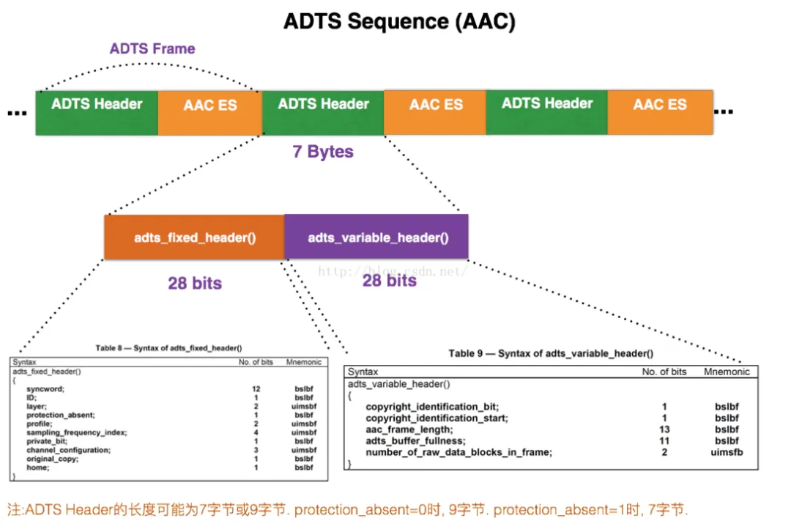

# AAC 音频格式

AAC（Advanced Audio Coding，高级音频编码）是一种由 MPEG-4 标准定义的有损音频压缩格式，由 Fraunhofer 发展，Dolby、Sony 和 AT&T 是主要的贡献者。

---

## 一、存储格式：ADIF 与 ADTS

AAC 有两种存储格式：

- **ADIF**：Audio Data Interchange Format，音频数据交换格式。这种格式的特征是可以确定地找到音频数据的开始，不需进行在音频数据流中间开始的解码，即它的解码必须在明确定义的开始处进行。故这种格式常用在磁盘文件中。
- **ADTS**：Audio Data Transport Stream，音频传输流格式。AAC 音频格式在 MPEG-2（ISO-13318-7 2003）中有定义。AAC 后来又被采用到 MPEG-4 标准中。这种格式的特征是它是一个有同步字的比特流，解码可以在这个流中任何位置开始。它的特征类似于 MP3 数据流格式。

---

## 二、ADTS 帧结构

### 2.1 整体结构

ADTS 结构由 Header 和 Raw Data 两部分组成：

| ADTS Header（7 或 9 字节） | AAC Raw Data（变长） |
|----------------------------|----------------------|
| 固定头 + 可变头（+ 可选 CRC） | 音频原始数据 |



> 这里的 AAC ES 就是 Raw Data Block。

### 2.2 固定头（Fixed Header）

固定头信息在同一个音频流中通常是不变的（如采样率、声道）。

| 字节 | 位 (Bit) | 长度 | 字段名 | 说明 |
|------|----------|------|--------|------|
| Byte 0 | 0 ~ 7 | 8 | Syncword | 同步字，始终为 `0xFF` |
| Byte 1 | 0 ~ 3 | 4 | Syncword（续） | 同步字继续，`0xF`（合起来是 `0xFFF`） |
| Byte 1 | 4 | 1 | ID | MPEG 版本：0 为 MPEG-4，1 为 MPEG-2 |
| Byte 1 | 5 ~ 6 | 2 | Layer | 始终为 `00` |
| Byte 1 | 7 | 1 | Protection absent | 1 表示无 CRC，0 表示有 CRC（Header 变为 9 字节） |
| Byte 2 | 0 ~ 1 | 2 | Profile | AAC 类型（如 LC、Main、SSR） |
| Byte 2 | 2 ~ 5 | 4 | Sampling Freq Index | 采样率索引（如 4 表示 44100Hz） |
| Byte 2 | 6 | 1 | Private bit | 私有位，通常设为 0 |
| Byte 2 | 7 | 1 | Channel Config（高 1 位） | 声道配置 |

### 2.3 可变头（Variable Header）

可变头信息每一帧都可能变化，最重要的就是帧长度。

| 字节 | 位 (Bit) | 长度 | 字段名 | 说明 |
|------|----------|------|--------|------|
| Byte 3 | 0 ~ 1 | 2 | Channel Config（低 2 位） | 组合 Byte 2 最后 1 位构成完整声道数 |
| Byte 3 | 2 | 1 | Originality | 0：复制品，1：正版 |
| Byte 3 | 3 | 1 | Home | 0 |
| Byte 3 | 4 | 1 | Copyrighted Id Bit | 0 |
| Byte 3 | 5 | 1 | Copyrighted Id Start | 0 |
| Byte 3 | 6 ~ 7 | 2 | Frame Length（高 2 位） | 整个帧的长度（Header + Data） |
| Byte 4 | 0 ~ 7 | 8 | Frame Length（中 8 位） | 长度中间部分 |
| Byte 5 | 0 ~ 2 | 3 | Frame Length（低 3 位） | 组合起来总共 13 bits |
| Byte 5 | 3 ~ 7 | 5 | ADTS Buffer Fullness | `0x7FF` 表示码率可变（VBR） |
| Byte 6 | 0 ~ 1 | 2 | Number of Raw Blocks | 帧内包含的原始数据块数量 - 1 |
| Byte 6 | 2 ~ 7 | 6 | CRC（可选） | 仅当 Protection absent = 0 时存在 |

### 2.4 9 字节 ADTS（CRC 保护）

当 `protection_absent = 0` 时，ADTS Header 变为 9 字节，在 Bytes 0~6 之后额外增加 2 字节 CRC：

| 字节 | 位 | 长度 | 字段名 | 说明 |
|------|-----|------|--------|------|
| Byte 0~6 | 0 ~ 55 | 56 | 前述所有字段 | 包含同步字、采样率、帧长度等 |
| Byte 7 | 0 ~ 7 | 8 | CRC Checksum（高 8 位） | 校验和的高位部分 |
| Byte 8 | 0 ~ 7 | 8 | CRC Checksum（低 8 位） | 校验和的低位部分 |

**CRC 校验的范围**：这 16 位的 CRC 并不是为了校验整个音频帧（Raw Data），而是为了保护 Header 本身以及原始数据块中的关键控制信息。

- **目的**：在无线传输（如数字广播）或不稳定的网络环境下，如果 Header 信息错了一位，解码器会发出刺耳的爆音甚至崩溃。
- **校验范围**：通常校验 ADTS Header 以及每个 Raw Data Block 中最前面的关键信息部分。

### 2.5 7 字节 vs 9 字节对比

| 特性 | 7 字节 Header | 9 字节 Header |
|------|--------------|---------------|
| `protection_absent` 值 | 1（表示"不校验"） | 0（表示"要校验"） |
| 文件大小 | 略小（省 2 字节/帧） | 略大 |
| 容错性 | 弱（数据错位可能导致解码失败） | 强（可检测并丢弃损坏的帧） |
| 常见场景 | 本地文件（.m4a、.mp4）、稳定网络 | 广播、数字电视、低质量无线链路 |

---

## 三、ADIF 帧结构

ADIF（Audio Data Interchange Format）的最大特点是：**全文件只有一个 Header**。

如果说 ADTS 是"外卖盒"（每一份肉都自带餐具，随时可以开吃，丢了一盒也不影响下一盒），那么 ADIF 就是"精致礼盒"（所有的说明书都在盖子上，一旦盖子丢了，里面的肉就不知道怎么吃了）。

**核心区别：一次性 Header vs. 帧帧 Header**

- **ADTS（流式）**：`[Header1][Data1] [Header2][Data2] [Header3][Data3] ...`
- **ADIF（文件式）**：`[Header] [Data1] [Data2] [Data3] [Data4] ...`

### 3.1 ADIF Header 结构

| ADIF ID（4 字节） | Copyright（9 字节） | Bitstream Config & Elements（变长） |
|-------------------|---------------------|-------------------------------------|
| 识别标志 | 版权信息 | 采样率、声道等配置 |

### 3.2 ADIF 详细字段

| 字段名 | 长度 (Bits) | 说明 |
|--------|-------------|------|
| `adif_id` | 32 | 固定为 `'ADIF'`（`0x41 0x44 0x49 0x46`） |
| `copy_id_present` | 1 | 是否有版权信息 |
| `copy_id` | 72 | （可选）版权识别码 |
| `original_copy` | 1 | 0：拷贝，1：原作 |
| `home` | 1 | 0：外部，1：内部 |
| `bitstream_type` | 1 | 0：定码率（CBR），1：变码率（VBR） |
| `bitrate` | 23 | 码率大小 |
| `num_program_config_elements` | 4 | 程序配置元素的个数（通常为 0，表示 1 个） |
| PCE（Program Config Element） | 变长 | 最关键部分：包含 Profile、采样率、声道布局 |

### 3.3 为什么现在很少见到 ADIF？

虽然 ADIF 比 ADTS 更节省空间（省去每帧 7~9 字节的开销），但有两个致命弱点：

1. **无法随机访问**：如果想从音频中间开始播放，必须先回到文件头读取那唯一的 Header。如果文件头损坏，整个文件就废了。
2. **不适合实时流**：在直播中，用户随时可能进入直播间。如果使用 ADIF，晚进来的用户因没听到开头的 Header，无法解码后续数据。

因此，ADIF 主要用于磁盘存储，而现在的互联网世界（直播、视频封装、MP4）几乎全是 ADTS 或封装在 ISO 容器里的 AAC。

---

## 四、ADTS 与 ADIF 对比

| 特性 | ADTS | ADIF |
|------|------|------|
| 同步字 | 每一帧都有 `0xFFF` | 仅文件头有 `'ADIF'` |
| 随机跳转 | 支持（搜同步字即可） | 不支持（必须从头读） |
| 容错性 | 高（坏一帧不影响后面） | 低（头坏了全玩完） |
| 开销 | 较大（每帧多 7~9 字节） | 极小（全局仅一个头） |
| 适用场景 | 移动网络、直播、广播 | 极其有限的本地存储 |

### 一个有趣的发现

如果用十六进制查看器打开一个 `.aac` 文件，开头是 ADIF 还是 `0xFFF1`？

- 99% 的概率会看到 `0xFFF1`，因为那其实是一个 ADTS 流。
- 真正的 ADIF 文件非常罕见，甚至很多现代播放器都不一定能完美支持它。

---

## 五、伪同步（False Sync）问题

### 5.1 问题来源

如果在解析 AAC 流时，仅靠寻找 `0xFFF`（同步字）来定位帧头，而音频数据（Raw Data）里恰好也出现了 `0xFFF`，这种现象叫做**伪同步（False Sync）**。

**为什么 Raw Data 会有 `0xFFF`？**

AAC 是经过哈夫曼编码（Huffman Coding）压缩的二进制流。由于它是位流（Bitstream），任何随机的比特组合都有可能出现。连续 12 个比特全为 1（`0xFFF` 的前 12 位）的概率虽然较低，但在长达几小时的音频中几乎必然发生。

### 5.2 解码器的防御策略

解码器并不会"傻找"每一个 `0xFFF`，而是采用三步校验：

**第一步：检查 Header 的合法性**

当搜寻到 `0xFFF` 后，解码器会立即检查紧随其后的几个比特：

- `Layer`：必须是 `00`。如果是其他值，肯定不是 ADTS 头。
- `Sampling Frequency Index`：必须在 0 到 12 之间（13~15 是保留值）。
- `Profile`：常见的只有几种，如果是非法值，排除。

**第二步：利用 FrameLength 跳跃验证（最核心）**

1. 在位置 A 发现 `0xFFF`。
2. 解析出该 Header 里的 Frame Length（假设是 500 字节）。
3. 直接跳过 500 字节，到达位置 B。
4. 检查位置 B 是否也是 `0xFFF`。
5. 如果 B 也是同步字，且两者的采样率、声道数等信息一致，那么 A 是真帧头的概率接近 100%。

```
找到同步字 A ------> 读取长度 L ------> 跳到 A + L 处
      |                                   |
      v                                   v
  [ 0xFFF... ] --(中间是音频数据)-- [ 恰好也是 0xFFF? ]
      ^                                   ^
      |                                   |
    如果是，则 A 是合法帧；如果不是，回到 A+1 位继续搜寻。
```

**第三步：CRC 校验（针对 9 字节 Header）**

如果 `protection_absent == 0`，解码器会计算 Header 和部分数据的 CRC。如果 `0xFFF` 是伪造的，CRC 校验极大概率会失败。

### 5.3 极端情况：起始位置就是错的

如果从文件中间位置随机读取：

1. 可能先撞上一个伪同步字。
2. 根据这个"假长度"跳到下一个位置，发现那里不是 `0xFFF`。
3. 解码器会回退，从上一个发现点的下一个字节（Byte A + 1）重新开始逐比特搜索，直到连续找到 2~3 个对齐的帧为止。

---

## 参考资料

- [AAC 音频格式分析](https://zhuanlan.zhihu.com/p/1983640602584305875)
- [音视频封装格式：AAC音频基础和ADTS打包方案详解](https://cloud.tencent.com/developer/article/1746985?policyId=1004)
