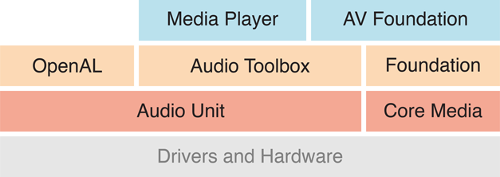
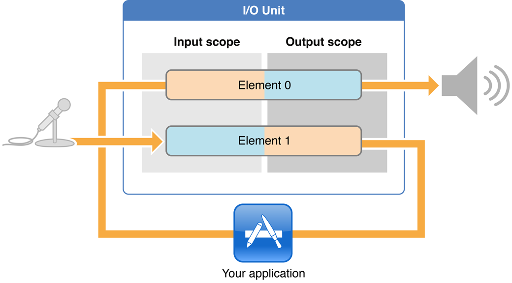

这篇文章来自 [这里](https://xueshi.io/2022/03/12/AudioUnit-01-IOUnit/) 深入浅出的讲解了 AudioUnit 的基本概念和用法


Apple 平台上如果涉及到音频采集，很难避开 AudioUnit 这个工具库，AudioUnit 是 Audio Toolbox 下的一套有年头的 C API, 功能相对也比较强大，虽然苹果最近几年推出并逐渐在其基础之后完善了一套 AVAudioUnit 的 OC/Swift 的 API, 但 AudioUnit 依然有很广泛的使用，而且了解这套 C API 也对理解 AVAudioUnit 内部的实现和使用有很大的帮助.

其实里面的概念并不是特别复杂，但是因为文档比较老旧，概念也比较绕，上手并不易。我此前做唱歌和直播 app 相关的工作，对 AudioUnit 使用的也比较多，积累了一些经验，希望能够最大程度地把一些通用的概念和使用方法分享出来。接下来将带大家剖析 AudioUnit 的内部原理和丰富多样的使用方式，如果你在做涉及到声音采集和处理的工作，希望能带大家深入浅出地摸透 AudioUnit.

关于 AudioUnit 的文章是一个系列，我希望能够把之前的经验结合一些实际的场景来介绍，大概分为以下四个部分:

1. 熟悉 IO Unit 结构和运行机制，使用它来进行录制和播放
2. 熟悉其他类型的 AudioUnit, 比如 Mixer, Effect, Converter 等
3. 使用 AUGraph 串联起来 AudioUnit, 以及常用的使用模式
4. 熟悉使用 AVAudioUnit 进行音频采集和播放

本文中我们先来看第一部分.

## 1. AudioUnit 介绍
如下图，可见 iOS 上所有的音频基础都是基于 AudioUnit 的，比如 AudioToolbox、Media Player, AV Foundation 等都是在 AudioUnit 上做的封装. AudioUnit 本身处理效率非常高，实时性也很强，支持 VoIP 常见下进行回声消除、降噪等处理.

<!-- 这是一张图片，ocr 内容为：MEDIA PLAYER AV FOUNDATION FOUNDATION OPENAL AUDIO TOOLBOX CORE MEDIA AUDIOUNIT DRIVERS AND HARDWARE -->


## 2. IO Unit 的结构
其实 AudioUnit 分为一下几类:

+ IO Unit: 音频采集和播放，回声消除、降噪等
+ Effect Unit: 效果器，比如 EQ 均衡器
+ Mixing Unit: 字面意思，就是 “混音”, 可以 mix 多路输入，产生一路输出
+ Format Converter: 格式转换器，比如采样率 48000 下采样为 44100, 或者双声道转为单声道等等.

我们首先直接来看 IO Unit, 这是最核心的一个 AudioUnit, 其他的种类将会在后面的篇幅里介绍。我喜欢先说原理，再上代码是示例，这样会比较好理解.

首先，IO Unit 的职责就是负责 音频的采集和播放. 他是通过系统硬件打交道，可以说是封装了硬件的实现，降低我们和硬件打交道的成本。涉及到哪些硬件呢？我们简单地思考一下，采集一定要和麦克风打交道，播放呢，就是听筒或者扬声器.

在介绍 IO Unit 的结构设计之前，我们先想象一下，如果我们来设计实现这个模型，大概是什么样子？可能是这样的:

输入硬件 (麦克风) -> 采集到的原始音频数据 -> 自定义处理音频数据 -> 处理后的音频数据 -> 输出设备 (扬声器 / 听筒)

我们可以将此分为两部分:

1. 输入硬件 (麦克风) -> 采集到的原始音频数据
2. 待播放的音频数据 -> 输出设备 (扬声器 / 听筒)  
当然我们拿到了 “采集到的原始音频数据” 之后，就可以自行处理，然后做为 “待播放的音频数据” 塞给输出设备。这个设计基本上不能再精简了。事实上 IO Unit 的设计也是很类似的:

<!-- 这是一张图片，ocr 内容为：AUDIOUNIT OUTPUT SCOPE LNPUT SCOPE AUDIO STREAM ELEMENT O ELEMENT 1 AUDIO STREAM GLOBAL S ISCOPE ELEMENT O -->


这个图非常重要，初看会有点困惑，我们来看一下每个部分，首先有两个概念需要了解下:

1. Element, 很多 API 里也用 bus 来表示，这两个词在这里完全等价。我们可以理解为 一节水管. IO Unit 固定有两个 Element.
2. Scope, 如果 Element 理解为水管的话，这个 Scope 就是 水管的两头 , 每个 Element 固定有两个 Scope, 左侧 Input Scope 是流入口，右侧 Output Scope 是流出口.

这里的 Element 1 是输入水管，因为 1 和 I (Input) 很像，Element 0 表示输出水管，0 和 O (Output) 很像。这样就比较好记了，但是注意，这个约定只在 IO Unit 里起作用。我们分开来看.

Element 1 作为输入水管，左侧 (Input Scope) 固定连接着硬件麦克风，不可改动，右侧 (Output Scope) 是水管的出口，从这里，我们就可以拿到采集到的音频数据.

Element 0 是输出水管，左侧 Input Scope 可以传入要播放的数据，右侧 Output Scope 固定连着扬声器 / 听筒，如果我们想播放什么音频，从 Element 0 的 Input Scope 传入就可以了.

这么看是不是上面我们自己设计的很类似？只是苹果用新增了 Element 和 Scope 的概念。虽然看着两个 Bus 是一体的，其实 Element 0 和 1 是可以独立使用的.

参考下图，从以上我们可以知道，我们可以从 Element 1 的 Output Scope 拿到采集到的音频数据，拿到之后，Application 层就可以对其做任何想做的处理。然后呢，我们可以把要处理后要播放的音频数据塞给 Element 0 的 Input scope, 这样扬声器里就播放这段音频，这样的话，我们耳朵里就听到了录制到的声音，也就实现了耳返监听的功能 (可见耳返在 iOS 上实现非常简单，而且是系统内置支持，延迟很低，Android 上会比较麻烦：软件耳返延迟高，硬件耳返需要单独对接各家手机厂商).

除此之外，Scope 上可以设置很多属性，比如说，设置音频的格式，如果我想采集 48000 的 16 bit float 的数据，那在 Element 1 的 Output Scope 上设置就可以了。同理，我们也需要在 Element 0 的 Input Scope 处设置我们塞过去的数据的格式，这样 Element 0 就知道如何播放了.

<!-- 这是一张图片，ocr 内容为：LVOUNIT OUTPUT SCOPE INPUT SCOPE JG ELEMENT O ELEMENT1 YOUR APPLICATION -->


前面提到 Element 0 和 Element 1 是相互独立的，也就是说可以只使用其中的一个，或者两个都使用。这也是有实际意义的，比如纯录制场景，只需把采集到的文件保存到文件里，不涉及到播放，或者纯播放场景，想用 AudioUnit 播放一段 mp3 数据.

到此，IO Unit 的结构基本介绍完了。如果有困惑或者疑问的话，欢迎留言讨论.

## 3. Remote IO (媒体音量) vs VPIO (通话音量)
IO Unit 实际分为两种模式: Remote IO 和 VPIO, Remote IO 就是封装了和硬件的交互，从而实现采集和播放的功能. VPIO 全称是 Voice Processing IO, 它主要用于 VoIP (Voice over IP) 场景，比如音视频通话，它的结构和 Remote IO 结构完全相同，只是多增加了回声消除和降噪的特点.

这里注意一下 VPIO 和 VoIP 的区别，前者是 apple 平台 AudioUnit 里特有的概念，VoIP 是通用概念.

另外圈内会把 Remote IO 接地气地称为 媒体音量 , 把 VPIO 称为 通话音量. 他们的区别有以下几点:

1. Remote IO (媒体音量) 下因为没有做回声消除和降噪，所以音质非常好，适合播放音乐等高音质的场景。音量条可以向下调整到 0.
2. VPIO (通话音量) 下有回声消除和降噪，很适合不带耳机通话的场景，避免中间产生回声和啸叫，但代价是对音质有损伤，适合通话的场景。音量调最小只能设置到 1 格，无法调整到 0 格，也可以根据这个特点判断当前属于哪种模式.

Ps: 上面说的调节音量条，都是调节的 播放音量 , 采集音量无法通过硬件调节，可以通过 AudioUnit 的 volume 属性调节.

这里主要介绍 Remote IO, VPIO 很类似，这里不多做介绍，感兴趣的可以查看对应的 API 即可.

接下来我们来实战一下了.

## 4. 如何从 IO Unit 获取采集到的数据？InputCallback!
通过上面的介绍我们知道，要拿到 IO Unit 的数据，需要从 Element 1 入手. AudioUnit 提供了一个通用的方法，我们问一个 AudioUnit 要数据，可以通过 AudioUnitRender 函数来实现.

```c
OSStatus AudioUnitRender(
    AudioUnit inUnit,
    AudioUnitRenderActionFlags * __nullable ioActionFlags,
    const AudioTimeStamp * inTimeStamp,
    UInt32 inOutputBusNumber,
    UInt32 inNumberFrames,
    AudioBufferList *ioData
) API_AVAILABLE(macos(10.2), ios(2.0), watchos(2.0), tvos(9.0));
```

这是一个 C 函数，所以 in 开头的表示传入的参数，io 表示既可以是传入的参数，也可能会被内部修改，作为传出的数据。第一个参数是我们向哪个 AudioUnit 要数据，第二个是一个 flags 配置，第三个是时间戳，第四个是 bus number, 即 element number, 对于 IO Unit 采集来说，那肯定是 Element 1 了。第五个参数 NumberFrames 就是音频帧数量，最后一个就是返回的数据，使用 AudioBufferList 来承接。这里我们先有个概念.

我们知道这么获取了，那我们可以设置一个定时器，然后定时去通过 AudioUnitRender 去获取。虽然这是一种方法，但不推荐，AudioUnit 支持设置一个 Input Callback, 告诉我们何时有可用的数据。我们通过设置 Input Callback, 在 Input Callback 里调用 AudioUnitRender 函数获取采集到的数据.

我们来看一个例子，这个例子通过上面说的 InputCallback 和 AudioUnitRender 函数获取音视频数据，然后保存到文件中。代码示例如下，第一次涉及到具体的代码，这里会从从头开始介绍，这段代码是基于 WebRTC 里的实际场景略作修改的.

```c
// 创建 IO Unit, 创建之前, 需要先创建 description, 这是创建 AudioUnit 的标准做法, 还有其他的办法来创建, 后面的部分会介绍
  AudioComponentDescription io_unit_description;
  // Output 表示 IO Unit
  io_unit_description.componentType = kAudioUnitType_Output;
  // subtype 我们设置为 RemoteIO, 如果要 AEC/ANS, 需要设置为 kAudioUnitSubType_VoiceProcessingIO
  io_unit_description.componentSubType = kAudioUnitSubType_RemoteIO;
  io_unit_description.componentManufacturer = kAudioUnitManufacturer_Apple;
  io_unit_description.componentFlags = 0;
  io_unit_description.componentFlagsMask = 0;

  // Obtain an audio unit instance given the description.
  // 通过 desc 获取 AudioUnit
  AudioComponent io_unit_ref =
      AudioComponentFindNext(nullptr, &io_unit_description);

  // 创建一个 Remote IO audio unit.
  if (CheckHasError(AudioComponentInstanceNew(io_unit_ref, &io_unit_),
                    "create io unit")) {
    io_unit_ = nullptr;
    return false;
  }

  // Enable input on the input scope of the input element.
  // 打开 Input Bus, 上面介绍到 Input Bus 和 Output Bus 是独立的, 这里我们只采集, 不播放, 所以只打开 Input Bus.
  UInt32 enable_input = 1;
  if (CheckHasError(AudioUnitSetProperty(io_unit_, kAudioOutputUnitProperty_EnableIO,
                                      kAudioUnitScope_Input, kInputBus, &enable_input,
                                      sizeof(enable_input)),
                 "set Property_EnableIO on inputbus : input scope")) {
    return false;
  }

  // Enable output on the output scope of the output element.
  // 因为只录制, 所以关闭 output
  UInt32 enable_output = 0;
  if (CheckHasError(AudioUnitSetProperty(io_unit_, kAudioOutputUnitProperty_EnableIO,
                                      kAudioUnitScope_Output, kOutputBus,
                                      &enable_output, sizeof(enable_output)),
                 "set Property_EnableIO on kOutputBus : output scope")) {
    return false;
  }

  // Disable AU buffer allocation for the recorder, we allocate our own.
  // TODO(henrika): not sure that it actually saves resource to make this call.
  // 表示是否在音频输入总线上分配缓冲区
  UInt32 flag = 0;
  if (CheckHasError(AudioUnitSetProperty(
                                      io_unit_, kAudioUnitProperty_ShouldAllocateBuffer,
                                      kAudioUnitScope_Output, kInputBus, &flag, sizeof(flag)),
                 "set Property_ShouldAllocateBuffer on inputbus : output scope")) {
    return false;
  }

// 设置 AudioFormat, 这里 format 不影响理解, 细节暂不展开
// 注意我们设置采集的音频格式, 需要设置在 Input Bus 的 Output Scope, 如果有点困惑, 需要再看一前面的图和介绍.
  AudioStreamBasicDescription format = audio_format_;
  UInt32 size = sizeof(format);
  // Set the format on the output scope of the input element/bus.
  if (CheckHasError(AudioUnitSetProperty(io_unit_, kAudioUnitProperty_StreamFormat, kAudioUnitScope_Output, kInputBus, &format, size),
  "set Property_StreamFormat on inputbus : output scope")) {
    return false;
  }

//   Specify the callback to be called by the I/O thread to us when input audio is available. The recorded samples can then be obtained by calling the AudioUnitRender() method.

  // 这里设置 input callback, 该 callback 是个结构题, input_callback.inputProc 指定一个静态函数, AudioUnit 一旦采集到了数据, 就会调用这个函数通知我们, 然后我们使用 AudioUnitRender 从 IO Unit 中获取采集到的数据
  AURenderCallbackStruct input_callback;
  input_callback.inputProc = OnRecordedDataIsAvailable;
  input_callback.inputProcRefCon = this;
  if (CheckHasError(AudioUnitSetProperty(io_unit_, kAudioOutputUnitProperty_SetInputCallback, kAudioUnitScope_Output, kInputBus, &input_callback, sizeof(input_callback)),
                 "Set input callback on InputBus")) {
    return false;
  }
```

回调函数的实现:

```c
OSStatus OnRecordedDataIsAvailable(void * inRefCon,
                                   AudioUnitRenderActionFlags *ioActionFlags,
                                   const AudioTimeStamp *inTimeStamp,
                                   UInt32 inBusNumber,
                                   UInt32 inNumberFrames,
                                   AudioBufferList *ioData) {
    samples::AudioUnitRecorder *wrapper = static_cast<samples::AudioUnitRecorder *>(inRefCon);

    // 调用 AudioUnitRender 函数索要采集的数据
    // 第一个参数是我们的 ioUnit
    // 最后一个参数需注意, ioData 参数在这里 永远为 null, 所以不能把这个参数直接传给 AudioUnitRender, 需要我们自定义一个 AudioBufferList, 并非配好内存空间之后, 传给 AudioUnitRender, 它会将采集到的数据填充到该 list 中.
    // 其他参数我们直接透传即可
    OSStatus status = CheckErrorStatus(AudioUnitRender(wrapper->io_unit_, ioActionFlags, inTimeStamp, inBusNumber, inNumberFrames, &wrapper->audio_buffer_list_),
                                     "AudioUnitRender call");
    if (status == noErr && wrapper->on_record_callback_) {
        // 回调给上层, 上层会把 raw audio data 保存到文件中.
        wrapper->on_record_callback_(wrapper->audio_buffer_list_);
    }
    return status;
}
```


至此，我们就拿到了采集到的数据。完整版本参考 [AudioUnitRecorder](https://github.com/XueshiQiao/AudioUnitSamples/blob/main/AudioUnitSamples/Common/AudioUnitRecorder.mm)

## 5. 如何塞给 IO Unit 待播放的音频数据？RenderCallback!
根据我们前面介绍的可知，如果要播放音频数据的话，我们需要往 Element 0 的 Input Scope 传递数据，AudioUnit 也给我们提供了另外一个 callback 叫做 RenderCallback, 方法的签名和 InputCallback 一致，不同的是，callback 的最后一个参数是初始化好的，我们可以直接往里写数据即可。代码示例:

```c
...
    // 这里我们需要 enable output
    UInt32 enable_output = 1;
if (CheckHasError(AudioUnitSetProperty(io_unit_, kAudioOutputUnitProperty_EnableIO, kAudioUnitScope_Output, kOutputBus,  &enable_output, sizeof(enable_output)),
                    "set Property_EnableIO on kOutputBus : output scope")) {
    return false;
}
...
    // 设置我们传入的音频数据格式
    if (CheckHasError(AudioUnitSetProperty(io_unit_, kAudioUnitProperty_StreamFormat, kAudioUnitScope_Input, kOutputBus, &format, size), "set Property_StreamFormat on outputbus : input scope")) {
        return false;
    }
...

    // Render Callback 是 IO unit 的 outpus 主动回调我们, 索要即将要播放的数据, 我们在这个回调, 我们填充满 ioData, 这部分数据将会被播放出来.
    // 如果想静音的话, flag 需要设置为 kAudioUnitRenderAction_OutputIsSilence, 并且把 ioData 的数据全置为 0.
    AURenderCallbackStruct render_callback;
render_callback.inputProc = OnAskingForMoreDataForPlayingRenderCallback;
render_callback.inputProcRefCon = this;
if (CheckHasError(AudioUnitSetProperty(io_unit_,
                                         kAudioUnitProperty_SetRenderCallback,
                                         kAudioUnitScope_Input,
                                         kOutputBus,
                                         &render_callback,
                                         sizeof(render_callback)),
                    "set render callback on output bus: input scope")) {
    return false;
}
...
```

OnAskingForMoreDataForPlayingRenderCallback 函数的实现:

```c
OSStatus OnAskingForMoreDataForPlayingRenderCallback(
    void * inRefCon,
    AudioUnitRenderActionFlags *ioActionFlags,
    const AudioTimeStamp *inTimeStamp,
    UInt32 inBusNumber,
    UInt32 inNumberFrames,
    AudioBufferList *ioData) {
    AudioUnitPlayer *player = static_cast<AudioUnitPlayer*>(inRefCon);
    bool eof = false;
    // 这里内部实现会读取本地 PCM 数据, 并填充到 ioData->mBuffers[0].mData 里.
    player->on_ask_audio_buffer_callback_(ioData->mBuffers[0].mData,
                                        ioData->mBuffers[0].mDataByteSize, eof);
    if (eof) {
        //...
    }
    return noErr;
}
```

完整版本参考 [AudioUnitPlayer](https://github.com/XueshiQiao/AudioUnitSamples/blob/main/AudioUnitSamples/Common/AudioUnitPlayer.mm)

到这里可以思考一下小问题，如果我们有个需求：录制人声，播送到耳返里，同时保存到本地一份，这个应该这么做呢？

1. 通过 InputCallback 和 AudioUnitRender 拿到采集到的 Buffer
2. 把这段 buffer 缓存起来，当 AudioUnit 的 RenderCallback 回调的时候，把缓存起来的 buffer copy 到 ioData 里
3. 在第二步缓存的同时，写入到本地文件一份

## 6. 总结
至此，我们的第一部分结束了。我们回顾一下主要内容:

1. 认识到 AudioUnit 在 iOS/macOS 整体音频体系中的位置
2. 熟悉 AudioUnit 中最重要的一个类型 IO unit 的实现结构。它有两个 Element, 0 表示输出 (播放), 1 表示输入 (采集), 相当于两节水管，每个 Element 有两个 Scope, 相当于水管的两头. Element 1 这段水管的源头 (Input Scope) 固定连着麦克风，Element 0 这段水管的尽头 (Output Scope) 固定连接着输出设备 (e.g. 扬声器).
3. 然后我们通过 InputCallback 通知我们，并使用 AudioUnitRender 驱动 Element 1 拿到采集到的音频数据。同时可以通过 AudioUnitRenderCallback 往 Element 0 的 Input Scope 填充待播放的数据.
4. 了解了 RemoteIO 和 VPIO 各自的特点

Ref:

1. [AudioUnit Hosting Guide](https://developer.apple.com/library/archive/documentation/MusicAudio/Conceptual/AudioUnitHostingGuide_iOS/AudioUnitHostingFundamentals/AudioUnitHostingFundamentals.html#//apple_ref/doc/uid/TP40009492-CH3-SW27)
2. [AudioUnit Samples @ GitHub](https://github.com/XueshiQiao/AudioUnitSamples)

  


