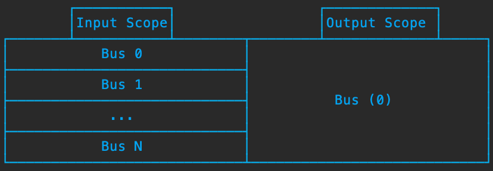
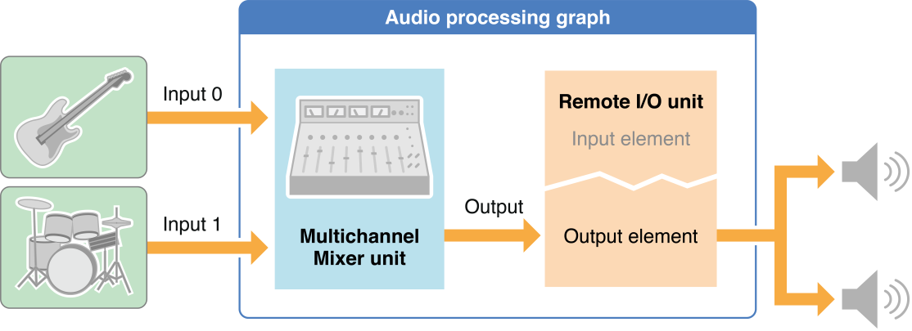
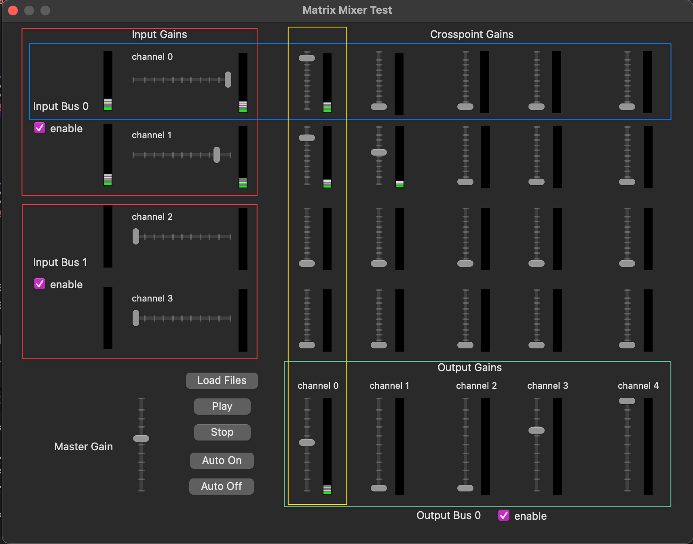

篇文章来自 [这里](https://xueshi.io/2022/03/19/AudioUnit-02-Mixer-and-Effect-Units/) 深入浅出的讲解了 AudioUnit Mixing 的基本概念和用法


本系列的 [第一篇](https://xueshi.io/2022/03/12/AudioUnit-IOUnit/) 中介绍到了 AudioUnit 中和系统硬件交互的 IO Unit, 以及如何使用它进行音频的采集和播放。本文是该系列的第二篇，将会介绍 AudioUnit 中另外 四类 非常重要的 AudioUnit: Mixing 、 Effect Unit 、 Converter Unit 以及 Generator Unit.

## 1. Mixing Unit
Mixing unit 在实际场景中非常的实用，特别我们需要对多路音频做处理或者播放。比如对于音频制作 app 来做，通常要支持混入 N 多种乐器的声音和片段，比如 吉他、钢琴、贝斯、人声、和声等等。这个时候使用 Mixing unit 把这些 input bus 混成一路 output 交给 IO Unit 播放，就是一个很必要且自然的结果.

Mixing Unit 是一个种类，苹果内部提供了三个子类型:

```c
CF_ENUM(UInt32) {
    kAudioUnitSubType_MultiChannelMixing  = 'mcmx',
    kAudioUnitSubType_MatrixMixing        = 'mxmx',
    kAudioUnitSubType_SpatialMixing       = '3dem',
};
```


### 1.1 MultiChannelMixing
MultiChannelMixing 是一个 多输入、单输出 的结构，特点是:

1. 支持任意多的 input bus, 每个 input 都可以有任意多的 channel (声道) 数
2. 只有一路输出 ouput bus, 这一路 output bus 也可以有任意多的 channel 数

把这些 input bus 的声音混和，从 output bus 输出，每一路 input bus 可以独立设置数据源、音频格式、音量、mute 等，这个是 Mixing 通用特点，下同.

下面我们看一下它的结构，相比 IO Unit 这个理解起来就比较简单了.

<!-- 这是一张图片，ocr 内容为：INPUT SCOPE OUTPUT SCOPE 0 BUS 1 BUS (0) BUS BUS -->


MultilChannelMixing 是 多输入、单输出 的结构，可以自由配置 input bus 的数量，配置完之后，一个配置为 N 输入的 bus number 从 0 开始 到 N-1. Output bus 的个数只有一个，bus number 固定为 0.

每个 input bus 可以设置独立的 RenderCallback 或者连接前序的 AudioUnit 提供数据，可以设置独立的音频格式参数，以及控制当前 input 的音量和 mute 状态等等.

来看一个 sample, 这个 Mixing 设置了两个 input bus, 一个 output bus, 两个 input bus 分别连接到吉他和架子鼓的音频信号，mix 之后，output bus 连接到 IO Unit 的 output bus 上，它固定连接到硬件输出设备上。这样就完成了把吉他和架子鼓的音频信号给播放出来的效果。如果硬件连接的耳机的话，那么带上耳机就可以实现监听这两个乐器声音的效果了.

<!-- 这是一张图片，ocr 内容为：AUDIOPROCESSING GRAPH INPUT O REMOTE 1/O UNIT LNPUT ELEMENT OUTPUT INPUT1 MULTICHANNEL OUTPUT ELEMENT MIXER UNIT -->


input bus 数量通过 set kAudioUnitProperty_ElementCount 属性设置:

```c
UInt32 mixer_input_buses_num = 2;
AudioUnitSetProperty(export_mixer_unit_,
                     kAudioUnitProperty_ElementCount,
                     kAudioUnitScope_Input,
                     0, &mixer_input_buses_num, sizeof(mixer_input_buses_num));
```  


然后可以通过 kAudioUnitProperty_StreamFormat 单独设置每个 input 的音频格式:

```c
// mixer 有 n 个 bus 的话, bus number 从 0 开始 到 n-1
// 我们定义第一个 bus: bus 0 接吉他, 定义一个常量
constexpr UInt32 kMixerGuitarInputElementNumber = 0;
// 我们定义 bus 1 接架子鼓
constexpr UInt32 kMixerDrumKitInputElementNumber = 1;
// ...

AudioUnitSetProperty(export_mixer_unit_,
                     kAudioUnitProperty_StreamFormat,
                     kAudioUnitScope_Input,
                     kMixerGuitarInputElementNumber,
                     &format_, sizeof(AudioStreamBasicDescription));

AudioUnitSetProperty(export_mixer_unit_,
                     kAudioUnitProperty_StreamFormat,
                     kAudioUnitScope_Input,
                     kMixerDrumKitInputElementNumber,
                     &format_, sizeof(AudioStreamBasicDescription));
```


接下来就可以给每个 input bus 设置 RenderCallback, 从而填充对应的音频数据.

### 1.2 MatrixMixing
MatrixMixing 是一个 多输入、多输出 的结构，特点:

1. 支持任意多的 input bus, 每个 input 可以有任意多的 channels
2. 支持 任意多的 output bus (这点和 MultiChannelMixing 不同), 每个 output 可以有任意多的 channels
3. MatrixMixing 可以非常精细地控制每个 output channel 的音量，控制方式呈现为矩阵状，可以通过下面 4 个环节来精确地控制最终 mix 之后每个 channel 的音量
    1. input bus 里的每个 channel 的输入音量
    2. ouput bus 里的每个 channel 输出音量
    3. 交叉点音量 (就是某个 input bus channel 参与 mix 到某个 output bus channel 的音量）
    4. 整个矩阵的全局音量  
可见 MatrixMixing 的功能更强大，使用更灵活，也更复杂一些，关于它的使用，苹果提供了一个 sample [MatrixMixerTest](https://developer.apple.com/library/archive/samplecode/MatrixMixerTest/Introduction/Intro.html), 运行出来的界面是这样的:

<!-- 这是一张图片，ocr 内容为：MATRIX MIXER TEST CROSSPOINT GAINS INPUT GAINS CHANNEL O INPUT BUS O ENABLE TI T                                                                                                  CHANNEL1 ILI I I I I  CHANNEL 2 一一一一一一一一一一一一 INPUT BUS 1 ENABLE IT IT IT IT CHANNEL 3 OUTPUT GAINS LOAD FILES CHANNEL 0 CHANNEL1 CHANNEL 3 CHANNEL4 CHANNEL 2 PLAY STOP MASTER GAIN 二二二 AUTO ON AUTO OFF OUTPUT BUS 0 ENABLE -->


界面元素比较多，我也花了点时间读了源码。它实现的功能是这样的，支持最多两路输入 (从文件读入), 对应 MatrixMixing 的两个 input bus, 每个 input 有两个 channel (声道), 他们体现在界面的左侧红框选中的部分。这四个声道都可以独立的控制音量，slider 就是用来控制音量大小的。然后呢，matrix 设置了一个 output bus, 就是一个输出，但是这一个输出配置了 5 个 channels, 对应下方绿色的部分，这五个 声道也都可以独立设置音量.

设置的源码如下:

```c
// 设置两个 input bus/element
numbuses = 2;
printf("set input bus count %u\n", (unsigned int)numbuses);
result = AudioUnitSetProperty(mixer,
                              kAudioUnitProperty_ElementCount,
                              kAudioUnitScope_Input,
                              0,
                              &numbuses,
                              sizeof(UInt32));

// 设置一个 output bus/element
numbuses = 1;
printf("set output bus count %u\n", (unsigned int)numbuses);
result = AudioUnitSetProperty(mixer,
                              kAudioUnitProperty_ElementCount,
                              kAudioUnitScope_Output,
                              0,
                              &numbuses,
                              sizeof(UInt32));

for (int i=0; i<2; ++i) {
    ...
    // 每个 input format 的 channel 都是 2
    desc.ChangeNumberChannels(2, false);
    desc.mSampleRate = kGraphSampleRate;

    printf(">> set input format for bus %d\n", i);
    desc.Print();
    result = AudioUnitSetProperty(mixer,
                                  kAudioUnitProperty_StreamFormat,
                                  kAudioUnitScope_Input,
                                  i,
                                  &desc,
                                  sizeof(desc));
}

result = AudioUnitGetProperty(mixer,
                             kAudioUnitProperty_StreamFormat,
                             kAudioUnitScope_Output,
                             0,
                             &desc,
                             &size);

// output format 的 channel 设置为 5
desc.ChangeNumberChannels(5, false);
desc.mSampleRate = kGraphSampleRate;
result = AudioUnitSetProperty(mixer,
                              kAudioUnitProperty_StreamFormat,
                              kAudioUnitScope_Output,
                              0,
                              &desc,
                              sizeof(desc));
```


右上侧是 CrossPoint, 其实就是 input 和 output channel 的交叉的部分，那黄色框的部分来说，它是 ouput bus 的 channel 0 的组成部分，分别来自于 Input Bus 0 的 左右 channel, Input Bus 1 的左右 channel, 共四个 channel, 这四个 channel 的贡献值也都可以在 crosspoint 这里控制。非常的灵活.

另外左下角 master gain 控制整体的 matrix mixer 的总音量.

MatrixMixing 还有两个几个参数可以设置，比较重要的是 kAudioUnitProperty_MatrixDimensions 和 kAudioUnitProperty_MatrixLevels.

#### 1.2.1 kAudioUnitProperty_MatrixDimensions
它用来获取 MatrixMixing AudioUnit 的 dimensions, 它是两个 UInt32 的值，分别表示所有 input bus 里的 channels 的个数、所有 output bus 的 channels 个数.  
在上面这个例子里，就是 4 和 5.

```c
UInt32 dims[2];
UInt32 theSize = sizeof(UInt32) * 2;
OSStatus result = AudioUnitGetProperty(matrixMixing,
                                      kAudioUnitProperty_MatrixDimensions,
                                      kAudioUnitScope_Global, 0, dims, &theSize);
// dims[2] = [4, 5];
```


#### 1.2.2 kAudioUnitProperty_MatrixLevels
MatrixLevels 存放了上面 UI 界面中所有展示的音量值，包括 input channel 的音量、output channel 的音量、 全局 master 音量 以及 crosspoint 的音量. MatrixLevels 是一个 (input channels + 1) * (output channels + 1) 大小的二维 Float32 数组。上面例子中有 4 个 input channels, 以及 5 个 output channels, 所以 levels 数组是 Float32[5][6].  
如图所示:  
<!-- 这是一张图片，ocr 内容为：0,5 0,3 0,2 0,0 0,1 0,4 1,1 1,3 1,4 1,2 1,5 1,0 2,3 2,2 2,1 2,5 2,0 2,4 3,5 3,2 3,3 3,4 3,0 3,1 4,3 4,1 4,5 4,2 4,0 4,4 -->
  
其中:

1. 全局的 master 音量放在了 volumes [4][5] (黄色部分，右下角位置)
2. input 的音量放在了最后一列 volumes [0][5]、volumes [1][5]、volumes [2][5]、volumes [3][5]  
(红色部分，最右侧一列，除了最下面的 [4][5])
3. output 的音量放在了最后一行 volumes [4][0]、volumes [4][1]、volumes [4][2]、volumes [4][3]、volumes [4][4]  
(绿色部分，最后一行，除了最右侧的 [4][5])
4. Crosspoint 的音量放在了他们对应的位置上，就是从 volumes [0][0] 一直到 volumes [3][4], 也就是白色部分.

获取 MatrixLevels 的例子:

```cpp
UInt32 dims[2];

UInt32 theSize = ((dims[0] + 1) * (dims[1] + 1)) * sizeof(Float32);
Float32 *theVols = static_cast<Float32*>(malloc(theSize));

AudioUnitGetProperty (au, kAudioUnitProperty_MatrixLevels,
    kAudioUnitScope_Global, 0, theVols, &theSize);
```


#### 1.2.3 设置音量
我们注意到 sample 里设置四种音量的方式:

```objc
- (IBAction)setInputVolume:(id)sender {
    // Input Volume 是常规方式, 设置对应 Input Bus number, 以及 Input Scope 的 kMatrixMixerParam_Volume 值
    UInt32 inputNum = [sender tag] / 100 - 1;
    AudioUnitSetParameter(mixer, kMatrixMixerParam_Volume, kAudioUnitScope_Input, inputNum, [sender doubleValue] * .01, 0);
}

- (IBAction)setOutputVolume:(id)sender {
    // Output Volume 也是常规方式, 设置对应 Output Bus number, 以及 Output Scope 的 kMatrixMixerParam_Volume 值
    UInt32 outputNum = [sender tag] % 100 - 1;
    AudioUnitSetParameter(mixer, kMatrixMixerParam_Volume, kAudioUnitScope_Output, outputNum, [sender doubleValue] * .01, 0);
}

- (IBAction)setMasterVolume:(id)sender {
    // MasterVolume 这里开始不一样了, 需要操作在 0xFFFFFFFF 这个 bus number, 以及 Global Scope 上.
    AudioUnitSetParameter(mixer, kMatrixMixerParam_Volume, kAudioUnitScope_Global, 0xFFFFFFFF, [sender doubleValue] * .01, 0);
}

- (IBAction)setMatrixVolume:(id)sender {
    UInt32 inputNum = [sender tag] / 100 - 1;
    UInt32 outputNum = [sender tag] % 100 - 1;

    // 设置 CrossPoint 音量的值也不太寻常, 也是在 Global Scope 上, 对应的 element 是个计算出来的 UInt32 位值,
    // 高 16 位来自于 Input Bus Number, 低 16 位表示 Output Bus Number.
    // 这部分没有找到任何的文档说明, 如果不看到这块源码, 不太可能知道怎么设置, kind of tricky..
    UInt32 element = (inputNum << 16) | (outputNum & 0x0000FFFF);
    AudioUnitSetParameter(mixer, kMatrixMixerParam_Volume, kAudioUnitScope_Global, element, [sender doubleValue] * .01, 0);
}
```


### 1.3 SpatialMixing
SpatialMixing, 如果 input 是单声道的话，则可以配置 3D 坐标和参数，产生 3D 音频的效果；如果是立体声，则会直接混到 ouput 里. SpatialMixing 只有一个 output bus, 它可以有 2, 4, 5, 6, 7 或 8 个 channels.

## 2. Effect Unit
接下来我们来看一下苹果提供了哪些 音效的 unit:

```c
CF_ENUM(UInt32) {
    kAudioUnitSubType_PeakLimiter       = 'lmtr',  //
    kAudioUnitSubType_DynamicsProcessor = 'dcmp',  // 动态的压缩器和扩张器
    kAudioUnitSubType_LowPassFilter     = 'lpas',  // 低通, 设置频率上限, 丢掉高于该频率的部分
    kAudioUnitSubType_HighPassFilter    = 'hpas',  // 高通, 设置频率下限, 丢掉低于该频率的部分
    kAudioUnitSubType_BandPassFilter    = 'bpas',  // 带通, 设置频率范围, 丢掉该范围以外的频率
    kAudioUnitSubType_HighShelfFilter   = 'hshf',  // 实现高音控制
    kAudioUnitSubType_LowShelfFilter    = 'lshf',  // 实现低音控制
    kAudioUnitSubType_ParametricEQ      = 'pmeq',  // 参数 EQ
    kAudioUnitSubType_Distortion        = 'dist',  // 失真
    kAudioUnitSubType_Delay             = 'dely',  // 延迟
    kAudioUnitSubType_SampleDelay       = 'sdly',  // 延迟 (一定数量的采样数)
    kAudioUnitSubType_NBandEQ           = 'nbeq',  // EQ, 根据 band(频率范围) 设置 EQ
    kAudioUnitSubType_Reverb2           = 'rvb2'   // 实现混响效果
};
```


这些概念大部分都是混音领域的概念，每个种类都做了注释，和技术关系不大，我们这里不做详细介绍了.

注意哦，这里的混音不是把几路音频 mix 一下的概念，形象一点的比喻，就类似对图片进行 ps 处理，突出优点，弱化缺点，最终是要让声音更好听.  
感兴趣的同学，可以去 B 站上搜索了解这些混音概念的作用和使用方法，相关内容很丰富.

## 3. Converter Unit
我们来看最后一个 Converter Unit:

```c
CF_ENUM(UInt32) {
    kAudioUnitSubType_AUConverter        = 'conv',
    kAudioUnitSubType_Varispeed          = 'vari',
    kAudioUnitSubType_DeferredRenderer   = 'defr',
    kAudioUnitSubType_Splitter           = 'splt',
    kAudioUnitSubType_MultiSplitter      = 'mspl',
    kAudioUnitSubType_Merger             = 'merg',
    kAudioUnitSubType_NewTimePitch       = 'nutp',
    kAudioUnitSubType_AUiPodTimeOther    = 'ipto',
    kAudioUnitSubType_RoundTripAAC       = 'raac',
};
```


iOS 上支持的只有 AUConverter 和 NewTimePitch, AUConverter 用来进行格式的转换，比如输入采样率 44100, 输出希望为 48000. 当 AudioUnit 的输入和输出的格式不一致时，AudioUnit 内部也会使用该 unit 进行自动转换。所以大部分情况下我们都不需要手动去转换. NewTimePitch 是用来修改音调的，可以产生 变调不变速 的效果，在唱歌场景下很有用途.

## 4. Generator
Generator, 直译就是生成器，对外结构上，它没有 input scope, 只有 output scope 产生音频数据，有点类似 IO Unit 的 Input bus, 它也是只产生数据 (采集到的声音). 只不过 Generator 主要通过读取文件或者声音片段，再往 output scope 提供数据.

Apple 在 iOS 上提供了两个 Generator:

```c
CF_ENUM(UInt32) {
    kAudioUnitSubType_ScheduledSoundPlayer   = 'sspl',
    kAudioUnitSubType_AudioFilePlayer        = 'afpl'
};
```


AudioFilePlayer, 顾名思义，就是文件播放器，更确切的叫法应该是 AudioFileReader 比较合适，它负责读取音频文件。适合播放本地的音频文件，比如伴奏等.  
ScheduledSoundPlayer, 用来读取音频片段，同时可以指定一个时间点，在这个时间点播放这段音频。相比 AudioFilePlayer 粒度更细.

## 5. 总结
本文属于《深入理解 AudioUnit》系列的第二篇，主要介绍了 Mixing AudioUnit 的三种类型和结构，详细介绍了他们自己的特点。同时了解了 Effect、Converter、Generator 这几类 AudioUnit.

下一篇我们将会了解到 如何把我们了解到的这些 AudioUnit 串联起来，实现一个具体的场景.

