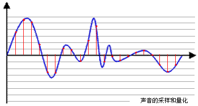
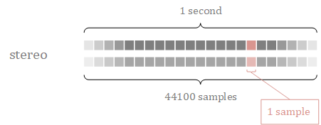
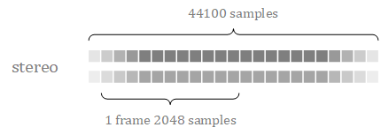
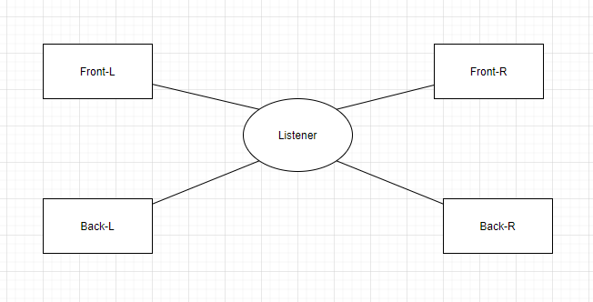
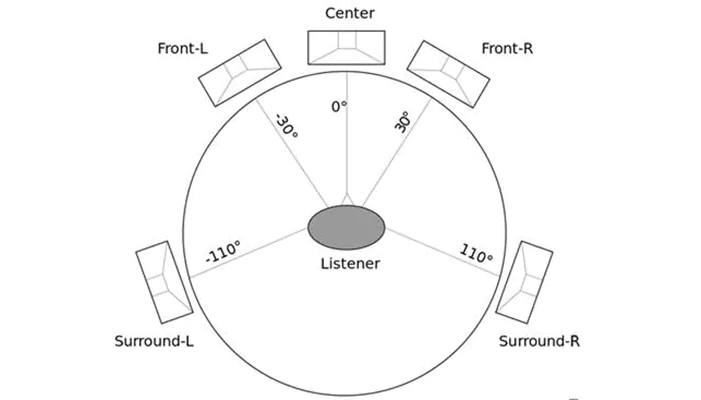
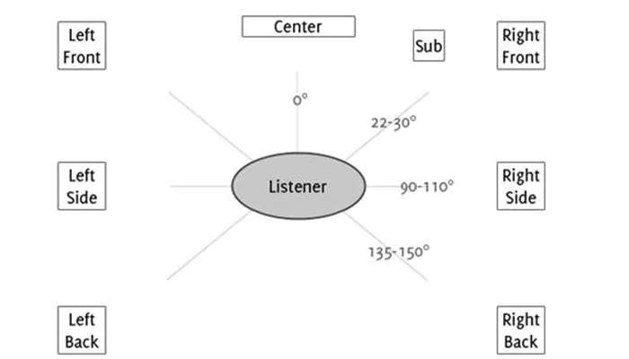
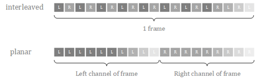

## 基础概念

在实时音视频领域，我们的日常工作都会围绕在这几个方面：

1. **采样率（Sampling Rate）**：指音频信号在时间轴上的采样频率，即每秒采样的次数。常见取值有44.1kHz、48kHz、96kHz等；
2. **量化位数（Bit Depth）**：指音频信号在幅度轴上的精度，通常是16bit或24bit；
3. **声道数（Channels）**：指音频信号的声道数量，常见的有单声道（Mono）和双声道（Stereo）；
4. **噪音水平（Noise Floor）**：指在没有任何声音输入的情况下，音频信号中的噪音水平。一般来说，噪音水平越低，音质越好；
5. **动态范围（Dynamic Range）**：指音频信号中最高和最低幅度之间的差值，也就是音频信号的最大振幅值与噪音水平之间的差值；
6. **音频延迟（Audio Latency）**：指信号从输入到输出的时间延迟。音频延迟越低，实时性越好；
7. **编码格式（Codec）**：指将音频信号压缩并编码的方式，常见的编码格式有MP3、AAC、PCM等。编码格式不同会影响音频质量和文件大小；

### 采样率

采样率(sampleRate), 采样率就是每秒从连续信号中提取并组成离散信号的采样个数，它用赫兹（Hz）来表示，说的简单一点就是每秒在每个声道上采样的个数。采样就是把模拟信号数字化的过程，不仅仅是音频需要采样，所有的模拟信号都需要通过采样转换为可以用0101来表示的数字信号，示意图如下所示：



蓝色代表模拟音频信号，红色的点代表采样得到的量化数值。采样频率越高，红色的间隔就越密集，记录这一段音频信号所用的数据量就越大，同时音频质量也就越高。根据奈奎斯特理论，采样频率只要不低于音频信号最高频率的两倍，就可以无损失地还原原始的声音。通常人耳能听到频率范围大约在20Hz～20kHz之间的声音，为了保证声音不失真，采样频率应在40kHz以上。常用的音频采样频率有：8kHz、11.025kHz、22.05kHz、16kHz、37.8kHz、44.1kHz、48kHz、96kHz、192kHz等。

采样越高，声音的还原就越真实越自然，人对频率的识别范围是 20HZ - 20000HZ, 如果每秒钟能对声音做 20000 个采样, 回放时就足可以满足人耳的需求. 所以 22050 的采样频率是常用的, 44100已是CD音质, 超过48000的采样对人耳已经没有意义。

**常用采样率**

- 8,000 Hz - 电话所用采样率, 对于人的说话已经足够
- 11,025 Hz - AM调幅广播所用采样率
- 22,050 Hz和24,000 Hz - FM调频广播所用采样率
- 32,000 Hz - miniDV 数码视频 camcorder、DAT (LP mode)所用采样率
- 44,100 Hz - 音频 CD, 也常用于 MPEG-1 音频（VCD, SVCD, MP3）所用采样率
- 47,250 Hz - 商用 PCM 录音机所用采样率
- 48,000 Hz - miniDV、数字电视、DVD、DAT、电影和专业音频所用的数字声音所用采样率
- 50,000 Hz - 商用数字录音机所用采样率
- 96,000 或者 192,000 Hz - DVD-Audio、一些 LPCM DVD 音轨、BD-ROM（蓝光盘）音轨、和 HD-DVD （高清晰度 DVD）音轨所用所用采样率
- 2.8224 MHz - Direct Stream Digital 的 1 位 sigma-delta modulation 过程所用采样率。

这和电影的每秒 24 帧图片的道理差不多：



### 采样位数（位深）

位深度，也叫位宽，量化精度，上图中，每一个红色的采样点，都需要用一个数值来表示大小，这个数值的数据类型大小可以是：4bit、8bit、16bit、32bit等等，位数越多，表示得就越精细，声音质量自然就越好，当然，数据量也会成倍增大。常见的位宽有：8bit 或者 16bit。

- 8bit (也就是1字节) 只能记录 256 个数, 也就是只能将振幅划分成 256 个等级；
- 16bit (也就是2字节) 可以细到 65536 个数, 这已是 CD 标准了；
- 32bit (也就是4字节) 能把振幅细分到 4294967296 个等级, 实在是没必要了.

量化位数又叫做**采样位数**、**位深度**、**分辨率**， 它是指声音的连续强度被数字表示后可以分为多少级。N-bit的意思声音的强度被均分为2^N级。16-bit的话，就是65535级。这是一个很大的数了，人可能也分辨不出六万五千五百三十五分之一的音强差别。也可以说是声卡的分辨率，它的数值越大，分辨率也就越高，所发出声音的能力越强。这里的采样倍数主要针对的是信号的**强度特性**，采样率针对的是信号的**时间（频率）特性**这是两个不一样的概念。

二进制编码。也就是把量化所得的结果，即单个声道的样本，以二进制的码字进行存放。其中有两种存放方式：

- 直接以整形来存放量化结果，即 **Two's complement code**；
- 以浮点类型来存放量化结果，即 **Floating point encoding code**。

大多数格式的PCM样本数据使用整形来存放，而在对一些对精度要求高的应用方面，则使用浮点型来表示PCM 样本数据。

#### 帧

音频在量化得到二进制的码字后，需要进行变换，而变换（MDCT）是以块为单位（block）进行的，一个块由多个（120或128）样本组成。而一帧内会包含一个或者多个块。帧的常见大小有960、1024、2048、4096等。一帧记录了一个**声音单元**，它的长度是样本长度和声道数的乘积。FFmpeg中 `AVFrame` 结构体中的 `nb_samples` 代表的就是一帧中单个声道的音频样本数量。



### 声道

声道是指在**不同空间位置**录制或播放声音时采集或播放的**独立**音频信号。通俗的讲就是：声道数就是声源总数，比如：录制棚内在不同方位上安放的录音器，最后录制的音频就是多声道的；播放多声道的音频文件，不同声道的音频信号通过对应声道的扬声器播放出来。

由于音频的采集和播放是可以叠加的，因此，可以同时从多个音频源采集声音，并分别输出到不同的扬声器，故声道数一般表示声音录制时的音源数量或回放时相应的扬声器数量。单声道（**Mono**）和双声道（**Stereo**）比较常见，顾名思义，前者的声道数为1，后者为2。

1. **单声道**的音频只有一个音源，它是一种比较原始的再现声音的方式；它的主要目的是让人感觉声音只在一个地方发出来。单声道音频在双声道或多声道设备上播放，每个声道的音频信号完全一致，没有一点点差异，起不到立体效果；
2. **立体声**是使用两个或多个独立音频通道的声音再现，其方式可产生从各个方向听到的声音的感觉，就像在自然听觉中一样。将不同的扬声器插入到不同的声道上，扬声器中就会播放对应的声道音频信号。现实中使用最多的是双声道的耳机，有时候我们会感觉耳机左右的声音信号强弱不同，声音也有差别，这说明当前播放的音频是立体声的；如果听起来完全没什么区别，就是单声道的音频；
3. **4.0环绕声** 也就是四声道，4.0环绕声在将四个扬声器放置到四个角落的场景非常有用。听众可以听到四个方位传入耳朵的声音。该环绕声系统设备放置方位如下：



4. **5.1 环绕声** 系统使用6个通道，其中5个标准通道和1个超低音通道。该环绕声系统设备放置方位图如下：



5. **7.1环绕声** 系统使用8个声道，其中7个标准声道和1个超低音声道。该环绕声系统设备放置方位图如下：



### Sample、Frame、Packet

这三个概念很重要，很容易搞混，苹果在其 [Core Audio](https://developer.apple.com/library/archive/documentation/MusicAudio/Conceptual/CoreAudioOverview/WhatisCoreAudio/WhatisCoreAudio.html) 官方文档中明确定义了 _audio stream_, _channel_, _sample_, _frame_, _packet_ 和 _sample rate_ 这些概念：

- **sample** is single numerical value for a single audio channel in an audio stream.
- **frame** is a collection of time-coincident samples. For instance, a linear PCM stereo sound file has two samples per frame, one for the left channel and one for the right channel.
- **packet** is a collection of one or more contiguous frames. A packet defines the smallest meaningful set of frames for a given audio data format, and is the smallest data unit for which time can be measured. In linear PCM audio, a packet holds a single frame. In compressed formats, it typically holds more; in some formats, the number of frames per packet varies.

从上面文档定义，简单来说，可以这样理解：

- **sample** 是一个声道的一个采样；
- **frame** 是一个时间点的样本集合，举例来说，一个线性的PCM 双声道音频文件每个Frame有2个样本，一个左声道样本，和一个右声道样本；
- **packet** 是一个或多个 frame 的集合，一个 packet 包含多少个 frame，是由声音文件格式决定的。譬如 PCM 文件格式中一个 packet 包含 1 个frame。而 MP3 文件格式中一个 packet 包含 1152 个frames；

从上面定义来看这三个概念互相独立，定义清晰，这些概念为什么容易搞混？然而在日常讨论中，会在多种场合下使用 frame 和 packet 两个词，但是各种场合下它们代表的含义是不同的，所以比较容易搞混。举下面不同场景的例子来说明：

1. 在讨论 MPEG 格式的时候，如网上常见的MPEG文件格式介绍，把 MPEG 一个 header + payload （帧头 + 数据内容）的数据结构叫做一个 frame (MPEG数据帧)，一个 MPEG 数据帧包含了多个音频帧。事实上这个东东在上述 iOS Core Audio 定义中，却又被称为一个 packet。所以两份文档中，分别使用了 packet 和 frame 两个词指代同一个概念；
2. 网络传输音频的时候，会把音频数据进行打包发送，这个时候也用到 packet 的概念，他有自己独立的 packet header 定义，又跟 iOS Core Audio 定义的 packet 不是同一个了；
3. 在讨论计算机网络时，硬件数据帧称为 frame，而数据链路层将 frame 打包成 packet 之后提供给上层网络层使用。 这里 frame 和 packet 的概念又跟音频讨论中的含义不一样了；
4. FFmpeg是一个音/视频编码解码及转换的开源软件。它定义了两个结构体，AVPacket 一份代表经过压缩的音频/视频数据，AVFrame 代表一份解压后的一个音频/视频数据。视频一个 AVPacket 通常只包含一个 AVFrame，经过压缩的音频 AVPacket 通常包括多个 AVFrame。可以看到 FFmpeg 在处理音频和视频时，对 packet 和 frame 概念的使用跟 iOS Core Audio 基本一致；

从上面例子可以看到，不同场景下都使用了 frame 和 packet 两个词语会代表不一样的含义。更糟糕的是，如果使用了中文"帧"，在某些语境下，到底是代表数据帧、音频帧、packet 还是 frame 呢，就更容易分不清楚了。

### 样本的组合方式

这个主要是针对双声道或多声道音频来说的，对于一个双声道音频来说，它的组合方式可能有以下两种：

1. **交错（interleaved）**。以stereo为例，一个stereo音频的样本是由两个单声道的样本交错地进行存储得到的。
2. **平面（planar）**。各个声道的样本分开进行存储。



FFmpeg 音频解码后的数据是存放在 AVFrame 结构中的：

- Packed 格式，frame.data[0] 或 frame.extended_data[0] 包含所有的音频数据中；
- Planar 格式，frame.data[i] 或者 frame.extended_data[i] 表示第 i 个声道的数据（假设声道0是第一个）, AVFrame.data 数组大小固定为8，如果声道数超过8，需要从 frame.extended_data 获取声道数据；

```c
enum AVSampleFormat {
    AV_SAMPLE_FMT_NONE = -1,
    AV_SAMPLE_FMT_U8,          ///< unsigned 8 bits
    AV_SAMPLE_FMT_S16,         ///< signed 16 bits
    AV_SAMPLE_FMT_S32,         ///< signed 32 bits
    AV_SAMPLE_FMT_FLT,         ///< float
    AV_SAMPLE_FMT_DBL,         ///< double

    AV_SAMPLE_FMT_U8P,         ///< unsigned 8 bits, planar
    AV_SAMPLE_FMT_S16P,        ///< signed 16 bits, planar
    AV_SAMPLE_FMT_S32P,        ///< signed 32 bits, planar
    AV_SAMPLE_FMT_FLTP,        ///< float, planar
    AV_SAMPLE_FMT_DBLP,        ///< double, planar
    AV_SAMPLE_FMT_S64,         ///< signed 64 bits
    AV_SAMPLE_FMT_S64P,        ///< signed 64 bits, planar

    AV_SAMPLE_FMT_NB           ///< Number of sample formats
};
```
