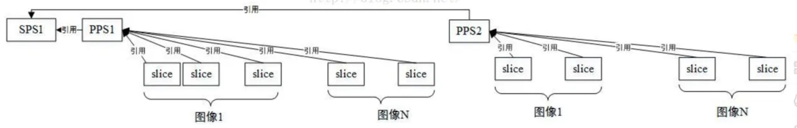
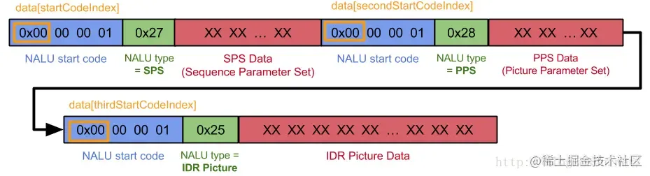
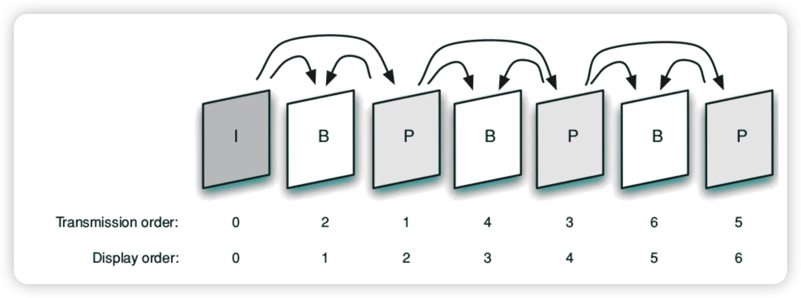
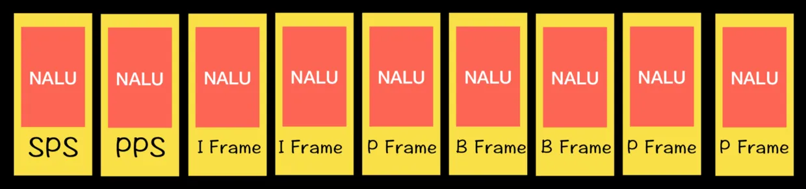
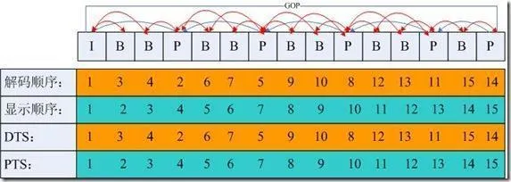
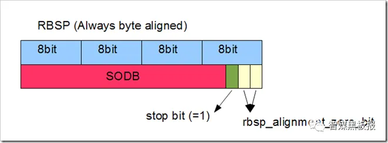
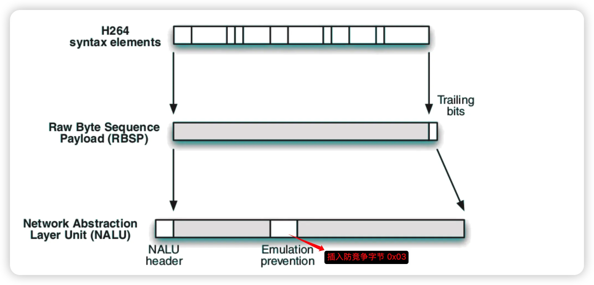

# H.264 学习笔记

## 一、码流概述

### 1.1 SPS 与 PPS

一般情况下，SPS 和 PPS 的 NAL Unit 位于整个码流的起始位置。封装文件一般只保存一次，位于文件头部。SPS/PPS 在整个解码过程中复用，不发生变化。

然而对于实时流，通常从流中间开始解码，因此需要在每个 I 帧前添加 SPS 和 PPS。如果编码器在编码过程中改变了码流参数（如分辨率），需要重新调整 SPS 和 PPS 数据。

H.264 码流的 NALU 顺序：

1. **SPS**（Sequence Parameter Sets）—— 序列参数集，存储序列级信息（分辨率、帧率等）
2. **PPS**（Picture Parameter Sets）—— 图像参数集，存储一帧图像的信息
3. **IDR**（Instantaneous Decoding Refresh）—— 即时解码刷新，作为随机访问点

> 解码时必须先获取 SPS 和 PPS 的信息，才能正确解析后续数据。



### 1.2 码流分层

H.264 码流分为两层：

- **NAL 层**（Network Abstraction Layer）—— 负责打包、传输、帧边界识别
- **VCL 层**（Video Coding Layer）—— 负责视频内容的压缩编码



### 1.3 完整 NALU 单元结构



### 1.4 显示序与解码序

显示序（Display Order）是帧/场的播放顺序。解码顺序与显示顺序可能不同（如 B 帧）。



### 1.5 H264 码流中的 NALU



---

## 二、帧类型

### 2.1 I 帧（关键帧）

I 帧采用**帧内压缩技术**，完整保存当前画面，不依赖其他帧即可解码。

拍摄视频时，1 秒内拍摄的内容变化很小（如电影 1 秒 25 帧）。为压缩数据，只保存第一帧作为关键帧，后续帧只存差异。I 帧是后续解码的基准，一旦损坏会导致后续所有帧无法解码。

### 2.2 P 帧（向前参考帧）

P 帧采用**帧间压缩技术**，只保存与前一帧的差异，压缩时只参考前一帧。

视频第一帧完整保存为关键帧，后续帧向前依赖，只存储与前一帧的差异数据，从而大幅减少存储量。

### 2.3 B 帧（双向参考帧）

B 帧采用**帧间压缩技术**，同时参考前一帧和后一帧，压缩率更高。

B 帧数量越多压缩率越高，但缺点是解码时需要等待后继帧传输过来，网络不好时会导致解码延迟。实时互动直播一般不使用 B 帧；泛娱乐直播可接受一定延迟时可用 B 帧提升压缩比。

### 2.4 GOP（Group of Picture）

GOP 表示一组帧，即从一个 I 帧到下一个 I 帧之间的完整数据。GOP 展示了三种帧的解码顺序和显示顺序——无论解码还是显示，都从 I 帧开始。



### 2.5 IDR 帧（立即解码刷新）

IDR 全称 **Instantaneous Decoding Refresh**，中文叫做立即解码刷新。IDR 一定是 I 帧，但 I 帧不一定是 IDR。一旦出现 IDR，就表示清除前面的序列，并且立刻渲染当前的 IDR 帧。

在每个 H.264 流的开头，都会出现这样的序列：`SPS帧 → PPS帧 → IDR帧 → 其余SLICE`，并且 SPS、PPS、IDR 三种帧必定搭配出现，缺一不可。如果少了其中任何一帧，都会导致后续视频流解码异常。

---

## 三、码流层次结构

### 3.1 VCL（Video Coding Layer）

VCL 是 H.264 的核心，负责尽可能高效地压缩视频内容，不关心传输方式。

**核心职责**：实现 H.264 标准中的所有压缩算法——帧内预测、帧间预测、运动补偿、变换量化等。将图像分解为片、宏块等基本处理单元。

**产出数据**：VCL 层输出的原始压缩数据称为 SODB（String Of Data Bits），是紧密排列的比特串，长度不一定是 8 的倍数（未字节对齐）。

### 3.2 SODB → RBSP → EBSP → NALU

VCL 层产生的 SODB 需要经过多层转换才能成为最终传输的 NALU：

```
SODB（原始比特串，非字节对齐）
  → RBSP（字节对齐 + 尾部填充）
  → EBSP（竞争预防插入 0x03）
  → NALU（加上 NAL Header）
```

### 3.3 RBSP（Raw Byte Sequence Payload）

**全称**：Raw Byte Sequence Payload，原始字节序列载荷。

**定义**：RBSP 位于 VCL 层与 NAL 层之间，是 VCL 输出的压缩比特流（SODB）经字节对齐填充后形成的数据块。

**尾部填充规则**（rbsp_trailing_bits）：

1. 在 SODB 末尾追加一个二进制 `1`（作为对齐标记）
2. 填充若干个 `0`，直到总长度成为 8 的倍数（字节对齐）



**常见 RBSP 类型**：

| NALU 类型 | RBSP 内容 | 说明 |
|-----------|-----------|------|
| 5（IDR 片） | slice_layer_without_partitioning_rbsp() | IDR 图像片数据 |
| 1（非 IDR 片） | slice_layer_without_partitioning_rbsp() | 非 IDR 图像片数据（如 P/B 片） |
| 6（SEI） | sei_rbsp() | 补充增强信息（用户数据、时间码等） |
| 7（SPS） | seq_parameter_set_rbsp() | 序列参数集（分辨率、帧率、Profile/Level 等） |
| 8（PPS） | pic_parameter_set_rbsp() | 图像参数集（熵编码类型、量化参数等） |
| 9（定界符） | access_unit_delimiter_rbsp() | 访问单元定界符 |

### 3.4 EBSP（Encapsulated Byte Sequence Payload）

**全称**：Encapsulated Byte Sequence Payload，封装字节序列载荷。

**定义**：EBSP 是 RBSP 经过竞争预防处理后的最终数据形态，构成 NALU 的主体部分（NALU Payload）。

**与 RBSP 的关系**：EBSP = RBSP + 竞争预防插入字节（0x03）。解码时需先去除 0x03 还原 RBSP。

**为什么需要竞争预防**：NALU 通过起始码（Start Code：`0x000001` 或 `0x00000001`）分隔。RBSP 数据本身可能偶然出现 `0x00 00 00` 或 `0x00 00 01` 等与起始码相同的序列，导致解码器误判。因此编码器在放入 NALU 前主动破坏这些伪起始码模式。

**插入规则**：逐字节扫描 RBSP，遇到 `0x00 00` 后若下一字节为 `0x00`~`0x03` 之一，则在这两个 `0x00` 后插入一个 `0x03`：

| 原始数据 | 编码后（防竞争处理） | 解码器恢复 |
|----------|---------------------|-----------|
| `0x00 00 00` | `0x00 00 03 00` | `0x00 00 00` |
| `0x00 00 01` | `0x00 00 03 01` | `0x00 00 01` |
| `0x00 00 02` | `0x00 00 03 02` | `0x00 00 02` |
| `0x00 00 03` | `0x00 00 03 03` | `0x00 00 03` |

> 简单记忆：只要出现 `0x00 00 [00-03]`，就改为 `0x00 00 03 [00-03]`。

**NALU 封装结构**：



- **Start Code**：`0x000001`（3 字节）或 `0x00000001`（4 字节），用于同步
- **NAL Header**：1 字节，包含 `forbidden_zero_bit`、`nal_ref_idc` 和 `nal_unit_type`
- **EBSP**：变长字节序列（RBSP 经竞争预防处理后的结果）

---

## 四、AnnexB 与 AVCC 格式

AnnexB 和 AVCC 是 H.264 两种主要的码流组织方式，区别在于如何识别 NALU 边界及存储 SPS/PPS 配置信息。

| 特性 | AnnexB | AVCC |
|------|--------|------|
| 分隔方式 | 起始码（`0x00 00 01` / `0x00 00 00 01`） | 长度前缀（1/2/4 字节） |
| SPS/PPS 存储 | 带内（嵌入码流中） | 带外（文件头/全局配置） |
| 主要应用 | 流媒体（TS、RTSP、广播） | 容器文件（MP4、MKV、MOV） |
| 优点 | 容错性好，可从任意位置解码 | 解析效率高，适合随机访问 |

> **注意**：iOS 的 VideoToolbox 框架在底层编解码时**仅原生支持 AVCC 格式**（也称为 MPEG-4 格式）。

### 4.1 AnnexB 格式

AnnexB 是一种字节流格式，主要用于实时流媒体传输（如 TS 流、RTSP 协议）。

- **分隔符**：每个 NALU 前添加起始码（`0x00 00 01` 或 `0x00 00 00 01`）
- **配置信息**：SPS 和 PPS 直接嵌入视频流中（带内传输），通常定期出现在关键帧之前
- **适用场景**：适合在容易出错或需要从任意位置开始解码的信道中传输

```
[start code] NALU | [start code] NALU | [start code] NALU | ...
```

### 4.2 AVCC 格式

AVCC 是一种封装格式，也称为 MPEG-4 格式，主要用于文件存储（如 MP4、MKV 容器）。

- **分隔符**：不使用起始码，每个 NALU 前使用长度前缀（1/2/4 字节），指明该 NALU 的字节长度
- **配置信息**：SPS 和 PPS 存储在容器头部（带外传输，通常在 `avcC` 记录中）
- **适用场景**：NALU 长度已知，解码器可更高效地进行内存分配和多线程并行处理

```
[extradata] | [length] NALU | [length] NALU | [length] NALU | ...
```

AVCC 格式的 NALU 中一般不包含 SPS/PPS，这些参数信息作为 `extradata` 存储在文件其他地方。

---

## 五、SPS 与 PPS 详解

### 5.1 SPS（序列参数集）

SPS 是 H.264/AVC 视频编码标准中非常重要的概念。简单来说，SPS 包含了针对一个完整视频序列（从序列开始到序列结束）的所有**全局编码参数**。可以把它理解为整个视频的"全局配置清单"或"元数据"。

**核心作用**：为解码器提供解码整个视频序列所必需的上下文信息。

- 告诉解码器如何配置：在解码器开始解码视频流之前，它必须先读取 SPS。SPS 中的信息告诉解码器视频的分辨率是多少、使用了什么编码档次（Profile）和级别（Level）、是否启用了某些高级工具等。
- 确保解码的正确性：如果没有 SPS，解码器将无法知道图像的大小，无法分配内存缓冲区，也无法正确解析后续的 NAL 单元。

**SPS 包含的主要信息**：

- **Profile 与 Level**
  - `profile_idc`：指明编码所用的工具集（如 Baseline、Main、High Profile 等）。解码器需要支持对应的档次才能解码。
  - `level_idc`：指明对码流的分辨率、帧率、码率等方面的最大限制。解码器根据这个来判断自身是否有能力解码该视频。

- **图像基础信息**
  - `pic_width_in_mbs_minus1` 和 `pic_height_in_map_units_minus1`：通过这些值可以计算出图像的宽和高（通常以宏块为单位，1 宏块 = 16×16 像素）。
  - `frame_crop_offsets`：精确的裁剪偏移量，用于确定最终显示的图像区域（去除黑边等）。
  - `chroma_format_idc`：色度采样格式（如 4:2:0、4:2:2、4:4:4）。

- **序列级缓冲和参考帧管理**
  - `num_ref_frames`：参考帧队列中最多可以存储多少个参考帧（用于帧间预测）。
  - `max_num_ref_frames`：最大参考帧数量。
  - `gaps_in_frame_num_value_allowed_flag`：是否允许帧号不连续。

- **图像尺寸与矩阵信息**
  - `pic_order_cnt_type`：表示图像顺序（POC，Picture Order Count）的计算方式，用于决定视频的显示顺序。
  - `vui_parameters`：VUI（视频可用性信息，Video Usability Information）。
    - 这是 SPS 中一个非常重要的扩展部分，虽然不是解码必须的，但对于正确显示和颜色渲染至关重要。
    - **宽高比**：告诉播放器画面是 4:3 还是 16:9。
    - **视频信号类型**：包括颜色原色（Color Primaries）、传输特性（Transfer Characteristics）、矩阵系数（Matrix Coefficients），这些决定了视频的色彩空间（如 BT.709 或 BT.2020）。
    - **帧率**：通过 timing_info 可以推算出视频的帧率。

**SPS 在码流中出现时机**：

- **NAL 单元类型**：SPS 的 NAL 单元类型值为 **7**。
- 在码流的开头：首先出现，紧随其后的是 PPS（NAL 类型 8），让解码器在一开始就能完成初始化。
- 在视频序列切换时：如果视频内容发生变化（例如从清晰度切换），码流中会重新插入一个新的 SPS。
- 在随机访问点（IDR 帧之前）：在支持快进、跳转播放的场合，IDR 帧之前通常会携带 SPS 和 PPS。
- 作为带外参数传递：在 RTP 实时流媒体传输中（如 RTSP 协议），SPS 和 PPS 通常通过带外协议（如 SDP 协议）在会话建立时提前发送给客户端。

### 5.2 PPS（图像参数集）

如果说 SPS 是描述整个视频序列的"全局章程"，那么 PPS（图像参数集，Picture Parameter Set）就是描述如何解码其中每一张图像的"施工蓝图"。它告诉解码器：针对当前要处理的这一帧画面，应该用哪种熵编码方式、用什么初始量化参数、是否启用某些滤波工具等。

**核心作用**：为一个或多个图像帧提供解码所需的公共参数。

- **引用 SPS**：PPS 内部通过 `seq_parameter_set_id` 字段，指明自己使用的是哪个 SPS 中定义的全局参数（如图像尺寸）。
- **被 Slice 引用**：每一个承载着具体图像数据的 Slice（条带）单元，都会在它的头部通过 `pic_parameter_set_id` 来指明自己使用的是哪个 PPS 的参数。

**PPS 包含的关键信息**：

| 语法元素 | 说明 |
|---------|------|
| `pic_parameter_set_id` | 标识当前 PPS 的 id，供 Slice 引用 |
| `entropy_coding_mode_flag` | 决定使用 CAVLC（上下文自适应变长编码）还是 CABAC（上下文自适应二进制算术编码）进行熵编码。CABAC 压缩率更高，但计算更复杂 |
| `pic_init_qp_minus26` / `pic_init_qs_minus26` | 用于计算图像开始编码时的初始量化步长，直接影响图像的编码质量和码率 |
| `weighted_pred_flag` / `weighted_bipred_idc` | 控制 P 帧和 B 帧是否启用加权预测，有助于提高含有淡入淡出、镜头运动等场景的编码效率 |
| `deblocking_filter_control_present_flag` | 表示 Slice 头中是否包含去块效应滤波器的控制信息，去块滤波器可平滑块边缘，提升视觉质量 |
| `num_slice_groups_minus1` | 定义了图像如何划分成多个 Slice 组（灵活宏块排序，FMO），这是一种增强抗误码能力的技术 |

**PPS 在码流中出现时机**：

- **NAL 单元类型**：PPS 的 NAL 单元类型值为 **8**。
- PPS 通常在码流的开头出现，紧跟在 SPS 之后。在随机访问点（如 IDR 帧）之前，也必须要有对应的 PPS。一个码流中可以有多个 PPS，通过 id 进行区分，以适应图像参数的动态变化。

> 总的来说，SPS 和 PPS 是解码器启动的"两把钥匙"。SPS 告诉你视频的分辨率、帧率等宏观信息，而 PPS 则提供了解码每一帧画面的微观配置。

### 5.3 Slice Header

Slice Header 包含单个片的解码所需的参数：

- **帧类型**：I 片、P 片、B 片
- **GOP 中解码帧序号**：参考帧列表
- **预测权重**：加权预测参数
- **滤波**：去块滤波器参数

---

## 六、码流参数速查

### 6.1 H264 Profile

| Profile | 说明 | 典型场景 |
|---------|------|----------|
| Baseline | 最低复杂度，不支持 B 片 | 实时通信 |
| Main | 支持 B 片、帧间压缩 | 广播 |
| High | 在 Main 基础上优化 | 高清视频 |

### 6.2 H264 Level

Level 限制每秒最大像素数、最大帧大小、最大比特率等。常见 Level 如 3.1（720p@30fps）、4.1（1080p@30fps / 720p@60fps）。

### 6.3 分辨率对应关系

| Level | 最大分辨率 | 典型场景 |
|-------|-----------|----------|
| 3.1 | 1280×720 | 720p |
| 4.0 | 1920×1080 | 1080p |
| 5.2 | 3840×2160 | 4K |

---

## 七、深入 H264
作者：糖鱼饭
链接：https://www.zhihu.com/question/635512384/answer/3453363081
来源：知乎
著作权归作者所有。商业转载请联系作者获得授权，非商业转载请注明出处。

音视频入个门也不难。ffmpeg、webrtc 源码拿来看看、h264、h265 编解码就是帧内预测和帧间预测那些、运动估计和运动补偿也就几个函数的事情，音频就是回声消除增益控制那一套，入门之后就知道后续怎么学习了。

带着问题看源码比较容易入门，比如 h264 编码这些问题：

- h264-VLC 层图像编码结构
- h264-帧(Frame)、场(Field)、行(Lines)
- h264-什么是 NAL
- h264-什么是 NAL 单元
- h264-帧内预测，4×4 块亮度预测
- h264-帧内预测，16×16 块亮度预测
- h264-帧内预测，8×8 块色度预测
- h264-帧内预测模式的选择
- h264-帧内预测的编码
- h264-帧间预测，亮度亚像素插值
- h264-帧间预测，色度亚像素插值
- h264-长期参考帧
- h264-运动矢量的编码优化
- h264-运动矢量预测的规则
- h264-SKIP 编码模式
- h264 的 IBP 帧预测编码顺序
- h264-亮度检测与加权预测
- h264 中整数 DCT 的 4×4 公式
- h264 中的量化器
- h264 的 4×4 整数 DCT 变换、量化过程
- h264 的游程编码
- h264 的熵编码
- h264 去块效应滤波器
- h264-SP 和 SI 帧的引入
- h264 码率控制
- 码率失真优化
- 拉格朗日乘法与编码模式的选择

## 参考资料

- [H.264 学习笔记](https://blog.gmem.cc/h264-study-note)
- [H.264 视频编码的基本概念、编码工具、编码流程及码流结构](https://www.nxrte.com/jishu/yinshipin/8179.html)
- [如何在 H264 码流的 SPS 中获取宽和高信息](https://www.nxrte.com/jishu/14432.html)
- [解析 H264 视频编码原理——从孙艺珍的电影说起（二）](https://juejin.cn/post/7084062884983996430)
- [音视频基础（二）下：编码之 h264 解析②](https://juejin.cn/post/7300557026434596875)
- [(推荐) H264, H265 硬件编解码基础及码流分析](https://juejin.cn/post/6844903853775650824)
- [H.264 中的 AnnexB 格式和 AVCC 格式](https://juejin.cn/post/7135092756095401998)
- [音视频开发——H264 编码【SPS 和 PPS】](https://juejin.cn/post/7172132096733872158)
- [编解码技术：H264 - SPS](https://hezhaojiang.github.io/post/2020/4b4fd3b8/)
- [音视频压缩：H264 码流层次结构和 NALU 详解](https://cloud.tencent.com/developer/article/1746993)
- [iOS VideoToolbox 硬编指南（避坑指南）](https://www.nxrte.com/jishu/4368.html)
- [H.264/AVC 视频编解码技术详解（系列）](https://blog.csdn.net/shaqoneal?type=blog)
- [音视频开发系统学习的浪漫马车之总目录（系列）](https://juejin.cn/post/7033711226827833351)
- [从零开始写 H264 解码器（1）总纲](https://cloud.tencent.com/developer/article/2032266)
- [RTP Payload Format for H.264 Video (RFC6184)](https://datatracker.ietf.org/doc/html/rfc6184)
