# (2 封私信 / 2 条消息) 音视频编解码之路：JPEG编码 - 知乎

> ## Excerpt
> 前言本篇是新开坑的 音视频编解码之路 的第一篇，这个系列主要通过书籍、网上的博文/代码等渠道，整理与各编码协议相关的资料和自己的理解，同时手撸下对应格式的“编解码器”，形成对真正编解码器的原理的基础认…

---
## 前言

本篇是新开坑的 `[音视频编解码](https://zhida.zhihu.com/search?content_id=171793642&content_type=Article&match_order=1&q=%E9%9F%B3%E8%A7%86%E9%A2%91%E7%BC%96%E8%A7%A3%E7%A0%81&zhida_source=entity)之路` 的第一篇，这个系列主要通过书籍、网上的博文/代码等渠道，整理与各[编码协议](https://zhida.zhihu.com/search?content_id=171793642&content_type=Article&match_order=1&q=%E7%BC%96%E7%A0%81%E5%8D%8F%E8%AE%AE&zhida_source=entity)相关的资料和自己的理解，同时手撸下对应格式的“[编解码器](https://zhida.zhihu.com/search?content_id=171793642&content_type=Article&match_order=1&q=%E7%BC%96%E8%A7%A3%E7%A0%81%E5%99%A8&zhida_source=entity)”，形成对真正编解码器的原理的基础认识，从而后续可以进一步研究真正意义上的编解码器如libx264的逻辑与优化。

之前在查找编解码的学习资料时，看到了[韦神的经验之谈](https://www.zhihu.com/question/26949947/answer/109563447)，因此就以`JPEG`的编码来开篇吧。

本篇整体脉络来自于[手动生成一张JPEG图片](https://link.zhihu.com/?target=https%3A//segmentfault.com/a/1190000021866901)，不过针对文章中的诸多细节做了补充和资料汇总，另外把代码也用C++和OOP的方式修改了下。范例工程位于[avcodec\_tutorial](https://link.zhihu.com/?target=https%3A//github.com/LinBinghe/avcodec_tutorial)。

## 编码步骤

基本系统的 JPEG 压缩编码算法一共分为 10 个步骤：

1.  颜色模式转换
2.  分块
3.  离散余弦变换（DCT）
4.  量化
5.  Zigzag 扫描排序
6.  DC 系数的差分脉冲调制编码（DPCM）
7.  DC 系数的中间格式计算
8.  AC 系数的游程编码（RLE）
9.  AC 系数的中间格式计算
10.  熵编码

接下去我们将逐一介绍上述的各个步骤，并在其中穿插涉及的一些概念与实际代码。

## 颜色模式转换

JPEG 采用的是 `YCbCr` 颜色空间，这里不再赘述为啥选择YUV等等重复较多的内容，之前没有接触过的可以看下[一文读懂 YUV 的采样与格式](https://link.zhihu.com/?target=https%3A//glumes.com/post/ffmpeg/understand-yuv-format/)和其他资料来补补课。

颜色模式从RGB转为YUV的过程中可以把采样也一起做了，这里Demo采样按照YUV444也就是[全采样](https://zhida.zhihu.com/search?content_id=171793642&content_type=Article&match_order=1&q=%E5%85%A8%E9%87%87%E6%A0%B7&zhida_source=entity)不做额外处理的方式简单实现，代码如下：

```cpp
uint8_t bound(uint8_t min, int value, uint8_t max) {
    if(value <= min) {
        return min;
    }
    if(value >= max) {
        return max;
    }
    return value;
}

bool JpegEncoder::rgbToYUV444(const uint8_t *r, const uint8_t *g, const uint8_t *b,
                              const unsigned int &w, const unsigned int &h,
                              uint8_t *const y, uint8_t *const u, uint8_t *const v) {
    for (int row = 0; row < h; row++) {
        for (int column = 0; column < w; column++) {
            int index = row * w + column;
            // rgb -> yuv 公式
            // 这里在实现的时候踩了个坑
            // 之前直接将cast后的值赋值给了y/u/v数组，y/u/v数组类型是uint8，计算出来比如v是256直接越界数值会被转成其他如0之类的值
            // 导致最后颜色效果错误
            int yValue = static_cast<int>(round(0.299 * r[index] + 0.587 * g[index] + 0.114 * b[index]));
            int uValue = static_cast<int>(round(-0.169 * r[index] - 0.331 * g[index] + 0.500 * b[index] + 128));
            int vValue = static_cast<int>(round(0.500 * r[index] - 0.419 * g[index] - 0.081 * b[index] + 128));
            // 做下边界容错
            y[index] = bound(0, yValue, 255);
            u[index] = bound(0, uValue, 255);
            v[index] = bound(0, vValue, 255);
        }
    }
    return true;
}
```

## 分块

由于后面的 DCT 变换需要对 8x8 的子块进行处理，因此在进行 DCT 变换之前必须把源图像数据进行分块。源图象经过上面的`颜色模式转换`、`采样`后变成了 YUV 数据，所以需要分别对 `Y` `U` `V` 三个分量进行分块。具体分块方式为由左及右，由上到下依次读取 8x8 的子块，存放在长度为 64 的数组中，之后再进行 DCT 变换。

因为这个分块机制的原因，有些素材的宽高如果不是8的倍数的话，都需要在处理的时候进行补齐。

```cpp
bool JpegEncoder::yuvToBlocks(const uint8_t *y, const uint8_t *u, const uint8_t *v,
                              const unsigned int &w, const unsigned int &h,
                              uint8_t yBlocks[][64], uint8_t uBlocks[][64], uint8_t vBlocks[][64]) {
    int wBlockSize = w / 8 + (w % 8 == 0 ? 0 : 1);
    int hBlockSize = h / 8 + (h % 8 == 0 ? 0 : 1);
    for (int blockRow = 0; blockRow < hBlockSize; blockRow++) {
        for (int blockColumn = 0; blockColumn < wBlockSize; blockColumn++) {
            int blockIndex = blockRow * wBlockSize + blockColumn; // 当前子块下标
            uint8_t *yBlock = yBlocks[blockIndex];
            uint8_t *uBlock = uBlocks[blockIndex];
            uint8_t *vBlock = vBlocks[blockIndex];
            for (int row = 0; row < 8; row++) {
                for (int column = 0; column < 8; column++) {
                    int indexInSubBlock = row * 8 + column; // 块中数据位置
                    int realPosX = blockColumn * 8 + column; // 在完整YUV数据中的X位置
                    int realPosY = blockRow * 8 + row; // 在完整YUV数据中的Y位置
                    int indexInOriginData = realPosY * w + realPosX; // 在原始数据中的位置
                    if (realPosX >= w || realPosY >= h) {
                        // 补齐数据
                        yBlock[indexInSubBlock] = 0;
                        uBlock[indexInSubBlock] = 0;
                        vBlock[indexInSubBlock] = 0;
                    } else {
                        yBlock[indexInSubBlock] = y[indexInOriginData];
                        uBlock[indexInSubBlock] = u[indexInOriginData];
                        vBlock[indexInSubBlock] = v[indexInOriginData];
                    }
                }
            }
        }

    }
    return true;
}
```

分块后的结果类似下面这样，假设源[图像像素](https://zhida.zhihu.com/search?content_id=171793642&content_type=Article&match_order=1&q=%E5%9B%BE%E5%83%8F%E5%83%8F%E7%B4%A0&zhida_source=entity)宽高为64x64，颜色转换并分块后将变成YUV三个通道，且每通道按8x8进行拆分：

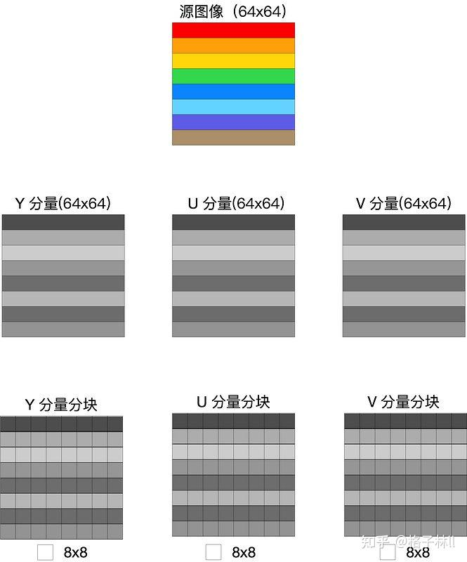

## DCT

JPEG 里要对数据压缩，就需要先要做一次 DCT 变换。数学方面的细节不是目前的重点，只需要知道这个变换是将数据域从时（空）域变换到[频域](https://zhida.zhihu.com/search?content_id=171793642&content_type=Article&match_order=1&q=%E9%A2%91%E5%9F%9F&zhida_source=entity)，把图片里点和点间的规律呈现出来，是为了更方便后续的压缩的。

先贴一下公式，对[数学原理](https://zhida.zhihu.com/search?content_id=171793642&content_type=Article&match_order=1&q=%E6%95%B0%E5%AD%A6%E5%8E%9F%E7%90%86&zhida_source=entity)感兴趣的话可以扩展看看[JPEG编码&算术编码、LZW编码](https://link.zhihu.com/?target=https%3A//durant35.github.io/2017/07/11/programPearls_JPEG%2524Arithmetic%2524LZW/)等资料：

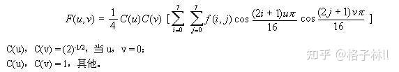

[DCT变换与图像压缩、去燥](https://link.zhihu.com/?target=http%3A//zhaoxuhui.top/blog/2018/05/26/DCTforImageDenoising.html)里面还讲到了为什么JPEG选择DCT而不选择DFT的原因。

再贴一下代码：

```cpp
/********* 外部逻辑 *********/
bool JpegEncoder::blocksFDCT(const uint8_t (*yBlocks)[64], const uint8_t (*uBlocks)[64], const uint8_t (*vBlocks)[64],
                             const unsigned int &w, const unsigned int &h,
                             int yDCT[][64], int uDCT[][64], int vDCT[][64]) {
    int wBlockSize = w / 8 + (w % 8 == 0 ? 0 : 1);
    int hBlockSize = h / 8 + (h % 8 == 0 ? 0 : 1);
    int blockSize = wBlockSize * hBlockSize;
    std::shared_ptr<JpegFDCT> fdct = std::make_shared<JpegFDCT>();
    for (int blockIndex = 0; blockIndex < blockSize; blockIndex++) {
        uint8_t *yBlock = yBlocks[blockIndex];
        uint8_t *uBlock = uBlocks[blockIndex];
        uint8_t *vBlock = vBlocks[blockIndex];
        for (int i = 0; i < 64; i++) {
            yDCT[blockIndex][i] = yBlock[i] - 128;
            uDCT[blockIndex][i] = uBlock[i] - 128;
            vDCT[blockIndex][i] = vBlock[i] - 128;

            yDCT[blockIndex][i] = yDCT[blockIndex][i] << 2;
            uDCT[blockIndex][i] = uDCT[blockIndex][i] << 2;
            vDCT[blockIndex][i] = vDCT[blockIndex][i] << 2;
        }
        fdct->fdct2d8x8(yDCT[blockIndex]);
        fdct->fdct2d8x8(uDCT[blockIndex]);
        fdct->fdct2d8x8(vDCT[blockIndex]);
    }
    return true;
}

/********* DCT 逻辑 *********/
JpegFDCT::JpegFDCT() {
    int i, j;
    float factor[64];

    // 初始化fdct factor
    const float AAN_DCT_FACTOR[DCT_SIZE] = {
            1.0f, 1.387039845f, 1.306562965f, 1.175875602f,
            1.0f, 0.785694958f, 0.541196100f, 0.275899379f,
    };
    for (i = 0; i < DCT_SIZE; i++) {
        for (j = 0; j < DCT_SIZE; j++) {
            factor[i * 8 + j] = 1.0f / (AAN_DCT_FACTOR[i] * AAN_DCT_FACTOR[j] * 8);
        }
    }
    for (i = 0; i < 64; i++) {
        mFDCTFactor[i] = float2Fix(factor[i]);
    }
}
int JpegFDCT::float2Fix(float value) {
    return static_cast<int>(value * (1 << FIX_Q));
}
void JpegFDCT::fdct2d8x8(int *data8x8, int *ftab) {
    int tmp0, tmp1, tmp2, tmp3;
    int tmp4, tmp5, tmp6, tmp7;
    int tmp10, tmp11, tmp12, tmp13;
    int z1, z2, z3, z4, z5, z11, z13;
    int *dataptr;
    int ctr;

    /* Pass 1: process rows. */
    dataptr = data8x8;
    for (ctr = 0; ctr < DCT_SIZE; ctr++) {
        tmp0 = dataptr[0] + dataptr[7];
        tmp7 = dataptr[0] - dataptr[7];
        tmp1 = dataptr[1] + dataptr[6];
        tmp6 = dataptr[1] - dataptr[6];
        tmp2 = dataptr[2] + dataptr[5];
        tmp5 = dataptr[2] - dataptr[5];
        tmp3 = dataptr[3] + dataptr[4];
        tmp4 = dataptr[3] - dataptr[4];

        /* Even part */
        tmp10 = tmp0 + tmp3;  /* phase 2 */
        tmp13 = tmp0 - tmp3;
        tmp11 = tmp1 + tmp2;
        tmp12 = tmp1 - tmp2;

        dataptr[0] = tmp10 + tmp11;  /* phase 3 */
        dataptr[4] = tmp10 - tmp11;

        z1 = (tmp12 + tmp13) * float2Fix(0.707106781f) >> FIX_Q; /* c4 */
        dataptr[2] = tmp13 + z1;  /* phase 5 */
        dataptr[6] = tmp13 - z1;

        /* Odd part */
        tmp10 = tmp4 + tmp5;  /* phase 2 */
        tmp11 = tmp5 + tmp6;
        tmp12 = tmp6 + tmp7;

        /* The rotator is modified from fig 4-8 to avoid extra negations. */
        z5 = (tmp10 - tmp12) * float2Fix(0.382683433f) >> FIX_Q;  /* c6 */
        z2 = (float2Fix(0.541196100f) * tmp10 >> FIX_Q) + z5;     /* c2-c6 */
        z4 = (float2Fix(1.306562965f) * tmp12 >> FIX_Q) + z5;     /* c2+c6 */
        z3 = tmp11 * float2Fix(0.707106781f) >> FIX_Q;            /* c4 */

        z11 = tmp7 + z3;        /* phase 5 */
        z13 = tmp7 - z3;

        dataptr[5] = z13 + z2;  /* phase 6 */
        dataptr[3] = z13 - z2;
        dataptr[1] = z11 + z4;
        dataptr[7] = z11 - z4;

        dataptr += DCT_SIZE;     /* advance pointer to next row */
    }

    /* Pass 2: process columns. */
    dataptr = data8x8;
    for (ctr = 0; ctr < DCT_SIZE; ctr++) {
        tmp0 = dataptr[DCT_SIZE * 0] + dataptr[DCT_SIZE * 7];
        tmp7 = dataptr[DCT_SIZE * 0] - dataptr[DCT_SIZE * 7];
        tmp1 = dataptr[DCT_SIZE * 1] + dataptr[DCT_SIZE * 6];
        tmp6 = dataptr[DCT_SIZE * 1] - dataptr[DCT_SIZE * 6];
        tmp2 = dataptr[DCT_SIZE * 2] + dataptr[DCT_SIZE * 5];
        tmp5 = dataptr[DCT_SIZE * 2] - dataptr[DCT_SIZE * 5];
        tmp3 = dataptr[DCT_SIZE * 3] + dataptr[DCT_SIZE * 4];
        tmp4 = dataptr[DCT_SIZE * 3] - dataptr[DCT_SIZE * 4];

        /* Even part */
        tmp10 = tmp0 + tmp3;  /* phase 2 */
        tmp13 = tmp0 - tmp3;
        tmp11 = tmp1 + tmp2;
        tmp12 = tmp1 - tmp2;

        dataptr[DCT_SIZE * 0] = tmp10 + tmp11;  /* phase 3 */
        dataptr[DCT_SIZE * 4] = tmp10 - tmp11;

        z1 = (tmp12 + tmp13) * float2Fix(0.707106781f) >> FIX_Q; /* c4 */
        dataptr[DCT_SIZE * 2] = tmp13 + z1;  /* phase 5 */
        dataptr[DCT_SIZE * 6] = tmp13 - z1;

        /* Odd part */
        tmp10 = tmp4 + tmp5;  /* phase 2 */
        tmp11 = tmp5 + tmp6;
        tmp12 = tmp6 + tmp7;

        /* The rotator is modified from fig 4-8 to avoid extra negations. */
        z5 = (tmp10 - tmp12) * float2Fix(0.382683433f) >> FIX_Q;  /* c6 */
        z2 = (float2Fix(0.541196100f) * tmp10 >> FIX_Q) + z5;     /* c2-c6 */
        z4 = (float2Fix(1.306562965f) * tmp12 >> FIX_Q) + z5;     /* c2+c6 */
        z3 = tmp11 * float2Fix(0.707106781f) >> FIX_Q;            /* c4 */

        z11 = tmp7 + z3;  /* phase 5 */
        z13 = tmp7 - z3;

        dataptr[DCT_SIZE * 5] = z13 + z2; /* phase 6 */
        dataptr[DCT_SIZE * 3] = z13 - z2;
        dataptr[DCT_SIZE * 1] = z11 + z4;
        dataptr[DCT_SIZE * 7] = z11 - z4;

        dataptr++;  /* advance pointer to next column */
    }

    ftab = ftab ? ftab : mFDCTFactor;
    for (ctr = 0; ctr < 64; ctr++) {
        data8x8[ctr] *= ftab[ctr];
        data8x8[ctr] >>= FIX_Q + 2;
    }
}
```

JPEG 里是对每 8x8 个点作为一个单位处理的，上述代码就是对我们刚才所划分好的各个 8x8 的子块进行DCT变换。首先我们看到在进行变换前需要将矩阵中的每个数值减去 128，然后再一一带入 DCT 变换公式，这是因为 DCT 公式所接受的数字范围是 `-128 到 127` 之间，其目的在于使像素的[绝对值](https://zhida.zhihu.com/search?content_id=171793642&content_type=Article&match_order=1&q=%E7%BB%9D%E5%AF%B9%E5%80%BC&zhida_source=entity)出现3位10进制的概率大大减少。_其他部分的处理逻辑暂时没有去深究。_

假定有一个8x8的图像数据如下图所示：

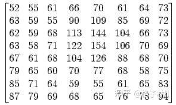

那么在减去`128`之后，将变成：

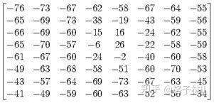

再经过DCT变换，最终将变成`DCT系数矩阵`：

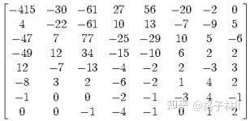

> 对应于u=0，v=0的系数，称做[直流分量](https://zhida.zhihu.com/search?content_id=171793642&content_type=Article&match_order=1&q=%E7%9B%B4%E6%B5%81%E5%88%86%E9%87%8F&zhida_source=entity)，即DC系数，即位于矩阵的最左上角，上图是-415的位置 对于除DC系数意外的[矩阵](https://zhida.zhihu.com/search?content_id=171793642&content_type=Article&match_order=4&q=%E7%9F%A9%E9%98%B5&zhida_source=entity)中的其余 63 个则称为是交流系数（`AC`）  

DCT 输出的频率系数矩阵中最左上角的直流（`DC`）系数幅度最大，以 `DC` 系数为出发点向下、向右的其它 DCT 系数，离 DC 分量越远，频率越高，幅度值越小，即图像信息的大部分集中于[直流系数](https://zhida.zhihu.com/search?content_id=171793642&content_type=Article&match_order=1&q=%E7%9B%B4%E6%B5%81%E7%B3%BB%E6%95%B0&zhida_source=entity)及其附近的低频频谱上，离 DC 系数越来越远的高频频谱几乎不含图像信息，甚至于只含杂波。这个点从数据上的理解可以看下[JPEG压缩原理与DCT离散余弦变换](https://link.zhihu.com/?target=https%3A//blog.csdn.net/newchenxf/article/details/51719597/)中量化与反量化部分。

关于图像频率可以扩展看下[图像上的频率指的是什么](https://www.zhihu.com/question/20099543)。

## 量化

量化是对经过 FDCT（解码为IDCT） 变换后的[频率系数](https://zhida.zhihu.com/search?content_id=171793642&content_type=Article&match_order=2&q=%E9%A2%91%E7%8E%87%E7%B3%BB%E6%95%B0&zhida_source=entity)进行量化，是一个将信号的幅度[离散化](https://zhida.zhihu.com/search?content_id=171793642&content_type=Article&match_order=1&q=%E7%A6%BB%E6%95%A3%E5%8C%96&zhida_source=entity)的过程，量化过程实际上就是对 DCT 系数的一个优化过程，它是利用了人眼对高频部分不敏感的特性来实现数据的大幅简化。在这个过程实际上是简单地把频率领域上每个成份，除以一个对于该成份的常数，且接着四舍五入取最接近的整数，这就是整个过程中的主要有损运算。

从结果来看，这个过程经常会把很多高频率的成份四舍五入而接近0，且剩下很多会变成小的正或负数。而整个量化的目的正是减小非“0”系数的幅度以及增加“0”值系数的数目，`量化是图像质量下降的最主要原因，量化表也是控制 JPEG [压缩比](https://zhida.zhihu.com/search?content_id=171793642&content_type=Article&match_order=1&q=%E5%8E%8B%E7%BC%A9%E6%AF%94&zhida_source=entity)的关键`。

因为人眼对[亮度信号](https://zhida.zhihu.com/search?content_id=171793642&content_type=Article&match_order=1&q=%E4%BA%AE%E5%BA%A6%E4%BF%A1%E5%8F%B7&zhida_source=entity)比对色差信号更敏感，因此使用了两种量化表：亮度量化值和色差量化值。

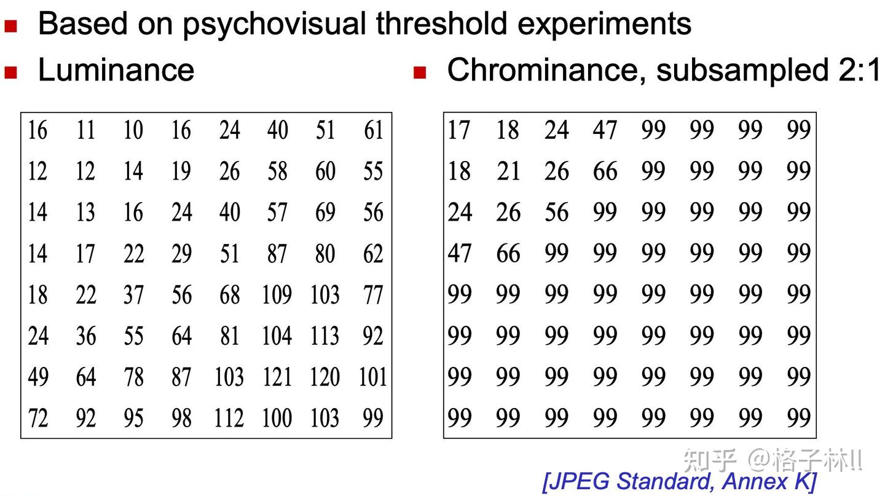

将前面所得到的 DCT [系数矩阵](https://zhida.zhihu.com/search?content_id=171793642&content_type=Article&match_order=3&q=%E7%B3%BB%E6%95%B0%E7%9F%A9%E9%98%B5&zhida_source=entity)与上图中的亮度/色度量化矩阵进行相除并四舍五入后可得到：

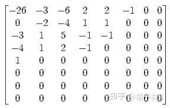

总体来说这个过程就类似于是一个空间域的[低通滤波器](https://zhida.zhihu.com/search?content_id=171793642&content_type=Article&match_order=1&q=%E4%BD%8E%E9%80%9A%E6%BB%A4%E6%B3%A2%E5%99%A8&zhida_source=entity)，对 Y 分量采用细量化，对 UV 采用[粗量化](https://zhida.zhihu.com/search?content_id=171793642&content_type=Article&match_order=1&q=%E7%B2%97%E9%87%8F%E5%8C%96&zhida_source=entity)，对低频细量化，对高频粗量化。对于滤波器感兴趣的话可以扩展看看这篇文章：[常见低通、高通、带通三种滤波器的工作原理](https://link.zhihu.com/?target=http%3A//murata.eetrend.com/article/2019-11/1003137.html)

JPEG压缩比例，就是通过控制量化的多少来控制。比如，上面的[量化矩阵](https://zhida.zhihu.com/search?content_id=171793642&content_type=Article&match_order=2&q=%E9%87%8F%E5%8C%96%E7%9F%A9%E9%98%B5&zhida_source=entity)，如果我们把矩阵的每个数都double一下，那是不是会出现更多的0了？说不定都只有DC系数非0，其他都是0，如果是这样那编码时就可以更省空间了，N个0只要一个游程编码搞定，数据量超小。但也意味着，恢复时，会带来更多的误差，图像质量也会变差了。

虽然量化步骤除掉了一些高频量，也就是损失了高频细节，但事实上人眼对高[空间频率](https://zhida.zhihu.com/search?content_id=171793642&content_type=Article&match_order=1&q=%E7%A9%BA%E9%97%B4%E9%A2%91%E7%8E%87&zhida_source=entity)远没有低频敏感，所以处理后的视觉损失很小。另一个重要原因是所有图片的点与点之间会有一个色彩过渡的过程，大量的图像信息被包含在低频率中，经过量化处理后，在高频率段，将出现大量连续的零。对于这部分可以扩展阅读下[为什么说图像的低频是轮廓，高频是噪声和细节](https://link.zhihu.com/?target=https%3A//blog.csdn.net/charlene_bo/article/details/70877999)以及[图像压缩中，为什么要将图像从空间域转换到频率域](https://www.zhihu.com/question/39689253)

```cpp
/********* 外部逻辑 *********/
bool JpegEncoder::fdctToQuant(int yDCT[][64], int uDCT[][64], int vDCT[][64],
                              const unsigned int &w, const unsigned int &h) {
    int wBlockSize = w / 8 + (w % 8 == 0 ? 0 : 1);
    int hBlockSize = h / 8 + (h % 8 == 0 ? 0 : 1);
    int blockSize = wBlockSize * hBlockSize;
    std::shared_ptr<JpegQuant> quant = std::make_shared<JpegQuant>();
    for (int blockIndex = 0; blockIndex < blockSize; blockIndex++) {
        int *yBlock = yDCT[blockIndex];
        int *uBlock = uDCT[blockIndex];
        int *vBlock = vDCT[blockIndex];
        quant->quantEncode8x8(yBlock, true);
        quant->quantEncode8x8(uBlock, false);
        quant->quantEncode8x8(vBlock, false);
    }
    return true;
}

/********* 量化逻辑 *********/
void JpegQuant::quantEncode8x8(int *data8x8, bool luminance) {
    for (int i = 0; i < 64; i++) {
        if (luminance) {
            data8x8[i] /= STD_QUANT_TAB_LUMIN[i];
        } else {
            data8x8[i] /= STD_QUANT_TAB_CHROM[i];
        }
    }
}
```

## Zigzag 扫描排序

量化后的数据，有一个很大的特点，就是直流分量相对于交流分量来说要大，而且[交流分量](https://zhida.zhihu.com/search?content_id=171793642&content_type=Article&match_order=2&q=%E4%BA%A4%E6%B5%81%E5%88%86%E9%87%8F&zhida_source=entity)中含有大量的 0。这样，对这个量化后的数据如何来进行简化，从而再更大程度地进行压缩呢？

这就出现了“Z”字形编排的想法，主要思路就是从左上角第一个像素开始以Z字形进行编排：

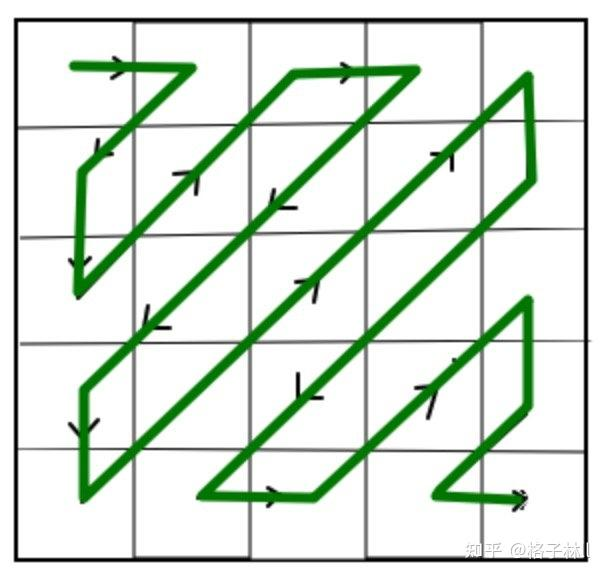

至于为什么使用 Zigzag 进行扫描排序，我_个人认为_主要是因为图像信息的大部分集中于直流系数及其附近的低频频谱上，离 DC 系数越来越远的[高频频谱](https://zhida.zhihu.com/search?content_id=171793642&content_type=Article&match_order=2&q=%E9%AB%98%E9%A2%91%E9%A2%91%E8%B0%B1&zhida_source=entity)几乎不含图像信息，因此通过该方式可以将更多的[高频数据](https://zhida.zhihu.com/search?content_id=171793642&content_type=Article&match_order=1&q=%E9%AB%98%E9%A2%91%E6%95%B0%E6%8D%AE&zhida_source=entity)排序到一起，以便于后续的`游程编码(RLE：Run Length Coding)`对它们进行编码。大家可以对照上面量化后的矩阵看下使用ZigZag排序与不使用的话0数据的连续性上的差异。

```cpp
/********* 外部逻辑 *********/
bool JpegEncoder::quantToZigzag(int yQuant[][64], int uQuant[][64], int vQuant[][64],
                                const unsigned int &w, const unsigned int &h) {
    int wBlockSize = w / 8 + (w % 8 == 0 ? 0 : 1);
    int hBlockSize = h / 8 + (h % 8 == 0 ? 0 : 1);
    int blockSize = wBlockSize * hBlockSize;
    std::shared_ptr<JpegZigzag> zigzag = std::make_shared<JpegZigzag>();
    for (int blockIndex = 0; blockIndex < blockSize; blockIndex++) {
        int *yBlock = yQuant[blockIndex];
        int *uBlock = uQuant[blockIndex];
        int *vBlock = vQuant[blockIndex];
        zigzag->zigzag(yBlock);
        zigzag->zigzag(uBlock);
        zigzag->zigzag(vBlock);
    }
    return true;
}

/********* 排序逻辑 *********/
void JpegZigzag::zigzag(int *const data8x8) {
    int temp[64];
    for (int i = 0; i < 64; i++) {
        temp[i] = data8x8[ZIGZAG_INDEX[i]];
    }
    for (int i = 0; i < 64; i++) {
        data8x8[i] = temp[i];
    }
}
```

## DC 系数的 DPCM

8x8 图像块经过 DCT 变换之后得到的 DC 直流系数有两个特点，一是系数的数值比较大，二是相邻 8x8 图像块的 DC 系数值变化不大。根据这个特点，JPEG 算法使用了差分脉冲调制编码 (DPCM) 技术，对相邻图像块之间量化DC系数的差值 (Delta) 进行编码。

```makefile
DC(0)=0
Delta = DC(i)  - DC(i-1)
```

此部分代码混杂在最后熵编码的整个流程中，截取部分代码：

```python-repl
...
// DC 系数的差分脉冲调制编码（DPCM）
diff = block[0] - dc;
dc = block[0];
code = diff;
// 对code做中间格式计算
...
```

## DC 系数的中间格式计算

JPEG 中为了更进一步节约空间，并不直接保存数据的具体数值，而是将数据按照位数分为 16 组，保存在表里面。这也就是所谓的`变长整数编码 VLI`。即，第 0 组中保存的编码位数为 0，其编码所代表的数字为 0；第 1 组中保存的编码位数为 1，编码所代表的数字为 -1 或者 1 ......，如下面的表格所示，这里，暂且称其为 `VLI 编码表`：

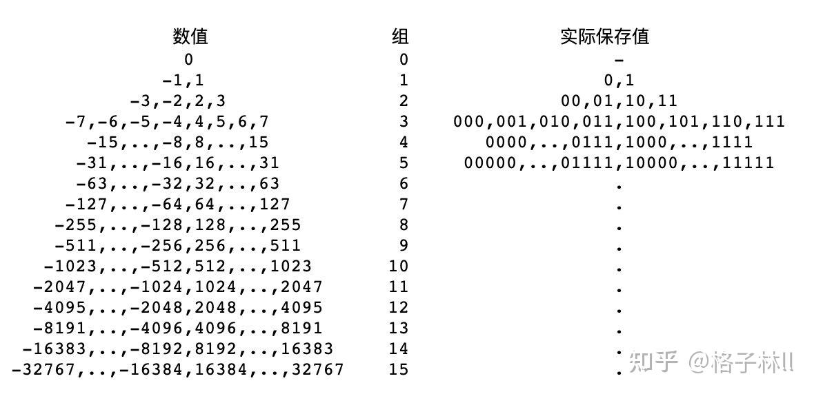

如果 DC 系数差值为 3，通过查找 VLI 可以发现，整数 3 位于 VLI 表格的第 2 组，因此，可以写成（2）（3）的形式，这里的2代表后面的数字（3）的编码长度为2位，该形式称之为 `DC 系数的中间格式`。

对于VLI可以扩展阅读下[可变长度整数的编码](https://link.zhihu.com/?target=https%3A//www.jianshu.com/p/a52c16fca39e)，这类思想核心就是用较小的空间存储小数字，而用较大的空间存储大数字，采用这种算法来对整数进行编码是有意义的，它可以节省存储数据需要的空间或者传输数据时所需的带宽。

```cpp
// 接上一章节最后传入其Code可进行DC系数的中间格式计算
// 这里category的命名如果觉得不好理解可以进一步去看下
// https://sce.umkc.edu/faculty-sites/lizhu/teaching/2018.fall.video-com/notes/lec04.pdf 第16页
void HuffmanCodec::categoryEncode(int &code, int &size) {
    unsigned absc = abs(code);
    unsigned mask = (1 << 15);
    int i = 15;
    if (absc == 0) {
        size = 0;
        return;
    }
    while (i && !(absc & mask)) {
        mask >>= 1;
        i--;
    }
    size = i + 1;
    if (code < 0) {
        code = (1 << size) - absc - 1;
    }
}
```

## AC 系数的 RLE

游程编码 RLC（Run Length Coding）是一种比较简单的压缩算法，其基本思想是将重复且连续出现多次的字符使用`（连续出现次数，字符）`来描述，从而来更进一步降低数据的传输量，举例来说，一组数据"AAAABBBCCDEEEE"，由4个A、3个B、2个C、1个D、4个E组成，经过RLC可将数据压缩为4A3B2C1D4E（由14个单位转成10个单位）。简而言之，其优点在于将重复性高的数据量压缩成小单位，然而，其缺点在于─若该数据出现频率不高，可能导致压缩结果数据量比原始数据量大，例如：原始数据"ABCDE"，压缩结果为"1A1B1C1D1E"（由5个单位转成10个单位）。

**但是，在JPEG编码中，RLC的含义就同其原有的意义略有不同。在JPEG编码中，假设RLC编码之后得到了一个（M,N）的数据对，其中M是两个非零AC系数之间连续的0的个数（即，[行程长度](https://zhida.zhihu.com/search?content_id=171793642&content_type=Article&match_order=1&q=%E8%A1%8C%E7%A8%8B%E9%95%BF%E5%BA%A6&zhida_source=entity)），N是下一个非零的AC系数的值。采用这样的方式进行表示，是因为AC系数当中有大量的0，而采用Zigzag扫描也会使得AC系数中有很多连续的0的存在，如此一来，便非常适合于用RLC进行编码。**

> 举个例子来解释一下，假设有以下数据：  
> 57, 45, 0, 0, 0, 0, 23, 0, -30, -8, 0, 0, 1, 000…  
> 经过 0 RLC 之后：  
> (0,57) ; (0,45) ; (4,23) ; (1,-30) ; (0,-8) ; (2,1) ; (0,0)  
> 注意，如果 AC 系数之间连续 0 的个数超过 16，则需要用一个扩展字节 (15,0) 来表示 16 连续的 0。这是因为后面 [huffman 编码](https://zhida.zhihu.com/search?content_id=171793642&content_type=Article&match_order=1&q=huffman+%E7%BC%96%E7%A0%81&zhida_source=entity)的要求，每组数字前一个表示 0 的数量的必须是 4 bit，因此只能是 0~15，所以，如果有这么一组数字：  
> 57, 十八个0, 3, 0, 0, 0, 0, 2, 三十三个0, 895, EOB  
> 我们实际这样编码：  
> (0,57) ; (15,0) (2,3) ; (4,2) ; (15,0) (15,0) (1,895) , (0,0) 注意 (15,0) 表示了 16 个连续的 0。  
> EOB：EOB 是一个结束标记, 表示后面都是 0 了。我们用 (0,0) 表示 EOB，但是，如果这组数字不以 0 结束, 那么就不需要 EOB。

```cpp
/********* RLE的数据 *********/
typedef struct {
    unsigned runlen   : 4;
    unsigned codesize : 4;
    unsigned codedata : 16;
} RLEITEM;

// AC 系数的游程长度编码（RLE）
    // AC 系数的中间格式计算
    // rle encode for ac
for (i = 1, j = 0, n = 0, eob = 0; i < 64 && j < 63; i++) {
    if (du[i] == 0 && n < 15) {
        n++;
    } else {
        code = du[i]; size = 0;
        // AC 系数的中间格式计算
        categoryEncode(code, size);
        rlelist[j].runlen   = n;
        rlelist[j].codesize = size;
        rlelist[j].codedata = code;
        n = 0;
        j++;
        if (size != 0) {
            eob = j;
        }
    }
}
// 设置 eob
if (du[63] == 0) {
    rlelist[eob].runlen   = 0;
    rlelist[eob].codesize = 0;
    rlelist[eob].codedata = 0;
    j = eob + 1;
}
```

## AC 系数的中间格式计算

以`DC 系数的中间格式计算`中的`编码表`以及`AC 系数的 RLE`中所举例的RLC后的数据为例：

> (0,57) ; (0,45) ; (4,23) ; (1,-30) ; (0,-8) ; (2,1) ; (0,0)

我们只处理每对数据中右边的那个数，对其进行 `VLI 编码` ：查找上面的 VLI 编码表，可以发现，57 在第 6 组当中，因此可以将其写成 (0,6),57 的形式，该形式便称之为 AC 系数的中间格式。

同样的 (0,45) 的中间格式为 (0,6),45 ；(1,-30) 的中间格式为 (1,5),-30 。

该部分在上面章节中已有涉及，就不贴代码了。

## 熵编码

在得到 DC 系数的中间格式和 AC 系数的中间格式之后，为进一步压缩图像数据，有必要对两者进行熵编码，通过对出现概率较高的字符采用较小的 bit 数编码达到压缩的目的。JPEG 标准具体规定了两种熵编码方式：Huffman 编码和算术编码。JPEG 基本系统规定采用 Huffman 编码。

熵编码的介绍可以扩展阅读下[三分钟学习 | 熵编码](https://zhuanlan.zhihu.com/p/26454072)，简单说**熵编码就是在[信息熵](https://zhida.zhihu.com/search?content_id=171793642&content_type=Article&match_order=1&q=%E4%BF%A1%E6%81%AF%E7%86%B5&zhida_source=entity)的极限范围内进行编码，即[无损压缩](https://zhida.zhihu.com/search?content_id=171793642&content_type=Article&match_order=1&q=%E6%97%A0%E6%8D%9F%E5%8E%8B%E7%BC%A9&zhida_source=entity)**。

Huffman 编码：对出现概率大的字符分配字符长度较短的[二进制编码](https://zhida.zhihu.com/search?content_id=171793642&content_type=Article&match_order=1&q=%E4%BA%8C%E8%BF%9B%E5%88%B6%E7%BC%96%E7%A0%81&zhida_source=entity)，对出现概率小的字符分配字符长度较长的二进制编码，从而使得字符的平均编码长度最短。Huffman 编码的原理可以扩展阅读下[算法科普：有趣的霍夫曼编码](https://zhuanlan.zhihu.com/p/63362804)。

Huffman 编码时 DC 系数与 AC 系数分别采用不同的 Huffman 编码表，对于亮度和色度也采用不同的 Huffman 编码表。因此，需要 4 张 Huffman 编码表才能完成熵编码的工作，等到具体 Huffman 编码时再采用查表的方式来高效地完成。然而，在 JPEG 标准中没有定义缺省的 Huffman 表，用户可以根据实际应用自由选择，也可以使用 [JPEG 标准推荐的 Huffman 表](https://link.zhihu.com/?target=https%3A//www.cnblogs.com/buaaxhzh/p/9119870.html)，或者预先定义一个通用的 Huffman 表，也可以针对一副特定的图像，在[压缩编码](https://zhida.zhihu.com/search?content_id=171793642&content_type=Article&match_order=2&q=%E5%8E%8B%E7%BC%A9%E7%BC%96%E7%A0%81&zhida_source=entity)前通过搜集其统计特征来计算 Huffman 表的值。

结合 Huffman 编码以及上述的DPCM、RLE以及对应的中间格式，参照`VLI编码表`，我们再来整体地通过一个例子解释下数据最终压缩后的样子：

> 假定经过RLE之后有如下`AC`数据：  
> (0,57) ; (0,45) ; (4,23) ; (1,-30) ; (0,-8) ; (2,1) ; (0,0)  
> 只处理每[对数](https://zhida.zhihu.com/search?content_id=171793642&content_type=Article&match_order=4&q=%E5%AF%B9%E6%95%B0&zhida_source=entity)右边的那个：  
> ｜ 57 是第 6 组的, 实际保存值为 111001 , 所以被编码为 (6,111001)  
> ｜ 45 , 同样的操作, 编码为 (6,101101)  
> ｜ 23 -> (5,10111)  
> ｜ -30 -> (5,00001)  
> ｜ -8 -> (4,0111)  
> ｜ 1 -> (1,1)  
> 最后，最开始的那串数字就变成了：  
> (0,6), 111001 ; (0,6), 101101 ; (4,5), 10111; (1,5), 00001; (0,4) , 0111 ; (2,1), 1 ; (0,0)  
> 括号里的数值正好合成一个字节，后面被编码的数字表示范围是 -32767..32767。合成的字节里，高 4 位是前续 0 的个数，低 4 位描述了后面数字的位数。  
> 再进一步通过 Huffman 查找得到如果 (0,6) 的 huffman 编码为 111000 ，那么最终编码的数据便是：  
> 111000 111001  
> 最后看下`DC`的编码，假设DC的diff值是-511，编码为 (9, 000000000) ，如果 9 的 Huffman 编码是 1111110 ，那么在 JPG 文件中, DC 的 2 进制表示为 `1111110 000000000`，最终加上上面AC的第一个数据，编码为：  
> 1111110 000000000 111000 111001 ...

```cpp
/********* 初始化编码表 *********/
HuffmanCodec::HuffmanCodec() {
    initCoddList(true, true);
    initCoddList(true, false);
    initCoddList(false, true);
    initCoddList(false, false);

void HuffmanCodec::initCoddList(bool dc, bool luminance) {
    int i, j, k;
    int symbol;
    int code;
    uint8_t hufsize[256];
    int hufcode[256];
    int tabsize;

    k = 0;
    code = 0x00;
    const uint8_t *hufTable;
    HUFCODEITEM *codeList;
    if (dc && luminance) {
        hufTable = STD_HUFTAB_LUMIN_DC;
        codeList = mCodeListDCLumin;
    } else if (dc && !luminance) {
        hufTable = STD_HUFTAB_CHROM_DC;
        codeList = mCodeListDCChrom;
    } else if (!dc && luminance) {
        hufTable = STD_HUFTAB_LUMIN_AC;
        codeList = mCodeListACLumin;
    } else {
        hufTable = STD_HUFTAB_CHROM_AC;
        codeList = mCodeListACChrom;
    }
    for (i = 0; i < MAX_HUFFMAN_CODE_LEN; i++) {
        for (j = 0; j < hufTable[i]; j++) {
            hufsize[k] = i + 1;
            hufcode[k] = code;
            code++;
            k++;
        }
        code <<= 1;
    }
    tabsize = k;
    for (i = 0; i < tabsize; i++) {
        symbol = hufTable[MAX_HUFFMAN_CODE_LEN + i];
        codeList[symbol].depth = hufsize[i];
        codeList[symbol].code = hufcode[i];
    }
}
/********* 编码 *********/
bool HuffmanCodec::huffmanEncode(HUFCODEITEM *codeList, int size) {
    unsigned code;
    int len;
    if (!mBitStream) {
        return false;
    }

    code = codeList[size].code;
    len = codeList[size].depth;
    if (EOF == bitstr_put_bits(mBitStream, code, len)) {
        return false;
    }

    return true;
}
```

JPEG 文件大体上可以分成两个部分：`标记码(Tag)`和`压缩数据`。

常用的标记有 `SOI`、`APP0`、`APPn`、`DQT`、`SOF0`、`DHT`、`DRI`、`SOS`、`EOI`：

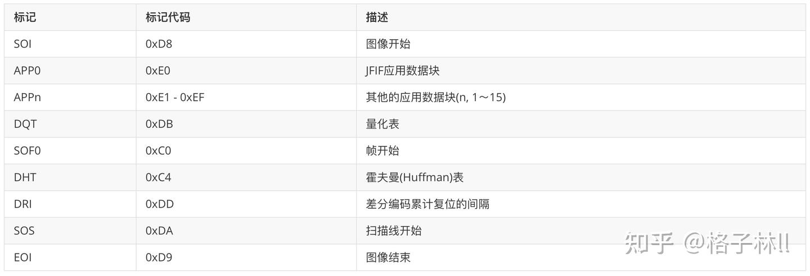

更具体的细节可扩展阅读下[JPEG文件格式详解](https://link.zhihu.com/?target=https%3A//www.ihubin.com/blog/audio-video-basic-14-jpeg-file-format-detail/)。

```php
bool JpegEncoder::writeToFile(char* buffer, long dataLength,
                              const unsigned int &w, const unsigned int &h) {
    FILE *fp = fopen(mOutputPath.data(), "wb");

    // SOI
    fputc(0xff, fp);
    fputc(0xd8, fp);

    // DQT
    const int *pqtab[2] = {JpegQuant::STD_QUANT_TAB_LUMIN, JpegQuant::STD_QUANT_TAB_CHROM};
    for (int i = 0; i < 2; i++) {
        int len = 2 + 1 + 64;
        fputc(0xff, fp);
        fputc(0xdb, fp);
        fputc(len >> 8, fp);
        fputc(len >> 0, fp);
        fputc(i, fp);
        for (int j = 0; j < 64; j++) {
            fputc(pqtab[i][JpegZigzag::ZIGZAG_INDEX[j]], fp);
        }
    }

    // SOF0
    int SOF0Len = 2 + 1 + 2 + 2 + 1 + 3 * 3;
    fputc(0xff, fp);
    fputc(0xc0, fp);
    fputc(SOF0Len >> 8, fp);
    fputc(SOF0Len >> 0, fp);
    fputc(8, fp); // precision 8bit
    fputc(h >> 8, fp); // height
    fputc(h >> 0, fp); // height
    fputc(w >> 8, fp); // width
    fputc(w >> 0, fp); // width
    fputc(3, fp);

    fputc(0x01, fp); fputc(0x11, fp); fputc(0x00, fp);
    fputc(0x02, fp); fputc(0x11, fp); fputc(0x01, fp);
    fputc(0x03, fp); fputc(0x11, fp); fputc(0x01, fp);

    // DHT AC
    const uint8_t *huftabAC[] = {
            HuffmanCodec::STD_HUFTAB_LUMIN_AC, HuffmanCodec::STD_HUFTAB_CHROM_AC
    };
    for (int i = 0; i < 2; i++) {
        fputc(0xff, fp);
        fputc(0xc4, fp);
        int len = 2 + 1 + 16;
        for (int j = 0; j < 16; j++) {
            len += huftabAC[i][j];
        }
        fputc(len >> 8, fp);
        fputc(len >> 0, fp);
        fputc(i + 0x10, fp);
        fwrite(huftabAC[i], len - 3, 1, fp);
    }
    // DHT DC
    const uint8_t *huftabDC[] = {
            HuffmanCodec::STD_HUFTAB_LUMIN_DC, HuffmanCodec::STD_HUFTAB_CHROM_DC
    };
    for (int i = 0; i < 2; i++) {
        fputc(0xff, fp);
        fputc(0xc4, fp);
        int len = 2 + 1 + 16;
        for (int j = 0; j < 16; j++) {
            len += huftabDC[i][j];
        }
        fputc(len >> 8, fp);
        fputc(len >> 0, fp);
        fputc(i + 0x00, fp);
        fwrite(huftabDC[i], len - 3, 1, fp);
    }

    // SOS
    int SOSLen = 2 + 1 + 2 * 3 + 3;
    fputc(0xff, fp);
    fputc(0xda, fp);
    fputc(SOSLen >> 8, fp);
    fputc(SOSLen >> 0, fp);
    fputc(3, fp);

    fputc(0x01, fp); fputc(0x00, fp);
    fputc(0x02, fp); fputc(0x11, fp);
    fputc(0x03, fp); fputc(0x11, fp);

    fputc(0x00, fp);
    fputc(0x3F, fp);
    fputc(0x00, fp);

    // data
    fwrite(buffer, dataLength, 1, fp);

    // EOI
    fputc(0xff, fp);
    fputc(0xd9, fp);

    fflush(fp);
    fclose(fp);

    return true;
}
```

## 完工

到这里我们编写的`JpegEncoder`就可以将传入的`RGB24`格式的数据压缩编码成`YUV444`的JPEG文件了，可以运行 [avcodec\_tutorial](https://link.zhihu.com/?target=https%3A//github.com/LinBinghe/avcodec_tutorial) 项目，运行后将在你的桌面看到如下内容随机生成的图片：

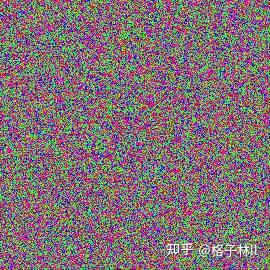

## 参考文章

[手动生成一张JPEG图片](https://link.zhihu.com/?target=https%3A//segmentfault.com/a/1190000021866901)

[JPEG 简易文档](https://link.zhihu.com/?target=https%3A//www.codingnow.com/2000/download/jpeg.txt)

[JPEG图像压缩算法流程详解](https://link.zhihu.com/?target=https%3A//blog.csdn.net/carson2005/article/details/7753499)

[JPEG编解码原理及代码调试](https://link.zhihu.com/?target=https%3A//blog.csdn.net/weixin_45442965/article/details/106448138)

[JPEG standard](https://link.zhihu.com/?target=https%3A//web.stanford.edu/class/ee398a/handouts/lectures/08-JPEG.pdf)

[Variable Length Coding (VLC) in JPEG](https://link.zhihu.com/?target=https%3A//sce.umkc.edu/faculty-sites/lizhu/teaching/2018.fall.video-com/notes/lec04.pdf)

[JPEG编码&算术编码、LZW编码](https://link.zhihu.com/?target=https%3A//durant35.github.io/2017/07/11/programPearls_JPEG%2524Arithmetic%2524LZW/)

[图像的时频变换——离散余弦变换](https://link.zhihu.com/?target=https%3A//www.iteye.com/blog/dsqiu-1636888)

[图像上的频率指的是什么](https://www.zhihu.com/question/20099543)

[为什么说图像的低频是轮廓，高频是噪声和细节](https://link.zhihu.com/?target=https%3A//blog.csdn.net/charlene_bo/article/details/70877999)

[DCT变换与图像压缩、去燥](https://link.zhihu.com/?target=http%3A//zhaoxuhui.top/blog/2018/05/26/DCTforImageDenoising.html)

[JPEG压缩原理与DCT离散余弦变换](https://link.zhihu.com/?target=https%3A//blog.csdn.net/newchenxf/article/details/51719597/)

[JPEG 标准推荐的亮度、色度DC、AC Huffman 编码表](https://link.zhihu.com/?target=https%3A//www.cnblogs.com/buaaxhzh/p/9119870.html)

[一文读懂 YUV 的采样与格式](https://link.zhihu.com/?target=https%3A//glumes.com/post/ffmpeg/understand-yuv-format/)

[JPEG文件格式详解](https://link.zhihu.com/?target=https%3A//www.ihubin.com/blog/audio-video-basic-14-jpeg-file-format-detail/)

[数据压缩之游程编码](https://link.zhihu.com/?target=https%3A//blog.csdn.net/SunnyYoona/article/details/43602449)
