# 我的音视频技术路线

> 作者：Luki Yang | 来源：知乎 | 写作耗时：约 18 小时（周日早→凌晨 3 点）
>
> **一句话概括**：一篇个人学习路线图式的大纲，按"采集→渲染→处理→编解码→传输"管线框架梳理了音视频领域的各个方向，每个方向点到即止，深度不一。

---

## 快速导航

| 章节 | 主题 | 深度 | 与 WorkLabs 相关度 |
|------|------|------|-------------------|
| [1. 采集](#1-关于音视频数据采集) | Android Camera API1/API2/HAL/CameraX | 深（作者本行） | 低（macOS 用 AVFoundation） |
| [2. 图形渲染](#2-关于图形渲染) | 图形学基础 + OpenGL/GLES + 抖音渲染引擎逆向 | 深（作者本行） | 中 |
| [3. 滤镜/美颜/转场/特效](#3-关于音视频图形部分) | LUT/滤波器/转场/特效/shader 组装 | **中等，全文最有干货** | **高** |
| [4. 音视频处理](#4-关于音视频处理) | 编解码理论 + MediaCodec/FFmpeg + 音视频同步 | 浅 | 中 |
| [5. 传输](#5-关于传输) | RTMP | **空节** | 无 |
| [6. APP 逆向分析](#6-分析音视频app) | adb pull 拆包学习 | 方法论 | 低 |
| [7. 总结](#7-总结) | 个人感想 | — | — |

---

## 音视频技术全景

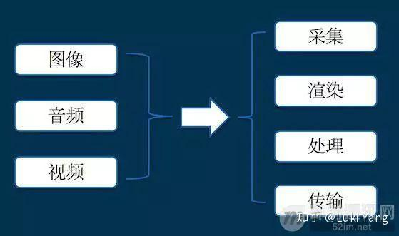

**五大环节**：采集 → 渲染 → 处理 → 编解码 → 传输

- **采集**：音视频数据来源（如 Android Camera）
- **渲染**：将采集数据展示到 Surface，添加图形效果
- **处理**：源数据加工（滤镜、特效、剪辑、变速、转场）
- **编解码**：压缩封装，减少数据量
- **传输**：推流、拉流

---

## 1. 关于音视频数据采集

### 1.1 Android Camera API

**Camera API 1**（Android 5.0 前）：接口过于简单，拿不到 RAW 数据，控制不了参数下发。

```java
mCamera = Camera.open(mCurrentCamera);
Camera.Parameters params = mCamera.getParameters();
params.setPreviewSize(preViewSize.width, preViewSize.height);
mCamera.setPreviewCallback(this);  // onPreviewFrame 接收数据
mCamera.startPreview();
```

**Camera API 2**（Android 5.0+，配合 HAL3）：功能齐全但更复杂。

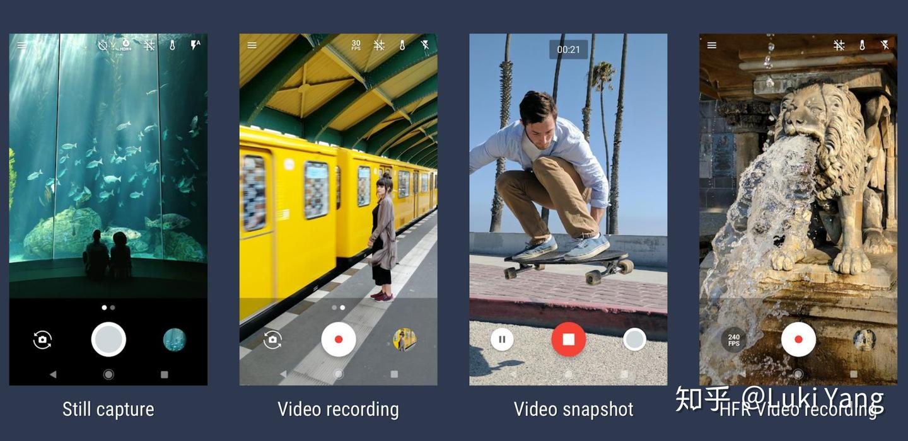

**核心接口流程**：

```
CameraManager → openCamera → CameraDevice
    → createCaptureSession(surfaces)
        → setRepeatingRequest / capture
            → Surface/ImageReader 回调接收数据
```

| 接口 | 作用 |
|------|------|
| **CameraManager** | 硬件能力统一封装，获取相机列表（Wide/Tele/Macro 等） |
| **CameraDevice** | 通过 openCamera callback 获取 |
| **CaptureRequest** | PREVIEW(1) / STILL_CAPTURE(2) / RECORD(3) / VIDEO_SNAPSHOT(4) / ZSL(5) / MANUAL(6) |
| **Surface** | SurfaceTexture（预览）/ ImageReader（YUV/RAW/DEPTH） |
| **CaptureSession** | 会话单元，所有采集工作基于 Session |

### 1.2 Camera HAL

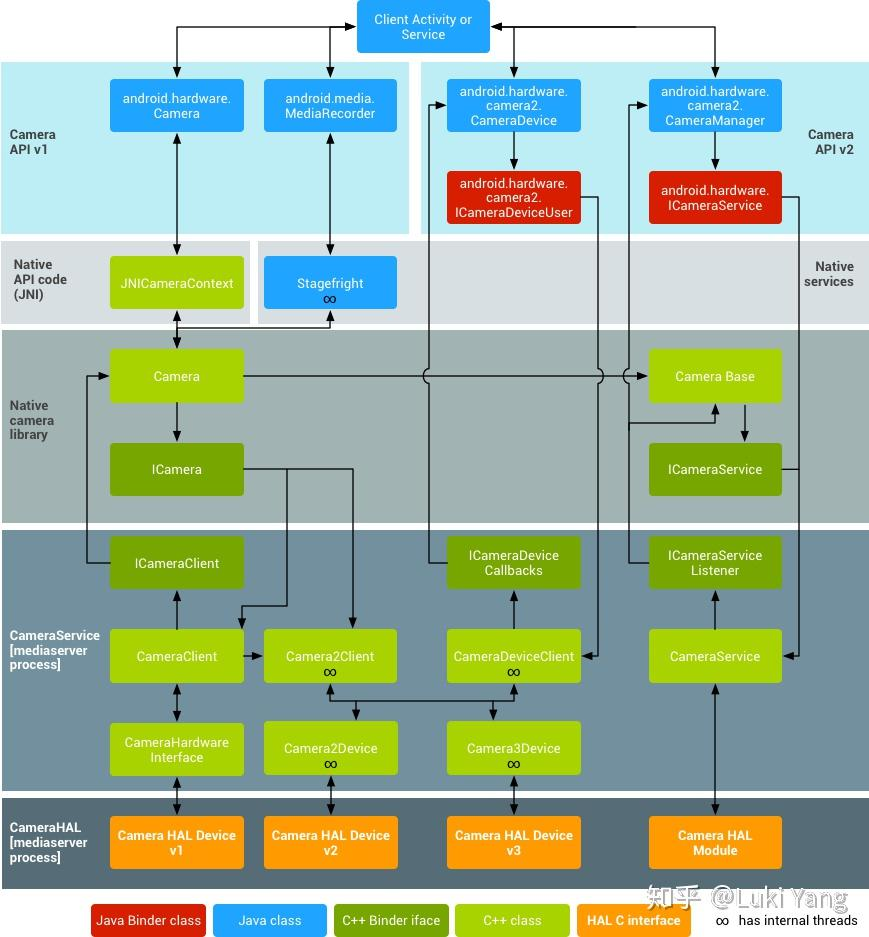

HAL 由芯片厂商定制（如高通），手机厂商可在此基础上扩展。硬件支持等级：

```
LEGACY < LIMITED < FULL < LEVEL_3 < EXTERNAL
```

> 作者注：这一块比较复杂，第三方 APP 一般不涉及，后续单独整理。

### 1.3 CameraX

Google 推出的简化封装，两行代码即可预览/拍照：

```java
Preview preview = new Preview(new PreviewConfig.Builder().build());
CameraX.bindToLifecycle((LifecycleOwner) this, preview);
```

### 1.4 Camera 专业视频（进阶）

以 **Filmic Pro** 为代表的专业视频拍摄 APP：

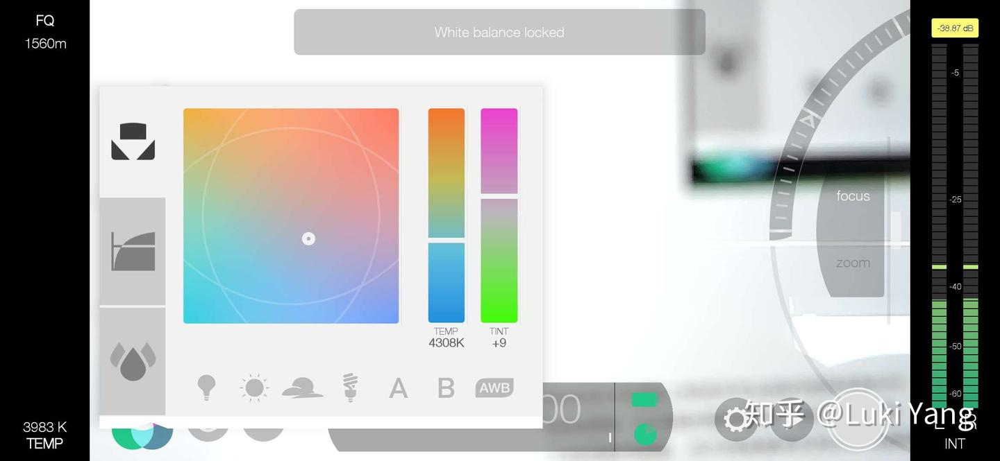

功能：ISO/Exposure/WB/EV/Focus 调参、平滑变焦、光焦分离、曲线调整、LOG 格式、峰值对焦、RGB 直方图、自定义编码格式等。

---

## 2. 关于图形渲染

### 2.1 图形学基础

作者认为需要掌握的核心知识：

1. **矩阵变换链**：World → View → Projection → NDC → Screen（建议手推一遍）
2. **OpenGL API**：纹理贴图、VAO/VBO、点线面绘制
3. **光照**：Phong 光照 → PBR/BRDF → Shadow Map（shadow acne、边缘锯齿）
4. **测试与混合**：深度测试（遮挡）、模板测试（阴影体）、Alpha 混合
5. **地形**：Perlin Noise 生成、LOD 四叉树/CLOD 自适应三角网
6. **粒子系统**：发射器、加速、运动轨迹
7. **场景管理**：四叉树/八叉树、视锥体裁剪

**学习建议**：造轮子造轮子造轮子——自己写引擎、写软光栅器。

学习资料：
- https://learnopengl-cn.github.io/
- https://www.scratchapixel.com/
- 源码阅读：OGRE / OSG / THREEJS
- 工具：Unity3D / Processing

### 2.2 OpenGL/GLES 进阶

**EGL 环境创建**：eglGetDisplay → eglChooseConfig → eglCreateSurface → eglCreateContext

**GL 多线程**：shareContext 方式共享 GPU Buffer（如 MediaCodec 录制 Surface 与预览共享）

**渲染优化要点**：
- 渲染前做视锥体裁剪
- 避免同步阻塞（glReadPixel/glFinish/glTexImage2D）
- Shader 少用 if/for
- 必要时下采样
- 利用内存对齐
- 提前编译 Shader

### 2.3 音视频渲染引擎（拆抖音）

抖音底层有类似游戏引擎的渲染框架，通过 **Lua 脚本**控制（下发 AI 识别结果 + 用户交互事件）。

**案例：潜水艇游戏**（鼻子控制潜水艇，碰撞检测）

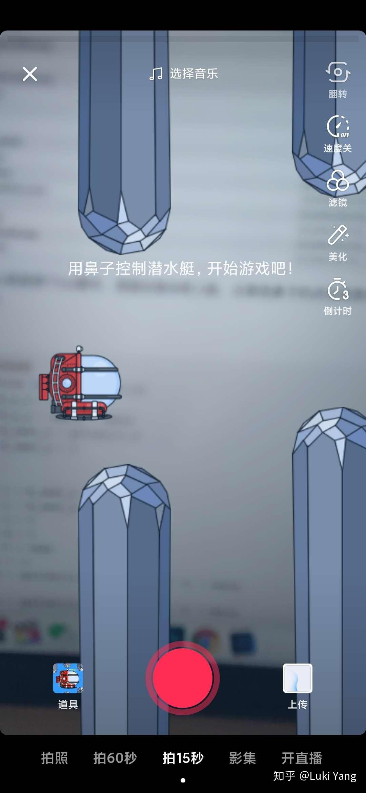

资源包结构：Lua 脚本 + Sticker 实体（柱子/潜水艇/弹框模型）+ clip.json（transform 参数）

核心逻辑：
- `rectCollision`：矩形碰撞检测（中心坐标与柱子距离 vs 半径）
- `circleCollision`：圆形碰撞检测（圆心距离 vs 半径和）
- `handleTimerEvent`：游戏主循环（柱子移动、速度递增、碰撞判定）
- `handleRecodeVedioEvent`：录制事件处理（初始化/重置）

**结论**：抖音底层是"麻雀虽小五脏俱全"的缩小版游戏引擎，写这套引擎的基本是以前搞游戏的人。

---

## 3. 关于音视频图形部分

> **全文最有干货的一节**，涉及滤镜、美颜、转场、特效的具体实现。

### 3.1 滤镜

#### 1D LUT

调节亮度/对比度/黑白等级（256x1），或 RGB 曲线（256x3）。Instagram 的 amaro/lomo/Hudson/Sierra 等都是 1D LUT。

```glsl
// 256x1 采样
texel.r = texture2D(u_overlayTex, vec2(bbTexel.r, texel.r)).r;
// 256x3 采样
mapped.r = texture2D(u_mapTex, vec2(texel.r, .25)).r;
```

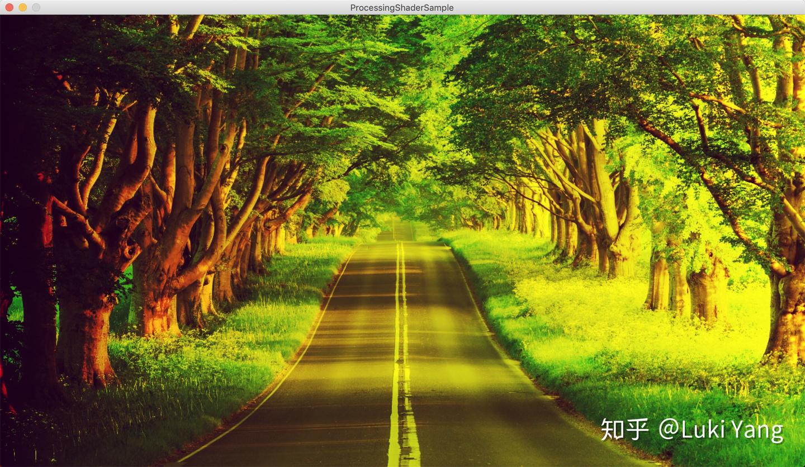
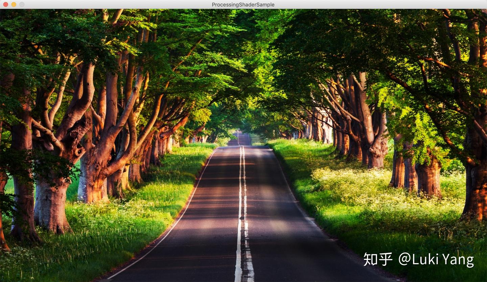

#### 3D LUT

64x64 或 512x512 查找表，RGB 映射关联在一起，效果更和谐。

```glsl
mediump float blueColor = textureColor.b * 15.0;
// 根据 blueColor 定位 4x4 网格中的 quad
// 在 quad 内根据 r,g 做双线性插值
lowp vec3 newColor = mix(newColor1.rgb, newColor2.rgb, fract(blueColor));
```

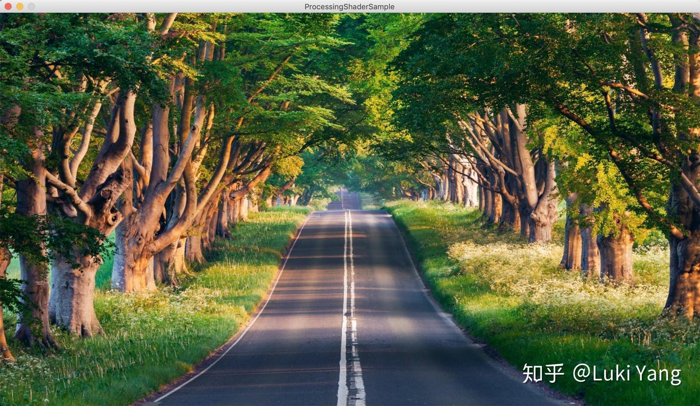

**对比**：3D LUT 更和谐（RGB 关联），1D LUT 更省空间（单通道场景可用）。LUT 优势在于设计师 Photoshop 调好查找表，直接应用。

### 3.2 美颜

#### 磨皮去噪

| 滤波器 | 特点 |
|--------|------|
| 均值模糊 | 权重分布平均 |
| 高斯模糊 | 权重高斯分布，可分纵横两 pass（复杂度从 W×H×(2R+1)² 降至 W×H×(2R+1)） |
| 表面模糊 | 权重只跟颜色空间有关（配合肤色检测） |
| **双边滤波** | 权重跟距离和颜色空间都有关，保边效果好 |
| 中值模糊 | 卷积核内取中值 |
| 导向滤波 | 参考图像引导 |

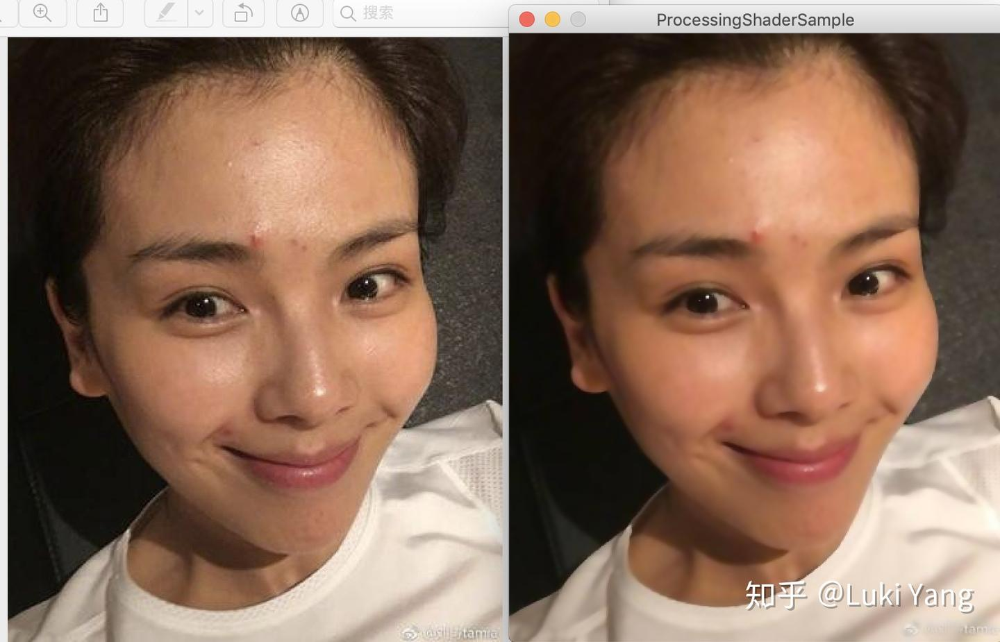
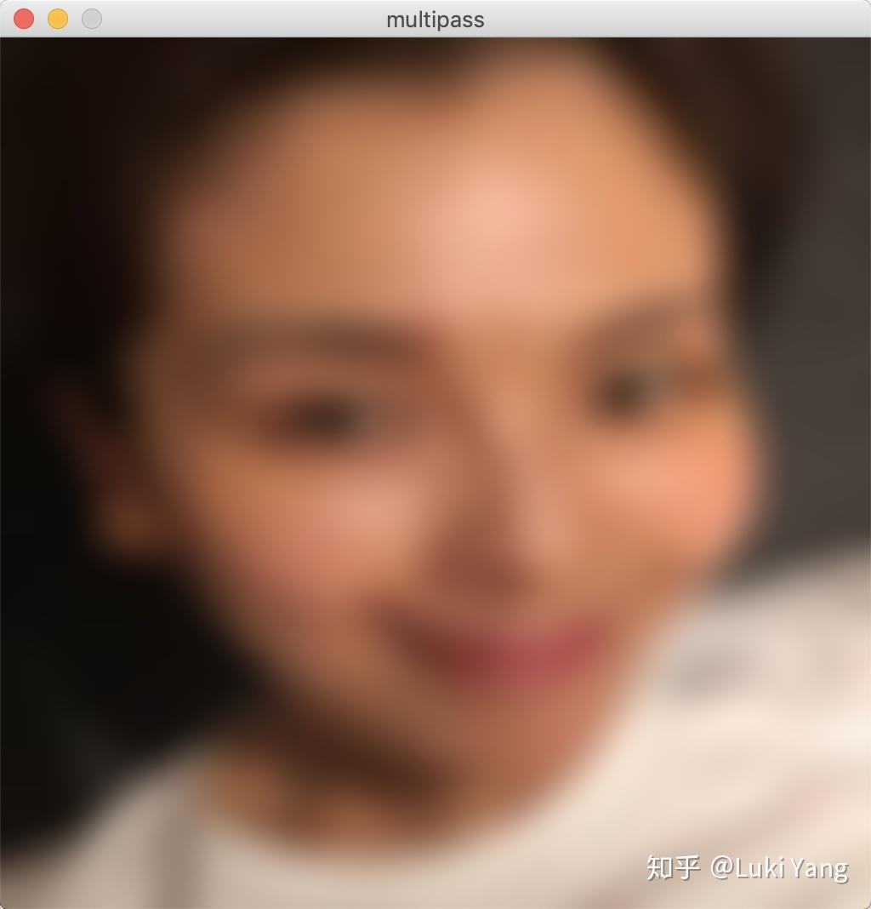
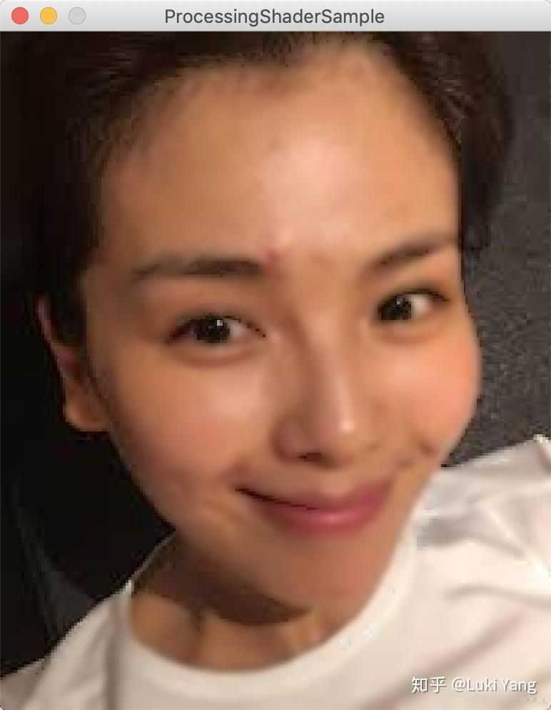

#### 美白

HighPass 高亮 + 加红晕

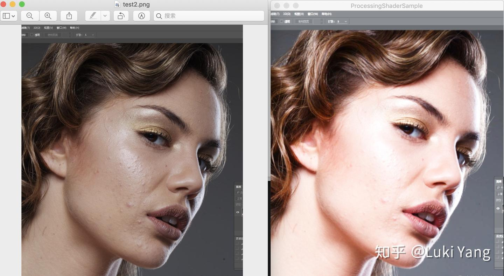

#### 美型

结合人脸检测关键点，做曲线变形：

- **瘦脸**：关键点方向做曲线变形
- **大眼**：中心点放大半径
- **下巴**：曲线变形

```glsl
vec2 curveWarp(vec2 textureCoord, vec2 originPosition, vec2 targetPosition, float radius) {
    vec2 direction = targetPosition - originPosition;
    float infect = 1.0 - clamp(distance(textureCoord, originPosition) / radius, 0.0, 1.0);
    return textureCoord - direction * infect;
}
```

### 3.3 转场

转场 = 双输入 shader + progress 进度控制。

#### 1. UV 变换转场

UV 坐标围绕某点旋转/缩放/平移：

```glsl
// 缩放
vec2 scale_uv = vec2(0.5 + (tc.x - 0.5) / scaleU, 0.5 + (tc.y - 0.5) / scaleV);
// 旋转
vec2 rotateUV(vec2 uv, float rotation, vec2 mid) { ... }
```

#### 2. Blend 转场

Photoshop 混合模式：Alpha 混合、滤色、加深、减淡等。

#### 3. 模糊转场

旋转模糊 + 随机采样：

```glsl
float rand(vec2 uv) {
    return fract(sin(dot(uv.xy, vec2(12.9898, 78.233))) * 43758.5453);
}
```

转场资源：https://gl-transitions.com/

### 3.4 特效

基础特效：抖动、灵魂出窍、故障风（glitch）、光晕、老电影、粒子特效等。

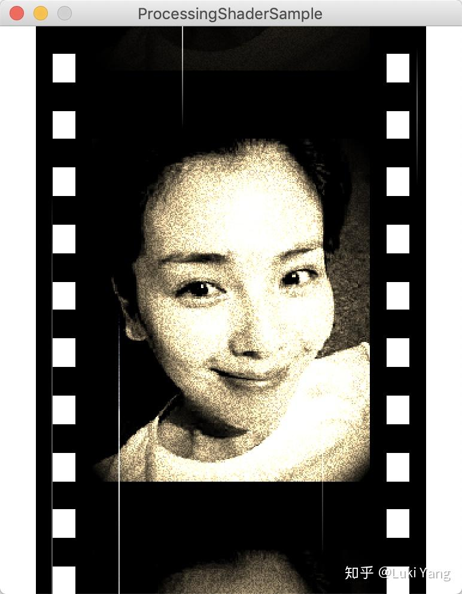
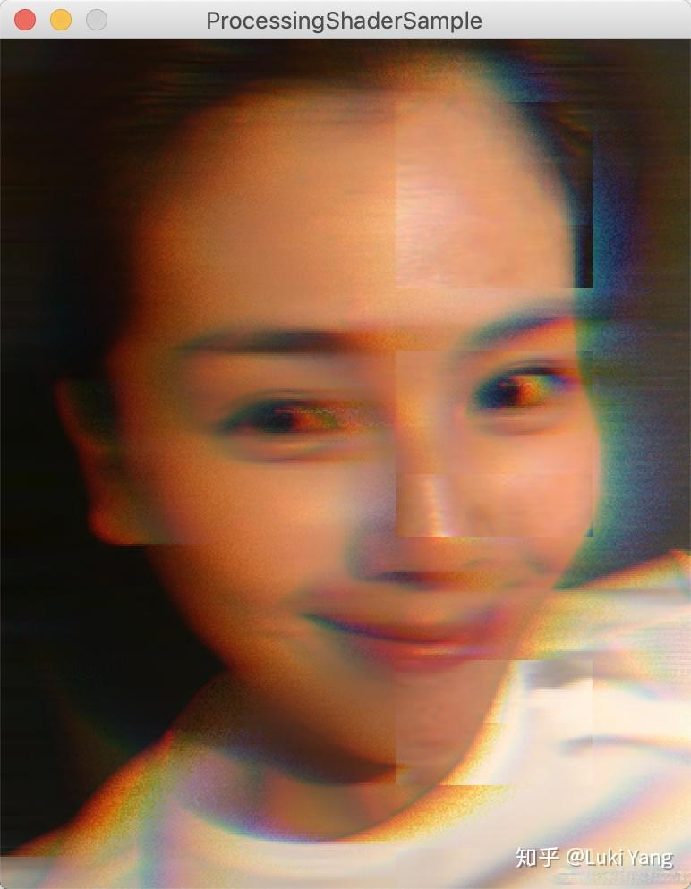

**特效实现思路**：
1. 善用卷积滤波器（边缘检测、模糊）+ 随机采样
2. 熟悉各种颜色空间（饱和度/锐度/亮度/色度调节）
3. UV 变换多写多练，理解曲线函数
4. 参考论文或 OpenCV 实现

Shader 资源：https://www.shadertoy.com/

### 3.5 串联效果（GPUImage vs Movit）

**GPUImage**：Input → FBO → Output 串联，简单直接。

**Movit**（推荐）：类似 GPUImage，但支持 **Shader 动态组装**——通过宏 `#define` 把滤镜链合并为单 pass：

```glsl
#define FUNCNAME eff0
vec4 FUNCNAME(vec2 tc) { return texture2D(eff0_tex, ...); }
#undef FUNCNAME

#define INPUT eff0
#define FUNCNAME eff1
vec4 FUNCNAME(vec2 tc) { ... return mix(textureColor, newColor, strength); }
#undef FUNCNAME

#define INPUT eff1
void main() { gl_FragColor = INPUT(tc); }  // 最终只需一个 main
```

> 对 WorkLabs 的启示：Metal 预览管线可借鉴 shader 动态组装，把多个滤镜合并为单个 compute/render pass。

Movit 源码：https://git.sesse.net/?p=movit;a=summary

---

## 4. 关于音视频处理

### 4.1 理论知识清单

1. H264/H265 编码原理、宏块划分
2. I/P/B 帧压缩方式
3. SPS/PPS 信息
4. 音频采样率
5. 封装格式（MP4 Box 形式、FLV）
6. YUV 数据格式

### 4.2 编解码

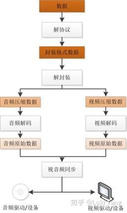

#### 硬解（Android MediaCodec）

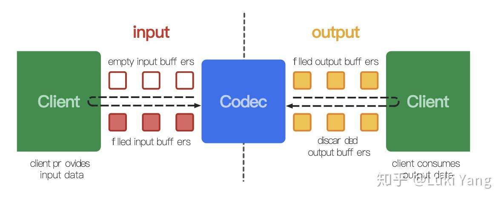

流程：dequeueInputBuffer → queueInputBuffer → dequeueOutputBuffer → releaseOutputBuffer

注意事项：
- getOutputBuffer 格式：YUV420P / YUV420SP（UV 排列不同）
- seekTo 后要 flush
- configure 传 Surface 则直接 decode 到 Surface，无法 getOutputBuffer

#### 软解（FFmpeg）

```cpp
avformat_open_input → avformat_find_stream_info → find video stream
avcodec_find_decoder / avcodec_find_decoder_by_name("h264_mediacodec")
avcodec_open2 → avcodec_send_packet → avcodec_receive_frame
```

FFmpeg 学习资源：雷神博客 https://blog.csdn.net/leixiaohua1020/article/details/15811977

**兼容性问题**（Android 平台坑多）：
- YUV 格式多样（420p/420sp/420p10le 等）
- 硬件平台差异（MediaCodec 支持程度、低端机）
- 分辨率问题（4K/8K、高通平台支持）

### 4.3 音视频同步

三种主时钟策略：

| 策略 | 场景 |
|------|------|
| **音频为主时钟** | 在线视频播放器（丢视频帧对齐音频） |
| **视频为主时钟** | 视频编辑 SDK（固定帧率时间线） |
| **外部时钟为主** | 特殊场景 |

对齐逻辑：当前时间轴 > 帧 pts → 丢帧继续找；当前时间轴 < 帧 pts → 继续用上一帧渲染。

### 4.4 多视频多轨道（进阶）

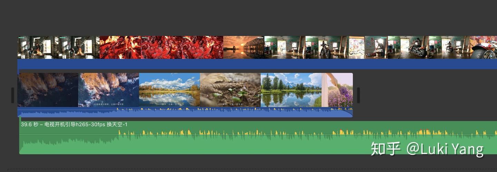

推荐 **MLT 框架**：Producer → Filter → Consumer，内部有精确的时间戳对齐逻辑，可配合 movit、FFmpeg 使用。

https://github.com/mltframework/mlt

---

## 5. 关于传输

> 作者自承：这块没做过，只有理论知识。

### 5.1 RTMP

（空节）

---

## 6. 分析音视频 APP

方法论：adb pull 优秀 APP 的包，分析其资源文件获取实现思路。

| APP | 包名 | 分析内容 |
|-----|------|---------|
| 抖音 | com.ss.android.ugc.aweme | Effect 资源、LOG 信息、渲染引擎结构 |
| 快手 | com.smile.gifmaker | 同上 |
| 大疆 DJI Mimo | dji.mimo | Sticker 资源、alpha 通道视频原理 |

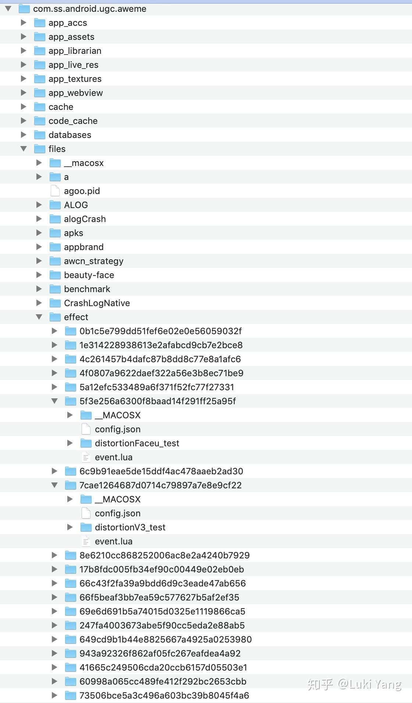

---

## 7. 总结

作者从图形渲染方向转入音视频领域，文章按管线框架梳理了各方向的知识点。核心观点：

- 音视频方向技术栈复杂，每个分支都值得深入研究
- 5G 时代音视频应用将更加广泛
- 短视频 APP（抖音/快手）在视频玩法上做到了极致
- 手机相机越来越强大，可部分取代专业设备
- 学习方法：**造轮子 + 逆向分析优秀 APP**

> "人生只有一次，做自己喜欢的事吧"

---

## 作者未填的坑

1. Camera HAL 高通架构详解
2. 拆解抖音复杂特效（AI/AR 结合）
3. 美型 + 人脸关键点深入研究
4. 编解码兼容性问题整理
5. 继续拆抖音包分析
