# 绿色记忆：H.264 学习笔记

---

## 简介

### MPEG

MPEG 是动态图像专家组（Moving Picture Experts Group）的简称，它可以指：

1. 一个成立于 1988 年的，研究视频和音频编码标准的组织
2. 一系列音视频编码标准，包括 MPEG-1、MPEG-2、MPEG-3、MPEG-4、MPEG-7 以及正在制定中的 MPEG-21

### MPEG-1

MPEG 发布的第一个视频和音频有损压缩标准，它采用了块方式的运动补偿、离散余弦变换（DCT）、量化等技术，并为 1.2Mbps 传输速率进行了优化。其主要是为光盘类介质制定，随后被作为 VCD（352x240，1.15mbps 比特率）的核心技术。

MPEG-1 标准由五个部分组成，其中第二部分、第三部分规定了视频、音频编码标准。

MPEG-1 音频编码标准分为三代，逐代提升了压缩比。其中最著名的第三代协议被称为 MPEG-1 Layer 3，简称 MP3。

一个 MPEG-1 视频序列，包含多个图像群组（Group Of Pictures，GOP），每个 GOP 包含多个帧，每个帧包含多个 slice。GOP 由两个 I 帧之间的帧构成。

帧是 MPEG-1 的一个重要基本元素，一个帧就是一个完整的显示图像。帧的种类有四种：

1. **I 帧**（Intra Frame）即帧内帧，也叫关键帧。这类帧能够被独立的解码，可以看做是基线 Profile 的 JPEG 图像
2. **P 帧**（Predicted Frame）即预测帧，也叫向前预测帧（Forward-predicted Frames）。P 帧利用视频中的时域冗余（Temporal Redundancy）来提高压缩比。P 帧仅仅存储相对于它前面的那一帧的图像的差异（基于运动补偿和运动估计算法）部分
3. **B 帧**（Bidirectional Frame）即双向预测帧，也叫向后预测帧（Backwards-predicted Frames）。B 帧类似于 P 帧，但是它同时可以基于前一帧、后一帧进行预测。由于 B 帧可能依赖于"未来"的帧来解码，它会引入额外的编解码延迟
4. **D 帧**（Direct Frame）即指示帧。仅仅由 DC 转换系数编码而成，因此其质量较低。D 帧不会被 I/P/B 帧引用，仅仅在快速预览时有用。D 帧实际应用的很少，后续标准也没有包含它

### MPEG-2

通常用来为广播信号提供视频和音频编码，包括卫星电视、有线电视等。MPEG-2 经过少量修改后，成为 DVD 产品的核心技术。

MPEG-2 的视频部分，提供了对隔行扫描（广泛应用在广播电视领域，在 CRT 类显示器上，比相同帧率的逐行扫描更加不会引起视觉闪烁）视频显示模式的支持。

高级音频编码（Advanced Audio Coding，AAC）在 MPEG-4 发布前，作为 MPEG-2 的附加内容发布。

MPEG-2 定义了两种复合信息流：传送流（TS）和节目流（PS：Program Stream）。TS 流与 PS 流的区别在于 TS 流的包结构是固定长度的，而 PS 流的包结构是可变长度的。PS 包与 TS 包在结构上的这种差异，导致了它们对传输误码具有不同的抵抗能力，因而应用的环境也有所不同。TS 码流由于采用了固定长度的包结构，当传输误码破坏了某一个 TS 包的同步信息时，接收机可在固定的位置检测它后面包中的同步信息，从而恢复同步，避免了信息丢失。而 PS 包由于长度是变化的，一旦某一 PS 包的同步信息丢失，接收机无法确定下一包的同步位置，就会造成失步，导致严重的信息丢失。因此，在信道环境较为恶劣，传输误码较高时，一般采用 TS 码流；而在信道环境较好，传输误码较低时，一般采用 PS 码流。由于 TS 码流具有较强的抵抗传输误码的能力，因此目前在传输媒体中进行传输的 MPEG-2 码流基本上都采用了 TS 码流。

### MPEG-3

本来的目标是为 HDTV 提供 20-40Mbps 视频压缩技术。在标准制定的过程中，委员会很快发现 MPEG-2 技术足以获取类似的效果，因此将其合并到 MPEG-2，成为 MPEG-2 的延伸。

### MPEG-4

主要用途在于网上流、光盘、语音发送，以及电视广播。MPEG-4 吸收了 MPEG-1、MPEG-2 以及其它相关标准的很多特性。

MPEG-4 仍然在进化之中，其关键组成部分是：

1. 第二部分：定义了一个编码器标准，DivX、Xvid 都是该标准的实现
2. 第十部分：即 MPEG-4 AVC（高级视频编码，Advanced Video Coding），也称 H.264。开源编码器 x264、Quick Time7 以及蓝光都遵循此标准

### H.264

目前 H.264 已经成为高精度视频录制、压缩和发布的最常用格式之一。它不是单个标准，而是由多个配置（Profile）构成的标准家族。每个编码器至少需要支持一种 H.264 配置。

H.264 能够在低带宽情况下提供优质视频，同等视频质量下，它仅仅需要 MPEG-2/H.263/MPEG-4 Part2 的一半甚至更少的带宽。

---

## 格式与质量

视频编码是压缩、解压缩数字视频信号的处理过程。数字视频是真实世界中视觉影像的基于空间、时间的采样。

通常情况下，在某一特定时刻对整个场景采样，形成帧（Frame），或者，对场景进行隔行采样，所谓场（Field）。采样总是按照一定的时间间隔进行，例如每 1/25 秒一次采样，这样连续的采样就形成了动态的视频信号，每秒钟采样的次数叫做帧率（Frame Rate）。为了表示彩色的场景，通常需要三个分量（Component）或者一系列的采样。

程序需要度量场景还原的精度，这样才能评估自身的性能。评估逻辑比较困难，原因是场景的质量很大程度上要考虑人的视觉心理特征，不同的人的视觉心理特征是不同的。

### 自然的视觉场景

真实世界中的视觉场景，通常由多个物体构成。这些物体有各自的形状、深度（景深）、纹理、照度。自然视觉场景的颜色、亮度呈现出平滑变化的特征。

对自然视觉场景进行数字化处理时，程序需要关注两个维度：

1. 空间特征：单个场景内部纹理的变化特征、物体的数量和形状、颜色
2. 时间特征：物体移动、明度变化、镜头/视点的切换

### 捕获

自然视觉场景在空间、时间上都是连续的。要以数字化的方式呈现这种场景，需要：

1. 空间采样：通常在场景的图像平面上设立矩形网格（Grid），采集离散的点（分辨率，帧大小），这些点分布在 Grid 的交叉处
2. 时间采样：按照一定的间隔对帧或者帧的分量进行采样（帧率）。对于低质量的视频通信来说，采样率通常在 10-20FPS 之间，这种级别的 FPS 下急速移动的物体不容易平滑显示；25-30FPS 是典型的电视电影采样率；高达 50-60FPS 的时间采样下移动物体会非常平滑，代价是过高的数据率（Data Rate）

时空采样的示意图如下：

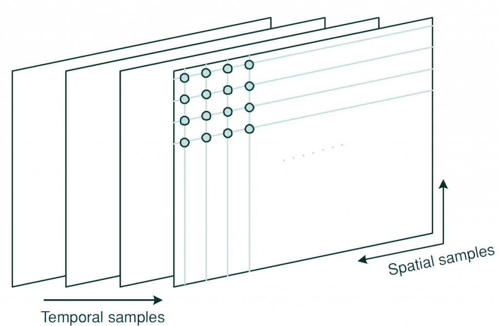

每个时空采样点——叫做图像元素（Picture Element）或者像素（Pixel）——采用 1-N 个数字来表示。这些数字包含了亮度（Brightness）/照度（Luminance）、颜色信息。注意，从视频采集设备（如 CCD）直接获得的采样阵列是模拟视频电信号。经过处理后才能变成像素表示的数字信号。

### 亮度/照度

这两个概念是对同一事物的不同表述。

照度是一个客观性的概念，即以特定角度射向指定区域的光照强度。单位是坎德拉（Candela）/平方厘米（cd/cm2）。通过调整，不同显示器可以达到相同的光照强度。

亮度则是一个主观性的和光照相关的概念。显示器可以调整亮度，但是不好度量，只能自己感觉。

### 帧和场

视频信号采样可以由：

1. 一系列连续的完整的帧构成，所谓逐行采样（Progressive Sampling）
2. 一系列交错的场构成，所谓隔行采样（Interlaced Sampling）

隔行采样时，通常在每个时间采样间隔中，两个场（分别由奇数行、偶数行构成）都进行采样。奇数行构成的场叫做 Top Field，偶数行构成的场叫做 Bottom Field。

隔行采样的优势是，提供两倍的帧率。根据人类的视觉停留的特点，可以避免产生画面抖动。

### 色彩空间

相关文章：[图像处理知识集锦](https://blog.gmem.cc/image-processing-faq#color-space)

大部分数字视频程序依赖于显示彩色图像，因此，需要一种机制来捕获、呈现颜色信息。单色图像仅仅需要一个数字来表示像素点的亮度/明度。彩色图像则需要至少三个数字来表示一个像素。

所谓色彩空间，就是用来描述亮度/照度（Brightness, Luminance or Luma）、颜色信息的方法。

**RGB**

这种色彩空间中，一个采样点利用三个数字表示，分别代表红色、绿色、蓝色的相对比例。由于 RGB 是三原色，因而它们的组合可以形成任何颜色。RGB 的各分量取值越大，则亮度越高。

**YCrCb**

RGB 色彩空间中，颜色信息、亮度信息是融合在一起的。然而，人类视觉系统（HVS）的特点是，对于亮度比颜色更加敏感。为了节省空间，可以把亮度信息分离出来，然后以较低的分辨率存储颜色信息，较高的分辨率存储亮度信息。

YCrCb（也叫 YUV）就是一种分离亮度的色彩空间。其中 Y 是明度分量，Y 根据 RGB 的权重计算出来：

```
Y = kr·R + kg·G + kb·B        k* 是颜色分量的权重因子
```

颜色信息则可以利用色差（Chrominance/Chroma）分量表示，每个色差分量即 RGB 与 Y 的差值：

```
Cr = R − Y
Cb = B − Y
Cg = G − Y
```

由于 Cr+Cb+Cg 求和是常量，因此，实际上仅仅需要记录两个色差信息就足够了。在 YCrCb 空间中，仅仅明度、红色差、蓝色差信号被传输。

YCrCb 可以使用较低分辨率来描述 Cr、Cb，由于 HVS 的特点，这样做图像质量不会受到太大影响。

---

## 视频编码原理

视频编码的目的是实现视频压缩，这样视频信号更加容易存储和传输。没有压缩过的原始视频需要很高的比特率，对于标清视频来说，大概 256Mbps。

压缩总是要和解压缩配对使用，因此视频编码器通常包含压缩、解压缩两套算法。

某些类型的数据包含统计冗余（Statistical Redundancy），可以被无损的压缩/解压缩。不幸的是，要实现无损的图像、视频压缩，则压缩比会很低，因而在这些领域常常使用有损压缩。

视频的有损压缩原则是基于主观冗余（Subjective Redundancy），即在不太影响观察者的主观感受的前提下，信息可以被删除。大部分视频编码器同时关注空间、时间上的冗余：

1. 在时域上，相邻的场景总是有很大的相似性，特别是在高帧率的情况下
2. 在空域上，类似于静态图片的压缩算法

H.264 和其它流行视频压缩算法——例如 MPEG-2、MPEG-4、H.263——共享了一系列通用的特性。例如预测、基于块的运动补偿（Motion Compensation）。

### 一般流程

编码器的一般工作流程如下图所示：

[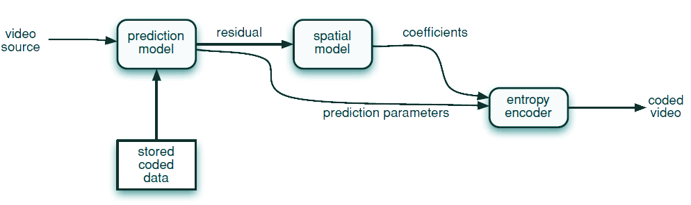](https://cdn.gmem.cc/wp-content/uploads/2017/09/encoder-procss.png)

编码器使用一个模型（Model）来表示视频源，一个高效的编码算法允许解码器尽可能保真的还原视频流。理想情况下，编码后的视频应该占据尽可能少的比特，同时尽可能的保真，当然这两个目标通常是冲突的。

编码器主要包括三个功能单元：预测模型、空间模型、熵（Entropy，信息论中的熵是信息量的度量，熵越高包含的信息量越大）编码器：

1. 预测模型的输入是原始视频序列。预测模型利用邻近的视频帧/图像采样之间的相似性，来降低信息冗余。典型的做法是构造当前帧/视频数据块的预测（Prediction）。对于 H.264 来说，预测可以是：
   1. 帧内预测（Intra Prediction）：通过根据当前帧内的邻近的图像采样进行空间推断（Spatial Extrapolation），构造出预测
   2. 帧间预测（Inter Prediction）或者叫运动补偿预测（Motion Compensated Prediction）：通过补偿不同帧之间的差异构造出预测
2. 预测模型的输出是帧残余（Residual Frame）—— 从当前帧中减去预测，附加上说明帧间/帧内预测如何进行的模型参数
3. 残余帧输入到空间模型，后者利用残余帧中的采样之间的相似性，降低空间冗余。H.264 的做法是对残余帧进行转换并对结果进行量化。转换后的残余帧变为量化转换系数（Quantized Transform Coefficients）表示——量化移除了采样中不重要的数据以实现对残余帧的进一步压缩
4. 预测模型的参数：帧内预测模式、帧间预测模式、运动向量（Motion Vectors），以及空间模型的参数，一起被熵编码器进一步压缩，移除统计学冗余数据。例如，反复出现的向量、系数被替换为简短的二进制代码。熵编码器产生容易传输的比特流或者文件
5. 压缩完成后的视频序列，包括编码后的预测参数、编码后的残余系数，外加头信息

### 预测模型

预测模型处理的对象是当前帧/场中的一系列图像采样，其目标是减少数据冗余，其手段是构建一个预测，并将其中当前数据中减去。预测可能从先前已经编码好的帧中推导，此所谓时域预测；预测也可能从当前帧/场中已经编码好的图像采样中推导，此所谓空域预测。

预测模型的输出是一系列残余/差异样本。预测处理越精确，则残余样板中包含的 Energy（信息量）越少。

#### 时域预测

被预测的帧的产生依赖于参考帧（Reference Frames），参考帧可以是过去或者未来的帧。帧预测的精度通常可以通过运动补偿——补偿当前帧和参考帧中由于物体移动产生的差异——的方式提高。

**简单预测**

最简单的时域预测，是使用前一个帧（预测器，Predictor）来预测当前帧，从当前帧中减去预测帧，直接得到帧残余：

[](https://cdn.gmem.cc/wp-content/uploads/2017/09/simple-prediction.png)

这种预测方法的缺点是，残余的信息量很大。这些残余很大程度上都是因为物体运动导致的，因而更好的时域预测算法能够通过自动补偿，减少不必要的信息量。

**运动导致的差异**

帧之间的差异，主要原因包括：物体运动、未覆盖（Uncovered）的区域、光照变化。

物体运动的类型包括：

1. 死板的平移，例如汽车运动
2. 变形运动，例如人说话时脸部的运动
3. 镜头运动，例如平移、倾斜、缩放、旋转

未覆盖区域的类型包括：

1. 由于物体移动而显露出来的背景区域

除了未覆盖区域、光照变化之外的其他帧间差异，都属于帧间像素移动。估算每个像素在帧间的移动轨迹（Trajectory）是可能的，像素移动轨迹构成的场被称为光流（Optical Flow）：

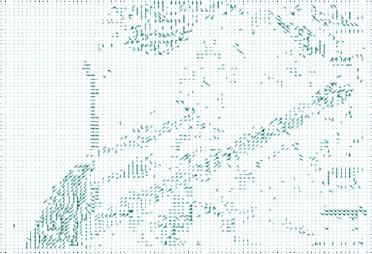

上图是前面前帧、后帧之间的光流的示意图。

如果得到了精确的光流场，那么就可以构造当前帧的绝大部分像素的精确预测，只需要将参考帧中的每一个像素沿着它的光流向量（Optical Flow Vector）移动即可。然而，精确的光流场需要大量的计算资源才能获得。

#### 基于块的运动估算和补偿

实践中经常使用的一种运动补偿方法是，针对块（当前帧中一个矩形区域）进行运动补偿，这种方法避免了逐像素光流计算的资源消耗。基于块的运动补偿的流程如下（针对当前帧中每一个 MxN 大小的采样块）：

1. 搜索过去或者未来的参考帧中的一个相似的 MxN 采样块。具体的做法可能是，将当前帧的 MxN 块和搜索区域中所有可能的 MxN 块进行比较，从中选取最匹配的块。一个流行的判断"匹配"的准则是，将两个块进行相减得到残余，残余的 Energy 越低匹配度越高。寻找最佳匹配的过程被称为移动估算（Motion Estimation）
2. 最佳匹配的块被作为当前 MxN 块的预测器（Predictor），预测器和当前块求差后，形成一个 MxN 的残余块——运动补偿（Motion Compensation）
3. 编码后的残余块，外加预测器和当前块之间的位置偏移（运动向量，Motion Vector），被一起发送

解码器利用运动向量重新定位预测器区域，解码残余块，将预测器 + 残余块即可还原当前块。

基于块的运动补偿之所以流行，有如下几个原因：

1. 计算资源的消耗相对较小，而且算法比较直观
2. 帧本身都是矩形的，和块运动补偿很适配
3. 基于块的图像转换算法（例如离散余弦变换，Discrete Cosine Transform，DCT）和块运动补偿很适配
4. 对于很多视频序列来说，块运动补偿能提供高效的时域模型（Temporal Model）

但是这种运动补偿也有缺陷：

1. 真实物体很少具有能匹配矩形区域的边界
2. 物体的帧间移动距离，常常不是整数个像素
3. 很多类型的对象运动很难通过基于块的方式补偿——例如变形、旋转，以及类似云或者烟雾那样复杂的运动

尽管如此，当前所有视频编码标准均将基于块的运动补偿作为时域预测模型的基础。

#### 宏块的运动补偿预测

宏块（Macroblock）是帧中 16x16 大小的区域，它是包括 MPEG-1、MPEG-2、MPEG-4 Visual、H.261、H.262、H.264 在内的很多视频编码标准的运动补偿预测的基本单元。

在常见的 YUV 4:2:0 图像编码格式中，一个宏块由：

1. 256 个照度采样构成，这些采样组成 4 个 8x8 的采样块
2. 64 个红色色差采样构成，这些采样组成 1 个 8x8 的采样块
3. 64 个蓝色色差采样构成，这些采样组成 1 个 8x8 的采样块

即一共 6 个采样块，示意图如下：

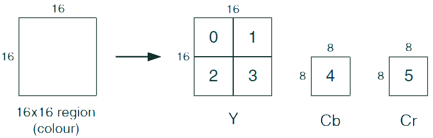

宏块的运动估计，主要是寻找参考帧中和当前宏块匹配的 16x16 采样区域。参考帧是先前就编码好的一个帧，在时间维上，参考帧可以在过去或者未来。参考帧中以当前宏块为中心的区域被搜索，寻找最佳匹配。

最佳匹配的照度、色差采样，被从当前宏块中减去，这样就产生了一个残余宏块。残余宏块与标示了最佳匹配区域和当前宏块的相对位移的移动向量一起编码并传输。

在上述基本的运动估计、运动补偿的基础上，有很多变体的算法：

1. 如果使用了未来的帧作为参考帧，则未来的帧必须在当前帧之前编码，也就是帧的编码必须是乱序的
2. 当参考帧和当前帧的差异非常大时，不使用运动补偿可能更加高效，编码器可能选择使用帧内预测
3. 视频中的移动物体很少能恰恰匹配 16x16 的边缘，因此使用可变大小的块往往更加高效
4. 物体移动的距离可能不是整像素，例如物体可能在水平方向移动 3.83 像素的距离。因此一个好的预测算法会在搜索最佳匹配之前在参考帧中，在次像素级别进行插值

#### 宏块的尺寸

宏块的尺寸越小，则残余帧的 Energy 越低，预测越精准。但是相应的，计算复杂度越高。

为此，一个折衷的方式是：对于扁平、均匀的区域选择大的宏块尺寸；对于高度细节、复杂的移动区域选择小的宏块尺寸。

#### 次像素运动补偿

某些情况下，从参考帧的插值后（非整数像素）的采样位置进行预测可能获得更佳的效果。例如下图中，参考帧区域中像素被插值到半像素级别，这样匹配位置的精度可以提高一倍，通过搜索插值采样，可能获得更好的匹配。

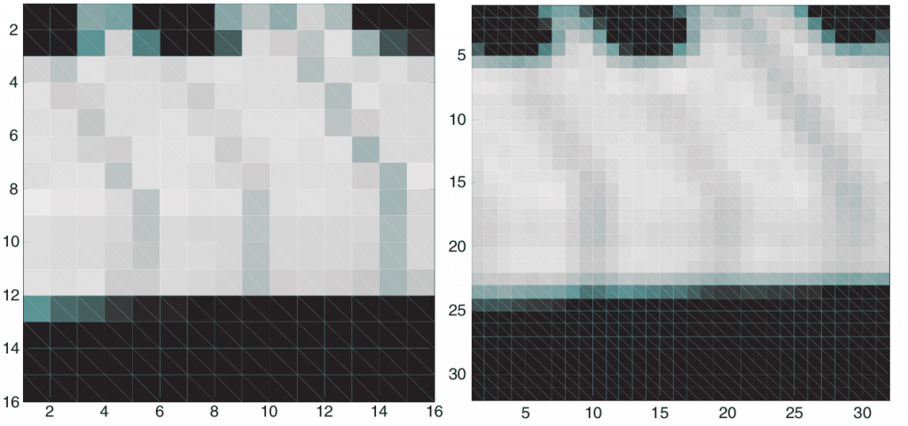

通常来说，更加细粒度的插值可以提供更好的运动补偿效果，得到更低 Energy 的残余，代价是更高的复杂性。但是这种效果的提升不是线性的，插值越精细，效果进一步的提升越小。

#### 空间预测

对当前块的空间预测，是基于当前帧中其它先前编码过的采样进行的。假设帧中的块以光栅扫描（Raster-scan）顺序逐个编码，则所有左上方向的块都可以用于当前块的帧内预测。由于左上方向的块已经编码并存放到输出流，解码器很自然的可以用它们进行预测的重建。

帧内预测的具体算法有很多，H.264 使用的是空间外推法（Spatial Extrapolation）。一个/多个预测由当前块上侧或左侧的外推采样构成。通常最靠近的采样最可能和当前块中的采样具有相关性，因而仅仅沿着上侧/左侧边缘的那些像素才会用来创建预测块。一旦预测块被创建，会被用来产生残余块，具体方式和帧间预测类似。

### 图像模型

自然的视频帧是一系列采样构成的 Grid，这种图片的原始格式很难被压缩，因为邻近的采样具有高相关性。下图左侧是某个自然视频帧的 2D 自相关（Autocorrelation）函数的曲面，高度表现了图片与其空间偏移之后的副本的相关性，底面的两个维度表示了空间偏移的方向。缓和的坡度提示了邻近样本的高度相关性。

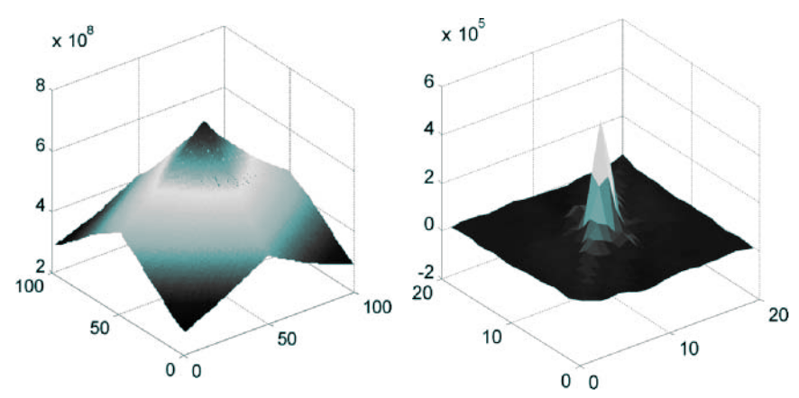

而经过运动补偿的残余图像的自相关性函数如上图右侧所示，可以看到随着空间偏移的增大，相关性急剧的降低。这提示了邻近采样的弱相关性。有效的运动补偿/帧间预测降低了残余图像的本地相关性，让其比原始的视频帧更加容易被压缩。

图像模型的功能是，进一步的对残余图像进行去相关（Decorrelate），让它能够更有效的被熵编码器所压缩。图像模型通常有三个处理阶段：

1. 转换（Transformation）：对图片进行去相关、让数据更加紧凑（Compact）
2. 量化（Quantization）：降低转换后数据的精度
3. 重排（Reordering）：对数据进行重新排序，让关键数值（Significant Values）分组在一起

### 预测性图像编码

运动补偿是预测性编码的一个例子，编码器基于过去/未来的某个帧创建当前帧中某个区域的预测，然后把预测从当前区域中减去，得到一个残余。如果预测成功的话，残余的 Energy 会比原始区域小，需要更少的比特来表示。

预测性编码是早期的视频编码器的基础，也是 H.264 的帧内编码的重要组件。空间预测需要基于先前传输的、当前帧已经编码好的区域的样本，这种预测方法有时被称为差分脉冲编码调制（Differential Pulse Code Modulation）。

下面的公式示意像素 X 的编码过程，我们假设帧基于光栅顺序处理。A、B、C 是对于编解码器都可用的参考（相邻）像素，这些像素应该在 X 之前被编解码：

```
P(X) = (2A + B + C) / 4
R(X) = X − P(X)
```

解码器根据 A、B、C 可以重新构造出预测，然后 `X = R(X) + P(X)` 即解码出像素 X。四个像素的位置关系如下图：

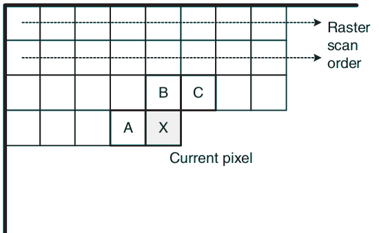

如果编码过程是有损的，也就是说残余被量化过，那么解码得到的 A'/B'/C' 并不和 A/B/C 完全一致，而依据 A'/B'/C' 推导出来的 X' 则会与 X 有更多的误差。这会导致编码器和解码器之间的累积性的误差，或者叫漂移（Drift）。为了避免这种漂移，编码器可以使用解码后的参考像素来构建残余，即：

```
P(X) = (2A' + B' + C') / 4
```

这样编码器、解码器使用相同的 P(X)，也就避免了漂移。

上面介绍的预测性编码算法的效率取决于 P(X) 的精度，如果 P(X) 和 X 很接近，则残余的 Energy 很低，预测效率就高。但是，很难为复杂图像的所有区域选取一个通用的预测器。为了得到高性能，通常需要基于图像的本地统计信息进行自适应性的预测器选取。例如，对于图片中的扁平纹理、强竖直纹理、强水平纹理区域选取不同的预测器。由于你需要使用额外的 bit 来告知解码器使用了哪些预测器，因此要注意预测性能和流量消耗之间的权衡。

### 转换

图片或者视频编码器的转换阶段的意图是，将图片或者运动补偿残余数据转换到转换域（Transform Domain）。选择转换算法取决于一系列准则：

1. 转换域中的数据应该是：
   1. 去相关的，也就是说，这些数据应该分离到最小相关性的分量中
   2. 紧凑的，大部分的 Energy 应该集中到数据的一小部分数值中
2. 转换必须是可逆的
3. 转换对计算资源的需求必须是可容忍的，包括内存、CPU

流行的图像/视频转换算法基本上分为两大类：

1. 基于块的：包括 KLT、SVD、DCT。这些算法以 NxN 的采样为操作单元，其优点是内存用量小，适合压缩基于块的运动补偿残余。这类算法的缺点是块效应（Blockiness）明显
2. 基于图像的：在整个图像/帧上，或者大块的区域（所谓 Tile）上操作。包括离散小波变换（Discrete Wavelet Transform，DWT）。这类算法对于静态图像的压缩处理优于上一类，但是需要更高的内存

### 量化

量化器（Quantizer）将信号值范围 X 映射到一个较小的值范围 Y。主要有两类量化器：

1. 标量量化器：将输入信号中的一个采样映射为一个量化的输出值
2. 向量量化器：将输入信号中的一组采样映射为一组量化值

### 重排和零编码

对于一个基于转换的图像/视频编码器，量化器的输出是一个稀疏的数组。其中包含少量的非零系数，以及大量的零值系数。

重排阶段的工作就是把非零系数排列在一起，然后标识出这些系数在数组中的索引，实现压缩。

### 熵编码器

熵编码器把一系列表示视频序列的元素转换成适合传输和存储的压缩比特流。输入符号包括量化后的转换系数、整/次像素级别的移动向量、标记性编码、宏块头、图像头等。

在信息论中，熵编码属于无损压缩，且压缩不受媒介的特质影响。熵编码器可以把定长的输入符号替换为相应的可变长度的代号（Codeword），从而实现压缩。代号的长度和出现几率的负对数正相关，因而大部分公共符号具有最短的代号。

---

## H.264 简介

### H.264 是什么

从不同的视角看，H.264 可以有不同的含义：

1. 它是一个工业标准，定义了一种压缩视频格式
2. 一种流行的视频格式
3. 一套用于视频压缩的工具

编码是视频类应用的基础技术，因为原始视频格式太大，难以传输或者存储。对视频编码进行标准化，可以让不同厂商开发的编码器、解码器、媒体存储能够方便的互操作。

典型的 H.264 应用，例如远程视频监控，视频从摄像头采集出来后被编码为 H.264 比特流，通过网络传输。终端应用解码比特流并获得原始视频：

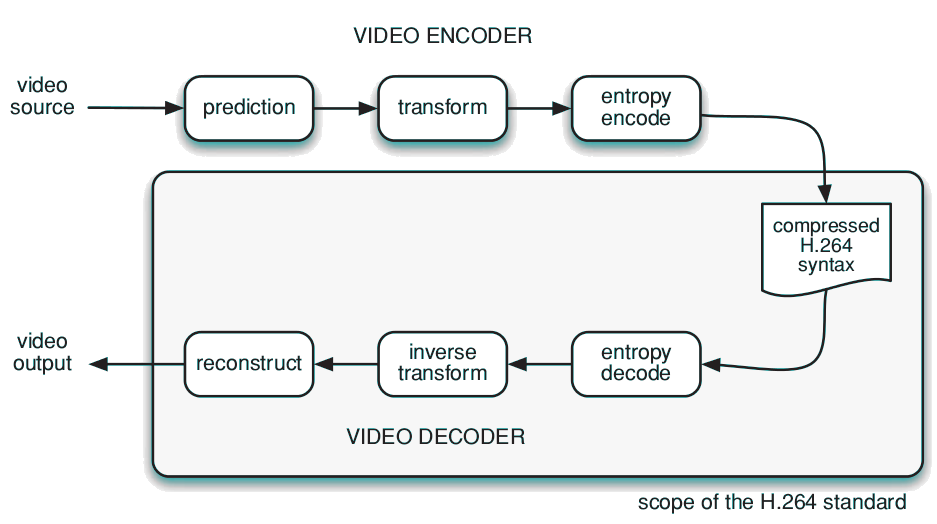

H.264 标准首次发布于 2003 年，之后经历了数次修订和更新。它基于早先的视频编码标准的设计理念，进一步提高了压缩视频的质量，在压缩、传输、存储方面有更大的灵活性。

H.264 描述了一组用于压缩的工具/方法，规定了基于这些工具编码的视频如何呈现和解码。视频编码器可以选择一个工具，应用一些约束，然后处理视频流。H.264 兼容的解码器必须能够使用工具组的某个子集——所谓配置（Profile）。

### H.264 如何工作

通过预测、转换、编码等处理过程，H.264 编码器生成一个 H.264 比特流。解码器则进行逆向处理——解码、反向转换、重构——以生成原始（Raw）视频序列。

每个视频帧/场都需要被编码器处理，帧/场被编码后，可能被放到已编码图像缓冲中（Coded Picture Buffer，CPB）。在编码后续帧时，编码器可以使用 CPB。类似的，解码器在解码出一个帧后，将其放到已解码图像缓冲中（Decoded Picture Buffer，DPB），在解码后续帧时可以使用 DPB。

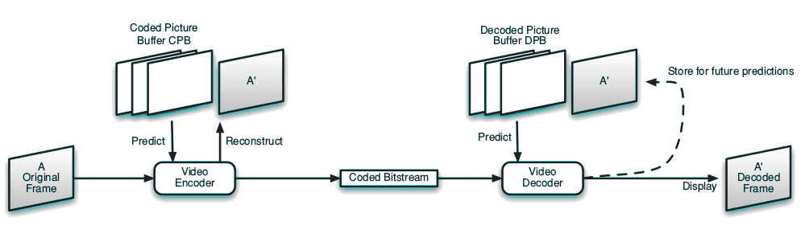

### 编解码流程总览

H.264 的数据处理单元是 16x16 大小的宏块（Macroblock）。

在编码器中，预测宏块从当前宏块中减去，得到一个残余宏块。残余宏块被转换、量化并编码。在此同时，量化后的数据被重新扫描、反向转换并加上预测宏块，得到一个编码后的帧版本，然后存储起来用于后续的预测：

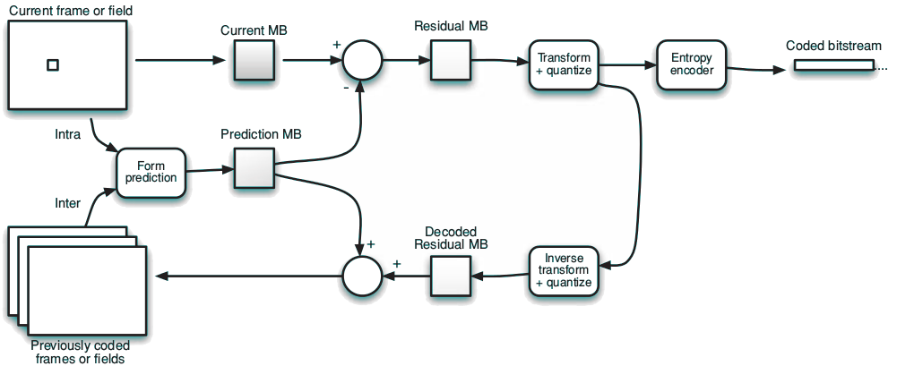

在解码器中，宏块被解码、重新扫描、反向转换，得到一个编码过的残余宏块。解码器生成预测宏块后加上残余宏块，产生解码后的宏块：

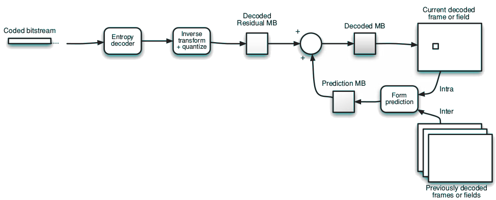

**编码流程**

预测阶段，包括帧间预测和帧内预测。H.264 支持的预测方法很灵活，从而实现更精确的预测。帧内预测使用 16x16 或者 4x4 的块大小，从当前宏块的四周进行预测。帧间预测的块大小可以在 16x16 - 4x4 之间自由变动，参考帧可以来自过去或者未来。

预测阶段产生的残余采样，使用 4x4 或者 8x8 的整数变换（Integer Transform）——离散余弦变换的近似形式——进行转换，转换的输出是一组系数。系数的每个成员是一种标准化基本图式（Standard Basis Patterns）的权重值。通过系数可以重新创建出残余采样：

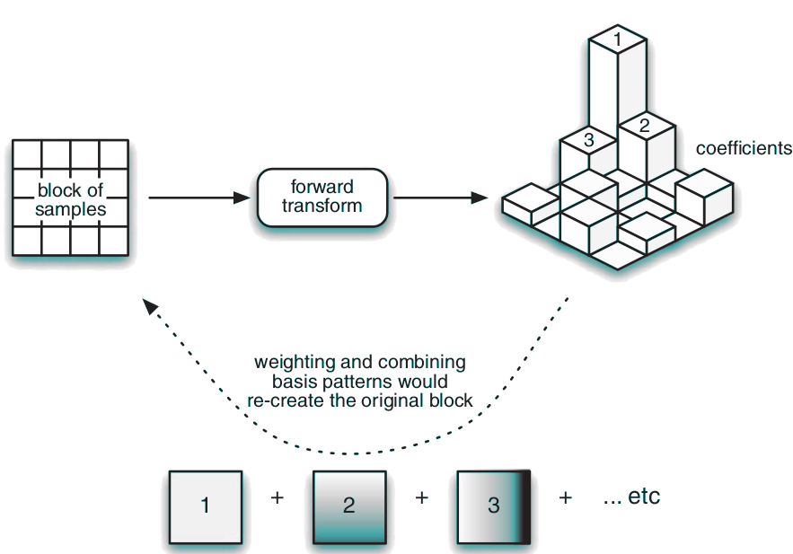

转换的结果进一步被量化，也就是，每个系数除以一个整数。量化后的转换系数精度降低：

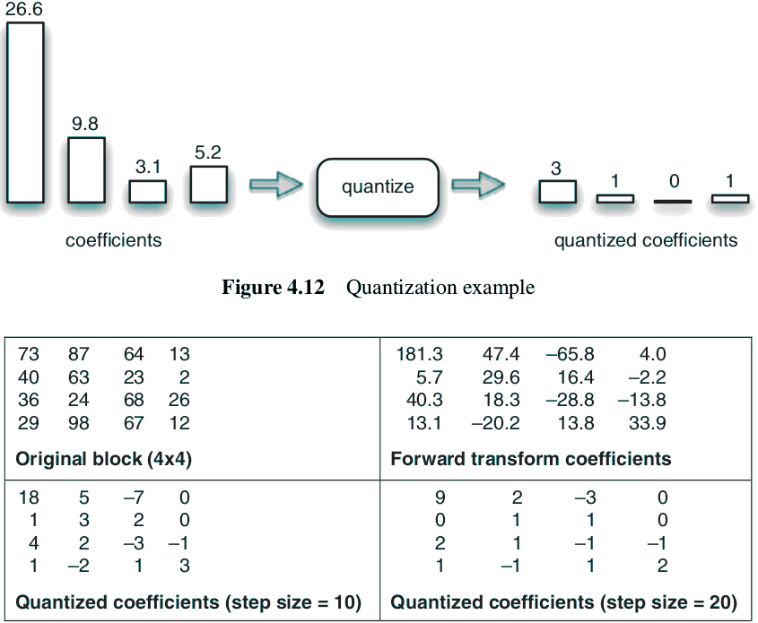

视频编码最终产生的是一系列需要编码组成压缩比特流的数值，这些数值包括：

1. 量化后的转换系数
2. 供解码器重建预测的信息
3. 压缩数据结构相关信息
4. 和完整视频序列有关的信息

这些数值和参数，以及语法元素（Syntax Elements），被可变长度编码/算术编码算法转换为二进制代码。

**解码流程**

首先要进行的是对二进制比特流进行解码，解码语法元素并抽取上节所述的数值和参数。

然后是重扫描，每个系数乘以一个整数以近似的还原其原始值：

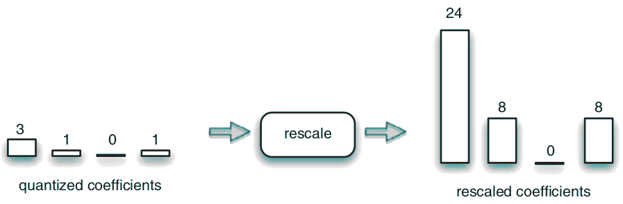

重扫描后的图式权重系数，加上标准化基础图式，经过反向离散余弦变换/整数变换可以重新创建出采样的残余数据：

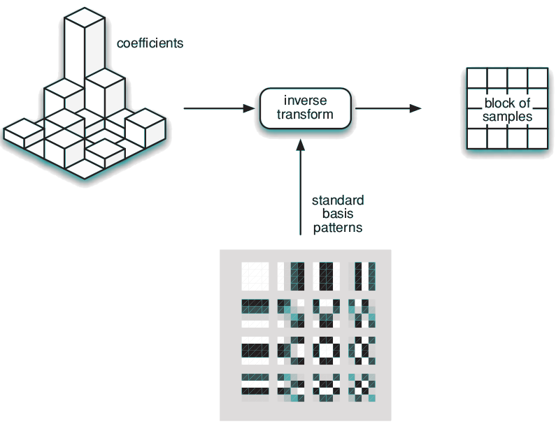

得到采样残余后，解码器使用和编码器一样的预测，加上残余即得到原始图像。

---

## H.264 语法

H.264 规范清晰的定义了一套格式，或者叫语法。用于呈现压缩视频及其相关信息。这套语法的总体结构图如下：

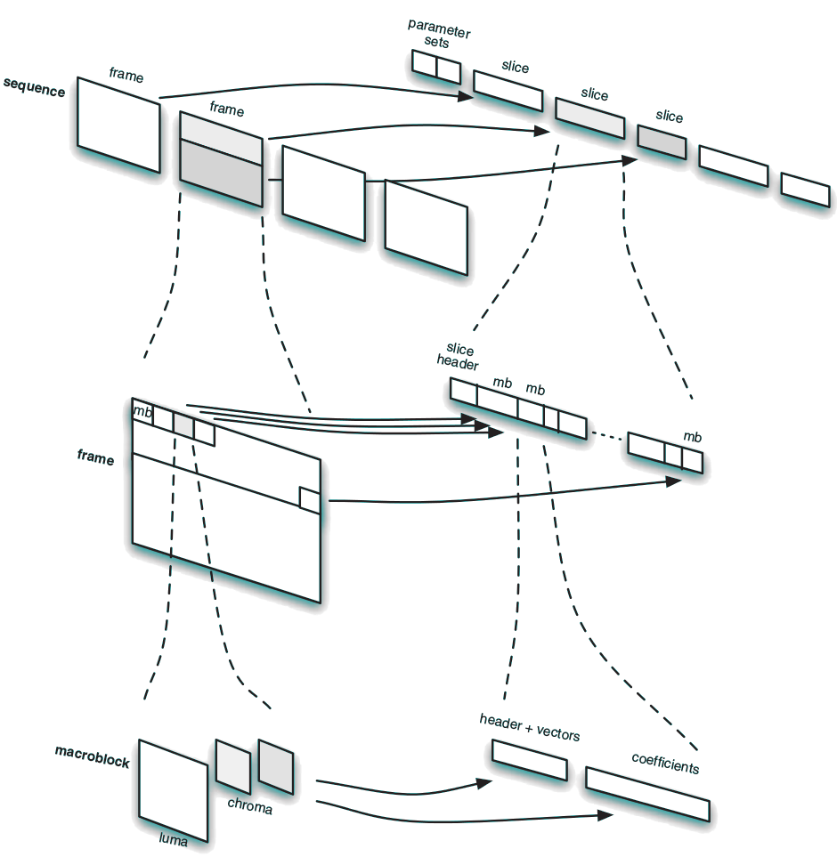

在最顶层，一个 H.264 序列由一系列的包（Packet），或者叫网络抽象层单元（Network Abstraction Layer Unit，NALU）构成。NAL 可以包含解码器需要用到的关键参数集，这些参数集指示解码器如何正确的解码帧（Frame）或切片（Slice）。所谓切片，是指被分解后的帧的一部分，帧可以仅仅包含一个切片。

在下一层，切片由一系列编码过的宏块组成。每个宏块对应帧中 16x16 大小的块。

在最底层，宏块包含描述自己如何被编码的信息——编码的具体方法、预测信息、残余采样等。

### 概要

H.264 语法的层次性组织如下图所示：

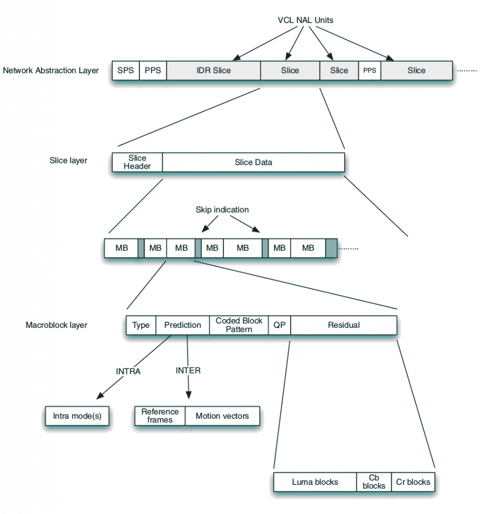

说明如下：

1. **网络抽象层**：由一系列的 NAL 单元组成：
   1. SPS、PPS 是特殊的 NAL 单元，作为解码器特定通用控制参数变更的信号
   2. 编码后的视频数据对应视频编码层（Video Coding Layer）NAL 单元，也被称为切片（Slice）。每个访问单元（Access Unit），即编码后的帧/场，可以由 1-N 个切片构成
2. **切片层**：每个切片包括切片头、切片数据两部分。切片数据是一系列编码后的宏块，外加可能的跳过提示符。跳过提示符用于指示特定的宏块位置没有数据
3. **宏块层**：每个编码后的宏块包括如下语法元素：
   1. MB 类型：I（帧内编码）、P（基于一个参考帧进行帧间编码）、B（基于 1-2 个参考帧进行帧间编码）
   2. 预测信息：I 宏块的预测模式，P/B 宏块的参考帧和移动向量
   3. 编码块图式（Coded Block Pattern，CBP）：提示哪些明度块、色差块包含非零残余系数
   4. 量化参数（Quantization Parameter，QP）：仅仅 CBP 非零的宏块具有此元素
   5. 残余数据：仅仅 CBP 非零的宏块具有此元素

编码后的视频序列总是以即时解码器刷新（Instantaneous Decoder Refresh，IDR）访问单元开始，其包括若干个 IDR 切片。IDR 切片是一种特殊的帧内编码切片。IDR 访问单元后面跟着很多普通的访问单元序列。当一个新的视频序列到达时，需要提前再次发送 IDR 切片。此外传输结束时也发送 IDR 切片。

### 语法区段列表

| 区段 | 包含区段 | 说明 |
|------|---------|------|
| NAL unit | RBSP | 网络抽象层单元，包含原始字节序列载荷（Raw Byte Sequence Payload，RBSP）。RBSP 是包含了 H.264 语法元素的字节序列。H.264 元素的长度是以位计算的可变长度，因此 RBSP 的总长度不一定是整数字节。因此 RBSP 尾部会补零（Trailing Bits）确保匹配整数字节 |
| SPS | Scaling List, VUI Parameters, Trailing bits | 序列参数集（Sequence Parameter Set），对于视频序列通用的参数 |
| Scaling List | — | 编码器提供的用于反向量化处理的缩放矩阵 |
| SPS Extension | Trailing bits | 包含用于阿尔法混合（Alpha Blending）的辅助图片信息 |
| SEI | SEI Message, Trailing bits | 辅助增强信息（Supplement Enhancement Information），SEI 消息容器 |
| SEI Message | SEI payload | SEI 消息可以用于辅助解码或显示，但是不影响解码帧的构建 |
| AUD | Trailing bits | 访问单元定界符（Access Unit Delimiter），可选的定界符，用于指示下一个编码图片的切片类型 |
| End of Sequence | — | 指示下一个切片是 IDR |
| End of Stream | — | 指示视频流的结束 |
| Filler Data | Trailing bits | 填充字节序列 |
| Slice layer | Slice header, Slice data, Trailing bits | 编码后的切片，分为几个类别：不使用分区的切片、分区切片的分区 A/B/C |
| Slice header | RPLR, PWT, DRPR | 对于切片的通用参数 |
| RPLR | — | 引用图片列表重排（Reference Picture List Reordering），修改默认引用图片列表顺序的命令 |
| PWT | — | 预测权重表格（Prediction Weight Table），明度、色差权重偏移量 |
| DRPR | — | 解码后引用图片标记（Decoded Reference Picture Marking），标记引用图片为长期引用的命令 |
| Slice data | MB layer | 包含一系列编码后的宏块 |
| MB layer | MB prediction, Sub-MB prediction, Residual data | PCM 头、宏块头、预测、转换系数 |
| MB prediction | — | 帧内预测模式，或者引用索引 + 移动向量 |
| Sub-MB prediction | — | 引用索引 + 移动向量 |
| Residual data | RB CAVLC, RB CABAC | 包含一系列残余块，具体内容取决于 CBP |
| RB CAVLC | — | 基于 CAVLC 编码的转换系数块 |
| RB CABAC | — | 基于 CABAC 编码的转换系数块 |

### 帧/场/图片

H.264 将帧定义为一组明度采样数组，外加两组对应的色差采样数组。场分为 Top field、Bottom field，共同构成帧，两个场可以同时扫描或者交错扫描。术语图片（Picture）作为帧/场的通称。

帧/场被解码，形成解码后图片并被放置到解码后图片缓冲（Decoded Picture Buffer，DPB）。此缓冲中的图片可以用于：

1. 支持后续的帧间预测
2. 输出到显示组件

区分以下三个顺序很重要：

1. **解码顺序**：图片从比特流中被解码的顺序
2. **显示顺序**：图片输出到显示组件的顺序
3. **参考顺序**：图片如何被排列以供其它图片进行帧间预测

**解码顺序**

帧和帧之间可能存在引用（时域预测）关系，因此它们的解码顺序必须是确定的。

解码序（Decoding Order）确定了编码后的帧/场的解码顺序，由切片头参数 `frame_num` 确定。一般情况下，当前帧的 `frame_num` 为先前参考帧的 `frame_num + 1`。

**显示顺序**

显示序（Display Order）即帧/场的播放顺序。由参数图像顺序计数器（POC，Picture Order Count）确定，POC 参数包括 `TopFieldOrderCount`、`BottomFieldOrderCount`。这两个参数也来自切片头，获取方法有三种：

1. 类型 0：在每个切片头中，都包含了 POC 的最低有效位（Least Significant Bits），这种方式提供了灵活性但是占据更多字节。Type0 示意如下图，箭头（从被参考帧发起）表示帧引用关系：

   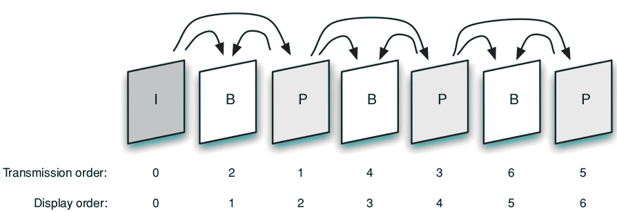

2. 类型 1：在 SPS 中设立一个循环的 POC 计数器，POC 依据此计数器循环计数，除非切片头使用 Delta Offset
3. 类型 2：直接从 `frame_num` 获得，解码序和显示序一致

**参考顺序**

图片编码后，如果允许被其它图片参考，则进入已解码图片缓冲（DPB），并被标记为以下两种之一：

1. **短期参考图片**，以 `frame_num` 或者 POC 进行索引。把这类图片从 DPB 移除的方法有：
   1. 通过比特流中明确的命令移除
   2. 如果启用了 DPB 自动处理模式，并且 DPB 已满，自动移除最旧的图片
2. **长期参考图片**，以 `LongTermPicNum` 进行索引，此数字基于图片被标记为长期参考帧时设置的参数 `LongTermFrameIdx` 推导。这类图片需要通过比特流中明确的命令移除

短期参考图片后续可以被赋予 `LongTermFrameIdx`，导致它变为长期参考图片。

**默认参考图像列表顺序**

参考图像列表（Reference Picture List）是存放参考图片引用的列表。对于 P 切片来说，使用单个列表 list0；对于 B 切片来说，使用两个列表 list0、list1。

在每个列表中，短期参考图片排在前面，短期参考图片的排列规则：

1. 如果当前切片是 P，依赖于解码序
2. 如果当前切片是 B，依赖于显示序

长期参考图片排在短期参考图片后面，且按照 `LongTermPicNum` 升序排列。

列表元素的排序细节很重要，因为要引用列表中前面的项需要的比特数更少。因此默认排序规则让"接近"当前图像的参考图像排在列表前面，这些参考图像中存在最佳预测匹配的几率更大：

1. P 切片的 list0：默认顺序是 PicNum 的降序，`frame_num` 对 `MaxFrameNum` 取模得到 PicNum
2. B 切片的 list0：默认顺序是：
   1. 如果参考图片的 POC 比当前图像早，则按 POC 降序
   2. 如果参考图片的 POC 比当前图片晚，则按 POC 升序
3. B 切片的 list1：默认顺序是：
   1. 如果参考图片的 POC 比当前图像早，则按 POC 升序
   2. 如果参考图片的 POC 比当前图片晚，则按 POC 降序

### NAL 单元

编码后的 H.264 数据以 NAL 单元这种数据包在网络中发送。每个 NAL 单元包含 1 字节的 NALU 头，后面跟着包含控制参数或者视频数据的比特流。

NALU 头包含信息：

1. NALU 的类型：

| 值 | NALU 类型 | 说明 |
|----|----------|------|
| 0 | 未使用 | |
| 1 | Coded slice, non-IDR | 典型的切片 |
| 2 | Coded slice data partition A | 数据分区切片，分区 A |
| 3 | Coded slice data partition B | 数据分区切片，分区 B |
| 4 | Coded slice data partition C | 数据分区切片，分区 C |
| 5 | Coded slice, IDR | 作为视频序列起点 |
| 6 | SEI | 补充增强信息 |
| 7 | SPS | 序列参数集，每序列一个 |
| 8 | PPS | 图像参数集 |
| 9 | Access unit delimiter | 提示下一个编码图片的切片类型 |
| 10 | End of sequence | 提示下一个 NALU 是 IDR |
| 11 | End of stream | 提示视频序列结束 |
| 12 | Filler | 填充字节 |
| 13-23 | 保留 | |
| 24-31 | 不保留，RTP 打包用到 | |

2. NALU 的重要程度

**NALU 头结构**

NALU 头固定为 1 字节长，其结构示意图如下：

```
+---------------+
|0|1|2|3|4|5|6|7|
+-+-+-+-+-+-+-+-+
|F|NRI| Type    |
+---------------+
```

其中：

1. `forbidden_zero_bit`，第 1 位，必须为 0
2. `nal_ref_idc`，第 2-3 位，重要程度。值越大越重要，当解码器过载时可以考虑把值为 0 的 NALU 丢弃。在 RTP 中使用，NRI 还指示了传输的相对优先级
3. `nal_unit_type`，最后 5 位。类型 6/9/10/11/12 对应的 NRI 应该为 00，类型 7/8 对应的 NRI 应该为 11

### 参数集

参数集是携带了解码参数的 NALU，这些参数对于后续若干切片是公用的，独立于切片发送参数集可以提高效率。这些参数对于正确解码非常重要，在不可靠信道上传输视频流时，参数集可能丢失，可以考虑用更高的 QoS 发送参数集。

**序列参数集（SPS）** 包含对整个视频序列有效的参数，例如 Profile 和 Level、帧尺寸、某些解码器约束（例如参考帧最大数量）。SPS 示例：

| 参数 | 取值 | 符号 | 说明 |
|------|------|------|------|
| profile_idc | 1000010 | 66 | 使用 Profile Baseline |
| constrained_set0_flag | 0 | 0 | 比特流可能不遵从 Baseline 的所有约束 |
| constrained_set1_flag | 0 | 0 | 比特流可能不遵从 Main 的所有约束 |
| constrained_set2_flag | 0 | 0 | 比特流可能不遵从 Extended 的所有约束 |
| reserved_zero_4bits | 0 | 0 | 保留的 4bit |
| level_idc | 11110 | 30 | 级别 3 |
| seq_parameter_set_id | 1 | 0 | SPS 标识符 |
| log2_max_frame_num_minus4 | 1 | 0 | frame_num 不大于 16 |
| pic_order_cnt_type | 1 | 0 | 默认 POC |
| log2_max_pic_order_cnt_lsb_minus4 | 1 | 0 | POC 的 LSB 不大于 16 |
| num_ref_frames | 1011 | 10 | 最多 10 个参考帧 |
| gaps_in_frame_num_value_allowed_flag | 0 | 0 | frame_num 中没有 gap |
| pic_width_in_mbs_minus1 | 1011 | 10 | 11 宏块宽 = QCIF |
| pic_height_in_map_units_minus1 | 1001 | 8 | 9 宏块高 = QCIF |
| frame_mbs_only_flag | 1 | 1 | 没有场切片或者场宏块 |
| direct_8x8_inference_flag | 1 | 1 | 指定 B 宏块的移动向量如何得出 |
| frame_cropping_flag | 0 | 0 | 帧没有被裁剪 |
| vui_parameters_present_flag | 0 | 0 | VUI 参数不存在 |

**图像参数集（PPS）** 包含应用到一部分帧的参数，例如熵编码类型、活动参考图片数量、初始化参数。PPS 继承特定 SPS 的参数。PPS 示例：

| 参数 | 取值 | 符号 | 说明 |
|------|------|------|------|
| pic_parameter_set_id | 1 | 0 | PPS 标识符 |
| seq_parameter_set_id | 1 | 0 | 继承自的 SPS |
| entropy_coding_mode_flag | 0 | 0 | 基于 CAVLC 进行熵编码 |
| pic_order_present_flag | 0 | 0 | POC 未设置 |
| num_slice_groups_minus1 | 1 | 0 | 一个 Slice 组 |
| num_ref_idx_l0_active_minus1 | 1010 | 9 | 第一个列表中有 10 个参考图像 |
| num_ref_idx_l1_active_minus1 | 1010 | 9 | 第二个列表中有 10 个参考图像 |
| weighted_pred_flag | 0 | 0 | 没有使用权重预测 |
| weighted_bipred_idc | 0 | 0 | 没有使用双向权重预测 |
| pic_init_qp_minus26 | 1 | 0 | 初始明度量化参数为 26 |
| pic_init_qs_minus26 | 1 | 0 | 初始 SI/SP 量化参数为 26 |
| chroma_qp_index_offset | 1 | 0 | 色差量化参数没有设置 |
| deblocking_filter_control_present_flag | 0 | 0 | 使用默认过滤器参数 |
| constrained_intra_pred_flag | 0 | 0 | 帧内预测不受限 |
| redundant_pic_cnt_present_flag | 0 | 0 | 没有使用冗余图像计数参数 |

**参数集的激活**

直到切片头引用 PPS 之前，PPS 没有被激活，也就是编码器不使用它。一旦应用，则一直有效，直到另一个 PPS 被激活。

SPS 仅仅在引用它的 PPS 激活时，才被激活。单一的 SPS 之后对整个流有效，而流以 IDR 切片开始，因而通常由 IDR 激活 SPS。

### 切片层

每个编码后的帧/场都由 1-N 个切片组成。切片以切片头开始，后面跟着 1-N 个宏块，宏块的数量可以不固定。

切片大小的选择方式有：

1. 每个帧一个切片，很多 H.264 编码器选择这种方式
2. 每个帧分为 N 个切片，每个切片分为 M 个宏块。切片的比特数量随着运动量的变大而变多
3. 每个帧分为 N 个切片，每个切片包含的宏块数量不一定。这种方式可以让切片的比特数大致一致，用于固定长度的网络包

**切片类型**

| 切片类型 | 内部宏块类型 | 说明 |
|----------|------------|------|
| I（包括 IDR） | 仅 I | 仅帧内预测 |
| P | I 或 P | 帧内预测、每个宏块分区基于一个参考帧预测 |
| B | I、P 或 B | 帧内预测、每个宏块分区基于 1-2 个参考帧预测 |
| SP | P 或 I | 用于切换到不同的流 |
| SI | SI | 用于切换到不同的流 |

**切片头**

切片头携带了对于所有宏块通用的信息，例如：

1. 切片类型，限制了宏块可能的类型
2. 帧编号（Frame Number），此切片所属的帧

一个示例切片头如下（IDR/Intra，Frame0）：

| 参数 | 取值 | 符号 | 说明 |
|------|------|------|------|
| first_mb_in_slice | 1 | 0 | 第一个宏块位于位置 0——当前切片的左上角 |
| slice_type | 1000 | 7 | 这是一个 I 切片 |
| pic_parameter_set_id | 1 | 0 | 使用 PPS 0 |
| frame_num | 0 | 0 | 此切片属于帧 0 |
| idr_pic_id | 1 | 0 | 仅出现在 IDR 切片，IDR #0 |
| pic_order_cnt_lsb | 0 | 0 | POC = 0 |
| no_output_of_prior_pics_flag | 0 | 0 | 未使用 |
| long_term_reference_flag | 0 | 0 | 未使用长期参考帧 |
| slice_qp_delta | 1000 | 4 | 量化参数偏移量 = initial QP + 4 = 30 |

**切片数据**

切片数据为若干宏块的集合。有一种没有数据的宏块——Skip Macroblock，在很多编码序列中会出现。和熵编码器有关。

### 宏块层

宏块层中包含解码一个宏块所需要的所有语法元素：

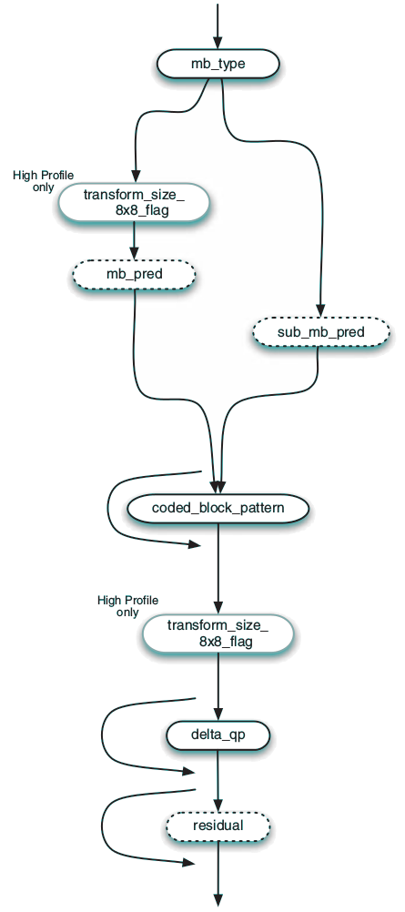

其中：

| 语法元素 | 说明 |
|----------|------|
| mb_type | 指示当前宏块的类型，可以是 I、SI、P、B，并且可以包含额外的信息说明宏块如何编码和预测 |
| transform_size_8x8_flag | 仅仅出现在 High Profile 中，此元素可以出现在两个位置之一，取决于宏块的类型。此元素不会出现在 16x16 的帧内预测宏块 |
| mb_pred | 除了 8x8 分区大小的 P/B 宏块之外，指示帧内或者帧间预测类型 |
| sub_mb_pred | 8x8 分区大小的 P/B 宏块，指示帧内或者帧间预测类型 |
| coded_block_pattern | 除了 16x16 帧内预测块，取值范围 0-47 之间 |
| delta_qp | 指示量化参数的变化 |
| residual_data | 残余块 |

---

## 配置和级别

前文提到过，H.264 支持一组工具——处理编解码的算法和过程。这些工具中有些很基础，任何编解码器实现都需要用到，例如 4x4 的变换算法。另外一些工具是可选的，例如 CABAC/CAVLC 熵编码器。

通过按需选择标准中定义的工具，编码器的实现可以非常的灵活，编码器可以仅仅使用工具的某些子集。

### Profile

H.264 配置（Profile）规范了工具子集的定义。任何 H.264 比特流必须遵从 Profile 规范，使用子集中部分或者全部工具实现编码。一个 Profile 兼容的解码器，必须能够解码使用子集中任何工具编码的 H.264 比特流。

当前最广泛使用的 Profile 是 Main，其包含的工具很好的在压缩性能和计算复杂度之间进行权衡。Constrained Baseline 这个 Profile 是 Main 的一个子集，在低复杂度、低延迟的应用程序中非常流行，例如移动视频电话。

**Main 及其子集**

Extended、Main、Baseline、Constrained Baseline 之间的关系如下图：

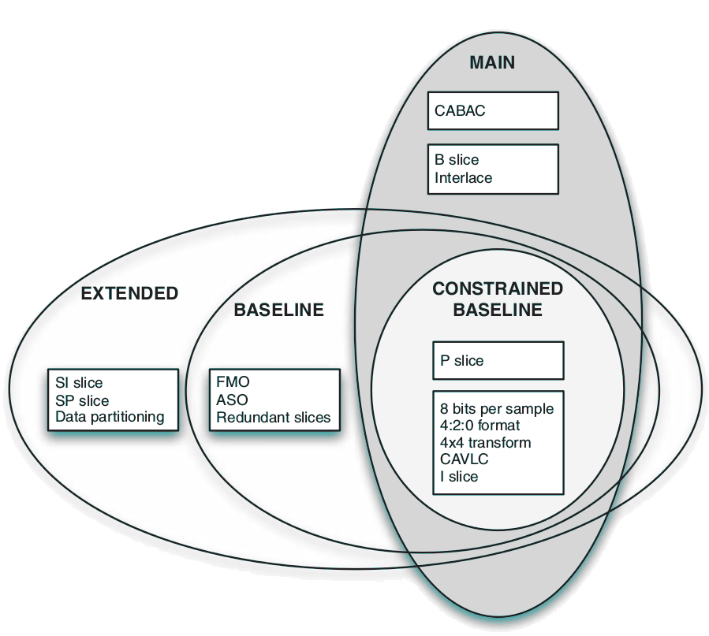

说明如下：

1. **Baseline** 设计用于低复杂度、低延迟应用程序，例如移动视频电话。它支持：
   1. I 帧、P 帧
   2. 允许帧内预测、基于单个参考帧的运动补偿
   3. 使用基本的 4x4 整数变换
   4. 使用 CAVLC 熵编码
   5. 支持 FMO、ASO、冗余切片，这些技术用于提高传输效率
2. 上面提到的最后三个工具并不流行，很多实现不能完整支持。排除了这三者的 Profile 就是 **Constrained Baseline**
3. **Extended** 是 Baseline 的超集，添加了某些提高网络流传输效率的工具
4. **Main** 是 Constrained Baseline 的超集，支持 CABAC 编码和 B 帧

**High**

高配置分为 4 个级别，添加了一些编码工具，满足高质量应用程序（高分辨率、扩展比特深度、高色彩深度）的需要。High 是 Main 的超集，添加特性：

1. 8x8 变换
2. 8x8 帧间预测，这提高了编码性能，特别是高空间分辨率情况下
3. 支持频率相关的量化器权重
4. 为 Cr、Cb 分开设置量化器参数
5. 支持单色差视频（4:0:0 格式）

不同级别 High 和 Main 的关系如下图：

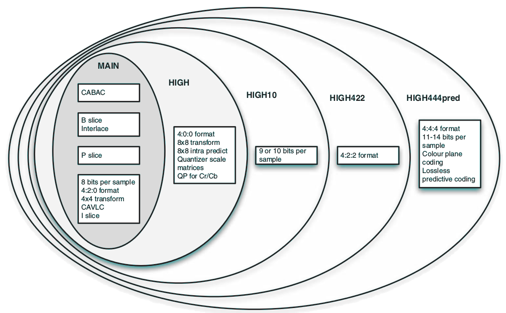

### Level

级别规定了帧尺寸、处理速度（每秒能够解码的帧或者块数量）、工作内存的最大需求量。Profile + Level 共同构成了对解码器的约束条件。

照度分辨率、帧率和级别的关系如下表：

| 分辨率 | 最大帧率 | 级别 |
|--------|---------|------|
| QCIF (176x144) | 15 | 1, 1b |
| QCIF (176x144) | 30 | 1.1 |
| CIF (352x288) | 15 | 1.2 |
| CIF (352x288) | 30 | 1.3, 2 |
| 525 SD (720x480) | 30 | 3 |
| 625 SD (720x576) | 25 | 3 |
| 720p HD (1280x720) | 30 | 3.1 |
| 1080p HD (1920x1080) | 30 | 4, 4.1 |
| 1080p HD (1920x1080) | 60 | 4.2 |
| 4Kx2K (4096x2048) | 30 | 5.1 |

---

## H.264 的传输

### 传输支持工具

鉴于大部分 H.264 应用程序都牵涉到传输、存储比特流。H.264 标准引入了一系列工具和特性，让传输过程更加高效和健壮。

需要注意：大部分商业编解码器没有支持这些特性。

**冗余切片**

如果包含某个帧部分或者全部的重复信息，一个切片可以被标记为冗余的。解码器通常基于非冗余切片重构帧，如果非冗余切片损坏或者丢失，则使用冗余切片。

冗余切片增强了健壮性，代价是更高的比特率。

**任意切片顺序**

任意切片顺序（Arbitrary Slice Order，ASO）允许帧中的切片以任意（非光栅序）的解码顺序排列。可以用于辅助解码错误的隐藏。

**切片组/灵活宏块排序**

灵活宏块排序（Flexible Macroblock Ordering，FMO）让帧中的宏块被分配到一个或者多个切片组（Slice Groups）中。每个切片组包含 1-N 个切片。在切片组内部，宏块以光栅序编码，但是这些宏块在帧中的位置不一定相邻。宏块和切片组的对应关系由宏块分配映射（Macroblock Allocation Map）指定。

FMO 可以增加容错性，因为每个切片组可以独立的解码。如果在使用交错排序的情况下，一个切片或者切片组丢失，其影响可以利用空间插值屏蔽掉。

**SP/SI 切片**

SP 和 SI 切片的用途是：

1. 允许高效的在不同视频流之间切换
2. 允许解码器进行高效的随机访问

例如，同一视频源使用不同码率在网络中传输，解码器可以在正常情况下使用高码率，并且在网络拥塞的时候切换到低码率。

**数据分区切片**

该特性将切片分为三个区：

1. A 分区：包含切片头、每个宏块的头
2. B 分区：包含帧内预测的残余数据、SI 切片宏块
3. C 分区：包含帧间预测的残余数据、SP 切片宏块

每个分区都是独立的 NAL 单元。A、B、C 分区的容错度依次增高，传输时可以应用不同的 QoS。

### RBSP/NALU/Packet 封装

这三者的逐层封装关系如下图：

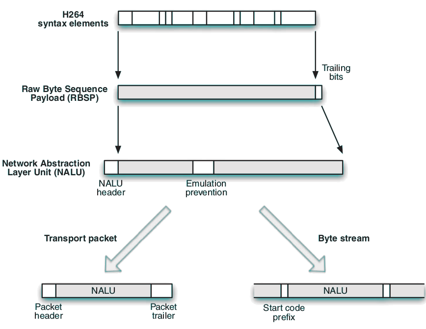

说明：

1. H.264 语法元素被封装为 RBSP，后者被封装为 NALU。由于 H.264 语法元素是可变长度的，为了将 RBSP 字节对齐，尾部可能需要补零
2. RBSP 封装进 NALU 的方式如下：
   1. 添加一字节的 NALU 头
   2. 按序添加模拟预防（Emulation Prevention）字节。为了防止起始码（Start Code）出现在 NALU 内部，每当出现和起始码前缀一致的 3 字节图式时，就插入一个模拟预防字节（二进制 00000011）。解码器能够检测到模拟预防字节，进而知道其相邻的字节不是起始码
3. NALU 可以作为传输协议的载荷。每个 NALU 都前缀一个起始码，起始码为三字节的特殊序列。解码器依赖起始码来判断 NALU 的边界

### RTP 传输

相关文章：[实时通信协议族](https://blog.gmem.cc/realtime-communication-protocols)。

H.264 对传输协议没有任何规定，常用的传输协议是 RTP。RTP 是一种常见的打包协议，一般在 UDP 基础上运行。RTP Payload Formats 为很多标准的音视频编码格式定义了标准。

本节主要讨论 [RFC 6184](https://tools.ietf.org/html/rfc6184)：RTP Payload Format for H.264 Video。

#### RTP 载荷结构

用于 H.264 传输时，RTP 支持三种载荷结构。接收方可以根据载荷的首字节来识别载荷结构。这个字节也作为 RTP 载荷头，某些情况下还作为载荷的组成部分（第一字节）。

此首字节的格式和 NALU 头格式一致。其中 NALU 类型字段指明了载荷结构是哪一种：

1. **单 NALU 包**：载荷中仅仅包含单个 NALU，NALU 类型取值范围在 1-23 之间
2. **聚合包**：载荷中包含多个 NALU。这种载荷结构具有 4 种子类型：
   1. STAP-A：单一时间聚合包，类型 A。NALU 类型为 24
   2. STAP-B：单一时间聚合包，类型 B。NALU 类型为 25
   3. MTAP16：多时间聚合包，使用 16bit 偏移。NALU 类型为 26
   4. MTAP24：多时间聚合包，使用 24bit 偏移。NALU 类型为 27
3. **片断单元**：其中仅仅包含 NALU 的一部分，这种方式允许 NALU 拆分到多个 RTP 包中传输。这种载荷结构具有 2 种子类型：
   1. FU-A。NALU 类型为 28
   2. FU-B。NALU 类型为 29

此首字节的 NRI 字段，00 表示可丢弃，这个语义和 H.264 规范是一致的，解码器不关心任何非零 NRI 的具体值。RFC 6184 对非零值的含义进行了延伸，用于表示传输相对优先级。MANE 可以对高优先级的包进行更强的保护，防止丢包，11 是最高优先级。

#### 打包模式

对 NALU 的打包模式有三种：

1. **单 NALU 模式**，用于遵从 H.241 规范的系统
2. **非交错模式**，用于可能不遵循 H.241 规定的系统。在此模式下，NALU 按解码序传输
3. **交错模式**，用于不需要非常低的端对端延迟的系统。此模式允许 NALU 不按解码序传输

打包模式可以从 SDP 的 `packetization-mode` 字段获得：

1. 0 或者没有该字段对应单 NALU 模式
2. 1 对应非交错模式
3. 2 对应交错模式

打包模式和载荷结构类型的兼容性表格如下：

| 载荷类型 | 单 NALU 模式 | 非交错模式 | 交错模式 |
|----------|------------|----------|---------|
| reserved | 忽略 | 忽略 | 忽略 |
| 单 NALU | 是 | 是 | 否 |
| STAP-A | 否 | 是 | 否 |
| STAP-B | 否 | 否 | 是 |
| MTAP16 | 否 | 否 | 是 |
| MTAP24 | 否 | 否 | 是 |
| FU-A | 否 | 是 | 是 |
| FU-B | 否 | 否 | 是 |

#### 单 NALU 包

此类型的载荷仅仅包含一个 NALU，并且，NALU 头即为 RTP 载荷头：

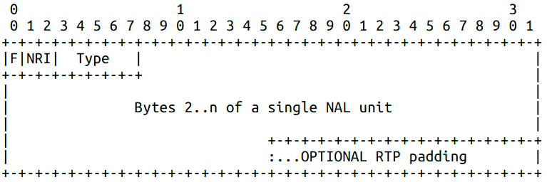

NALU 由 NALU 头、NALU 载荷组成，前缀的开始码（`00 00 00 01` 或者 `00 00 01`）被清除后再打包。

#### 聚合包

引入聚合包的原因是不同网络的 MTU 不同：

1. 有线 IP 网络的 MTU 主要受限于以太网 MTU，大概 1500 字节左右
2. IP/非 IP 无线网络的 MTU 受限的传输单元较小，大概 254 字节或者更少

由于 RTP 通常基于 UDP，UDP 包的尺寸则受限于 MTU。因此聚合包能够最高效率的使用 MTU。

聚合包分为两大类，分别为单时间（STAP）、多时间（MTAP）聚合包。前者的 NALU 时间只有一个值。后者包含的 NALU 可能对应不同的时间。聚合包中的每个 NALU 都基于聚合单元打包：

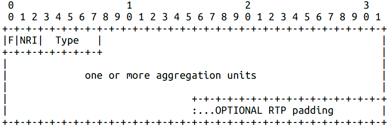

STAP 和 MTAP 共享以下打包规则：

1. RTP 时间戳必须设置为包内所有 NALU 的最早的那个 NALU-time
2. NALU 类型必须正确设置
3. 如果所有 NALU 的 F 位均为 0，F 位必须清零
4. NRI 必须设置为所有 NALU 中 NRI 的最大值

STAP-A 载荷结构如下：

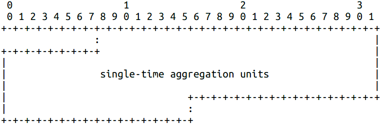

STAP-B 载荷结构如下：

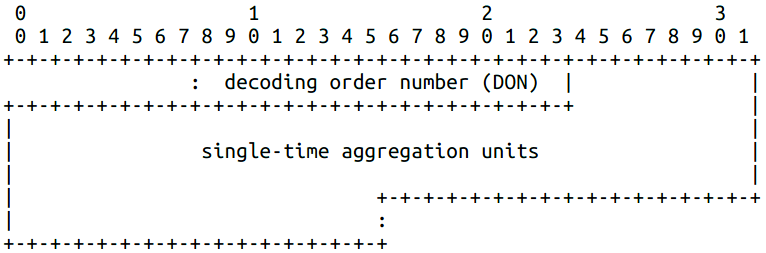

两者的主要区别是 STAP-B 有一个 DON 字段，它以传输序指定了第一个 NALU 的位置，后续 NALU 的 `DON = (第一个NLU的DON + 1) % 65536`。

STAP-A 包含 1-N 个聚合单元，聚合单元的结构如下：

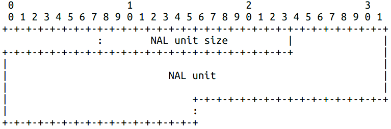

STAP-A、STAP-B 的聚合单元的头部是 16bit 的网络序无符号整数，指示后续 NALU 的长度（字节）。聚合单元在 RTP 包内是字节对齐的。

MTAP 载荷由一个 16bit 网络序无符号整数的解码序号基数（Decoding Order Number Base）和 1-N 个聚合单元组成。DONB 的值为当前包中以 NALU 解码序计第一个 NALU 的 DON 值。

MTAP 的聚合单元 MTAP16 的结构如下：

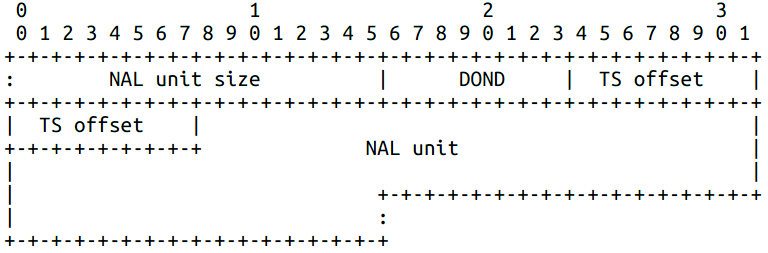

MTAP24 的结构如下：

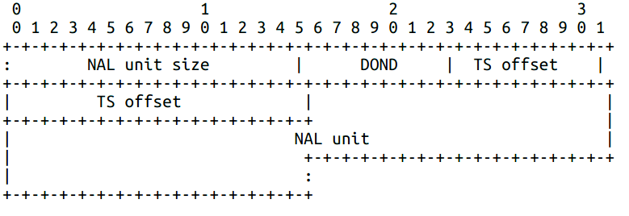

两种聚合单元都有如下字段：

1. 16bit 的 NALU 大小
2. 8bit 的解码序号差异（Decoding Order Number Difference，DOND）
3. Nbit 的时间戳偏移，对于 MTAP16 N=16，对于 MTAP24 N=24

#### 分段包

当 NALU 长度超过 MTU 后，可以使用分段包，让一个 NALU 分散在多个 RTP 包中。FU 有两个子类，其中 FU-A 的结构如下：

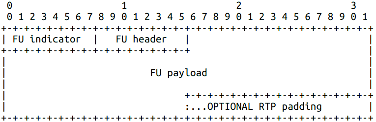

FU-B 必须配合交错打包模式使用。其结构如下：

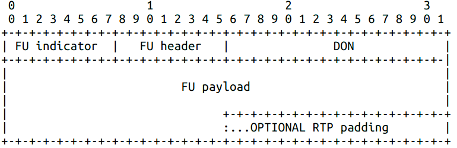

FU indicator 结构与 NALU 头一致，NALU 类型取值 28 或 29。

FU header 结构如下：

```
+---------------+
|0|1|2|3|4|5|6|7|
+-+-+-+-+-+-+-+-+
|S|E|R| Type    |
+---------------+
```

其中：

1. S：1bit，如果设置此位，表示此 FU 是第一个 NALU 分片
2. E：1bit，如果设置此位，表示此 FU 是最后一个 NALU 分片
3. R：1bit，取值 0
4. Type：NALU 载荷类型

---

## x264

x264 是 VideoLAN 开源的 H.264 编码器，特性包括：

1. 8x8 和 4x4 自适应空域变换
2. 自适应 B 帧置入
3. B 帧作为参考帧
4. 任意帧顺序
5. 支持 CAVLC、CABAC 熵编码
6. 自定义量化矩阵
7. 帧内预测：16x16, 8x8, 4x4 等任意宏块大小
8. 帧间预测：所有分区大小，从 16x16 到 4x4
9. 帧间双向预测：分区大小支持从 16x16 到 8x8
10. 交错扫描——宏块级帧场自适应（Macro-block Adaptive Field Frame，MBAFF）
11. 多参考帧
12. 速率控制：常量量化器、常量质量、单步/多步 ABR、可选 VBV
13. 场景切换（Scenecut）检测
14. B 帧中的空域/时域直接模式，自适应模式选择
15. 使用多个 CPU 并行编码
16. 预测性无损模式

### 构建

```bash
git clone http://git.videolan.org/git/x264.git

cd x264

./configure --enable-debug --enable-static --enable-shared --prefix=/home/alex/CPP/lib/x264

make && make install && make clean
```

### HelloWorld

下面是一个编码 QCIF 尺寸的 YUV 序列的示例。CMake 项目配置：

```cmake
cmake_minimum_required(VERSION 3.6)

project(x264 C)

set(X264_HOME /home/alex/CPP/lib/x264)

include_directories(${X264_HOME}/include)

set(SRC_ENCODER encoder.c)

add_executable(encoder ${SRC_ENCODER})

target_link_libraries(
    encoder
    ${X264_HOME}/lib/libx264.so
)
```

编码器源码：

```c
#include <stdint.h>
#include <stdio.h>
#include <x264.h>

int main( int argc, char **argv ) {
    int width = 176, height = 144;    //QCIF
    x264_param_t param;
    x264_picture_t pic;
    x264_picture_t pic_out;
    x264_t *h;
    int i_frame = 0;
    int i_frame_size;
    x264_nal_t *nal;
    int i_nal;

    /* 应用编码器预设 */
    if ( x264_param_default_preset( &param, "fast", "zerolatency" ) < 0 ) goto fail;

    /* 在预设的基础上定制 */
    param.i_csp = X264_CSP_I420;      // 色彩空间：yuv 4:2:0 planar（三个数组）
    param.i_width = width;            // 帧尺寸
    param.i_height = height;
    param.b_vfr_input = 0;            // 可变帧率的输入：否
    param.b_repeat_headers = 1;       // 在每个I帧之前插入SPS/PPS
    param.b_annexb = 1;               // 在NALU之前插入4字节起始码

    /* 设置Profile，x264仅仅提供了Baseline选项，但是由于不支持某些特性，编码实际使用的是Constrained Baseline */
    if ( x264_param_apply_profile( &param, "baseline" ) < 0 ) goto fail;

    if ( x264_picture_alloc( &pic, param.i_csp, param.i_width, param.i_height ) < 0 ) goto fail;

#undef fail
#define fail fail2

    // 创建句柄
    h = x264_encoder_open( &param );
    if ( !h ) goto fail;

#undef fail
#define fail fail3

    int luma_size = width * height;    // 单帧包含的明度元素个数
    int chroma_size = luma_size / 4;   // 单帧包括的色差元素个数

    /* 循环编码所有帧 */
    FILE *in = fopen( "/home/alex/CPP/projects/clion/x264/qcif.yuv", "r" );
    FILE *out = fopen( "/home/alex/CPP/projects/clion/x264/qcif.h264", "w" );

    for ( ;; i_frame++ ) {
        /* 读取输入帧 */
        if ( fread( pic.img.plane[ 0 ], 1, luma_size, in ) != luma_size )
            break;
        if ( fread( pic.img.plane[ 1 ], 1, chroma_size, in ) != chroma_size )
            break;
        if ( fread( pic.img.plane[ 2 ], 1, chroma_size, in ) != chroma_size )
            break;

        pic.i_pts = i_frame;  // PTS，展现时间戳

        // 编码当前帧，nal是编码后的第一个NALU的指针，i_nal是NALU个数。返回编码后NALU的总字节数
        i_frame_size = x264_encoder_encode( h, &nal, &i_nal, &pic, &pic_out );

        if ( i_frame_size < 0 ) goto fail;
        // 将NALU的载荷写入到输出流
        else if ( !fwrite( nal->p_payload, i_frame_size, 1, out )) goto fail;
    }

    /* 写出延迟帧 */
    while ( x264_encoder_delayed_frames( h )) {
        i_frame_size = x264_encoder_encode( h, &nal, &i_nal, NULL, &pic_out );
        if ( i_frame_size < 0 ) goto fail;
        else if ( i_frame_size ) if ( !fwrite( nal->p_payload, i_frame_size, 1, out )) goto fail;
    }

    // 关闭编码器
    x264_encoder_close( h );

    // 清理内存
    x264_picture_clean( &pic );

    return 0;

#undef fail
    fail3:
    x264_encoder_close( h );
    fail2:
    x264_picture_clean( &pic );
    fail:
    return -1;
}
```

编码后原始的 5.7MB 的 YUV 序列产生了 88.3KB 的 H.264 NALU 序列，缩小了接近 80 倍。以 HEX 打开输出文件：

```
0000 0001 6742 c00b db0b 13a1 0000 0300
0100 0003 0032 8f14 2ae0 0000 0001 68ca
83cb 2000 0001 0605 ffff 66dc 45e9 bde6
d948 b796 2cd8 20d9 23ee ef78 3236 3420 ...
```

可以看到：

1. NALU 前缀了 4 字节的起始码 HEX：`0000 0001`
2. 第 1 个 NALU 头为 BIN：`01100111`，此单元是一个 SPS
3. 第 2 个 NALU 是 PPS
4. 第 3 个 NALU 是一个典型切片
