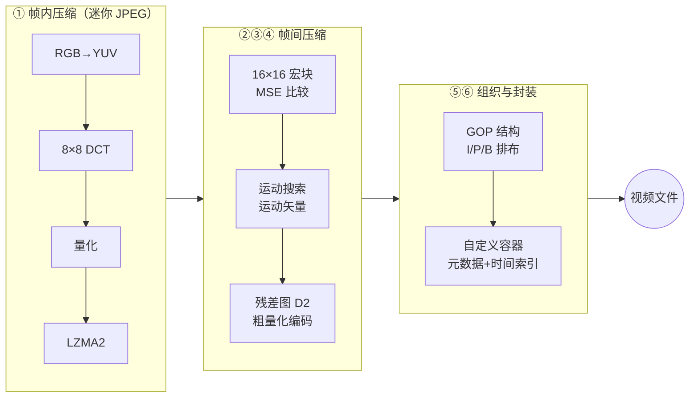

# 视频编码原理专题 — 从零构建玩具编码器

> 缘起：skywind（韦易笑）的文章《视频编码原理简介》（https://skywind.me/blog/archives/1566 ）。
> 文章用七个循序渐进的步骤，教你从零写出一个能跑的玩具视频编码器。
> 本专题解读这篇文章、评估动手实现的难度、并与 WorkLabs 自身管线对照。
> 成文日期：2026-06-12。

---

## 玩具编码器全貌一图流

一句话概括原理：**I 帧是"完整照片"（帧内压缩），P 帧是"上一张照片 + 一张挪动说明书 + 一张补丁图"（帧间压缩），GOP 把它们串成串，容器再给整串贴上标签装进盒子。**

---

## 文档清单

| # | 文档 | 内容 |
|---|---|---|
| 01 | [原文解读-七步构建玩具编码器](./01-原文解读-七步构建玩具编码器.md) | 逐步拆解原文七个步骤：每步做什么、为什么、关键数字与公式 |
| 02 | [实现难度评估与避坑](./02-实现难度评估与避坑.md) | 各步骤难度打分与工时预估、原文留的"作弊通道"、动手必踩的坑（闭环参考/drift 等）、推荐实现路线 |
| 03 | [与WorkLabs管线对照](./03-与WorkLabs管线对照.md) | 玩具编码器的每个概念在 WorkLabs 真实管线（WLRecorder / seek / 时间戳）里的对应物 |

---

## 核心结论速览

- **做出能跑的玩具编码器：中等难度**，有 C/ObjC 功底约 1~2 周业余时间（建议先用 Python + numpy 验证原理，再考虑 C 重写）。
- 原文在最难的地方留了作弊通道：**用 LZMA2 现成库代替熵编码**（真实编码器的 CABAC 是最难啃的部分之一）、**暴力全搜索代替快速运动估计**、**自定义容器代替标准 MP4**。
- 唯一的概念陷阱是**闭环参考**：P 帧必须参考"解码端将看到的有损重建帧"，而不是原始帧，否则误差漂移（drift）会让画面几十帧后花掉。
- 前六步做完约为 MPEG-1 时代水平；第七步"优化"是真实编解码器 99% 工作量所在（码率控制、快速搜索、SIMD……），**不建议深入，做到第六步收工**。

## 相关资料

- 原文：[视频编码原理简介 — skywind](https://skywind.me/blog/archives/1566)
- 本仓库既有笔记：[H.264 学习笔记](../h264/h264.md)、[YUV](../h264/YUV.md)
