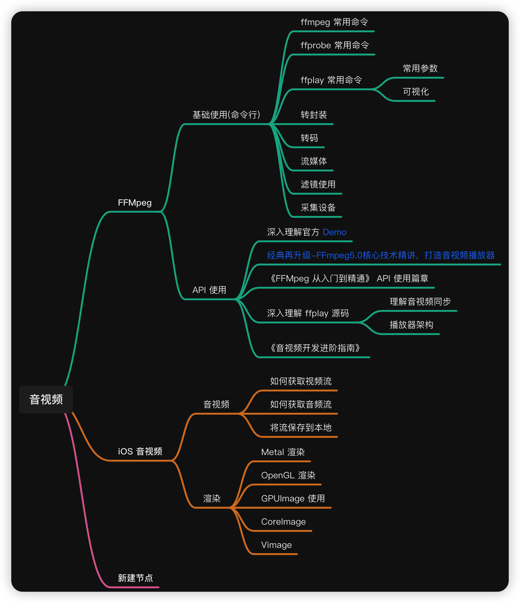

## chrome 源码
- [Chrome audio_encoder.cc](https://source.chromium.org/chromium/chromium/src/+/main:media/cast/encoding/audio_encoder.cc)

## ijkplayer 相关
- [ijkplayer中遇到的问题汇总](https://juejin.cn/post/6844903694845083655)
- [ijkplayer丢帧的处理方案](https://www.jianshu.com/p/ecf51ee32589)
- [ijkplay播放直播流延时控制小结](https://www.jianshu.com/p/d6a5d8756eec)
- [开源播放器 ijkplayer (二) ：ijkplayer倍速变调问题解决方案](https://www.cnblogs.com/renhui/p/6510872.html)
- [ijkplayer直播播放器使用经验之谈——卡顿优化和秒开实现](https://blog.csdn.net/cmshao/article/details/80149176)
- [Ijkplayer、ExoPlayer、VLC播放器综合比较](https://juejin.cn/post/6956604648476622856)

## 音视频面试涨知识
- [音视频面试涨知识（一）](https://juejin.cn/post/7174374017980661791)

## Web 性能权威指南
- [High Performance Browser Networking (Web性能权威指南)](https://hpbn.co/)

## 文章收集
- [FLV：不许动手动脚 - Android 原创](https://blog.csdn.net/Tomascn/article/details/103602901)（本文将着重分析 FLV 容器的语法语义，结合我遇到的几个安卓平台的 FLV 加密进行分析，同时对这几个样本做解密还原。）
- [StreamEye](http://www.streameye.com/)

- [音视频编解码自学篇 - 知乎](https://www.zhihu.com/column/c_1629631086241153024)（从零开始敲一个播放器）
- [音视频技术 - 知乎](https://www.zhihu.com/column/avtec)（音视频技术从0到1，详细解析了 ffplay 中的队列以及同步）
- [殷文杰 - CSDN](https://yinwenjie.blog.csdn.net/?type=blog)
- [缥缈峰 - 知乎](https://www.zhihu.com/people/liu-sheng-71-36/posts)（天津大学信号硕士，音视频技术专家，程序员，压缩播放3D渲染）

## 音视频编辑器
- [Cabbage 音视频编辑器](https://github.com/VideoFlint/Cabbage)
- [iOS 视频编辑核心架构](https://github.com/VideoFlint/Cabbage/wiki/%E4%B8%AD%E6%96%87%E8%AF%B4%E6%98%8E)（详细描述了音视频编辑的整个过程）
- [AVFoundation Programming Guide](https://developer.apple.com/library/archive/documentation/AudioVideo/Conceptual/AVFoundationPG/Articles/00_Introduction.html)
- [WWDC 2013 Session 612: Advanced Editing with AV Foundation](https://developer.apple.com/videos/play/wwdc2013/612/)
- [WWDC 2012 Session 517: Real-Time Media Effects and Processing during Playback](https://developer.apple.com/videos/play/wwdc2012/517/)
- [Apple AVFoundation 文档](https://developer.apple.com/av-foundation/)

**推荐书籍**
- [《Learning AV Foundation》](https://www.amazon.com/Learning-Foundation-Hands-Mastering-Framework/dp/0321961803)
- 中文《AVFoundation 开发秘籍》

**推荐应用**
- [猫饼 (Cabbage)](https://github.com/VideoFlint/Cabbage) - 猫饼 app 已经验证了这套框架的可行性，并且填了很多坑
- [Videoleap](https://www.videoleap.com/) - 目前看到视频编辑功能最完善的移动端 app

- [短视频这么火，微视的特效是怎么做的？](https://www.infoq.cn/article/t0kvcqyhtehfvty5eyql)（详细讲述了特效的原理和难点）
- [视频清晰度优化指南 | 得物技术](https://mp.weixin.qq.com/s/YHfAjr_MG_N7nGLtrLEFEw)

**参考文章**
- [VMAF 开源项目](https://github.com/Netflix/vmaf)

## 视频基础总结


- [零基础，史上最通俗视频编码技术入门](https://segmentfault.com/a/1190000023362309)（讲述了相关的知识点）
- [实时音视频技术基础知识全面盘点](https://segmentfault.com/a/1190000023362309)
- [ffplay 播放器源代码分析](https://cloud.tencent.com/developer/article/1004559)
- [H264 编码分析](https://www.yuque.com/keith-an9fr/aab7xp/vng2pb)
- [视频和视频帧：H264编码格式整理](https://zhuanlan.zhihu.com/p/71928833)

**VMAF 相关**
- [揭秘 VMAF 视频质量评测标准](https://xie.infoq.cn/article/26aaf2ab83f56192a65ba22ea)
- [Netflix VMAF 视频质量评估工具概述](https://zhuanlan.zhihu.com/p/94223056)
- [B帧对视频清晰度/码率的影响](https://blog.csdn.net/matrix_laboratory/article/details/82726897)（VIP）
- [B帧对视频清晰度/码率的影响（Free）](https://blog.csdn.net/TyearLin/article/details/130882363)
- [H264 vs H265](https://www.cnblogs.com/wujianming-110117/p/12640533.html)
- [超分开源项目 Real-ESRGAN](https://github.com/xinntao/Real-ESRGAN)

## 音频相关

**基础**
- [iOS 音频采集、转换和播放](https://xie.infoq.cn/article/b8c110b4c6d696b05a7c2f22c)
- [IOS 端音频的采集与播放 - 豆瓣开源播放器](https://xie.infoq.cn/article/b8c110b4c6d696b05a7c2f22c)
- [DOUAudioStreamer - 豆瓣开源的播放器](https://github.com/douban/DOUAudioStreamer)
- [Configuring an Audio Session](https://developer.apple.com/library/archive/documentation/Audio/Conceptual/AudioSessionProgrammingGuide/AudioSessionBasics/AudioSessionBasics.html)
- [WebRTC 系列之音频会话管理](https://blog.csdn.net/netease_im/article/details/113875029)

**音频解码与处理**
- [音频解码 Audio Converter](https://www.jianshu.com/p/25188072a11a)
- [音频解码 Audio Converter](https://xiaodongxie1024.github.io/2019/05/19/20190519_AudioDecoder/)
- [iOS 音频-AVAudioSession](https://www.jianshu.com/p/fb0e5fb71b3c)
- [在线教室 iOS 端声音问题综合解决方案](https://mp.weixin.qq.com/s?__biz=MzI1MzYzMjE0MQ==&mid=2247488032&idx=1&sn=a8e8948fcd043cd0124e8bfe26aa0784)
- [Chrome audio_encoder](https://source.chromium.org/chromium/chromium/src/+/main:media/cast/encoding/audio_encoder.cc)

**AudioUnit**
- [iOS 音频-audioUnit 总结](https://www.jianshu.com/p/f859640fcb33)
- [AudioToolBox 音频硬编码 AAC](https://juejin.cn/post/7069395297239040037)
- [AudioSession Programming Guide](https://developer.apple.com/library/archive/documentation/Audio/Conceptual/AudioSessionProgrammingGuide/Introduction/Introduction.html)
- [Media Playback Programming Guide](https://developer.apple.com/library/archive/documentation/AudioVideo/Conceptual/MediaPlaybackGuide/Contents/Resources/en.lproj/Introduction/Introduction.html)
- [Multimedia Programming Guide](https://developer.apple.com/library/archive/documentation/AudioVideo/Conceptual/MultimediaPG/UsingAudio/UsingAudio.html)（已过时）
- [AVFoundation Document](https://developer.apple.com/documentation/avfoundation?language=objc)
- [AVFoundation Programming Guides and Reference](https://developer.apple.com/av-foundation/)
- [Apple Developer Documentation](https://developer.apple.com/documentation?language=objc)

**AVAudioEngine**
- [实现唱吧清唱功能的理解](https://oliverqueen.cn/2018-06-19-MusicAbout/)
- [iOS 混音之 AVAudioEngine 详解](https://www.rongcloud.cn/blog/?p=4222)
- [iOS Audio hand by hand: 变声，混响，语音合成 TTS](https://juejin.cn/post/6844903957144272903)
- [Chrome 中 AVAudioEngine](https://source.chromium.org/chromium/chromium/src/+/main:third_party/tflite_support/src/tensorflow_lite_support/ios/task/audio/core/audio_record/sources/TFLAudioRecord.m)
- [AVAudioEngine Tutorial for iOS: Getting Started](https://www.kodeco.com/21672160-avaudioengine-tutorial-for-ios-getting-started)
- [一步一步教你实现iOS音频频谱动画（一）](https://juejin.cn/post/6844903784011792391)
- [一步一步教你实现iOS音频频谱动画（二）](https://juejin.cn/post/6844903791670591495)

**AVFoundation 学习**
- [iOSPrinciple_AVFoundation](https://github.com/ReverseScale/iOSPrinciple_AVFoundation)（推荐《音视频开发进阶指南 基于Android与iOS平台的实践》）
- [AVFoundation 框架解析](https://developer.aliyun.com/article/663875)

## AudioUnit 研究

- [AudioQueue 知识](https://www.jianshu.com/p/ed6d0862bd0d)
- [（强烈推荐）移动端音视频从零到上手](https://www.jianshu.com/p/228b668361bd)

## 待解决问题

处理当 `outData` 不足以容纳重采样出来的数据时，会丢失数据或者 crash：

```objc
uint8_t **inData = inputFrame->extended_data ? inputFrame->extended_data : inputFrame->data;
uint8_t *outData[AV_NUM_DATA_POINTERS] = {0};
outData[0] = (uint8_t *)outBuffer->mAudioData;
///TODO: 处理当 outData 不足以容纳重采样出来的数据时，会丢失数据或者crash
// 执行重采样
int samplesConverted = swr_convert(_swrContext,
                                   outData,
                                   availableOutFrames,
                                   (const uint8_t **)inData,
                                   inputFrame->nb_samples);
```

当 `availableOutFrames` 不足以容纳重采样输出时：
- 数据丢失：超出缓冲区的样本会被丢弃
- 音频卡顿：连续丢帧会导致播放不连贯
- 同步问题：PTS 时间戳计算会出错

## VideoToolbox 搜集

- [iOS VideoToolbox 硬编指南(VideoToolbox避坑指南)](https://www.nxrte.com/jishu/4368.html)
- [音视频压缩：H264码流层次结构和NALU详解](https://cloud.tencent.com/developer/article/1746993)
- [使用 VideoToolbox 探索低延迟视频编码 | WWDC 演讲实录](https://www.cnblogs.com/wangyiyunxin/p/14923220.html)
- [WebRTC Native 源码导读（九）：iOS 视频硬编码实现分析](https://blog.piasy.com/2018/05/04/WebRTC-iOS-HW-Encode-Video/index.html)
- [Piasy - WebRTC 系列博客](https://blog.piasy.com/index.html)
- [loyinglin - LearnVideoToolBox 音视频 Demo](https://github.com/loyinglin/LearnVideoToolBox/tree/master)

## 讨论

如果研究生阶段方向是音视频编解码，本科期间应该打好哪些基础？

> 作者：诚明飞
> 来源：知乎
> 著作权归作者所有。商业请联系作者获得授权，非商业请注明出处。
> [原文链接](https://www.zhihu.com/question/27005982/answer/51158064)

在视频编解码领域从事工作几年，还没有仔细总结一路怎么走来。趁知友提的问题，再回头看看，稍有心得体会，希望对你有帮助。
视频编解码所从事的工作大致分成 3 类：编解码算法研究、编解码标准实现、编解码应用开发。

1. **编解码算法研究**主要指制定标准相关工作，参与标准组织，制定新一代标准，比如 HEVC、AVS 等。该方向研究性较强，需要扎实的基础学科功底，如果在学校期间能够很好掌握线性代数、矩阵论、信息论、通信原理、数字信号处理、统计信号处理等课程，对该方面的发展帮助较大。目前国内参与标准制定的单位主要是高等院校、研究机构、以及一些大企业（海思、三星、联发科等）。

2. **编解码标准实现**主要在不同的平台实现符合标准的编码组件和解码组件。该方向要求熟悉标准文档、熟练掌握 C 语言编程、熟悉平台指令集优化、熟悉嵌入式开发、能够设计编码 3 大算法（模式选择、码率控制、运动搜索）等。国内设立这种岗位的公司很多，视频监控行业、视频会议行业、互联网行业、机器视觉行业等与多媒体相关的企业都会有。当然，大的公司分工细，会设定专门做编解码组件的岗位，专业化程度；小公司则要求全面，做事杂些。

3. **编解码应用开发**主要是在编解码组件的基础上，进行系统级开发，包括系统封装层、多媒体软件、传输协议、QoS 等。该方向所从事的工作更编解码标准中的技术没有关系，主要要求软件集成能力、应用开发能力等。

从后往前看，回到"如何打好基础"的问题上来，有几个建议步骤：

1. 学好线性代数、矩阵论、信息论、通信原理、数字信号处理、统计信号处理等课程；
2. 专业方面熟悉一门标准，建议学 H.264。相比 H.265 来说，H.264 更加成熟，材料多。推荐看 Iain E G Richardon 写的入门教程"H.264 and MPEG-4 Video Compression"，该书浅显易懂，思路清晰。随后，需要看 H.264 标准文档以了解更多细节，结合参考软件 JM 的解码部分一起看；
3. 围绕预测编码、变换编码、熵编码，看一些学术文章，弄清楚标准中各技术背后的原理；
4. 调试开源代码，该步骤可以与前面并行。多去玩玩 ffmpeg 等、x264 等，提高编程能力，主要是 C 语言开发能力。试着去优化一、两个独立的模块，优化的平台选 X86、ARM 都可以。
5. 试着用开源代码实现一些应用 demo，这方面可以参看 @张晖 的回答。

**建议往 2、3 方向发展，纯的算法研究以后路子较窄。**


## ffplay

- [ffplay packet queue 分析](https://zhuanlan.zhihu.com/p/43295650)
- [ffplay源码分析2-数据结构(环形缓冲器)](https://cloud.tencent.com/developer/article/1409508)
- [ffplay 源码分析(结构体有详细的参数说明)](https://www.cnblogs.com/juju-go/p/16489044.html)
- [音视频开发技术(博客 分析 FFMpeg 和 FFplay 相关的结构体和源码)](https://cloud.tencent.com/developer/column/75651)
- [ffplay 视频播放原理分析](https://xie.infoq.cn/article/6e2c7e13db8d1d3f68db70ce0)
- [txp玩Linux(涉及音视频 ffplay、基础知识、心得和源码分析)](https://cloud.tencent.com/developer/column/94726)
- [音视频开发中文网(论坛)](https://avmedia.0voice.com/?id=287)
- [FFplay源码分析-nobuffer](https://www.bilibili.com/read/cv15950768/)
- [ffplay源码分析6-音频重采样](https://www.cnblogs.com/leisure_chn/p/10312713.html)
- [深入理解FFmpeg音视频编程：处理封装、解码、播放](https://developer.aliyun.com/article/1467268)
- [ffplay.c源码分析与理解](https://github.com/xiaerfei/ffplay-explained)
- [音视频开发之音频基础知识！(介绍了 AAC 的格式)](https://cloud.tencent.com/developer/article/2215365)
- [AAC音频基础和ADTS打包方案详解](https://cloud.tencent.com/developer/article/1746985)
- [ffplay.c源码分析【2】](https://www.cnblogs.com/juju-go/p/16500356.html)
- [播放器技术分享（1）：架构设计](https://blog.51cto.com/ticktick/2324928)
- [FFmpeg视频播放的内存管理](https://juejin.cn/post/6844903698515099656)
- [AVPacket 的使用记录(初始化、引用、解引用、释放)](https://blog.csdn.net/ihmhm12345/article/details/115507698)
- [从零开始敲一个播放器（002）媒体流解析流程](https://zhuanlan.zhihu.com/p/622260387)
- [FFmpeg数据结构：AVPacket解析](https://www.cnblogs.com/wangguchangqing/p/5790705.html)


## WebRTC 搜集
- [B 站 WebRTC 测试实践](https://www.nxrte.com/jishu/webrtc/40585.html)
- [WebRTC 源码分析（8）- 拥塞控制（上）- 码率预估](https://www.cnblogs.com/ishen/p/15249678.html)
- [WebRTC 源码分析汇总](https://www.cnblogs.com/ishen/category/1619028.html)
- [WebRTC Native 源码导读](https://blog.piasy.com/tags/index.html#WebRTC)
- [WebRTC 源码分析（博主 list）](https://chensongpoixs.github.io/tags/?tag=WebRTC#/)
- [WebRTC 源码分析（4）- 视频发送流程](https://www.cnblogs.com/ishen/p/15154959.html)
- [WebRTC 源码分析起步](https://blog.csdn.net/ababab12345/article/details/119834031)
- [WebRTC TURN 协议源码分析](https://justme0.com/archive/turn.html)
- [WebRTC 的音视频如何同步](https://www.fanyamin.com/blog/webrtc-de-yin-shi-pin-ru-he-tong-bu.html)
- [WebRTC Native 源码导读（九）：iOS 视频硬编码实现分析](https://blog.piasy.com/2018/05/04/WebRTC-iOS-HW-Encode-Video/index.html)

## AV1
- [关于苹果 AV1 支持您需要了解的一切](https://www.nxrte.com/jishu/42456.html)

## H264/编码
- [音视频问题汇总 – H264 标准中 u 和 ue 的差别](https://www.nxrte.com/jishu/yinshipin/32270.html)
- [自己动手写 H.264 解码器](https://www.zzsin.com/catalog/write_avc_decoder.html)
- [实现一个 H264 编码器前期准备](https://www.nxrte.com/jishu/36031.html)
- [如何在 H264 码流的 SPS 中获取宽和高信息？](https://www.nxrte.com/jishu/14432.html)
- [H.264 学习笔记](https://www.nxrte.com/jishu/2422.html)
- [H.264 码流结构和编解码过程](https://www.nxrte.com/jishu/21000.html)
- [H264 的编码帧类型（IDR 帧、I 帧、P 帧或 B 帧）和帧结构](https://www.nxrte.com/jishu/21382.html)
- [音视频压缩：H264 码流层次结构和 NALU 详解](https://cloud.tencent.com/developer/article/1746993)

## SEI
- [如何理解和使用 SEI（媒体补充增强信息）？](https://www.nxrte.com/jishu/23419.html)
- [SEI 补充增强信息（全网最全 SEI 指南）](https://www.nxrte.com/jishu/10446.html)
- [什么是 H.264 SEI？H.264 SEI 的编码和获取](https://www.nxrte.com/jishu/44484.html)

## 视频技术
- [YUV 转 RGB 有哪些重要的点](https://juejin.cn/post/7033237038446936101)
- [如何开发出一款仿映客直播 APP 项目实践篇 - 原理篇](https://www.jianshu.com/p/b2674fc2ac35)
- [视频直播的技术原理和实现思路方案整理](https://github.com/f2e-journey/xueqianban/issues/61)

## 图形渲染 / Shader
- [构建和使用自己的 Shader 炫酷特效](https://www.zzsin.com/shaderplus.html)

## 博客搜集
- [掘金 - blackstar666](https://juejin.cn/user/255551407668360/posts)
- [博客园 - blackstar666](https://home.cnblogs.com/u/smartNeo/)
- [blackstar666 博客园 - 音频](https://www.cnblogs.com/smartNeo/category/1977258.html)


## 音频解码与处理
- [音频之声道那些事 -- PCM 声道](https://www.cnblogs.com/smartNeo/p/14789302.html)
- [视音频数据处理入门：PCM 音频采样数据处理](https://blog.csdn.net/leixiaohua1020/article/details/50534316)
- [实时音视频的那些事儿（一）](https://blog.csdn.net/weixin_42684521/article/details/129388459)
- [(强烈推荐) 移动端音视频从零到上手](https://www.jianshu.com/p/228b668361bd)

### 音频编码
- [音频编码 Audio Converter](https://xiaodongxie1024.github.io/2019/05/15/20190515_audioEncoder/)
- [iOS 利用 FFmpeg 解码音频数据并播放](https://xiaodongxie1024.github.io/2019/06/30/20190630_ios_audio_decoder/)
- [AudioQueue 实现音频流实时播放实战](https://xiaodongxie1024.github.io/2019/06/29/20190629_ios_audioqueue_player/)
- [iOS 利用 FFmpeg parse 音视频数据流](https://xiaodongxie1024.github.io/2019/06/11/20190611_ios_parseavdata_ffmpeg/)
- [iOS 采集录制音视频 API 选择推荐（几种录音 API）](https://xiaodongxie1024.github.io/2019/05/11/20190511_AudioSelect/)
- [Audio Unit 采集音频实战](https://xiaodongxie1024.github.io/2019/05/11/20190511_AudioUnit_capture/)
- [Audio File 音频文件录制（AudioQueue, AudioUnit, AudioConverter 音频来源）](https://xiaodongxie1024.github.io/2019/05/11/20190511_audioFile_record/)
- [Audio Queue 多种格式支持采集音频实战](https://xiaodongxie1024.github.io/2019/05/11/20190511_AudioQueue_capture/)
- [iOS 端音频的采集与播放](https://xie.infoq.cn/article/b8c110b4c6d696b05a7c2f22c)


### AVAudioEngine
- [iOS 音频之 Audio Unit & AudioEngine（介绍了基本的使用方法）](https://github.com/zhenshub/WorkNote/blob/master/%E9%9F%B3%E8%A7%86%E9%A2%91%E6%8A%80%E6%9C%AF/iOS%E9%9F%B3%E9%A2%91%E4%B9%8BAudioUnit%26AudioEngine.md)
- [iOS AVAudioEngine 使用教程](https://blog.csdn.net/Philm_iOS/article/details/81664556)
- [AVFoundation 框架解析（二十七）—— 基于 AVAudioEngine 的简单使用示例](https://www.jianshu.com/p/56ceba2f8a30)
- [【融云分析】iOS 混音之 AVAudioEngine 详解](https://zhuanlan.zhihu.com/p/252852148)
- [Audio API Overview](https://www.objc.io/issues/24-audio/audio-api-overview/)
- [iOS Audio : 变声，混响，语音合成 TTS, AVAudioEngine](https://zhuanlan.zhihu.com/p/85136922)
- [AVAudioEngine Tutorial for iOS: Getting Started](https://www.kodeco.com/21672160-avaudioengine-tutorial-for-ios-getting-started)

### 音频播放
- [iOS 音频播放（三）：AudioFileStream](https://msching.github.io/blog/2014/07/09/audio-in-ios-3/)
- [AudioQueue 知识](https://www.jianshu.com/p/ed6d0862bd0d)
- [AudioStreamer](https://github.com/mattgallagher/AudioStreamer)
- [WebRTC 系列之音频会话管理](https://blog.csdn.net/netease_im/article/details/113875029)
- [iOS 音频 - AVAudioSession](https://www.jianshu.com/p/fb0e5fb71b3c)
- [AVAudioSession Programming Guide](https://maxwellqi.github.io/ios-avaudiosession-guide/)
- [AVAudioSession-Category 各种姿势](https://www.sunyazhou.com/2018/01/AVAudioSessionCategory/)

### 音频处理
- [在线教室 iOS 端声音问题综合解决方案](https://mp.weixin.qq.com/s?__biz=MzI1MzYzMjE0MQ==&mid=2247488032&idx=1&sn=a8e8948fcd043cd0124e8bfe26aa0784)
- [音频变速变调 - sonic 源码分析](https://xie.infoq.cn/article/d71ced957347f6f70f3c0775d)
- [音频变速变调原理及 soundtouch 代码分析](https://xie.infoq.cn/article/6c522d10615dfaa4abe6df4f6)
- [音频均衡器 EQ](https://xie.infoq.cn/article/7d89f0251237cc6b8ce740e77)
- [关于实现唱吧清唱功能的理解](https://oliverqueen.cn/2018-06-19-MusicAbout/)


### 音量与增益
- [增益和音量的关系](http://erji.net/forum.php?mod=viewthread&tid=2159506&page=2)
- [音频增益会影响声音大小吗](http://www.erji.net/forum.php?mod=viewthread&tid=2173604)

### 其他音频资源
- [音视频开发入门：音频基础](https://blog.jianchihu.net/av-develop-audio-basis.html)
- [Audiokit](https://www.audiokit.io/)

### 视频技术
- [veImageX 演进之路：iOS 高性能图片加载 SDK](https://developer.volcengine.com/articles/7238813685727100965)
- [在视频中，颜色空间使用 YUV420 好，还是 YUV444 好？](https://developer.volcengine.com/articles/7175466416382935097)

### 播放器技术
- [播放器技术分享（1）：架构设计](https://blog.51cto.com/ticktick/2324928)
- [播放器技术分享（2）：缓冲区管理](https://blog.51cto.com/ticktick/2326207)
- [播放器技术分享（3）：音画同步](https://blog.51cto.com/ticktick/2328003)
- [播放器技术分享（4）：首开时间](https://blog.51cto.com/ticktick/2334148)
- [播放器技术分享（5）：延时优化](https://blog.51cto.com/ticktick/2339355)
- [倚天屠龙化长虹——音视频与渲染](https://zhuanlan.zhihu.com/p/350594727)
- [如何学习音视频开发?](https://www.zhihu.com/question/325943454)


## AudioUnit

- [使用 Audio Unit 录制音频](https://github.com/zhonglaoban/AudioUnitRecorder)
- [构造 Audio Unit 应用](https://acefish.github.io/15776919276552.html)
- [深入理解 AudioUnit (一) ~ IO Unit 结构和运行机制](https://xueshi.io/2022/03/12/AudioUnit-01-IOUnit/)
- [深入理解 AudioUnit (二) ~ Mixing Unit & Effect Unit & Converter Unit](https://xueshi.io/2022/03/19/AudioUnit-02-Mixer-and-Effect-Units/)
- [iOS 底层音频处理初步研究](http://masterviva.cn/2020/10/05/AudioUnit-Effect/)
- [Audio Unit: iOS 中最底层最强大的音频控制 API](https://zhuanlan.zhihu.com/p/615587742)
- [Audio Unit 工作原理](https://acefish.github.io/15773512971221.html)
- [AudioUnit](https://www.sunyazhou.com/2018/05/AudioUnit/)
- [AudioUnit 框架详细解析](https://developer.aliyun.com/article/663835)
- [iOS 音频 - AudioUnit（官方文档）](https://juejin.cn/post/6980729874931515399)
- [iOS 音频播放（三）AudioUnit 介绍与实战](https://juejin.cn/post/6844903944930459655)
- [iOS CoreAudio AudioStreamBasicDescription 音频格式概念简介](https://cloud.tencent.com/developer/article/1873839)
- [互动连麦场景实现：从技术角度解析](https://developer.baidu.com/article/details/2824868)
- [关于实现唱吧清唱功能的理解](https://oliverqueen.cn/2018-06-19-MusicAbout/)
- [About Audio Unit Hosting](https://developer.apple.com/library/archive/documentation/MusicAudio/Conceptual/AudioUnitHostingGuide_iOS/Introduction/Introduction.html)
- [iOS 音视频高级编程：Audio Unit 播放 FFmpeg 解码的音频](https://blog.51cto.com/u_16124099/6328630)
- [iOS AudioSession 详解 Category 选择 听筒扬声器切换](https://blog.51cto.com/u_16124099/6801235)
- [QQ 电话适配 iOS10 CallKit 框架分享](https://blog.51cto.com/u_16124099/6801197)
- [音频左右声道数据合并到一个声道](https://blog.csdn.net/qq_42014563/article/details/107953692)

## WebRTC

- [WebRTC 系列之音频的那些事](https://worktile.com/kb/p/5925)
- [WebRTC 开发（九）音频采集与渲染](https://depthlove.github.io/2019/12/17/webrtc-development-9-audio-capture-and-render/)
- [剑痴乎的博客(WebRTC 相关)](https://blog.jianchihu.net/)
- [音频采集与播放（AudioRecord与AudioTrack）最全笔记](https://juejin.cn/post/7286307632192356411)
- [WebRTC本地音频回调、选用音频采集设备及自定义输入音频](https://blog.csdn.net/weixin_39343678/article/details/99948451)
- [音视频通信为什么要选择WebRTC](https://blog.avdancedu.com/b363212d/)
- [WebRTC IOS视频硬编码流程及其中传递的CVPixelBufferRef](https://www.jianshu.com/p/a27930e722c1)
- [DTLS协议中client/server的认证过程和密钥协商过程](https://blog.csdn.net/pengkunlun_hit/article/details/52177227?utm_source=blogxgwz5)
- [WebRTC源码分析之IOS Audio Unit](https://www.jianshu.com/p/e86380eca764)
- [AudioUnit](https://www.jianshu.com/p/4f63a23f3c55)
- [Audio Unit Hosting Fundamentals](https://developer.apple.com/library/archive/documentation/MusicAudio/Conceptual/AudioUnitHostingGuide_iOS/AudioUnitHostingFundamentals/AudioUnitHostingFundamentals.html)
- [WebRTC 混音分析](https://www.jianshu.com/p/eeb5ea6ef097)
- [游戏实时语音解决方案是怎么炼成的](https://blog.csdn.net/zego_0616/article/details/78803475)
- [深入探究音视频开源库WebRTC中NetEQ音频抗网络延时与抗丢包的实现机制](https://developer.volcengine.com/articles/7317915600867557430)
- ["零耗时"首帧视频体验的优化实践](https://developer.volcengine.com/articles/7240373081837928486)

- [【音视频】OBS原理分析](https://keenjin.github.io/2020/03/obs%E5%8E%9F%E7%90%86%E8%A7%A3%E6%9E%90/)
- [obs音视频同步方法](https://www.jianshu.com/p/999aeccba3c0)
- [obs视频采集源码分析](https://jiantaofu.github.io/2015/07/12/obs%E8%A7%86%E9%A2%91%E9%87%87%E9%9B%86%E6%BA%90%E7%A0%81%E5%88%86%E6%9E%90/)

## 音频相关

- [音频技术编程概要](https://zhuanlan.zhihu.com/p/687277624)
- [PCM音量控制（高级篇）](https://blog.jianchihu.net/pcm-vol-control-advance.html)
- [PCM音量控制](https://blog.jianchihu.net/pcm-volume-control.html)


## AudioUnit


```c
// 创建 IO Unit, 创建之前, 需要先创建 description, 这是创建 AudioUnit 的标准做法, 还有其他的办法来创建, 后面的部分会介绍
AudioComponentDescription io_unit_description;
// Output 表示 IO Unit
io_unit_description.componentType = kAudioUnitType_Output;
// subtype 我们设置为 RemoteIO, 如果要 AEC/ANS, 需要设置为 kAudioUnitSubType_VoiceProcessingIO
io_unit_description.componentSubType = kAudioUnitSubType_VoiceProcessingIO;
io_unit_description.componentManufacturer = kAudioUnitManufacturer_Apple;
io_unit_description.componentFlags = 0;
io_unit_description.componentFlagsMask = 0;
```
疑问
1. componentType 如何配置
2. componentSubType 如何配置

```c
- (int)convertStereoToMono:(int16_t *)stereo_data size:(int)stereo_size mono:(int16_t *)mono {
    if (stereo_size % 2 != 0) {
        // 如果双声道数据大小不是偶数，不是正确的输入
        return -1;
    }

    int mono_size = stereo_size / 2;
    for (int i = 0; i < stereo_size / 4 ; i++) {
        mono[i] = stereo_data[2*i];
    }
    return mono_size;
}
```

## AVAudioEngine

- [关于实现唱吧清唱功能的理解](https://oliverqueen.cn/2018-06-19-MusicAbout/)
- [iOS 混音之 AVAudioEngine 详解](https://www.rongcloud.cn/blog/?p=4222)
- [iOS Audio hand by hand: 变声，混响，语音合成 TTS](https://juejin.cn/post/6844903957144272903)
- [Chrome 中 AVAudioEngine](https://source.chromium.org/chromium/chromium/src/+/main:third_party/tflite_support/src/tensorflow_lite_support/ios/task/audio/core/audio_record/sources/TFLAudioRecord.m)
- [AVAudioEngine Tutorial for iOS: Getting Started](https://www.kodeco.com/21672160-avaudioengine-tutorial-for-ios-getting-started)
- [一步一步教你实现iOS音频频谱动画（一）](https://juejin.cn/post/6844903784011792391)
- [一步一步教你实现iOS音频频谱动画（二）](https://juejin.cn/post/6844903791670591495)
- [iOSPrinciple_AVFoundation（推荐《音视频开发进阶指南 基于Android与iOS平台的实践》）](https://github.com/ReverseScale/iOSPrinciple_AVFoundation)
- [AVFoundation 框架解析](https://developer.aliyun.com/article/663875)

## 杂项

- [深入聊聊音视频同步](https://zhuanlan.zhihu.com/p/832217090)
- [快速音视频同步-RFC6501](https://zhuanlan.zhihu.com/p/557441630)
- [WebRTC音视频同步](https://zhuanlan.zhihu.com/p/346004563)
- [目前在音视频同步方面影响最大的国际标准是 ITU-R BT.1359](https://www.itu.int/dms_pubrec/itu-r/rec/bt/R-REC-BT.1359-1-199811-I!!PDF-E.pdf)
