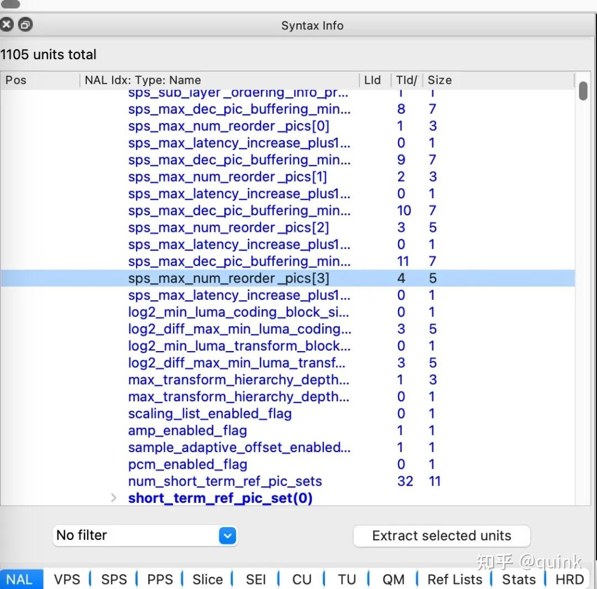
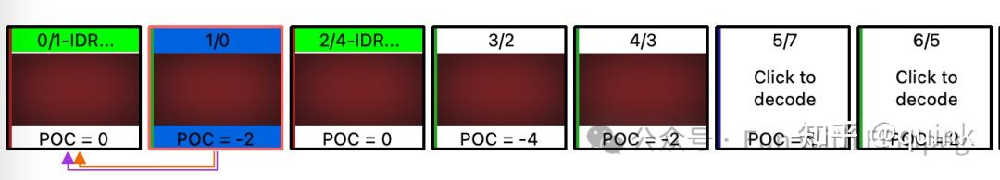
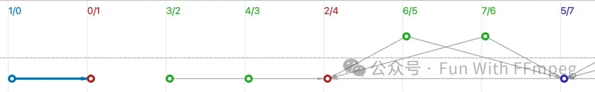

**1、定义解码延迟**

视频解码延迟是个老生常谈的问题：
- 刚开始接触[FFmpeg]()的同学，会问：为什么avcodec_receive_frame返回AVERROR(EAGAIN)？- 有秒开和低延迟需要的同学会问，怎么让解码器更快输出首帧？

首先要定义下描述首帧延迟的方式：

输入第N个视频packet，开始输出第1帧图像，延迟为N - 1

如果输入第1个packet，输出第1个frame，延迟为0。输入第5个packet，才输出第1个frame，延迟为4。

**这种定义方式的好处是：对解码性能（解码速度）和延迟做了解耦，是解码的固有延迟。首帧的输出时间问题，耦合了解码固有延迟、解码性能、送数据速度、系统调度等多个维度因素**。

必须注意，这种定义方式对FFmpeg软件解码有效，因为软件解码延迟是确定性的，但对硬件解码不一定有效：
- 如果软件解码avcodec_receive_frame返回了AVERROR(EAGAIN)，你再循环调用avcodec_receive_frame 10000次也是返回AVERROR(EAGAIN)，等一个小时再avcodec_receive_frame 也是返回AVERROR(EAGAIN)- 硬件解码avcodec_receive_frame返回了AVERROR(EAGAIN)，再调用一次可能返回成功。硬件解码有个最低延迟，实际延迟可能上下浮动，不固定

**2、解码延迟计算方式**

FFmpeg H.264/[H.265]()软件解码延迟为：

延迟 =[max_num_reorder_pics]()+ 帧级并行线程数 - 1

对H.264来说，max_num_reorder_pics可能直接包含在[SPS]()中，也可能是推导出来的。H.265 max_num_reorder_pics包含在VPS/SPS里。例如一个4层分层参考的H.265码流，其最大max_num_reorder_pics是4。

当FFmpeg采用16线程并行解码时，延迟为

延迟帧数 = 4 + 16 - 1 = 19

即送入20个packet，输出第1帧图像。如果采用单线程解码，延迟为4，送入第5个packet，输出第1帧图像。

由此可见，当线程数比较多时，多线程带来的延迟占大头。FFmpeg H.264/H.265/H.266帧级并行默认线程数为min(cpu_core，16）。PC端和server端，CPU核数大于16很普遍，带来的结果是解码延迟高。

当主动控制解码线程数，比如使用单线程解码时，码流的编码特性，即max_num_reorder_pics变成了决定性因素。

**3、解码延迟的来源和降低延迟的手段**

max_num_reorder_pics代表按照解码序填满max_num_reorder_pics个图像buffer之后，再来一帧图像，可从这max_num_reorder_pics + 1个图像中选出[POC]()（picture order count)最小的帧作为输出。

对图像队列做重排序后再输出，这一点容易理解。很多人的疑问可能在于：首帧（[IDR帧]()）也要参与排序吗？首帧能不能直接输出呢？

答案是：**首帧也要参与排序，解码序首帧不一定是显示序首帧**。例如下面一个例子：

IDR帧的POC是0，第二个解码序的帧POC是-2，是显示序的首帧。参考结构如下所示：

所以，IDR帧直接输出可能导致显示乱序，应当排序之后再输出。只是IDR帧延后显示的参考结构用的比较少，多数编码器的IDR帧确实为显示序第一帧。

**降低码流固有延迟，即降低max_num_reorder_pics，减小重排序队列**。对于H.264之后的编码格式来说，并不是IPPP才是低延迟结构，IBBB也可以实现0延迟。

帧级并行解码延迟的来源是帧级并行算法。多线程帧级并行基本原理如下：

注意这是简化的示意图。当一个线程在解码第M帧时，另一个线程解码第M+1帧，多线程之间有进度（progress）同步，用于控制参考补偿。帧级并行启动时，要为N个线程准备好数据（N个packet），再从“最老”的线程开始回收frame，**所以每增加一个线程，增加一帧延迟。降低帧级并行带来的延迟，可以通过减少帧级并行线程数、采用多slice并行、WPP并行等方式实现。FFmpeg H.266解码器和dav1d解码器采用了更现代的架构设计，可以实现更低的解码延迟和加速效果。**

---

## 知乎评论

**评论 1：**

这个不一定能精准控制的吧，依赖于底层解码究竟是硬件实现或者软件实现。文中提到的 “如果软件解码avcodec_receive_frame返回了AVERROR(EAGAIN)，你再循环调用avcodec_receive_frame 10000次也是返回AVERROR(EAGAIN)，等一个小时再avcodec_receive_frame 也是返回AVERROR(EAGAIN)” 这个应该是调用方式有问题。在FFMPEG的解码处理时，应该将包送入函数  avcodec_send_packet() 和 avcodec_receive_frame() 配合起来使用。当avcodec_receive_frame() 函数返回 AVERROR(EAGAIN)表示解码器内部输入包队列为空，没有解码后的frame输出，需要avcodec_send_packet()继续送入数据包以便后续继续解码。详细可以参考：FFMPEG开发快速入坑——音视频解码处理

**评论 2：**

你在说啥呢，作者表达的没问题，本来是说软件解码行为是确定的，如果送入一个 packet 之后没有获取到 frame，那就说明只要不再送入 packet 就无法获取到帧。与之对比，硬件解码器在送入 packet 之后无法立刻获取到 frame，则可能是因为硬件的异步特性等因素，毕竟你获取 frame 时并不是阻塞的，不会等到硬件送出 frame 你才能获取到。

**评论 3：**

比较典型的同一个知识换一个说法就不认识，然后生搬硬套教条主义来进行所谓的“勘误”

**评论 4：**

再理解下我表达的含义

**评论 5：**

之前一直理解，一旦出现了IDR帧，则之后解码的帧的都应该在IDR之后显示你举的例子，解码顺的第2帧，POC是-2。和我之前的理解冲突？能有更多参考资料吗

**评论 6：**

IDR只代表解码不依赖前面的帧，没有要求它是后续第一个显示。把IDR当成首帧显示是个普遍的误解，只是在常见的码流里是成立的。标准测试流集合中，一堆特殊参考结构的码流，用来验证解码器是否严格符合标准

**评论 7：**

请问下大佬，我在android使用ffmpeg mediacodec解码,和软解使用的cpu是差不多的，而且硬件解码receive frame的耗时还比软解大，软解是使用了8线程解码，这种情况正常吗

**评论 8：**

按照pipeline理解，流水线长不长，长了延迟大，如果解码时间一定，则缓存就大一些

**评论 9：**

关于硬件解码一直有个疑问，硬件AVFrame的data是Texture2D，而这个Texture在ffmpeg内部有缓存数组，一般是initial_pool_size，只有外部av_frame_free引用计数减0才会放回内部缓冲。一旦外部占用太多硬件AVFrame，继续解码好像会失败？如果有一个视频，前面很多都全是视频帧，到后面才有音频，而同步以音频为准，音频的时间戳却是0开始正常的，该继续保存视频frame吗？

**评论 10：**

cuvid解码器上下文里头应该也是一个动态帧池吧？之前开发全硬件加速链路视频图像处理项目，opengl图像处理和编码速度没跟上解码，显存爆了，才爆出无法继续解码，out of memory。ffmpeg软件应该没有对硬件帧表面数量做限制。

**评论 11：**

nvdec/nvenv启动时就配置了定值

**评论 12：**

这个问题很棘手。Intel尝试用dynamic frame pool来解决，避免固定大小的pool size导致的帧耗尽问题。可以在git log里搜“dynamic frame pool"，比如：    lavc/qsvdec: require a dynamic frame pool if possible    This allows a downstream element stores more frames from qsv decoders    and fixes error in get_buffer().    $ ffmpeg -hwaccel qsv -hwaccel_output_format qsv -i input.mp4 -vf    reverse -f null -    [vist#0:0/h264 @ 0x562248f12c50] Decoding error: Cannot allocate memory    [h264_qsv @ 0x562248f66b10] get_buffer() faileddynamic frame pool实现了按需分配，但是一直拿着不放，还是会耗尽。在这一点上，软件编解码和硬件编解码没区别，都有个上限，都需要用户注意控制上限。软件编解码实现方式已经是dynamic frame pool了。nvdec/nvenc surface数量控制问题还没好的方案。

