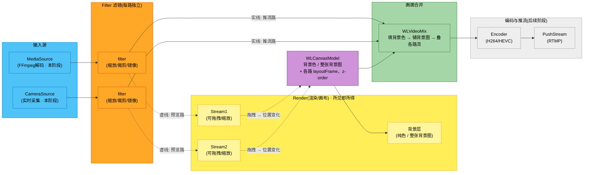

# WorkLabs 多路流推流系统 - 实施计划（简化版）

> 本文档聚焦**当前简化设计与本阶段范围**。
> **本阶段**：`MediaSource` / `Camera` 多路 → Filter → Render 画布（背景色/图 + 预览）→ `WLVideoMix` 合成 → `WLRecorder` 录制为 mp4（ffmpeg / h264_videotoolbox，仅视频）；音频已打通「媒体音轨 → 播放」单路（`WLAudioRenderer`）；**不含** RTMP 推流，Mic 采集 / 多路混音 / AAC 编码 / 录制带音频与 Network 拉流为后续阶段。
>
> 🔄 **进度已远超本段「本阶段范围」描述（2026-06-15 核对）**：§4.2 changelog 已推进到 **v0.22**——Mic 采集、多路混音（`WLAudioMixer`）、带音频录制（AAC）、RTMP 推流（`WLPusher`）、共享编码器（`WLEncoder` 编一次分发录制/推流两路）、按源音量/基础滤镜（镜像/颜色校正/裁剪）、编码参数可配、独立设置窗口、预览空转优化均**已落地**。上面这句「不含…为后续阶段」仅为 v0.1 初始范围，**已过时**；真正剩余项见各源「网络拉流 / 屏幕采集」「运行时切源」「音频降噪/AEC」「高级滤镜」与晶振漂移补偿。当前能力总览以 changelog 末尾版本为准。

## 1. 项目背景与目标

### 1.1 业务需求
开发类似 OBS 的多路流输入系统，支持将多路视频/音频流合并为一路流，推送到社交平台（抖音、快手、B站等）。

**核心限制**：
- **Video 输入**：最多同时支持 **2 路视频流**
- **Audio 输入**：最多同时支持 **2 路音频流**

> 说明：本系统为轻量级推流工具，限制在 2 路以内以简化混合逻辑、降低开销、保证实时性能。

### 1.2 输入源定义

#### Video 输入源（最多 2 路，其中一路必为 Camera）：
- **Camera 流**：实时摄像头采集（`WLCameraSource`，**本阶段已接入**）
- **本地视频流**：FFmpeg 解码本地媒体文件（`WLMediaSource`，**本阶段**）
- **网络拉取流**：RTMP/RTSP/HLS（`WLNetWorkSource`，后续阶段）

#### Audio 输入源（最多 2 路，其中一路必为 Mic）：
- **本地麦克风**：实时音频采集（Mic 采集，后续阶段）
- **本地视频流中的音频**：媒体文件的音轨（**本阶段已可播放**）

> 音频管线本阶段先打通「媒体音轨 → 播放」单路链路（`WLAudioRenderer`）；Mic 采集、多路混音、AAC 编码为后续阶段。

### 1.3 核心约束条件
- 若同时存在两路 Video 流，**其中一路必须为 Camera 流**
- 若同时存在两路 Audio 流，**其中一路必须为 Mic 流**

---

## 2. 系统架构（Render 渲染管线）

相比早期设计：**移除了「后处理 Filter（最终处理）」和「合成主画面预览（MainPreview）」两个节点**，并把**画布背景（纯色 / 整张背景图）**纳入合成。预览采用**所见即所得画布（路线 A）**——Render 画布用 UI 层直接呈现「背景 + 两路 Stream」，`WLVideoMix` 在后台按同一份 `WLCanvasModel` 真合成后送编码推流，二者参数同源以保证预览=推流。

下图展示从输入源到画面合并的简化数据流（灰色为后续阶段）：



**流程说明**：

| 阶段 | 组件 | 功能 | 数据格式 |
|------|------|------|----------|
| **输入源** | MediaSource / CameraSource（均本阶段） | 提供原始视频帧 | `CVPixelBufferRef` |
| **滤镜** | filter (每路独立) | 缩放/裁剪/镜像；输出同时供「预览」和「合并」两路 | `CVPixelBufferRef` |
| **画布数据** | WLCanvasModel | 背景色、整张背景图、各路 layoutFrame/z-order 的单一数据源 | 配置对象 |
| **预览** | Render 画布 | UI 层呈现：背景层 + 两路 Stream 浮层（可拖拽/缩放）；拖拽即改 layoutFrame | `CMSampleBufferRef`（各路） |
| **画面合并** | WLVideoMix | 按 WLCanvasModel 真合成：填背景色 → 铺背景图 → 按 layoutFrame/z-order 叠加各路流 | `CVPixelBufferRef` |
| **编码/推流**（后续） | Encoder / PushStream | H264/HEVC 编码 + RTMP 推流 | 压缩码流 / 网络包 |

**关键设计点**：
- ✅ **路线 A 所见即所得**：Render 画布用 UI 层直接呈现「背景 + 两路 Stream」，不再单独渲染「合成主画面预览（MainPreview）」
- ✅ **单一数据源 WLCanvasModel**：背景色 / 背景图 / 各路 layoutFrame 由一份 model 描述，Render 画布与 WLVideoMix 共同消费 → 预览=推流，零漂移
- ✅ **画布背景纳入合并**：纯色 或 整张背景图铺满画布，最终在 WLVideoMix 合成进推流（**仅此两种**，不做前景 / 水印 / 贴纸 / 拖拽缩放图片）
- ✅ **分流输出**：每路 Filter 输出同时走两路——① 虚线 → Render 画布预览 ② 实线 → WLVideoMix 合成
- ✅ **交互反馈**：拖拽 / 缩放 Stream → 更新 `WLCanvasModel.layoutFrame` → 同步 WLVideoMix
- ❌ **移除后处理 Filter（最终处理）**：WLVideoMix 合成后直接进编码，不再有 FinalFilter 节点（美颜 / 水印等后续如需再加回）
- ❌ **移除三画面预览**：不再有 Preview1 / Preview2 / MainPreview 切换，画布即所见

---

## 3. 详细模块设计

### 3.1 WLMediaSource（✅ 已适配新协议）

**职责**：FFmpeg 媒体文件解码器。

**线程模型**：
- Parse Thread：读取 packets
- Video Decode Thread：解码视频帧
- Video Render Thread：通过 delegate 输出视频帧（`CVPixelBufferRef` + pts）
- （Audio Decode/Render Thread：解码并输出音频帧 `CMSampleBufferRef`，音频另议）

**接口**：
```objc
@interface WLMediaSource : NSObject <WLStreamSourceProtocol>
- (instancetype)initWithPath:(NSString *)path;
// streamType = WLNodeTypeVideo, fromType = WLFromTypeMedia
@end
```

**数据流**：
```
parseThread → videoPacketQueue → videoDecodeThread → videoFrameQueue → videoRenderThread → delegate didOutputVideoFrame:
```

> WLMediaSource 已遵循 `WLStreamSourceProtocol`，通过 delegate 独立输出帧数据。
> 重构时**解耦** `WLMediaSourcePreview`（预览职责统一移到 Render 画布）。

### 3.2 WLVideoFilter（图像处理）

**职责**：对单路视频帧做缩放、裁剪、镜像等处理（遵循 `WLVideoFilterProtocol`）。

**技术方案**：CoreImage（Phase 1）；高性能场景后续可换 Metal Performance Shaders。

```objc
@interface WLVideoFilter : NSObject <WLVideoFilterProtocol>
@property (nonatomic, assign) CGSize outputResolution; // 输出分辨率
@property (nonatomic, assign) BOOL enableMirror;        // 镜像
@property (nonatomic, assign) CGRect cropRect;          // 裁剪区域
- (CVPixelBufferRef)processVideoFrame:(CVPixelBufferRef)pixelBuffer pts:(Float64)pts;
@end
```

### 3.3 WLVideoMix（画面合并）

**职责**：在固定画布上合成最终画面，读取 `WLCanvasModel`。

**合成顺序**（固定）：**填背景色 → 铺背景图（整张）→ 按 `streamOrder`(z-order) 依次叠加各路视频流**（按各自 layoutFrame 缩放/定位）。

**技术方案**：CoreImage（`imageByCompositingOverImage`），输出 `CVPixelBufferRef`。

```objc
@interface WLVideoMix : NSObject
@property (nonatomic, strong) WLCanvasModel *canvas;
- (void)inputVideoFrame:(CVPixelBufferRef)pb forStreamID:(NSString *)sid pts:(Float64)pts;
// 本阶段回调合成帧用于预览/验证；后续接 Encoder
@property (nonatomic, copy) void (^output)(CVPixelBufferRef mixed, Float64 pts);
@end
```

> 已**移除早期的「后处理 Filter（FinalFilter）」**——合成后直接输出，美颜 / 水印等后续如需再加。

### 3.4 WLCanvasModel（画布数据源）

画布的**单一数据源**，被 Render 画布 UI 和 WLVideoMix 共同消费，保证「所见」与「所推」参数同源（路线 A 的关键）。

```objc
@interface WLCanvasModel : NSObject
@property (nonatomic, assign) CGSize canvasSize;                   // 输出画布尺寸 (如 1920×1080)
@property (nonatomic, strong, nullable) NSColor *backgroundColor;  // 画布纯色背景
@property (nonatomic, strong, nullable) NSImage *backgroundImage;  // 整张铺满的背景图(可选)
// 每路 Stream 在画布上的布局 (按 streamID)
- (void)setLayoutFrame:(CGRect)frame forStreamID:(NSString *)sid;
- (CGRect)layoutFrameForStreamID:(NSString *)sid;
// 叠放顺序 (z-order, 数组顺序即从底到顶)
@property (nonatomic, copy) NSArray<NSString *> *streamOrder;
@end
```

**约定**：合成 / 呈现顺序固定为 **背景色 → 背景图(整张) → 各路 Stream(按 streamOrder)**。背景图仅支持整张铺满，不支持前景 / 水印 / 贴纸 / 任意层级（后续如需再扩展）。

### 3.5 WLStreamsManager（编排核心）

**职责**：注册输入源、按 `WLCanvasModel` 编排「预览」与「合成」两条路、管理组件生命周期。

**接口**（简化版）：
```objc
@interface WLStreamsManager : NSObject
- (void)addSource:(id<WLStreamSourceProtocol>)source
    previewOutput:(id<WLStreamRenderingProtocol>)preview;
- (void)setFilter:(id<WLVideoFilterProtocol>)filter
        forSource:(id<WLStreamSourceProtocol>)source;
@property (nonatomic, strong) WLCanvasModel *canvas; // 背景/布局单一数据源
- (void)start;
- (void)stop;
@end
```

#### 3.5.1 数据流模式

采用 **Push + Queue**：源生产帧后推入 Manager 内部队列，Manager 拉取、过 Filter，再 fork 给「预览」和「合并」。

```
Source → [delegate: didOutputVideoFrame]
    → Manager 内部 WLNodeQueue
    → [perStreamFilter 处理]
    → fork ┬→ Render 画布预览 (WLStreamPreview, 按 layoutFrame 摆放)
           └→ WLVideoMix (按 WLCanvasModel 合成: 背景色/图 + 各路 layoutFrame/z-order)
    → (后续阶段) Encoder → PushStream
```

#### 3.5.2 核心 Protocol（视频路径）

> 本阶段聚焦视频；音频相关协议（AudioOutput / AudioFilter）随音频管线另行讨论。

**WLStreamSourceProtocol（输入源）** — 源声明类型并通过 delegate 推帧：
```objc
@protocol WLStreamSourceDelegate <NSObject>
@required
- (void)source:(id<WLStreamSourceProtocol>)source
    didOutputVideoFrame:(CVPixelBufferRef)pixelBuffer pts:(Float64)pts;
- (void)source:(id<WLStreamSourceProtocol>)source
    didOutputAudioBuffer:(CMSampleBufferRef)sampleBuffer;   // 音频另议
@optional
- (void)source:(id<WLStreamSourceProtocol>)source didEncounterError:(NSError *)error;
- (void)sourceDidStart:(id<WLStreamSourceProtocol>)source;
- (void)sourceDidStop:(id<WLStreamSourceProtocol>)source;
@end

@protocol WLStreamSourceProtocol <NSObject>
@property (nonatomic, assign, readonly) WLNodeType streamType;   // Video / Audio
@property (nonatomic, assign, readonly) WLFromType fromType;     // Camera / Mic / Media / Network
@property (nonatomic, assign, readonly, getter=isRunning) BOOL running;
- (BOOL)start:(NSError **)error;
- (void)stop;
@property (nonatomic, weak, nullable) id<WLStreamSourceDelegate> delegate;
@end
```

**WLVideoFilterProtocol（处理节点）**：
```objc
@protocol WLVideoFilterProtocol <NSObject>
- (CVPixelBufferRef)processVideoFrame:(CVPixelBufferRef)pixelBuffer pts:(Float64)pts;
@end
```

**WLStreamRenderingProtocol（预览渲染 / 交互反馈）**：Render 画布中的 Stream 浮层（`WLStreamPreview`）实现它；拖拽 / 缩放时回调 `rendering:didUpdateFrame:`，把新 layoutFrame 反馈给 Manager → 同步 `WLCanvasModel` 与 `WLVideoMix`。

### 3.6 WLStreamViewController（Render 画布界面，✅ 入口）

**职责**：推流主界面。App 启动入口（`WLMainViewController` 内嵌），预览区为 `WLCanvasModel` 驱动的 Render 画布。

**布局**：
```
┌─────────────────────────┐
│                         │
│   Render 渲染画布        │  ← 背景层(色/图) + 两路 Stream 浮层(可拖拽/缩放)
│                         │
├─────────────────────────┤
│ ━━━━━━━━●━━━━━━━━━━━━━━ │ ← Slider（本地视频时显示）
├─────────────────────────┤
│  🔴      ▶     ＋      ⚙️ │ ← 工具栏（改背景色 / 选背景图 等入口）
└─────────────────────────┘
```

**文件**：`NewPlan/UI/WLStreamViewController.h/m`、`NewPlan/UI/WLStreamPreview.h/m`

**要点**：
- 画布按 `WLCanvasModel` 渲染底色 + 整张背景图
- 每路 Stream 用 `WLStreamPreview` 浮层显示，可拖拽 / 缩放，实时反馈 layoutFrame
- **移除合成主画面预览（MainPreview）**——画布即所见

---

## 4. 实施计划

### 4.1 本阶段范围与文件处置

按 §2 简化版方案对 NewPlan 进行重构。**边界**：只动 NewPlan，旧 UI（`WLSceneManager` 全家桶）暂不动；因此被旧 UI 占用的 `WLCameraSource` / `WLMicSource` 保留不删。**本阶段范围**：`MediaSource` 单路 → Filter → Render 画布（背景色/图 + 预览）→ `WLVideoMix` 合成，跑通即止（不含 Encoder / 推流，音频另议）。

**文件处置清单**：

| 处置 | 文件 |
|------|------|
| **保留不动** | `WLMediaSource`(解耦 preview)、`WLNode`、`WLNodeQueue`、`WLStreamSourceProtocol`、`WLStreamRenderingProtocol`、`WLDefines` |
| **保留 + 重写** | `WLStreamViewController`(入口→Render 画布；「+」加视频文件/摄像头)、`WLVideoMix`(加背景色/图、删 postFilter)、`WLStreamsManager`(简化编排 + 接入 CanvasModel)、`WLStreamPreview`(复用拖拽、去 mainPreview)、`WLVideoFilter`(复用 scale/crop/mirror) |
| **新建** | `WLCanvasModel`；`WLEncoder`、`WLPushStreamer`（后续阶段） |
| **✅ 已删除(本阶段)** | `WLMicSource`(+Config)、`WLTestSourceController`；`WLVideoMix.postFilter` 逻辑（合成后直出，不再有后处理节点） |
| **原计划删、实际保留** | `WLAudioOutput`、`WLPreviewOutput`（被旧 `WLPipelineManager` 依赖）、`WLMediaSourcePreview`（被 `WLSceneManager`/`WLSceneViewController` 依赖）、`WLStreamOutputProtocol`（被 `WLStreamRenderingProtocol` 依赖） |
| **旧 UI 不动** | `WLSceneManager`、`WLPipelineManager`、旧 `WLSourceProtocol`、`WLCameraSource`(+Config，已同时遵循新协议，**本阶段新管线直接复用、未改其代码**)、`WLMenuPanelViewController`、`WLSourcePanel`、`WLSceneViewController` |

> 实际删除范围按「旧 UI 不动」原则收窄：仅删除无外部引用的 `WLMicSource` / `WLTestSourceController`；其余原计划删除项因被旧 UI / 旧管线 / 渲染协议依赖而保留。
>
> 工程用 **XcodeGen** 管理，增删文件后需 `xcodegen generate && pod install` 再编译（CocoaPods 重新集成）。
>
> ✅ 本阶段已落地，`xcodebuild -configuration Debug` 编译通过。

**构建验证**：
```bash
xcodegen generate
xcodebuild -workspace WorkLabs.xcworkspace -scheme WorkLabs -configuration Debug
```

### 4.2 文档变更记录

| 版本 | 日期 | 变更内容 |
|------|------|----------|
| v0.1 | 2026-05-19 | 初稿 |
| v0.2 | 2026-05-26 | Preview 渲染管线版（Filter / Mix / 重写 StreamsManager / MainPreview 布局；Camera/Mic 兼容新协议） |
| v0.3 | 2026-06-02 | §2 重构为简化版 Render 渲染管线（路线 A 所见即所得画布）：移除「后处理 Filter」与「MainPreview」；画布背景(纯色/整张背景图)纳入合并；新增 WLCanvasModel 单一数据源 |
| v0.4 | 2026-06-02 | **文档精简**：删除后续阶段模块(Camera/Audio/Network/Encoder/Push/AudioMixer)、推流相关章节(状态机/资源/风险/疑问点/下一步/线程模型/时间戳)、重复的早期架构图(原 §2.1/2.2)、历史盘点(原附录 B.1-3)、术语表/参考链接；重组为聚焦当前简化设计与本阶段范围，新增 WLVideoMix 独立小节 |
| v0.5 | 2026-06-02 | **代码落地(本阶段)**：新增 `WLCanvasModel`；`WLVideoMix` 加背景色/背景图合成；`WLStreamsManager` 简化（去 mainPreview/postFilter，接入 CanvasModel）；`WLStreamViewController` 重写为 Render 所见即所得画布（添加视频源 / 拖拽缩放 / 改背景）；删除 `WLMicSource`(+Config) / `WLTestSourceController`。xcodegen + pod install + Debug 编译通过 |
| v0.6 | 2026-06-02 | **Camera 接入(本阶段)**：`WLStreamViewController` 工具栏「+」改为弹出菜单（添加视频文件 / 添加摄像头▸设备列表）；新增 `addCameraSourceWithDevice:`（请求摄像头授权 + 同设备去重，复用 `WLMediaSource` 同款预览/合成接入路径）；复用既有 `WLCameraSource`（已遵循新协议、旧 UI 共用、未改其代码）与 `WLDevicesManager` 设备枚举；`project.yml` 增加 `NSCameraUsageDescription`（TCC 授权）。xcodegen + pod install + Debug 编译通过 |
| v0.7 | 2026-06-02 | **层级(z-order)调整**：z-order 收敛为以 `WLCanvasModel.streamOrder` 为单一数据源（新增 置顶/置底/上移/下移 接口）；`WLVideoMix` 改为按外部 `setStreamOrder:` 合成（不再按到帧先后自排），`WLStreamsManager` 在增删源/层级操作时同步 mix；`WLStreamRenderingDelegate` 加 `WLZOrderAction`，`WLStreamPreview` **右键弹出菜单**（置顶/上移一层/下移一层/置底），`WLStreamViewController` 执行后按 `streamOrder` 重排画布浮层 subview（预览叠放 = 合成 z-order）。Debug 编译通过 |
| v0.8 | 2026-06-02 | **音频单路播放**：新增 `WLAudioRenderer`（AudioQueue 即时播放，按首帧 `formatDescription` 动态适配采样率/声道/格式）；`WLStreamsManager` 接通 `didOutputAudioBuffer:`（原直接丢弃 → 转发播放），`stop` 时停播放器；媒体音轨由 `WLMediaSource` 既有 `audioRenderThread` 按 `baseTime+pts` 节流输出，播放器即时播放，音画同步靠源端节流。本阶段仅播放、不采集 Mic（无需麦克风权限）。xcodegen + pod install + Debug 编译通过 |
| v0.9 | 2026-06-02 | **录制（仅视频，ffmpeg）**：新增 `WLRecorder` —— `libavformat`(mp4 muxer) + `h264_videotoolbox` 编码 + `swscale`(BGRA→NV12)，按真实 pts 做 VFR 时间戳；针对 videotoolbox extradata 时序，**延迟到首个 packet 再写 mp4 header**（否则缺 SPS/PPS 无法播放）；色彩显式声明 BT.709 + limited range（swscale 用 709 系数）以消除 color range 警告。`WLStreamViewController` 的 `mixedFrameOutput` 接入录制器，工具栏录制按钮（🔴）切换开始/停止（`NSSavePanel` 选路径，停止后可在 Finder 显示）。录制带音频为后续阶段。xcodegen + pod install + Debug 编译通过 |
| v0.10 | 2026-06-02 | **画布分辨率可设**：设置菜单（⚙️）新增「画布分辨率」子菜单（720p/1080p/1440p + 竖屏 1080×1920/720×1280，勾选当前）；`WLStreamsManager.setCanvasSize:` 按新旧尺寸比例缩放各路 layout 保持相对布局，并同步 `WLVideoMix.updateCanvasSize:`（重建 pixelBufferPool）；`canvasView` 改为按 canvasSize **锁宽高比 letterbox 居中**（外层 canvasArea 黑底），保证预览=合成=录制宽高比一致；录制进行中禁止改分辨率（录制尺寸随画布）。Debug 编译通过 |
| v0.11 | 2026-06-02 | **修复录制画面偏暗**：`WLVideoMix` 的 `CIContext render` 输出色彩空间由 `nil`（输出线性 RGB working space，被 swscale/编码器当 sRGB 编码致中间调压暗）改为显式 **sRGB**；`colorSpace` 在 init 创建、dealloc 释放、每帧复用。预览不经 mix 不受影响，修复后录制与预览/源一致。Debug 编译通过 |
| v0.12 | 2026-06-02 | **清理无用类**：从入口（`AppDelegate`/`WLMainWindowController`/`WLMainViewController`→`WLStreamViewController`）做 `#import` 传递闭包，删除 43 个不可达类（84 文件）：①旧架构整套——`Core/`(场景/渲染/推流/旧音频 15 类)、旧 UI(`UI/ControlPanel`·`Scene`·`Setting` 12 类)、事件总线 `WLUtils/Event`(NewPlan 未用 `WLObserve/WLSend`)、`WLVideoManager`/`TVUVideoManager`、`WLViedoPreview`/`WLVideoSelectView` 等；②NewPlan 内被取代的早期版本 `WLPipelineManager`/`WLAudioOutput`/`WLPreviewOutput`；③未接线的滤镜实现 `WLVideoFilter`(协议 `WLStreamFilterProtocol` 与 `setFilter:` 接口保留)。`WLMediaSourcePreview` 仍被 `WLMediaSource` 引用故保留，其 Metal shader `WLMetalPreviewShaders.metal` 按名隐式加载（非 import），归位到 `NewPlan/Source/MediaFile/`。源文件 129→45。xcodegen + pod install + Debug 编译通过 |
| v0.13 | 2026-06-02 | **目录重组**：删除历史临时层 `NewPlan/`，按媒体管线职责重组顶层目录——`App/`(入口+主窗口)、`Core/`(编排+画布模型)、`Source/`(Camera+MediaFile)、`Mix/`、`Output/`(录制+音频)、`UI/`、`Common/`(宏/队列/协议)、`Utils/`(分类)。纯文件移动（`git mv`），`#import` 用裸文件名靠 headermap 解析，**零代码改动**；资源（Info.plist/entitlements/Assets/storyboard）在 `WorkLabs/` 根未动，`project.yml` 引用不变。xcodegen + pod install + Debug 编译通过 |
| v0.14 | 2026-06-02 | **录制带音频（AAC）+ 修复多源时长爆炸**：`WLRecorder` 新增一路 AAC（`aac_at`，兜底 `AV_CODEC_ID_AAC`）——任意输入经 `swresample` 适配为 44.1kHz/立体声，`AVAudioFifo` 按 1024 样本/帧编码；音频流在 `write_header` 前建好（AAC extradata 在 `open` 后即就绪），header 仍延迟到首个视频包，视频包前的音频先积压 FIFO、写头后补编码（不改既有视频时序、不死锁）。`WLStreamsManager` 新增 `audioBufferOutput` 转发源音频；`WLStreamViewController` 录制时按 `hasAudioCapableSource` 开启并接线、停止时清空。**同时修复多源录制时长爆炸（曾现 21:39:30 + 画面静止）**：根因是摄像头 pts=系统 mach 时间（不从零）与媒体 pts=文件时间（从零）混入同一时间轴；视频帧时间戳改用单调墙钟（`mach_absolute_time`），合成录制以"实际录制经过时间"为准。Debug 编译通过 + 实测 mp4 有声/画面正常/时长正确 |
| v0.15 | 2026-06-03 | **Mic 采集 + 多路混音**：新增 `WLMicSource`（`AVCaptureSession` + `AVCaptureAudioDataOutput` 采麦克风，所有权转移给 delegate）与 `WLAudioMixer`（各路 PCM 经 `swresample` 统一为 44.1kHz/立体声/Float32 → 各自 `TPCircularBuffer`，一个 ~23ms 定时器从各路取 1024 样本叠加、限幅后输出一路混音 LPCM）。`WLStreamsManager` 改为**所有源汇入 mixer**（纯音频源 `streamType==Audio` 不进画布合成）、由 `mixer.mixedOutput` 统一驱动播放 + 录制（音频不再由源直接 enqueue）。`WLStreamViewController` 「+」菜单加「添加麦克风」（动态列 `currentAudioDevices` + 授权流程，无预览浮层）；`project.yml` 加 `NSMicrophoneUsageDescription`。修复 `WLMicSource` 漏声明 `delegate` property 导致 `setDelegate:` 运行时 crash（协议声明的 property 不自动合成给遵循类）。已知取舍：麦克风外放无 AEC 会啸叫（戴耳机）；定时器拉取 vs 源时钟可能长时漂移。xcodegen + pod install + Debug 编译通过 |
| v0.16 | 2026-06-03 | **设置独立窗口 + 按来源类型音量调节**：新增 `WLSettingsWindowController`（仿 macOS 系统设置左右分栏——左侧 source-list 分类「画布/背景/音频」+ 右侧面板）；齿轮按钮从弹菜单改为打开该窗口；原「背景色/图、清除背景、画布分辨率」迁入，经 `WLSettingsWindowControllerDelegate` 回调宿主复用既有执行逻辑（录制中改分辨率仍拦截并恢复选中）。新增音量：`WLAudioMixer` 每路增益（`setGain:forInput:`，混音 `mix += src×gain`、限幅防爆音）；`WLStreamsManager` `setVolume:forFromType:` / `volumeForFromType:`（设置时更新该类所有源、新加同类源套用当前值）；「音频」分类含「媒体音量/麦克风音量」两滑块（0~200%，100%=原始），打开时回填当前值。xcodegen + pod install + Debug 编译通过 |
| v0.17 | 2026-06-03 | **RTMP 推流 + 推流设置 + 录制/直播按钮状态**：新增 `WLPusher`（复用 `WLRecorder` 编码/时序——`h264_videotoolbox`+`aac_at`、墙钟视频 pts、`AVAudioFifo`、header 延迟首视频包；推流特化 FLV muxer + `avio_open2`(rtmp，5s rw_timeout) + `realtime` 低延迟 + 2s GOP）；后台串行队列异步连接、结果经 delegate 主线程回调，`av_interleaved_write_frame` 失败即标记中断并收尾回调 UI。`WLStreamViewController` 把合成帧/混音音频常驻分发给录制器与推流器（各按 `isRecording`/`isPushing` 判断），支持边录边推。推流配置迁入设置：`WLSettingsWindowController` 新增「推流」分类（推流地址+密钥两输入框 + 「保存」按钮、回车即存、绿色「✓ 已保存」反馈），经 delegate 持久化到 `NSUserDefaults` 并在打开时回填；「直播」按钮不再弹窗，读设置拼接完整地址（去相接处多余斜杠、密钥可空）后推流，未配置则提示并跳设置。`WLIconButtonView` 加激活态——录制/推流中圆底转实心红、图标变白、0.8s 呼吸动画（hover/按下再提亮），停止或失败恢复空闲。xcodegen + pod install + Debug 编译通过 |
| v0.18 | 2026-06-03 | **每个源独立配置（移除源 + 按源音量 + 滤镜位预留）+ 源右键属性**：把音量从「按来源类型聚合」改为「按单路源（streamID）」——`WLStreamsManager` 新增 `setVolume:forStreamID:` / `volumeForStreamID:`（直透 `WLAudioMixer` 的 per-input gain，移除源时清理 `sidVolumes`）；源协议 `WLStreamSourceProtocol` 加 `displayName`（媒体=文件名、麦克风/摄像头=设备名）。`WLSettingsWindowController` 左栏从固定分类改为「画布/背景/推流」+「输入源」分组动态列出各源，选中源进其属性页（名字+类型、音量滑块仅对有音频源、滤镜占位区为将来 per-source filter 预留）；delegate 改为 `settingsSourceList` / `settingsDidSetVolume:forStreamID:` / `settingsVolumeForStreamID:`，新增 public `reloadSources`（增删源刷新左栏）与 `selectSourceID:`（跳转）。源浮层右键菜单新增「属性…」（→ 打开设置并跳到该源页）与「移除源」（经 `renderingDidRequestProperties:` / `renderingDidRequestRemove:` 回调宿主：停源 + 从 mixer/canvas/mix 移除 + 清理浮层/映射 + 刷新设置）。原「音频」分类的按来源类型两滑块废弃。Debug 编译通过 |
| v0.19 | 2026-06-03 | **基础视频滤镜（镜像 / 颜色校正 / 裁剪，按源独立）**：新增 `WLBasicVideoFilter`（实现 `WLVideoFilterProtocol`，Core Image + Metal `CIContext` 渲染）——水平/垂直镜像（`CGAffineTransform`）、颜色校正（`CIColorControls` 亮度/对比度/饱和度 + `CIHueAdjust` 色相）、四边按比例裁剪；按输出尺寸缓存 `CVPixelBufferPool`（尺寸变则重建），输出 sRGB；全部参数为默认值（`isIdentity`）时直接透传输入帧、零渲染。滤镜挂在 `WLStreamsManager` 既有 perStreamFilter 阶段（fork 之前），故实时同时作用于每路预览 + 合成 + 录制 + 推流。`WLStreamsManager` 新增 `setFilterParams:forStreamID:` / `filterParamsForStreamID:`（每源维护一个 `WLBasicVideoFilter`，identity 时移出激活链路、否则挂上；移除源时清理 `sidFilters`）。设置页源属性页把原「滤镜占位」替换为实际控件——镜像（两复选框）/ 颜色校正（亮度·对比度·饱和度·色相滑块）/ 裁剪（上下左右滑块）；每条滑块（含音量）右侧带 `arrow.counterclockwise` 单项复位小按钮（一键回该项默认值）、底部「恢复默认滤镜」总按钮，控件以默认值打底收集为参数字典，经 delegate（`settingsFilterParamsForStreamID:` / `settingsDidSetFilterParams:forStreamID:`）回调宿主转发 manager；源面板移入翻转 documentView 的 `NSScrollView`，控件多时可滚动。xcodegen + pod install + Debug 编译通过 |
| v0.20 | 2026-06-03 | **编码参数可配（码率 / 关键帧间隔 / 帧率 / 音频码率，推流 + 录制共用一套）**：新增 `WLEncoderConfig`（4 参数 + `loadFromDefaults`/`saveToDefaults` 持久化到 NSUserDefaults + `effectiveVideoBitrateForWidth:height:`，码率<=0 时按 w×h×4 自动）。`WLRecorder` / `WLPusher` 启动参数由 `fps:` 改为 `config:`，内部用 config 替换三处硬编码（`bit_rate=w*h*4`、`gop=fps*2`、AAC `128000`）。`WLStreamViewController` 持有 `encoderConfig`（启动 `loadFromDefaults`），录制/推流时传入；delegate 新增 `settingsEncoderConfig` / `settingsDidUpdateEncoderConfig:`（改动即存）。设置窗口新增「编码」分类页：视频码率滑块(1~20Mbps)、关键帧间隔滑块(1~10s)、帧率下拉(24/25/30/48/50/60)、音频码率下拉(96~256kbps)，两个滑块各带 `arrow.counterclockwise` 复位按钮；改动即时回写持久化、下次录制/推流生效（进行中会话不变）。注：默认视频码率从「按分辨率自动」改为固定 8Mbps（可调）。这是「复用编码器」的第一层（参数层）；编一次分发两路 muxer 的第二层后续单独做。xcodegen + pod install + Debug 编译通过 |
| v0.21 | 2026-06-04 | **复用编码器（编一次 → 分发录制/推流两路 muxer，第二层）**：新增 `WLEncoder`（共享编码器，从 `WLRecorder` 抽出 h264_videotoolbox + aac_at + swscale + swresample + AAC FIFO）——单调墙钟时间轴、视频/音频共用同一 epoch 消除 A/V 固定偏移、`realtime=1` 全局、统一 `AV_CODEC_FLAG_GLOBAL_HEADER`（产 avcC 同时满足 mp4/flv，无需 bitstream filter）；首个视频包后生成 `WLStreamFormat` 格式快照（codecpar 深拷贝含 extradata）；`requestKeyframe` 对 `pict_type` 强制 IDR、编后立即复位；输入尺寸自卫；一次性 start/teardown 不跨会话复用。新增 `WLEncodedPacket` / `WLStreamFormat`：编码包封装为微秒（`AV_TIME_BASE_Q`）时间基的不可变 OC 对象 + 格式快照，多 muxer 跨 queue 各自 retain、最后 release 释放底层 `AVPacket`。`WLRecorder`(mp4) / `WLPusher`(flv·rtmp) 退化为纯 muxer：删自带编码器，改 `writePacket:` 接收编码包；状态机（打开→等首关键帧→建流写头→写包→收尾），以首个视频关键帧为公共零点、video stream `time_base={1,90000}` 防 us→tb 取整破坏 DTS 单调、写入前必 `av_packet_clone`（`av_interleaved_write_frame` 接管即 unref）、音频 `outPts<0` 丢弃；各自独立串行 queue 隔离 rtmp 阻塞（断流只停推流、录制与编码器不受影响），`stop` 经同一 queue FIFO 保证残包先写、trailer 最后写。`WLStreamViewController` 持有共享编码器（首个输出按需建、两路皆停即销毁）+ `recordActive`/`liveActive` 意图标志：`mixedFrameOutput`/`audioBufferOutput` 改喂编码器，`ensureEncoderRunning` 设 `packetOutput` 无脑分发两路（安全网在 muxer queue 内 state 检查），停最后一路时先 flush 编码器（残包经 FIFO 先入 muxer queue）再收尾 muxer；录制完成提示延迟到 mp4 写完 trailer 回调。收益：同时录+推只 1 套 h264+aac（省一半编码开销）、支持「推流中途开录制 / 录制中途开推流」（`requestKeyframe` 快速对齐 GOP）、「推流断流录制继续」。`settingsCanChangeCanvasSize` 补判推流中/编码器运行中（防推流期间改画布致 sws 错配）。方案经 FFmpeg 5.1 源码级审查（packet 引用计数、extradata 时序、`pict_type` 对 videotoolbox 有效性等均核实）。实测修复三处：① 编码器视频输入有界反压（在途 ≤4 帧、超出丢帧），防合成帧率 > 编码吞吐时未压缩 pixelBuffer 在 queue 无限堆积致内存暴涨（曾达 3GB）；② `WLVideoMix` 渲染始终以不透明背景起底铺满画布，覆盖 `CVPixelBufferPool` 复用 buffer 的旧数据（pool 复用不清零），消除拖动时录制画面残影；③ `WLVideoMix` 合成输出按帧率上限节流并联动 `encoderConfig.fps`（新增 `WLVideoMix.setRenderFrameRate:` 与 `WLStreamsManager.renderFrameRate`）——把拖动 `setLayoutFrame` 等数百 Hz 输入事件驱动的过度合成降到录制帧率，基本消除丢帧并显著省 CPU（反压退为兜底）。xcodegen + pod install + Debug 编译通过 |
| v0.22 | 2026-06-04 | **mpv 调研 + 预览空转合成优化（单文件预览 CPU 20%+ → ~11%）**：针对单个本地视频文件预览 CPU 偏高（≥20%，mpv ~12%）问题，调研 mpv v0.41 的读取/解码线程模型（1 demux 线程 + libavcodec 内部解码池 + VO 线程 + 主循环，条件变量 + pull 拉取、绝对时间精确 sleep、全程零忙等）、队列设计（`av_packet_ref` 引用计数零拷贝 + 字节/时长限流 150MB/1s + 迟滞背压 + 解码后异步队列默认仅缓存 1 帧）、渲染与帧定时（CVPixelBuffer→IOSurface 零拷贝绑纹理 + YUV→RGB 全在 GPU fragment shader、CPU 不碰像素 + VO 按 vsync 绝对时刻 `mp_cond_timedwait_until` 睡眠、暂停≈0 CPU），产出 `Doc/MPV_调研与预览CPU优化报告.md`。定位主因：纯预览时 `WLStreamsManager.source:didOutputVideoFrame:` 仍每帧**无条件**喂 `WLVideoMix` 跑完整 CoreImage 合成（建背景 CIImage → `imageWithCVPixelBuffer` → 仿射变换 → 合成 → pool 取 BGRA → `[ciContext render:toCVPixelBuffer:]`）后在非录制时直接丢弃；而画布预览实际靠各路 `WLStreamPreview`(AVSampleBufferDisplayLayer) 独立上屏，故该合成在非录制/推流时 100% 空转。优化①：`WLVideoMix` 新增 `renderingEnabled` 开关（默认 NO），`renderWithPts` 入口即跳过合成（但 `inputVideoFrame`/`setLayoutFrame` 等仍持续刷新 `latestFrames`/`streamOrder`/布局缓存，故开启瞬间下一帧即用最新全量状态合成、无延迟无残影）；`WLStreamsManager` 加 `compositingEnabled` 属性透传给 mix（懒创建时继承）；`WLStreamViewController` 在 `ensureEncoderRunning`（录制/推流共同入口）成功后置 YES、`stopEncoderIfIdle`（两路全停唯一收口）置 NO，开关严格一开一关配对、启动失败不开。实测单文件预览 CPU 从 20%+ 降至 ~11%，对齐/略优于 mpv（~12%），预览路径只剩「VideoToolbox 零拷贝硬解 → AVSampleBufferDisplayLayer 上屏」对齐 mpv「硬解→直接上屏」。注：VT 硬解经 `frame->data[3]` 零拷贝拿 CVPixelBuffer 本就与 mpv IOSurface 同理（未改）。待办②③：渲染线程改条件变量/绝对时间精确等待（消除 `usleep(10ms)` 轮询）、删冗余 `WLMediaSourcePreview` Metal 管线。Debug 编译通过 |
