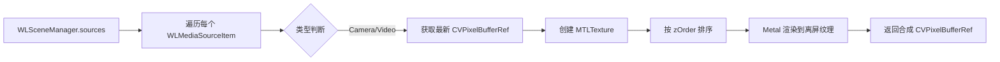
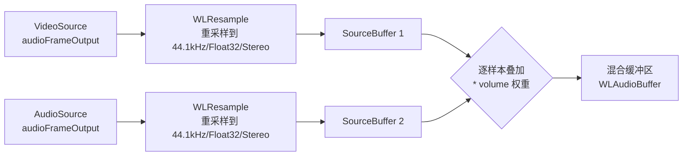
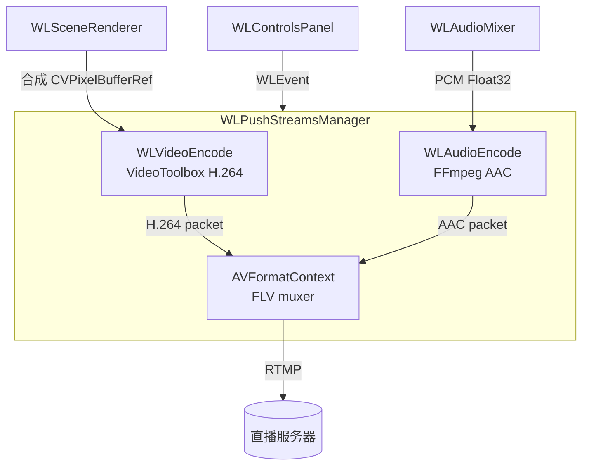
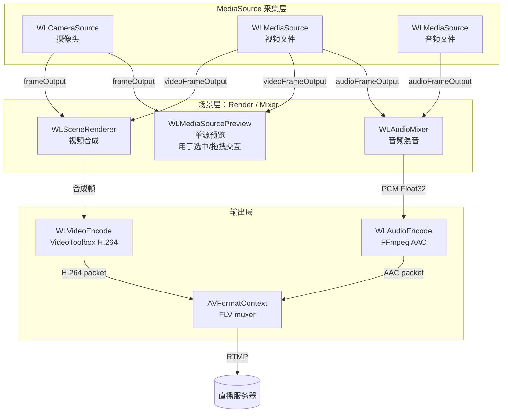
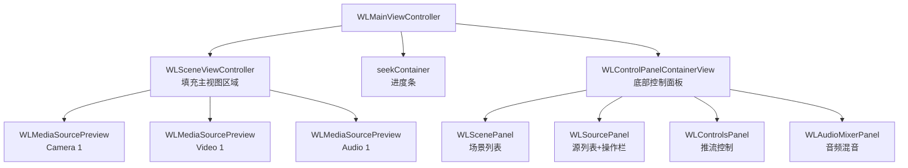

> ⚠️ **已废弃 · 历史文档（2026-06-15 核对）**
> 本文是早期「WLScene 全家桶」场景化设计（`WLSceneManager` / `WLMediaSourceItem` / `WLSceneRenderer` / `WLMediaSourcePreview` / `WLAudioMixer`(旧) / `WLPushStreamsManager` 等）。
> 该方案**已被 NewPlan 简化版管线取代**，上述类已在 [TaskNewPlan.md](NewPlan/TaskNewPlan.md) **v0.12 整体删除**（场景层 → 单一 `WLCanvasModel` + `WLStreamsManager` 编排）。
> 当前实际架构见 [TaskNewPlan.md](NewPlan/TaskNewPlan.md) 与项目根 `CLAUDE.md`。本文仅作历史参考，**勿据此实现**。

---

我想设计一个类似 obs 的简单场景，全局只有一个场景即：WLScene，在这个场景中可以添加多个 MediaSource（视频、音频、Camera）

## 一、设计目标

在现有架构基础上（WLMediaSource、WLCameraSource、WLStreamsManager、WLRenderingManager），抽象出一个统一的场景层，实现：

1. 一个全局场景（WLScene），可添加多个 MediaSource
2. 三种源类型：Camera、Video（本地视频文件）、Audio（本地音频文件）
3. 每个源有可交互的预览视图（WLMediaSourcePreview）
4. 支持选中（边框高亮）和鼠标拖拽移动
5. 与现有事件总线（WLEvent）、控制面板（WLSourcePanel）无缝集成

## 二、新增文件清单

```
Core/Scene/
├── WLSceneManager.h/.m          -- 场景管理器（单例）
├── WLMediaSourceItem.h/.m       -- 媒体源条目（数据模型）
├── WLMediaSourcePreview.h/.m    -- 媒体源预览视图（Metal 渲染）
├── WLSceneRenderer.h/.m         -- 场景合成渲染器
└── WLAudioMixer.h/.m            -- 多路音频混音器

Core/Encode/
├── WLAudioEncode.h/.m           -- 音频编码（PCM -> AAC，已有空壳待实现）
├── WLVideoEncode.h/.m           -- 视频编码（CVPixelBuffer -> H.264，已有空壳待实现）
└── WLPushStreamsManager.h/.m    -- 推流管理器（已有空壳待实现）

UI/Scene/
└── WLSceneViewController.h/.m   -- 场景预览控制器
```

## 三、核心组件设计

### 3.1 WLSceneManager（单例）

**职责：** 管理唯一的 WLScene，协调所有源的生命周期。

**输出分辨率枚举：**

```
typedef NS_ENUM(NSUInteger, WLOutputResolution) {
    WLOutputResolution360p,   // 640x360
    WLOutputResolution540p,   // 960x540
    WLOutputResolution720p,   // 1280x720
    WLOutputResolution1080p,  // 1920x1080（默认）
    WLOutputResolution1440p,  // 2560x1440
    WLOutputResolution4K,     // 3840x2160
};

+ (CGSize)sizeForResolution:(WLOutputResolution)resolution;
+ (NSArray<NSNumber *> *)availableResolutions;
+ (NSString *)displayNameForResolution:(WLOutputResolution)resolution;
```

```
@interface WLSceneManager : NSObject
// 唯一方法
+ (instancetype)manager;

// 场景输出分辨率（影响合成画布、推流/录制尺寸）
@property (nonatomic, assign) WLOutputResolution outputResolution;

// 场景中的源列表
@property (nonatomic, strong, readonly) NSArray<WLMediaSourceItem *> *sources;

// 当前选中的源
@property (nonatomic, strong, readonly, nullable) WLMediaSourceItem *selectedSource;

// CRUD
- (WLMediaSourceItem *)addCameraSourceWithConfig:(WLCameraSourceConfig *)config;
- (WLMediaSourceItem *)addVideoSourceWithPath:(NSString *)path;
- (WLMediaSourceItem *)addAudioSourceWithPath:(NSString *)path;
- (void)removeSource:(WLMediaSourceItem *)item;
- (void)removeSourceAtIndex:(NSUInteger)index;

// 选择
- (void)selectSource:(nullable WLMediaSourceItem *)item;
- (void)deselectAll;

// 排序
- (void)moveSourceAtIndex:(NSUInteger)from toIndex:(NSUInteger)to;

// 全局控制
- (void)startAll;
- (void)stopAll;
@end
```

**内部结构：**
- 持有 `NSMutableArray<WLMediaSourceItem *> *_sources`
- 持有 `WLMediaSourceItem *_selectedSource`
- 默认 `outputResolution = WLOutputResolution1080p`
- 增删改时发送 `WLEvent` 事件（`WLObserveSourceChange`）
- 分辨率变更时发送 `WLObserveSourceChange`（payload: `@{@"action": @"resolutionChange", @"resolution": @(resolution)}`）

**事件通知约定：**
```
选择变化: WLSend().type(WLObserveSourceChange).payload(@{@"action": @"select", @"item": item})
添加源:   WLSend().type(WLObserveSourceChange).payload(@{@"action": @"add", @"item": item})
移除源:   WLSend().type(WLObserveSourceChange).payload(@{@"action": @"remove", @"index": idx})
```

### 3.2 WLMediaSourceItem（数据模型 + 控制器）

**职责：** 封装一个媒体源的所有状态和引用。

```
typedef NS_ENUM(NSUInteger, WLMediaSourceType) {
    WLMediaSourceTypeCamera,
    WLMediaSourceTypeVideo,
    WLMediaSourceTypeAudio
};

@interface WLMediaSourceItem : NSObject
// 标识
@property (nonatomic, copy, readonly) NSUUID *uuid;
@property (nonatomic, copy) NSString *name;
@property (nonatomic, assign, readonly) WLMediaSourceType type;

// 源引擎引用（只对 Camera 和 Video 有实际视频帧）
// Camera -> WLCameraSource
// Video   -> WLMediaSource
// Audio   -> WLMediaSource（只读音频）
@property (nonatomic, strong) id sourceEngine;

// 变换
@property (nonatomic, assign) CGPoint position;
@property (nonatomic, assign) CGSize size;
@property (nonatomic, assign) NSUInteger zOrder;
@property (nonatomic, assign) CGFloat rotation;

// 音频
@property (nonatomic, assign) CGFloat volume;
@property (nonatomic, assign, getter=isMuted) BOOL muted;

// 状态
@property (nonatomic, assign, readonly, getter=isRunning) BOOL running;
@property (nonatomic, assign) BOOL isSelected;

// 生命周期
- (void)start;
- (void)stop;
- (void)pause;
- (void)resume;

// 视频帧接收
- (void)didReceiveVideoFrame:(CVPixelBufferRef)pixelBuffer pts:(Float64)pts;

// 音频帧接收
- (void)didReceiveAudioFrame:(AVFrame *)frame pts:(Float64)pts;
@end
```

**各类型的 WLMediaSourceItem 创建配置：**

| 类型 | sourceEngine | 初始化参数 | 视频帧来源 | 音频帧来源 |
|------|-------------|-----------|-----------|-----------|
| Camera | WLCameraSource | AVCaptureDevice | captureOutput 回调 | 无 |
| Video | WLMediaSource | 文件路径 | videoRenderThread | audioRenderThread |
| Audio | WLMediaSource | 文件路径 | 无（显示占位） | audioRenderThread |

### 3.3 WLMediaSourcePreview（NSView）

**职责：** 每个 WLMediaSourceItem 对应的预览视图，直接内嵌 Metal 渲染能力（拷贝 WLMetalPreview 的代码），支持选中、拖拽。WLMetalPreview 后续将被删除。

```
@interface WLMediaSourcePreview : NSView

@property (nonatomic, weak) WLMediaSourceItem *item;
@property (nonatomic, assign, getter=isSelected) BOOL selected;

// 显示视频帧
- (void)displayPixelBuffer:(CVPixelBufferRef)pixelBuffer;

// 显示音频占位
- (void)showAudioPlaceholder;

// 配置变换
- (void)updateTransform;
@end
```

**内部结构（拷贝自 WLMetalPreview）：**
- **Metal 基础**：`MTKView`、`id<MTLDevice>`、`id<MTLCommandQueue>`、`CVMetalTextureCacheRef`
- **管线**：`id<MTLRenderPipelineState>`（帧渲染）+ `borderPipelineState`（选中边框）
- **顶点数据**：`vertexBuffer` + `borderVertexBuffer`
- 全部作为 `WLMediaSourcePreview` 的成员变量，不再通过子视图委托
- **选中边框**：通过 `borderPipelineState` 在渲染命令末尾绘制，由 `selected` 属性控制开关

**拷贝来源说明：**
将 `WLMetalPreview.h/.m` 的内容直接合并到 `WLMediaSourcePreview`，包括：
- `setupMetal`、`setupPipeline`、`setupVertexBuffers`
- `displayPixelBuffer:`（含 YUV/RGB 分支）
- `renderRGBWithTexture:`、`renderYUVWithYTexture:cbCrTexture:fullRange:`
- `drawBorderWithEncoder:`（根据 `self.selected` 决定是否绘制）
- `MTKViewDelegate` 协议实现
- `WLMetalPreviewShaders.metal` 保持不变，两个类共享同一套 shader

**新增功能（超出 WLMetalPreview 的部分）：**
- **名称标签**：左上角叠加 `NSTextField` 显示源名称
- **类型图标**：左下角显示类型图标（摄像头/影片/音乐符号）
- **拖拽**：通过 `mouseDown:/mouseDragged:/mouseUp:` 实现，拖动时更新 `item.position`
- **默认大小**：Camera/Video 默认为 320x240，Audio 默认为 160x120（仅图标）
- **双击**：双击时自动适配到场景视图大小（类似 OBS 的"适应屏幕"）

**示例接口保持与现有 WLMetalPreview 一致：**
```objc
- (void)displayPixelBuffer:(CVPixelBufferRef)pixelBuffer {
    // 相同的 Metal 纹理创建与渲染提交逻辑
    // 唯一区别：边框绘制前检查 self.selected
}
```

### 3.4 WLSceneViewController（NSViewController）

**职责：** 场景预览的画布，承载所有 WLMediaSourcePreview，处理交互。

```
@interface WLSceneViewController : NSViewController

// 通过 WLSceneManager 获取数据
@property (nonatomic, weak) WLSceneManager *sceneManager;

// 刷新场景显示
- (void)reloadScene;
@end
```

**交互逻辑：**
- **鼠标点击预览**：选中该预览（调用 sceneManager 的 selectSource）
- **点击空白区域**：取消所有选中
- **拖拽预览**：移动预览位置，限定在画布边界内
- **右键菜单**：提供"移除源"、"属性"等操作
- **Delete 键**：移除选中的源（通过响应链处理 keyDown）

**布局逻辑：**
- 每次源列表变化时，根据 `item.zOrder` 排序 subviews
- 每个 preview 的 frame 根据 `item.position` 和 `item.size` 设置
- **提供"在场景中居中"的辅助方法

### 3.5 WLSceneRenderer（场景合成渲染器）

**职责：** 将场景中所有 MediaSource 按 z-order 合成到单一输出帧，供预览显示、推流或录制使用。

```
@interface WLSceneRenderer : NSObject

@property (nonatomic, weak) WLSceneManager *sceneManager;
@property (nonatomic, assign) CGSize outputSize;

// 合成当前帧 -> CVPixelBufferRef
- (CVPixelBufferRef _Nullable)compositeFrame;

// 以 Metal 纹理形式获取合成结果
- (id<MTLTexture> _Nullable)compositeTexture;

- (void)reset;
@end
```

**内部实现：**
```objc
@interface WLSceneRenderer () {
    id<MTLDevice> _device;
    id<MTLCommandQueue> _commandQueue;
    id<MTLRenderPipelineState> _compositePipeline;
    CVMetalTextureCacheRef _textureCache;
    id<MTLTexture> _outputTexture;  // 离屏渲染目标
}
@end
```

**合成流程：**


**关键实现细节：**
- **离屏渲染**：使用 `MTLTexture` 作为渲染目标，而非直接显示到屏幕
- **逐源绘制**：对每个源绘制带纹理的 quad，位置/大小/旋转由 `WLMediaSourceItem` 的 transform 计算顶点坐标
- **z-order**：按 `WLMediaSourceItem.zOrder` 升序绘制，后绘制者叠在先绘制者之上
- **音频源跳过**：`WLMediaSourceTypeAudio` 类型的源直接跳过
- **背景**：合成前清空为黑色（`MTLLoadActionClear`）
- **输出**：可从离屏纹理创建 `CVPixelBufferRef` 返回，也可以直接获取 `MTLTexture` 供编码器复用

**与 WLMediaSourcePreview 的关系：**
- `WLMediaSourcePreview` 负责单个源的**交互预览**（独立 MTKView 显示源画面，支持选中/拖拽）
- `WLSceneRenderer` 负责**全场景合成**（离屏 Metal 渲染，所有源按位置/大小/z-order 合成最终画面）
- 两者共享同一份原始帧数据（CVPixelBufferRef），渲染互不干扰

### 3.6 WLAudioMixer（多路音频混音器）

**职责：** 接收多个音频源的 PCM 数据，重采样到统一格式后混合，输出混合 PCM 数据供编码/推流使用。

> **注意：** `WLAudioPlayer` 为测试用的临时组件，后续将被删除。混音后的音频数据通过 `WLAudioBuffer` 对外暴露，由音频编码器或推流管道消费。

```
@interface WLAudioMixer : NSObject

// 混音输出格式（固定 44100Hz / Float32 / 立体声）
@property (nonatomic, strong, readonly) AudioStreamBasicDescription outputFormat;

// 源管理
- (void)addSource:(WLMediaSourceItem *)item;
- (void)removeSource:(WLMediaSourceItem *)item;

// 某个源推送解码后的音频帧（由 WLMediaSourceItem.audioFrameOutput 回调调用）
- (void)pushAudioFrame:(AVFrame *)frame fromSource:(WLMediaSourceItem *)item;

// 内部音频缓冲区（混合后的 PCM 数据，供音视频编码器消费）
- (WLAudioBuffer *)mixedBuffer;

// 清空所有源缓冲区
- (void)reset;
@end
```

**内部结构：**
```objc
@interface WLAudioMixer () {
    AudioStreamBasicDescription _outputFormat;
    WLAudioBuffer *_mixedBuffer;                        // 混合后的 PCM 环形缓冲区
    NSMutableDictionary<NSString *, WLAudioBuffer *> *_sourceBuffers;  // 每个源独立缓冲后混音
    NSMutableDictionary<NSString *, WLResample *> *_resamplers;        // 每个源的重采样器
}
@end
```

**混音流程：**



> 图中 `WLAudioPlayer` 已移除（测试用临时组件），混合后的 PCM 数据通过 `WLAudioBuffer` 输出，由编码器或推流管道消费。

**关键实现细节：**
- **重采样**：每个源独立配置 `WLResample`，将不同采样率/格式/声道数统一转为 `44100Hz / Float32 / Stereo`
- **混音算法**：从每个源的 `SourceBuffer` 中读取同等长度的 PCM 数据，逐样本叠加：`mixed[i] = sum(src[i] * src.volume)`，超出 [-1.0, 1.0] 范围时 clamp
- **静音处理**：`WLMediaSourceItem.muted == YES` 的源跳过混音
- **单源场景**：如果只有一个活跃音频源，可跳过混音直接透传以减少延迟
- **线程安全**：`pushAudioFrame:` 在 WLMediaSource 的 audioRenderThread 调用，混音结果由 `os_unfair_lock` 保护。`WLAudioBuffer` 本身支持多线程读写。

### 3.7 WLPushStreamsManager（推流管理器）

**职责：** 推流管道的总控制器，接收场景合成视频帧 + 混音音频数据，编码后封装推送到直播服务器。

**架构定位：** 数据链路的最终消费者。`WLControlsPanel` 的"开始直播"/"开始录制"按钮通过 `WLEvent` 触发推流的启动/停止。

```
@interface WLPushStreamsManager : NSObject

// 数据源（WLSceneRenderer + WLAudioMixer 由外部注入）
// videoFrameSource: 返回当前合成帧（CVPixelBufferRef）
// audioBufferSource: 返回当前混音音频（WLAudioBuffer）
@property (nonatomic, copy, nullable) CVPixelBufferRef (^videoFrameSource)(void);
@property (nonatomic, strong, nullable) WLAudioBuffer *audioBufferSource;

@property (nonatomic, assign, readonly, getter=isStreaming) BOOL streaming;

// 推流目标 URL（RTMP 地址）
@property (nonatomic, copy) NSString *rtmpURL;

// 编码参数
@property (nonatomic, assign) CGSize videoSize;       // 默认 1920x1080
@property (nonatomic, assign) NSInteger videoBitrate;  // 默认 6000 kbps
@property (nonatomic, assign) NSInteger audioBitrate;  // 默认 128 kbps
@property (nonatomic, assign) NSInteger fps;           // 默认 30

- (void)startStreaming;
- (void)stopStreaming;

// 保留兼容接口（老的单帧推送方式）
- (void)pixelBuffer:(CVPixelBufferRef)pixelBuffer pts:(Float64)pts;
@end
```

**内部结构：**
```objc
@interface WLPushStreamsManager () {
    // 编码器
    WLAudioEncode *_audioEncoder;
    WLVideoEncode *_videoEncoder;

    // FFmpeg 封装
    AVFormatContext *_formatContext;
    AVStream *_videoStream;
    AVStream *_audioStream;

    // 推流状态
    BOOL _isStreaming;
    int64_t _frameCount;
    int64_t _startTimeMs;

    // 帧拉取定时器
    dispatch_source_t _frameTimer;
}
@end
```

**推流流程图：**



**关键实现细节：**
- **视频编码 `WLVideoEncode`**：使用 VideoToolbox 硬件编码器 `VTCompressionSessionRef`，输入 `CVPixelBufferRef`，输出 `CMSampleBufferRef`，通过 `CMSampleBufferGetImageBuffer` / `CMBlockBufferGetDataPointer` 提取编码后数据并转成 `AVPacket`
- **音频编码 `WLAudioEncode`**：使用 FFmpeg `avcodec` 的 AAC 编码器（`AV_CODEC_ID_AAC`），输入 Float32 交错 PCM 数据，输出 AAC 编码帧
- **帧拉取机制**：`WLPushStreamsManager` 内部使用 `dispatch_source_t` 定时器按 `1/fps` 间隔从 `videoFrameSource` block 拉取最新合成帧，不建立独立队列以最小化延迟
- **时间戳同步**：视频 PTS 从首次启动推流计算 `_startTimeMs`，每帧间隔 `1000 / fps` 递增；音频 PTS 根据 WLAudioBuffer 中已消费的样本数累积
- **muxing 封装**：使用 FFmpeg `avformat_write_header` 初始化输出，`av_write_frame` 逐帧写入，`av_write_trailer` 结束推流。输出格式 `AVOutputFormat` 为 FLV（RTMP 的标准封装格式）
- **重连机制**：`av_interleaved_write_frame` 返回错误时自动重连（间隔 3s，最多 3 次）

### 3.8 WLPushStreamsManager 的事件驱动

`WLControlsPanel` 已有的按钮事件通过 `WLEvent` 驱动推流生命周期：

| WLEvent | 触发 | WLPushStreamsManager 响应 |
|---------|------|--------------------------|
| `WLObserveStartStreaming` | 点击"开始直播" | `startStreaming` 初始化编码器 + FFmpeg 输出，启动帧定时器 |
| `WLObserveStopStreaming` | 点击"结束直播" | `stopStreaming` 写入 trailer，释放编码器，停止定时器 |

`WLPushStreamsManager` 在初始化时注册 WLObserve：
```objc
- (instancetype)init {
    self = [super init];
    WLObserve(@[@(WLObserveStartStreaming), @(WLObserveStopStreaming)])
        .mainQueue()
        .dispose(self.bag)
        .block(^(WLObserve type, id payload) {
            if (type == WLObserveStartStreaming) [self startStreaming];
            else [self stopStreaming];
        });
    return self;
}
```

### 4.1 完整数据流图



**图例：粉色虚线框 = 推流路径，蓝色实线 = 预览路径**

### 4.2 三段式数据流

| 阶段 | 输入 | 处理 | 上游 | 下游 |
|------|------|------|------|------|
| 采集 | 摄像头/文件 | WLCameraSource / WLMediaSource | — | frameOutput callback |
| 场景 | 原始帧数据 | WLSceneRenderer（视频合成）+ WLAudioMixer（音频混音）| 采集层 | 合成 CVPixelBufferRef / WLAudioBuffer |
| 输出 | 合成帧 + 混音音频 | WLVideoEncode → WLAudioEncode → FFmpeg muxing | 场景层 | RTMP 流 |

> **两条数据路径（预览 + 输出）：** MediaSource 的帧回调分叉到两条路径——**预览路径**直接送到 WLMediaSourcePreview 用于屏幕显示和交互拖拽；**合成路径**送到 WLSceneRenderer/WLAudioMixer 进行场景合成，合成结果送入编码器 → 推流。

### 4.3 关键设计决策

1. **帧回调 vs 队列**：使用 block 回调而非队列，因为每个 WLMediaSourceItem 是单一消费者，不需要队列缓冲。帧直接从源引擎到 preview，延迟最小。

2. **WLStreamsManager 的角色（已过时）**：老的 `WLStreamsManager` / `WLVideoConcatStreams` / `WLAudioMixStreams` 架构在场景化重构后不再处于数据流主路径。场景层使用 `WLSceneRenderer` + `WLAudioMixer` 替代其功能。`WLStreamsManager` 可保留作为推流的可选旁路，或在完全迁移后移除。

3. **音频处理（WLAudioMixer 统一混音）：**
   - Video 和 Audio 类型源的音频帧统一通过 `audioFrameOutput` 回调送入 `WLAudioMixer`
   - `WLAudioMixer` 内部对每个源独立进行 `WLResample` 重采样到 `44100Hz / Float32 / 立体声`
   - 混音器按各源 `volume` / `muted` 权重逐样本叠加后写入混合 `WLAudioBuffer`
   - 混合后的 PCM 数据由 `WLPushStreamsManager` 的 `WLAudioEncode` 编码
   - Camera 类型源无音频
   - `WLAudioMixerPanel` UI 面板通过 WLSceneManager 调节各源的 `volume` / `muted`
   - **注：** `WLAudioPlayer` 为测试用临时组件，后续将被删除


## 五、现有文件的修改方案

### 5.1 WLCameraSource.h/.m

**变化：** 不再直接将帧发送到 WLStreamsManager，改为通过 block/delegate 回调。

```
// 新增回调属性
@property (nonatomic, copy, nullable) void (^frameOutput)(CVPixelBufferRef pixelBuffer, Float64 pts);
```

**修改点：** 在 `captureOutput:didOutputSampleBuffer:fromConnection:` 中，将：
```objc
[[WLStreamsManager manager] addVideoNode:node];
```
改为：
```objc
if (self.frameOutput) {
    self.frameOutput(pixelBuffer, pts);
}
CVPixelBufferRelease(pixelBuffer);
```

### 5.2 WLMediaSource.h/.m

**变化：** 增加视频帧/音频帧的输出回调。

```
// 新增回调属性
@property (nonatomic, copy, nullable) void (^videoFrameOutput)(CVPixelBufferRef pixelBuffer, Float64 pts);
@property (nonatomic, copy, nullable) void (^audioFrameOutput)(AVFrame *frame, Float64 pts);
```

**修改点：**
- `videoRenderThread` 中：当解码出 VIDEOTOOLBOX 格式的 frame 时，转为 CVPixelBufferRef 后，如果有 `videoFrameOutput` 则回调
- `audioRenderThread` 中：如果有 `audioFrameOutput` 则回调
- 可保留现有 `WLStreamsManager` 的推送逻辑不变（由调用方决定是否连接）

### 5.3 WLMainViewController.m

**变化：** 将主视图内容区替换为 WLSceneViewController 的 view。

```objc
// 在 viewDidLoad 中
self.sceneViewController = [[WLSceneViewController alloc] init];
self.sceneViewController.sceneManager = [WLSceneManager manager];
[self.view addSubview:self.sceneViewController.view positioned:NSWindowBelow relativeTo:self.seekContainer];
// 约束到 seekContainer 之上
```

**移除：**
- 硬编码的 `self.mediaSource`（改为通过 WLSceneManager 添加）
- 相关的 seek 控制（可以保留或调整为当前选中视频源的 seek）

### 5.4 WLSourcePanel.m

**变化：** 实现工具栏按钮的 action 方法。

```objc
- (void)addSource {
    // 弹出选择菜单：摄像头/视频文件/音频文件
    // 摄像头：列出可用设备列表选择
    // 视频/音频：通过 NSOpenPanel 选择文件
    // 调用 [[WLSceneManager manager] addXXXSource...]
}

- (void)deleteSource {
    // 删除当前选中的源
    WLMediaSourceItem *selected = [WLSceneManager manager].selectedSource;
    if (selected) {
        [[WLSceneManager manager] removeSource:selected];
    }
}
```

**UI 扩展：** 源列表区域从占位状态改为显示当前场景中的源列表（复刻 OBS 的源列表风格）。

## 六、帧数据流架构（已整合到第四章）

> **注意：** 本章节内容（含数据流图、设计决策）已全部合并到[第四章「整体数据流链路」](#四整体数据流链路)，数据流图已更新为含 `WLPushStreamsManager` 的最新版本。此处保留占位避免章节编号断裂，后续可删除。

## 七、集成方案

### 7.1 WLMainViewController 与 WLSceneViewController 的关系



### 7.2 事件集成

| 事件 | 触发 | 监听者 | 响应 |
|------|------|--------|------|
| 源添加 | WLSceneManager | WLSceneViewController | 创建 WLMediaSourcePreview 并加入视图 |
| 源移除 | WLSceneManager | WLSceneViewController | 移除对应的 WLMediaSourcePreview |
| 选中变化 | WLSceneManager | WLSceneViewController, WLSourcePanel | 更新边框、更新源属性面板 |
| 拖拽位置 | WLMediaSourcePreview | WLSceneManager | 更新 item.position |

### 7.3 与现有 WLScenePanel 的关系

当前 `WLScenePanel` 已有一个 NSTableView 展示场景列表（"场景1", "场景2"...），但因为用户只需要单个全局场景，`WLScenePanel` 可以简化为：
- 去掉添加/删除/复制/上下移动场景的按钮
- 只显示当前场景名称，或改为显示当前场景中的源列表（类似 OBS 的源列表在场景面板下方）

或者保持 WLScenePanel 仅展示场景列表（即使只有一个），让 `WLSourcePanel` 承担源列表的展示。

## 八、实现顺序与进度

> **更新时间：2026-04-25**
> Preview 路线（Phase 1-6）已完成并构建通过，SceneRenderer/AudioMixer 为空桩，推流路线（Phase 7-8）待后续实现。

### Phase 1: 模型层 ✅ 已完成

1. ✅ 创建 `WLMediaSourceItem` — `Core/Scene/WLMediaSourceItem.h/.m`
2. ✅ 创建 `WLSceneManager` 单例 — `Core/Scene/WLSceneManager.h/.m`
3. ✅ 实现增删改查、选中逻辑
4. ✅ 集成 WLEvent 事件通知
5. ✅ 新增 `WLOutputResolution` 分辨率枚举（360p / 540p / 720p / 1080p / 1440p / 4K，默认 1080p）

### Phase 2: Preview 视图 ✅ 已完成

6. ✅ 创建 `WLMediaSourcePreview` — `Core/Scene/WLMediaSourcePreview.h/.m`
   - Metal 渲染管线（拷贝 WLMetalPreview 全部代码）
   - 选中边框由 `selected` 属性控制开关
   - 鼠标拖拽（mouseDown / mouseDragged / mouseUp）
   - 名称标签（NSTextField）+ 类型图标（NSImageView）
7. ✅ 集成帧回调到 preview 显示

### Phase 3: 场景合成器 + 音频混音器 🚧 空桩

8. ✅ `WLSceneRenderer` 空桩 — `Core/Scene/WLSceneRenderer.h/.m`
9. ⏳ 多源按 z-order 合成逻辑（待实现）
10. ✅ `WLAudioMixer` 空桩 — `Core/Scene/WLAudioMixer.h/.m`
11. ⏳ 集成 WLResample 重采样到统一格式（待实现）

### Phase 4: 修改现有引擎 ✅ 已完成

12. ✅ 修改 `WLCameraSource.h/.m` 增加 `frameOutput` block，captureOutput 回调中触发
13. ✅ 修改 `WLMediaSource.h/.m` 增加 `videoFrameOutput` / `audioFrameOutput` blocks，render 线程中触发
14. ⏳ 运行时验证 Camera / Video 源的预览显示（待手动测试）

### Phase 5: 场景视图 ✅ 已完成

15. ✅ 创建 `WLSceneViewController` — `UI/Scene/WLSceneViewController.h/.m`
16. ✅ 集成到 `WLMainViewController` 中（Masonry 约束到 seekContainer 之上）
17. ✅ 实现 WLObserveSourceChange 事件驱动的选中/拖拽/Delete 键删除

### Phase 6: UI 集成 ✅ 已完成

18. ✅ 修改 `WLSourcePanel.m` 实现添加/删除/上下移动源
    - 弹出菜单：摄像头（含设备子菜单）/ 视频文件 / 音频文件
    - NSOpenPanel 选择文件
    - 源列表 NSTableView（事件驱动自动刷新、空状态切换）
19. ✅ 调通从控制面板添加源到场景的完整流程
20. ✅ 移除硬编码的 `self.mediaSource` 初始化（已注释）

### Phase 7: 音频联调 ⏳ 待实现

21. ⏳ 调通 WLAudioMixer 多源混音链路
22. ⏳ 验证多源混音及 volume/muted 控制

### Phase 8: 推流联调 ⏳ 待实现

23. ⏳ 实现 WLAudioEncode（FFmpeg AAC 编码）
24. ⏳ 实现 WLVideoEncode（VideoToolbox H.264 编码）
25. ⏳ 实现 WLPushStreamsManager（FFmpeg muxing + RTMP 推流）
26. ⏳ 调通 WLSceneRenderer → WLPushStreamsManager 全链路

### 进度总览

| Phase | 状态 | 新建文件 | 修改文件 |
|-------|------|---------|---------|
| Phase 1 模型层 | ✅ 已完成 | WLMediaSourceItem, WLSceneManager | — |
| Phase 2 Preview | ✅ 已完成 | WLMediaSourcePreview | — |
| Phase 3 合成/混音 | 🚧 空桩 | WLSceneRenderer, WLAudioMixer | — |
| Phase 4 引擎修改 | ✅ 已完成 | — | WLCameraSource, WLMediaSource |
| Phase 5 场景视图 | ✅ 已完成 | WLSceneViewController | WLMainViewController |
| Phase 6 UI 集成 | ✅ 已完成 | — | WLSourcePanel |
| Phase 7 音频联调 | ⏳ 待实现 | — | — |
| Phase 8 推流联调 | ⏳ 待实现 | — | — |

## 九、需确认的问题

1. **场景数量**：TaskPlan 中描述"全局只有一个场景"，是否需要保留后续扩展到多场景的接口？
2. **音频来源**：是否需要有纯麦克风音频源？当前只列了 Camera（无音频）、Video（带音频）、Audio（纯音频文件），但"音频设备"（系统麦克风）也是常见需求
3. **推流/录制输出**：场景最终的复合画面是否要用于推流？如果是，则需要单 Metal 渲染器全场景 compositing 的方案，而非独立 NSView 的方案