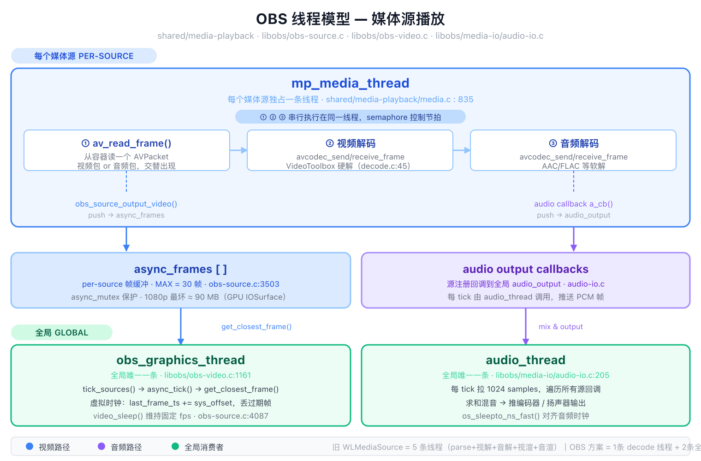

# OBS 媒体源线程模型

> 调研日期：2026-06-29  
> 调研范围：`shared/media-playback/`、`libobs/obs-source.c`、`libobs/obs-video.c`、`libobs/media-io/audio-io.c`



---

## 概览

OBS 媒体源播放共涉及 **3 条线程**，分属两个作用域：

| 线程 | 作用域 | 源文件 | 作用 |
|------|--------|--------|------|
| `mp_media_thread` | 每个媒体源各一条 | `media.c:835` | 读包 + 视频解码 + 音频解码（串行） |
| `obs_graphics_thread` | 全局唯一一条 | `obs-video.c:1161` | 虚拟时钟拉帧、合成渲染 |
| `audio_thread` | 全局唯一一条 | `audio-io.c:205` | 混所有源音频，推编码器/扬声器 |

---

## 一、mp_media_thread（per-source）

### 线程创建

```c
// media.c:866
pthread_create(&m->thread, NULL, mp_media_thread_start, m);
```

### 主循环（media.c:740–830）

```
while (active) {
    1. semaphore 等待（inactive/paused 时挂起）
    2. 检查 flags：seek / reset / pause
    3. mp_media_next_packet()     ← av_read_frame，读一个 AVPacket
    4. mp_decode_next(video)      ← avcodec_send/receive_frame，视频解码
    5. mp_decode_next(audio)      ← avcodec_send/receive_frame，音频解码
    6. mp_media_next_video()      ← 调用 v_cb()，push 到 async_frames
    7. mp_media_next_audio()      ← 调用 a_cb()，push 到 audio_output
}
```

**关键结论**：①②③ 完全串行在同一线程，没有单独的 parse/decode 子线程。  
**性能原因**：VideoToolbox 实际硬解是异步的（发包/收包），decode thread 大部分时间在等 GPU，串行不是瓶颈。

### 硬件加速配置（decode.c:45）

```c
// init_hw_decoder()
av_hwdevice_ctx_create(&hw_device_ctx, AV_HWDEVICE_TYPE_VIDEOTOOLBOX, ...)
codec_ctx->hw_device_ctx = av_buffer_ref(hw_device_ctx);
```

---

## 二、async_frames 缓冲区（per-source）

```c
// obs-internal.h:913
DARRAY(struct obs_source_frame *) async_frames;
pthread_mutex_t async_mutex;          // 保护 async_frames
```

### 关键常量

```c
// obs-source.c:3503
#define MAX_ASYNC_FRAMES 30
```

### 生产（media thread → async_frames）

```c
// obs-source.c:3588
obs_source_output_video(source, frame);   // media thread 调用
  └─ cache_video(source, frame)
       └─ da_push_back(source->async_frames, &output)  // 加锁入队
```

### 消费（graphics thread ← async_frames）

```c
// obs-source.c:4087  ready_async_frame()
// obs-video.c:1342   async_tick()
get_closest_frame(source, sys_time)
  └─ ready_async_frame()
       ├─ 若帧太旧 → da_erase 丢帧（obs-source.c:4127）
       ├─ 若帧未到 → 保留等下一 tick
       └─ 返回最合适的帧
```

### 虚拟时钟算法

```
每 tick：
  sys_offset = 当前系统时间 - 上次 tick 时间
  last_frame_ts += sys_offset      ← 虚拟时钟推进
  取 async_frames 中 timestamp ≤ last_frame_ts 的最新帧
  更旧的帧全部丢弃
```

---

## 三、obs_graphics_thread（全局）

```c
// obs-video.c:1097  obs_graphics_thread_loop()
while (video_output_active) {
    1. update_active_state()
    2. tick_sources()           ← 触发所有源的 async_tick()
    3. render_video()           ← 合成所有源帧到输出画布
    4. render_displays()        ← 刷新预览窗口
    5. video_sleep()            ← 精确睡眠维持目标 fps
}
```

所有媒体源的 `get_closest_frame()` 都在这里调用，**共享同一条线程**。

---

## 四、audio_thread（全局）

```c
// audio-io.c:205
while (audio_active) {
    1. os_sleepto_ns_fast(next_tick)    ← 对齐音频时钟
    2. input_and_output()
         └─ do_audio_output()
              └─ 遍历所有注册的 audio_input_callback，收集 PCM
              └─ 混音求和
              └─ 推编码器 / 音频设备
}
```

- 每 tick 处理 **1024 samples**（约 23ms @44.1kHz）  
- 所有媒体源的音频回调在此线程被调用，**不是 per-source 线程**

---

## 五、谁驱动谁？生产者-消费者模型

视频和音频都是同一个模式：**mp_media_thread 主动推（push），全局线程被动拉（pull）**，中间一个 per-source 缓冲区做解耦。

### 5.1 视频路径

```
mp_media_thread                         obs_graphics_thread
───────────────────                     ────────────────────
解码完一帧                               每 1/fps 醒一次
obs_source_output_video()    →          async_tick()
  da_push_back(async_frames)               get_closest_frame()   ← 按时间戳挑帧
  （async_mutex 保护）                      da_erase(过期旧帧)
```

| 角色 | 节奏由什么决定 | 缓冲满时 | 缓冲空时 |
|------|--------------|---------|---------|
| mp_media_thread（生产者） | 文件 + VideoToolbox 速度 | 上层逻辑限速（MAX=30 保护） | 继续解码填充 |
| obs_graphics_thread（消费者） | 固定 fps 节拍 | 正常消费，丢过期旧帧 | 重用上一帧 `cur_async_frame` |

### 5.2 音频路径

```
mp_media_thread                         audio_thread
───────────────────                     ────────────────────
解码完音频帧                             每 1024 samples 醒一次（墙钟）
obs_source_output_audio()    →          audio_callback()
  resample / filter                        obs_source_audio_render()
  deque_push_back(audio_input_buf[ch])       deque_peek_front(audio_input_buf[ch])
  （PCM float 样本，per channel）              顺序读 N 个 sample，不跳不选
```

| 角色 | 节奏由什么决定 | 缓冲满时 | 缓冲空时 |
|------|--------------|---------|---------|
| mp_media_thread（生产者） | 文件 + 音频解码速度 | deque 有上限（MAX_BUF_SIZE ≈ 1000帧） | 继续解码填充 |
| audio_thread（消费者） | 严格墙钟，os_sleepto_ns_fast() | 正常顺序消费 | 补静音（gap fill） |

**缓冲区**：`struct deque audio_input_buf[MAX_AUDIO_CHANNELS]`（obs-internal.h:868），per-source、per-channel 的 PCM float 样本队列。

### 5.3 视频 vs 音频的关键区别

| 维度 | 视频 | 音频 |
|------|------|------|
| 缓冲区内容 | 完整帧指针（带时间戳） | 连续 PCM float 样本 |
| 消费方式 | 按时间戳挑最近帧，丢旧帧 | 顺序读固定 N 个 sample，不跳 |
| 为什么不同 | 视频可以重复帧或跳帧，人眼不敏感 | 音频必须连续，跳 sample 会有爆音 |

**结论**：两条路径都是 decode 线程主动 push，全局线程被动 pull，彼此不等待。

---

## 六、其他源类型：Camera 与麦克风

OBS 的设计哲学：**不管源是什么，统一走 `obs_source_output_video` / `obs_source_output_audio` 入队，下游完全不感知来源。**

### Camera（摄像头）

```
AVCaptureSession（macOS AVFoundation）
  │
  │  AVCaptureVideoDataOutputSampleBufferDelegate 回调
  │  帧由 OS/硬件主动送来，无需 av_read_frame，无需解码
  ▼
obs_source_output_video()    ← 和媒体文件走同一个入口
  │
  ▼
async_frames [ ]             ← 之后与媒体文件完全相同
  │
  ▼
obs_graphics_thread
```

### 麦克风（Microphone）

```
CoreAudio AudioUnit 回调（macOS）
  │
  │  硬件有新样本 → OS 主动触发，PCM 直接可用，无需解码
  ▼
obs_source_output_audio()    ← 和媒体文件音频走同一个入口
  │
  ▼
audio_input_buf[ch]          ← 之后与媒体文件完全相同
  │
  ▼
audio_thread → 混音 → 输出
```

### 三类源全对比

| | 媒体文件（视频） | Camera | 媒体文件（音频） | 麦克风 |
|--|---------------|--------|---------------|--------|
| 帧从哪来 | FFmpeg 解码 → CVPixelBuffer | 硬件直接给 CVPixelBuffer | FFmpeg 解码 → PCM | 硬件直接给 PCM |
| 驱动方式 | `mp_media_thread` 主动拉文件 | AVFoundation 回调被动通知 | `mp_media_thread` 主动解码 | CoreAudio 回调被动通知 |
| 解码 | 需要 | 不需要 | 需要 | 不需要 |
| 入队函数 | `obs_source_output_video()` | `obs_source_output_video()` | `obs_source_output_audio()` | `obs_source_output_audio()` |
| 下游缓冲区 | `async_frames` | `async_frames` | `audio_input_buf` | `audio_input_buf` |

对应 WorkLabs：`WLCameraSource`（AVCaptureSession）和 `WLMicSource`（CoreAudio）已经是这个模式，与 `wl_player` 最终汇入同一个合成器 `WLVideoMix` / `WLAudioMixer`。

---

## 七、内存占用分析（async_frames）

帧格式通常为 NV12（YUV420），每像素 1.5 字节：

| 分辨率 | 单帧大小 | MAX=30 帧上限 |
|--------|---------|--------------|
| 1080p (1920×1080) | ≈ 3 MB | ≈ 90 MB |
| 4K (3840×2160) | ≈ 12 MB | ≈ 360 MB |

**实际压力远低于上限**：正常播放时缓冲区只有 1~3 帧，30 帧是防止消费端卡死时内存无限增长的保险阀。  
VideoToolbox 硬解帧底层为 `IOSurface`，驻留在 GPU 内存，不计入普通 RSS。

---

## 八、与旧版 WLMediaSource 的对比

| 维度 | 旧 WLMediaSource | OBS mp_media_thread |
|------|-----------------|---------------------|
| 解码线程数 | 5（parse + 视解 + 音解 + 视渲 + 音渲） | 1（串行全部） |
| 渲染线程 | per-source，独立节流 | 全局共享，虚拟时钟 |
| 帧缓冲 | WLNodeQueue（自定义） | async_frames（动态数组） |
| A/V 同步 | 各渲染线程独立 sleep | 全局 tick 统一驱动 |

---

## 九、与 wl_player 的模块映射

| wl_player | OBS 对应 | 说明 |
|-----------|---------|------|
| `decode_thread` | `mp_media_thread` | 1 条，串行 read+decode |
| `video_q`（max=8） | `async_frames`（max=30） | 帧缓冲，背压控制 |
| `audio_q`（max=32） | audio callback buffer | 音频缓冲 |
| `video_render_thread` | `obs_graphics_thread` | 现在 per-player，M3/M4 改为全局共享 |
| `audio_render_thread` | `audio_thread` | 现在 per-player，M3/M4 改为全局共享 |

`VIDEO_QUEUE_MAX = 8` 比 OBS 的 30 保守，覆盖 B 帧延迟和 VT 批量出帧已足够。
