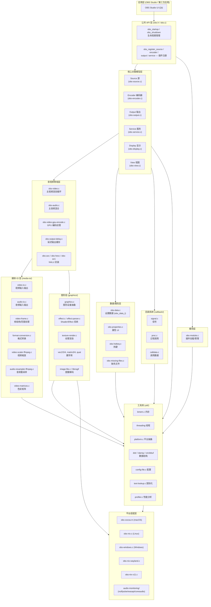
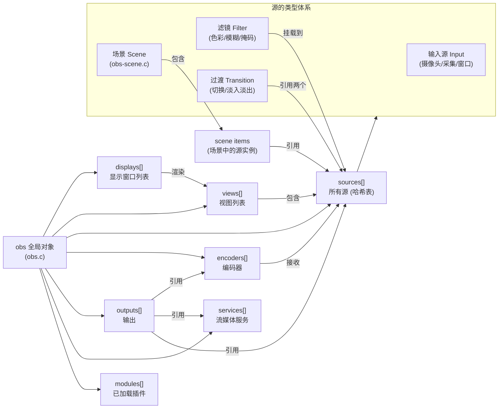
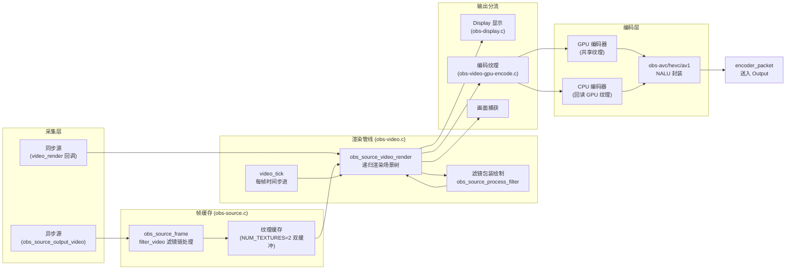
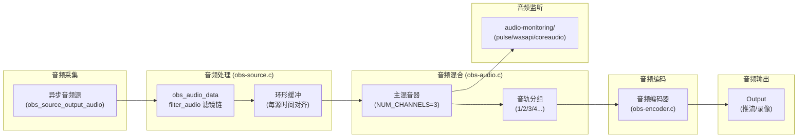
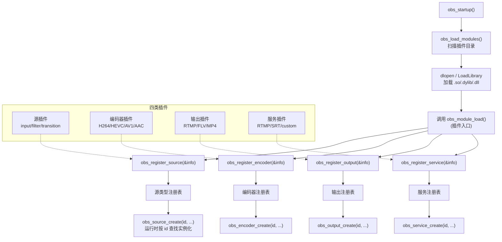
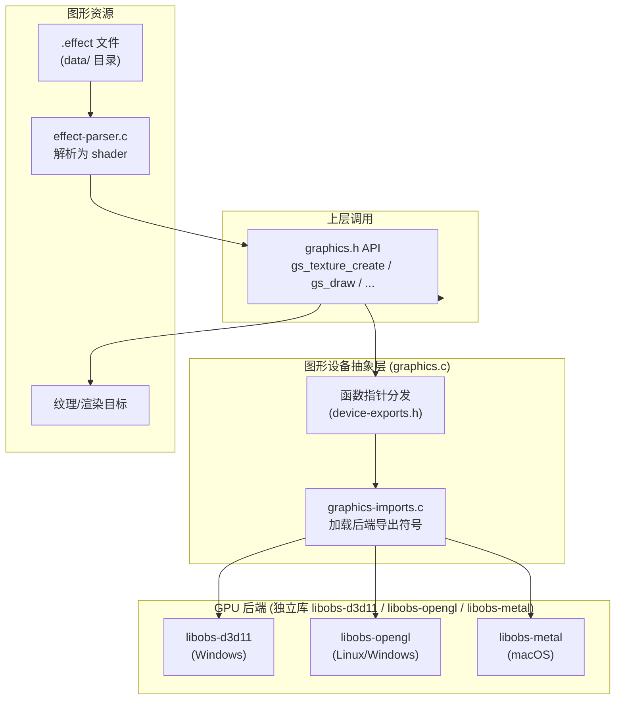
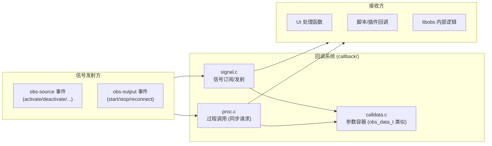

# libobs Core 逻辑架构图

> 源码位置: [`libobs/`](libobs/)
> 本文档用 Mermaid 绘制，GitHub / VSCode 可直接渲染。

---

## 一、整体分层架构

libobs 采用自底向上的分层设计，从平台/工具基础到核心对象模型，再到对外 API。

---

## 二、核心对象模型关系

`obs` 全局对象是所有核心对象的容器，对象之间通过引用组合成完整的采集→处理→编码→输出流水线。

---

## 三、视频渲染数据流

从源采集到最终显示/编码的完整视频流水线。

---

## 四、音频混合数据流

音频从源采集到最终编码输出的完整流水线。

---

## 五、模块/插件加载机制

插件通过统一接口注册到 libobs，由 `obs-module.c` 在启动时加载。

---

## 六、图形设备抽象

libobs 通过函数指针表动态加载 GPU 后端（D3D11 / OpenGL / Metal），对上层提供统一接口。

---

## 七、回调与信号系统

libobs 使用 signal/proc 机制实现对象间松耦合通信。

---

## 八、目录结构速查

```mermaid
flowchart TB
    ROOT["libobs/"]

    ROOT --> CORE_FILES["核心文件 (顶层)"]
    ROOT --> MEDIA_IO["media-io/<br/>媒体 IO"]
    ROOT --> GRAPHICS["graphics/<br/>图形"]
    ROOT --> CALLBACK["callback/<br/>信号/过程调用"]
    ROOT --> UTIL["util/<br/>工具库"]
    ROOT --> AUDIO_MON["audio-monitoring/<br/>音频监听"]
    ROOT --> DATA["data/<br/>.effect 着色器"]
    ROOT --> CMAKE["cmake/<br/>构建配置"]

    CORE_FILES --> CF1["obs.c/obs.h<br/>核心 API"]
    CORE_FILES --> CF2["obs-source.c<br/>源对象"]
    CORE_FILES --> CF3["obs-video.c<br/>视频管线"]
    CORE_FILES --> CF4["obs-audio.c<br/>音频管线"]
    CORE_FILES --> CF5["obs-encoder.c<br/>编码器"]
    CORE_FILES --> CF6["obs-output.c<br/>输出"]
    CORE_FILES --> CF7["obs-scene.c<br/>场景"]
    CORE_FILES --> CF8["obs-module.c<br/>模块加载"]

    MEDIA_IO --> MI1["video-io / audio-io<br/>输入输出"]
    MEDIA_IO --> MI2["video-frame.c<br/>帧/范围处理"]
    MEDIA_IO --> MI3["format-conversion.c<br/>格式转换"]
    MEDIA_IO --> MI4["video-scaler / audio-resampler<br/>缩放/重采样"]

    GRAPHICS --> G1["graphics.c<br/>设备抽象"]
    GRAPHICS --> G2["effect.c / effect-parser.c<br/>Shader 系统"]
    GRAPHICS --> G3["vec/matrix/quat<br/>数学库"]

    UTIL --> U1["bmem / threading / platform<br/>基础"]
    UTIL --> U2["dstr / darray / circlebuf<br/>数据结构"]
    UTIL --> U3["config-file / text-lookup<br/>配置/国际化"]
```

---

## 九、总结

libobs 的核心架构可以归纳为三层流水线：

1. **对象模型层** — `source / encoder / output / service` 四类核心对象，由插件通过 `obs_register_*` 注册、由应用通过 `obs_*_create` 实例化。
2. **管线调度层** — `obs-video.c` 驱动视频渲染循环，`obs-audio.c` 驱动音频混合循环，二者以时间戳对齐。
3. **基础设施层** — `graphics/` 提供 GPU 抽象，`media-io/` 提供帧/格式处理，`util/` 提供跨平台基础，`callback/` 提供松耦合通信。

插件只需实现 `obs_source_info` / `obs_encoder_info` / `obs_output_info` / `obs_service_info` 中的回调函数指针，即可接入完整流水线，无需关心调度细节。
