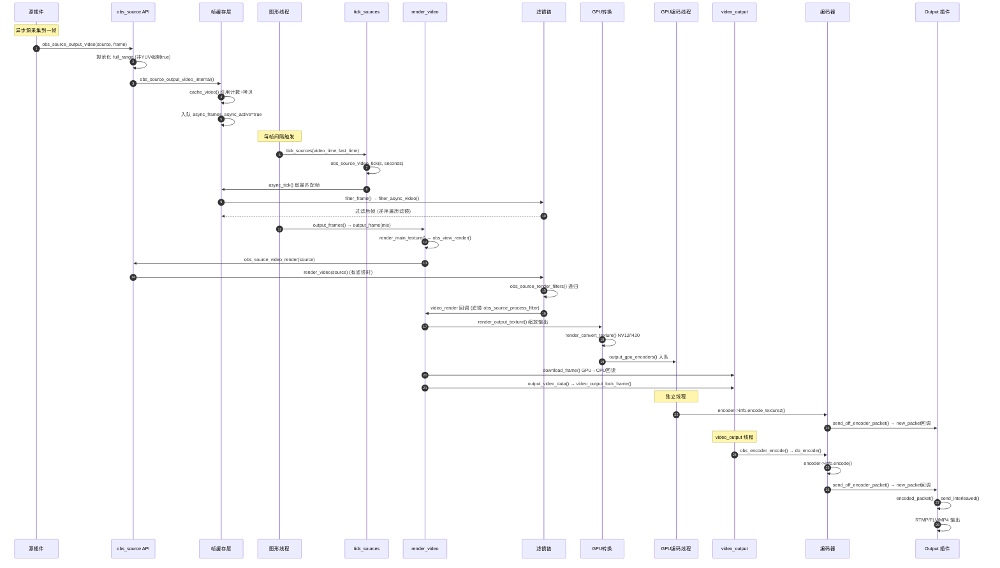
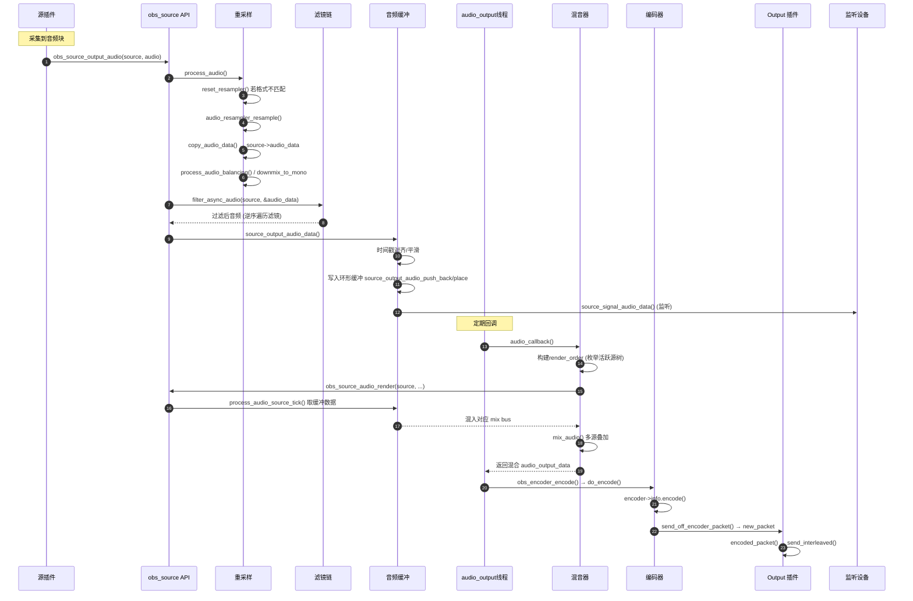
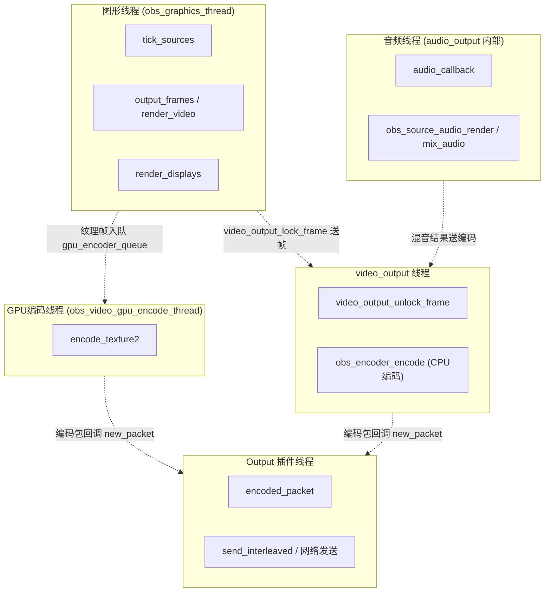

# libobs 视频/音频源完整调用链

> 本文档基于源码追踪，描述从源接入 libobs 到最终输出的完整函数调用链。
> 所有函数名均标注源码位置，可点击跳转。

---

## 一、视频源完整调用链

### 1.1 总览序列图



### 1.2 阶段一：源接入与帧缓存

**入口函数**（插件调用）：

- [`obs_source_output_video(source, frame)`](libobs/obs-source.c#L3727) — v1 接口
- [`obs_source_output_video2(source, frame2)`](libobs/obs-source.c#L3744) — v2 接口（支持 `VIDEO_RANGE_DEFAULT`）

**参数传递过程**：

```
插件构造 obs_source_frame / obs_source_frame2
    ↓ (含 data[]、linesize[]、width/height、timestamp、format、range)
obs_source_output_video[2]()
    ↓ 规范化 range:
    ↓   v1: 非 YUV 强制 full_range=true
    ↓   v2: resolve_video_range(format, range) 推断
obs_source_output_video_internal(source, &new_frame)
    ↓
cache_video(source, frame)
    ↓ 引用计数管理 (refs)
    ↓ 拷贝帧数据到内部缓存 (async_cache)
    ↓ 返回 obs_source_frame*
    ↓
入队 source->async_frames (da_push_back)
source->async_active = true
```

**关键点**：帧数据在此时被**拷贝**到 libobs 内部缓存，插件可立即释放原始帧。引用计数 `refs` 管理多消费者场景。

### 1.3 阶段二：图形线程主循环

**线程入口**：[`obs_graphics_thread(param)`](libobs/obs-video.c#L1240) → [`obs_graphics_thread_loop(context)`](libobs/obs-video.c#L1176)

每帧执行：

```c
// obs-video.c:1176
obs_graphics_thread_loop()
  ├── update_active_states()              // 更新活跃状态
  ├── gs_enter_context / gs_begin_frame   // 进入图形上下文
  ├── tick_sources(video_time, last_time) // 阶段三
  ├── output_frames()                     // 阶段四
  ├── render_displays()                   // 渲染预览窗口
  ├── execute_graphics_tasks()            // 执行延迟任务
  └── video_sleep()                       // 帧率控制休眠
```

### 1.4 阶段三：tick 与滤镜预处理

**调用链**：

```
tick_sources() [obs-video.c:32]
  ├── 遍历 data->tick_callbacks (外部注册的tick)
  └── 遍历 data->sources
        └── obs_source_video_tick(s, seconds) [obs-source.c:1301]
              ├── obs_transition_tick()              // 过渡源
              ├── async_tick(source) [obs-source.c:1271]
              │     ├── get_closest_frame(sys_time)  // 按时间戳取帧
              │     ├── filter_frame(source, &cur_async_frame) [obs-source.c:1204]
              │     │     └── filter_async_video(source, frame) [obs-source.c:3448]
              │     │           └── for filter in filters (逆序):
              │     │                 filter->info.filter_video(filter->data, in)
              │     └── set_async_texture_size()      // 准备纹理
              ├── process_media_actions()             // 媒体控制
              └── obs_source_deferred_update()        // 延迟设置更新
```

**滤镜处理顺序**（异步视频）：

[`filter_async_video`](libobs/obs-source.c#L3448) **逆序**遍历 `source->filters` 数组（最后一个滤镜先执行），每个滤镜的 `filter_video` 回调接收上一级输出作为输入，返回处理后的帧（或 NULL 终止链）。

### 1.5 阶段四：渲染管线

**调用链**：

```
output_frames() [obs-video.c:990]
  └── for each mix: output_frame(mix) [obs-video.c:939]
        ├── gs_enter_context()
        ├── render_video(mix, raw_active, gpu_active, cur_texture) [obs-video.c:584]
        │     ├── render_main_texture(mix) [obs-video.c:171]
        │     │     ├── 执行 draw_callbacks
        │     │     └── obs_view_render(mix->view) [obs-view.c:118]
        │     │           └── for channel in view:
        │     │                 obs_source_video_render(source) [obs-source.c:3036]
        │     │                   └── render_video(source) [obs-source.c:2991]
        │     │                         ├── 有滤镜: obs_source_render_filters() [obs-source.c:2737]
        │     │                         │     └── 递归调用滤镜 video_render
        │     │                         │         (滤镜内部 obs_source_process_filter 绘制目标)
        │     │                         ├── 异步源: obs_source_update_async_video()
        │     │                         │           → obs_source_draw_texture()
        │     │                         └── 同步源: obs_source_main_render()
        │     │                                   → source->info.video_render(data, effect)
        │     ├── render_output_texture(video)  // 缩放输出纹理
        │     ├── render_convert_texture()      // GPU格式转换 NV12/I420
        │     ├── output_gpu_encoders() [obs-video.c:562]  // GPU编码入队
        │     │     └── encode_gpu() → queue_frame()
        │     └── stage_output_texture()         // 暂存到 staging surface
        ├── download_frame(prev_texture, &frame)  // GPU→CPU回读(raw编码用)
        └── output_video_data(&frame, count) [obs-video.c:867]
              ├── video_output_lock_frame()        // 锁定video_output帧
              ├── set_gpu_converted_data() 或 copy_rgbx_frame()
              └── video_output_unlock_frame()      // 送入video_output队列
```

**滤镜渲染顺序**（同步视频）：

与异步不同，同步滤镜在**渲染时**而非 tick 时处理。[`obs_source_render_filters`](libobs/obs-source.c#L2737) 会调用第一个滤镜的 `video_render`，滤镜内部通过 [`obs_source_process_filter`](libobs/obs-source.c) 调用下一个源/滤镜，形成递归调用栈。顺序是**正序**（第一个滤镜先包装）。

### 1.6 阶段五：编码

#### GPU 编码路径（独立线程）

```
obs_video_gpu_encode_thread [obs-video-gpu-encode.c]
  ├── 从 gpu_encoder_queue 取纹理帧
  ├── video_pause_check()              // 暂停检查
  ├── encoder->info.encode_texture2()  // 调用插件GPU编码 (新版)
  │   或 encoder->info.encode_texture()// (旧版)
  └── send_off_encoder_packet(encoder, success, received, &pkt) [obs-encoder.c:1300]
        ├── 计算 dts_usec (系统时间对齐)
        └── for cb in encoder->callbacks:
              send_packet(encoder, cb, pkt) [obs-encoder.c:1264]
                └── cb->new_packet(cb->param, packet)  // 回调到output
```

#### CPU 编码路径

```
video_output 线程从队列取帧
  └── obs_encoder_encode(encoder, frame) [obs-encoder.c]
        └── do_encode(encoder, &enc_frame) [obs-encoder.c:1339]
              ├── encoder->info.update()  // 若reconfigure请求
              ├── encoder->info.encode(encoder->data, frame, &pkt, &received)
              │     // 调用编码器插件的encode回调
              └── send_off_encoder_packet() → send_packet() → cb->new_packet()
```

### 1.7 阶段六：输出封装与发送

```
default_encoded_callback(param, packet) [obs-output.c:2064]
  ├── packet->track_idx = get_encoder_index(output, packet)
  ├── output->info.encoded_packet(output->data, packet)  // 调用输出插件
  │     └── 插件内部 (如 obs-outputs/rtmp-output.c):
  │           ├── send_interleaved(output)  // 音视频包交织排序
  │           ├── FLV/RTMP 封装
  │           └── 网络发送 / 文件写入
  └── output->total_frames++ (视频包时)
```

**raw 视频输出路径**（无编码，如录制原始帧）：

```
default_raw_video_callback(param, frame) [obs-output.c:2081]
  ├── video_pause_check()
  └── output->info.raw_video(output->data, frame)  // 直接送原始帧给插件
```

---

## 二、音频源完整调用链

### 2.1 总览序列图



### 2.2 阶段一：源接入与重采样

**入口函数**：[`obs_source_output_audio(source, audio_in)`](libobs/obs-source.c#L4213)

**参数传递与处理**：

```
插件构造 obs_source_audio
    ↓ (含 data[]、frames、timestamp、format、speakers、samples_per_sec)
obs_source_output_audio() [obs-source.c:4213]
  ├── 清零多余声道指针 (get_audio_planes)
  ├── process_audio(source, &audio) [obs-source.c:4171]
  │     ├── reset_resampler() [obs-source.c:4058]
  │     │     // 若 format/speakers/samples_per_sec 与输出不匹配:
  │     │     // audio_resampler_create() 创建重采样器
  │     ├── audio_resampler_resample()  // FFmpeg 重采样
  │     ├── copy_audio_data() [obs-source.c:4093]
  │     │     // 拷贝到 source->audio_data (obs_audio_data)
  │     ├── process_audio_balancing()   // 立体声平衡调节
  │     └── downmix_to_mono_planar()    // 强制单声道下混
  ├── filter_async_audio(source, &source->audio_data) [obs-source.c:4038]
  │     └── for filter in filters (逆序):
  │           filter->info.filter_audio(filter->data, in)
  └── source_output_audio_data(source, &data) [obs-source.c:1537]
```

### 2.3 阶段二：时间戳对齐与缓冲

```
source_output_audio_data() [obs-source.c:1537]
  ├── 检测 direct timestamp (与os_time接近)
  ├── reset_audio_timing() 或 时间戳平滑
  ├── 计算 next_audio_ts_min
  ├── 应用 timing_adjust / sync_offset / resample_offset
  ├── source_output_audio_push_back() 或 source_output_audio_place()
  │     // 写入 source->audio_input_buf (环形缓冲, 按时间戳位置)
  └── source_signal_audio_data(source, data, muted) [obs-source.c:1436]
        // 触发音频捕获回调 (obs_source_add_audio_capture_callback 注册)
        // 同时触发音频监听 (audio-monitoring/)
```

### 2.4 阶段三：混音循环

**线程**：`audio_output` 内部线程（由 [`audio-io.c`](libobs/media-io/audio-io.c) 驱动），定期回调 [`audio_callback`](libobs/obs-audio.c#L518)。

```
audio_callback(param, start_ts, end_ts, out_ts, mixers, mixes) [obs-audio.c:518]
  ├── 构建 render_order:
  │     ├── 遍历 obs->video.mixes → view → channels
  │     │     └── obs_source_enum_active_tree(source, push_audio_tree)
  │     └── 遍历 data->first_audio_source (独立音频源)
  ├── for source in render_order:
  │     └── obs_source_audio_render(source, mixers, channels, sample_rate, size) [obs-source.c:5770]
  │           ├── 有 audio_render 回调: custom_audio_render()  // 同步音频源
  │           ├── 有 audio_mix 回调: audio_submix()             // 子混音
  │           └── 否则: process_audio_source_tick(source, ...)
  │                 ├── 从 audio_input_buf 取对应时间范围数据
  │                 ├── mix_audio() [obs-audio.c:48]  // 叠加到 mixes
  │                 └── discard_if_stopped()           // 静音检测
  ├── find_min_ts() / mark_invalid_sources() / calc_min_ts()  // 时间对齐
  └── release_audio_sources()
```

**混音逻辑**：[`mix_audio`](libobs/obs-audio.c#L48) 将每个源的音频数据按 `mixers` 位掩码叠加到对应的 mix bus（最多 `MAX_AUDIO_MIXES` 路独立混音）。

### 2.5 阶段四：音频编码与输出

与视频编码路径相同：

```
audio_output 将 mixes 送出
  └── obs_encoder_encode(encoder, frame)
        └── do_encode() [obs-encoder.c:1339]
              ├── encoder->info.encode()  // 调用音频编码器 (AAC/Opus)
              └── send_off_encoder_packet()
                    └── send_packet() → cb->new_packet()
                          └── default_encoded_callback() [obs-output.c:2064]
                                └── output->info.encoded_packet()
                                      └── send_interleaved() // 与视频包交织
```

### 2.6 阶段五：音频监听（旁路）

独立于编码输出，监听路径用于实时回放给用户：

```
source_signal_audio_data() [obs-source.c:1436]
  └── 触发 audio capture callbacks
        └── audio-monitoring/ 模块
              ├── pulseaudio-output.c (Linux)
              ├── wasapi-output.c (Windows)
              └── coreaudio-output.c (macOS)
```

---

## 三、关键调用关系总结

### 3.1 视频数据流核心函数索引

| 阶段 | 函数 | 文件:行 | 作用 |
|---|---|---|---|
| 接入 | `obs_source_output_video` | [obs-source.c:3727](libobs/obs-source.c#L3727) | v1 视频帧入口 |
| 接入 | `obs_source_output_video2` | [obs-source.c:3744](libobs/obs-source.c#L3744) | v2 视频帧入口 |
| 接入 | `obs_source_output_video_internal` | [obs-source.c:3693](libobs/obs-source.c#L3693) | 内部规范化+缓存 |
| 接入 | `cache_video` | obs-source.c | 帧拷贝+引用计数 |
| tick | `obs_source_video_tick` | [obs-source.c:1301](libobs/obs-source.c#L1301) | 源tick入口 |
| tick | `async_tick` | [obs-source.c:1271](libobs/obs-source.c#L1271) | 异步源取帧+滤镜 |
| 滤镜 | `filter_async_video` | [obs-source.c:3448](libobs/obs-source.c#L3448) | 异步视频滤镜链(逆序) |
| 滤镜 | `filter_frame` | [obs-source.c:1204](libobs/obs-source.c#L1204) | 滤镜包装 |
| 渲染 | `obs_graphics_thread_loop` | [obs-video.c:1176](libobs/obs-video.c#L1176) | 图形线程主循环 |
| 渲染 | `tick_sources` | [obs-video.c:32](libobs/obs-video.c#L32) | 驱动所有源tick |
| 渲染 | `output_frames` | [obs-video.c:990](libobs/obs-video.c#L990) | 驱动所有mix输出 |
| 渲染 | `output_frame` | [obs-video.c:939](libobs/obs-video.c#L939) | 单mix帧输出 |
| 渲染 | `render_video` | [obs-video.c:584](libobs/obs-video.c#L584) | 渲染+转换+编码入队 |
| 渲染 | `render_main_texture` | [obs-video.c:171](libobs/obs-video.c#L171) | 渲染主纹理 |
| 渲染 | `obs_view_render` | [obs-view.c:118](libobs/obs-view.c#L118) | 渲染视图各channel |
| 渲染 | `obs_source_video_render` | [obs-source.c:3036](libobs/obs-source.c#L3036) | 源渲染入口 |
| 渲染 | `render_video(source)` | [obs-source.c:2991](libobs/obs-source.c#L2991) | 源内部渲染分发 |
| 滤镜 | `obs_source_render_filters` | [obs-source.c:2737](libobs/obs-source.c#L2737) | 同步滤镜链(正序递归) |
| 渲染 | `obs_source_main_render` | obs-source.c | 调用 info.video_render |
| 转换 | `render_convert_texture` | [obs-video.c:360](libobs/obs-video.c#L360) | GPU格式转换 |
| GPU编码 | `output_gpu_encoders` | [obs-video.c:562](libobs/obs-video.c#L562) | GPU编码入队 |
| GPU编码 | `encode_gpu` | [obs-video.c:554](libobs/obs-video.c#L554) | GPU编码循环 |
| GPU编码 | `encoder->info.encode_texture2` | obs-video-gpu-encode.c:145 | 插件GPU编码 |
| 回读 | `download_frame` | [obs-video.c:634](libobs/obs-video.c#L634) | GPU→CPU回读 |
| 输出 | `output_video_data` | [obs-video.c:867](libobs/obs-video.c#L867) | 送入video_output |
| 编码 | `do_encode` | [obs-encoder.c:1339](libobs/obs-encoder.c#L1339) | CPU编码入口 |
| 编码 | `encoder->info.encode` | obs-encoder.c:1362 | 插件编码回调 |
| 编码 | `send_off_encoder_packet` | [obs-encoder.c:1300](libobs/obs-encoder.c#L1300) | 编码包分发 |
| 编码 | `send_packet` | [obs-encoder.c:1264](libobs/obs-encoder.c#L1264) | 回调output |
| 输出 | `default_encoded_callback` | [obs-output.c:2064](libobs/obs-output.c#L2064) | output接收编码包 |
| 输出 | `output->info.encoded_packet` | obs-output.c:2071 | 插件处理封装发送 |

### 3.2 音频数据流核心函数索引

| 阶段 | 函数 | 文件:行 | 作用 |
|---|---|---|---|
| 接入 | `obs_source_output_audio` | [obs-source.c:4213](libobs/obs-source.c#L4213) | 音频入口 |
| 重采样 | `process_audio` | [obs-source.c:4171](libobs/obs-source.c#L4171) | 重采样+平衡 |
| 重采样 | `reset_resampler` | [obs-source.c:4058](libobs/obs-source.c#L4058) | 创建重采样器 |
| 重采样 | `audio_resampler_resample` | media-io/audio-resampler.h | FFmpeg重采样 |
| 拷贝 | `copy_audio_data` | [obs-source.c:4093](libobs/obs-source.c#L4093) | 拷贝到audio_data |
| 滤镜 | `filter_async_audio` | [obs-source.c:4038](libobs/obs-source.c#L4038) | 音频滤镜链(逆序) |
| 缓冲 | `source_output_audio_data` | [obs-source.c:1537](libobs/obs-source.c#L1537) | 时间戳对齐 |
| 缓冲 | `source_output_audio_push_back` | obs-source.c:1498 | 追加缓冲 |
| 缓冲 | `source_output_audio_place` | obs-source.c:1460 | 按位置插入缓冲 |
| 信号 | `source_signal_audio_data` | obs-source.c:1436 | 触发捕获/监听回调 |
| 混音 | `audio_callback` | [obs-audio.c:518](libobs/obs-audio.c#L518) | 混音主回调 |
| 混音 | `obs_source_audio_render` | [obs-source.c:5770](libobs/obs-source.c#L5770) | 源音频渲染 |
| 混音 | `process_audio_source_tick` | obs-source.c | 取缓冲并混音 |
| 混音 | `mix_audio` | [obs-audio.c:48](libobs/obs-audio.c#L48) | 叠加到mix bus |
| 编码 | `do_encode` | [obs-encoder.c:1339](libobs/obs-encoder.c#L1339) | 音频编码(同视频) |
| 输出 | `default_encoded_callback` | [obs-output.c:2064](libobs/obs-output.c#L2064) | output接收 |

### 3.3 滤镜处理顺序对比

| 类型 | 函数 | 遍历顺序 | 时机 |
|---|---|---|---|
| 异步视频滤镜 | `filter_async_video` | **逆序** (最后一个先) | tick 阶段 |
| 同步视频滤镜 | `obs_source_render_filters` | **正序** (第一个先包装) | render 阶段 |
| 音频滤镜 | `filter_async_audio` | **逆序** (最后一个先) | 接入阶段 |

> **逆序**的原因：滤镜链存储顺序是"用户添加顺序"，最先添加的滤镜应该最后处理（最贴近源）。逆序遍历让最后一个添加的滤镜先作用于原始数据，符合视觉直觉。
> **同步视频正序**的原因：同步滤镜是包装式的（filter wraps source draw），第一个滤镜在最外层包装，最后才调用到源本身。

---

## 四、线程模型



**关键同步点**：
- 图形线程与 GPU 编码线程通过 `gpu_encoder_queue` / `gpu_encoder_avail_queue` 交换纹理，用 `gpu_encoder_mutex` 保护。
- 图形线程与 video_output 通过 `video_output_lock_frame` / `video_output_unlock_frame` 交换帧。
- 音频线程与源接入通过 `source->audio_buf_mutex` 保护环形缓冲。
- 编码器与 output 通过 `encoder->callbacks` 回调链传递编码包，用 `callbacks_mutex` 保护。

---

## 五、完整生命周期一句话总结

**视频**：插件 `obs_source_output_video` → 缓存 `cache_video` → tick 取帧 `async_tick` + 滤镜 `filter_async_video` → 渲染 `obs_source_video_render` + 同步滤镜 → GPU转换 `render_convert_texture` → GPU编码 `encode_texture2` 或 CPU回读 `download_frame` → `do_encode` → `send_off_encoder_packet` → output `encoded_packet` → 网络发送。

**音频**：插件 `obs_source_output_audio` → 重采样 `process_audio` → 滤镜 `filter_async_audio` → 缓冲 `source_output_audio_data` → 混音 `audio_callback` / `mix_audio` → 编码 `do_encode` → output `encoded_packet` → 网络发送。

---

## 六、Preview 预览渲染路径

> Preview 与编码输出是**同帧内的两条独立路径**，在图形线程主循环中顺序执行。

### 6.1 在主循环中的位置

| 顺序 | 调用 | 作用 |
|---|---|---|
| 1 | `tick_sources()` | 驱动所有源 tick + 异步滤镜 |
| 2 | `output_frames()` | 渲染主纹理 + 编码入队 + video_output |
| 3 | **`render_displays()`** | **渲染所有预览窗口（Preview 入口）** |
| 4 | `execute_graphics_tasks()` | 执行延迟图形任务 |
| 5 | `video_sleep()` | 帧率控制 |

Preview 拿到的是**当帧刚渲染好的纹理**，延迟为零帧（同帧内复用）。

### 6.2 完整调用链

```
obs_graphics_thread_loop() [obs-video.c:1176]
  ├── output_frames()                       // 渲染主纹理 (编码用)
  │     └── render_main_texture()           // 生成 main_mix->render_texture
  │
  └── render_displays() [obs-video.c:90]    // ← Preview 入口
        └── for display in obs->data.first_display:
              render_display(display) [obs-display.c:240]
                ├── render_display_begin() [obs-display.c:180]
                │     ├── gs_load_swapchain(display->swap)   // 加载预览窗口交换链
                │     ├── gs_resize() / gs_clear()           // 清屏+投影
                │     └── gs_set_viewport()
                ├── 执行 display->draw_callbacks             // UI 注册的绘制回调
                │     └── OBSBasic::RenderMain() [window-basic-main.cpp:4534]
                │           ├── 设置预览缩放/位置 (previewX/Y/CX/CY)
                │           ├── 普通模式:
                │           │     obs_render_main_texture_src_color_only() [obs.c:2216]
                │           │       └── obs_render_main_texture_internal() [obs.c:2157]
                │           │             └── 绘制 main_mix->render_texture (复用阶段四纹理)
                │           ├── Studio Mode:
                │           │     obs_source_video_render(source)  // 重新渲染当前场景
                │           └── 绘制安全区域/辅助线等 UI 元素
                └── render_display_end()
                    // 图形后端自动 present/swap 到屏幕
```

### 6.3 两种渲染模式

#### 模式一：复用主纹理（普通模式）

普通模式下 Preview **不重新渲染场景**，而是复用 `output_frames()` 阶段已渲染好的 [`main_mix->render_texture`](libobs/obs.c#L2226-L2230)：

```c
// obs.c:2157
static void obs_render_main_texture_internal(...)
{
    video = obs->video.main_mix;
    if (!video->texture_rendered) return;
    // 用 default effect 的 "Draw"/"DrawTonemap"/"DrawMultiply" 技术
    // 把 render_texture 画到当前 display 的 swapchain
}
```

这是一条**只读采样**路径——编码和 Preview 共享同一张已渲染纹理，零额外渲染开销。

颜色空间处理：
- `GS_CS_SRGB` / `GS_CS_SRGB_16F`：源为 709 Extended 时用 `DrawTonemap` 技术色调映射
- `GS_CS_709_SCRGB`：用 `DrawMultiply` 技术，乘以 SDR 白电平/80
- `GS_CS_709_EXTENDED`：直接 `Draw`

#### 模式二：重新渲染（Studio Mode）

Studio Mode 下 Preview 场景可能与 Program 输出不同，所以直接调用 [`obs_source_video_render(source)`](UI/window-basic-main.cpp#L4574) 重新渲染当前 Preview 场景源（走完整的滤镜+渲染递归）。

```c
// window-basic-main.cpp:4567
if (window->IsPreviewProgramMode()) {
    window->DrawBackdrop(...);
    OBSScene scene = window->GetCurrentScene();
    obs_source_t *source = obs_scene_get_source(scene);
    if (source)
        obs_source_video_render(source);           // 重新渲染场景
} else {
    obs_render_main_texture_src_color_only();      // 复用主纹理
}
```

### 6.4 UI 注册绘制回调

OBS Studio UI 在创建预览窗口时注册 draw callback：

```c
// window-basic-main.cpp:2160
obs_display_add_draw_callback(window->GetDisplay(),
                              OBSBasic::RenderMain, this);
```

每个 `obs_display` 对应一个原生窗口：

| Display 用途 | 注册位置 |
|---|---|
| 主预览面板 (Preview) | [window-basic-main.cpp:2160](UI/window-basic-main.cpp#L2160) |
| 投影窗口 (Projector) | [window-projector.cpp](UI/window-projector.cpp) |
| 属性预览 (Properties) | [window-basic-properties.cpp](UI/window-basic-properties.cpp) |
| 滤镜预览 (Filters) | [window-basic-filters.cpp](UI/window-basic-filters.cpp) |
| 交互预览 (Interaction) | [window-basic-interaction.cpp](UI/window-basic-interaction.cpp) |
| 多视图 (Multiview) | [multiview.cpp](UI/multiview.cpp) |

所有 display 都通过 [`render_displays()`](libobs/obs-video.c#L90) 统一驱动，每个 display 拥有独立的 swapchain。

### 6.5 RenderMain 完整流程

[`OBSBasic::RenderMain`](UI/window-basic-main.cpp#L4534) 是预览绘制的主函数，流程：

1. 获取视频信息 `obs_get_video_info(&ovi)`
2. 计算预览缩放尺寸 `previewCX/CY = previewScale * base_width/height`
3. 保存当前 viewport/projection
4. 绘制溢出边界 `DrawOverflow()`
5. 设置正交投影 `gs_ortho(0, base_width, 0, base_height, ...)`
6. 设置预览 viewport `gs_set_viewport(previewX, previewY, previewCX, previewCY)`
7. **渲染场景内容**（两种模式，见 6.3）
8. 恢复投影，绘制安全区域 `RenderSafeAreas()`
9. 绘制场景编辑 UI `DrawSceneEditing()`
10. 绘制间距辅助线 `DrawSpacingHelpers()`
11. 恢复 viewport/projection

### 6.6 关键函数索引

| 函数 | 文件:行 | 作用 |
|---|---|---|
| `render_displays` | [obs-video.c:90](libobs/obs-video.c#L90) | 遍历所有 display 渲染 |
| `render_display` | [obs-display.c:240](libobs/obs-display.c#L240) | 渲染单个 display |
| `render_display_begin` | [obs-display.c:180](libobs/obs-display.c#L180) | 加载 swapchain + 清屏 + 投影 |
| `render_display_end` | [obs-display.c:235](libobs/obs-display.c#L235) | 结束场景 |
| `OBSBasic::RenderMain` | [window-basic-main.cpp:4534](UI/window-basic-main.cpp#L4534) | UI 预览绘制主函数 |
| `obs_render_main_texture` | [obs.c:2210](libobs/obs.c#L2210) | 绘制主纹理（标准混合） |
| `obs_render_main_texture_src_color_only` | [obs.c:2216](libobs/obs.c#L2216) | 绘制主纹理（仅源色） |
| `obs_render_main_texture_internal` | [obs.c:2157](libobs/obs.c#L2157) | 内部实现，颜色空间处理 |
| `obs_get_main_texture` | [obs.c:2222](libobs/obs.c#L2222) | 获取主输出纹理 |
| `obs_display_add_draw_callback` | [obs.h:996](libobs/obs.h#L996) | 注册绘制回调 |
