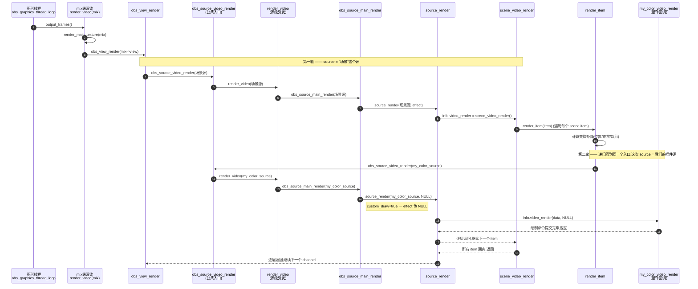

# 动手写一个最小 OBS 源插件(示例代码)

> 配套阅读:[obs_source_info.md](obs_source_info.md)(结构体字段详解)、[libobs_data_flow.md](libobs_data_flow.md)(帧进入 libobs 后的完整旅程)。
> 本文代码参考了 OBS 官方仓库 `plugins/image-source/color-source.c` 和 `test/test-input/test-random.c` 的写法,可直接对照。

---

## 一、写插件的三步套路

写一个 OBS 插件,本质就是**填表 + 注册**:

1. 实现一组 C 函数(创建/销毁/渲染……);
2. 把函数指针填进 `struct obs_source_info` 这张"表"(vtable);
3. 在插件入口 `obs_module_load()` 里调用 `obs_register_source()` 把表交给 libobs。

之后 libobs 会在合适的时机回调你的函数 —— 你不需要关心线程调度、滤镜链、混音、编码,那些都是 libobs 的事。

一个插件 = 一个动态库(macOS 上是 `.plugin` bundle 里的可执行文件),模块级样板代码只有三行:

```c
#include <obs-module.h>

OBS_DECLARE_MODULE()                                  /* 声明模块必需的导出符号 */
OBS_MODULE_USE_DEFAULT_LOCALE("my-plugin", "en-US")   /* 国际化(可选但惯例都写) */

bool obs_module_load(void)                            /* OBS 启动时 dlopen 后调用 */
{
    obs_register_source(&my_color_source_info);       /* 注册源类型,见下文 */
    obs_register_source(&my_async_source_info);
    return true;                                      /* 返回 false 则模块加载失败 */
}
```

对应你在 [libobs_architecture.md](libobs_architecture.md) 第五节画的插件加载流程:`obs_startup()` → 扫描插件目录 → `dlopen` → 调 `obs_module_load()` → 注册进源类型注册表 → UI"添加源"菜单里就能看到它。

---

## 二、版本一:同步源(拉模式)—— 纯色源

**同步源**的意思是:OBS 图形线程每帧渲染场景时,轮到你了就调你的 `video_render` 回调,你**当场用 GPU 画**。就像老师点名,点到你你才答题 —— 你自己不持有画面数据,每帧现画。

这是最简单的源:画一个纯色矩形,颜色和尺寸可以在属性面板改。

```c
#include <obs-module.h>
#include <graphics/vec4.h>

/* ---- 私有数据:相当于 C++ 的 this,由 create 分配、destroy 释放 ---- */
struct my_color_source {
    obs_source_t *source;   /* 反向引用 libobs 的源对象(本例其实用不上,惯例保留) */
    struct vec4   color;    /* 归一化 RGBA 颜色 */
    uint32_t      width;
    uint32_t      height;
};

static const char *my_color_get_name(void *type_data)
{
    UNUSED_PARAMETER(type_data);
    return "My Color Source";        /* UI"添加源"菜单里显示的名字 */
}

/* 设置变化时被调用(创建时我们也主动调一次,复用逻辑) */
static void my_color_update(void *data, obs_data_t *settings)
{
    struct my_color_source *s = data;
    uint32_t rgba = (uint32_t)obs_data_get_int(settings, "color");
    vec4_from_rgba(&s->color, rgba);            /* 0xAABBGGRR → 归一化 vec4 */
    s->width  = (uint32_t)obs_data_get_int(settings, "width");
    s->height = (uint32_t)obs_data_get_int(settings, "height");
}

static void *my_color_create(obs_data_t *settings, obs_source_t *source)
{
    struct my_color_source *s = bzalloc(sizeof(*s));   /* libobs 的分配器,自动清零 */
    s->source = source;
    my_color_update(s, settings);                      /* 用初始设置填一遍 */
    return s;                                          /* 返回值就是之后回调的 data */
}

static void my_color_destroy(void *data)
{
    bfree(data);
}

/* 核心:图形线程每帧渲染场景走到本源时调用(在 GPU 上下文内,可以直接下绘制命令) */
static void my_color_video_render(void *data, gs_effect_t *effect)
{
    struct my_color_source *s = data;

    /* 拿 libobs 内置的"纯色" effect(shader),不用自己写 .effect 文件 */
    gs_effect_t *solid = obs_get_base_effect(OBS_EFFECT_SOLID);
    gs_effect_set_vec4(gs_effect_get_param_by_name(solid, "color"), &s->color);

    while (gs_effect_loop(solid, "Solid"))             /* 遍历 technique 的 pass */
        gs_draw_sprite(NULL, 0, s->width, s->height);  /* 画一个 w×h 的矩形 */

    UNUSED_PARAMETER(effect);   /* 我们声明了 CUSTOM_DRAW,此参数为 NULL */
}

/* 同步源必须报告自己的尺寸,场景布局(缩放/对齐)靠它 */
static uint32_t my_color_get_width(void *data)
{
    return ((struct my_color_source *)data)->width;
}
static uint32_t my_color_get_height(void *data)
{
    return ((struct my_color_source *)data)->height;
}

/* 属性面板长什么样(UI 自动根据它生成控件) */
static obs_properties_t *my_color_get_properties(void *data)
{
    obs_properties_t *props = obs_properties_create();
    obs_properties_add_color(props, "color", "Color");
    obs_properties_add_int(props, "width",  "Width",  1, 4096, 1);
    obs_properties_add_int(props, "height", "Height", 1, 4096, 1);
    UNUSED_PARAMETER(data);
    return props;
}

/* 默认设置(第一次创建、或用户点"恢复默认"时) */
static void my_color_get_defaults(obs_data_t *settings)
{
    obs_data_set_default_int(settings, "color", 0xFF00FF00);  /* 不透明绿 */
    obs_data_set_default_int(settings, "width",  400);
    obs_data_set_default_int(settings, "height", 300);
}

/* ---- 填表:把上面的函数指针挂进 vtable ---- */
struct obs_source_info my_color_source_info = {
    .id             = "my_color_source",          /* 全局唯一字符串 ID */
    .type           = OBS_SOURCE_TYPE_INPUT,
    .output_flags   = OBS_SOURCE_VIDEO |          /* 我输出视频 */
                      OBS_SOURCE_CUSTOM_DRAW,     /* 我自己管绘制(effect 传 NULL) */
    .get_name       = my_color_get_name,
    .create         = my_color_create,
    .destroy        = my_color_destroy,
    .update         = my_color_update,
    .video_render   = my_color_video_render,
    .get_width      = my_color_get_width,
    .get_height     = my_color_get_height,
    .get_properties = my_color_get_properties,
    .get_defaults   = my_color_get_defaults,
    .icon_type      = OBS_ICON_TYPE_COLOR,
};
```

**它在数据流里的位置**:对照 [libobs_data_flow.md](libobs_data_flow.md) 1.5 节 —— 图形线程 `output_frame()` → `obs_view_render()` → `obs_source_video_render(本源)` → 走"同步源"分支 → `obs_source_main_render()` → 调到我们的 `my_color_video_render`。没有帧缓存、没有拷贝,每帧现画。

---

## 三、版本二:异步源(推模式)—— 滚动条纹测试源

**异步源**是 WorkLabs 里摄像头/媒体文件源的同款模式:你**自己开线程**产帧(采集回调、解码线程都算),产出一帧就调 `obs_source_output_video()` 塞给 libobs;libobs 把帧拷进内部缓存,tick 时按时间戳挑最合适的一帧变成纹理参与合成 —— 就是你分析过的 `cache_video` → `async_frames` 队列 → `async_tick` 挑帧那条链(data_flow 1.2/1.4 节)。

打个比方:同步源是"点到才答题",异步源是"你按自己的节奏往老师桌上交卷,老师按时间戳挑最新的一份批改"。

这个例子开一个 30fps 的产帧线程,画一条来回滚动的白色竖条(经典测试图案):

```c
#include <obs-module.h>
#include <util/platform.h>      /* os_gettime_ns / os_sleepto_ns */
#include <util/threading.h>     /* os_event */
#include <pthread.h>

#define TEX_W  640
#define TEX_H  360
#define FPS_NS (1000000000ULL / 30)   /* 30fps 的帧间隔(纳秒) */

struct my_async_source {
    obs_source_t *source;
    pthread_t     thread;
    os_event_t   *stop_signal;   /* 通知产帧线程退出的事件 */
    bool          initialized;   /* 线程是否成功启动(destroy 时据此决定要不要 join) */
};

/* 画测试图案:深灰底 + 一根按帧号滚动的白色竖条 */
static void fill_pattern(uint32_t *pixels, uint64_t frame_no)
{
    uint32_t bar_x = (uint32_t)(frame_no * 4 % TEX_W);
    for (uint32_t y = 0; y < TEX_H; y++) {
        for (uint32_t x = 0; x < TEX_W; x++) {
            bool on_bar = (x >= bar_x && x < bar_x + 20);
            pixels[y * TEX_W + x] = on_bar ? 0xFFFFFFFF   /* BGRX 白 */
                                           : 0xFF202020;  /* BGRX 深灰 */
        }
    }
}

/* ---- 产帧线程:插件自己的线程,与 libobs 的图形线程完全解耦 ---- */
static void *frame_thread(void *data)
{
    struct my_async_source *s = data;
    uint32_t *pixels = bzalloc(TEX_W * TEX_H * 4);

    /* obs_source_frame 只是"描述帧"的壳:数据指针、行距、尺寸、格式、时间戳。
     * 真实采集场景里 data/linesize 指向你的采集缓冲(比如 CVPixelBuffer 的基址)。 */
    struct obs_source_frame frame = {
        .data     = { [0] = (uint8_t *)pixels },
        .linesize = { [0] = TEX_W * 4 },
        .width    = TEX_W,
        .height   = TEX_H,
        .format   = VIDEO_FORMAT_BGRX,
    };

    uint64_t cur_time = os_gettime_ns();
    uint64_t frame_no = 0;

    while (os_event_try(s->stop_signal) == EAGAIN) {   /* 没收到停止信号就继续 */
        fill_pattern(pixels, frame_no++);
        frame.timestamp = cur_time;                    /* 单调递增的时间戳(ns) */

        /* 推帧入口。libobs 内部 cache_video() 会把数据【拷贝】进 async_cache,
         * 所以本函数返回后 pixels 可以立刻复用/释放 —— 见 data_flow 1.2 节。 */
        obs_source_output_video(s->source, &frame);

        os_sleepto_ns(cur_time += FPS_NS);             /* 睡到下一帧的绝对时刻 */
    }

    bfree(pixels);
    return NULL;
}

static const char *my_async_get_name(void *type_data)
{
    UNUSED_PARAMETER(type_data);
    return "My Async Test Source";
}

static void *my_async_create(obs_data_t *settings, obs_source_t *source)
{
    struct my_async_source *s = bzalloc(sizeof(*s));
    s->source = source;

    if (os_event_init(&s->stop_signal, OS_EVENT_TYPE_MANUAL) != 0)
        goto fail;
    if (pthread_create(&s->thread, NULL, frame_thread, s) != 0)
        goto fail;

    s->initialized = true;
    UNUSED_PARAMETER(settings);
    return s;

fail:
    /* create 返回 NULL = 创建失败,libobs 会优雅地放弃这个源 */
    if (s->stop_signal)
        os_event_destroy(s->stop_signal);
    bfree(s);
    return NULL;
}

static void my_async_destroy(void *data)
{
    struct my_async_source *s = data;
    if (s->initialized) {
        os_event_signal(s->stop_signal);   /* 先叫线程停 */
        pthread_join(s->thread, NULL);     /* 等它真正退出(之后绝不能再推帧!) */
    }
    os_event_destroy(s->stop_signal);
    bfree(s);
}

struct obs_source_info my_async_source_info = {
    .id           = "my_async_test_source",
    .type         = OBS_SOURCE_TYPE_INPUT,
    .output_flags = OBS_SOURCE_ASYNC_VIDEO,   /* = OBS_SOURCE_ASYNC | OBS_SOURCE_VIDEO */
    .get_name     = my_async_get_name,
    .create       = my_async_create,
    .destroy      = my_async_destroy,
    /* 注意:异步源不需要 get_width/get_height、也不需要 video_render ——
     * 尺寸取自你推的帧,绘制由 libobs 用缓存纹理代劳(async_tick → 双缓冲纹理)。 */
};
```

**两个容易踩的坑**(都写在 `obs-source.h` 的注释里):

1. `destroy` 返回之后**绝对不能**再调 `obs_source_output_video` —— 所以必须先 signal、再 join,确保产帧线程死透了才 `bfree`。
2. `timestamp` 要**单调递增**,否则 libobs 的挑帧逻辑(`get_closest_frame`)会错乱。真实设备用采集回调给的 PTS,测试源用 `os_gettime_ns()` 累加即可。

---

## 四、两种模式对照表

| | 同步源(拉) | 异步源(推) |
|---|---|---|
| 数据流向 | OBS 每帧调你的 `video_render`,你现画 | 你随时调 `obs_source_output_video` 塞帧 |
| 谁持有画面 | 你不持有,GPU 现场绘制 | libobs 拷贝进 `async_cache` 缓存 |
| 帧率关系 | 严格跟随合成帧率 | 你的帧率和合成帧率解耦,tick 按时间戳挑帧吸收差异 |
| 必填回调 | `video_render` + `get_width/height` | 都不需要(尺寸来自帧) |
| `output_flags` | `OBS_SOURCE_VIDEO`(+`CUSTOM_DRAW`) | `OBS_SOURCE_ASYNC_VIDEO` |
| 典型例子 | 纯色源、文字源、浏览器源 | 摄像头、采集卡、媒体文件、网络拉流 |
| WorkLabs 对应 | (无 —— WorkLabs 全是推模式) | `WLCameraSource` / `WLMediaSource` 输出帧 → `WLVideoMix` FIFO+虚拟时钟挑帧 |

WorkLabs 的 `WLVideoMix` tick 挑帧机制,就是异步源这条链(`async_frames` 队列 + `get_closest_frame`)的复刻。

---

## 五、构建与安装(macOS)

最小 CMake(依赖已安装的 libobs 开发包,或指向 obs-studio 源码构建产物):

```cmake
cmake_minimum_required(VERSION 3.16)
project(my-plugin C)

find_package(libobs REQUIRED)

add_library(my-plugin MODULE
    my-plugin.c)          # 模块入口 + 两个源的实现(可拆多文件)

target_link_libraries(my-plugin PRIVATE OBS::libobs)
```

OBS 28+ 在 macOS 上要求插件是 bundle 结构,装到用户插件目录:

```
~/Library/Application Support/obs-studio/plugins/
└─ my-plugin.plugin/
   └─ Contents/
      ├─ Info.plist
      └─ MacOS/
         └─ my-plugin        ← MODULE 编译出的动态库
```

官方提供了插件模板仓库 [obsproject/obs-plugintemplate](https://github.com/obsproject/obs-plugintemplate),把 CMake/打包/签名这些工程杂事都配好了,实际动手时建议从它起步,把本文的 `.c` 文件放进去即可。

启动 OBS 后,"来源"面板点 `+`,就能看到 **My Color Source** 和 **My Async Test Source**。

---

## 六、同步源渲染调用时序图

从图形线程主循环到 `my_color_video_render` 的完整调用路径,基于本地 `obs-studio` 仓库源码核对(行号如与更早文档略有出入,属版本正常漂移)。核心结构是**同一对函数被递归复用两轮**:第一轮 `source` 是"场景"本身,第二轮 `source` 才是我们的插件源。



**涉及函数速查**:

| 函数 | 文件:行 | 作用 |
|---|---|---|
| `output_frames` | obs-video.c:916 | 遍历所有 mix |
| `output_frame` | obs-video.c:868 | 单个 mix 的一帧 |
| `render_video`(mix级) | obs-video.c:539 | 画主纹理 + 转换 + 编码入队 |
| `render_main_texture` | obs-video.c:172 | 切渲染目标,画 view |
| `obs_view_render` | obs-view.c:118 | 遍历 channel |
| `obs_source_video_render` | obs-source.c:2948 | 渲染公共入口(被递归复用) |
| `render_video`(源级) | obs-source.c:2906 | 源级分发:滤镜/场景/普通源分流 |
| `obs_source_main_render` | obs-source.c | custom_draw / srgb 判定(见前文逐行解析) |
| `source_render` | obs-source.c:2727 | 颜色空间适配后调用回调 |
| `scene_video_render` | obs-scene.c:1059 | 遍历 scene items |
| `render_item` | obs-scene.c:897 | 算变换矩阵,递归渲染 item 的源 |
| `my_color_video_render` | 本文示例代码 | 最终画纯色矩形 |

---

## 七、一句话总结

- **模块入口**:`obs_module_load()` 里 `obs_register_source(&info)`,一次注册,处处可实例化。
- **同步源**:填 `video_render` + `get_width/height`,OBS 每帧拉着你画。
- **异步源**:填 `create/destroy` 管好自己的产帧线程,`obs_source_output_video()` 往里推,剩下的(缓存/挑帧/滤镜/合成/编码)全是 libobs 的事。
