# TVUExternalSource 模块详细分析

> 基于 tvuanywhere_ios 仓库 `products/TVUTransportIOS/TVUAnywherePro/Transmitter/TVUExternalSource/` 目录

> 📚 **系列文档**（完整索引见 [README.md](./README.md)）
> - 本文：模块结构 / 类关系 / 数据流（架构视角）
> - [02-合流层-TVUAVStream.md](./02-合流层-TVUAVStream.md) — 队列合并 / PIP·PBP 合成 / 编码入口
> - [03-编码层-TVUEncoder.md](./03-编码层-TVUEncoder.md) — VideoToolbox 硬编码 / AAC
> - [04-推流层-Mux与Transport.md](./04-推流层-Mux与Transport.md) — Mux / SEI / 传输库边界
> - [时间戳专题/02-时间戳与时钟漂移调研.md](./时间戳专题/02-时间戳与时钟漂移调研.md) — PTS 链路 / Camera 时钟 / 漂移处理（同步视角）
> - [时间戳专题/03-时间戳设计评价.md](./时间戳专题/03-时间戳设计评价.md) — 亮点 / 脆弱点 / 重构建议（评价视角）

---

## 一、模块概述

TVUExternalSource 是一个完整的**外部视频源处理框架**，负责解析、解码、排序、混音外部媒体源。支持三种源类型：本地视频文件、RTSP 流、组播流（UDP）。整体采用经典的**生产者-消费者**模式，适合实时直播场景的低延迟音视频处理。

---

## 二、整体分层架构图

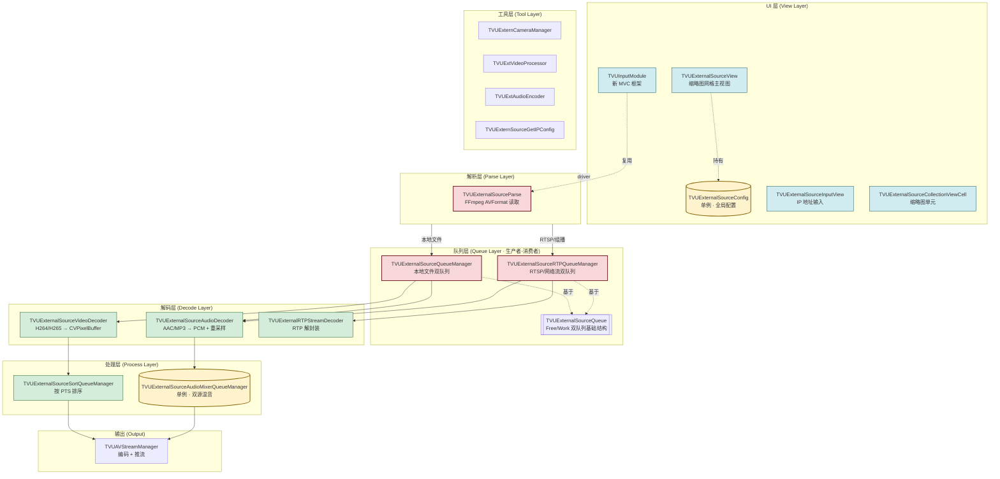

> 图例：黄色为单例，红框为核心驱动节点，蓝色为 UI，绿色为解码/处理。

---

## 三、目录结构

```
TVUExternalSource/
├── TVUExternalSourceParse/          # 核心解析模块（FFmpeg）
│   ├── TVUExternalSourceParse.h
│   └── TVUExternalSourceParse.mm
│
├── TVUExternalSourceDecoder/        # 解码器模块
│   ├── TVUExternalSourceVideoDecoder.h/mm    # 视频解码（H264/H265 → CVPixelBuffer）
│   ├── TVUExternalSourceAudioDecoder.h/mm    # 音频解码 + FFmpeg 重采样
│   └── TVUExternalRTPStreamDecoder.h/mm      # RTP 流解码（用于 RTSP 源）
│
├── TVUExternalSourceQueue/          # 数据队列管理
│   ├── TVUExternalSourceQueue.h/mm              # 基础队列数据结构（Free/Work 双队列）
│   ├── TVUExternalSourceQueueManager.h/mm       # 本地文件队列管理器
│   ├── TVUExternalSourceRTPQueueManager.h/mm    # RTP 网络流队列管理器
│   ├── TVUExternalSourceSortQueueManager.h/mm   # 视频帧排序队列（按 PTS）
│   └── TVUExternalSourceAudioMixerQueueManager.h/mm  # 音频混音队列（单例）
│
├── TVUExternalSourceView/           # UI 视图层
│   ├── TVUExternalSourceView.h/mm               # 主视图容器（缩略图网格 3×2）
│   ├── TVUExternalSourceConfig.h/m              # 配置管理器（单例）
│   ├── TVUExternalSourceInputView.h/mm          # IP 地址输入视图
│   ├── TVUExternalSourceCollectionViewCell.h/mm # 缩略图单元格
│   └── TVUExternalButton.h/m                    # 自定义按钮
│
├── TVUExternSourceTool/             # 工具类
│   ├── TVUExternSourceTool.h/mm                 # 外部源工具方法
│   ├── TVUExternCameraManager.h/mm              # 外部相机管理器
│   ├── TVUExtVideoProcessor.h/mm                # 视频处理器
│   ├── TVUExtAudioEncoder.h/mm                  # 音频编码器
│   └── TVUExternSourceGetIPConfig.h/mm          # IP 配置获取
│
└── TVUInputModule/                  # 输入源选择模块（新 UI 框架）
    ├── Controller/
    │   ├── TVUInputSourceVC.h/m                 # 输入源选择主控制器
    │   └── TVUInputSourceConfig.h/mm            # 输入源配置
    ├── Models/
    │   ├── TVUCameraTypeItem.h/m                # 摄像头类型模型
    │   ├── TVUCameraSelectionItem.h/m           # 摄像头选择模型
    │   ├── TVUClipItem.h/m                      # 视频片段模型
    │   └── TVUClipOperationResult.h/mm          # 操作结果模型
    ├── Views/
    │   ├── TVUCameraTypeCell.h/m                # 摄像头类型单元格
    │   ├── TVUCameraSelectionCell.h/m           # 摄像头选择单元格
    │   └── TVUClipCell.h/m                      # 视频片段单元格
    ├── ParseModule/
    │   ├── TVUInputSourceParseModule.h/mm       # 输入源解析模块
    │   └── TVUImageBufferManager.h/mm           # 图像缓冲管理器
    ├── Gestures/
    │   └── TVUInputGestureCoordinator.h/mm      # 手势协调器
    ├── MediaPicker/
    │   └── TVUMediaPicker.h/mm                  # 媒体选择器
    ├── TVUInputSourceConstants.h                # 常量定义
    └── TVUSourceInputModule.h/mm                # 主模块入口
```

---

## 四、核心类详解

### 4.1 TVUExternalSourceParse — 数据解析核心

**职责：** 使用 FFmpeg 库解析外部源文件（本地视频、RTSP 流、组播 URL）。是整个模块的入口和数据源头。

**关键枚举定义：**

```objc
// 数据源类型
typedef enum : NSUInteger {
    TVUExternalSourceLocalFile = 0,      // 本地文件
    TVUExternalSourceMuticastUrl,        // 组播 URL（UDP）
    TVUExternalSourceRTSP,               // RTSP 流
} TVUExternalSourceType;

// 错误类型
typedef enum : NSUInteger {
    TVUExternalSourceErrorNone = 0,
    TVUExternalSourceErrorOpenFile,
    TVUExternalSourceErrorVideoStreamNotFound,
    TVUExternalSourceErrorAudioStreamNotFound,
    TVUExternalSourceErrorCodecNotFound,
    TVUExternalSourceErrorOpenCodec,
    TVUExternalSourceErrorUnsupportVideoEncodingFormat,
    TVUExternalSourceErrorUnsupportVideoResolution,
    TVUExternalSourceErrorUnsupportVideoFPS,
    TVUExternalSourceErrorUnsupportAudioEncodingFormat,
    // ...
} TVUExternalSourceError;
```

**关键方法：**

```objc
// 预检查：验证文件是否支持（分辨率、FPS、编码格式）
- (TVUExternalSourceError)preParseWithPath:(NSString *)path;

// 开始解析：启动 FFmpeg 读取线程和队列管理器
- (TVUExternalSourceError)startParseWithPath:(NSString *)path
                                    andIndex:(int)external_source_index;

// 获取第一帧作为缩略图
- (TVUExternalSourceError)startParseWithPathTakePic:(NSString *)path;

// 获取源信息（分辨率、FPS、编码格式等）
- (NSDictionary *)getSourceInfo;

// 停止解析
- (void)stopParse;
```

**内部工作流程：**
1. `preParseWithPath:` — 打开 AVFormatContext，查找视频/音频流，验证参数
2. `startParseWithPath:andIndex:` — 创建 QueueManager，启动 GCD 线程逐帧读取 AVPacket
3. 读取到的 AVPacket 封装为 `TVUExternalSourceDecodeParam`，入队到 QueueManager
4. `stopParse` — 停止线程，释放 FFmpeg 资源

---

**Parse 内部状态机：**

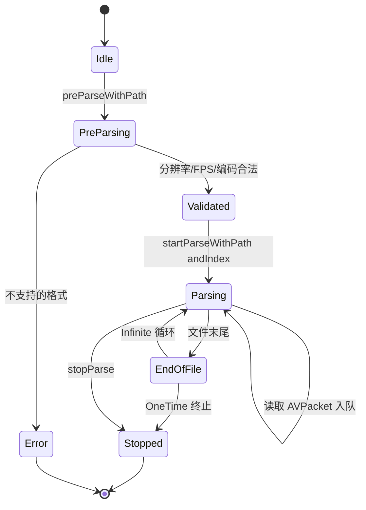

---

### 4.2 TVUExternalSourceQueue — 基础队列数据结构

**职责：** 定义解码数据的队列节点和队列容器，线程安全的 Free/Work 双队列。

**核心数据结构：**

```cpp
// 解码参数（队列节点数据）
struct TVUExternalSourceDecodeParam {
    uint8_t *data;               // 视频/音频裸数据
    int dataSize;
    uint8_t *extraData;          // H264/H265 的 VPS/SPS/PPS
    int extraDataSize;
    int channel;                 // 音频通道数
    int sampleRate;              // 音频采样率
    CMSampleTimingInfo timingInfo;
    Float64 pts;                 // 显示时间戳
    Float64 time_base;           // 时间基
    TVUExternalSourceVideoRotate videoRotate;     // 视频旋转角度
    TVUExternalSourceVideoCodingFormat codingFormat; // H264/H265
    int fps;
    int external_source_index;
    int current_frame_index;
    BOOL isHDR;
};
```

**队列操作模式：**
- **Free Queue**：空闲节点池，预分配内存
- **Work Queue**：待处理数据队列
- 生产者从 Free Queue 取节点 → 填充数据 → 入队 Work Queue
- 消费者从 Work Queue 取节点 → 解码处理 → 归还 Free Queue
- 使用 `pthread_mutex_t` + `pthread_cond_t` 保证线程安全

---

**Free/Work 双队列流转：**

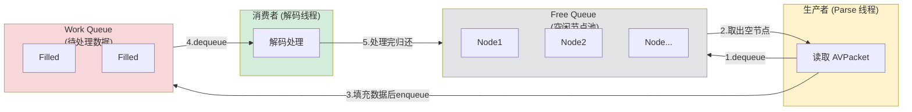

> 使用 `pthread_mutex_t` + `pthread_cond_t`：队列满时生产者阻塞，队列空时消费者阻塞。

---

### 4.3 TVUExternalSourceQueueManager — 本地文件队列管理器

**职责：** 管理本地文件的视频+音频双队列，创建并管理解码线程池。

```cpp
class TVUExternalSourceQueueManager {
    TVUExternalSourceQueue *sourceQueue[2];       // [0]=视频队列 [1]=音频队列
    TVUExternalSourceVideoDecoder *videoDecoder;
    TVUExternalSourceAudioDecoder *audioDecoder;

    void startThread();          // 启动视频+音频解码线程
    void endThread();            // 停止解码线程
    void addDataToDecoder();     // 从 Work Queue 取数据送入解码器
    int freeQueueLength();       // 获取空闲队列长度（用于流控）
};
```

---

### 4.4 TVUExternalSourceRTPQueueManager — 网络流队列管理器

**职责：** 处理 RTSP/RTP 流的队列管理，与 QueueManager 结构类似，但使用 `TVUExternalRTPStreamDecoder` 处理 RTP 数据。支持线程挂起和恢复。

---

### 4.5 TVUExternalSourceVideoDecoder — 视频解码器

**职责：** 将 H264/H265 裸数据解码为 CVPixelBufferRef（YUV 格式），送入排序队列。

```objc
@property (nonatomic) TVUExternalSourceSortQueueManager *sortQueueManager;

- (void)decode:(TVUExternalSourceDecodeParam *)param;
```

**解码流程：**
```
AVPacket → avcodec_send_packet() → avcodec_receive_frame()
    → AVFrame (YUV) → CVPixelBufferRef
    → 添加到 SortQueueManager（按 PTS 排序）
```

---

### 4.6 TVUExternalSourceAudioDecoder — 音频解码器

**职责：** 解码音频数据，使用 FFmpeg 进行音频重采样（转换采样率、通道数）。

**解码流程：**
```
AVPacket → avcodec_send_packet() → avcodec_receive_frame()
    → AVFrame (PCM) → TVUFFmpegResample（重采样）
    → 输出到 AudioMixerQueueManager
```

---

### 4.7 TVUExternalSourceSortQueueManager — 视频帧排序队列

**职责：** 按 PTS（Presentation TimeStamp）对视频帧排序，确保乱序到达的帧按正确时序输出。

```cpp
void addData(CMSampleBufferRef samplebuffer, Float64 pts,
             int fps, int external_source_index, int current_frame_index);
int length();  // 返回当前队列中帧数
```

**工作原理：**
- 维护 Work Queue（待排序帧）和 Free Queue（空闲节点）
- 视频解码后帧可能乱序（B 帧），排序队列确保按 PTS 顺序输出
- 排序完成后输出给编码器

---

### 4.8 TVUExternalSourceAudioMixerQueueManager — 音频混音管理器

**职责：** 单例模式，将外部源音频与本地摄像头音频进行混音。

```cpp
class TVUExternalSourceAudioMixerQueueManager {
    TVUExternalSourceAudioMixerQueue *sourceQueue[2];  // [0]=本地摄像头 [1]=外部源

    void addDataToAudioMixer(TVUAudioEncoderData *param, ...);
    void audioMixer();  // 执行混音操作
};
```

**混音流程：**
```
外部源音频（解码+重采样后） + 本地摄像头音频
    → audioMixer() 混音处理
    → 输出混合后的音频给编码器
```

---

**音频双源混音示意：**

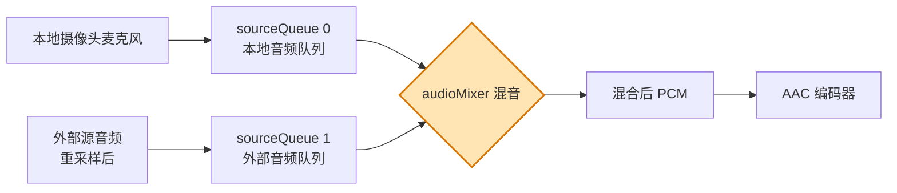

---

## 五、UI 层类详解

### 5.1 TVUExternalSourceView — 主视图

**职责：** 显示外部源的缩略图网格（3 列 2 行），管理源的选择、删除、切换，处理 PIP/PBP 多屏模式。

**关键委托方法：**

```objc
@protocol TVUExternalSourceViewDelegate
- (void)externalSourceViewOpenAlbumForVideo;       // 打开相册选视频
- (void)externalSourceViewParseBegin;              // 解析开始
- (void)externalSourceViewParseComplete;           // 解析完成
- (void)externalSourceViewSwitchToExteranalCameraWithWidth:(int)width
                                                    height:(int)height
                                                    andFps:(int)fps;
- (void)pipStateChanged:(BOOL)state;               // PIP 状态变化
@end
```

### 5.2 TVUExternalSourceConfig — 配置管理器（单例）

```objc
@property (nonatomic, assign) TVUExternalSourceType sourceType;
@property (nonatomic, assign) TVUExternalSourceAudioResampleType audioResampleType;  // AudioToolbox / FFmpeg
@property (nonatomic, assign) TVUExternalSourceCirculationType circulationType;      // One Time / Infinite
@property (nonatomic, assign, readonly) TVUExtCameraRoateDegree roateDegree;        // 旋转角度
@property (nonatomic, assign, readonly) BOOL flipsVideo;                            // 是否翻转
```

### 5.3 TVUExternalSourceCollectionViewCell — 缩略图单元格

显示外部源的缩略图，附带视频时长、FPS 信息，提供删除、镜像等操作按钮。

### 5.4 TVUExternalSourceInputView — IP 地址输入

用于输入 RTSP/组播地址的文本输入视图。

---

**UI 层组件组合关系：**

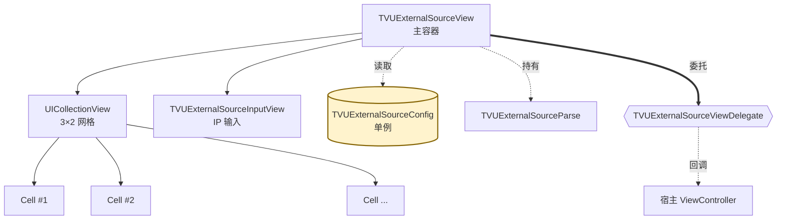

---

## 六、TVUInputModule — 新 UI 框架

这是对外部源选择 UI 的现代化重构，采用清晰的 MVC 架构：

| 类 | 职责 |
|---|---|
| **TVUSourceInputModule** | 主模块入口，协调各子模块 |
| **TVUInputSourceVC** | 输入源选择视图控制器 |
| **TVUInputSourceConfig** | 输入源配置 |
| **TVUInputSourceParseModule** | 封装 TVUExternalSourceParse 的解析逻辑 |
| **TVUImageBufferManager** | 图像缓冲管理器 |
| **TVUMediaPicker** | 媒体选择器（相册/文件） |
| **TVUInputGestureCoordinator** | 手势协调器 |
| **TVUCameraTypeItem** | 摄像头类型数据模型 |
| **TVUCameraSelectionItem** | 摄像头选择数据模型 |
| **TVUClipItem** | 视频片段数据模型 |
| **TVUClipOperationResult** | 操作结果模型 |

**TVUInputModule MVC 分层关系：**

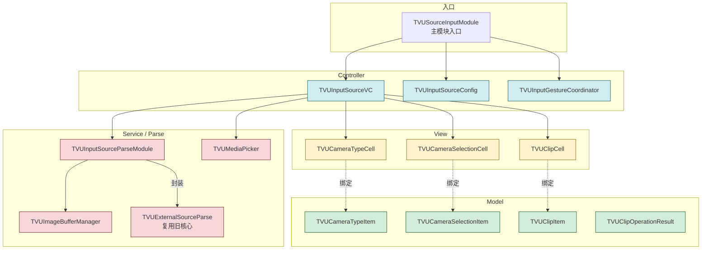

---

## 七、工具类详解

| 类 | 职责 |
|---|---|
| **TVUExternSourceTool** | 通用工具方法（格式转换、文件路径处理等） |
| **TVUExternCameraManager** | 外部相机（如 USB 摄像头）的连接和管理 |
| **TVUExtVideoProcessor** | 视频数据后处理（裁剪、缩放、格式转换） |
| **TVUExtAudioEncoder** | 外部源音频编码（PCM → AAC） |
| **TVUExternSourceGetIPConfig** | 获取设备网络 IP 配置信息 |

---

## 八、完整数据流图

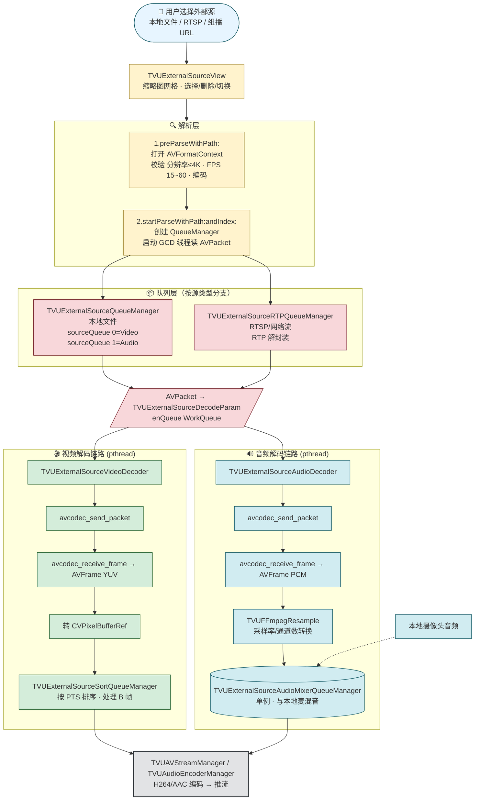

---

## 九、类关系图（Class Diagram）

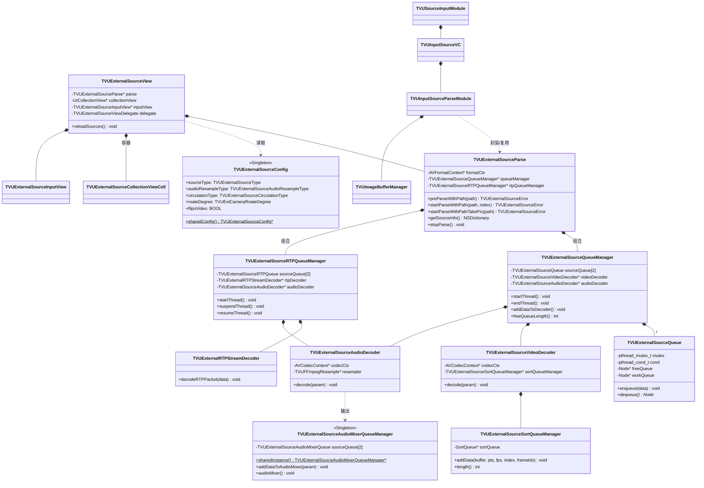

---

## 十、模块协作时序图

下面展示用户从选择源到推流的端到端时序：

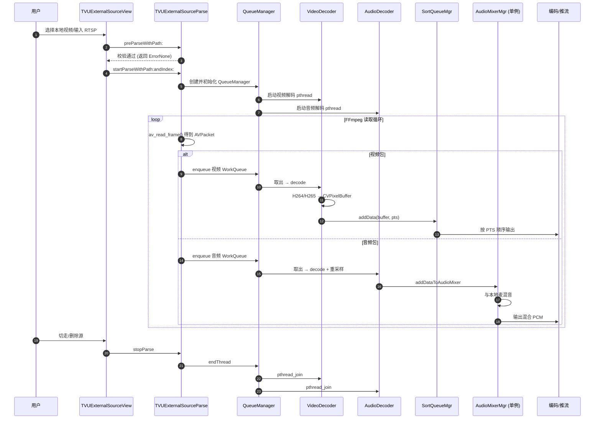

---

## 十一、线程模型

| 线程 | 类型 | 职责 |
|---|---|---|
| **Parse Queue** | dispatch_queue_t (GCD) | AVPacket 读取，逐帧从媒体文件/流中提取数据 |
| **Video Decode Thread** | pthread | 从视频 Work Queue 取数据，调用 VideoDecoder 解码 |
| **Audio Decode Thread** | pthread | 从音频 Work Queue 取数据，调用 AudioDecoder 解码 |
| **Audio Mixer Thread** | pthread (单例) | 混合外部源音频和本地摄像头音频 |
| **Sort Thread** | pthread | 按 PTS 对视频帧排序，保证输出时序正确 |

**线程同步机制：**
- `pthread_mutex_t` — 队列访问互斥锁
- `pthread_cond_t` — 条件变量，用于线程等待/通知（队列空/满时阻塞）
- `dispatch_queue_t` — GCD 分派队列，用于高层操作

**线程间数据流动：**

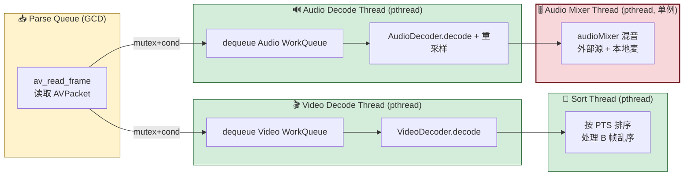

> 关键约束：所有跨线程入队/出队都通过 `pthread_mutex_t + pthread_cond_t` 保护；当 Work Queue 空时消费线程在 `cond_wait` 阻塞，生产者填充后 `cond_signal` 唤醒。

---

## 十二、支持的格式与限制

| 项目 | 支持范围 |
|---|---|
| **视频编码** | H264、H265 (HEVC) |
| **最大分辨率** | 3840×2160 (4K) |
| **FPS 范围** | 15 ~ 60 |
| **音频格式** | AAC、MP3、PCM |
| **源类型** | 本地文件、组播 URL (UDP)、RTSP (TCP/UDP) |

**特殊功能：**
- **循环播放** — 本地文件支持 One Time / Infinite 两种模式
- **旋转补偿** — 自动处理视频旋转元数据（0°/90°/180°/270°）
- **音频混音** — 支持与本地摄像头音频实时混音
- **缩略图提取** — 获取源的第一帧作为预览缩略图
- **HDR 支持** — 检测并标记 HDR 内容

---

## 十三、总结

TVUExternalSource 模块是一个设计良好的外部视频源处理框架，核心架构分为五层：

1. **解析层** (TVUExternalSourceParse) — 使用 FFmpeg 解析多种源格式，是数据的源头
2. **队列层** (QueueManagers) — 线程安全的 Free/Work 双队列，生产者-消费者模式
3. **解码层** (VideoDecoder / AudioDecoder) — 视频硬软解码 + 音频解码重采样
4. **处理层** (SortQueueManager / AudioMixerQueueManager) — 视频帧排序 + 音频混音
5. **UI 层** (View / Config / InputModule) — 用户交互界面和配置管理

整体设计清晰，多线程并发处理确保实时直播场景下的音视频同步和低延迟输出。新增的 TVUInputModule 子模块对 UI 层进行了现代化重构，采用更清晰的 MVC 架构。

**五层架构精简图：**

```mermaid
graph LR
    L5[🖼️ UI 层<br/>View / Config / InputModule] --> L1
    L1[🔍 解析层<br/>TVUExternalSourceParse] --> L2
    L2[📦 队列层<br/>QueueManager / RTPQueueManager] --> L3
    L3[🎞️ 解码层<br/>VideoDecoder / AudioDecoder] --> L4
    L4[⚙️ 处理层<br/>SortQueueMgr / AudioMixerMgr] --> Out[📡 编码推流]

    classDef ui fill:#d1ecf1,stroke:#0c5460,stroke-width:2px
    classDef parse fill:#fff3cd,stroke:#856404,stroke-width:2px
    classDef queue fill:#f8d7da,stroke:#721c24,stroke-width:2px
    classDef dec fill:#d4edda,stroke:#155724,stroke-width:2px
    classDef proc fill:#e2d4f0,stroke:#5a3d8f,stroke-width:2px
    classDef out fill:#e2e3e5,stroke:#383d41,stroke-width:2px

    class L5 ui
    class L1 parse
    class L2 queue
    class L3 dec
    class L4 proc
    class Out out
```

---

## 附：所有 mermaid 图清单

| # | 图名 | 类型 | 位置 |
|---|---|---|---|
| 1 | 整体分层架构 | graph TB | §二 |
| 2 | Parse 状态机 | stateDiagram | §4.1 |
| 3 | Free/Work 双队列流转 | flowchart LR | §4.2 |
| 4 | 音频双源混音 | flowchart LR | §4.8 |
| 5 | UI 层组件组合 | graph TB | §5 末 |
| 6 | TVUInputModule MVC | graph TB | §六 |
| 7 | 完整数据流 | flowchart TB | §八 |
| 8 | 类关系（classDiagram） | classDiagram | §九 |
| 9 | 模块协作时序 | sequenceDiagram | §十 |
| 10 | 线程间数据流动 | flowchart LR | §十一 |
| 11 | 五层架构精简图 | graph LR | §十三 |

---

## 附：关联文档

| 文档 | 视角 | 核心内容 |
|---|---|---|
| **本文** `01-外部源模块-TVUExternalSource.md` | 架构 / 静态结构 | 模块分层、目录、类关系、数据流图、线程模型 |
| [时间戳专题/02-时间戳与时钟漂移调研.md](./时间戳专题/02-时间戳与时钟漂移调研.md) | 时间戳 / 同步 | SortQueueManager 时间戳、PTS 链路、Camera 时钟、`g_vstarttime`、NTP 补偿、漂移处理评估 |
| [时间戳专题/03-时间戳设计评价.md](./时间戳专题/03-时间戳设计评价.md) | 评价 / 重构决策 | 设计亮点、脆弱点、重构建议、Review 提问清单 |

**两份文档的承接关系：**

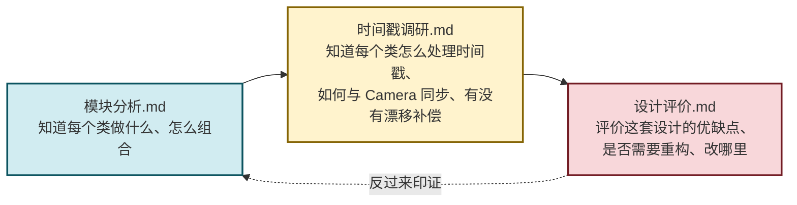

> 建议阅读顺序：先看模块分析建立**静态模型** → 再读时间戳调研理解**动态时序与同步策略** → 最后看评价文档辅助**重构决策**。
