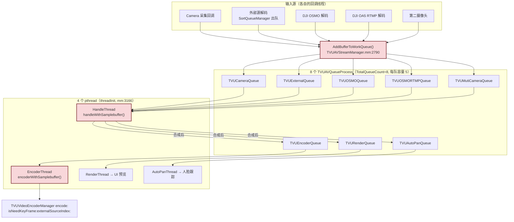
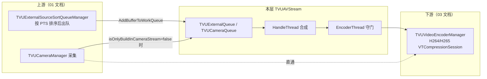

# 合流层详细分析 — TVUAVStream

> **行号对齐记录（2026-08-27）**：本文最初写于 2026-06-12，其后 `TVUAVStreamManager.mm`
> 从约 2700 行增长到 **3430 行**，全文 37 处行号引用已按当前代码全部重定位。
> 对齐时发现两条**非行号漂移**的变化，已就地标注：
> 1. `checkSampleBufferPTSForEncode` 的第二个调用点已解注释（§8.1）；
> 2. `handleExternalSourcePIPStream` 已成死代码（§7.4 之二）。

> 基于 tvuanywhere_ios 仓库 `share/DefaultTitle` 分支（commit `89e4c235a`，2026-06-12）
> 目录：`products/TVUTransportIOS/TVUAnywherePro/TVUAnywhereSDK/TVUAVStream/`
>
> 📚 **系列文档**（完整索引见 [README.md](./README.md)）
> 上游：[01-外部源模块-TVUExternalSource.md](./01-外部源模块-TVUExternalSource.md) ｜ 下游：[03-编码层-TVUEncoder.md](./03-编码层-TVUEncoder.md)

---

## 一、模块定位

TVUAVStream 是**所有视频源在编码前的汇聚点**。Camera、外部源（本地文件/RTSP/组播）、OSMO、双摄、DJI RTMP 等各路 `CMSampleBuffer` 全部进入这一层的队列，由 HandleThread 按 `streamType` 取帧、合成（PIP/PBP/高斯模糊背景/水印），再经 EncoderThread 做 PTS 守门后送入 `TVUVideoEncoderManager`。

| 文件 | 行数 | 职责 |
|---|---|---|
| `TVUAVStreamManager.h/.mm` | ~2770 | C++ 单例。队列管理、4 线程驱动、streamType 路由、合成调度、编码入口 |
| `TVUAVStreamHandleManager.h/.mm` | ~1466 | 像素级合成算法（PIP/PBP）、性能分级 |
| `TVUAVQueue.h/.mm` | ~236 | Free/Work 双队列数据结构（与外部源模块同款手法） |
| `TVUStreamHelper.h/.mm` | ~39 | 辅助工具 |

> 注意：`TVUAVStreamManager` 是 **C++ 类**（非 ObjC），`getInstance()` + `static mutex` 双重锁单例（TVUAVStreamManager.h:56-66）。

---

## 二、整体结构图



---

## 三、streamType 全集（TVUAVQueue.h:23-43）

```cpp
typedef enum : int {
    TVUAVStreamNone = -1,
    TVUAVStreamCamera = 0,               // 纯内置摄像头
    TVUAVStreamCameraPBP,                // 双摄 PBP
    TVUAVstreamMutiCameraSourcePIP,      // 双摄 PIP
    TVUAVStreamExternalSource,           // 纯外部源
    TVUAVStreamExternalSourcePBP,        // 外部源 + PBP
    TVUAVStreamExternalSourcePIP,        // 外部源 + PIP
    TVUAVStreamExternalSourcePicture,    // 外部图片源（含 PBP/PIP 变体）
    TVUAVStreamExternalSourcePicturePBP,
    TVUAVStreamExternalSourcePicturePIP,
    TVUAVStreamOSMO,                     // DJI OSMO（含 PBP/PIP 变体）
    TVUAVStreamOSMOPBP,
    TVUAVStreamOSMOPIP,
    TVUAVStreamCrop,                     // AutoPan 裁剪流
    TVUAVStreamOSMORTMP,                 // DJI OA5 Pro Wi-Fi RTMP 流
} TVUAVStreamType;
```

分发矩阵（handleWithSamplebuffer 内 switch，TVUAVStreamManager.mm:616-645）：

| streamType | 处理函数 | 主源 / 辅源 |
|---|---|---|
| Camera | `handleCameraStream(camera_node)` | Camera |
| Crop | `handleCropStream(camera_node)` | Camera（AutoPan 裁剪） |
| ExternalSource / Picture / PIP / PBP | `handleExternalSourceStream(external_source_node, camera_node)`（mm:642） | 外部源主、Camera 辅 |
| OSMO / OSMOPIP / OSMOPBP | `handleExternalSourceStream(osmo_node, camera_node)`（mm:630） | OSMO 主、Camera 辅 |
| OSMORTMP | `handleOSMORTMPStream(osmoRTMP_node, camera_node)` | DJI RTMP |
| CameraPBP / MutiCameraSourcePIP | `handleMutiCamStreamMux(camera_node, mu_camera_node)` | 双摄 |

---

## 四、队列结构 TVUAVQueue

### 4.1 数据结构（TVUAVQueue.h:51-95）

```cpp
typedef struct TVUAVQueueNode {
    void   *data;               // CMSampleBufferRef（入队时 CFRetain）
    long   index;               // work_queue 全局递增编号
    struct TVUAVQueueNode *next;
    int fps;
    TVUAVStreamType streamType;
    int streamSubType;          // = externalSourceIndex
} TVUAVQueueNode;

class TVUAVQueueProcess {
    TVUAVQueue *m_free_queue;   // 空闲节点池（头插，LIFO）
    TVUAVQueue *m_work_queue;   // 待处理队列（尾插，FIFO）
    pthread_mutex_t free_queue_mutex, work_queue_mutex;
    int maxSize;                // = TVUAVQueueSize = 5（TVUAVQueue.mm:14）
};
```

- 与外部源模块的 `TVUExternalSourceQueue` 同一套 **Free/Work 双队列**手法：预分配 5 个节点，零运行期 malloc。
- **丢帧策略是隐式的**：free_queue 取不到节点（5 帧都积压在 work_queue）时 `AddBufferToWorkQueue` 直接 return，**新帧被丢弃**（丢新不丢旧）。
- 消费完毕由 `ResetWorkQueueNode()` 做 `CFRelease(buffer)` 并把节点还回 free_queue（TVUAVQueue.mm:224-235）。

### 4.2 入队守门（TVUAVStreamManager.mm:2790-2858）

`AddBufferToWorkQueue()` 是唯一入口，做三件事：

1. **源索引过滤**（mm:2830-2832）：External/OSMO 队列只接受 `externalSourceIndex == external_source_index`（当前活跃源）的帧，**切源瞬间旧源的尾巴帧直接丢弃**，防止两个源混流：

```cpp
if ((queue->type == TVUExternalQueue || queue->type == TVUOSMOQueue) &&
    externalSourceIndex != external_source_index) {
    return;  // 丢弃
}
```

2. `CFRetain(sampleBuffer)` 后填充节点（streamType / streamSubType / fps）。
3. 入 work_queue。

> 这与 [时间戳专题/01-PTS设计逻辑分析.md](./时间戳专题/01-PTS设计逻辑分析.md) §10 讨论的"切源时序"直接相关：索引过滤在入队层，PTS 过滤在编码层，两道闸。

---

## 五、线程模型

### 5.1 四线程（threadInit，TVUAVStreamManager.mm:3166-3192）

| 线程 | 循环体 | 节奏 | 职责 |
|---|---|---|---|
| HandleThread | `handleThread()` mm:236-257 | 自适应 ~100Hz | 取帧 → 合成 → 分发 Render/Encoder/AutoPan |
| EncoderThread | `encoderWithSamplebuffer()` mm:2322（活体仅 mm:2324-2332，旧实现 mm:2333-2457 整块被注释） | 空队时 usleep(10ms) | DeQueue → `sendToEncoderWithSamplebuffer`（PTS 守门/水印/Agora/编码全在后者内） |
| RenderThread | renderThread | ~100Hz | UI 预览 |
| AutoPanThread | autoPanThread | ~100Hz | 人脸检测 / pan 区域 |

HandleThread 的自适应 sleep（mm:246-254）：

```cpp
if ([[TVUAnywhere manager] isOnlyBuildInCameraStream]) {
    usleep(TVU_EMPTY_TASK_MS*1000);   // 纯相机直通模式：合流层闲置，200ms 一拍
} else {
    if (processTime < 10) usleep(10*1000);  // 正常 10ms 一拍
}
```

> `TVU_EMPTY_TASK_MS = 200`（mm:235）。**纯内置相机直播不走合流层**——`TVUAnywhere.mm` 的 `sendToEncodeWithSampleBuffer:` 在 `isOnlyBuildInCameraStream` 时直送编码，此处四线程全部空转省电。

### 5.2 锁与竞态

- 每队两把 `pthread_mutex_t`（free/work 分离），临界区只有链表操作，竞争轻。
- 线程级 `mutex + cond` 用于 Suspend/Active（mm:3057-3085）。
- `checkSampleBufferPTSForEncode` 内部用 `static` 局部变量保存 last_pts / last_externalSourceIndex（mm:2290-2321），**只有 EncoderThread 单线程调用**，事实安全但写法脆弱（换并发模型即坏）。

---

## 六、主循环 handleWithSamplebuffer()（mm:475-1091）

> 2026-08-27 方法级走查（三个并行子代理分段走读 + 交叉核对）。函数已从 6 月的约 230 行长到 **619 行**。
> 本节按执行顺序分六段；完整问题清单见 §6.7 与 Q&A 记录 Q11。

### 6.1 节奏与取帧（mm:478-487, 526, 557）

跑在 handleThread（mm:236-256）上，全程持 `threadArray[TVUAVStreamHandleThread].mutex`，
拍间隔下限 10ms（mm:251-253），`isOnlyBuildInCameraStream` 时 200ms（mm:248-249）。

每拍最多碰 **5 路**队列、每路 `DeQueue` **最多 1 个** node，顺序固定：

| 顺序 | 行号 | 队列 | 条件 |
|---|---|---|---|
| 1-3 | mm:485-487 | OSMO / External / OSMORTMP | 无条件（任何 streamType） |
| 4 | mm:526 | Camera | 过了门控 1 才取 |
| 5 | mm:557 | MutiCamera | 过了门控 2 才取 |

另 3 路的消费者：Render→renderThread、Encoder→encoderThread（活体 mm:2324-2332）、AutoPan→autoPanThread。

**每拍每路 1 帧 + 池深 5** ⇒ 任何一路的消费上限是 100fps（纯相机模式 5fps），超产帧在
`AddBufferToWorkQueue` 的 mm:2839→2844 静默丢弃（丢新帧，不覆盖旧帧）。

### 6.2 两道主源门控（mm:490-524 / mm:528-555）

> ⚠️ 修正 6 月版的说法"主源缺帧 → return 不消费其它队列"：实际会 **Reset 回收已出队的
> OSMO/External/OSMORTMP 三路 node**（消费掉），只是 Camera/MutiCamera 两路**不出队**。

| 门控 | streamType | 条件 | 回收 | 不出队（饥饿方） |
|---|---|---|---|---|
| 1（mm:494-498） | OSMOPIP/OSMOPBP | osmo_node==NULL | External、OSMORTMP（+对 NULL 主源的 no-op Reset） | Camera、MutiCamera |
| 1（mm:505-509） | ExternalSource/PIP/PBP | external_source_node==NULL | 同上对称 | 同上 |
| 1（mm:514-518） | OSMORTMP | osmoRTMP_node==NULL | 同上对称 | 同上 |
| 2（mm:532-537） | CameraPBP/MutiCameraSourcePIP | camera_node==NULL | Camera(no-op)+三路 | **MutiCamera** |
| 2（mm:543-549） | Camera | 混入后摄帧(subType==1001) | Camera(真释放)+三路 | **MutiCamera** |

- **node 级不泄漏**（早退点都在未出队者之前，见 §6.6 配平），但产生**队列级饥饿**：
  主源停顿 ≥5 拍后，Camera 队列 5 个 node 全堵在 work 队列 → 此后相机帧每帧在 mm:2844 静默丢，
  且 5 帧陈旧 CMSampleBuffer 一直被 retain 到主源恢复。MutiCamera 同理（门控 2）。
- **门控覆盖不全**：`TVUAVStreamOSMO` 与 `ExternalSourcePicture/PicturePIP/PicturePBP` 不在门控 1 里，
  主源缺帧照常往下走，靠 `handleExternalSourceStream` 入口判空返回 NULL（mm:1410-1414）兜底 ——
  这些类型缺主源的拍**会**消费 Camera/MutiCamera，与门控内类型行为相反。

### 6.3 external_index 决定与缓存清理（mm:560-611）

优先级（后写覆盖前写）：`external_source_node`（**无 streamType 条件**，mm:561-563）
→ `osmo_node`（仅 DJI 三型，mm:574-579）→ `osmoRTMP_node`（仅 OSMORTMP，mm:580-582）。

清缓存三层互斥（mm:585-605）：索引变了→清 picture+background 两份；否则 backgroundFill 开关翻转→清两份；
否则 Picture 三型不清、**其余类型每拍清 picture 缓存**（mm:601-603）——
`last_pictureBuffer` 的复用路径实际只对 Picture 三型可达。

提交守卫（mm:608-610）：仅 `external_index != Invalid` 才提交 last 值。两个衍生问题：
① 非外置模式下 External 队列的**残帧**会污染 external_index（mm:561 无 streamType 判定）→ 缓存清理抖动、
错误 index 被提交；② 开关翻转发生在无外置帧的拍上→ `last_backgroundFill_switch` 提交不了，
mm:1510 按旧值合成，且每拍重复空转清理。

### 6.4 分发矩阵（switch mm:614-876）

| case | 调用 | 主/辅 | 备注 |
|---|---|---|---|
| Camera（mm:615） | `handleCameraStream` mm:616 | camera | CFRetain 原帧返回；replaceBgBlur+BGRA 时重建（mm:1140-1177） |
| Crop（mm:618） | `handleCropStream` mm:619 | camera | **函数内部自行入 EncoderQueue**（mm:1202-1203）；主流程 mm:1060 对 Crop 跳过 |
| OSMO/OSMOPBP/OSMOPIP（mm:627-629） | `handleExternalSourceStream(osmo, camera)` mm:630 | osmo 主 | 旧 `handleOSMOStream` 被注释（mm:631），函数已死（mm:1213，无调用方） |
| OSMORTMP（mm:633） | `handleOSMORTMPStream(osmoRTMP, camera)` mm:634 | osmoRTMP | **camera 形参从不使用**（死参）；纯直通不合成 |
| ExternalSource 六型（mm:636-641） | `handleExternalSourceStream(external, camera)` mm:642 | external 主 | 内部二次 switch 分 PBP/PIP（mm:1588-1618，实现在 `TVUAVStreamHandleManager` 类方法） |
| MutiCameraSourcePIP + CameraPBP（mm:650-651） | 见 §6.5 | camera+mu_camera | PIP/PBP 由 `isOpenMutiCamerPIP` 区分，**不是** streamType |
| default（mm:874） | 无 | — | 14 个枚举全有 case，仅 None 落此 |

各分支 PTS 来源：合成类全部**透传主源帧 PTS**（相机只贡献画面）；双摄直达用 `camSB ?: muSB` 的 PTS
（mm:749-750），mux 兜底 PIP 用 **mu_camera** 的 PTS（mm:1918）——直达↔兜底切换瞬间 PTS 可能不单调。

### 6.5 双摄段（mm:650-916，`#if _TVUIRLSDK`）

- **last-known 配对缓存**：文件级 static `s_lastFront/BackSampleBuffer`（mm:421-422，仅 handle 线程访问），
  按帧附件 `TVUIsFrontCamera` 判物理身份（写点 TVUAnywhere.mm:4627-4628），不看队列来源；
  front+back 齐才走 GPU 直达（mm:685），否则 NV12 mux 兜底（mm:855-858）。
- **GPU 直达**：`encodePIP/PBP NV12/BGRA Async`（mm:789/795/824/832），完成回调 `onEncoded`
  （mm:754-765，跑在 TVUMetalCIPreView 串行交付线程）重建 CMSampleBuffer 后走
  `enqueueDirectEncodeBuffer`（mm:1096-1120）——**与 handleThread 并行的第二个 last_buffer 写者**。
  编码与预览两次独立提交；后台跳过预览渲染（mm:805/841）。
- **preview/sample 双输出**：仅 `ciPreview==NULL && !effectsOn && !mirrorFrontOutput` 时
  跑第二次完整 NV12 合成生成预览份（mm:864，前置强制镜像）；`preview_buffer` 只进 RenderQueue。
- 关键不对称：直达提交失败仍 `previewHandledByDirect = true`（mm:854 无条件）→ 该帧不进 RenderQueue；
  replaceBg 分支忽略 `mirrorFront/rotateFront180` 形参（mm:1764-1789 提前 return）；
  直达路径的截图调用被注释（mm:1114）→ 双摄直达期间 `startScreenShot()` 永不被服务。

### 6.6 尾部：last_buffer 与三路分发（mm:917-1091）

- `sample_buffer == NULL`（mm:917-924）：只释放 preview_buffer + goto NODE_RELEASE。
  **不补帧、不入队、无日志**——补帧机制 `addTransitionFrame()` 首行 `return;`（mm:3224）已整体禁用（§7.5）。
- `last_buffer` 更新（mm:926-935，持锁）：新帧 PTS **严格大于**旧帧才替换；
  ⚠️ mm:927 在 mm:928 判空**之前**解引用 last_buffer（靠 CoreMedia 对 NULL 返回 kCMTimeInvalid→NaN 比较为 false 侥幸存活；
  直达版 mm:1102-1103 顺序是对的）。更新点在美颜**之前** → 缩略图/EXIF 拿到未美颜帧。
  `last_buffer` 的 +1 **无最终释放点**（endAllThread/FreeAll 都不碰）→ 停流后 pin 一帧到下个会话。
- 三路分发矩阵：

| 出口 | 美颜路径 mm:1022-1032 | 普通路径 mm:1060-1081 | GPU 直达 mm:1116-1119 |
|---|---|---|---|
| EncoderQueue | ✔ subType 恒 -1，**无 Crop 门控** | ✔ 带真实 subType（mm:1062/1064），有 Crop 门控 | ✔ subType 恒 -1 |
| RenderQueue | ✔（!previewHandledByDirect） | ✔ 同左 | ✘ |
| AutoPanQueue | ✘（legacy，注释声明刻意） | ✔（m_enableAutoPan） | ✔ |

  subType 是 externalSourceIndex 贯穿到编码器的载体（mm:2853 → mm:2331 → mm:2485 守门）。
  **美颜路径丢 subType**：外置源期间开/关美颜 → 守门的 static last_externalSourceIndex 看到 -1↔真实 index 跳变
  → 阈值收紧到 1/fps → 切换瞬间至少误杀 1 帧。
- **node 配平**：开头 5 取、NODE_RELEASE（mm:1085-1090）5 放，队列归属全部正确；
  5 处早退也配平。**本函数无 node/CMSampleBuffer 泄漏**。

### 6.7 问题清单（走查合并去重，仅记录）

| # | 问题 | 位置 | 严重度 |
|---|---|---|---|
| H1 | 构造函数在 `pthread_mutex_init` **之前** EnQueue 5 次（未初始化 mutex 上加锁，UB） | TVUAVQueue.mm:26-36 | 高（每次构造必发生） |
| H2 | 门控饥饿：主源停顿 ≥5 拍 → Camera/MutiCamera 队列堵死，此后每帧静默丢 + 5 帧陈旧 buffer 常驻 | mm:498/509/518/537/549 → mm:2844 | 高 |
| H3 | `sample_buffer==NULL` 无补帧无日志；补帧机制 mm:3224 硬禁用 | mm:917-924 | 高 |
| H4 | 屏录收帧期间，subType≠100 的帧被拦在 EncoderQueue 外（相机/合成帧全丢） | mm:2804-2808 | 高（屏录场景） |
| H5 | 美颜路径 subType 恒 -1 → PTS 守门误杀；且绕过 Crop 门控、不投 AutoPan | mm:1030 vs 1062/1064 | 中高 |
| H6 | replaceBg 双摄分支忽略 mirrorFront/rotateFront180 | mm:1764-1789 | 中高 |
| H7 | 直达提交失败仍 previewHandledByDirect=true → 该帧预览丢失；直达期截图永不服务 | mm:854、mm:1114 | 中 |
| H8 | external_index 被 External 队列残帧污染 → 缓存抖动 + 错误提交 | mm:561-563 | 中 |
| H9 | 非 Picture 模式每拍清 picture 缓存（复用路径失效） | mm:601-603 | 中 |
| H10 | `last_buffer` 跨会话 pin 一帧；mm:927 判空顺序错误（直达版正确） | mm:933/1108、mm:927-928 | 中 |
| H11 | `streamType` 裸 public 成员，UI 线程写 / handle 线程六处读，无同步 | .h:100；mm:490/528/574/580/596/614 | 中（切模式窗口） |
| H12 | PTS 源在直达(camSB)↔兜底(mu_camera) 间切换，可能不单调 | mm:749-750 vs mm:1918 | 中 |
| L1 | 四处必然 no-op 的 Reset（掩盖回收意图） | mm:495/507/517/533 | 低 |
| L2 | 死代码群：`handleOSMOStream`、`handleOSMOPIPStream`、OSMORTMP 的 camera 死参、mm:1556 死条件、`maxSize` 无读点、`~TVUAVQueueProcess` 声明无定义 | 各处 | 低 |
| L3 | DeQueue 不维护 rear（悬垂）、ResetFreeQueue 无判空 CFRelease、ClearTVUAVQueue 无锁读 size、全局 nodeIndex 竞争 | TVUAVQueue.mm:126/159/174/88 | 低（潜伏） |
| L4 | mu_camera 帧在单源模式每拍被无条件消费后丢弃（同理 OSMO/External/OSMORTMP 在纯相机模式） | mm:557/485-487 | 说明性 |

---

## 七、handleExternalSourceStream() 合成详解（mm:1408-1684）

这是 PIP/PBP 模式下每一帧都要走的最重的函数。处理顺序：

### 7.1 流程

1. **取外部源帧与 PTS**（mm:1460）：`presentationTimeStamp = CMSampleBufferGetPresentationTimeStamp(external_source_sample_buffer)` —— **合成输出沿用外部源的 PTS**。
2. **HDR(10bit) 旁路**（mm:1426-1458）：HDR 帧不支持合成，宽高比一致直接 `CMSampleBufferCreateCopy` 透传，不一致只做缩放。
3. **等比缩放适配编码分辨率**（mm:1479-1500）：保持源宽高比，限制在 encoder_width × encoder_height 内。
4. **高斯模糊背景**（`getExternalSourceBackgroundFillBufferRef`，mm:336-474）：AspectFill 铺满 → `TVUGaussianBlurManager blurLevel:6` → 与缩放后的源帧合成，竖屏视频两侧出现模糊背景就来自这里。
5. **Camera 辅帧**（mm:1564-1571）：`camera_node == NULL` 时复用 `last_camera_sample_buffer`（缓存上一帧），不阻塞合成。
6. **PIP / PBP 合成**：调 `TVUAVStreamHandleManager` 静态方法。

### 7.2 PIP 合成（mm:1605-1618）

```cpp
TVUDevicePerformanceLevel level = [TVUAVStreamHandleManager currentPerformanceLevel];
int offsetX = level != TVUDevicePerformanceLevelLow ? pip_x : _destX;  // 低端机用降级坐标
pixelBuffer_output = [TVUAVStreamHandleManager handleExternalPIPStreamWithCameraPixelBuffer:camera_pixel_buffer
                                                  ExternalPixelbuffer:external_compose_buffer
                                               Background_pixelBuffer:external_source_background_pixelBuffer
                                                              OffsetX:offsetX OffsetY:offsetY
                                                              OutSize:CGSizeMake(encoder_width, encoder_height)
                                                                Scale:pip_scale];   // 默认 0.25，范围 0.25~1.0
```

PIP 小窗位置可拖动：`updateFrame(pointX, pointY, ...)`（mm:2860-3025）实时更新 pip_x/pip_y。

### 7.3 PBP 合成（mm:1589-1603）

```cpp
pixelBuffer_output = [TVUAVStreamHandleManager handleExternalPBPStreamWithLeftPixelBuffer:camera_pixel_buffer
                                                 RightPixelBuffer:external_compose_buffer
                                            BackgroundPixelBuffer:external_source_background_pixelBuffer
                                                            Scale:(cameraPBPType == TVUMutiCameraPBPType_ScalePBP)
                                                      Orientation:currentOrientation
                                             ExchangeLeftAndRight:!(currentOrientation == UIInterfaceOrientationLandscapeRight)
                                                          OffsetX:_offsetX_pbp
                                                        RightZoom:desiredZoomFactor     // 1~10
                                                          OutSize:CGSizeMake(encoder_width, encoder_height)];
```

### 7.4 输出

```cpp
// mm:1669 — 合成结果重新打成 CMSampleBuffer，PTS 仍是外部源的
sampleBuffer_output = [TVUVideoFilter convertCVImageBufferRefToCMSampleBufferRef:pixelBuffer_output
                                                 withPresentationTimeStamp:presentationTimeStamp];
```

### 7.4 之二、两个同名私有方法已成死代码 / 改换用途（2026-08-27 对齐时发现）

PIP/PBP 的实现在 `TVUAVStreamHandleManager`（`TVUAnywhereSDK/TVUAVStream/TVUAVStreamHandleManager.{h,mm}`）
的类方法上，如 §7.2/§7.3 代码所示。而 `TVUAVStreamManager` 自己还留着两个同名私有方法：

| 方法 | 位置 | 现状 |
|---|---|---|
| `handleExternalSourcePIPStream` | 声明 `TVUAVStreamManager.h:221`，定义 `mm:1991-2010` | **死代码** —— 全仓零调用点 |
| `handleExternalSourcePBPStream` | 定义 `mm:2011-2049` | 唯一调用点 `mm:1972`，在 `handleMutiCamStreamMux()` 内 —— 已**转为服务双摄合成**，不再服务外部源 |

顺带：`TVUAVStreamHandleManager.h` 里 `+ (void)resetPBPStreamCachePixelBuff;` 声明了**两次**（`:35` 与 `:46`）。

### 7.5 过渡帧 addTransitionFrame()（mm:3221-3333，**已禁用**）

外部源断帧时原设计会补"淡出帧"（复制上一帧、Y 分量 × 0.999 逐帧变暗、PTS += 1/fps，断帧超 `kTVUAddVideoFrameCount = 4` 帧间隔触发）。但：

```cpp
void TVUAVStreamManager::addTransitionFrame() {
    // 在某些机型上，直播时没有进行切换源也会进行补帧，导致画面变暗，暂时屏蔽掉补帧的逻辑
    return;   // mm:3224 —— 整个机制被硬禁用
    ...
}
```

**现状：外部源断帧 = 编码器收不到帧 = 输出流直接停顿**，没有任何补帧。R 端看到的是冻结而非渐暗。

---

## 七之三、双摄合成 handleMutiCamStreamMux()（mm:1754-1990）

> 2026-08-27 走查。237 行，三个互斥分支 + 入口守卫。调用点见 §6.4/§6.5（GPU 直达失败的兜底
> mm:850/857、非直达 mm:862、预览份 mm:864、非 IRL mm:871）。

### 7c.1 结构与三分支的判定条件不一致

```
入口守卫（mm:1756-1760）：backCameraNode == NULL → addTransitionFrame()（已禁用，死调用）+ return NULL
① replaceBg 分支（mm:1762-1790）  条件 [TVUAnywhere tvuIsReplaceBackgroundStart]   仅主 app/IRL 编译
② PIP 分支    （mm:1792-1929）  条件 isOpenMutiCamerPIP（bool 成员）
③ PBP 分支    （mm:1931-1985）  条件 streamType == TVUAVStreamCameraPBP
兜底：return NULL（mm:1989）
```

三个分支各用**三种不同的判定源**（manager 开关 / bool 成员 / streamType）。§6.7-B10 的中间态
（streamType==MutiCameraSourcePIP 但 isOpenMutiCamerPIP==NO）落到 mm:1989 静默丢帧。
replaceBg 优先级最高——它开着时 PIP/PBP 分支永远到不了。

### 7c.2 各分支要点

**① replaceBg（mm:1762-1790）**：前景 = mu_camera_node（前置）、背景 = backCameraNode（后摄）；
要求两路都是 **BGRA**（mm:1779-1780），否则返回 NULL；输出 size = 编码 WxH；
PTS 用**前景（mu_camera）**。`mirrorFront/rotateFront180` 形参在此分支**未用就 return**（=§6.7-H6）。

**② PIP（mm:1792-1929）**：
- ⚠️ **局部变量命名反转**：`camera_sample_buffer_back = mu_camera_node->data`（PIP **小窗**源）、
  `camera_sample_buffer_front = backCameraNode->data`（**全屏底图**）——名字与内容相反（有注释，但读代码极易误判）。
  下游 `handleExternalPIPStreamWithCameraPixelBuffer:ExternalPixelbuffer:` 的槽位语义是
  「Camera 槽=小窗、External 槽=底图」，与外置源 PIP 用法（mm:1612）一致——**槽位没错，错觉只来自本函数的变量名**。
- 格式守卫：两路必须都是 `kTVUCameraVideoFormat`（NV12，mm:1799-1802），否则 return NULL。
- IRL 几何变换（mm:1806-1831）：物理前置 = `exchangePipWindowPosition ? 全屏 : 小窗`，
  对其做 mirror（预览/镜像输出开）或 rotate180（竖锁补偿）二选一后顶替原帧；注释详尽，互斥关系明确。
- 小窗缩放链（mm:1834-1856）：`NV12 → I420 → scale → I420ToNV12` 三次 libyuv 转换（每帧 CPU）；
  尺寸 = `getTheWidthProportionally`（查表：主画面 1280→320 等，取 ~1/4 档）→ 先按 4:3 算高
  → 再按 16:9 反推宽 —— **注释写"pip 上层需要 4:3"，实际最终是 16:9**（宽被 mm:1849 覆盖为 height/9*16）。
- 底图适配（mm:1858-1894，alfredfu 2025-08-08）：底图分辨率 ≠ 编码分辨率时 `ci_scalePixelBuffer`
  拉到编码 WxH（外置 720p + 编码 1080p 场景）。**PBP 分支没有对应处理**。
- PTS 用**小窗（mu_camera）**的（mm:1919）。

**③ PBP（mm:1931-1985）**：变量名正常（front=mu、back=backCamera）；几何变换同 PIP 的对称版
（`exchangePbpLeftPosition`）；合成调**成员版** `handleExternalSourcePBPStream`（mm:2011-2047，
§7.4 之二记过：该成员方法现已专职服务双摄）；PTS 用**后摄（backCameraNode）**的，
且在几何替换**之后**读取（exchange 时读到的是重建帧、PTS 等价于原 physFront）。

成员版内部（mm:2011-2047，回答 M7）：
- **左路（camera）分辨率 ≠ 编码分辨率 → 直接 `return NULL` 丢帧**（mm:2031-2033），无日志无缩放。
  注释 mm:2023 给出动机："camera_queue 可能残留其他分辨率 buffer（上一次采集）" —— 本意是防陈旧帧，
  但把"合法却不等于编码分辨率"的帧一并丢了。这正是 §6.6 里 `sample_buffer == NULL`
  触发源清单中的"分辨率不匹配 mm:2031-2033"那一条 —— 丢弃后走 mm:917 静默分支（H3），闭环。
- **右路（external/mu_camera）不做任何分辨率检查** —— 与左路不对称，也与 PIP 分支的
  2025-08-08 缩放补丁策略相反（PIP 适配、PBP 丢弃）。

### 7c.3 问题清单（只记录）

| # | 问题 | 位置 | 严重度 |
|---|---|---|---|
| M1 | PIP 分支变量命名反转（back=小窗/front=底图），认知陷阱；槽位语义本身正确 | mm:1796-1797 | 记录（改动时高危） |
| M2 | 格式守卫互斥：replaceBg 要 BGRA、PIP 要 NV12 —— replaceBg 开关切换瞬间采集格式未跟上的拍，PIP 分支静默 return NULL（无日志） | mm:1779/1799 | 中 |
| M3 | 三分支 PTS 源各不相同：replaceBg=前景(mu)、PIP=小窗(mu)、PBP=后摄(back) —— PIP↔PBP 切换瞬间 PTS 源跳变（叠加 §6.7-H12 的直达↔兜底跳变） | mm:1783/1919/1974 | 中 |
| M4 | 小窗缩放链 NV12→I420→scale→I420→NV12，每帧 3 次 libyuv 全帧转换 + 2 个中间 buffer（仅 mux 兜底路径；GPU 直达无此开销） | mm:1835-1852 | 中（性能） |
| M5 | scale/转换失败无早退无日志：I420 scale 失败 → NULL 一路传到合成 → 输出 NULL → 静默丢帧 | mm:1848-1856 | 低 |
| M6 | 注释说小窗 4:3，代码实际产出 16:9（mm:1849 覆盖宽度） | mm:1846-1849 | 低（注释误导） |
| M7 | **已核实**：PIP 对不匹配分辨率做缩放适配（2025-08-08 补丁），PBP 则左路不匹配直接 `return NULL` 丢帧（无日志），右路完全不查 —— 两分支策略相反 | mm:1891-1894 vs mm:2031-2033 | 中 |
| M8 | 入口的 `addTransitionFrame()` 是对已禁用函数的死调用 | mm:1758 | 低 |

**正面记录**：IRL 几何变换段（mm:1806-1831 / 1939-1964）的 `mirroredFrontSB` 在两个分支的
**所有出口都正确释放**（含 NV12ToI420 失败早退 mm:1839-1841），引用计数配平；两段注释把
mirror/rotate180 的互斥关系与远端 transpose 补偿逻辑写得很清楚，是本函数质量最好的部分。

---

## 七之二、渲染线程 renderWithSamplebuffer() 与预览栈（mm:2050-2178）

> 2026-08-27 走查。函数 129 行，其中约 90 行是两大块注释，活体约 30 行。

### 7b.1 活体流程

```
DeQueue(RenderQueue)  → NULL: debug log + return（外层 renderThread mm:269-277 有 10ms/200ms 节流，不空转）
snapImageWithBufferRef(samplebuffer)          // mm:2061 —— 截图服务点，在预览判断【之前】
#if _TVUIRLSDK
    freeze = shouldUseSystemPreview()         // mm:2157 —— 即将切系统预览时冻结自绘层，防闪帧（注释 mm:2152-2155 说明动机）
if (!tvuIsUseSystemPreview && !freeze) {
    高帧率降载：fps>30 && captureFPS>30 && lowPerformanceMode → static bool drop 隔帧丢（mm:2161-2170）
    [preview displaySampleBuffer:samplebuffer]   // mm:2173
}
ResetWorkQueueNode                             // mm:2176
```

`static bool drop`（mm:2163）是函数级 static，但**只有 renderThread 一条线程访问** —— 与 Q4 记录的那批跨线程
static 不同，这个是安全的。

### 7b.2 两块死注释（与活代码逐字重复）

| 区间 | 内容 | 活体对应 |
|---|---|---|
| mm:2062-2100 | 旧内联截图实现 | 与 `snapImageWithBufferRef`（mm:2179-2218）逐字相同 |
| mm:2102-2151 | `checkUseSystemPreview` 的**第三个副本**（含 6 个 static） | 活函数在 mm:2220；这份已死 |

### 7b.3 预览栈：三态工厂实际恒走 DisplayLayer

```
TVUAVStreamManager->preview  ←注入←  TVUAnywhere.mm:640  self.preView
self.preView 工厂（TVUAnywhere.mm:3730-3742）按 preViewType 三选一：
    OpenGL → TVUOpenGLPreView（485 行）
    Metal  → TVUMetalPreView（143 行）
    默认   → TVUDisplayLayerPreView（170 行，AVSampleBufferDisplayLayer）
```

**`preViewType` 全文件唯一写点是 `TVUAnywhere.mm:312` `_preViewType = TVUPreViewType_DisplayLayer`**
→ OpenGL / Metal 两个子类当前是**死配置**（2023-09-12 注释：DisplayLayer 是为外置源 HDR 引入的，
免去 color format 转换）。

基类 `TVUPreView::displaySampleBuffer`（TVUPreView.mm:86-141）**不渲染像素**，只做三件事：
算 preview FPS、按 EXIF LensModel 判前/后摄、更新几何状态（needUpdateVertex 等，持 mutex_lock）。

`TVUDisplayLayerPreView::displaySampleBuffer`（mm:65-97）：
- 每帧设 `kCMSampleAttachmentKey_DisplayImmediately = true`；
- IRL 有 `recoverDisplayLayerIfFailed`：长会话中断（AVError -11847）后 layer 进 failed 态，flush 无法恢复，
  只能重建 layer、当帧丢弃等下一个 IDR（注释 mm:79-82）；
- `isReadyForMoreMediaData` 否 → `flush` + `enqueueSampleBuffer`（强推）；
- **两处与 Metal/OpenGL 子类不对称**：① 不检查 `enableRender`（另两个子类第一行就查）；
  ② 不调 `[super displaySampleBuffer:]`（另两个都调）→ 基类几何状态在 DisplayLayer 路径下**不更新**，
  `tvuUpdatePortraitViewWithRenderSize:` 不被触发。当前无害是因为 DisplayLayer 自适应 AspectFit、
  不用顶点数据 —— 但 enableRender 的语义（tvuUseSystemPreview/tvuUseCustomPreview 各置一半）对现役
  渲染器整体失效，真正挡渲染的只有 renderWithSamplebuffer 里的 `tvuIsUseSystemPreview` 检查。

### 7b.4 截图链（全景）

```
tvuGetSnapShot:（TVUAnywhere.mm:1877-1885，主线程）
  → startScreenShot() → needSnapImage = true          （mm:3122-3125）
  → dispatch_after 0.2s → completion(snapImage)        ← 固定等 0.2s，不确认是否已服务
服务点只有一个活的：renderWithSamplebuffer mm:2061 → snapImageWithBufferRef（mm:2179-2218）
  非 debug：snapImage = [UIImage imageWithCIImage:[CIImage imageWithCVPixelBuffer:…]]   // 惰性包装
  debug：CreateCopy + 北京时间水印，dispatch_async(main) 二段赋值
  needSnapImage = false
（双摄 GPU 直达的服务点 mm:1114 已被注释 —— §6.7-H7）
```

### 7b.5 问题清单（只记录）

| # | 问题 | 位置 | 严重度 |
|---|---|---|---|
| V1 | **纯相机模式截图陈旧**：直通路径不投 RenderQueue（活投递点仅 mm:1024/1074；mm:170 是 IRL 不注册的旧美颜回调、mm:3317 在已禁用补帧内）→ renderThread 每 200ms 空转、`snapImageWithBufferRef` 无帧可服务 → `tvuGetSnapShot` 0.2s 后拿到**上一次的陈旧 snapImage**（成员从不清空）；`needSnapImage` 悬置为 true，直到下次进多源模式的第一帧被"意外消费" | mm:2061、TVUAnywhere.mm:1877-1885 | **高**（纯相机是最常见模式） |
| V2 | 双摄 GPU 直达期间截图永不服务（交叉引用 §6.7-H7） | mm:1114 | 中 |
| V3 | `needSnapImage` / `snapImage` 无锁跨线程：startScreenShot（任意线程）写、renderThread 读写、debug 分支 dispatch_async 主线程再写、tvuGetSnapShot 主线程读 | .h:125/182 | 中 |
| V4 | `static CIImage image`（mm:2183）永久 pin 最后一次截图的 CVPixelBuffer（池回收被阻）；且 `imageWithCIImage:` 产出的 UIImage 无 CGImage backing，下游若走 `UIImageJPEGRepresentation` 等 API 需要 CIContext 渲染，历史上是坑 | mm:2183-2187 | 中低 |
| V5 | debug 水印时区名 `Asia/Beijing` 不在 tz 数据库 → `timeZoneWithName:` 返回 nil → formatter 落回本地时区（碰巧国内设备等价） | mm:2198 | 低（debug-only） |
| V6 | DisplayLayer 版不查 enableRender、不调 super（见 7b.3）；`renderCompeleteHandle` 在 enqueue 后同步调，failed-重建那帧也不会调 | TVUDisplayLayerPreView.mm:65-97 | 低 |
| V7 | 两块死注释（7b.2）+ OpenGL/Metal 死配置：预览栈实际维护面比表面小得多，但改动时三份 checkUseSystemPreview 副本（活 1 死 2）易误改 | — | 记录 |

---

## 八、编码入口 sendToEncoderWithSamplebuffer()（mm:2460-2701）

EncoderThread 从 EncoderQueue 取帧后进入此函数，依次：

### 8.1 PTS 守门 checkSampleBufferPTSForEncode（mm:2290-2321，**两个活调用点** mm:2334 与 mm:2485）

| 场景 | 条件 | 行为 |
|---|---|---|
| 同源 | `current_pts - last_pts < 10ms` | 丢弃（防止 PTS 过近导致编码器码率压死） |
| 切源（externalSourceIndex 变化） | 间隔 `< 1000/fps` ms | 丢弃；间隔够才接受新 index |

> 结论与 6 月版一致：**唯一活调用点是 `mm:2485`**（`sendToEncoderWithSamplebuffer()` 内）。
> `mm:2334` 那处位于 `mm:2333-2457` 的整块注释内（`encoderWithSamplebuffer()` 的旧实现），不是活代码。
> （2026-08-27 第一次对齐时曾误判为"两处都活"，当日已复核纠正——判定依据：块注释边界扫描，
> `encoderWithSamplebuffer()` 活体仅 mm:2324-2332 三步：DeQueue → sendToEncoderWithSamplebuffer → ResetWorkQueueNode。）
> 由于相机直通与合流层最终都进 `sendToEncoderWithSamplebuffer`，守门的 `static last_pts / last_externalSourceIndex`
> 仍被两条路径共享（在同一个函数里），切换瞬间互相挤掉对方 last_pts 的问题仍然成立。

### 8.2 水印 / Overlay（mm:2571-2600）

`TVUSnapshotManager` 有活跃节点时：内置全屏模板（Privacy Screen / Starting Soon）直接整帧替换；普通水印走 GPU 合成 `addImageWatermarksToNV12BufferGPU`。

### 8.3 isNeedKeyFrame 判定（mm:2629-2660）

三个条件命中任一则为 YES：

1. **streamType 或 streamSubType 变化**（切模式、切源）；
2. **前/后摄切换**——从 EXIF attachment 的 `LensModel` 字符串里嗅探 `"front"`（mm:2643-2653）；
3. **开播首帧**（static isFirst）。

### 8.4 调编码器（mm:2686-2688）

```cpp
[[TVUVideoEncoderManager manager] encode:customizeSampleBuffer ?: samplebuffer
                          isNeedKeyFrame:isNeedKeyFrame
                     externalSourceIndex:streamSubType];
```

> 结合编码层的 GOP 配置（`MaxKeyFrameIntervalDuration = 600` **秒**，见 [03-编码层](./03-编码层-TVUEncoder.md) §2.1）：**整条链路的 I 帧几乎完全靠这里的三个条件驱动**，编码器自身基本不会自发插 I 帧。

---

## 九、externalSourceIndex 语义汇总

| 值 | 含义 |
|---|---|
| `-1`（kTVULocalCameraVideoIndex） | 内置摄像头 |
| `-2`（kTVUExternal_Index_Invalid） | 初始/无效（ITA-1070 防 DJI 冲突） |
| `1/2/3/4` | 外部源槽位（本地文件/图片等） |
| `5` | DJI |
| `1001`（kTVUMutiCameraBackIndex） | 双摄后置 |
| TVUScreenRecordingSourceIndex | 屏幕录制 |

贯穿链路：解码回调入队（streamSubType）→ 合成输出带回 EncoderQueue → PTS 守门按它判定"切源" → `encode:...externalSourceIndex:` → 编码层据此触发低码率监控重启（见 03 文档 §1.3）→ 音频侧 `TVUAudioEncoderManager` 也按它过滤异源音频。

---

## 十、与上下游的衔接



---

## 十一、值得注意的设计点 / 风险

1. **节奏耦合**：合成输出节奏完全由主源（外部源）驱动，外部源 fps 抖动直接传导到编码节奏；Camera 辅帧靠"复用上一帧"解耦。
2. **过渡帧机制名存实亡**（mm:3224 硬 return），断帧无兜底。
3. **static 状态散布**：PTS 守门、isNeedKeyFrame 判定、last_camera_sample_buffer 都是函数级 static / 成员裸指针，依赖"单线程消费"这一隐含约定。
4. **EXIF LensModel 嗅探**前后摄切换属于脆弱启发式，系统行为变化即失效（只影响 I 帧时机，不影响正确性）。
5. **隐式丢新帧**：队列满丢新不丢旧，高负载下会放大端到端延迟（旧帧仍排队），而非追新。
