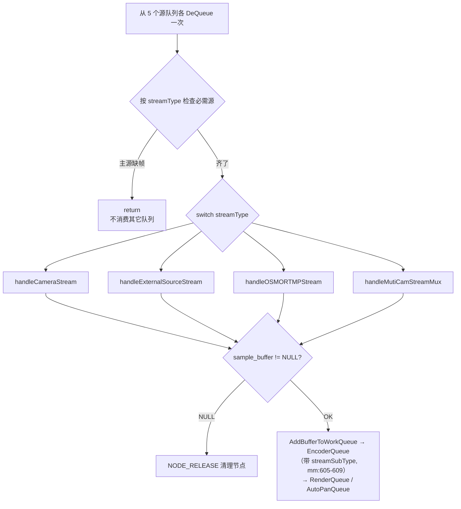
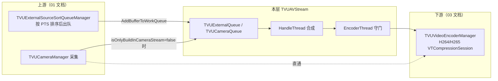

# 合流层详细分析 — TVUAVStream

> 基于 tvuanywhere_ios 仓库 `share/DefaultTitle` 分支（commit `89e4c235a`，2026-06-12）
> 目录：`products/TVUTransportIOS/TVUAnywherePro/TVUAnywhereSDK/TVUAVStream/`
>
> 📚 **系列文档**（完整索引见 [README.md](./README.md)）
> 上游：[01-外部源模块-TVUExternalSource.md](./01-外部源模块-TVUExternalSource.md) ｜ 下游：[03-编码层-TVUEncoder.md](./03-编码层-TVUEncoder.md)

---

## 一、模块定位

TVUAVStream 是**所有视频源在编码前的汇聚点**。Camera、外部源（本地文件/RTSP/组播）、OSMO、双摄、DJI RTMP 等各路 `CMSampleBuffer` 全部进入这一层的队列，由 HandleThread 按 `streamType` 取帧、合成（PIP/PBP/高斯模糊背景/水印），再经 EncoderThread 做 PTS 守门后送入 `TVUVideoEncoderManager`。

| 文件 | 行数 | 职责 |
|---|---|---|
| `TVUAVStreamManager.h/.mm` | ~2770 | C++ 单例。队列管理、4 线程驱动、streamType 路由、合成调度、编码入口 |
| `TVUAVStreamHandleManager.h/.mm` | ~1466 | 像素级合成算法（PIP/PBP）、性能分级 |
| `TVUAVQueue.h/.mm` | ~236 | Free/Work 双队列数据结构（与外部源模块同款手法） |
| `TVUStreamHelper.h/.mm` | ~39 | 辅助工具 |

> 注意：`TVUAVStreamManager` 是 **C++ 类**（非 ObjC），`getInstance()` + `static mutex` 双重锁单例（TVUAVStreamManager.h:56-66）。

---

## 二、整体结构图


---

## 三、streamType 全集（TVUAVQueue.h:23-43）

```cpp
typedef enum : int {
    TVUAVStreamNone = -1,
    TVUAVStreamCamera = 0,               // 纯内置摄像头
    TVUAVStreamCameraPBP,                // 双摄 PBP
    TVUAVstreamMutiCameraSourcePIP,      // 双摄 PIP
    TVUAVStreamExternalSource,           // 纯外部源
    TVUAVStreamExternalSourcePBP,        // 外部源 + PBP
    TVUAVStreamExternalSourcePIP,        // 外部源 + PIP
    TVUAVStreamExternalSourcePicture,    // 外部图片源（含 PBP/PIP 变体）
    TVUAVStreamExternalSourcePicturePBP,
    TVUAVStreamExternalSourcePicturePIP,
    TVUAVStreamOSMO,                     // DJI OSMO（含 PBP/PIP 变体）
    TVUAVStreamOSMOPBP,
    TVUAVStreamOSMOPIP,
    TVUAVStreamCrop,                     // AutoPan 裁剪流
    TVUAVStreamOSMORTMP,                 // DJI OA5 Pro Wi-Fi RTMP 流
} TVUAVStreamType;
```

分发矩阵（handleWithSamplebuffer 内 switch，TVUAVStreamManager.mm:531-573）：

| streamType | 处理函数 | 主源 / 辅源 |
|---|---|---|
| Camera | `handleCameraStream(camera_node)` | Camera |
| Crop | `handleCropStream(camera_node)` | Camera（AutoPan 裁剪） |
| ExternalSource / Picture / PIP / PBP | `handleExternalSourceStream(external_source_node, camera_node)`（mm:559） | 外部源主、Camera 辅 |
| OSMO / OSMOPIP / OSMOPBP | `handleExternalSourceStream(osmo_node, camera_node)`（mm:547） | OSMO 主、Camera 辅 |
| OSMORTMP | `handleOSMORTMPStream(osmoRTMP_node, camera_node)` | DJI RTMP |
| CameraPBP / MutiCameraSourcePIP | `handleMutiCamStreamMux(camera_node, mu_camera_node)` | 双摄 |

---

## 四、队列结构 TVUAVQueue

### 4.1 数据结构（TVUAVQueue.h:51-95）

```cpp
typedef struct TVUAVQueueNode {
    void   *data;               // CMSampleBufferRef（入队时 CFRetain）
    long   index;               // work_queue 全局递增编号
    struct TVUAVQueueNode *next;
    int fps;
    TVUAVStreamType streamType;
    int streamSubType;          // = externalSourceIndex
} TVUAVQueueNode;

class TVUAVQueueProcess {
    TVUAVQueue *m_free_queue;   // 空闲节点池（头插，LIFO）
    TVUAVQueue *m_work_queue;   // 待处理队列（尾插，FIFO）
    pthread_mutex_t free_queue_mutex, work_queue_mutex;
    int maxSize;                // = TVUAVQueueSize = 5（TVUAVQueue.mm:14）
};
```

- 与外部源模块的 `TVUExternalSourceQueue` 同一套 **Free/Work 双队列**手法：预分配 5 个节点，零运行期 malloc。
- **丢帧策略是隐式的**：free_queue 取不到节点（5 帧都积压在 work_queue）时 `AddBufferToWorkQueue` 直接 return，**新帧被丢弃**（丢新不丢旧）。
- 消费完毕由 `ResetWorkQueueNode()` 做 `CFRelease(buffer)` 并把节点还回 free_queue（TVUAVQueue.mm:224-235）。

### 4.2 入队守门（TVUAVStreamManager.mm:2172-2240）

`AddBufferToWorkQueue()` 是唯一入口，做三件事：

1. **源索引过滤**（mm:2212-2215）：External/OSMO 队列只接受 `externalSourceIndex == external_source_index`（当前活跃源）的帧，**切源瞬间旧源的尾巴帧直接丢弃**，防止两个源混流：

```cpp
if ((queue->type == TVUExternalQueue || queue->type == TVUOSMOQueue) &&
    externalSourceIndex != external_source_index) {
    return;  // 丢弃
}
```

2. `CFRetain(sampleBuffer)` 后填充节点（streamType / streamSubType / fps）。
3. 入 work_queue。

> 这与 [时间戳专题/01-PTS设计逻辑分析.md](./时间戳专题/01-PTS设计逻辑分析.md) §10 讨论的"切源时序"直接相关：索引过滤在入队层，PTS 过滤在编码层，两道闸。

---

## 五、线程模型

### 5.1 四线程（threadInit，TVUAVStreamManager.mm:2526-2549）

| 线程 | 循环体 | 节奏 | 职责 |
|---|---|---|---|
| HandleThread | `handleThread()` mm:222-242 | 自适应 ~100Hz | 取帧 → 合成 → 分发 Render/Encoder/AutoPan |
| EncoderThread | `encoderWithSamplebuffer()` mm:1735 | 空队时 usleep(10ms) | PTS 守门 → 水印 → 送编码器 |
| RenderThread | renderThread | ~100Hz | UI 预览 |
| AutoPanThread | autoPanThread | ~100Hz | 人脸检测 / pan 区域 |

HandleThread 的自适应 sleep（mm:234-240）：

```cpp
if ([[TVUAnywhere manager] isOnlyBuildInCameraStream]) {
    usleep(TVU_EMPTY_TASK_MS*1000);   // 纯相机直通模式：合流层闲置，200ms 一拍
} else {
    if (processTime < 10) usleep(10*1000);  // 正常 10ms 一拍
}
```

> `TVU_EMPTY_TASK_MS = 200`（mm:221）。**纯内置相机直播不走合流层**——`TVUAnywhere.mm` 的 `sendToEncodeWithSampleBuffer:` 在 `isOnlyBuildInCameraStream` 时直送编码，此处四线程全部空转省电。

### 5.2 锁与竞态

- 每队两把 `pthread_mutex_t`（free/work 分离），临界区只有链表操作，竞争轻。
- 线程级 `mutex + cond` 用于 Suspend/Active（mm:2439-2466）。
- `checkSampleBufferPTSForEncode` 内部用 `static` 局部变量保存 last_pts / last_externalSourceIndex（mm:1703-1733），**只有 EncoderThread 单线程调用**，事实安全但写法脆弱（换并发模型即坏）。

---

## 六、主循环 handleWithSamplebuffer()（mm:397-627）



要点：

- **主源优先**：ExternalSource 系列模式下 `external_source_node == NULL` 直接 return（mm:407-573 的前置检查），Camera 帧此拍不消费——外部源的节奏决定输出节奏。
- 纯 Camera 模式下混入的后置双摄帧（`streamSubType == kTVUMutiCameraBackIndex`）被丢弃。
- 合成结果入 EncoderQueue 时把**主源的 streamSubType 一并带上**（mm:605-609），这是 externalSourceIndex 能贯穿到编码器的关键一跳。

---

## 七、handleExternalSourceStream() 合成详解（mm:914-1189）

这是 PIP/PBP 模式下每一帧都要走的最重的函数。处理顺序：

### 7.1 流程

1. **取外部源帧与 PTS**（mm:966）：`presentationTimeStamp = CMSampleBufferGetPresentationTimeStamp(external_source_sample_buffer)` —— **合成输出沿用外部源的 PTS**。
2. **HDR(10bit) 旁路**（mm:932-959）：HDR 帧不支持合成，宽高比一致直接 `CMSampleBufferCreateCopy` 透传，不一致只做缩放。
3. **等比缩放适配编码分辨率**（mm:993-1013）：保持源宽高比，限制在 encoder_width × encoder_height 内。
4. **高斯模糊背景**（`getExternalSourceBackgroundFillBufferRef`，mm:322-395）：AspectFill 铺满 → `TVUGaussianBlurManager blurLevel:6` → 与缩放后的源帧合成，竖屏视频两侧出现模糊背景就来自这里。
5. **Camera 辅帧**（mm:1068-1079）：`camera_node == NULL` 时复用 `last_camera_sample_buffer`（缓存上一帧），不阻塞合成。
6. **PIP / PBP 合成**：调 `TVUAVStreamHandleManager` 静态方法。

### 7.2 PIP 合成（mm:1111-1129）

```cpp
TVUDevicePerformanceLevel level = [TVUAVStreamHandleManager currentPerformanceLevel];
int offsetX = level != TVUDevicePerformanceLevelLow ? pip_x : _destX;  // 低端机用降级坐标
pixelBuffer_output = [TVUAVStreamHandleManager handleExternalPIPStreamWithCameraPixelBuffer:camera_pixel_buffer
                                                  ExternalPixelbuffer:external_compose_buffer
                                               Background_pixelBuffer:external_source_background_pixelBuffer
                                                              OffsetX:offsetX OffsetY:offsetY
                                                              OutSize:CGSizeMake(encoder_width, encoder_height)
                                                                Scale:pip_scale];   // 默认 0.25，范围 0.25~1.0
```

PIP 小窗位置可拖动：`updateFrame(pointX, pointY, ...)`（mm:2242-2406）实时更新 pip_x/pip_y。

### 7.3 PBP 合成（mm:1095-1108）

```cpp
pixelBuffer_output = [TVUAVStreamHandleManager handleExternalPBPStreamWithLeftPixelBuffer:camera_pixel_buffer
                                                 RightPixelBuffer:external_compose_buffer
                                            BackgroundPixelBuffer:external_source_background_pixelBuffer
                                                            Scale:(cameraPBPType == TVUMutiCameraPBPType_ScalePBP)
                                                      Orientation:currentOrientation
                                             ExchangeLeftAndRight:!(currentOrientation == UIInterfaceOrientationLandscapeRight)
                                                          OffsetX:_offsetX_pbp
                                                        RightZoom:desiredZoomFactor     // 1~10
                                                          OutSize:CGSizeMake(encoder_width, encoder_height)];
```

### 7.4 输出

```cpp
// mm:1175 — 合成结果重新打成 CMSampleBuffer，PTS 仍是外部源的
sampleBuffer_output = [TVUVideoFilter convertCVImageBufferRefToCMSampleBufferRef:pixelBuffer_output
                                                 withPresentationTimeStamp:presentationTimeStamp];
```

### 7.5 过渡帧 addTransitionFrame()（mm:2581-2680，**已禁用**）

外部源断帧时原设计会补"淡出帧"（复制上一帧、Y 分量 × 0.999 逐帧变暗、PTS += 1/fps，断帧超 `kTVUAddVideoFrameCount = 4` 帧间隔触发）。但：

```cpp
void TVUAVStreamManager::addTransitionFrame() {
    // 在某些机型上，直播时没有进行切换源也会进行补帧，导致画面变暗，暂时屏蔽掉补帧的逻辑
    return;   // mm:2584 —— 整个机制被硬禁用
    ...
}
```

**现状：外部源断帧 = 编码器收不到帧 = 输出流直接停顿**，没有任何补帧。R 端看到的是冻结而非渐暗。

---

## 八、编码入口 sendToEncoderWithSamplebuffer()（mm:1873-2082）

EncoderThread 从 EncoderQueue 取帧后进入此函数，依次：

### 8.1 PTS 守门 checkSampleBufferPTSForEncode（mm:1703-1733，调用点 mm:1898）

| 场景 | 条件 | 行为 |
|---|---|---|
| 同源 | `current_pts - last_pts < 10ms` | 丢弃（防止 PTS 过近导致编码器码率压死） |
| 切源（externalSourceIndex 变化） | 间隔 `< 1000/fps` ms | 丢弃；间隔够才接受新 index |

> mm:1747 处还有一个调用点，但**整段被注释**，真实守门只在 mm:1898 这一处。

### 8.2 水印 / Overlay（mm:1963-1999）

`TVUSnapshotManager` 有活跃节点时：内置全屏模板（Privacy Screen / Starting Soon）直接整帧替换；普通水印走 GPU 合成 `addImageWatermarksToNV12BufferGPU`。

### 8.3 isNeedKeyFrame 判定（mm:2027-2058）

三个条件命中任一则为 YES：

1. **streamType 或 streamSubType 变化**（切模式、切源）；
2. **前/后摄切换**——从 EXIF attachment 的 `LensModel` 字符串里嗅探 `"front"`（mm:2036-2052）；
3. **开播首帧**（static isFirst）。

### 8.4 调编码器（mm:2068-2070）

```cpp
[[TVUVideoEncoderManager manager] encode:customizeSampleBuffer ?: samplebuffer
                          isNeedKeyFrame:isNeedKeyFrame
                     externalSourceIndex:streamSubType];
```

> 结合编码层的 GOP 配置（`MaxKeyFrameIntervalDuration = 600` **秒**，见 [03-编码层](./03-编码层-TVUEncoder.md) §2.1）：**整条链路的 I 帧几乎完全靠这里的三个条件驱动**，编码器自身基本不会自发插 I 帧。

---

## 九、externalSourceIndex 语义汇总

| 值 | 含义 |
|---|---|
| `-1`（kTVULocalCameraVideoIndex） | 内置摄像头 |
| `-2`（kTVUExternal_Index_Invalid） | 初始/无效（ITA-1070 防 DJI 冲突） |
| `1/2/3/4` | 外部源槽位（本地文件/图片等） |
| `5` | DJI |
| `1001`（kTVUMutiCameraBackIndex） | 双摄后置 |
| TVUScreenRecordingSourceIndex | 屏幕录制 |

贯穿链路：解码回调入队（streamSubType）→ 合成输出带回 EncoderQueue → PTS 守门按它判定"切源" → `encode:...externalSourceIndex:` → 编码层据此触发低码率监控重启（见 03 文档 §1.3）→ 音频侧 `TVUAudioEncoderManager` 也按它过滤异源音频。

---

## 十、与上下游的衔接



---

## 十一、值得注意的设计点 / 风险

1. **节奏耦合**：合成输出节奏完全由主源（外部源）驱动，外部源 fps 抖动直接传导到编码节奏；Camera 辅帧靠"复用上一帧"解耦。
2. **过渡帧机制名存实亡**（mm:2584 硬 return），断帧无兜底。
3. **static 状态散布**：PTS 守门、isNeedKeyFrame 判定、last_camera_sample_buffer 都是函数级 static / 成员裸指针，依赖"单线程消费"这一隐含约定。
4. **EXIF LensModel 嗅探**前后摄切换属于脆弱启发式，系统行为变化即失效（只影响 I 帧时机，不影响正确性）。
5. **隐式丢新帧**：队列满丢新不丢旧，高负载下会放大端到端延迟（旧帧仍排队），而非追新。
