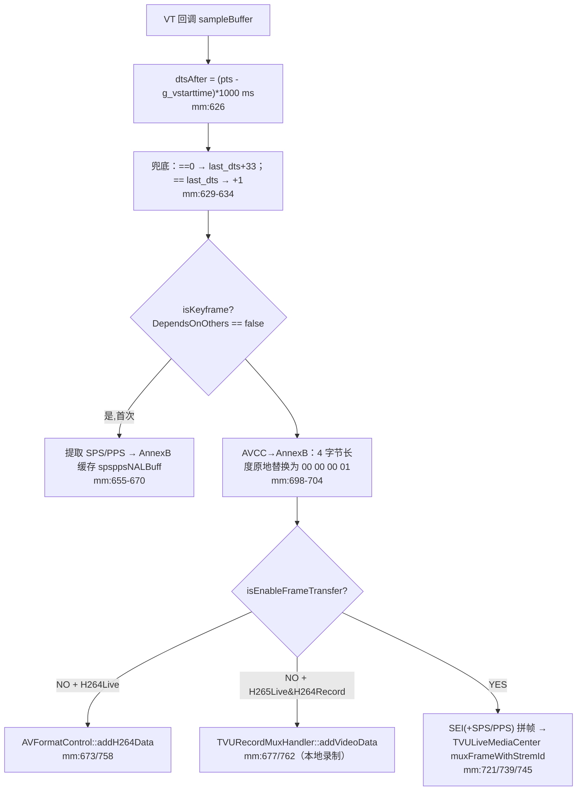

# 编码层详细分析 — TVUEncoder（H264/H265 硬编码 + AAC）

> 基于 tvuanywhere_ios 仓库 `share/DefaultTitle` 分支（commit `89e4c235a`，2026-06-12）
> 目录：`products/TVUTransportIOS/TVUAnywherePro/TVUAnywhereSDK/TVUEncoder/`
>
> 📚 **系列文档**（完整索引见 [README.md](./README.md)）
> 上游：[02-合流层-TVUAVStream.md](./02-合流层-TVUAVStream.md) ｜ 下游：[04-推流层-Mux与Transport.md](./04-推流层-Mux与Transport.md)

---

## 一、TVUVideoEncoderManager — 编码调度

| 文件 | 行数 | 职责 |
|---|---|---|
| `TVUVideoEncoderManager.h/.mm` | ~400 | ObjC 单例。H264/H265 双编码器调度、参数管理、码率监控 |
| `TVUVideoH264Encoder.h/.mm` | ~770 | VideoToolbox H264 硬编码 + 回调出口 |
| `TVUVideoH265Encoder.h/.mm` | ~845 | VideoToolbox HEVC 硬编码 + HDR |
| `TVUAudioEncoderManager.h/.mm` | ~747 | AudioToolbox AAC 编码 + 混音/声道转换 |

### 1.1 双编码器与模式选择（TVUVideoEncoderManager.mm:133-150）

```objc
- (void)selectLiveWay:(TVULiveWay)liveWay andRecordWay:(TVURecordWay)recordWay {
    if (liveWay == TVUH264Live && recordWay == TVUH264Record) {
        self.enableH264 = YES;  self.enableH265 = NO;
    } else if (liveWay == TVUH265Live && recordWay == TVUH265Record) {
        self.enableH264 = NO;   self.enableH265 = YES;
    } else {
        self.enableH264 = YES;  self.enableH265 = YES;   // 混合：直播 H265 + 录制 H264 等
    }
}
```

三种模式：纯 H264、纯 H265、**混合模式（两个 VTCompressionSession 同时跑同一帧）**——例如直播走 HEVC、本地录制走 H264。`supportH265Encode` 由硬件能力判定（iOS 11+，mm:78-82）。

所有编码器创建/销毁在串行队列 `tvu_video_encoder_queue` 上执行（mm:32,74），避免阻塞调用线程。

### 1.2 encode 入口（mm:240-285）

```objc
- (void)encode:(CMSampleBufferRef)sampleBuffer isNeedKeyFrame:(BOOL)isNeedKeyFrame
                                          externalSourceIndex:(int)externalSourceIndex {
    if (self.enableH264) { /* H264Live 直接编；否则仅在录制 mux 打开时编 */ }
    if (self.enableH265) { [self.h265Encoder encode:sampleBuffer isNeedKeyFrame:isNeedKeyFrame]; }
    if (self.lastExternalSourceIndex != externalSourceIndex) { /* 见 1.3 */ }
}
```

### 1.3 切源低码率监控（mm:267-285, 367-398）

`externalSourceIndex` 变为外部源（1/2/3/4/屏幕录制）时，延迟 `getLiveDelayTime()` 后启动 1s 定时器：**连续 3 秒输出码率 < 100kbps 就重启编码器**——对付外部源切换后编码器"卡死"产出超低码率的疑难场景。

### 1.4 与相机联动

编码器初始化成功后回调 `tvuVideoEncoderWillStart`（H264:263-265 / H265:300-302），delegate 据编码分辨率反向设置相机分辨率与 FPS（TVUVideoEncoderManager.h:30-33 注释明确了这一约定）。

---

## 二、TVUVideoH264Encoder — VTCompressionSession 配置

### 2.1 会话创建与属性（mm:122-251）

| 属性 | 值 | 说明 |
|---|---|---|
| codecType | `kCMVideoCodecType_H264` | mm:125 |
| `RealTime` | 屏幕录制时 true，文件/相机 false | 64-bit 才设；mm:131-158 |
| `ProfileLevel` | Main_AutoLevel（Lite 版 Baseline） | 编译开关决定；mm:160-179 |
| `H264EntropyMode` | CAVLC（仅 32-bit 老设备） | mm:201-208 |
| `ExpectedFrameRate` | encoderFrameRate | mm:211-224 |
| `AllowFrameReordering` | **false（禁 B 帧）** | mm:231-238 |
| `MaxKeyFrameIntervalDuration` | **600 秒**（`TVU_KEY_FRAME_INTERVAL_iPhone/iPad = 60*10`，TVUConst.h:428-429） | mm:240-250 |
| `AverageBitRate` + `DataRateLimits` | 见 2.2 | mm:296-358 |

> ⚠️ **GOP 的真相**：`MaxKeyFrameIntervalDuration` 单位是**秒**，配的是 600 秒 = 10 分钟。也就是说编码器自身几乎从不自发插 I 帧，**I 帧节奏完全由合流层的 isNeedKeyFrame（首帧/切源/切摄像头）和 TVULiveMediaCenter 的 forceInsertKeyFrame 驱动**。TVU 传输协议不依赖固定 GOP，R 端按需请求关键帧。

### 2.2 码率控制 applyBitRateConfigurations（mm:296-358）

```objc
int targetBitRate = self.bitRate;
if (TVUH265Live == [TVUEnvironmentCofigTool currentLiveWay]) {
    targetBitRate = TVU_H365LIVE_h264RECORD_BITRATE;   // 5 Mbps：H265 直播时 H264 只服务录制
}
VTSessionSetProperty(compressionSession, kVTCompressionPropertyKey_AverageBitRate, bitRateRef);

int bytesPerSecond = targetBitRate >> 3;   // 1 秒窗口的硬上限
VTSessionSetProperty(compressionSession, kVTCompressionPropertyKey_DataRateLimits,
                     @[bytesPerSecond, 1]);
```

- `AverageBitRate` 管长期均值，`DataRateLimits`（bytes/1s 窗口）防场景突变时瞬时飙升。
- 运行期 `updateBitRate:`（由推流层网络反馈触发，见 04 文档 §8）对两个编码器同时生效。

### 2.3 encode 帧入口（mm:373-448）

关键步骤：

1. **g_vstarttime 初始化**（mm:386）：第一帧编码时 `g_vstarttime = CMTimeGetSeconds(pts)`，同时记 `g_tvustartcaptureTime`（gettimeofday 微秒）。注意这是**三处互斥初始化点之一**（另两处：H265Encoder.mm:431、AVStreamManager.mm:2197），靠 `g_tvustartcaptureTime == 0` 守卫——纯相机直通走编码器这里，多源模式走合流层入队那里。详见 [时间戳专题/04-NTP时钟同步.md](./时间戳专题/04-NTP时钟同步-TVUHostTimer.md) §4 与 [时间戳专题/01](./时间戳专题/01-PTS设计逻辑分析.md) §13。
2. **NTP 容差补偿**：`ntpLiveFaultTolerance` 非零时给 PTS 加偏移。
3. **PTS 单调性守门**：`currentPts < lastPts` 的帧直接丢（DJI/相机切换时可能出现倒退）。
4. **强制关键帧**：`isNeedForceInsertKeyFrame` 时带 `kVTEncodeFrameOptionKey_ForceKeyFrame` 字典调 `VTCompressionSessionEncodeFrame`，duration 恒为 `kCMTimeInvalid`。
5. **错误恢复**：`kVTInvalidSessionErr` → 原地 `startEncoder` 重建；其它错误 → `closeEncoder` + delegate 上抛。

### 2.4 编码回调 videoEncodeCallBack（mm:589-768）



- **dts 兜底**注释原文：*"sometimes relative dts is zero, provide a workground to restore dts"*（mm:628）——`dtsAfter==0` 补 `last_dts+33`（按 30fps 拍脑袋），重复则 +1，保证严格递增。这两处硬编码已在 [时间戳专题/03-时间戳设计评价.md](./时间戳专题/03-时间戳设计评价.md) §2.4 点名。
- `finishH264NALUHeaderState` 在 `closeEncoder` 时复位（mm:369），重启会话后重新提取参数集。
- Frame Transfer 路径上：I 帧 = SEI + SPS/PPS + 帧数据拼成一个 buffer；P 帧按需前置 SEI（mm:706-754）。

---

## 三、TVUVideoH265Encoder — 与 H264 的差异

| 维度 | H264 | H265 |
|---|---|---|
| `RealTime` | 条件式 | **无条件 true**（mm:146） |
| ProfileLevel | Main/Baseline | Main；HDR 时 Main10（iOS11+）/ Main42210（iOS15.4+）（mm:176-195） |
| GOP 属性名 | MaxKeyFrameIntervalDuration | `kVTCompressionPropertyKey_MaxKeyFrameInterval`（mm:254） |
| `AllowOpenGOP` | 无 | **false**（iOS12+，mm:237）——保证每个 IDR 可独立解码 |
| 参数集 | SPS+PPS（静态缓存） | VPS+SPS+PPS（mm:700-738，**每帧 malloc/free**） |
| 强制 I 帧 | forceInsertKeyFrame 属性 | encode:isNeedKeyFrame: 直接传参 |

### HDR 配置（enableHDRCompressionSessionConfig，mm:372-398，iOS 14+）

```objc
kVTCompressionPropertyKey_HDRMetadataInsertionMode = Auto
kVTCompressionPropertyKey_PreserveDynamicHDRMetadata = true
ColorPrimaries = ITU_R_2020          // BT.2020
TransferFunction = ITU_R_2100_HLG    // HLG（广播友好）
YCbCrMatrix = ITU_R_2020
```

回调输出与 H264 对称（mm:628-843），区别：`addH264Data` 多传 `isHDR` 标志（mm:811），录制走 `TVUH265Record` 分支。

---

## 四、TVUAudioEncoderManager — AAC 编码

### 4.1 编码器参数（TVUAudioEncoderManager.h:13-18, mm:562-646）

| 参数 | 值 |
|---|---|
| API | **AudioToolbox `AudioConverterRef`**（`AudioConverterNewSpecific`，优先硬件 codec） |
| 输入 | PCM s16、48000 Hz、双声道（`kTVUAudioEncoderSampleRate = 48000`） |
| 输出 | AAC-LC、`FramesPerPacket = 1024` |
| 码率 | 固定 128 kbps（`kTVUAudioEncoderBitRate`） |
| 质量 | Medium（主产品）/ Low（Lite） |

### 4.2 输入与预处理（mm:92-320）

来源：`TVURecorder` / 本地 mic 采集，以及外部源音频混音输出（`TVUExternalSourceAudioMixerQueueManager`，见 01 文档 §4.8）。入参结构 `TVUAudioEncoderData {data, size, pts, channel, sampleRate, external_source_index}`。

编码前依次：

1. **异源过滤**（mm:243-265）：`param->external_source_index != self.external_source_index` 的帧丢弃（Accsoon 内置音频例外），与视频侧的索引过滤对称。
2. **单声道→双声道**（mm:185-192, 711-722）：逐 sample 复制 L=R。
3. **会议混音**（mm:267-312）：Partyline（Agora）优先、VOIP（屏幕录制）次之，混入 PCM 后再编码。

### 4.3 时间戳与输出（mm:180-181, 350-399）

```objc
int64_t newPts = (int64_t)((param->pts - g_vstarttime) * 1000);   // 与视频共用同一基准
```

输出路径与视频完全对称：

```objc
if (isEnableTransfer) {
    [[TVULiveMediaCenter center] muxFrameWithStremId:TVU_LIVE_STREAM_ID_A
                                         andKeyFrame:1 andPts:newPts ...];   // mm:384
} else {
    AVFormatControl::GetInstance()->addAACData(data, size, newPts,
                                               param->channel, param->sampleRate);  // mm:393
}
```

> **音视频同步的本质**：视频 `dtsAfter` 与音频 `newPts` 减的是同一个 `g_vstarttime`，且都来自 HostTime 时钟域——这正是 [方案/RTMP聚合转发方案](./方案/RTMP聚合转发-时间戳重算与PLL方案.md) §7 主张的"单一全局锚点"，本链路天然满足。

---

## 五、错误处理与恢复链

| 错误（TVUVideoEncoderManager.h:18-23） | 触发 | 恢复 |
|---|---|---|
| CreateSessionFailured | VTCompressionSessionCreate 失败 | delegate 上抛，由 TVURecorder 重启编码器+相机 |
| EncodeFrameFailured | EncodeFrame 失败（非 InvalidSession） | closeEncoder + delegate |
| EncodeCallbackFailured | 回调 status != noErr | delegate |
| （特例）kVTInvalidSessionErr | 后台切换等导致会话失效 | **encode 内原地 startEncoder 重建**（H264 mm:435-445） |

另有 `TVUCheckAbnormalTool`（H264 mm:613-619）持续比对编码 PTS 与系统时间，做异常检测与 Frame Transfer 模式的 CMTime offset 计算。

---

## 六、编译开关速查

| 宏 | 影响 |
|---|---|
| `TVU_HIT_ME` / `_TVUSDKANYWHERE` | RealTime 按 isReceivingFrame；Profile Main；CheckAbnormal 行为 |
| `_TVUSDKANYWHERELITE` | H264 固定 Baseline；AAC 质量 Low |
| `_TVUSDKPartyline` | 禁用 SEI / TVULiveMediaCenter 出口（H264 mm:707） |

---

## 七、参数速查表

| 参数 | 默认/取值 |
|---|---|
| 编码分辨率 | 默认 1280×720（kTVUVideoEncoderDefault*，.h:14-16），支持到 4K |
| FPS | 默认 30 |
| B 帧 | 禁用（双编码器一致） |
| I 帧间隔 | 600 秒（事实上由业务事件驱动） |
| H264 码率（H265 直播时） | 5,120,000 bps（仅供录制） |
| AAC | 48kHz / stereo / 128kbps / 1024 frames/packet |
| 视频 dts | `(pts - g_vstarttime)*1000` ms，兜底 +33/+1 |
| 音频 pts | `(pts - g_vstarttime)*1000` ms |
