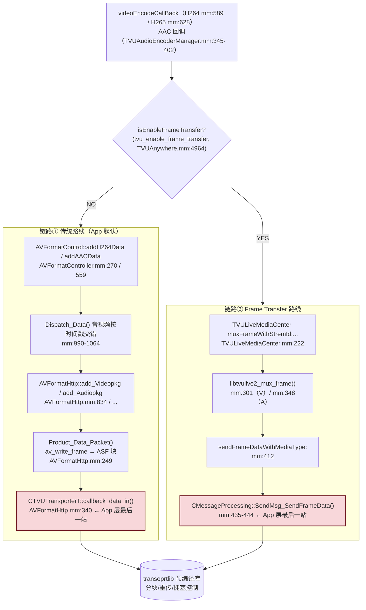

# 推流层详细分析 — Mux 与 Transport 边界

> 基于 tvuanywhere_ios 仓库 `share/DefaultTitle` 分支（commit `89e4c235a`，2026-06-12）
> 目录：`products/TVUTransportIOS/TVUAnywherePro/TVUAnywhereSDK/TVUFormat/`、`TVUSEI/`、`products/release/transoprtlib/`
>
> 📚 **系列文档**（完整索引见 [README.md](./README.md)）
> 上游：[03-编码层-TVUEncoder.md](./03-编码层-TVUEncoder.md)。本文是管线的最后一站：编码后的 ES 数据如何 mux、插 SEI、交给 TVU 传输库。

---

## 一、两条推流链路总览

编码回调（`videoEncodeCallBack` / AAC 回调）按 `isEnableFrameTransfer` 走两条互斥链路：



另有第三条**录制旁路**：编码输出经 `TVURecordMuxHandler::addVideoData` 或 `AVRecorder::recordData` 落成本地 **.asf** 文件（后台再转 MP4），不上网络。详见 [06-本地录制旁路.md](./06-本地录制旁路.md)。

> **ShareStream 与本链路无关**：`Transmitter/ShareStream/` 只是把流转发到 YouTube/Facebook 的**配置 UI**，实际转推由云端（R 端/Grid）完成，App 仍然只推 TVU 流。

---

## 二、链路①：AVFormatControl（传统路线）

### 2.1 两份 AVFormatController 的关系

| 路径 | 角色 |
|---|---|
| `TVUAnywhereSDK/TVUFormat/AVFormatController.h/.mm` | ✅ App target 实际使用 |
| `Transmitter/Transmitter/formatConvert/AVFormatController.h/.cpp` | ❌ 历史版本，未参与编译 |

### 2.2 addH264Data（AVFormatController.mm:270-556）

三段式：

1. **懒初始化**（mm:280-364）：首帧到达时建 FFmpeg `AVFormatContext`，按 liveWay 选 `AV_CODEC_ID_H264/HEVC`，`stream->time_base = {1,1000}`（毫秒精度，mm:335），然后对所有注册的输出器调 `beginConvert()`（mm:355）。
2. **SPS/PPS 缓存**（mm:366-413）：`isspspps == YES` 的调用只把参数集存进 `m_spspps`，直接 return，不进队列。
3. **打包入队**（mm:415-556）：
   - I 帧拼装顺序：**SEI → SPS/PPS → 帧数据**（SEI 从 `TVUSeiInfoManager` 现取，mm:454-464）；
   - `item.data->pts = item.data->dts = dts`（编码层算好的毫秒 dts 原样透传）；
   - push 进 `m_VideoListPack`，满了仅打日志丢弃。

`addAACData`（mm:559-651）对称，进 `m_AudioListPack`。

### 2.3 Dispatch_Data — 音视频交错（mm:990-1064）

独立线程死循环：

```cpp
// 两队列都有数据才动，否则 usleep(15ms)
if (audiopack.time_stamp >= videopack.time_stamp) {
    doAdd_VPkg(videopack.data, videopack.time_stamp);   // 先发时间戳小的
} else {
    doAdd_APkg(audiopack.data, audiopack.time_stamp);
}
```

- **单调交错输出**：保证送进 mux 的包按时间戳非降序——这就是 R 端/服务器侧看到的时间戳秩序的最后保障。
- 隐含约束：**任一队列断流，另一路也会被卡住**（互相等待）——与 TVULiveMediaCenter 的 a_ready/v_ready 互锁是同一设计哲学。
- 之后 `doAdd_VPkg` 把包分发给所有注册的 `AVFormatBase` 子类（mm:1134-1137），当前生效的是 `AVFormatHttp`。

### 2.4 AVFormatHttp::Product_Data_Packet — ASF mux + 推网（AVFormatHttp.mm:249-361）

```cpp
avio_open_dyn_buf(&m_outputContext->pb);                       // mm:256 动态内存缓冲
spsppsChanged = checkIfSpsppsChanged(pack);                    // I 帧时检测分辨率变化
av_write_frame(m_outputContext, pack);                         // mm:269 FFmpeg mux 成 ASF 块
g_mediaTimestamp = CTimeThread::GetCurrentTime() - sys_time_offset;  // mm:281
len = avio_close_dyn_buf(m_outputContext->pb, &output);        // mm:288 拿到 ASF 字节流

if (H264Live && H264Record)
    AVRecorder::recordData(output, len, isVIFrame, spsppsChanged);   // mm:307 本地录制复用同一份 ASF

if (g_livestate && [TVUHostTimer ntpSynced]) {                 // mm:312 双门槛
    if (!hadsendhead) { Product_Data_Head(true); hadsendhead = true; }  // ASF Header 仅一次
    CTVUTransporterT::callback_data_in((uint8*)output, len, g_oTVUTransportT);  // mm:340 ★
}
```

关键结论：

- **容器格式是 ASF**，由 FFmpeg `av_write_frame` 生成；交给传输库的是 ASF 字节块（非裸 NAL）。
- **NTP 未同步前不推流**（`[TVUHostTimer ntpSynced]`）——服务端时间戳对齐的前提。
- 时基转换发生在 `add_Videopkg`（mm:847）：`av_rescale_q(pts, {1,1000}, stream->time_base)`。
- mm:724/780 还有两处 `callback_data_in`，对应 Header/其它数据路径。

### 2.5 传输库边界

| 项 | 内容 |
|---|---|
| 库 | `products/release/transoprtlib/`，**预编译 .a + 头文件**（App 层黑盒） |
| 核心类 | `CTVUTransporterT`（全局 `g_oTVUTransportT`） |
| 数据入口 | `CTVUTransporterT::callback_data_in(uint8*, uint32, void*)`（TVUTransporterT.h:177） |
| 生命周期 | `AVFormatHttp::startTransportT()`（mm:180-190，new + 专属 pthread）；`stopTransportT()`（mm:192-200，OffAir → StopTransporter → join） |
| 启动时机 | `TVUAnywhere.mm:360` App 激活流程中调用 |
| 库内职责 | 分块（约 1280 bytes/块）、多链路聚合、重传、拥塞控制 |

---

## 三、链路②：TVULiveMediaCenter（Frame Transfer / libtvulive2）

`isEnableFrameTransfer == YES` 时启用（初始化即建 libtvulive2 mux 句柄并注册流信息，TVULiveMediaCenter.mm:81-113）。与链路①的本质区别：**不走 FFmpeg/ASF，用 TVU 自有的 libtvulive2 帧格式，逐帧消息化发送**。

### 3.1 muxFrameWithStremId（mm:222-362）

视频帧（`stream_id == TVU_LIVE_STREAM_ID_V`）处理序列：

1. **基准时间**（mm:234-245）：首个 I 帧时
   `media_base_time = (g_tvustartcaptureTime + NTP偏移)/1000 + cm_time_offset`，
   此后每帧 `packet_pts = media_base_time + pts` —— 把编码层的相对毫秒 dts 抬到**NTP 对齐的绝对时间轴**。
2. **音视频互锁**：`a_ready` 未置位时视频帧直接丢（mm:262），防止单流先跑。
3. **首帧必须 I 帧**：否则 `forceInsertKeyFrame` 并丢弃当前帧（mm:266）。
4. **周期 Mux Header**：每 `video_fps` 帧重发一次 `libtvulive2_mux_header`（mm:273-287），供对端随时入流。
5. **核心 mux**：`libtvulive2_mux_frame(_hmux, &buff, stream_id, keyFrame, packet_pts, packet_pts, frameIndex_v++, data, len)`（mm:301）。

音频帧（mm:326-360）：先补 **ADTS 头**（mm:340）再 mux——libtvulive2 要求 ADTS 封装的 AAC。

### 3.2 sendFrameDataWithMediaType（mm:412-448）

```cpp
mediaInfo = {create_time, pts, dts, type, iframe};
r_peerID = g_oTVUTransportT->getRemoteLivePeerId();
if (separateFlag) {   // 音视频分流，各自独立 block_id
    CMessageProcessing::GetInstance()->SendMsg_SendFrameData(r_peerID, fid, buffer, len,
                                                             &mediaInfo, block_id_video, true, true);
} else {              // 合流
    CMessageProcessing::GetInstance()->SendMsg_SendFrameData(..., block_id, false, false);
}
```

App 层最后一站是 `CMessageProcessing::SendMsg_SendFrameData`（消息化、带媒体元信息），之后同样进入传输库。

---

## 四、SEI — TVUSeiInfoManager（TVUSEI/）

### 4.1 生成规则（TVUSeiInfoManager.mm:145-156）

```objc
- (NSData *)fetchSuitDataForSEIWithIsIFrame:(BOOL)isIFrame {
    if (self.isNeedInsertSCTE)  return [self fetchSeiInfoWithSeiInfoType:TVUSeiInfoType_All];  // SCTE+Interlace
    if (isIFrame)               return [self fetchSeiInfoWithSeiInfoType:TVUSeiInfoType_Interlance];
    return nil;   // 普通 P 帧无 SEI
}
```

### 4.2 数据结构（AVFormatController.h:36-103，`#pragma pack(1)`）

- 自定义 payload：`version(0x01) + counts + 若干 body + 0x80 结尾`；
- body 子类型：`INTERLACE_FLAG(0x01)`、`ROTATE_FLAG(0x02)`、`VIDEOID_FLAG(0x05, 36字节: peerid+timestamp)`、SCTE UUID；
- NAL 封装：H264 用 type 6（`00 00 00 01 06 64 ...`），H265 用 type 39 prefix SEI（`00 00 00 01 4E 01 64 ...`）。

### 4.3 插入位置

- 链路①：`addH264Data` 打包时拼在 I 帧最前（SEI→SPS/PPS→数据）；
- 链路②：编码回调里就拼好（H264Encoder mm:712-732），muxFrame 收到的已是含 SEI 的 buffer。

用途：SCTE 广告打点、隔行标志、Video ID 溯源（R 端按 SEI 关联 peer 与时间）。

---

## 五、码率自适应反馈（传输库 → 编码器）

```cpp
// AVFormatHttp.mm:58-90 — 传输库回调 App 层
void set_change_encoder_behaviour(int width, int height, int bitrate) {
    // bitrate 单位 kbps，由库内网络质量模型计算
    [[TVUVideoEncoderManager manager] updateBitRate:(g_bitrate << 10)];   // mm:89 → bps
}
```

闭环：**transoprtlib 测网 → 回调建议码率 → updateBitRate → VTSession AverageBitRate/DataRateLimits 热更新**。`g_bitrate` 同时供 UI 显示（TVUAnywhereStandardLiveView.mm:658）。

---

## 六、端到端链路（文字版，含行号）

### 视频（链路①，App 默认）

```
VTCompressionSession 回调 videoEncodeCallBack        TVUVideoH264Encoder.mm:589
  → dtsAfter=(pts-g_vstarttime)*1000 + 兜底           mm:626-634
  → AVCC→AnnexB                                       mm:698-704
  → AVFormatControl::addH264Data(SEI+SPS/PPS+data)    AVFormatController.mm:270
  → m_VideoListPack → Dispatch_Data 时间戳交错        mm:990-1064
  → AVFormatHttp::add_Videopkg（av_rescale_q）        AVFormatHttp.mm:834,847
  → Product_Data_Packet：av_write_frame → ASF 块      mm:249,269
  → [g_livestate && ntpSynced] CTVUTransporterT::callback_data_in   mm:312,340
  → transoprtlib（黑盒：分块/聚合/重传）→ 网络
```

### 音频（链路①）

```
AudioConverterFillComplexBuffer 回调                  TVUAudioEncoderManager.mm:350-399
  → newPts=(pts-g_vstarttime)*1000                    mm:180
  → AVFormatControl::addAACData                       mm:393 → AVFormatController.mm:559
  → m_AudioListPack → Dispatch_Data → add_Audiopkg → Product_Data_Packet → callback_data_in
```

### 视频（链路② Frame Transfer）

```
videoEncodeCallBack → SEI 拼帧                        TVUVideoH264Encoder.mm:706-754
  → TVULiveMediaCenter muxFrameWithStremId            TVULiveMediaCenter.mm:222
  → packet_pts = media_base_time + dts（NTP 对齐）    mm:234-245
  → libtvulive2_mux_frame                             mm:301
  → sendFrameDataWithMediaType                        mm:412
  → CMessageProcessing::SendMsg_SendFrameData         mm:435-444 → transoprtlib → 网络
```

---

## 七、时间戳在本层的最后形态

| 时间戳 | 单位 | 产生点 | 用途 |
|---|---|---|---|
| dts（编码层产出） | ms 相对 g_vstarttime | H264Encoder.mm:626 | 链路① AVPacket pts/dts；队列交错排序 |
| packet_pts | ms 绝对（NTP 域） | TVULiveMediaCenter.mm:245 | 链路② 网络传输时戳 |
| g_mediaTimestamp | ms | AVFormatHttp.mm:281 | mux 块创建时间，供库/统计 |
| ntpSynced | bool | TVUHostTimer | 链路①推网前置条件（mm:312） |

> 与 [时间戳专题](./时间戳专题/01-PTS设计逻辑分析.md) 的衔接：上游所有"锚点+偏移"的设计，最终都收敛为这一个**相对毫秒轴（链路①）或 NTP 绝对轴（链路②）**交给传输库；R 端重建时序的依据即在此。
