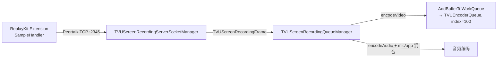
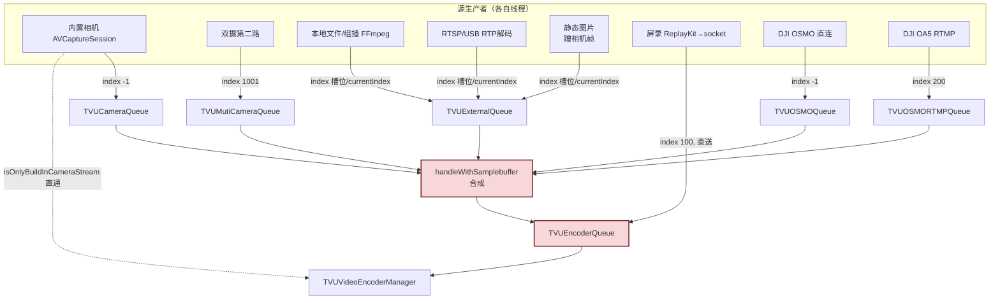

# 多源采集入队 — 各视频源如何进入合流层

> 基于 tvuanywhere_ios 仓库 `share/DefaultTitle` 分支（commit `89e4c235a`，2026-06-12）
>
> 📚 **系列文档**（完整索引见 [README.md](./README.md)）
> 本文是 [02-合流层-TVUAVStream.md](./02-合流层-TVUAVStream.md) 的**输入端补全**：02 讲队列里的帧怎么被消费，本文讲帧从各采集源怎么进队列。

---

## 一、唯一入队函数与 8 路队列

所有源最终都经一个函数进队（TVUAVStreamManager.mm:2172）：

```cpp
void TVUAVStreamManager::AddBufferToWorkQueue(
    CMSampleBufferRef sampleBuffer, TVUAVQueueProcess *queue,
    int externalSourceIndex = kTVULocalCameraVideoIndex,   // 默认 -1
    int fps = [[TVUVideoEncoderManager manager] getEncoderFrameRate]);
```

8 路队列（TVUAVQueue.h:11-20）：`TVUCameraQueue / TVUOSMOQueue / TVURenderQueue / TVUEncoderQueue / TVUAutoPanQueue / TVUExternalQueue / TVUMutiCameraQueue / TVUOSMORTMPQueue`。其中 Render/Encoder/AutoPan 三个是合流层**自己合成后回填**的（02 文档 §6），真正的"源生产者"只往前 5 个里的输入队列写。

---

## 二、源 → 队列 → externalSourceIndex 全景表

| 源 | 采集/产出点 | 入队点（文件:行号） | 目标队列 | externalSourceIndex |
|---|---|---|---|---|
| 内置相机（单/双摄主路） | AVCaptureSession 回调 | TVUAnywhere.mm:4226 | TVUCameraQueue | -1 |
| 双摄第二路 | tvuMutiCameraCaptureOutput | TVUAnywhere.mm:4435 | TVUMutiCameraQueue | 1001（kTVUMutiCameraBackIndex） |
| 本地文件/组播 | FFmpeg 解析循环 | TVUExternalSourceParse.mm:267 | TVUExternalQueue | 槽位 row（0/1/2…） |
| RTSP / USB(Accsoon) | RTP/硬解回调 | TVUExternalRTPStreamDecoder.mm:114 | TVUExternalQueue | sourceRef->external_source_index |
| 本地文件（排序后） | SortQueueManager 出队 | TVUExternalSourceSortQueueManager.mm:279 | TVUExternalQueue | node->external_source_index |
| 静态图片 | 蹭相机帧 timing | TVUExternalSourcePictureManager.mm:81 | TVUExternalQueue | currentIndex |
| 屏幕录制 | ReplayKit → socket | TVUScreenRecordingQueueManager.mm:438 | **TVUEncoderQueue**（直送，绕过合成） | 100（TVUScreenRecordingSourceIndex，已核实） |
| DJI OSMO（遥控直连） | DJISDK codec 回调 | MainViewController.mm:2427 | TVUOSMOQueue | -1 |
| DJI OA5 Pro Wi-Fi | RTMP ingest 回调 | RTMPIngestController.mm:~314 | TVUOSMORTMPQueue | 200（OSMORTMP，未选此项故未细核） |

> 行号来自专项 Explore；上表中加粗/已核实项为本轮二次核验过的关键数字（`TVUScreenRecordingSourceIndex = 100` 见 TVUScreenRecordingSocketProtocol.h:15）。其余采集侧行号以 agent 调研为准，后续引用前建议对照源码再确认。

---

## 三、内置相机（基线源）

### 3.1 直通 vs 合流的分叉（TVUAnywhere.mm:4205-4229）

`captureOutput:didOutputSampleBuffer:` → `sendToEncodeWithSampleBuffer:`，按 `isOnlyBuildInCameraStream` 分两条路：

```cpp
if ([self isOnlyBuildInCameraStream]) {
    // 纯内置相机：直送编码，跳过合流层四线程
    TVUAVStreamManager::getInstance()->sendToEncoderWithSamplebuffer(
        sampleBuffer, TVUAVStreamCamera, TVUAVStreamCamera);   // mm:4219
} else {
    // 多源/双摄/图片/PIP/PBP：进 TVUCameraQueue 参与合成
    TVUAVStreamManager::getInstance()->AddBufferToWorkQueue(
        sampleBuffer, m_total_queue[TVUCameraQueue]);          // mm:4226
}
```

这解释了 02 文档里 HandleThread 的"纯相机模式 200ms 空转"——纯相机时根本没人往队列写。

### 3.2 双摄第二路（TVUAnywhere.mm:4413-4438）

按前/后摄和 `exchange`（左右交换）标志决定进 `TVUCameraQueue` 还是 `TVUMutiCameraQueue`，第二路打标 `1001`。合流层 `handleMutiCamStreamMux(camera_node, mu_camera_node)` 消费两路（02 文档 §三分发矩阵）。

---

## 四、屏幕录制 TVUScreenRecording/

### 4.1 架构



- 帧不是本机采集，而是 **ReplayKit Broadcast Extension 跨进程**经 Peertalk socket（端口 2345，TVUScreenRecordingSocketProtocol.h:16）推到主 App。
- 帧头 `TVUScreenRecordingFrame` 自带 `CMTime pts / width / height / channel / sampleRate`（协议结构体）。
- `TVUScreenRecordingServerSocketManager.isReceivingFrame` 这个标志被编码层用来切 RealTime（见 03 文档 H264 配置）。

### 4.2 入队特点

- **直送 TVUEncoderQueue**（mm:438），绕过 handleWithSamplebuffer 合成——屏录画面就是整帧，不需要 PIP/PBP。
- 高帧率降采样：ReplayKit 可能 >30fps，降帧时 PTS 按 `CMTimeAdd(pts, 33ms*3)` 推进（mm:575-576），相当于每 3 帧取 1 帧。

---

## 五、静态图片源 TVUExternSourceLocalPicture/

核心技巧：**图片本身不动，靠"蹭"实时相机帧的 PTS 变成连续流**（TVUExternalSourcePictureManager.mm:56-84）。

```cpp
- (void)tvuLocalPictreRecieveSampleBuffer:(CMSampleBufferRef)sampleBuffer {
    if (self.liveWithSouceType == TVULiveSampleBufferWithCameraDefault) return;
    // 仅图片流类型继续；取相机帧的 pts/dts
    CMTime pts = CMSampleBufferGetPresentationTimeStamp(sampleBuffer);
    CMSampleTimingInfo timingInfo = { .presentationTimeStamp = pts, .decodeTimeStamp = dts };
    // 把保存的图片像素 + 相机帧 timing 重打成 buffer
    CMSampleBufferRef pic = [TVUCallTool getSampleBufferWithPixbuffer:localPixelBufferNoHandle
                                                       andTimingInfo:&timingInfo];
    AddBufferToWorkQueue(pic, m_total_queue[TVUExternalQueue], (int)self.currentIndex);
}
```

- 进 TVUExternalQueue，`externalSourceIndex = currentIndex`，被当成普通外部源参与 PIP/PBP。
- PTS 与相机帧完全同步，天然对齐——不需要单独时钟。
- 节奏由相机回调驱动（30/60fps），图片像素恒定。

---

## 六、外部 USB / 配件相机（Accsoon）

- Accsoon 走专有 **UIT02UsbSDK**，输出 H.264/H.265 裸流，经 `TVUExternalRTPStreamDecoder`（VTDecompressionSession 硬解）→ `TVUExtVideoProcessor` 做 NV12/I420 处理 → 包成 CMSampleBuffer。
- 入队点与 RTSP 共用：`TVUExternalRTPStreamDecoder.mm:114` → TVUExternalQueue，`externalSourceIndex = sourceRef->external_source_index`（由 UI 选源时传入）。
- 音频走 `TVUExternalSourceAudioDecoder` → 音频混音（01 文档 §4.8）。
- 因此从合流层视角，Accsoon 与 RTSP/文件**等价**——都是 TVUExternalQueue 上的一个槽位，无需特殊分支。

---

## 七、入队层的源索引互斥（TVUAVStreamManager.mm:2211-2215）

切源瞬间，旧源解码线程可能还在吐尾巴帧。入队函数据此丢弃错位帧：

```cpp
if ((queue->type == TVUExternalQueue || queue->type == TVUOSMOQueue) &&
    externalSourceIndex != external_source_index) {
    return;   // 当前活跃源是 external_source_index，别的源的帧一律丢
}
```

这是与编码层 PTS 守门（02 文档 §8.1）配套的第一道闸。

---

## 八、g_vstarttime 初始化也发生在入队（重要）

时间基准 `g_vstarttime` / `g_tvustartcaptureTime` 不是只在编码器初始化——**三处都会，靠 `g_tvustartcaptureTime == 0` 互斥**（详见 [时间戳专题/04-NTP时钟同步.md](./时间戳专题/04-NTP时钟同步-TVUHostTimer.md) §3）：

| 路径 | 初始化点 |
|---|---|
| 纯相机直通 | TVUVideoH264Encoder.mm:386 / TVUVideoH265Encoder.mm:431 |
| 多源（走合流） | **TVUAVStreamManager.mm:2197-2208** |

多源路径那处多一步「倒推一帧 duration」校准（mm:2208 `g_tvustartcaptureTime -= duration*1e6`），让首帧落在基准点上。**谁先处理第一帧谁负责初始化**，所以基准时刻取决于当前是哪条路径先跑起来。

---

## 九、全景数据流图



> 关键结论：除屏录直送 EncoderQueue 外，所有源都先进各自输入队列、由 HandleThread 按 streamType 合成后回填 EncoderQueue。源之间的隔离靠 `externalSourceIndex` 全程贯穿（入队丢错位帧、编码守门判切源、编码器统计与低码率重启）。
