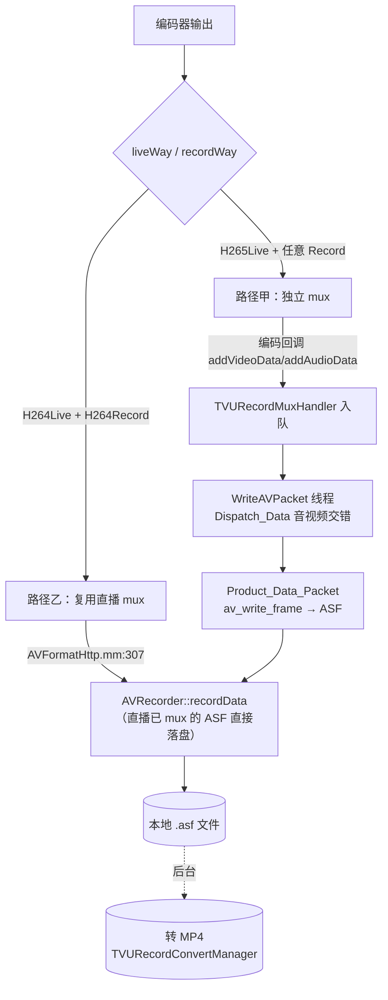

# 本地录制旁路 — TVURecordMuxHandler / AVRecorder

> 基于 tvuanywhere_ios 仓库 `share/DefaultTitle` 分支（commit `89e4c235a`，2026-06-12）
> 目录：`products/TVUTransportIOS/TVUAnywherePro/TVUAnywhereSDK/TVURecorder/`
>
> 📚 **系列文档**（完整索引见 [README.md](./README.md)）
> 这是 [04-推流层](./04-推流层-Mux与Transport.md) 提到"不展开"的本地录制旁路。它与推流并行，把编码后的数据落成本地文件。

---

## 一、两条录制路径（按 liveWay/recordWay 激活）



核心区别：

| | 路径甲 TVURecordMuxHandler | 路径乙 AVRecorder 复用 |
|---|---|---|
| 触发 | H265 直播（H265 流不能直接复用为 H264 录制流） | H264 直播 + H264 录制 |
| 是否独立 mux | 是（自建 FFmpeg ASF context） | 否（复用 AVFormatHttp 已 mux 的 ASF） |
| 视频来源 | H265 录制：复用 H265 直播流；H264 录制：另起 H264 编码 | 直播 H264 编码输出 |
| 落盘函数 | Product_Data_Packet → AVRecorder::recordData | AVFormatHttp 内直接 recordData |

**落盘格式都是 `.asf`**，录制结束后由后台转 MP4——不是直接写 MP4。

---

## 二、TVURecordMuxHandler（路径甲，~1043 行）

### 2.1 单例与线程（mm:17-55）

`getInstance()`（dispatch_once）+ `prepareRecord()`：注册 FFmpeg、建两把锁、`reset()` 初始化 ASF context，起一条 `WriteAVPacket` 后台线程（mm:48）。

两把锁：
- `m_mux_lock`：守 `isOpenMuxFlag` 与音视频队列。**编码层会拿这把锁判断要不要为录制编 H264**（TVUVideoEncoderManager.mm 的 encode 入口）。
- `m_ffmpeglock`：守 FFmpeg context 与入队。

### 2.2 reset — ASF 容器（mm:862-895）

```cpp
m_outputFormat = av_guess_format("asf", NULL, NULL);   // 容器就是 ASF
m_video_stream = avformat_new_stream(...);  // id 0
m_audio_stream = avformat_new_stream(...);  // id 1
m_basetime = {1, 1000};                     // 1ms 时间基
```

### 2.3 addVideoData 入队（mm:172-314）

- 首次调用按 recordWay 建 H264 或 HEVC stream（mm:183-195），HEVC 设 `codec_tag = 'hevc'`、`profile = MAIN`。
- **SPS/PPS（isExtraData）只缓存不入队**（mm:230-253）；变化时 `doUpdate_videoStream_extraData`。
- I 帧把缓存的参数集拼到帧前（mm:264-273）。
- **时间戳单调守门**：`time_stamp <= lastTimeStamp` 的包丢弃（防倒退）。
- `dts/pts/flags` 填好后 `m_VideoListPack.push_back`。

> ⚠️ stream header 里写的 `bit_rate = 1024*1024`（mm:204，1Mbps）只是 ASF 元数据标称值，**不等于实际录制码率**。实际 H264 录制码率由编码器 `TVU_H365LIVE_h264RECORD_BITRATE = 5Mbps` 决定（03 文档 §2.2）。两者别混。

`addAudioData`（mm:317-482）对称：按采样率建 AAC stream、写对应 AAC extradata 头、入 `m_AudioListPack`。

### 2.4 WriteAVPacket 线程 + 音视频交错（mm:628-700）

```cpp
while (RUN) {
    if (!isOpenMuxFlag) { usleep(5ms); continue; }              // 未开启 mux 空转
    if (videoList.empty() || audioList.empty()) { usleep(5ms); continue; }  // 等齐
    if (audioPack.ts >= videoPack.ts) add_VideoPacket(...);     // 时间戳小的先 mux
    else                              add_AudioPacket(...);
}
```

与推流层 `AVFormatControl::Dispatch_Data`（04 文档 §2.3）是同一套"两队列按时间戳交错、任一空则等待"逻辑。

### 2.5 mux 落盘（mm:753-794）

```cpp
avio_open_dyn_buf(&m_outputContext->pb);
av_write_frame(m_outputContext, pack);                       // FFmpeg mux 成 ASF
len = avio_close_dyn_buf(m_outputContext->pb, &output);
AVRecorder::recordData((char*)output, len, isVideoIFrame, spsppsChanged);  // 交给 AVRecorder 写盘
```

### 2.6 ASF Header 与开关时序

- `Product_Data_Head`（mm:517-625）：`avformat_write_header` 生成 ASF 头 → `AVRecorder::recordHead` 写盘，置 `m_readforHead`。
- `openMuxAVStream`（mm:954-965，仅 H265Live）：reset + `isOpenMuxFlag=YES` + `forceInsertKeyFrame`（确保参数集齐全）。
- `closeMuxAVStream`（mm:967-974）：`isOpenMuxFlag=NO`。
- `isCreateASFHead`（mm:976-999）：H264Live 直接返回 true；H265Live 轮询等 header，最多 100×30ms=3s。`AVRecorder::beginRecord` 用它阻塞到 header 就绪。

---

## 三、AVRecorder（写盘与文件管理，~1131 行）

### 3.1 recordData（mm:335-378）

`m_isRecording` 关时丢弃；`m_begincheckiFrame` 期间**等首个 I 帧**（丢 P/B）；SPS/PPS 变化触发 `splitRecordFile`（关旧文件开新文件）；正常则 `recordFile` 写入。

### 3.2 文件命名与写入

- `createFile`（mm:141-189）：`TVU_YYYYMMDDHHMMSS.asf`（UTC 命名），打开后先写 ASF header，再开一个 `.pps` 文件存当前参数集。
- `recordFile`（mm:202-221）：`fwrite` + **每 10MB `fflush`**（`TVU_FLUSH_RECORD_FILE_MAX_BYTE`）。
- `endRecord`（mm:320-334）→ `closeFile`（mm:101-116）：**仅 `fclose`，不写 moov/trailer**（ASF 是流式容器，无需 trailer 即可被识别）。

### 3.3 分段

两个触发：① SPS/PPS 变化（分辨率/编码参数变）；② 时长，`RECORDER_SPLITTIME = 60*5`（5 分钟）自动切片。

### 3.4 容错

App 崩溃/被杀时 `.asf` 可能无完整收尾，但因每 10MB flush + ASF 流式特性，已写部分通常可用。下次启动 `TVURecordConvertManager` 扫描；转换失败的文件记 `failCount` 后跳过，避免反复失败。

---

## 四、TVUAudioRecorderManager / TVURecordConvertManager

- **TVUAudioRecorderManager**（~223 行）：H265Live 时，音频编码回调在 `handleVoiceRecordWithOutBufferList`（mm:87-135）里**同时**喂 `TVURecordMuxHandler::addAudioData`（持 m_mux_lock 判 isOpenMuxFlag）和独立音频文件。H264Live 时音频走直播 mux，不单独处理。
- **TVURecordConvertManager**（~209 行）：扫沙盒 `.asf`（`checkAsfFileInSandbox` mm:92-129）→ 检查磁盘空间 → `AVRecorder::beginConvertASFtoMP4`（mm:152）→ 监听完成通知，失败记 failCount。ASF→MP4 的实际转换在 AVRecorder 后台线程（`avRecordThread`，细节未展开）。

---

## 五、录制 vs 直播 数据来源对照

| 场景 | 视频来源 | 音频来源 | mux 器 | 落盘格式 |
|---|---|---|---|---|
| H264Live + H264Record | 直播 H264 编码输出（mux 后 ASF） | 直播音频（mux 后） | AVFormatHttp（复用） | .asf |
| H265Live + H264Record | 另起 H264 编码（实际 5Mbps） | TVURecordMuxHandler 音频队列 | TVURecordMuxHandler | .asf |
| H265Live + H265Record | 复用 H265 直播流 | TVURecordMuxHandler 音频队列 | TVURecordMuxHandler | .asf |
| H264Live（不录制） | — | — | — | 仅推流，无本地文件 |

### 与直播的耦合

- 录制依赖编码器有码流：路径乙完全复用直播输出，**不能纯录不直播**；路径甲可用 open/closeMuxAVStream 独立开关，但仍需编码器在跑。
- 录制时间戳与直播同源（都基于编码层的毫秒 dts），因此本地文件与云端流时间轴一致。

---

## 六、关键行号索引

| 功能 | 文件:行号 |
|---|---|
| prepareRecord 起线程 | TVURecordMuxHandler.mm:37-55 |
| addVideoData 入队 | TVURecordMuxHandler.mm:172-314 |
| addAudioData 入队 | TVURecordMuxHandler.mm:317-482 |
| Dispatch_Data 交错 | TVURecordMuxHandler.mm:628-692 |
| Product_Data_Packet mux | TVURecordMuxHandler.mm:753-794 |
| Product_Data_Head | TVURecordMuxHandler.mm:517-625 |
| open/closeMuxAVStream | TVURecordMuxHandler.mm:954-974 |
| isCreateASFHead | TVURecordMuxHandler.mm:976-999 |
| AVRecorder::recordData | AVRecorder.mm:335-378 |
| createFile / recordFile | AVRecorder.mm:141-189 / 202-221 |
| endRecord / closeFile | AVRecorder.mm:320-334 / 101-116 |
| splitRecordFile | AVRecorder.mm:307-318 |
| 路径乙复用入口 | AVFormatHttp.mm:307 |
| 编码器录制回调 | TVUVideoH264Encoder.mm:677/762、TVUVideoH265Encoder.mm:734/814 |
