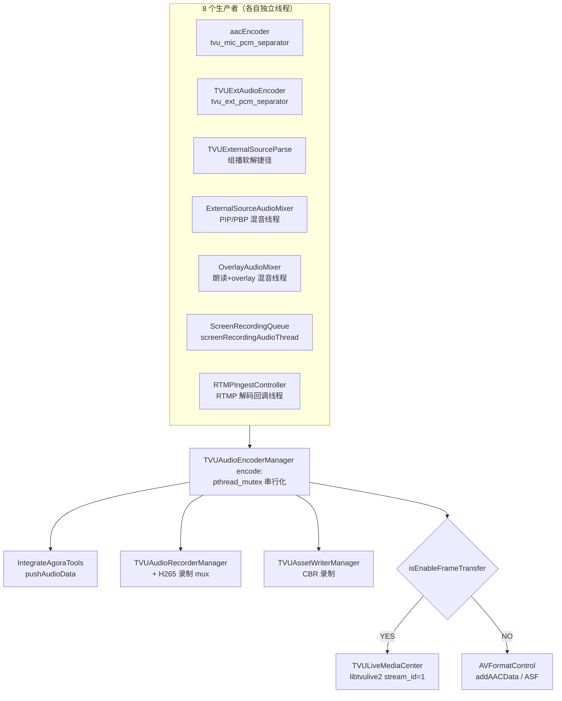

# 音频编码器详细分析 — TVUAudioEncoderManager

> 基线：tvuanywhere_ios 仓库 `share/SPAR-705` 分支 commit `736863f1f`（2026-08-25），**本文行号以此为准**。
> 文件：`TVUAnywhereSDK/TVUEncoder/TVUAudioEncoderManager.{h,mm}`（39 + 753 行）
>
> 📚 **系列文档**（索引见 [README.md](./README.md)）
> 上游：[01-外部源模块](./01-外部源模块-TVUExternalSource.md) · [05-多源采集入队](./05-多源采集入队.md)
> 同层：[03-编码层-TVUEncoder.md](./03-编码层-TVUEncoder.md) §4（简版，本文是它的展开）
> 下游：[04-推流层-Mux与Transport.md](./04-推流层-Mux与Transport.md) · [06-本地录制旁路](./06-本地录制旁路.md)
> 配图：[流图/M5-音频编码器与二次混音](./流图/M5-音频编码器与二次混音.html)
> 上游各条链路的方法级细节：[音频专题/](./音频专题/)（A0 接线总表 · A1 本地 mic · A2 屏录 · A3 会议 · A4 朗读/Overlay · A5 DJI/Accsoon）

---

## 一、这个类在管线里的位置

**全链路唯一的音频收口。** 无论声音来自内置麦克风、外部源文件/RTSP/组播、Accsoon(SeeMo)、DJI RTMP、屏幕共享、Overlay 网页声还是弹幕朗读，最终都汇到同一个方法：

```objc
[[TVUAudioEncoderManager manager] encode:&param];
```

源码里对这一点有明确注释（mm:137-143）：

> this is the single point every audio source funnels through — mic (audio unit / audio queue), aacEncoder, external sources, Accsoon, DJI RTMP, screen share, overlay mix — so it stands in for audio capture.

它同时承担五件事，职责相当重：

| 职责 | 位置 |
|---|---|
| ① 音量计算（UI 电平表数据源） | mm:116-132 |
| ② 十道准入闸门（源隔离 / 格式校验 / 时间单调） | mm:94-325 |
| ③ 声道归一（单→双）+ Agora Partyline 分叉 | mm:189-242 |
| ④ 二次混音（VOIP / Partyline 混入 PCM） | mm:273-318 |
| ⑤ AAC 编码 + 四路出口分发 | mm:335-407 |

对照视频侧：视频的编码调度在 `TVUVideoEncoderManager`，但源隔离（index 过滤）在**合流层** `TVUAVStreamManager` 做；音频没有合流层，所以源隔离、混音、格式归一全压在编码器里。这是理解本类为什么这么复杂的关键。



---

## 二、接口与常量

### 2.1 头文件全貌（TVUAudioEncoderManager.h）

```objc
static int const kTVUAudioEncoderFramesPerPacket = 1024;   // AAC 每包帧数
static int const kTVUAudioEncoderMonoChannel     = 1;
static int const kTVUAudioEncoderStereoChannel   = 2;
static int const kTVUAudioEncoderSampleRate      = 48000;  // 唯一允许的采样率
static int const kTVUAudioEncoderPCMSize         = 4096;   // PCM/AAC 缓冲基准尺寸
static int const kTVUAudioEncoderBitRate         = 128000; // 固定 128 kbps
static int const kTVULocalCameraExternalSourceIndex = -1;  // 本地相机的源索引

typedef struct {
    uint8_t *data;
    UInt32   size;
    Float64  pts;                    // 秒，绝对（HostTime 域）
    int      channel;                // 只接受 1 或 2
    int      sampleRate;             // 只接受 48000
    int      external_source_index;  // 源身份，守门用
} TVUAudioEncoderData;

+ (TVUAudioEncoderManager *)manager;
- (void)encode:(TVUAudioEncoderData *)param;
- (void)stopEncoder;
- (void)updateExternalSourceIndex:(int)index;
- (void)startAudioEncoder;
```

文件头一行注释是全类的硬约束：**「该音频编码类只编码 48K 单声道或 48K 双声道的音频」**。

> ⚠️ `kTVUAudioEncoderPCMSize = 4096` 不是「随便给的缓冲上限」，而是整条链路的**隐含块规格**：
> 1024 帧 × 2 声道 × int16 = 4096 字节。三个 PCM 分包器（`aacEncoder.h`、`TVUExtAudioEncoder.h`、
> `TVUScreenRecordPcmContractor.h`）的 `PCMBUFF_SIZE` 都独立定义为 4096，正好对上
> `kTVUAudioEncoderFramesPerPacket = 1024`。**这四个数字必须同时改，否则编码器行为未定义**（见 §9.1）。

### 2.2 内部状态

```objc
pthread_mutex_t          mutex_lock;            // 保护编码器与缓冲
uint8_t                 *aacBuffer;             // AAC 输出临时容器
TVUAudioEncoderData      encoderData;           // 喂给 AudioConverter 的输入副本
CMFormatDescriptionRef   _formatDescriptionRef; // 仅 CBR 录制用（PCM 格式描述）
BOOL                     isEnableRecordCBR;     // 缓存的开关，避免每帧读 plist
@property AudioConverterRef audioConverter;
@property int               external_source_index;  // 当前"合法"源，守门基准
```

模块级静态（**不受 `mutex_lock` 保护**，见 §8.2）：

```objc
static int     stereo_pcm_buffer_size = 0;
static uint8_t stereo_pcm_buffer[kTVUAudioEncoderPCMSize];  // mm:48-49
static Float64 last_audio_pts = 0;                          // mm:171，函数内 static
```

---

## 三、生命周期

### 3.1 四个入口的调用方全表

| 方法 | 调用方 | 位置 | 时机 |
|---|---|---|---|
| `startAudioEncoder` | `TVUAnywhere.mm:854` | `tvuViewWillAppear` | 每次回主页（幂等设计） |
| | `RTMPIngestController.mm:313` | `healPreviewPipelineIfStalled` | DJI watchdog 发现管线被挂起时补救 |
| | `TVUMediaCoderConfigVC.mm:111` | 用户改音频质量 | 先 stop 再 start，重建 converter |
| `stopEncoder` | `TVUAnywhere.mm:544` | `tvuViewWillDisappear` | 离开主页 |
| | ~~`aacEncoder.mm:228`~~ | — | **死路径**：在 `doencode()` 退出处，而该线程从不启动（见 §6.2 注） |
| | `TVUExtAudioEncoder.mm:272` | 外部源音频线程退出 | 同上 |
| | `TVUExternalSourceAudioDecoder.mm:182` | `stopDecode` | 外部源音频解码器关闭 |
| | `TVUMediaCoderConfigVC.mm:110` | 用户改音频质量 | |
| `updateExternalSourceIndex:` | 见 §5.2 全表（8 处） | | 切源 |
| `encode:` | 见 §4 全表（8 个生产者） | | 每 21.33ms 一块 |

> ⚠️ `stopEncoder` 有 **4 个活调用方**（另 1 处在死路径上）、`startAudioEncoder` 有 3 个，且互不知情。
> `TVUExtAudioEncoder` / `TVUExternalSourceAudioDecoder` 在自己线程收尾时
> 都会 `stopEncoder` —— 这是个**全局副作用**：外部源音频解码器关闭会顺带把还在跑的
> mic 编码器的 `AudioConverterRef` 销毁掉。之后靠 `encode:` 里的惰性重建（mm:327-333）
> 兜回来，所以现象上不炸，代价是切源瞬间会丢几块音频 + 重建一次硬件 codec。

### 3.2 `startAudioEncoder`（mm:548-565）

```objc
- (void)startAudioEncoder {
    isEnableRecordCBR = [[TVUAnywhere manager] tvuIsEnableRecordCBR];   // ← 必须在 guard 之前
    if (_audioConverter) {
        log4cplus_error(..., "have start Audio Encode");
        return;
    }
    if (![self setupEncoder]) { log4cplus_error(..., "set up encoder fail"); }
}
```

`isEnableRecordCBR` 的赋值**故意放在 `if (_audioConverter) return;` 之前**，这是 ITA-1294 的修复（commit `b0622472a`）：第一次打开 CBR 录制开关时编码器已经在跑，如果赋值在 guard 之后就会被早退跳过，导致 `writeAudioAssetWithParam` 永远 return，录制没有音频。**改动此处顺序会复现该 bug。**

### 3.3 `setupEncoder`（mm:568-652）

| 项 | 配置 |
|---|---|
| 输入 | `kAudioFormatLinearPCM`、48000 Hz、**固定双声道**、16 bit、`mFramesPerPacket = 1`、packed / signed / native-endian |
| 输出 | `kAudioFormatMPEG4AAC`、`kMPEG4Object_AAC_LC`、48000 Hz、双声道、`mFramesPerPacket = 1024` |
| 码率 | `kAudioConverterEncodeBitRate = 128000`（固定，不随分辨率/网络变） |
| 质量 | Lite → `Low`；HitMe / AnywhereSDK → `Medium`；主 App → 跟随 `TVUSettingStorage.audioEncoderQuality` |
| 创建 | `AudioConverterNewSpecific(&in, &out, 2, requestedCodecs, &_audioConverter)` |

同时创建 `_formatDescriptionRef`（PCM 的 `CMAudioFormatDescription`，只给 CBR 录制用），并把 output ASBD + converter 交给 `TVUAudioRecorderManager`（mm:649）供其写 m4a。

**输入格式硬编码为双声道**（mm:576 `mChannelsPerFrame = kTVUAudioEncoderStereoChannel`），所以 §4 的单→双转换不是可选优化，而是**喂进 converter 的前置必要条件**。

### 3.4 `stopEncoder`（mm:519-539）

持锁销毁 `AudioConverterRef`、清零 `stereo_pcm_buffer`、free `encoderData.data` 与 `aacBuffer`。

**没有做的三件事**（见 §9 风险清单）：不释放 `_formatDescriptionRef`、不复位 `last_audio_pts`、不复位 `external_source_index`。

---

## 四、`encode:` 全流水线（mm:92-409）

按代码顺序逐段。**"闸门"= 会 `return` 丢帧的判断**，共 10 道。

### 4.1 闸门① 屏幕共享独占（mm:94-114）

```objc
if ([TVUScreenRecordingServerSocketManager manager].isReceivingFrame) {
    if (param->external_source_index != TVUScreenRecordingSourceIndex)  return;   // = 100
}
```

屏幕共享一旦开始收帧，**只有 index 100 的音频能进**，其它源整块丢弃。这条是很多上游代码要绕开的原因：

- `RTMPIngestController.mm:387` — DJI 音频改送屏共 mic 队列（注释明说「直接送会被丢弃」）
- `TVUExtAudioEncoder.mm:235` — Accsoon 音频同样改道
- `aacEncoder.mm:189` / `:288` — mic 改道 `tvuSendAudioToScreenShare`

> `tvuSendAudioToScreenShare` **不是一个函数**，是同一份 static 函数体复制到 4 个 TU
> （`TVUScreenRecordPcmContractor.mm:121` / `aacEncoder.mm:139` / `TVUExtAudioEncoder.mm:144`
> / `RTMPIngestController.mm:47`），彼此不可见；第一份**无调用方，是死代码**。
> 详见 [音频专题/A0-音频链路总表.md](./音频专题/A0-音频链路总表.md) §3.3。

编译期差异：`_TVUIRLSDK` 与主 App 都有这条；`TVUAnywhereSDK` / `TVUHitMeSDK` / `TVUPartylineSDK` 因为 `#if (defined TVU_HIT_ME) || (defined _TVUSDKANYWHERE)` 且未定义 `_TVUIRLSDK`，**这段整体被编掉**（该分支体里只有 `#endif`）。

### 4.2 音量计（mm:116-132）

```objc
if (param->data) {
    float channelValue[2];
    AudioPlayer::caculate_bm_db(param->data, param->size, 0,
                                param->channel == 2 ? k_Stereo : k_Mono, channelValue, true);
    [[TVUAudioCaptureManager manager] updateLVoume:channelValue[0] andRVoume:channelValue[1]];
}
```

- 用的是 LUT 缓存版 dBFS（commit `47ba1321b`），`AudioPlayer.mm:1603-1643`；单声道时 `channelValue[0] = channelValue[1]`，不存在未初始化读。
- **位置在所有闸门之前**：切源瞬间被守门丢掉的帧，其电平仍然会打到 UI 上。UI 电平表偶发跳变可以从这里解释。
- 逐块全遍历（4096 字节 = 2048 次比较），每 21.33ms 一次，不可忽略但可接受。

### 4.3 TPDS 打点（mm:133-146）

```objc
int64_t newPts = (int64_t)((param->pts - g_vstarttime) * 1000);
[TVUCalculator setEncAudioPTS:newPts];
```

`newPts` 是**贯穿后面全部出口的时间戳**：单位毫秒、以 `g_vstarttime` 为零点。`g_vstarttime` 是全链路唯一时间基准（首帧 HostTime 秒值，见时间戳专题 01），在 H264/H265 编码器与合流层三处互斥初始化。

注意 `newPts` 在**这里就算好了**，后面 mm:159-162 才叠加 NTP 容差修正 `param->pts`。也就是说：

> **出口用的 `newPts` 不含 `ntpLiveFaultTolerance` 修正**；被修正的 `param->pts` 只影响
> §4.4 的单调判断、Agora 推流（mm:237）和 CBR 录制（mm:424）。这是有意的（注释 mm:140-143
> 说「stamp is the frame's own capture time」，要与视频侧的裸 sample-buffer pts 可比），
> 但阅读时极易看错。

`TVUCalculator.setEncAudioPTS:` 在 `_encBaseTime == 0` 时直接 return（`TVUCalculator.mm:1218`），所以未直播时这个统计不采集。

### 4.4 闸门② Lite/IRL 的提前退出（mm:148-153）

```objc
#if (defined _TVUSDKANYWHERELITE)
    if (!enableEncoding) { return; }
#endif
```

`_TVUSDKANYWHERELITE` 在 **`TVUIRLSDK` 和 `TVUAnywhereLiteSDK` 两个 target 都有定义**（见 §6）。

> **重要行为差异**：IRL / Lite 构建里，未直播/未录制时音频到这里就停了，**根本走不到 §4.6 的
> Agora Partyline 推流**。主 App、`TVUAnywhereSDK`、`TVUHitMeSDK`、`TVUPartylineSDK` 没有这条早退，
> 音频会一路走到 Partyline 推流，只在 mm:243 才被 `enableEncoding` 拦住。
> 即：**「不直播时能不能开会说话」在不同 target 里答案不同。**

`enableEncoding` 的真值表（`TVUAnywhere.mm:4238-4248 updateEnableEncodingState`）：

```
enableEncoding = (state == Living) || tvuIsAudioRecording || tvuIsVideoRecording
                 || (currentLiveWay == TVUH265Live && TVURecordMuxHandler::isOpenMuxFlag)
```

### 4.5 NTP 容差补偿（mm:154-162）

```objc
NSInteger faultTolerance = [TVUAnywhere manager].ntpLiveFaultTolerance;   // 微秒，默认 0
if (faultTolerance) { param->pts += (Float64)faultTolerance / TVU_NTP_TIME_SCALE; }  // 1e6
```

直播中切 NTP 服务器时算出的误差，加回 pts。视频侧对称实现在 `TVUVideoH264Encoder.mm:407` / `H265:469`（用 `CMTimeMake(faultTolerance, TVU_NTP_TIME_SCALE)`）。

### 4.6 闸门③ pts 严格单调（mm:164-177）

```objc
static Float64 last_audio_pts = 0;
Float64 current_audio_pts = param->pts;
if (last_audio_pts > current_audio_pts) {
    log4cplus_error(..., "last_audio_pts :%lf > current_audio_pts:%lf", ...);
    return;                       // ← 不更新 last_audio_pts
}
last_audio_pts = current_audio_pts;
```

为 Accsoon「用内置 mic 的声音」需求加的（2024-05-22）：那个场景下两个源的 index 相同，index 守门拦不住，只能靠时间戳拦。

> ⚠️ **这是一条永久高水位线**，全类只有这 4 行涉及它，`stopEncoder` / `updateExternalSourceIndex`
> 都不复位（grep 全仓确认）。后果：从「pts 大」的源切到「pts 小」的源，**所有音频会被静默丢弃，
> 直到新源的 pts 追上旧源的最后一帧**。DJI RTMP 那边知道这条约束，在
> `TVUIRLStreamConnection.m:114` / `:849` 明确做了单调 clamp「绕过 TVUAudioEncoderManager 的
> last_audio_pts 守卫」。其它源没有这个保护。

另外注意它**在声道/采样率校验之前**：一个 pts 回退的帧连格式都不会被检查，日志里只有 pts 那一行。

### 4.7 闸门④⑤ 格式校验（mm:179-187）

```objc
if (param->channel != 1 && param->channel != 2)   return;   // "input audio channel error"
if (param->sampleRate != 48000)                   return;   // "input audio sampleRate error"
```

**48kHz 是硬约束**，非 48k 的源必须在上游重采样完。DJI 那边就是这么做的：`TVUIRLAudioDecoder.m:45` 明确 `sampleRate:kTVUAudioEncoderSampleRate`，AAC→PCM 时一并重采样到 48k。

### 4.8 声道归一：单 → 双（mm:189-198）

```objc
BOOL isJoined = [[TVUIntegrateAgoraTools getInstance] getCurrentAgoraMeetingState] == Joined;
if (param->channel == kTVUAudioEncoderMonoChannel && (isJoined || enableEncoding)) {
    stereo_pcm_buffer_size = [self monoConvertToStereoWithMonoAudio:(int16_t *)param->data
                                                        andMonoSize:param->size
                                                      andSteroAudio:(int16_t *)stereo_pcm_buffer];
    param->data    = stereo_pcm_buffer;      // ← 原地改写调用方的 param
    param->size    = stereo_pcm_buffer_size;
    param->channel = kTVUAudioEncoderStereoChannel;
}
```

转换实现（mm:717-728，2024-11-01 优化过，按 int16 步进而非逐字节）：

```objc
int frames = mono_audio_size / sizeof(int16_t);
for (int i = 0; i < frames; i++) {
    stereo_audio[2*i] = stereo_audio[2*i+1] = mono_audio[i];
}
return mono_audio_size * 2;
```

两个要点：

1. **`encode:` 会原地修改调用方传入的 `TVUAudioEncoderData`。** 大多数调用方用的是
   `static TVUAudioEncoderData`，所以这个改写会跨帧残留（下一帧再赋值覆盖，实际无害，但语义上
   `param` 是 in-out 而非 in）。
2. **`monoConvertToStereoWithMonoAudio` 没有任何边界检查**，输出目标是固定 4096 字节的
   `stereo_pcm_buffer`。安全上限是**输入 mono ≤ 2048 字节**。详见 §9.2。

### 4.9 Agora Partyline 推流分叉（mm:200-242）

```objc
if (isJoined) {
    if (屏共在收帧 || param->external_source_index == self.external_source_index) {
        [[TVUIntegrateAgoraTools getInstance] pushAudioData:param->data
                                                 andSampes:param->size/(2*param->channel)
                                              andTimestamp:param->pts];
    } else {
        log4cplus_error(..., " send partyline audio external source index is different, ...");
    }
}
```

`andSampes` 是**每声道采样点数**（`size / (2 × channel)`），不是字节数。

历史包袱：mm:210-232 有一大段被注释掉的「双声道→单声道再推」代码，注释说明 Partyline 原本要 48k 单声道；现在的结论是「到编码器的声音已经都是双声道了，不可能是单声道」（mm:233-236），所以直接推双声道。

**编译期差异**：`TVUAnywhereSDK` / `TVUHitMeSDK` 的守门条件里**没有**屏共例外（mm:205 只有 index 比较），IRL 和主 App 有。

### 4.10 闸门⑥ enableEncoding（mm:243-245）

```objc
if (!enableEncoding) { return; }
```

到这里为止都是"不编码也要做的事"（电平表、统计、Partyline）。之后才是真正的编码路径。

### 4.11 加锁（mm:247）

`pthread_mutex_lock(&mutex_lock)` —— **8 个生产者线程在此串行化**。锁的覆盖范围见 §8.1。

### 4.12 闸门⑦ 源索引守门（mm:249-271）

这是全类最核心的一道闸门，三个 target 分支：

```objc
// _TVUIRLSDK
if (![ScreenRecordingServerSocket manager].isReceivingFrame
    && param->external_source_index != self.external_source_index)

// TVUAnywhereSDK / TVUHitMeSDK（无屏共例外）
if (param->external_source_index != self.external_source_index)

// 主 App（多一条 Accsoon 例外）
BOOL isAccsoonWithBuildIn = [[TVUAccsoonManager manager] isLiveWithBulidInAudioStream];
if (![ScreenRecordingServerSocket manager].isReceivingFrame
    && !isAccsoonWithBuildIn
    && param->external_source_index != self.external_source_index)
{
    log4cplus_error(..., "external source index is different, current parse index: %d, buffer index: %d", ...);
    pthread_mutex_unlock(&mutex_lock);
    return;
}
```

源码注释（mm:250）说明了动机：

> 外部源之间切换、外部源与本地相机之间切换时由于线程原因可能会造成不同文件的音频混在一起，
> 故对每个音频增加一个 index，与当前要编码的音频的 index 对比，剔除混在一起的音频。

> ⚠️ **是整块丢弃，不是补静音。** 这与视频侧行为一致（合流层 index 不匹配也是丢帧），
> 也与 DJI 那边「audio underrun 绝不补静音」的决策一致。切源时音频会有一个真实的空洞，
> 由服务端重排/播放端缓冲吸收。

### 4.13 二次混音：VOIP / Partyline（mm:273-318）

```objc
// TVUAnywhereSDK / TVUHitMeSDK：只有 VOIP
if (enableMixVoip && [[TVUWebRTCManager shareInstance] voipIsCalling]) {
    TVUWebRTCMixQueueManager::manager()->voipMixWith(param->data, param->size, &data_mix, &data_mix_size);
    if (data_mix) { memcpy(param->data, data_mix, data_mix_size); param->size = data_mix_size; free(data_mix); }
}

// 主 App / IRL / Lite：三选一，优先级 Partyline > VOIP > RTIL VoIP
if      (enableMixPartyLine && Agora == Joined)          → partyLineMixWith
else if (enableMixVoip      && voipIsCalling)            → voipMixWith
else if (enableMixVoip      && TVURTILVoIPManager 在跑)  → partyLineMixWith   // 主 App 独有(TVUOnlyAnyWhere)
```

三个开关都是**全局 bool**（`TVUAnywhere.mm:139-145`），来源 `TVUSettingStorage`（`TVUAnywhere.mm:674-675`），也能被设置页直改（`SettingViewController.mm:1952/1958`）。`enableEncoding` 默认 `true`，两个混音开关默认 `false`。

混音器块规格（`TVUWebRTCMixQueueManager.mm:62-93`，Partyline 版逐行相同）：

| 项 | 值 |
|---|---|
| 会议侧入队块 | 2048 字节 **单声道**（`kTVUWebRTCAudioDataByteSize`，`AudioPlayer.mm:50`） |
| 内部转双声道 | `rtc_data` = 4096 字节 |
| 本地侧 `sourceSize` | 4096 字节（已在 §4.8 转成双声道） |
| `*outSize` | `max(sourceSize, node->size)` = `max(4096, 2048)` = **4096** |
| 混音 | `AudioPlayer::mix()` 归一化叠加（软限幅 `f`），会议侧系数 1.0 |

常规块长（4096）下三者刚好对齐；非 4096 块长会越界读，见 §9.3。

### 4.14 闸门⑧ size + CBR 录制（mm:321-326）

```objc
if (param->size <= 0) { unlock; return; }        // "audio size error"
[self writeAudioAssetWithParam:param];           // ← CBR 录制旁路，写的是 PCM
```

### 4.15 惰性建编码器（mm:327-333）

```objc
if (!_audioConverter) {
    pthread_mutex_unlock(&mutex_lock);            // setupEncoder 自己会加锁
    if (![self setupEncoder]) { return; }
    pthread_mutex_lock(&mutex_lock);
}
```

这是 §3.1 提到的「五个 stopEncoder 调用方」的兜底。锁的一放一取之间有竞态窗口，见 §9.4。

### 4.16 编码（mm:335-371）

```objc
if (encoderData.data == NULL)          encoderData.data = malloc(kTVUAudioEncoderPCMSize);
if (param->size > kTVUAudioEncoderPCMSize) encoderData.data = realloc(encoderData.data, param->size);
memcpy(encoderData.data, param->data, param->size);   // 深拷贝，防被生产者线程覆盖
encoderData.size = param->size; encoderData.channel = param->channel; encoderData.pts = param->pts;

if (aacBuffer == NULL)                 aacBuffer = malloc(kTVUAudioEncoderPCMSize);
if (param->size > kTVUAudioEncoderPCMSize) aacBuffer = realloc(aacBuffer, param->size);
memset(aacBuffer, 0, param->size);

AudioBufferList outBufferList = { .mNumberBuffers = 1 };
outBufferList.mBuffers[0] = { encoderData.channel, encoderData.size, aacBuffer };

AudioStreamPacketDescription outputPacketDescriptions;
UInt32 outputDataPacketSize = 1;                       // ← 只要一个 AAC 包
OSStatus status = AudioConverterFillComplexBuffer(_audioConverter,
                    &AudioEncoderConverterComplexInputDataProc, &encoderData,
                    &outputDataPacketSize, &outBufferList, &outputPacketDescriptions);
if (status != noErr) { unlock; log; return; }           // 闸门⑨
```

输入回调（mm:695-710）：

```objc
static OSStatus AudioEncoderConverterComplexInputDataProc(..., UInt32 *ioNumberDataPackets,
                                                          AudioBufferList *ioData, ..., void *inUserData)
{
    TVUAudioEncoderData *audioDecoder = (TVUAudioEncoderData *)inUserData;
    ioData->mBuffers[0].mNumberChannels = audioDecoder->channel;
    ioData->mBuffers[0].mData           = audioDecoder->data;
    ioData->mBuffers[0].mDataByteSize   = audioDecoder->size;
    ioData->mNumberBuffers              = 1;
    return noErr;
}
```

> ⚠️ **回调是无状态的**：不写 `*ioNumberDataPackets`、不记录已消费偏移、也不会在数据耗尽时返回
> 错误或 0 包。这套写法只在「一块 PCM == 恰好一个 AAC 包（1024 帧 = 4096 字节双声道）」时成立，
> 而这正是全部生产者的 `PCMBUFF_SIZE` 都取 4096 的原因。块长偏离 4096 的后果见 §9.1。

### 4.17 四路出口（mm:373-407）

```objc
if (outBufferList.mBuffers[0].mDataByteSize > 0) {        // 闸门⑩
    // 出口 1：m4a 录音 + H265 录制 mux
    [[TVUAudioRecorderManager manager] handleVoiceRecordWithOutBufferList:&outBufferList
        outputPacketDescriptions:&outputPacketDescriptions
            outputDataPacketSize:outputDataPacketSize
                             pts:newPts channel:param->channel sampleRate:param->sampleRate];

    // 出口 2/3：推流双链路（互斥）
    if ([[TVUAnywhere manager] isEnableFrameTransfer]) {
        [[TVULiveMediaCenter center] muxFrameWithStremId:TVU_LIVE_STREAM_ID_A      // = 1
                                            andKeyFrame:1                          // 音频恒为 1
                                                 andPts:newPts
                                                andData:outBufferList.mBuffers[0].mData
                                                 andlen:outBufferList.mBuffers[0].mDataByteSize];
    } else {
        AVFormatControl::GetInstance()->addAACData((const char *)outBufferList.mBuffers[0].mData,
                                                   outBufferList.mBuffers[0].mDataByteSize,
                                                   newPts, param->channel, param->sampleRate);
    }
}
pthread_mutex_unlock(&mutex_lock);
```

四路出口详解见 §7。注意 `_TVUSDKPartyline` 构建里**出口 2 被整段编掉**（`#if (defined _TVUSDKPartyline) #else ... #endif`），Partyline SDK 不做帧传输。

### 4.18 CBR 录制旁路 `writeAudioAssetWithParam:`（mm:410-516）

写的是**编码前的 PCM**，不是 AAC —— 送 `AVAssetWriter` 由系统再编一次。

```objc
if (!isEnableRecordCBR)                        return;   // 缓存的开关，见 §3.2
if (![TVUAssetWriterManager manager].recording) return;

CMTime pts = CMTimeMake(param->pts * 48000, 48000);
void *audioBuffer = malloc(param->size);
memcpy(audioBuffer, param->data, param->size);           // 深拷贝
CMBlockBufferCreateWithMemoryBlock(kCFAllocatorDefault, audioBuffer, blockSize,
                                   kCFAllocatorDefault, NULL, 0, blockSize, 0, &block);
CMAudioSampleBufferCreateReadyWithPacketDescriptions(kCFAllocatorDefault, block,
                                   _formatDescriptionRef, param->size/(2*param->channel),
                                   pts, NULL, &sampleBufferRef);
[[TVUAssetWriterManager manager] writeData:AVMediaTypeAudio buffer:sampleBufferRef];
CFRelease(sampleBufferRef); CFRelease(block);
```

内存管理踩过两轮坑，mm:429-462 有 34 行注释记录，值得原样保留：

| 阶段 | 做法 | 问题 |
|---|---|---|
| 原始 | 直接引用 `param->data` | **ITA-977**：PIP/PBP+ext 下音频缓冲被视频线程覆盖 |
| 2024-03-11 | 改用 `NSData` 临时拷贝 | **FB-7498**（DJI Mic Mini 2）：`NSData` 出作用域即释放，而 `AVAssetWriter` 异步处理 → 访问已释放内存 |
| 2025-06-16（现状） | `malloc` + `memcpy` + 所有权移交 `CMBlockBuffer`（`kCFAllocatorDefault` 作 blockAllocator） | 生命周期绑到 `CMBlockBuffer`，**不能手动 free** |

---

## 五、源索引守门机制（专题）

### 5.1 索引取值全表

| 常量 | 值 | 定义位置 | 含义 |
|---|---|---|---|
| `kTVULocalCameraExternalSourceIndex` | **−1** | `TVUAudioEncoderManager.h:19` | 本地相机/内置 mic |
| `kTVULocalCameraVideoIndex` | **−1** | `TVUAVStreamManager.h:23` | 同上（视频侧同名常量） |
| `TVUScreenRecordingSourceIndex` | **100** | `TVUScreenRecordingSocketProtocol.h:15` | 屏幕共享 |
| `kTVUOSMORTMPSourceIndex` | **200** | `TVUOSMORTMPSourceIndex.h:15` | DJI RTMP |
| `kTVUExternalAccsoonIndex` | **5** | `TVUAccsoonManager.mm:164` | Accsoon / SeeMo |
| 外部源槽位 | 1..4 | 按 `parseArray` 下标 | 文件 / RTSP / 组播 |

### 5.2 谁改这个索引（8 处）

| 调用方 | 设为 | 场景 |
|---|---|---|
| `TVUExternalSourceSortQueueManager.mm:253` | `node->external_source_index` | **切外部源首帧**（排序成功后）；同时改 `TVUAVStreamManager::external_source_index` 并发两个通知 |
| `TVUExternalSourceParse.mm:256` | `external_source_index` | 组播/软解路径的视频首帧 |
| `TVUExternalRTPStreamDecoder.mm:103` | `sourceRef->external_source_index` | RTP 流首帧（`externalSourceBaseTime == 0`） |
| `RTMPIngestController.mm:172` | **200** | DJI 接管本地采集（`suspendLocalCapture`） |
| `RTMPIngestController.mm:214` | −1 | DJI 结束（`resumeLocalCaptureIfNeeded`） |
| `RTMPIngestController.mm:242` | −1 | watchdog 强制恢复（`forceResumeLocalCapture`） |
| `TVUExternalSourceView.mm:660/1593/2817/3082` | −1 | 主 App 切回本地相机 |
| `TVUInputSourceParseModule.mm:94` | −1 | IRL 侧切回本地相机 |
| `TVUAccsoonManager.mm:755` / `TVUIRLAccsoonHandler.mm:120` | −1 | Accsoon/SeeMo 退出、进后台 |

模式很一致：**「改 `TVUAVStreamManager::external_source_index`（视频）+ 改编码器 index（音频）」总是成对出现**，且音视频顺序无所谓（两者独立守门）。

### 5.3 两个混音器对 index 的取值不同（关键差异）

这是本次核实中最容易踩的一点：

```objc
// TVUExternalSourceAudioMixerQueueManager.mm:244 —— 辅源优先
param.external_source_index = external_node != NULL ? external_node->external_source_index
                                                    : local_node->external_source_index;

// TVUOverlayAudioMixerManager.mm:366 —— 主源决定
param.external_source_index = local_node->external_source_index;
```

Overlay 混音器的注释（mm:363-365）解释得很清楚：

> 去向由主源决定：编码器按 index 过滤，DJI 接管期间只收 OSMORTMP(200)，带辅源的 −1 会被整块丢掉。
> 主源是本地 mic(−1) 时结果和原来取辅源(−1) 一样，所以对既有场景是恒等变换；只有 DJI 音频当主源(200) 时才有区别，而那正是要的。

**结论：混音输出必须携带"主源"的 index。** PIP/PBP 那个老混音器取辅源 index 是因为它的语义就是"外部源当主"（本地 mic 只是配角），两者不矛盾但容易看混。新增混音路径时这是第一个要想清楚的问题。

### 5.4 三条例外（能绕过 index 守门的情况）

1. **屏幕共享在收帧** → IRL 与主 App 的守门直接短路（`isReceivingFrame` 为真时不比 index）
2. **Accsoon 用内置 mic**（仅主 App）→ `isLiveWithBulidInAudioStream` 为真时不比 index；这条例外正是 §4.6 的 pts 单调守卫存在的原因
3. **上游改道**（不是绕过，而是不走这条门）→ DJI / Accsoon / mic 在特定 streamType 下改送混音器或屏共队列，见 §6.2

---

## 六、编译期分支与调用方矩阵

### 6.1 六个 target 的宏

| Target | `_TVUSDKANYWHERE` | `_TVUSDKANYWHERELITE` | `_TVUIRLSDK` | `_TVUSDKPartyline` | `TVU_HIT_ME` | `TVUOnlyAnyWhere` |
|---|:-:|:-:|:-:|:-:|:-:|:-:|
| `TVUAnywhere`（主 App / Transmitter） | | | | | | ✅ (pch:230) |
| `TVUAnywhereSDK` | ✅ | | | | | |
| `TVUAnywhereLiteSDK` | ✅ | ✅ | | | | |
| `TVUIRLSDK` | ✅ | ✅ | ✅ | | | |
| `TVUPartylineSDK` | ✅ | | | ✅ | | |
| `TVUHitMeSDK` | ✅ | | | | ✅ | |

（来源：`TVUAnywhere.xcodeproj/project.pbxproj` 各 target 的 `GCC_PREPROCESSOR_DEFINITIONS`；`TVUOnlyAnyWhere` 来自 `Transmitter/TVUAnywhere-Prefix.pch:230`）

各处 `#if (defined TVU_HIT_ME) || (defined _TVUSDKANYWHERE)` 的 `#else` 分支 = **只有主 App**（它是唯一两个宏都没有的 target）。这解释了为什么 `TVUAccsoonManager` / `TVURTILVoIPManager` 只出现在 `#else` 里。

### 6.2 八个生产者矩阵

| 生产者 | 线程名 | 块长 | 声道 | index | 备注 |
|---|---|---|---|---|---|
| ~~`aacEncoder::doencode()` mm:197~~ | ~~`tvu_mic_pcm_separator`~~ | — | — | — | **整条死代码**，见下注 |
| `aacEncoder::sendFrameToEncoder()` mm:319/346 | 采集回调线程（AudioUnit I/O 或 AudioQueue 内部线程） | 2048(mono)/4096 | 1 或 2 | −1 | **内置 mic 的唯一出口**；`TVURecorder.mm:2348` 调它 |
| `TVUExtAudioEncoder::doencode()` mm:259 + `tvuEncodeOrMixExternalSourceAudio` mm:41 | `tvu_ext_pcm_separator` | **恒 4096**（`:206` 判据） | 2 | Accsoon = **5**（`kTVUExternalAccsoonIndex`，`TVUAccsoonManager.mm:164`）／外部源按槽位 | Accsoon / 外部源文件 |
| `TVUExternalSourceParse -decodeAudioWithCodetext:` mm:939 | parse 线程 | `bytes_per_sample × 1024` | **1** (`kTVUAudioChannel`) | 外部源槽位 | 仅 `TVUExternalSourceMuticastUrl`（组播软解捷径）；块长见 §9.2 |
| `TVUExternalSourceAudioMixerQueueManager::audioMixer()` mm:245 | `TVUExternalSourceAudioMixerQueueManagerThread` | 跟 local_node | 跟 local_node | **辅源优先** | PIP / PBP / ReplaceBackground |
| `TVUOverlayAudioMixerManager::audioMixer()` mm:367 | `TVUOverlayAudioMixerManagerThread` | 4096 | 2 | **主源** | 弹幕朗读 + overlay，三路 |
| `TVUScreenRecordingQueueManager::encodeAudio()` mm:490/543 | `screenRecordingAudioThread` | 4096 | 2 | **100** | mic+app 双路，25ms 对齐（`tvu_filter_pts_offset`） |
| `RTMPIngestController -handleDecodedAudio` mm:422 | `com.tvu.dji.buffered.audio`（或 `com.tvu.rtmp-server`，latency=0 时直通） | `frameLength × 4`，`frameLength = 1024×48000/srcRate` | 2 | **200** | DJI；44.1k→4460B、8k→24576B |

> **两处死代码，别当成活路径：**
>
> 1. `TVURecorder.mm:2346` 的 `encode:` 调用**在注释块里**（mm:2338-2347）。真实路径是
>    mm:2348 的 `aacEncoder::sendFrameToEncoder`。
> 2. **`aacEncoder` 的 PCM 环形池整套不工作**：`aacEncoder::startEncode()`
>    （`aacEncoder.mm:82-101`）的函数体连 `pthread_create` 一起被 `/* */` 注释掉，
>    `tvu_mic_pcm_separator` 线程从不启动，`__state` 恒为 `AAC_ENCODE_STATE_SET`，
>    于是 `pushFrame` / `pushOnechannelFrame` 必然早退 −1；它们在 mic 链上的 5 个调用点
>    （`TVURecorder.mm:623` / `:625` / `:850` / `:852` / `:2290`）也全被注释。
>    `doencode()` 里的 `encode:`（mm:197）与 `stopEncoder`（mm:228）因此都不可达。
>    别和活着的两个同构副本 `TVUScreenRecordPcmContractor` / `TVUExtAudioEncoder` 搞混。
>
> 所以**活生产者是 7 个**（表中前 7 行去掉 `doencode()` 那行）。

### 6.3 上游闸门 `+[TVURecorder isSendAuidoToEncoder]`

编码器之前还有一道（`TVURecorder.mm:1417-1445`），决定**本地 mic 采样要不要往下送**：

```objc
#if (defined _TVUIRLSDK)
    if (streamType == TVUAVStreamOSMORTMP) return NO;   // DJI 接管期间整体丢弃本地 mic
#endif
    if (isLocalFile && streamType 不是 PIP/PBP && (streamType == ExternalSource && !ReplaceBackground)
        && !屏共在收帧) return NO;
```

DJI 那条的注释说明了一个非直觉的设计：后台保活时**仍然重启本地采集**让 audio I/O unit 跑着（维持 `audio` 后台模式不被系统杀），只是把采样在这里整体丢掉。

---

## 七、四路出口详解

### 7.1 出口 1 — `TVUAudioRecorderManager`（mm:377-382）

`TVUAudioRecorderManager.mm:87-135` 干两件事：

1. **H265 直播时的本地录制 mux**：`currentLiveWay == TVUH265Live && isOpenMuxFlag` → `TVURecordMuxHandler::addAudioData()`（持 `m_mux_lock`）
2. **m4a 纯录音**：`isAudioRecording` 为真时 `AudioFileWritePackets` 写文件

注意第 1 条**不受 `isAudioRecording` 控制**，在 H265 直播 + 录制打开时无条件执行。

### 7.2 出口 2 — `TVULiveMediaCenter`（帧传输链路，`isEnableFrameTransfer == YES`）

`TVULiveMediaCenter.mm:222-362`：

| 环节 | 说明 |
|---|---|
| 流配置 | `TVU_LIVE_STREAM_ID_A = 1`、`kTvuLiveCodecIdAac`、2ch / 48000（mm:137-143 硬编码） |
| 音视频互等 | 音频要等 `v_ready`，视频要等 `a_ready`，谁先到谁被 return（mm:258-264 / 328-332）—— **音视频必须都活着才出包** |
| ADTS 头 | 音频必须补 7 字节 ADTS（`addAdtsHeaderWithData:`，freqIdx=3 即 48k、chanCfg=2、profile=AAC-LC）。这是 commit 修 "帧传输 RRS 录制解析 adts error" 时加的 |
| 绝对时间 | `packet_pts = media_base_time + newPts`，`media_base_time` 由**视频**首帧 + NTP 偏移确定（mm:234-239），音频只是搭车 |
| 统计 | `[TVUCalculator calculateAudioAbsolutePTS:]` |

### 7.3 出口 3 — `AVFormatControl::addAACData`（ASF/FFmpeg 链路，`isEnableFrameTransfer == NO`）

`AVFormatController.mm:559+`。四道前置检查：`aacData != NULL`、`size > 0`、`m_state == CONTROLER_STATE_RUN`、`timeStamp >= 0`。

有一条动态重建逻辑（mm:579-588）：**采样率变化会触发 `Update_AudioStream()` 重写流头**。因为编码器强制 48k，实际只在首次（`lastSample_rate == 0`）赋值。

### 7.4 出口 4 — `TVUAssetWriterManager`（CBR 录制，PCM）

见 §4.18。这是唯一写**编码前 PCM** 的出口。

---

## 八、并发模型

### 8.1 `mutex_lock` 覆盖范围

| 区段 | 是否持锁 |
|---|---|
| 闸门①②③④⑤、音量计、TPDS 打点、单→双转换、Agora 推流、闸门⑥ | ❌ **无锁** |
| 闸门⑦ index 守门 → 二次混音 → CBR 录制 → AAC 编码 → 四路出口 | ✅ 持锁（mm:247-408） |
| `setupEncoder` 期间 | ⚠️ `encode:` 先 unlock 再调，`setupEncoder` 内部自己 lock |
| `stopEncoder` / `updateExternalSourceIndex:` | ✅ 全程持锁 |

**锁外区的共享写**是主要风险面：`stereo_pcm_buffer` / `stereo_pcm_buffer_size` / `last_audio_pts` 三个模块级 static 全在锁外被写。八个生产者线程同时到达 §4.8 时会互相覆盖 `stereo_pcm_buffer`。

实践上不炸的原因：单声道块只可能来自两个生产者（`aacEncoder::sendFrameToEncoder` 的 mono 分支、组播软解捷径），而这两者互斥（组播是外部源，此时 mic 已被 `isSendAuidoToEncoder` 或 streamType 分流拦住）。**这是靠上游互斥保证的，不是靠锁。** 新增一个会送单声道的生产者就会打破它。

### 8.2 静态变量清单

| 变量 | 位置 | 作用域 | 复位点 |
|---|---|---|---|
| `stereo_pcm_buffer[4096]` | mm:49 文件级 | 全类共享 | `init`、`stopEncoder` |
| `stereo_pcm_buffer_size` | mm:48 文件级 | 同上 | 同上 |
| `last_audio_pts` | mm:171 函数级 | 全生命周期 | **无**（见 §9.5） |
| `_encBaseTime` 等 | `TVUCalculator.mm:1191+` | TPDS 统计 | 由 Calculator 管 |

---

## 九、核实出的风险清单

以下都是读源码核对出来的，**未做运行时验证**，按影响排序。每条给了触发条件和最小改法。

### 9.1 输入回调无状态 —— 非 4096 块长的行为未定义

- **位置**：`AudioEncoderConverterComplexInputDataProc`（mm:695-710）+ `outputDataPacketSize = 1`（mm:364）
- **机理**：回调把整块 PCM 交出去，既不写 `*ioNumberDataPackets`、也不推进消费偏移。若 `AudioConverterFillComplexBuffer` 在一次调用里二次索取输入，会拿到**同一块数据**（重复音频）；若一块 PCM 多于 1024 帧，超出部分要么被 converter 内部缓存（延迟）要么丢弃（掉样），行为取决于 Core Audio 实现，代码层面无保证。
- **触发条件**：任何块长 ≠ 4096（双声道 1024 帧）的生产者。**已存在这样的生产者**：`RTMPIngestController` 的 DJI 音频，块长 = `1024 × 48000 / 源 AAC 采样率` 帧（`TVUIRLAudioDecoder.m:73-76` 注释明写「8kHz 源 → 6144；44.1kHz 源 → ≈1115」）。
- **影响**：非 48k 的 DJI 源可能出现周期性掉样或音频重复。
- **验证方法**：接一个 44.1kHz 出流的 DJI 设备，在 mm:365 前后打 `param->size` 与 `outputDataPacketSize`，看输入 4460 字节时是否仍只出 1 包、下一块是否从正确样本继续。
- **改法**：把 `encoderData` 换成带 `offset` 的游标结构，回调按 `min(剩余, 请求)` 供数并推进 offset；或在 `encode:` 里 `while (offset < size)` 循环调用 FillComplexBuffer。

### 9.2 `monoConvertToStereoWithMonoAudio` 无边界检查

- **位置**：mm:189-198 调用 + mm:717-728 实现，目标缓冲 `stereo_pcm_buffer[4096]`
- **机理**：写入 `mono_audio_size * 2` 字节，无上限判断。安全上限 = 输入 mono ≤ 2048 字节，**零余量**。
- **当前两个单声道生产者**：
  - `aacEncoder::sendFrameToEncoder` mono 分支：`needPcmSize = kTVURecoderPCMMaxBuffSize(2048) × 1` = 2048 → 转出 4096，**刚好填满**。
  - 组播软解捷径（`TVUExternalSourceParse.mm:927-940`）：块长 = `av_get_bytes_per_sample(dec_ctx->sample_fmt) × kTVUAudioChannel(1) × 1024`。`avcodec_open2` 调用时 **没有指定 `request_sample_fmt`**（mm:745），若 ffmpeg 的 AAC 解码器输出 `FLTP`/`S32P`（4 字节/样本），块长 = **4096 mono** → 转出 8192 字节写进 4096 缓冲，**溢出 4096 字节**，会踩坏相邻静态区。
- **影响**：主 App 的组播源场景下可能内存损坏（同时该路径把 float 样本当 int16 用，音频本身也是错的）。
- **验证方法**：在 `TVUExternalSourceParse.mm:919` 打印 `dec_ctx->sample_fmt` 与 `out_buffer_size`。若是 `AV_SAMPLE_FMT_FLTP(8)`，该路径确认有问题。
- **改法**：① `monoConvertToStereoWithMonoAudio` 加 `if (mono_audio_size * 2 > kTVUAudioEncoderPCMSize) return 0;` 并让调用方按 0 丢帧；② 组播路径显式 `request_sample_fmt = AV_SAMPLE_FMT_S16` 或补一次重采样。

### 9.3 二次混音的越界读

- **位置**：`TVUWebRTCMixQueueManager.mm:85` / `TVUPartyLineMixQueueManager.mm:86`
  ```c
  *outSize = sourceSize > node->size ? sourceSize : node->size;
  AudioPlayer::getInstance()->mix(source_data, *output, *outSize, 1.0);
  ```
- **机理**：`source_data[0] = rtc_data`，容量固定为 `node->size × 2`（2048×2 = 4096）；`mix()` 会读 `*outSize` 字节。当 `sourceSize > 4096` 时读越界。
- **触发条件**：本地块长 > 4096。同样命中 DJI 非 48k 源（4460 / 24576 字节）+ 开启 VOIP 或 Partyline 混音。
- **影响**：越界读 → 混入垃圾样本（几百字节到 20KB），极端情况可能触发访问异常。
- **备注**：那行注释「两个 size 应该都为 2048，在调用该方法前已作限制」已经过时 —— 实际是会议侧 2048 mono、本地侧 4096 stereo。
- **改法**：`*outSize = MIN(sourceSize, rtc_size)`，并对 size 不匹配打日志跳过（与 `TVUOverlayAudioMixerManager.mm:332-348` 已有的块长校验做法一致）。

### 9.4 `setupEncoder` 双重创建竞态 → `AudioConverterRef` 泄漏

- **位置**：mm:327-333
- **机理**：`encode:` 先 `unlock` 再调 `setupEncoder`。两个生产者线程可同时看到 `_audioConverter == NULL`，各自 `AudioConverterNewSpecific` 一次，后写者覆盖前者 → 前一个 converter 泄漏且永不 dispose。`startAudioEncoder` 的 `if (_audioConverter)` 检查也**没加锁**（mm:557）。
- **影响**：切源频繁时累积泄漏硬件 codec 实例，最终 `AudioConverterNewSpecific` 失败 → 音频彻底停。
- **改法**：`setupEncoder` 改成持锁进入（调用方保持持锁），或在函数首部加 double-check `if (_audioConverter) { unlock; return YES; }`。

### 9.5 `last_audio_pts` 永久高水位，无复位

- **位置**：mm:171-177（详见 §4.6）
- **影响**：从高 pts 源切到低 pts 源时，音频被静默全丢直到追上。`stopEncoder` / `updateExternalSourceIndex:` 都不复位。
- **现有缓解**：只有 DJI 路径自己做了单调 clamp（`TVUIRLStreamConnection.m:114`、`:849`）。
- **改法**：在 `updateExternalSourceIndex:` 与 `stopEncoder` 里一并 `last_audio_pts = 0`（需提为 ivar）。

### 9.6 `requestedCodecs` 两项完全相同 —— 软编码兜底失效

- **位置**：mm:610-621
  ```c
  AudioClassDescription requestedCodecs[2] = {
      { kAudioEncoderComponentType, subtype, kAppleHardwareAudioCodecManufacturer },
      { kAudioEncoderComponentType, subtype, kAppleHardwareAudioCodecManufacturer },  // ← 应为 Software
  };
  ```
- **机理**：`AudioConverterNewSpecific` 的 codec 列表本意是「硬件优先、软件兜底」，现在两项都是硬件。硬件 AAC 编码器被其它进程占用时无退路，`setupEncoder` 直接失败。
- **旁证**：同仓 `TVUExternalSourceAudioDecoder.mm:244` 与 `TVUVideoFeedBackAudioDecoder.mm:201` 都留有「iOS 18 上 `getAudioClassDescriptionWithType` 返回 null」的踩坑注释，说明硬件 codec 不可用是真实发生过的。
- **附带**：本类的 `getAudioClassDescriptionWithType:fromManufacturer:`（mm:654-693，40 行）**没有任何调用方**，是死代码。
- **改法**：第二项改 `kAppleSoftwareAudioCodecManufacturer`。

### 9.7 `_formatDescriptionRef` 在 `stopEncoder` 里不释放

- **位置**：`stopEncoder`（mm:519-539）vs `setupEncoder`（mm:581-585 会先 release 再重建）
- **影响**：单实例泄漏，不累积（下次 `setupEncoder` 会释放旧的）。低优先级，但让「stop 后状态干净」这个假设不成立。

### 9.8 `CMBlockBufferCreateWithMemoryBlock` 失败时 `audioBuffer` 泄漏

- **位置**：mm:463-481
  ```c
  void *audioBuffer = malloc(blockSize);
  ... CMBlockBufferCreateWithMemoryBlock(...);
  if (status != noErr) { log; return; }     // ← audioBuffer 未 free
  ```
- **机理**：所有权本应移交 `CMBlockBuffer`，创建失败时移交没发生，但代码直接 return。
- **影响**：仅 CBR 录制开启且创建失败时，每帧漏 `param->size` 字节。
- **改法**：失败分支补 `free(audioBuffer)`。

### 9.9 `writeAudioAssetWithParam:` 早于编码器初始化

- **位置**：mm:326（调用）在 mm:327-333（惰性建编码器）**之前**
- **机理**：首块音频到达时若 `startAudioEncoder` 还没跑过，`_formatDescriptionRef` 仍是 NULL，`CMAudioSampleBufferCreateReadyWithPacketDescriptions` 必然失败，日志刷一条 `CMAudioSampleBuffer create MemoryBlock error`。
- **影响**：CBR 录制丢开头几块 + 无谓日志。把 mm:326 移到 mm:333 之后即可。

### 9.11 `data_mix` 按首帧定长 —— 上游混音器的同类问题

- **位置**：`TVUScreenRecordingQueueManager.mm:532`、`TVUExternalSourceAudioMixerQueueManager.mm:228`
  ```c
  static uint8_t *data_mix = (uint8_t *)malloc(local_node->size * 2);   // 只在首帧执行一次
  ```
- **机理**：`static` 初始化只跑一次，之后**没有 realloc**。块长变大即越界写。
- **触发条件**：与 §9.1/§9.3 同源 —— DJI（块长 = `1024 × 48000 / 源采样率` 帧）、
  扩展进程 App 音频（受 `swr_get_delay` 影响可变）。
- **修法是现成的**：`TVUOverlayAudioMixerManager.mm:318-330` 已经改成按需扩容
  （`data_mix_capacity` + malloc 失败保护），注释直接点名了这个坑
  （「原来是 malloc(size*2) 一次就不管了，块大小变大就会溢出」）。另两处照搬即可。
- 详见 [音频专题/A0-音频链路总表.md](./音频专题/A0-音频链路总表.md) §5。

### 9.10 `stopEncoder` 是全局副作用（设计层面）

见 §3.1。三个不同模块的音频线程收尾时都会销毁全局唯一的 converter。这不是 bug 但是耦合点：**任一路音频结束都会打断其它路**，靠惰性重建兜。若要改，可给 `stopEncoder` 加引用计数或改成只由 `TVUAnywhere` 生命周期驱动。

---

## 十、与旧文档的差异

本文是 [03-编码层-TVUEncoder.md](./03-编码层-TVUEncoder.md) §4 的展开，同时修正它的几处：

| 03 文档的说法 | 现状 |
|---|---|
| 「优先硬件 codec」 | 代码里**两项都是硬件**，没有软件兜底（§9.6） |
| 「异源过滤（mm:243-265）」 | 行号已漂移到 mm:249-271，且有**三个 target 分支**，例外条件各不同（§4.12） |
| 「来源：TVURecorder / 本地 mic 采集，以及外部源音频混音输出」 | 实际有 **8 个生产者**，含 DJI RTMP(200)、屏幕共享(100)、Overlay 朗读混音三条新链路（§6.2） |
| 「会议混音：Partyline 优先、VOIP 次之」 | 主 App 是**三选一**，还有 `TVURTILVoIPManager` 分支（§4.13） |
| 未提 | 出口从 3 路变 4 路，多了 `TVUAssetWriterManager` 的 CBR PCM 录制（§4.18） |
| 未提 | `_TVUSDKANYWHERELITE` 的提前退出使 IRL/Lite 与主 App 的「不直播时能否走 Partyline」行为不同（§4.4） |

---

## 十一、事实速记

- **一个方法收全部音频**：`-[TVUAudioEncoderManager encode:]`，**7 个活生产者**（另有 2 处死代码调用点，见 §6.2）。
- **10 道闸门**，前 6 道在锁外、后 4 道在锁内；`index` 不匹配是**整块丢弃，不补静音**。
- **三条硬格式约束**：声道 ∈ {1,2}、采样率必须 48000、`external_source_index` 必须等于当前活跃源。
- **块规格 4096 字节 = 1024 帧 × 2ch × int16**，与 `kTVUAudioEncoderFramesPerPacket` 绑定；三个分包器各自 `#define PCMBUFF_SIZE 4096`，四处必须同改。
- **码率固定 128 kbps**，不随网络/分辨率变；质量按 target 分 Low/Medium。
- **混音输出的 index 必须取主源**（Overlay 混音器）；PIP/PBP 老混音器取辅源，语义不同不要照抄。
- **`last_audio_pts` 是永久高水位**，切源到低 pts 源会静默丢音频；只有 DJI 自己做了 clamp。
- **`newPts` 不含 NTP 容差修正**，`param->pts` 含 —— 出口用前者，Agora / CBR 录制用后者。
- **帧传输链路要求音视频互等**：`v_ready` / `a_ready` 任一为假就不出包。
- **`stopEncoder` 有 5 个调用方**，任一路音频结束会销毁全局 converter，靠 `encode:` 惰性重建兜。
