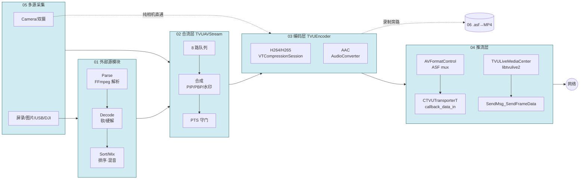

# TVUAnywhere iOS 直播管线调研 — 文档索引

> 调研对象：tvuanywhere_ios 仓库（行号基线：`share/DefaultTitle` 分支 commit `89e4c235a`，2026-06-12；01 文档及时间戳专题成文更早，行号可能有少量漂移）
>
> 范围：从外部源解析 → 合流合成 → 硬件编码 → Mux/推流的完整非 UI 链路，外加时间戳/时钟同步专题。

---

## 全链路一图流

---

## 文档清单（按管线模块）

| # | 文档 | 内容 | 核心代码目录 |
|---|---|---|---|
| 01 | [01-外部源模块-TVUExternalSource.md](./01-外部源模块-TVUExternalSource.md) | 解析/解码/队列/排序/混音 五层架构、类关系、线程模型 | `Transmitter/TVUExternalSource/` |
| 02 | [02-合流层-TVUAVStream.md](./02-合流层-TVUAVStream.md) | 8 路队列、4 线程、PIP/PBP 合成、过渡帧（已禁用）、PTS 守门、isNeedKeyFrame、编码入口 | `TVUAnywhereSDK/TVUAVStream/` |
| 03 | [03-编码层-TVUEncoder.md](./03-编码层-TVUEncoder.md) | VTCompressionSession 全参数（GOP=600 秒真相）、dts 计算与兜底、SPS/PPS、HDR、AAC、切源低码率重启 | `TVUAnywhereSDK/TVUEncoder/` |
| 04 | [04-推流层-Mux与Transport.md](./04-推流层-Mux与Transport.md) | 双链路（ASF/FFmpeg vs libtvulive2）、SEI、NTP 门槛、码率反馈闭环、传输库边界 | `TVUAnywhereSDK/TVUFormat/`、`TVUSEI/`、`transoprtlib/` |
| 05 | [05-多源采集入队.md](./05-多源采集入队.md) | 输入端补全：相机/双摄/屏录/图片/USB/DJI 各源采集→入队、源索引语义、入队丢错位帧 | `TVUScreenRecording/`、`TVUExternSourceLocalPicture/`、`Accsoon/`、`TVUAnywhere.mm` |
| 06 | [06-本地录制旁路.md](./06-本地录制旁路.md) | 两条录制路径、ASF mux、文件分段/容错、ASF→MP4 转换、录制vs直播来源对照 | `TVUAnywhereSDK/TVURecorder/` |

## 时间戳专题（横切视角）

| # | 文档 | 内容 |
|---|---|---|
| 1 | [时间戳专题/01-PTS设计逻辑分析.md](./时间戳专题/01-PTS设计逻辑分析.md) | Camera/三种外部源 PTS 来源、合并策略、切源场景、g_vstarttime 三大用途、OBS 对比、8 张时序图 |
| 2 | [时间戳专题/02-时间戳与时钟漂移调研.md](./时间戳专题/02-时间戳与时钟漂移调研.md) | SortQueueManager 排序时间戳、PTS 链路、Camera 时钟、NTP 漂移补偿与盲区 |
| 3 | [时间戳专题/03-时间戳设计评价.md](./时间戳专题/03-时间戳设计评价.md) | 亮点/脆弱点/重构建议/Review 提问清单 |
| 4 | [时间戳专题/04-NTP时钟同步-TVUHostTimer.md](./时间戳专题/04-NTP时钟同步-TVUHostTimer.md) | TVUHostTimer 接口、相对轴→UTC 绝对轴换算、ntpSynced 推流门槛、两层漂移补偿 |

## 方案（非源码分析）

| 文档 | 内容 |
|---|---|
| [方案/RTMP聚合转发-时间戳重算与PLL方案.md](./方案/RTMP聚合转发-时间戳重算与PLL方案.md) | RTMP Server 聚合转发的时间戳重算缺陷分析、单锚点方案、PLL 锁相环设计、Python 模拟（DJI RTMP 相关设计输入） |

---

## 建议阅读顺序

1. **建立静态模型**：01 → 02 → 03 → 04（顺着数据流读，每篇开头有上下游链接）
2. **理解动态时序**：时间戳专题 01 → 02
3. **重构/评审决策**：时间戳专题 03 + 各模块文档末尾的"风险/注意点"小节

## 关键事实速记

- 时间基准只有一个：`g_vstarttime`（首帧的 HostTime 秒值），视频 dts 与音频 pts 都减它，单位毫秒。它在三处互斥初始化（H264/H265 编码器、合流层入队），谁先处理首帧谁初始化。推到云端时再叠加 NTP 偏移抬到 UTC 绝对轴（见时间戳专题 04）。
- 编码器 GOP 配置为 600 **秒**：I 帧实际由业务事件（首帧/切源/切摄像头/R 端请求）驱动，不靠周期 GOP。
- 推流前置双门槛：`g_livestate && ntpSynced`。
- 外部源断帧无兜底：过渡帧机制在 `TVUAVStreamManager.mm:2584` 被硬禁用。
- 纯内置相机直播不经过合流层（`isOnlyBuildInCameraStream` 直通编码）。
