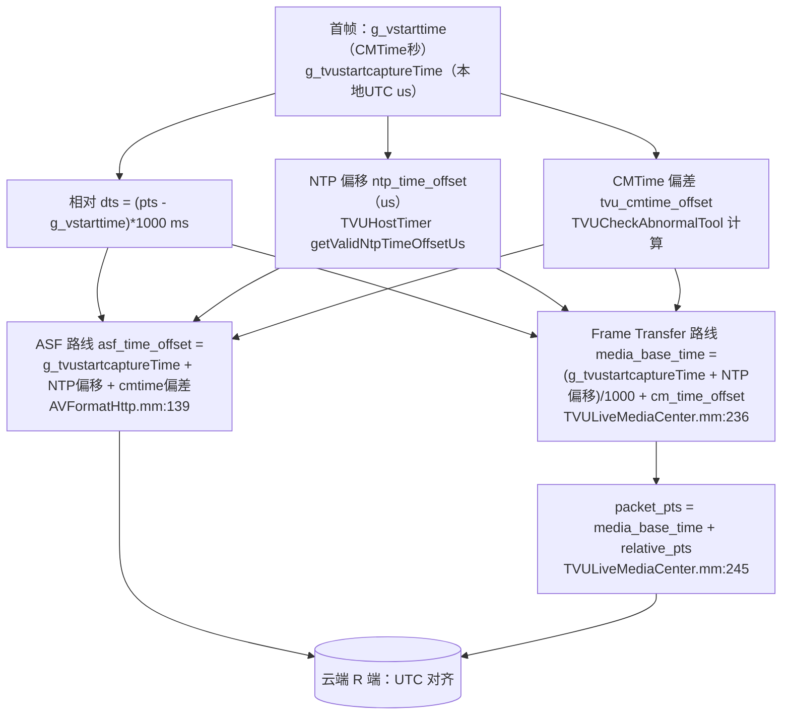

# NTP 时钟同步 — TVUHostTimer

> 基于 tvuanywhere_ios 仓库 `share/DefaultTitle` 分支（commit `89e4c235a`，2026-06-12）
>
> 📚 本文是时间戳专题的第 4 篇，补全前三篇反复提到、但未拆到内部的「NTP 偏移」与「绝对时间对齐」。
> 关联：[01-PTS设计逻辑分析.md](./01-PTS设计逻辑分析.md) ｜ [02-时间戳与时钟漂移调研.md](./02-时间戳与时钟漂移调研.md) ｜ 推流侧用法见 [../04-推流层-Mux与Transport.md](../04-推流层-Mux与Transport.md)

---

## 一、为什么需要它

前几篇确立了一条相对时间轴：`dts = (pts - g_vstarttime) * 1000`（ms，相对开播首帧）。但云端要把多设备、多次直播的流对齐，需要**绝对墙上时间（UTC）**。`TVUHostTimer` 干的就是：测出"本地时钟与真实 NTP 时间的偏差"，把相对轴抬到 UTC 轴。

---

## 二、TVUHostTimer 接口（TVUFormat/TVUHostTimer.h:12-56）

```objc
+ (long)getValidNtpTimeOffset;     // ms
+ (long)getValidNtpTimeOffsetUs;   // us
+ (BOOL)ntpSynced;                 // 是否已同步
+ (void)resetNtpTimeOffset;
+ (int64_t)convertToUTCTimestampWithSystemPTS:(int64_t)systemPTSMS;
```

底层偏移是 C 全局量（TVUHostTimer.mm:44-45）：

```c
extern long ntp_time_offset;      // NTP 真实时间 - 本地时钟（us）
extern long ntp_time_offset_now;  // 调试用
```

语义：`ntp_time_offset > 0` 表示本地时钟慢于真实时间。`== 0 或 1` 视为**未同步**，`getValidNtpTimeOffset*` 此时返回 0，`ntpSynced` 返回 NO。

---

## 三、同步实现与频率

- NTP 协议本身在静态库 `libntpclient.a`（头 `ntpclient.h` / `libtvu_ntp.h`）里，App 层看不到协议细节（与 transoprtlib 一样是黑盒）。
- `libtvu_ntp_start()`（TVUTimer.cpp:38）启动同步线程；`SynchTime()` 线程**每 5 秒**刷新一次 `ntp_time_offset`（TVUTimer.cpp:104-105）。
- 备选：可向 TVU 后端要时间（`TRANSPORT_MSG_GET_R_TIME`，TVUTimer.cpp:137-238）。

**关键推论：偏移是动态的**——同一次直播中 `getValidNtpTimeOffsetUs` 的返回值会随每 5 秒校准而变化，这正是长时间直播漂移补偿的基础（见 §六）。

---

## 四、时间基准初始化（三处互斥，本轮已核实）

`g_vstarttime`（首帧 CMTime 秒值）与 `g_tvustartcaptureTime`（首帧 `gettimeofday` 微秒）在**三处**赋值，靠 `if (g_tvustartcaptureTime == 0)` 守卫，谁先处理首帧谁初始化：

| 路径 | 文件:行号 | 备注 |
|---|---|---|
| H264 编码器首帧 | TVUVideoH264Encoder.mm:386,389 | 纯相机直通走这里 |
| H265 编码器首帧 | TVUVideoH265Encoder.mm:431,434 | 同上 |
| 合流层入队首帧 | TVUAVStreamManager.mm:2197,2200 | 多源模式走这里，且 mm:2208 多一步「倒推一帧 duration」校准 |

```cpp
// 编码器版本（H264Encoder.mm:382-390）
if (isFirstFrame && g_tvustartcaptureTime == 0) {
    g_vstarttime = CMTimeGetSeconds(pts);          // 相对设备启动的秒
    gettimeofday(&tv, NULL);
    g_tvustartcaptureTime = tv.tv_sec*1e6 + tv.tv_usec;  // 本地 UTC（us）
}
```

---

## 五、绝对时间换算链路



两条推流路线（04 文档）共用同一套 NTP 基础，只是单位不同：ASF 路线用微秒，Frame Transfer 用毫秒。

### CMTime 偏差补偿 tvu_cmtime_offset（TVUCheckAbnormalTool.mm:339-358）

锁屏/后台会让 CMTime 时钟与 gettimeofday 失步，于是：

```cpp
int64_t relative_media_time = (pts - g_vstarttime) * 1e6;          // CMTime 流逝
gettimeofday(&tv,NULL);
int64_t relative_sys_time = (tv.tv_sec*1e6+tv.tv_usec) - g_tvustartcaptureTime;  // 真实流逝
tvu_cmtime_offset = relative_sys_time - relative_media_time;       // 两者差
```

仅在 `tvu_baseTimeAdjustmentNeeded`（开播/状态变）时对首个视频帧算一次。

---

## 六、两道门槛与两层补偿

### 6.1 推流前置门槛 ntpSynced（AVFormatHttp.mm:312）

```cpp
if (g_livestate && [TVUHostTimer ntpSynced]) {
    if (!hadsendhead) Product_Data_Head(true);   // ASF 头含基准时间，只发一次
    CTVUTransporterT::callback_data_in(output, len, g_oTVUTransportT);
}
```

**未同步期间：编码照常，但数据不上网**。同步完成后才发 ASF 头（携带 `asf_time_offset`）再发帧——避免时间戳没对齐就推流导致云端跳变。

### 6.2 直播中 NTP 切换补偿 ntpLiveFaultTolerance

NTP 重新校准导致偏移突变时，避免帧时间戳跳跃：

```cpp
// TVUAnywhere.mm:4849-4854 —— 算增量
long time_offset = [TVUHostTimer getValidNtpTimeOffsetUs];
if (isEnableFrameTransfer && state == Living && self.lastNTPTimeOffset)
    self.ntpLiveFaultTolerance = time_offset - self.lastNTPTimeOffset;
else
    self.ntpLiveFaultTolerance = 0;

// TVUVideoH264Encoder.mm:401-405 —— 每帧 PTS 加补偿
if (faultTolerance) {
    CMTime rhs = CMTimeMake(faultTolerance, TVU_NTP_TIME_SCALE /*1e6*/);
    presentationTimeStamp = CMTimeAdd(presentationTimeStamp, rhs);
}
```

只在 Frame Transfer 模式应用；停播/重开时清零。

---

## 七、全局变量速查

| 变量 | 单位 | 含义 | 定义 |
|---|---|---|---|
| g_vstarttime | s | 首帧 CMTime 秒值（相对设备启动） | TVURecorder.mm:89 |
| g_tvustartcaptureTime | us | 首帧本地 UTC | CameraWriterVideoManager.mm:28 |
| ntp_time_offset | us | NTP 真实时间 − 本地时钟 | libntpclient 库 |
| tvu_cmtime_offset | us | 真实流逝 − CMTime 流逝（锁屏补偿） | TVUCheckAbnormalTool.mm:336 |
| asf_time_offset | us | ASF 路线基准（前三者之和） | AVFormatHttp.mm:139 |
| media_base_time | ms | Frame Transfer 路线基准 | TVULiveMediaCenter.mm:236 |
| ntpLiveFaultTolerance | us | 直播中 NTP 切换增量补偿 | TVUAnywhere.h:243 |
| lastNTPTimeOffset | us | 上次 NTP 偏移（算增量用） | TVUAnywhere.h:251 |

---

## 八、核心结论

1. **NTP 是推流的硬门槛、本地处理的软依赖**：没同步就不上网，但编码/录制照跑。
2. **偏移动态更新**（每 5s），长时直播靠 `ntpLiveFaultTolerance` 平滑切换增量，避免跳变——这与 [方案/RTMP聚合转发](../方案/RTMP聚合转发-时间戳重算与PLL方案.md) §4 的 PLL「缓慢修正 base」思路同源，只是这里是事件触发的一次性增量而非连续环路。
3. **两层补偿各管一摊**：`tvu_cmtime_offset` 管锁屏/后台的 CMTime 失步，`ntpLiveFaultTolerance` 管 NTP 重校准跳变。
4. **单基准贯穿**：ASF 与 Frame Transfer 两路共用 `g_tvustartcaptureTime + NTP 偏移`，保证两种推流模式下 UTC 对齐一致。
